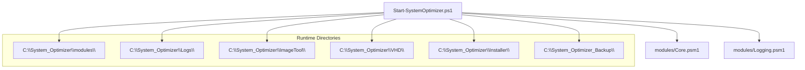
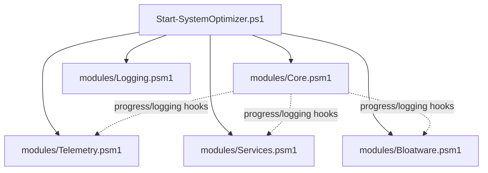
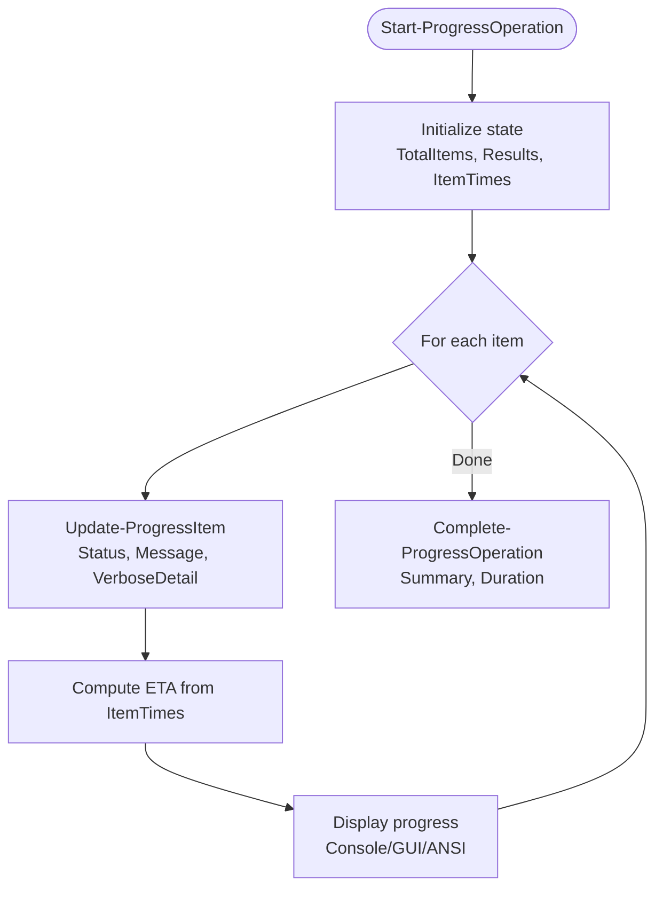
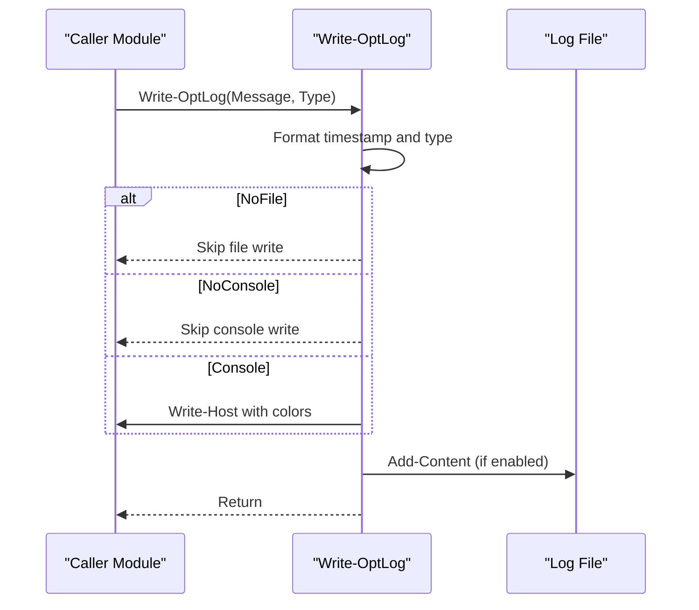
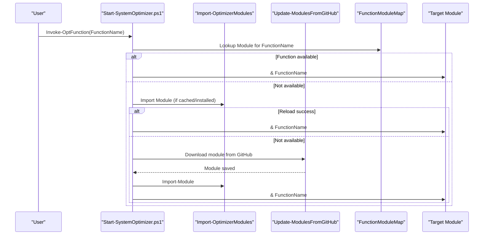
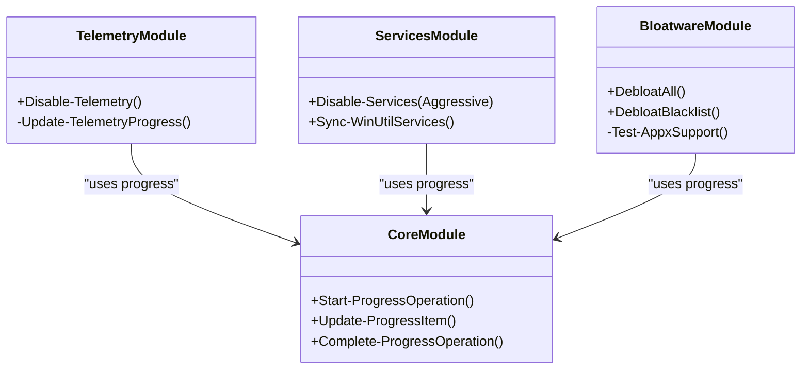
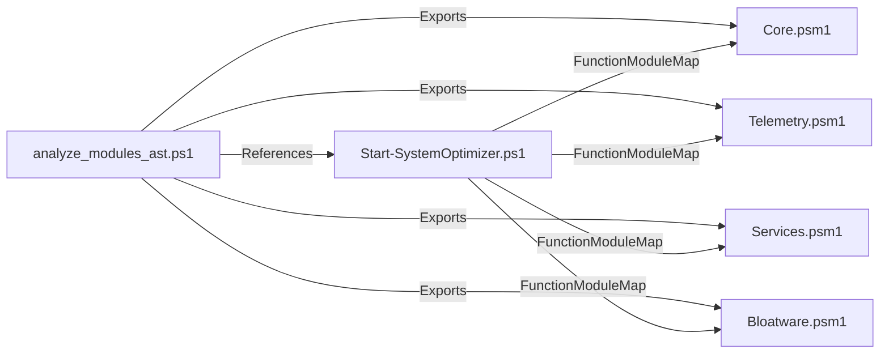
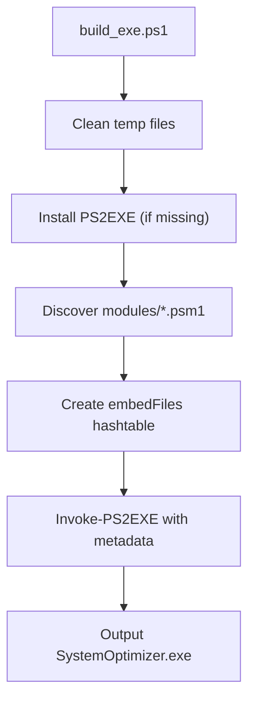
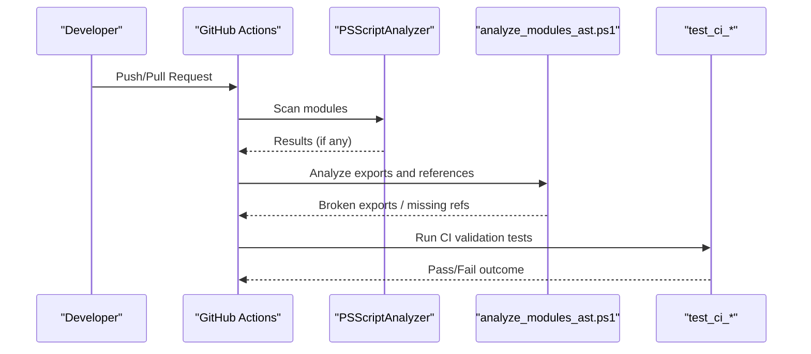
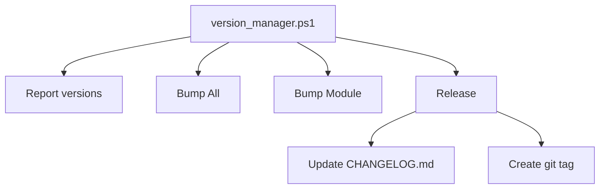

# Advanced Topics

<cite>
**Referenced Files in This Document**
- [Core.psm1](file://modules/Core.psm1)
- [Logging.psm1](file://modules/Logging.psm1)
- [Start-SystemOptimizer.ps1](file://Start-SystemOptimizer.ps1)
- [build_exe.ps1](file://scripts/build_exe.ps1)
- [version_manager.ps1](file://scripts/version_manager.ps1)
- [code-analysis.yml](file://.github/workflows/code-analysis.yml)
- [analyze_modules_ast.ps1](file://scripts/dev/analyze_modules_ast.ps1)
- [test_ci_validation.ps1](file://scripts/dev/test_ci_validation.ps1)
- [test_ci_final.ps1](file://scripts/dev/test_ci_final.ps1)
- [Telemetry.psm1](file://modules/Telemetry.psm1)
- [Services.psm1](file://modules/Services.psm1)
- [Bloatware.psm1](file://modules/Bloatware.psm1)
- [README.md](file://README.md)
- [STRUCTURE.md](file://docs/STRUCTURE.md)
- [FEATURES.md](file://docs/FEATURES.md)
</cite>

## Table of Contents
1. [Introduction](#introduction)
2. [Project Structure](#project-structure)
3. [Core Components](#core-components)
4. [Architecture Overview](#architecture-overview)
5. [Detailed Component Analysis](#detailed-component-analysis)
6. [Dependency Analysis](#dependency-analysis)
7. [Performance Considerations](#performance-considerations)
8. [Troubleshooting Guide](#troubleshooting-guide)
9. [Conclusion](#conclusion)
10. [Appendices](#appendices)

## Introduction
This document provides advanced guidance for developing PowerShell modules within the System Optimizer ecosystem. It focuses on the Core module’s foundational role, progress tracking and logging frameworks, download helpers, module development patterns, function export mechanisms, integration requirements, build and packaging with PS2EXE, automated testing and CI strategies, and extension points for adding new optimizations. It also covers advanced PowerShell techniques, security considerations for system-level operations, performance optimization strategies, debugging, error handling, and best practices for large-scale PowerShell projects.

## Project Structure
System Optimizer is organized around a modular PowerShell architecture with a central entry point, a Core module providing shared infrastructure, and numerous specialized modules. The runtime creates persistent directories for modules, logs, and tooling assets. The main entry script dynamically loads modules, manages updates, and orchestrates menu-driven workflows.

**Diagram sources**
- [Start-SystemOptimizer.ps1](file://Start-SystemOptimizer.ps1#L57-L67)
- [STRUCTURE.md](file://docs/STRUCTURE.md#L115-L128)

**Section sources**
- [README.md](file://README.md#L1-L88)
- [STRUCTURE.md](file://docs/STRUCTURE.md#L1-L159)
- [Start-SystemOptimizer.ps1](file://Start-SystemOptimizer.ps1#L57-L67)

## Core Components
This section documents the Core module’s role as the foundation for all other modules, including progress tracking, logging frameworks, and download helpers. It also outlines the main entry script’s module loader and orchestration responsibilities.

- Core module responsibilities:
  - Enhanced progress tracking with ETA calculation, verbose mode, and cross-host progress rendering (console, ISE, EXE).
  - Download helper with BITS and fallback WebClient progress, event-driven updates, and robust error handling.
  - Logging integration hooks for progress messages and standardized output formatting.
  - Utility functions for progress cleanup, mode switching, and progress bars.

- Logging module responsibilities:
  - Centralized logging with timestamps, colored console output, file retention, and structured sections.
  - Error logging with exception details and optional debug output gated by an environment variable.
  - Operation timing and summary reporting.

- Main entry script responsibilities:
  - UTF-8 encoding support and console sizing.
  - Dynamic module discovery and import with global scope and error handling.
  - Function availability mapping and safe invocation with automatic module reload or download prompts.
  - Update checking and module synchronization from GitHub with version caching.

**Section sources**
- [Core.psm1](file://modules/Core.psm1#L1-L869)
- [Logging.psm1](file://modules/Logging.psm1#L1-L285)
- [Start-SystemOptimizer.ps1](file://Start-SystemOptimizer.ps1#L1-L994)

## Architecture Overview
The System Optimizer architecture centers on a modular design where the main script loads modules dynamically, coordinates operations, and delegates to specialized modules. The Core module provides shared infrastructure for progress, logging, and downloads. The Logging module offers consistent logging semantics across components.

**Diagram sources**
- [Start-SystemOptimizer.ps1](file://Start-SystemOptimizer.ps1#L380-L434)
- [Core.psm1](file://modules/Core.psm1#L60-L251)
- [Logging.psm1](file://modules/Logging.psm1#L68-L123)
- [Telemetry.psm1](file://modules/Telemetry.psm1#L1-L200)
- [Services.psm1](file://modules/Services.psm1#L1-L200)
- [Bloatware.psm1](file://modules/Bloatware.psm1#L1-L200)

## Detailed Component Analysis

### Core Module: Progress Tracking, Logging, and Downloads
The Core module implements a robust progress tracking system with ETA estimation, verbose mode, and cross-environment rendering. It also provides a download helper that attempts BITS transfers first, falls back to WebClient with event-driven progress, and includes a final fallback to basic web requests. The module integrates with logging for consistent messaging.

**Diagram sources**
- [Core.psm1](file://modules/Core.psm1#L60-L251)

Key capabilities:
- Progress UI adapts to console, ISE, and EXE contexts with graceful fallbacks.
- Verbose mode enables detailed output for troubleshooting.
- Download helper supports BITS and WebClient with event-driven progress and speed calculation.
- Robust cleanup routines for progress displays and GUI forms.

**Section sources**
- [Core.psm1](file://modules/Core.psm1#L60-L251)
- [Core.psm1](file://modules/Core.psm1#L556-L696)

### Logging Module: Consistent Logging Across Modules
The Logging module provides centralized logging with:
- Timestamped entries and colored console output.
- File retention and automatic cleanup.
- Structured sections, success/warning/error handling, and optional debug output.
- Operation timing and summaries.

**Diagram sources**
- [Logging.psm1](file://modules/Logging.psm1#L68-L123)

**Section sources**
- [Logging.psm1](file://modules/Logging.psm1#L1-L285)

### Main Entry Script: Module Loader and Orchestration
The main script handles:
- UTF-8 encoding and console sizing.
- Dynamic module loading with global import and error handling.
- Function availability mapping and safe invocation with automatic reload or GitHub download prompts.
- Update checking and module synchronization with version caching.

**Diagram sources**
- [Start-SystemOptimizer.ps1](file://Start-SystemOptimizer.ps1#L575-L623)
- [Start-SystemOptimizer.ps1](file://Start-SystemOptimizer.ps1#L380-L474)

**Section sources**
- [Start-SystemOptimizer.ps1](file://Start-SystemOptimizer.ps1#L356-L474)
- [Start-SystemOptimizer.ps1](file://Start-SystemOptimizer.ps1#L480-L623)

### Example Modules: Telemetry, Services, Bloatware
These modules demonstrate the pattern of integrating with Core’s progress and logging systems, performing system-level operations, and providing user feedback.

- Telemetry module:
  - Uses progress tracking for privacy tweaks.
  - Updates progress per tweak with success/failure/skip handling.
  - Writes progress messages via Core’s progress system.

- Services module:
  - Supports safe and aggressive modes with distinct lists.
  - Integrates progress tracking for service operations.
  - Handles Windows Defender and Teams startup configuration.

- Bloatware module:
  - Provides compatibility helpers for AppX operations.
  - Uses progress tracking for bulk app removal.
  - Includes whitelisting and non-removable package handling.

**Diagram sources**
- [Telemetry.psm1](file://modules/Telemetry.psm1#L1-L200)
- [Services.psm1](file://modules/Services.psm1#L1-L200)
- [Bloatware.psm1](file://modules/Bloatware.psm1#L1-L200)
- [Core.psm1](file://modules/Core.psm1#L60-L251)

**Section sources**
- [Telemetry.psm1](file://modules/Telemetry.psm1#L1-L200)
- [Services.psm1](file://modules/Services.psm1#L1-L200)
- [Bloatware.psm1](file://modules/Bloatware.psm1#L1-L200)

## Dependency Analysis
The module system relies on:
- Core module exports for progress and logging APIs consumed by other modules.
- Main script’s function-to-module mapping to resolve invocations safely.
- AST-based validation to ensure all exported functions are defined and referenced.

**Diagram sources**
- [analyze_modules_ast.ps1](file://scripts/dev/analyze_modules_ast.ps1#L1-L222)
- [Start-SystemOptimizer.ps1](file://Start-SystemOptimizer.ps1#L480-L521)

**Section sources**
- [analyze_modules_ast.ps1](file://scripts/dev/analyze_modules_ast.ps1#L1-L222)
- [Start-SystemOptimizer.ps1](file://Start-SystemOptimizer.ps1#L480-L521)

## Performance Considerations
- Progress tracking:
  - Use ETA calculation based on moving averages of item durations to provide realistic estimates.
  - Enable verbose mode selectively for troubleshooting to avoid console spam.
- Downloads:
  - Prefer BITS when available for native progress and reliability; fall back to WebClient with event-driven updates.
  - Limit progress update frequency to reduce console overhead.
- Module loading:
  - Cache modules locally and version-match to minimize network fetches.
  - Use global import scope judiciously; ensure modules are designed for concurrent use.
- Logging:
  - Keep file writes minimal; rely on console output for frequent updates.
  - Use section markers and summaries to reduce noise while preserving context.

[No sources needed since this section provides general guidance]

## Troubleshooting Guide
Common issues and resolutions:
- Broken exports:
  - Use AST-based analyzer to detect exported functions that are not defined.
  - Fix missing definitions or remove broken exports.
- Missing references:
  - Validate that invoked functions are exported by their respective modules.
  - Update function-to-module mapping if new modules are introduced.
- Module load failures:
  - Review import errors and ensure dependencies are met.
  - Re-download modules from GitHub if version mismatch occurs.
- Progress UI artifacts:
  - Call cleanup routines to close lingering progress displays and dispose GUI resources.
- Logging anomalies:
  - Verify log retention and file permissions.
  - Use debug mode selectively to capture detailed exception information.

**Section sources**
- [analyze_modules_ast.ps1](file://scripts/dev/analyze_modules_ast.ps1#L128-L177)
- [Start-SystemOptimizer.ps1](file://Start-SystemOptimizer.ps1#L575-L623)
- [Core.psm1](file://modules/Core.psm1#L398-L479)
- [Logging.psm1](file://modules/Logging.psm1#L68-L123)

## Conclusion
The System Optimizer demonstrates a mature, modular PowerShell architecture centered on the Core module’s progress and logging infrastructure. By following established patterns—integrating with Core, exporting functions consistently, validating module health, and leveraging CI—the project maintains scalability and reliability. The provided build, versioning, and testing tooling ensures consistent releases and quality.

[No sources needed since this section summarizes without analyzing specific files]

## Appendices

### Build Process Using PS2EXE
The build script automates standalone EXE generation with embedded modules:
- Cleans temporary files.
- Installs PS2EXE if missing.
- Discovers all module files and embeds them.
- Builds the EXE with metadata and verbose output.

**Diagram sources**
- [build_exe.ps1](file://scripts/build_exe.ps1#L1-L80)

**Section sources**
- [build_exe.ps1](file://scripts/build_exe.ps1#L1-L80)

### Automated Testing and Continuous Integration
Automated checks validate module exports and references:
- PSScriptAnalyzer workflow scans modules for style and severity issues.
- AST analyzer validates exported functions and main script references.
- CI validation scripts simulate CI outcomes and report pass/fail conditions.

**Diagram sources**
- [.github/workflows/code-analysis.yml](file://.github/workflows/code-analysis.yml#L1-L26)
- [analyze_modules_ast.ps1](file://scripts/dev/analyze_modules_ast.ps1#L1-L222)
- [test_ci_validation.ps1](file://scripts/dev/test_ci_validation.ps1#L1-L32)
- [test_ci_final.ps1](file://scripts/dev/test_ci_final.ps1#L1-L31)

**Section sources**
- [.github/workflows/code-analysis.yml](file://.github/workflows/code-analysis.yml#L1-L26)
- [analyze_modules_ast.ps1](file://scripts/dev/analyze_modules_ast.ps1#L1-L222)
- [test_ci_validation.ps1](file://scripts/dev/test_ci_validation.ps1#L1-L32)
- [test_ci_final.ps1](file://scripts/dev/test_ci_final.ps1#L1-L31)

### Version Management
The version manager synchronizes versions across modules and the main script:
- Parses and bumps versions.
- Updates VERSION.json and module headers.
- Generates changelog entries and manages git tags.

**Diagram sources**
- [version_manager.ps1](file://scripts/version_manager.ps1#L1-L637)

**Section sources**
- [version_manager.ps1](file://scripts/version_manager.ps1#L1-L637)

### Creating Custom Modules Following Established Patterns
Guidance for extending System Optimizer:
- Define functions with clear scope and purpose.
- Integrate with Core’s progress system for long-running operations.
- Export functions via Export-ModuleMember and keep the export list current.
- Use Logging module for consistent messaging and error reporting.
- Validate module health with AST analyzer before merging.
- Keep module-specific configuration in module scope; avoid global state.
- Provide safety checks for system-level operations (e.g., AppX support, OS version compatibility).
- Document behavior, risks, and user prompts for interactive modules.

**Section sources**
- [Core.psm1](file://modules/Core.psm1#L60-L251)
- [Logging.psm1](file://modules/Logging.psm1#L68-L123)
- [analyze_modules_ast.ps1](file://scripts/dev/analyze_modules_ast.ps1#L128-L177)
- [Bloatware.psm1](file://modules/Bloatware.psm1#L19-L31)

### Security Considerations for System-Level Operations
- Always run with administrative privileges.
- Validate and sanitize inputs for registry edits and service management.
- Use safe wrappers for AppX operations and handle unsupported OS versions gracefully.
- Limit verbose debug output in production to reduce information disclosure.
- Prefer secure protocols for downloads and validate checksums when applicable.
- Implement rollback sessions for reversible changes.

**Section sources**
- [Start-SystemOptimizer.ps1](file://Start-SystemOptimizer.ps1#L6-L12)
- [Bloatware.psm1](file://modules/Bloatware.psm1#L19-L31)
- [Services.psm1](file://modules/Services.psm1#L175-L182)

### Best Practices for Large-Scale PowerShell Projects
- Use a Core module for shared infrastructure (progress, logging, downloads).
- Maintain a strict export contract and validate it regularly.
- Encapsulate system-level operations with safety checks and error handling.
- Keep modules cohesive and focused on single responsibilities.
- Use CI to enforce code quality and module health.
- Document module behavior, risks, and integration points.
- Adopt a versioning strategy with automated changelog updates.

**Section sources**
- [Core.psm1](file://modules/Core.psm1#L60-L251)
- [Logging.psm1](file://modules/Logging.psm1#L68-L123)
- [version_manager.ps1](file://scripts/version_manager.ps1#L1-L637)
- [analyze_modules_ast.ps1](file://scripts/dev/analyze_modules_ast.ps1#L1-L222)