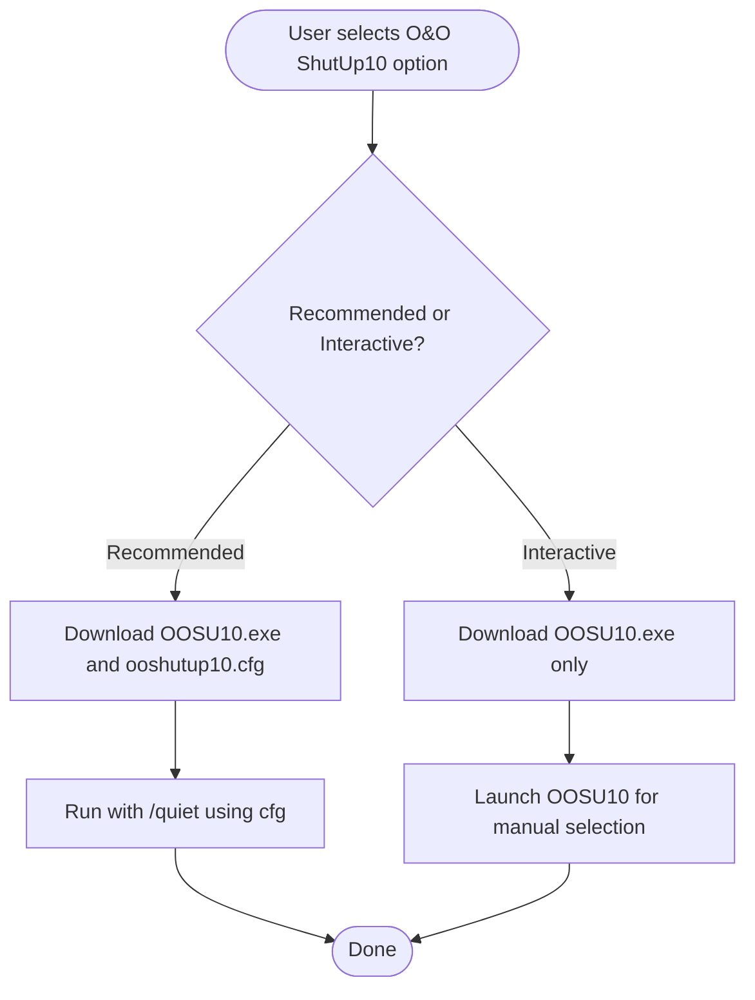

# Configuration Management

<cite>
**Referenced Files in This Document**
- [VERSION.json](file://configs/VERSION.json)
- [PatchMyPC.ini](file://configs/PatchMyPC.ini)
- [ooshutup10.cfg](file://configs/ooshutup10.cfg)
- [winget_packages.json](file://configs/winget_packages.json)
- [version_manager.ps1](file://scripts/version_manager.ps1)
- [Software.psm1](file://modules/Software.psm1)
- [Privacy.psm1](file://modules/Privacy.psm1)
- [Profiles.psm1](file://modules/Profiles.psm1)
- [Backup.psm1](file://modules/Backup.psm1)
- [Start-SystemOptimizer.ps1](file://Start-SystemOptimizer.ps1)
- [STRUCTURE.md](file://docs/STRUCTURE.md)
</cite>

## Table of Contents
1. [Introduction](#introduction)
2. [Project Structure](#project-structure)
3. [Core Components](#core-components)
4. [Architecture Overview](#architecture-overview)
5. [Detailed Component Analysis](#detailed-component-analysis)
6. [Dependency Analysis](#dependency-analysis)
7. [Performance Considerations](#performance-considerations)
8. [Troubleshooting Guide](#troubleshooting-guide)
9. [Conclusion](#conclusion)
10. [Appendices](#appendices)

## Introduction
This document explains the System Optimizer’s configuration management system with a focus on version management, preset configurations, and settings persistence. It covers:
- The VERSION.json system for centralized version tracking and update mechanisms
- Configuration file formats for software installation presets (PatchMyPC.ini), privacy tool settings (ooshutup10.cfg), and package management presets (winget_packages.json)
- The version_manager.ps1 script for automated version updates and release management
- Configuration file locations, syntax specifications, default values, and customization options
- Practical examples for modifying configurations for different use cases
- How configuration files relate to module functionality
- Backup, restoration, and troubleshooting of configuration issues

## Project Structure
System Optimizer organizes configuration files under the configs directory and integrates them into modules and runtime behavior. The main entry point initializes configuration and runtime directories, while modules consume configuration presets for software installation and privacy tool application.

**Diagram sources**
- [Start-SystemOptimizer.ps1](file://Start-SystemOptimizer.ps1#L57-L67)
- [STRUCTURE.md](file://docs/STRUCTURE.md#L12-L16)
- [Software.psm1](file://modules/Software.psm1#L48-L131)
- [Privacy.psm1](file://modules/Privacy.psm1#L5-L75)
- [Profiles.psm1](file://modules/Profiles.psm1#L11-L12)
- [Backup.psm1](file://modules/Backup.psm1#L68-L110)
- [version_manager.ps1](file://scripts/version_manager.ps1#L38-L39)

**Section sources**
- [STRUCTURE.md](file://docs/STRUCTURE.md#L1-L34)
- [Start-SystemOptimizer.ps1](file://Start-SystemOptimizer.ps1#L57-L67)

## Core Components
- VERSION.json: Centralized version manifest for the main script and all modules, including last updated timestamp and per-module versions.
- PatchMyPC.ini: Preset configuration for PatchMyPC software updater, enabling or disabling categories and applications.
- ooshutup10.cfg: Preset configuration for O&O ShutUp10 privacy tool, controlling telemetry, privacy, and Windows features.
- winget_packages.json: JSON-based package catalog and presets for Windows Package Manager (winget), grouped by category and named presets.
- version_manager.ps1: Automation tool to report, bump, sync, validate, and release versions across modules and main script, and to update VERSION.json and CHANGELOG.md.

**Section sources**
- [VERSION.json](file://configs/VERSION.json#L1-L34)
- [PatchMyPC.ini](file://configs/PatchMyPC.ini#L1-L376)
- [ooshutup10.cfg](file://configs/ooshutup10.cfg#L1-L246)
- [winget_packages.json](file://configs/winget_packages.json#L1-L108)
- [version_manager.ps1](file://scripts/version_manager.ps1#L1-L637)

## Architecture Overview
The configuration system is designed around:
- Centralized version control via VERSION.json and automation via version_manager.ps1
- Preset-driven integrations in modules (Software.psm1 and Privacy.psm1)
- Runtime directories and persistent storage for logs, modules, and backups
- Profiles.psm1 and Backup.psm1 managing user-defined and system-level preferences

**Diagram sources**
- [version_manager.ps1](file://scripts/version_manager.ps1#L43-L60)
- [Start-SystemOptimizer.ps1](file://Start-SystemOptimizer.ps1#L74-L139)
- [Software.psm1](file://modules/Software.psm1#L48-L131)
- [Privacy.psm1](file://modules/Privacy.psm1#L5-L75)

## Detailed Component Analysis

### VERSION.json System
- Purpose: Centralized version tracking for the main script and all modules, plus a last updated timestamp.
- Structure:
  - Version: Top-level semantic version
  - LastUpdated: ISO 8601 timestamp
  - Modules: Object keyed by module base name with version values
- Integration:
  - version_manager.ps1 reads and writes VERSION.json
  - Start-SystemOptimizer.ps1 checks for updates against GitHub raw content
- Default values:
  - Version initialized to a default if missing
  - Modules object initialized empty if missing
- Persistence:
  - Updated during release and sync operations

**Diagram sources**
- [version_manager.ps1](file://scripts/version_manager.ps1#L43-L60)

**Section sources**
- [VERSION.json](file://configs/VERSION.json#L1-L34)
- [version_manager.ps1](file://scripts/version_manager.ps1#L43-L60)
- [Start-SystemOptimizer.ps1](file://Start-SystemOptimizer.ps1#L74-L97)

### PatchMyPC.ini (Software Installation Presets)
- Purpose: Define which applications and plugins to include/exclude in PatchMyPC runs.
- Format:
  - Comments indicate categories and options
  - Lines prefixed with semicolon are commented out (disabled)
  - Unprefixed lines represent enabled applications/plugins
- Categories covered:
  - Options (general behavior toggles)
  - Plugins and Runtimes
  - Browsers
  - Multimedia
  - Utilities
  - Hardware Tools
  - Documents
  - Media Tools
  - Messaging
  - Developer tools
  - Microsoft Visual C++ Runtimes
  - Sharing
  - Graphics
  - Security
  - Miscellaneous
  - Gaming
  - Portable Apps
- Default values:
  - Many entries are commented out by default (disabled)
  - Enabling an entry requires removing the semicolon prefix
- Customization:
  - Toggle categories by commenting/uncommenting lines
  - Combine with winget_packages.json presets for a two-tier approach (PatchMyPC + winget)

**Diagram sources**
- [Software.psm1](file://modules/Software.psm1#L48-L131)

**Section sources**
- [PatchMyPC.ini](file://configs/PatchMyPC.ini#L1-L376)
- [Software.psm1](file://modules/Software.psm1#L48-L131)

### ooshutup10.cfg (Privacy Tool Settings)
- Purpose: Provide recommended privacy and telemetry settings for O&O ShutUp10.
- Format:
  - Commented header with tool metadata and import instructions
  - Lines with numeric identifiers and flags indicating enable/disable
  - Categories include Privacy, Activity History, App Privacy, Security, Edge, Synchronization, Cortana, Windows AI, Location Services, User Behavior, Windows Update, Explorer, Defender, Lock Screen, Mobile Devices, Search, Taskbar, Miscellaneous
- Default values:
  - Many entries are disabled by default (flag “-”)
  - Enabling entries uses flag “+”
- Customization:
  - Modify flags to adjust privacy posture
  - Use interactive mode to fine-tune selections

**Diagram sources**
- [Privacy.psm1](file://modules/Privacy.psm1#L5-L75)

**Section sources**
- [ooshutup10.cfg](file://configs/ooshutup10.cfg#L1-L246)
- [Privacy.psm1](file://modules/Privacy.psm1#L5-L75)

### winget_packages.json (Package Management Presets)
- Purpose: Define winget package catalogs and named presets for quick installation.
- Structure:
  - description and version metadata
  - packages object with categorized arrays (e.g., browsers, media, utilities, remote_desktop, development, runtimes, security, communication, gaming, documents, system, drivers)
  - presets object with named groups (e.g., essential, developer, runtimes_all, gaming)
- Default values:
  - Predefined lists of winget package IDs and human-readable names
  - Presets combine package IDs for common scenarios
- Customization:
  - Add/remove entries in categories
  - Create new presets or modify existing ones
  - Use module functions to apply presets

**Diagram sources**
- [Software.psm1](file://modules/Software.psm1#L110-L113)
- [winget_packages.json](file://configs/winget_packages.json#L82-L106)

**Section sources**
- [winget_packages.json](file://configs/winget_packages.json#L1-L108)
- [Software.psm1](file://modules/Software.psm1#L110-L113)

### version_manager.ps1 (Automated Version Updates and Release Management)
- Purpose: Manage versioning across modules and main script, synchronize VERSION.json, update CHANGELOG.md, and handle git tagging.
- Key capabilities:
  - Report: Show current version status across main script, VERSION.json, and modules
  - BumpModule: Increment a single module’s version and update VERSION.json
  - BumpAll: Increment all modules and main script version
  - Release: Create a release with optional version and message, update main script, VERSION.json, changelog, and git tag
  - Validate: Check consistency between files and VERSION.json, detect orphaned entries
  - Sync: Align VERSION.json with actual module versions and remove orphaned entries
  - Changelog: Preview changelog entry
- Integration:
  - Reads/writes VERSION.json
  - Updates module headers and main script version
  - Interacts with git for tagging and pushing

**Diagram sources**
- [version_manager.ps1](file://scripts/version_manager.ps1#L254-L441)

**Section sources**
- [version_manager.ps1](file://scripts/version_manager.ps1#L1-L637)

### Relationship Between Configuration Files and Module Functionality
- Software.psm1:
  - Downloads and runs PatchMyPC with either pre-selected or self-select configurations
  - Applies winget presets for essential, developer, runtimes, and gaming scenarios
  - Integrates with winget_packages.json to select package sets
- Privacy.psm1:
  - Downloads O&O ShutUp10 and applies ooshutup10.cfg in quiet mode
  - Supports interactive mode for manual selection
- Profiles.psm1:
  - Defines runtime profiles and stores active profile state
  - Uses registry tweaks and module action flags to apply optimized settings
- Backup.psm1:
  - Manages backup destinations and restore workflows
  - Provides auto-detection of external drives for backup storage

**Section sources**
- [Software.psm1](file://modules/Software.psm1#L48-L131)
- [Privacy.psm1](file://modules/Privacy.psm1#L5-L75)
- [Profiles.psm1](file://modules/Profiles.psm1#L11-L12)
- [Backup.psm1](file://modules/Backup.psm1#L68-L110)

## Dependency Analysis
- Centralized versioning depends on:
  - VERSION.json for module and main script version storage
  - version_manager.ps1 for parsing, updating, validating, and syncing versions
- Module integrations depend on:
  - PatchMyPC.ini for software selection in Software.psm1
  - ooshutup10.cfg for privacy settings in Privacy.psm1
  - winget_packages.json for package presets in Software.psm1
- Runtime directories:
  - Start-SystemOptimizer.ps1 defines persistent directories for logs, modules, and backups
  - Modules rely on these directories for caching and temporary operations

**Diagram sources**
- [version_manager.ps1](file://scripts/version_manager.ps1#L38-L39)
- [Start-SystemOptimizer.ps1](file://Start-SystemOptimizer.ps1#L57-L67)
- [Software.psm1](file://modules/Software.psm1#L48-L131)
- [Privacy.psm1](file://modules/Privacy.psm1#L5-L75)

**Section sources**
- [Start-SystemOptimizer.ps1](file://Start-SystemOptimizer.ps1#L57-L67)
- [version_manager.ps1](file://scripts/version_manager.ps1#L38-L39)

## Performance Considerations
- Version operations:
  - version_manager.ps1 performs file I/O and JSON serialization; batch operations (BumpAll) minimize repeated writes
  - Validation scans all modules; run selectively when diagnosing issues
- Configuration downloads:
  - Software.psm1 and Privacy.psm1 download external tools and configs; ensure reliable network connectivity
- Preset application:
  - winget package installations can be lengthy; use targeted presets (essential, developer) to reduce runtime

[No sources needed since this section provides general guidance]

## Troubleshooting Guide
- Version mismatch:
  - Use Validate action to compare main script, VERSION.json, and module versions
  - Use Sync action to align VERSION.json with actual module versions
- Missing or orphaned entries:
  - Validate will highlight missing module files for VERSION.json entries
  - Sync removes orphaned entries automatically
- Update availability:
  - Start-SystemOptimizer.ps1 checks for updates against GitHub raw content
  - If no internet or GitHub is unreachable, update checks silently fail
- Backup destinations:
  - Backup.psm1 supports default, custom, external drive auto-detection, and backup search
  - Ensure sufficient disk space and permissions for backup directories
- Privacy tool configuration:
  - ooshutup10.cfg uses flags “-” (disable) and “+” (enable); verify flags match desired behavior
- Software presets:
  - PatchMyPC.ini requires uncommenting entries to enable; verify entries are not commented out

**Section sources**
- [version_manager.ps1](file://scripts/version_manager.ps1#L443-L521)
- [Start-SystemOptimizer.ps1](file://Start-SystemOptimizer.ps1#L74-L97)
- [Backup.psm1](file://modules/Backup.psm1#L68-L110)
- [Privacy.psm1](file://modules/Privacy.psm1#L5-L75)
- [Software.psm1](file://modules/Software.psm1#L48-L131)

## Conclusion
System Optimizer’s configuration management centers on a robust VERSION.json system and automation via version_manager.ps1, complemented by preset-driven integrations in Software.psm1 and Privacy.psm1. PatchMyPC.ini, ooshutup10.cfg, and winget_packages.json provide flexible, customizable presets for software installation and privacy hardening. The system supports version consistency, release management, and operational reliability through runtime directories and backup/restore workflows.

[No sources needed since this section summarizes without analyzing specific files]

## Appendices

### Configuration Locations and Defaults
- VERSION.json
  - Location: configs/VERSION.json
  - Default Version: Initialized if missing
  - Default Modules: Empty object if missing
- PatchMyPC.ini
  - Location: configs/PatchMyPC.ini
  - Defaults: Many entries commented out (disabled)
- ooshutup10.cfg
  - Location: configs/ooshutup10.cfg
  - Defaults: Many entries disabled (“-” flag)
- winget_packages.json
  - Location: configs/winget_packages.json
  - Defaults: Predefined categories and presets

**Section sources**
- [VERSION.json](file://configs/VERSION.json#L1-L34)
- [PatchMyPC.ini](file://configs/PatchMyPC.ini#L1-L376)
- [ooshutup10.cfg](file://configs/ooshutup10.cfg#L1-L246)
- [winget_packages.json](file://configs/winget_packages.json#L1-L108)

### Example Customization Scenarios
- Enable additional browsers in PatchMyPC.ini:
  - Uncomment browser entries in the Browsers section
- Add developer tools via winget presets:
  - Use the developer preset in Software.psm1 to install PowerShell, Python, Git, VS Code, Windows Terminal, and .NET runtimes
- Apply privacy hardening with O&O ShutUp10:
  - Use the recommended settings mode to apply ooshutup10.cfg quietly
- Create a custom profile:
  - Extend Profiles.psm1 with new profile actions and registry tweaks

**Section sources**
- [Software.psm1](file://modules/Software.psm1#L48-L131)
- [Privacy.psm1](file://modules/Privacy.psm1#L5-L75)
- [Profiles.psm1](file://modules/Profiles.psm1#L17-L200)