# Core Architecture

<cite>
**Referenced Files in This Document**
- [README.md](file://README.md)
- [Start-SystemOptimizer.ps1](file://Start-SystemOptimizer.ps1)
- [Core.psm1](file://modules/Core.psm1)
- [Logging.psm1](file://modules/Logging.psm1)
- [Telemetry.psm1](file://modules/Telemetry.psm1)
- [Services.psm1](file://modules/Services.psm1)
- [Privacy.psm1](file://modules/Privacy.psm1)
- [Software.psm1](file://modules/Software.psm1)
- [WindowsUpdate.psm1](file://modules/WindowsUpdate.psm1)
- [Installer.psm1](file://modules/Installer.psm1)
- [VERSION.json](file://configs/VERSION.json)
- [build_exe.ps1](file://scripts/build_exe.ps1)
- [version_manager.ps1](file://scripts/version_manager.ps1)
- [STRUCTURE.md](file://docs/STRUCTURE.md)
</cite>

## Table of Contents
1. [Introduction](#introduction)
2. [Project Structure](#project-structure)
3. [Core Components](#core-components)
4. [Architecture Overview](#architecture-overview)
5. [Detailed Component Analysis](#detailed-component-analysis)
6. [Dependency Analysis](#dependency-analysis)
7. [Performance Considerations](#performance-considerations)
8. [Troubleshooting Guide](#troubleshooting-guide)
9. [Conclusion](#conclusion)

## Introduction
This document describes the System Optimizer core architecture with a focus on its modular design and system organization. The toolkit comprises 27 PowerShell modules orchestrated by a central main script, providing a menu-driven interface for Windows 10/11 optimization. The architecture emphasizes:
- Modular PowerShell module system for functional separation
- Centralized coordination via the main orchestrator script
- Menu-driven interface with safety and progress tracking
- Integration with external tools (O&O ShutUp10, WinNTSetup, PatchMyPC, Winget)
- Version management and executable compilation

## Project Structure
The project follows a clear separation of concerns:
- Start-SystemOptimizer.ps1: Main entry point and orchestrator
- modules/: 27 specialized functional modules implementing discrete capabilities
- configs/: Configuration and version metadata
- scripts/: Build and development utilities
- tools/: Third-party utilities bundled for convenience
- docs/: Documentation and feature references

**Diagram sources**
- [Start-SystemOptimizer.ps1](file://Start-SystemOptimizer.ps1#L1-L994)
- [Core.psm1](file://modules/Core.psm1#L1-L869)
- [Logging.psm1](file://modules/Logging.psm1#L1-L285)
- [Telemetry.psm1](file://modules/Telemetry.psm1#L1-L503)
- [Services.psm1](file://modules/Services.psm1#L1-L712)
- [Privacy.psm1](file://modules/Privacy.psm1#L1-L206)
- [Software.psm1](file://modules/Software.psm1#L1-L921)
- [WindowsUpdate.psm1](file://modules/WindowsUpdate.psm1#L1-L382)
- [Installer.psm1](file://modules/Installer.psm1#L1-L833)
- [VERSION.json](file://configs/VERSION.json#L1-L34)
- [build_exe.ps1](file://scripts/build_exe.ps1#L1-L80)
- [version_manager.ps1](file://scripts/version_manager.ps1#L1-L637)

**Section sources**
- [STRUCTURE.md](file://docs/STRUCTURE.md#L1-L159)
- [README.md](file://README.md#L1-L88)

## Core Components
The core components are:
- Main Orchestrator (Start-SystemOptimizer.ps1): Handles configuration, module loading, menu rendering, progress tracking, logging, and update management.
- Core Module (Core.psm1): Provides progress tracking, ETA calculation, download helpers, and unified progress UI.
- Logging Module (Logging.psm1): Centralized logging with timestamps, colorized output, and retention policies.
- Functional Modules: Specialized modules for telemetry, services, privacy, software, Windows Update, and deployment.

Key orchestration responsibilities:
- Module discovery and dynamic loading
- Function availability validation and fallback
- Menu generation and navigation
- Progress and logging integration
- External tool integration and downloads

**Section sources**
- [Start-SystemOptimizer.ps1](file://Start-SystemOptimizer.ps1#L1-L994)
- [Core.psm1](file://modules/Core.psm1#L1-L869)
- [Logging.psm1](file://modules/Logging.psm1#L1-L285)

## Architecture Overview
The system uses a layered architecture:
- Presentation Layer: Menu-driven interface with colorized output and progress indicators
- Orchestration Layer: Main script coordinates modules and manages runtime state
- Domain Layer: Functional modules encapsulate specific optimization domains
- Integration Layer: Downloads and launches external tools
- Infrastructure Layer: Logging, versioning, and build tooling

**Diagram sources**
- [Start-SystemOptimizer.ps1](file://Start-SystemOptimizer.ps1#L626-L994)
- [Core.psm1](file://modules/Core.psm1#L60-L510)
- [Logging.psm1](file://modules/Logging.psm1#L18-L285)
- [Privacy.psm1](file://modules/Privacy.psm1#L5-L75)
- [Installer.psm1](file://modules/Installer.psm1#L97-L800)

## Detailed Component Analysis

### Main Orchestrator Script
The main orchestrator script serves as the central coordinator:
- Configuration management and environment detection
- Module loading with persistence and caching
- Menu-driven interface with availability checks
- Progress tracking delegation to Core module
- Logging initialization and structured output
- External tool downloads and integration
- Version checking and update mechanism

**Diagram sources**
- [Start-SystemOptimizer.ps1](file://Start-SystemOptimizer.ps1#L571-L994)
- [Core.psm1](file://modules/Core.psm1#L60-L251)

**Section sources**
- [Start-SystemOptimizer.ps1](file://Start-SystemOptimizer.ps1#L1-L994)

### Core Module: Progress and Download Management
The Core module provides:
- Progress tracking with ETA calculations
- Unified progress UI supporting console and GUI
- Download helpers with progress bars and fallbacks
- Verbose mode for detailed output
- Enhanced progress cleanup and resource management

```mermaid
flowchart TD
Start([Start Operation]) --> Init["Initialize Progress State<br/>Set Total Items"]
Init --> Loop{"Processing Items"}
Loop --> |Next Item| Update["Update Progress Item<br/>Track Time Per Item"]
Update --> CalcETA["Calculate ETA<br/>Average Time × Remaining"]
CalcETA --> Display["Display Progress<br/>Console/GUI"]
Display --> Loop
Loop --> |Complete| Complete["Complete Operation<br/>Show Summary"]
Complete --> Cleanup["Ensure Cleanup<br/>Close Progress UI"]
Cleanup --> End([End])
```

**Diagram sources**
- [Core.psm1](file://modules/Core.psm1#L60-L251)

**Section sources**
- [Core.psm1](file://modules/Core.psm1#L1-L869)

### Logging Module: Centralized Logging
The Logging module ensures consistent logging across all components:
- Structured log entries with timestamps and severity
- Colorized console output with severity indicators
- File retention policies (30-day default)
- Debug mode support via environment variable
- Operation timing and completion logging

**Section sources**
- [Logging.psm1](file://modules/Logging.psm1#L1-L285)

### Functional Modules Integration

#### Telemetry Module
Focuses on privacy and telemetry controls:
- 35+ privacy tweaks including advertising, activity feed, and telemetry
- Windows 10/11 specific optimizations
- Performance enhancements and data collection controls
- Copilot and Recall disablement

#### Services Module
Provides service optimization with safety modes:
- Safe mode: ~45 services (telemetry, Xbox, Hyper-V guest)
- Aggressive mode: ~90 services (print, search, RDP, camera)
- Teams startup control
- WinUtil service synchronization

#### Privacy Module
Integrates external privacy tools:
- O&O ShutUp10 launcher with recommended settings
- Advanced debloat scripts for telemetry blocking
- Privacy-focused debloater integration

#### Software Module
Manages software installation and package managers:
- PatchMyPC integration with pre-selected and self-select modes
- Winget preset installations (essential, runtimes, developer, gaming)
- Chocolatey integration
- Remote desktop tools (RustDesk, AnyDesk)

#### Windows Update Module
Controls Windows Update lifecycle:
- Pause updates with registry and scheduled task methods
- Service enable/disable
- PowerShell-based update installation
- Driver update management
- Repair utilities for broken components

#### Installer Module
Handles Windows deployment:
- Disk preparation with diskpart scripting
- Single/dual disk layouts (GPT/UEFI)
- Windows deployment from ISO/WIM
- Quick install workflow
- WinNTSetup integration

**Section sources**
- [Telemetry.psm1](file://modules/Telemetry.psm1#L1-L503)
- [Services.psm1](file://modules/Services.psm1#L1-L712)
- [Privacy.psm1](file://modules/Privacy.psm1#L1-L206)
- [Software.psm1](file://modules/Software.psm1#L1-L921)
- [WindowsUpdate.psm1](file://modules/WindowsUpdate.psm1#L1-L382)
- [Installer.psm1](file://modules/Installer.psm1#L1-L833)

### External Tool Integration Patterns
System Optimizer integrates with external tools through standardized patterns:
- Download and caching with progress indication
- Configuration file management for tools requiring presets
- Process launching with proper working directories
- Shortcut creation for installed tools
- Version-specific tool management

**Diagram sources**
- [Privacy.psm1](file://modules/Privacy.psm1#L26-L75)
- [Software.psm1](file://modules/Software.psm1#L48-L131)
- [Installer.psm1](file://modules/Installer.psm1#L715-L775)

## Dependency Analysis
The system exhibits clear module boundaries with controlled dependencies:

**Diagram sources**
- [Start-SystemOptimizer.ps1](file://Start-SystemOptimizer.ps1#L380-L474)
- [Core.psm1](file://modules/Core.psm1#L1-L869)
- [Logging.psm1](file://modules/Logging.psm1#L1-L285)
- [Privacy.psm1](file://modules/Privacy.psm1#L1-L206)
- [Software.psm1](file://modules/Software.psm1#L1-L921)
- [WindowsUpdate.psm1](file://modules/WindowsUpdate.psm1#L1-L382)
- [Installer.psm1](file://modules/Installer.psm1#L1-L833)
- [version_manager.ps1](file://scripts/version_manager.ps1#L1-L637)
- [VERSION.json](file://configs/VERSION.json#L1-L34)
- [build_exe.ps1](file://scripts/build_exe.ps1#L1-L80)

**Section sources**
- [Start-SystemOptimizer.ps1](file://Start-SystemOptimizer.ps1#L380-L474)
- [version_manager.ps1](file://scripts/version_manager.ps1#L1-L637)

## Performance Considerations
Performance characteristics and optimizations:
- Console progress with ANSI color support for modern terminals
- GUI progress fallback for EXE scenarios
- Download progress with bandwidth estimation
- ETA calculation using moving averages
- Minimal memory footprint through module-based design
- Cached module loading to avoid repeated imports
- Asynchronous downloads with event handlers

Cross-cutting concerns:
- Security: Administrator privilege requirement, module validation, and safe function invocation
- Error handling: Graceful degradation when modules are unavailable, detailed error logging
- Reliability: Automatic cleanup of progress UI, robust download fallbacks

## Troubleshooting Guide
Common issues and resolutions:
- Module loading failures: Use function availability checks and automatic reloading
- Progress UI conflicts: Ensure cleanup of progress resources
- External tool download failures: Fallback to basic web requests
- Permission issues: Verify administrator privileges for system-level operations
- Version mismatches: Use version manager to synchronize component versions

**Section sources**
- [Start-SystemOptimizer.ps1](file://Start-SystemOptimizer.ps1#L575-L623)
- [Core.psm1](file://modules/Core.psm1#L398-L480)
- [version_manager.ps1](file://scripts/version_manager.ps1#L443-L521)

## Conclusion
System Optimizer demonstrates a well-architected modular PowerShell solution with:
- Clear separation of concerns across 27 specialized modules
- Centralized orchestration with robust menu-driven interface
- Comprehensive progress tracking and logging
- Strategic integration with proven external tools
- Automated version management and executable compilation
- Strong emphasis on reliability, safety, and user experience

The architecture supports both scripted and standalone execution, provides extensive customization through profiles and presets, and maintains operational transparency through detailed logging and progress reporting.