# Development and Build

<cite>
**Referenced Files in This Document**
- [README.md](file://README.md)
- [CHANGELOG.md](file://CHANGELOG.md)
- [Start-SystemOptimizer.ps1](file://Start-SystemOptimizer.ps1)
- [run_optimization.bat](file://run_optimization.bat)
- [scripts/build_exe.ps1](file://scripts/build_exe.ps1)
- [scripts/version_manager.ps1](file://scripts/version_manager.ps1)
- [.github/workflows/code-analysis.yml](file://.github/workflows/code-analysis.yml)
- [scripts/dev/run_analysis.ps1](file://scripts/dev/run_analysis.ps1)
- [scripts/dev/analyze_modules.ps1](file://scripts/dev/analyze_modules.ps1)
- [scripts/dev/analyze_modules_ast.ps1](file://scripts/dev/analyze_modules_ast.ps1)
- [scripts/dev/fix_analyzer_issues.ps1](file://scripts/dev/fix_analyzer_issues.ps1)
- [scripts/dev/test_ci_validation.ps1](file://scripts/dev/test_ci_validation.ps1)
- [scripts/dev/test_ci_final.ps1](file://scripts/dev/test_ci_final.ps1)
- [configs/VERSION.json](file://configs/VERSION.json)
- [modules/Core.psm1](file://modules/Core.psm1)
- [modules/Telemetry.psm1](file://modules/Telemetry.psm1)
- [modules/Services.psm1](file://modules/Services.psm1)
</cite>

## Update Summary
**Changes Made**
- Added new section for the automated module analysis tool (analyze_modules.ps1)
- Updated Development Utilities section to include the new analysis tool
- Enhanced CI/CD Pipeline section to reflect the new analysis capabilities
- Updated Development Workflow Checklist to include the new analysis tool

## Table of Contents
1. [Introduction](#introduction)
2. [Project Structure](#project-structure)
3. [Core Components](#core-components)
4. [Architecture Overview](#architecture-overview)
5. [Detailed Component Analysis](#detailed-component-analysis)
6. [Dependency Analysis](#dependency-analysis)
7. [Performance Considerations](#performance-considerations)
8. [Troubleshooting Guide](#troubleshooting-guide)
9. [Conclusion](#conclusion)
10. [Appendices](#appendices)

## Introduction
This document provides comprehensive development and build guidance for System Optimizer. It covers local development setup, build processes for standalone executables, version management, CI/CD integration, testing and quality assurance, best practices, and release management. It also includes debugging and performance profiling techniques to support efficient development and maintenance.

## Project Structure
System Optimizer is organized around a modular PowerShell architecture with a main entry point, a launcher script, a build pipeline for standalone executables, a version manager, and a CI/CD workflow for code quality. Supporting assets include configuration files, documentation, and development utilities.

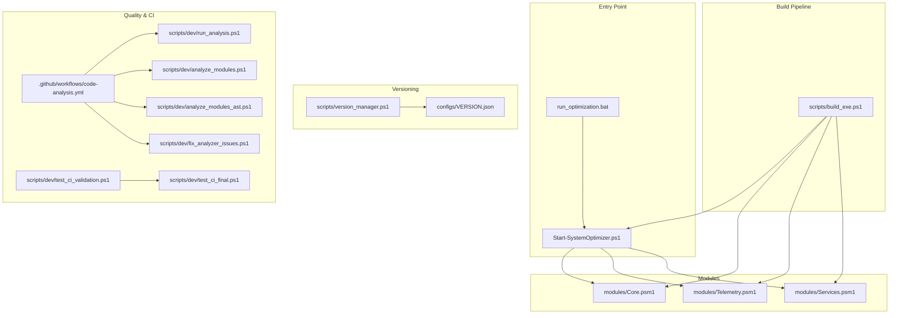

**Diagram sources**
- [Start-SystemOptimizer.ps1](file://Start-SystemOptimizer.ps1#L1-L994)
- [run_optimization.bat](file://run_optimization.bat#L1-L176)
- [scripts/build_exe.ps1](file://scripts/build_exe.ps1#L1-L80)
- [scripts/version_manager.ps1](file://scripts/version_manager.ps1#L1-L637)
- [.github/workflows/code-analysis.yml](file://.github/workflows/code-analysis.yml#L1-L26)
- [scripts/dev/run_analysis.ps1](file://scripts/dev/run_analysis.ps1#L1-L384)
- [scripts/dev/analyze_modules.ps1](file://scripts/dev/analyze_modules.ps1#L1-L19)
- [scripts/dev/analyze_modules_ast.ps1](file://scripts/dev/analyze_modules_ast.ps1#L1-L222)
- [scripts/dev/fix_analyzer_issues.ps1](file://scripts/dev/fix_analyzer_issues.ps1#L1-L222)
- [scripts/dev/test_ci_validation.ps1](file://scripts/dev/test_ci_validation.ps1#L1-L32)
- [scripts/dev/test_ci_final.ps1](file://scripts/dev/test_ci_final.ps1#L1-L31)
- [configs/VERSION.json](file://configs/VERSION.json#L1-L34)
- [modules/Core.psm1](file://modules/Core.psm1#L1-L200)
- [modules/Telemetry.psm1](file://modules/Telemetry.psm1#L1-L200)
- [modules/Services.psm1](file://modules/Services.psm1#L1-L200)

**Section sources**
- [README.md](file://README.md#L1-L88)
- [CHANGELOG.md](file://CHANGELOG.md#L1-L69)

## Core Components
- Main entry point: Orchestrates modules, logging, console UI, and module loading. Supports both script and embedded EXE execution.
- Launcher: Provides multiple launch methods and non-interactive runs for quick operations.
- Build pipeline: Generates a standalone executable with embedded modules using a PowerShell-to-EXE tool.
- Version manager: Centralizes versioning across the main script, modules, and changelog; supports bumping, validation, and tagging.
- CI/CD workflow: Enforces code quality via PSScriptAnalyzer on pushes and pull requests.
- Development utilities: Enhanced analysis tool, automated module analysis, AST-based checks, CI validation tests, and issue fixing tools.

**Section sources**
- [Start-SystemOptimizer.ps1](file://Start-SystemOptimizer.ps1#L1-L994)
- [run_optimization.bat](file://run_optimization.bat#L1-L176)
- [scripts/build_exe.ps1](file://scripts/build_exe.ps1#L1-L80)
- [scripts/version_manager.ps1](file://scripts/version_manager.ps1#L1-L637)
- [.github/workflows/code-analysis.yml](file://.github/workflows/code-analysis.yml#L1-L26)
- [scripts/dev/run_analysis.ps1](file://scripts/dev/run_analysis.ps1#L1-L384)
- [scripts/dev/analyze_modules.ps1](file://scripts/dev/analyze_modules.ps1#L1-L19)
- [scripts/dev/analyze_modules_ast.ps1](file://scripts/dev/analyze_modules_ast.ps1#L1-L222)
- [scripts/dev/fix_analyzer_issues.ps1](file://scripts/dev/fix_analyzer_issues.ps1#L1-L222)
- [scripts/dev/test_ci_validation.ps1](file://scripts/dev/test_ci_validation.ps1#L1-L32)
- [scripts/dev/test_ci_final.ps1](file://scripts/dev/test_ci_final.ps1#L1-L31)
- [configs/VERSION.json](file://configs/VERSION.json#L1-L34)

## Architecture Overview
The system follows a modular design where the main script dynamically loads PowerShell modules (.psm1). It supports two execution modes:
- Script mode: Loads modules from disk or GitHub.
- Embedded EXE mode: Bundles modules into a single executable for zero-dependency deployment.

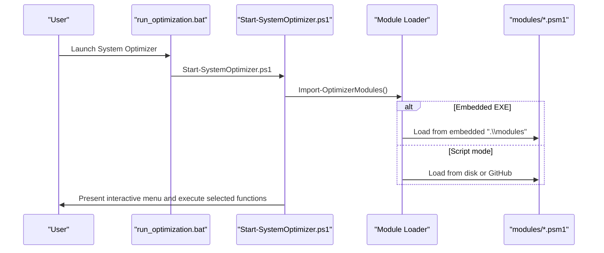

**Diagram sources**
- [run_optimization.bat](file://run_optimization.bat#L1-L176)
- [Start-SystemOptimizer.ps1](file://Start-SystemOptimizer.ps1#L380-L474)

**Section sources**
- [Start-SystemOptimizer.ps1](file://Start-SystemOptimizer.ps1#L380-L474)
- [run_optimization.bat](file://run_optimization.bat#L1-L176)

## Detailed Component Analysis

### Automated Module Analysis (analyze_modules.ps1)
**New Feature** Purpose:
- Provides automated PSScriptAnalyzer integration for systematic module analysis.
- Offers structured issue reporting with color-coded output and critical issue filtering.
- Simplifies batch analysis of all module files with minimal configuration.

Key behaviors:
- Requires PSScriptAnalyzer module for operation.
- Scans all .psm1 files in the modules directory.
- Filters out WriteHost and ShouldProcess related issues.
- Displays issues in table format with RuleName, Line, and Message.
- Provides clear "No critical issues found" indicator when modules pass analysis.

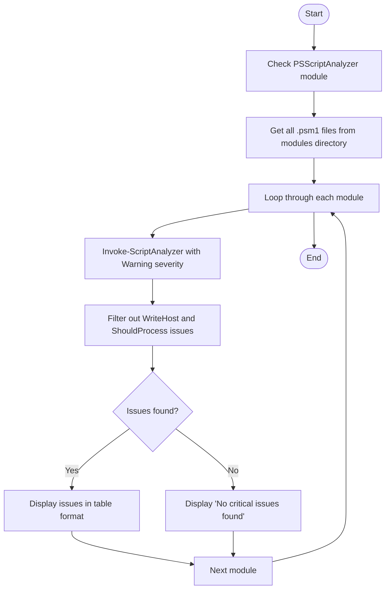

**Diagram sources**
- [scripts/dev/analyze_modules.ps1](file://scripts/dev/analyze_modules.ps1#L1-L19)

**Section sources**
- [scripts/dev/analyze_modules.ps1](file://scripts/dev/analyze_modules.ps1#L1-L19)

### Build Executable (build_exe.ps1)
Purpose:
- Builds a standalone executable embedding the main script and all modules.
- Handles prerequisites (installing the PowerShell-to-EXE module), cleaning temporary files, and reporting build outcomes.

Key behaviors:
- Cleans temp directories.
- Ensures the required module is available.
- Embeds all module files into the executable.
- Outputs build status and file size.

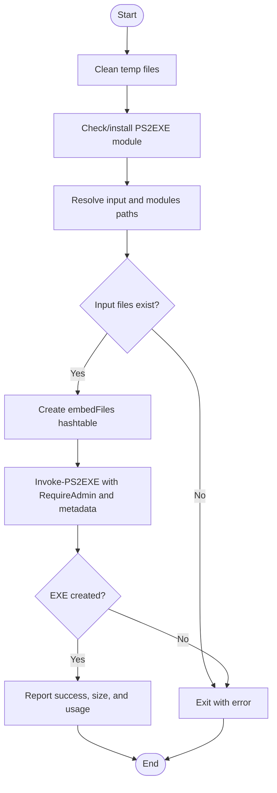

**Diagram sources**
- [scripts/build_exe.ps1](file://scripts/build_exe.ps1#L1-L80)

**Section sources**
- [scripts/build_exe.ps1](file://scripts/build_exe.ps1#L1-L80)

### Version Manager (version_manager.ps1)
Purpose:
- Centralizes versioning across the main script, modules, and changelog.
- Provides actions for reporting, bumping, releasing, validating, syncing, and changelog preview.

Key behaviors:
- Reads/writes VERSION.json for module and top-level versions.
- Parses and bumps semantic versions.
- Updates main script version and synchronizes module versions.
- Generates changelog entries and manages git tags and pushes.
- Validates consistency across files and git tags.

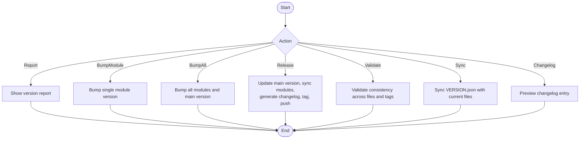

**Diagram sources**
- [scripts/version_manager.ps1](file://scripts/version_manager.ps1#L1-L637)
- [configs/VERSION.json](file://configs/VERSION.json#L1-L34)

**Section sources**
- [scripts/version_manager.ps1](file://scripts/version_manager.ps1#L1-L637)
- [configs/VERSION.json](file://configs/VERSION.json#L1-L34)

### CI/CD Pipeline (GitHub Actions)
Purpose:
- Enforce code quality by running PSScriptAnalyzer against modules on every push and pull request to main.

Key behaviors:
- Checks out the repository.
- Installs PSScriptAnalyzer.
- Runs analysis on the modules directory recursively with Error and Warning severity.
- Prints results and exits with appropriate status.

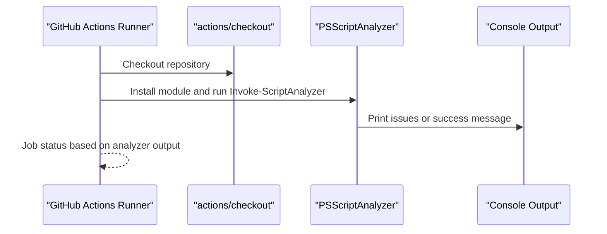

**Diagram sources**
- [.github/workflows/code-analysis.yml](file://.github/workflows/code-analysis.yml#L1-L26)

**Section sources**
- [.github/workflows/code-analysis.yml](file://.github/workflows/code-analysis.yml#L1-L26)

### Development Utilities (Enhanced Analysis Suite)
**Updated** Purpose:
- Provide comprehensive code quality checks, compatibility verification, automated analysis, AST-based checks, and CI validation helpers.

Key behaviors:
- Enhanced PSScriptAnalyzer runner with multiple modes (Full, Quick, ErrorsOnly, AutoFix, Compatibility).
- Automated module analysis tool for systematic batch processing.
- AST-based analysis for accurate function definition and export validation.
- Auto-fix trailing whitespace across module files.
- Group issues by rule type and generate markdown reports.
- CI validation scripts check for broken exports and missing references.

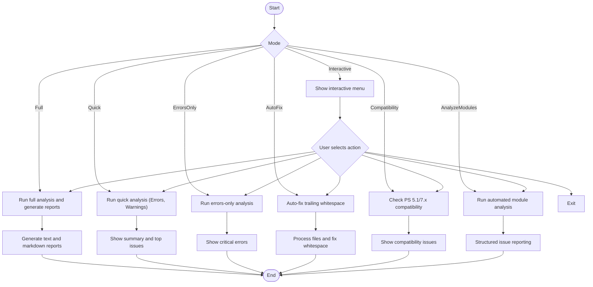

**Diagram sources**
- [scripts/dev/run_analysis.ps1](file://scripts/dev/run_analysis.ps1#L1-L384)
- [scripts/dev/analyze_modules.ps1](file://scripts/dev/analyze_modules.ps1#L1-L19)
- [scripts/dev/analyze_modules_ast.ps1](file://scripts/dev/analyze_modules_ast.ps1#L1-L222)
- [scripts/dev/fix_analyzer_issues.ps1](file://scripts/dev/fix_analyzer_issues.ps1#L1-L222)
- [scripts/dev/test_ci_validation.ps1](file://scripts/dev/test_ci_validation.ps1#L1-L32)
- [scripts/dev/test_ci_final.ps1](file://scripts/dev/test_ci_final.ps1#L1-L31)

**Section sources**
- [scripts/dev/run_analysis.ps1](file://scripts/dev/run_analysis.ps1#L1-L384)
- [scripts/dev/analyze_modules.ps1](file://scripts/dev/analyze_modules.ps1#L1-L19)
- [scripts/dev/analyze_modules_ast.ps1](file://scripts/dev/analyze_modules_ast.ps1#L1-L222)
- [scripts/dev/fix_analyzer_issues.ps1](file://scripts/dev/fix_analyzer_issues.ps1#L1-L222)
- [scripts/dev/test_ci_validation.ps1](file://scripts/dev/test_ci_validation.ps1#L1-L32)
- [scripts/dev/test_ci_final.ps1](file://scripts/dev/test_ci_final.ps1#L1-L31)

### Launcher (run_optimization.bat)
Purpose:
- Provide multiple launch methods and non-interactive runs for quick operations.
- Elevate to administrator privileges when needed.

Key behaviors:
- Cleans temp files.
- Requests elevation if not running as admin.
- Presents a menu with options to launch modular version, run specific optimizations, or launch specialized workflows.

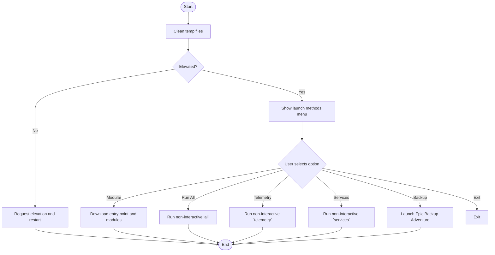

**Diagram sources**
- [run_optimization.bat](file://run_optimization.bat#L1-L176)

**Section sources**
- [run_optimization.bat](file://run_optimization.bat#L1-L176)

### Main Entry Point (Start-SystemOptimizer.ps1)
Purpose:
- Central orchestrator for UI, logging, module loading, and function invocation.
- Supports update checking, logging initialization, console sizing, and dynamic module loading.

Key behaviors:
- UTF-8 encoding setup and console configuration.
- Update availability checks against GitHub.
- Logging to persistent directories with automatic cleanup.
- Dynamic module loader with fallback to GitHub downloads.
- Safe function caller with module mapping and reload logic.

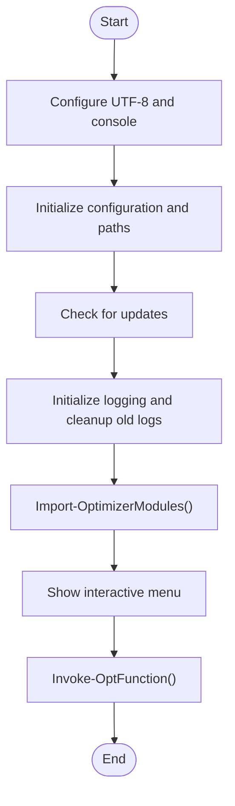

**Diagram sources**
- [Start-SystemOptimizer.ps1](file://Start-SystemOptimizer.ps1#L1-L994)

**Section sources**
- [Start-SystemOptimizer.ps1](file://Start-SystemOptimizer.ps1#L1-L994)

### Example Modules (Core, Telemetry, Services)
Purpose:
- Demonstrate module structure and integration with the main entry point.

Highlights:
- Core module: Enhanced progress tracking system with ETA calculations and verbose mode.
- Telemetry module: Comprehensive privacy and telemetry disabling with progress updates.
- Services module: Safe and aggressive service disabling lists with optional Windows Defender adjustments.

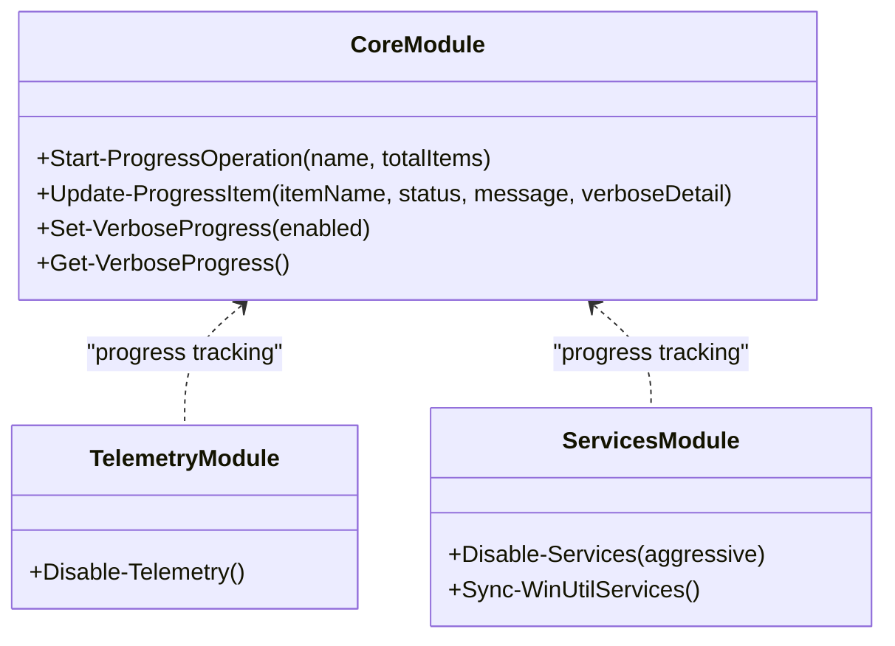

**Diagram sources**
- [modules/Core.psm1](file://modules/Core.psm1#L1-L200)
- [modules/Telemetry.psm1](file://modules/Telemetry.psm1#L1-L200)
- [modules/Services.psm1](file://modules/Services.psm1#L1-L200)

**Section sources**
- [modules/Core.psm1](file://modules/Core.psm1#L1-L200)
- [modules/Telemetry.psm1](file://modules/Telemetry.psm1#L1-L200)
- [modules/Services.psm1](file://modules/Services.psm1#L1-L200)

## Dependency Analysis
- Entry point depends on:
  - Module loader for dynamic imports.
  - Logging subsystem for persistent logs.
  - Console configuration for UI.
- Build pipeline depends on:
  - PowerShell-to-EXE module.
  - Presence of modules directory.
- Version manager depends on:
  - VERSION.json for module version tracking.
  - Git for tagging and pushing releases.
- CI workflow depends on:
  - PSScriptAnalyzer module.
  - Modules directory structure.
- Development utilities depend on:
  - PSScriptAnalyzer module for analysis.
  - Modules directory for scanning.
  - Reports directory for output generation.

```mermaid
graph TB
Main["Start-SystemOptimizer.ps1"] --> Loader["Module Loader"]
Main --> Logger["Logging"]
Main --> Console["Console Config"]
Build["scripts/build_exe.ps1"] --> PS2EXE["PS2EXE Module"]
Build --> Modules["modules/*"]
VersionMgr["scripts/version_manager.ps1"] --> VersionJSON["configs/VERSION.json"]
VersionMgr --> Git["Git Tags/Push"]
CI["code-analysis.yml"] --> Analyzer["PSScriptAnalyzer"]
CI --> Modules
DevRun["scripts/dev/run_analysis.ps1"] --> Analyzer
DevRun --> Reports["Reports Directory"]
AnalyzeMods["scripts/dev/analyze_modules.ps1"] --> Analyzer
AnalyzeAST["scripts/dev/analyze_modules_ast.ps1"] --> Analyzer
FixIssues["scripts/dev/fix_analyzer_issues.ps1"] --> Analyzer
DevRun --> Reports
```

**Diagram sources**
- [Start-SystemOptimizer.ps1](file://Start-SystemOptimizer.ps1#L1-L994)
- [scripts/build_exe.ps1](file://scripts/build_exe.ps1#L1-L80)
- [scripts/version_manager.ps1](file://scripts/version_manager.ps1#L1-L637)
- [.github/workflows/code-analysis.yml](file://.github/workflows/code-analysis.yml#L1-L26)
- [scripts/dev/run_analysis.ps1](file://scripts/dev/run_analysis.ps1#L1-L384)
- [scripts/dev/analyze_modules.ps1](file://scripts/dev/analyze_modules.ps1#L1-L19)
- [scripts/dev/analyze_modules_ast.ps1](file://scripts/dev/analyze_modules_ast.ps1#L1-L222)
- [scripts/dev/fix_analyzer_issues.ps1](file://scripts/dev/fix_analyzer_issues.ps1#L1-L222)
- [configs/VERSION.json](file://configs/VERSION.json#L1-L34)

**Section sources**
- [Start-SystemOptimizer.ps1](file://Start-SystemOptimizer.ps1#L1-L994)
- [scripts/build_exe.ps1](file://scripts/build_exe.ps1#L1-L80)
- [scripts/version_manager.ps1](file://scripts/version_manager.ps1#L1-L637)
- [.github/workflows/code-analysis.yml](file://.github/workflows/code-analysis.yml#L1-L26)
- [scripts/dev/run_analysis.ps1](file://scripts/dev/run_analysis.ps1#L1-L384)
- [scripts/dev/analyze_modules.ps1](file://scripts/dev/analyze_modules.ps1#L1-L19)
- [scripts/dev/analyze_modules_ast.ps1](file://scripts/dev/analyze_modules_ast.ps1#L1-L222)
- [scripts/dev/fix_analyzer_issues.ps1](file://scripts/dev/fix_analyzer_issues.ps1#L1-L222)
- [configs/VERSION.json](file://configs/VERSION.json#L1-L34)

## Performance Considerations
- Progress tracking: The Core module's progress system calculates ETA based on per-item timing, reducing perceived wait times and improving user feedback.
- Console sizing: The entry point sets buffer and window sizes to optimize readability and reduce scrolling overhead.
- Module caching: The module loader caches modules locally and validates versions to avoid repeated downloads.
- Build size: The build script reports embedded module count and executable size to monitor bundle impact.
- Analysis efficiency: The automated module analysis tool processes all modules in a streamlined loop with minimal overhead.

**Section sources**
- [modules/Core.psm1](file://modules/Core.psm1#L1-L200)
- [Start-SystemOptimizer.ps1](file://Start-SystemOptimizer.ps1#L356-L375)
- [scripts/build_exe.ps1](file://scripts/build_exe.ps1#L69-L77)
- [scripts/dev/analyze_modules.ps1](file://scripts/dev/analyze_modules.ps1#L1-L19)

## Troubleshooting Guide
Common issues and resolutions:
- Module load failures:
  - The entry point attempts to reload modules or download missing ones from GitHub when a function is unavailable.
  - Use the version manager to validate and synchronize versions if inconsistencies occur.
- Administrative privileges:
  - The launcher elevates automatically; ensure UAC prompts are accepted.
- Update conflicts:
  - The entry point checks for newer versions and can download updates to a persistent directory.
- Logging:
  - Logs are written to a persistent directory and automatically cleaned after 30 days.
- CI failures:
  - Use the development analysis tool to identify and fix issues before committing.
  - The automated module analysis tool provides quick batch processing for systematic issue identification.
  - CI validation scripts can simulate failure conditions for export and reference checks.
- PSScriptAnalyzer installation:
  - The enhanced analysis tool automatically installs PSScriptAnalyzer if not present.
  - Manual installation may be required for the automated module analysis tool.

**Section sources**
- [Start-SystemOptimizer.ps1](file://Start-SystemOptimizer.ps1#L575-L623)
- [scripts/version_manager.ps1](file://scripts/version_manager.ps1#L443-L521)
- [scripts/dev/run_analysis.ps1](file://scripts/dev/run_analysis.ps1#L1-L384)
- [scripts/dev/analyze_modules.ps1](file://scripts/dev/analyze_modules.ps1#L1-L19)
- [scripts/dev/test_ci_validation.ps1](file://scripts/dev/test_ci_validation.ps1#L1-L32)
- [scripts/dev/test_ci_final.ps1](file://scripts/dev/test_ci_final.ps1#L1-L31)

## Conclusion
System Optimizer's development and build system emphasizes modularity, automation, and quality. The main entry point integrates logging, module loading, and UI orchestration. The build pipeline produces a standalone executable with embedded modules. The version manager centralizes versioning and release preparation. The CI/CD workflow enforces code quality, while development utilities streamline analysis, validation, and automated module processing. The new automated module analysis tool enhances the development toolkit with systematic batch processing capabilities. Together, these components support efficient development, reliable releases, and robust operations.

## Appendices

### Development Workflow Checklist
- Install PSScriptAnalyzer and run the analysis tool in interactive or full mode.
- Use the automated module analysis tool for systematic batch processing of all modules.
- Validate versions with the version manager and ensure consistency across files and tags.
- Build the executable locally to verify embedded modules and size.
- Trigger CI to validate code quality and module references.
- Review logs and reports generated by the analysis tool.
- Use AST-based analysis for advanced function validation and export checking.

**Section sources**
- [scripts/dev/run_analysis.ps1](file://scripts/dev/run_analysis.ps1#L1-L384)
- [scripts/dev/analyze_modules.ps1](file://scripts/dev/analyze_modules.ps1#L1-L19)
- [scripts/dev/analyze_modules_ast.ps1](file://scripts/dev/analyze_modules_ast.ps1#L1-L222)
- [scripts/version_manager.ps1](file://scripts/version_manager.ps1#L1-L637)
- [scripts/build_exe.ps1](file://scripts/build_exe.ps1#L1-L80)
- [.github/workflows/code-analysis.yml](file://.github/workflows/code-analysis.yml#L1-L26)

### Best Practices and Contribution Guidelines
- Keep modules cohesive and focused on single responsibilities.
- Use the progress tracking system for long-running operations to improve UX.
- Maintain consistent versioning using the version manager.
- Run PSScriptAnalyzer regularly and address warnings and errors.
- Use the automated module analysis tool for systematic quality checks.
- Keep CHANGELOG.md updated with meaningful release notes.
- Use the launcher for reproducible environments and non-interactive runs.
- Leverage AST-based analysis for advanced validation of module exports and function references.

**Section sources**
- [CHANGELOG.md](file://CHANGELOG.md#L1-L69)
- [scripts/version_manager.ps1](file://scripts/version_manager.ps1#L1-L637)
- [scripts/dev/run_analysis.ps1](file://scripts/dev/run_analysis.ps1#L1-L384)
- [scripts/dev/analyze_modules.ps1](file://scripts/dev/analyze_modules.ps1#L1-L19)
- [scripts/dev/analyze_modules_ast.ps1](file://scripts/dev/analyze_modules_ast.ps1#L1-L222)

### Release Process and Distribution
- Use the version manager to bump versions, generate changelog entries, and create git tags.
- Build the standalone executable locally to validate distribution artifacts.
- Distribute the executable and supporting modules as part of releases.
- Ensure persistent directories for logs and backups are respected post-installation.
- Use automated analysis tools to validate module quality before release.

**Section sources**
- [scripts/version_manager.ps1](file://scripts/version_manager.ps1#L360-L441)
- [scripts/build_exe.ps1](file://scripts/build_exe.ps1#L1-L80)
- [README.md](file://README.md#L1-L88)