# Examples and Tutorials

<cite>
**Referenced Files in This Document**
- [README.md](file://README.md)
- [Start-SystemOptimizer.ps1](file://Start-SystemOptimizer.ps1)
- [run_optimization.bat](file://run_optimization.bat)
- [Core.psm1](file://modules/Core.psm1)
- [Privacy.psm1](file://modules/Privacy.psm1)
- [Bloatware.psm1](file://modules/Bloatware.psm1)
- [Services.psm1](file://modules/Services.psm1)
- [Tasks.psm1](file://modules/Tasks.psm1)
- [Registry.psm1](file://modules/Registry.psm1)
- [Software.psm1](file://modules/Software.psm1)
- [Profiles.psm1](file://modules/Profiles.psm1)
- [Backup.psm1](file://modules/Backup.psm1)
- [Rollback.psm1](file://modules/Rollback.psm1)
- [VHDDeploy.psm1](file://modules/VHDDeploy.psm1)
- [Help.psm1](file://modules/Help.psm1)
</cite>

## Table of Contents
1. [Introduction](#introduction)
2. [Project Structure](#project-structure)
3. [Core Components](#core-components)
4. [Architecture Overview](#architecture-overview)
5. [Detailed Component Analysis](#detailed-component-analysis)
6. [Dependency Analysis](#dependency-analysis)
7. [Performance Considerations](#performance-considerations)
8. [Troubleshooting Guide](#troubleshooting-guide)
9. [Conclusion](#conclusion)
10. [Appendices](#appendices)

## Introduction
This document provides practical examples and tutorials for the System Optimizer toolkit. It focuses on real-world optimization workflows, automation patterns, and best practices for daily maintenance, privacy enhancements, system cleanup, software management, and deployment automation. It also covers advanced scenarios such as multi-system deployment, custom optimization profiles, and enterprise rollout strategies. Guidance is grounded in the repository’s modules and entry points to ensure reproducible, reliable results.

## Project Structure
The System Optimizer is delivered as a modular PowerShell toolkit with:
- An entry script that initializes configuration, logging, module loading, and the interactive menu
- A launcher batch file for quick, non-interactive runs
- A set of specialized modules covering privacy, services, bloatware, registry, networking, software, profiles, backup/rollback, and deployment

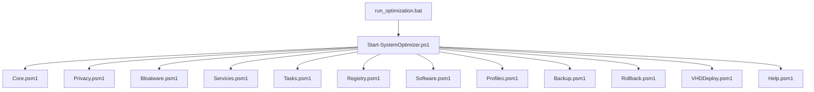

**Diagram sources**
- [Start-SystemOptimizer.ps1](file://Start-SystemOptimizer.ps1#L1-L994)
- [run_optimization.bat](file://run_optimization.bat#L1-L176)
- [Core.psm1](file://modules/Core.psm1#L1-L869)
- [Privacy.psm1](file://modules/Privacy.psm1#L1-L206)
- [Bloatware.psm1](file://modules/Bloatware.psm1#L1-L1328)
- [Services.psm1](file://modules/Services.psm1#L1-L712)
- [Tasks.psm1](file://modules/Tasks.psm1#L1-L75)
- [Registry.psm1](file://modules/Registry.psm1#L1-L213)
- [Software.psm1](file://modules/Software.psm1#L1-L921)
- [Profiles.psm1](file://modules/Profiles.psm1#L1-L917)
- [Backup.psm1](file://modules/Backup.psm1#L1-L1471)
- [Rollback.psm1](file://modules/Rollback.psm1#L1-L1339)
- [VHDDeploy.psm1](file://modules/VHDDeploy.psm1#L1-L711)
- [Help.psm1](file://modules/Help.psm1#L1-L265)

**Section sources**
- [README.md](file://README.md#L1-L88)
- [Start-SystemOptimizer.ps1](file://Start-SystemOptimizer.ps1#L1-L994)
- [run_optimization.bat](file://run_optimization.bat#L1-L176)

## Core Components
- Entry and orchestration: Initializes configuration, logging, module loading, and the interactive menu
- Core optimization engine: Provides progress tracking, download helpers, and composite workflows
- Specialized modules: Privacy, services, bloatware, registry, networking, software, profiles, backup/rollback, and deployment
- Batch launcher: Offers quick non-interactive runs and smart module download

Key capabilities:
- Automated module discovery and download
- Centralized logging and progress reporting
- Rollback session tracking and generation of undo scripts
- VHD-native-boot deployment pipeline
- Profile-driven optimization workflows

**Section sources**
- [Start-SystemOptimizer.ps1](file://Start-SystemOptimizer.ps1#L57-L139)
- [Core.psm1](file://modules/Core.psm1#L698-L791)
- [Rollback.psm1](file://modules/Rollback.psm1#L29-L78)
- [VHDDeploy.psm1](file://modules/VHDDeploy.psm1#L96-L689)

## Architecture Overview
The system follows a modular architecture:
- Entry script loads configuration and modules dynamically
- Each module encapsulates a domain-specific optimization
- Core module provides shared infrastructure (progress, logging, downloads)
- Rollback module tracks changes and generates undo scripts
- Deployment module supports VHD creation and boot menu integration

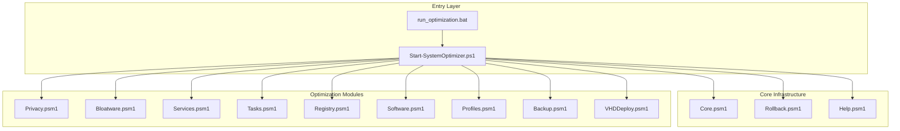

**Diagram sources**
- [Start-SystemOptimizer.ps1](file://Start-SystemOptimizer.ps1#L1-L994)
- [run_optimization.bat](file://run_optimization.bat#L1-L176)
- [Core.psm1](file://modules/Core.psm1#L1-L869)
- [Rollback.psm1](file://modules/Rollback.psm1#L1-L1339)
- [Help.psm1](file://modules/Help.psm1#L1-L265)
- [Privacy.psm1](file://modules/Privacy.psm1#L1-L206)
- [Bloatware.psm1](file://modules/Bloatware.psm1#L1-L1328)
- [Services.psm1](file://modules/Services.psm1#L1-L712)
- [Tasks.psm1](file://modules/Tasks.psm1#L1-L75)
- [Registry.psm1](file://modules/Registry.psm1#L1-L213)
- [Software.psm1](file://modules/Software.psm1#L1-L921)
- [Profiles.psm1](file://modules/Profiles.psm1#L1-L917)
- [Backup.psm1](file://modules/Backup.psm1#L1-L1471)
- [VHDDeploy.psm1](file://modules/VHDDeploy.psm1#L1-L711)

## Detailed Component Analysis

### Fresh Installation Setup
Goal: Perform a full system optimization immediately after OS installation.

Recommended steps:
- Run the entry script with elevated privileges
- Apply the “Full Setup” workflow to install software, Office, and re-optimize services
- Choose a profile aligned with intended use (e.g., Gaming, Developer, Office)

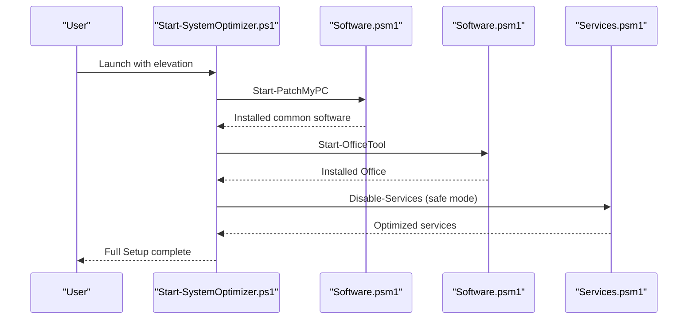

Best practices:
- Use the “Full Setup” workflow for a guided, validated sequence
- Review module descriptions via the help system before applying
- Create a restore point prior to major changes

**Section sources**
- [Start-SystemOptimizer.ps1](file://Start-SystemOptimizer.ps1#L744-L791)
- [Software.psm1](file://modules/Software.psm1#L5-L131)
- [Services.psm1](file://modules/Services.psm1#L5-L192)
- [Help.psm1](file://modules/Help.psm1#L104-L232)

### Daily Maintenance Routine
Goal: Keep the system optimized with minimal effort.

Recommended steps:
- Run telemetry and privacy modules
- Remove bloatware (standard or aggressive)
- Apply registry and network optimizations
- Run scheduled task cleanup
- Verify status and review logs

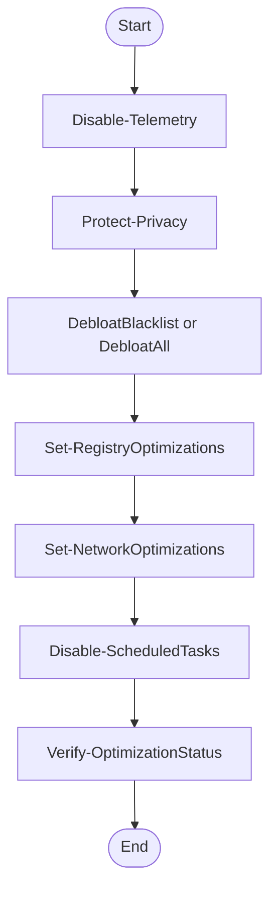

Automation tips:
- Use the batch launcher to run non-interactively
- Schedule the batch with Task Scheduler for recurring tasks

**Section sources**
- [Privacy.psm1](file://modules/Privacy.psm1#L5-L75)
- [Bloatware.psm1](file://modules/Bloatware.psm1#L196-L427)
- [Registry.psm1](file://modules/Registry.psm1#L5-L207)
- [Tasks.psm1](file://modules/Tasks.psm1#L5-L69)
- [run_optimization.bat](file://run_optimization.bat#L83-L129)

### Privacy Enhancement
Goal: Harden privacy and reduce telemetry.

Recommended steps:
- Launch O&O ShutUp10 with recommended settings
- Apply advanced debloat and privacy tweaks
- Disable background apps and telemetry-related services
- Review and adjust scheduled tasks

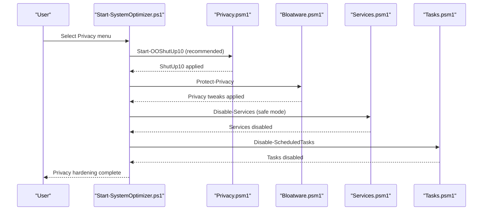

**Section sources**
- [Privacy.psm1](file://modules/Privacy.psm1#L5-L75)
- [Bloatware.psm1](file://modules/Bloatware.psm1#L567-L706)
- [Services.psm1](file://modules/Services.psm1#L5-L192)
- [Tasks.psm1](file://modules/Tasks.psm1#L5-L69)

### System Cleanup
Goal: Free disk space and improve performance.

Recommended steps:
- Run maintenance and cleanup modules
- Remove bloatware and leftover registry keys
- Disable prefetch and superfetch on SSDs
- Optimize registry settings for performance

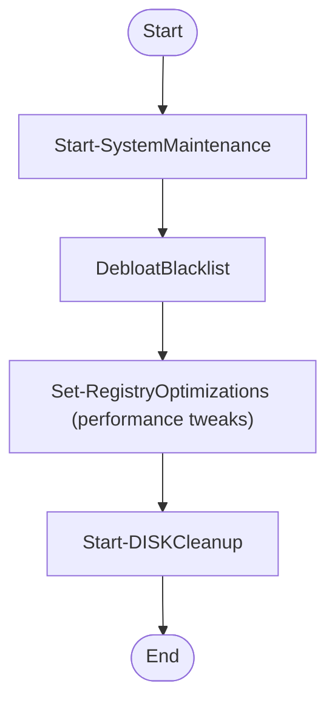

**Section sources**
- [Bloatware.psm1](file://modules/Bloatware.psm1#L429-L552)
- [Registry.psm1](file://modules/Registry.psm1#L5-L207)

### Software Management
Goal: Install and manage software consistently.

Recommended steps:
- Use PatchMyPC for pre-selected or self-select software
- Use Winget presets for essential runtimes and developer tools
- Optionally install Chocolatey for additional packages
- Create desktop shortcuts for remote desktop tools

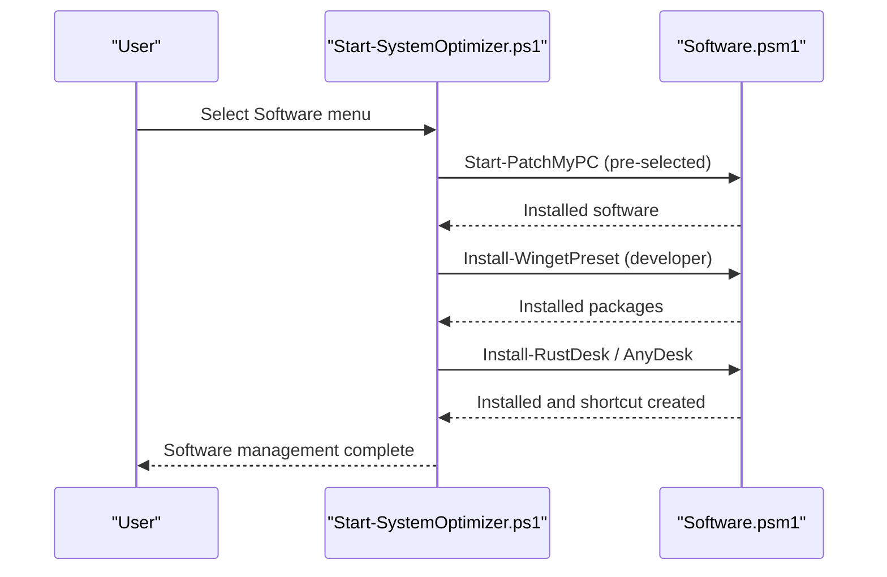

**Section sources**
- [Software.psm1](file://modules/Software.psm1#L5-L131)
- [Software.psm1](file://modules/Software.psm1#L209-L303)
- [Software.psm1](file://modules/Software.psm1#L506-L585)

### Deployment Automation
Goal: Automate system deployment across machines.

Recommended steps:
- Use the VHD deployment wizard for a complete pipeline
- Create empty VHDs (GPT/UEFI or MBR/Legacy)
- Mount and deploy Windows images
- Inject drivers and enable features
- Add VHD to the boot menu

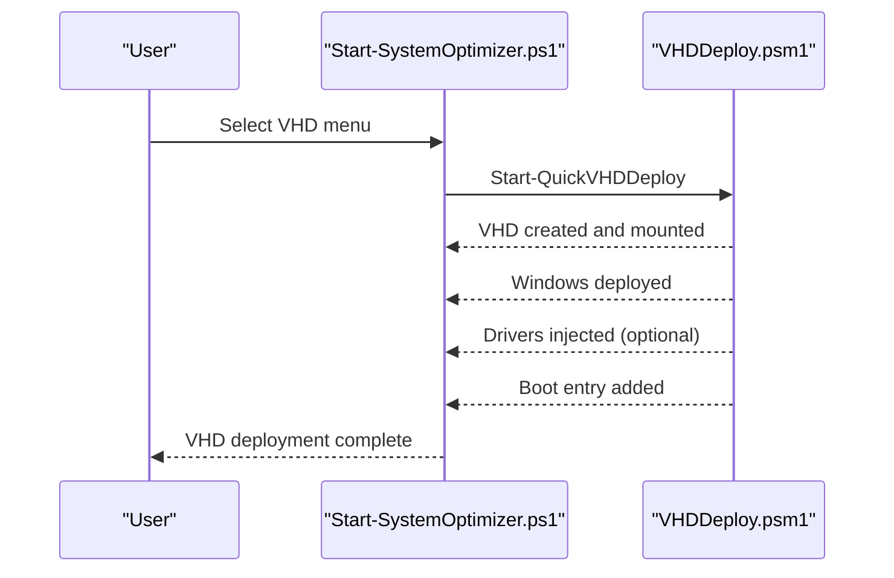

**Section sources**
- [VHDDeploy.psm1](file://modules/VHDDeploy.psm1#L527-L657)

### Multi-System Deployment and Enterprise Rollouts
Goal: Scale optimization across many systems.

Recommended patterns:
- Use the VHD deployment module to create standardized images
- Integrate with enterprise software distribution tools
- Leverage rollback sessions to safely revert problematic changes
- Use profiles to enforce consistent optimization baselines

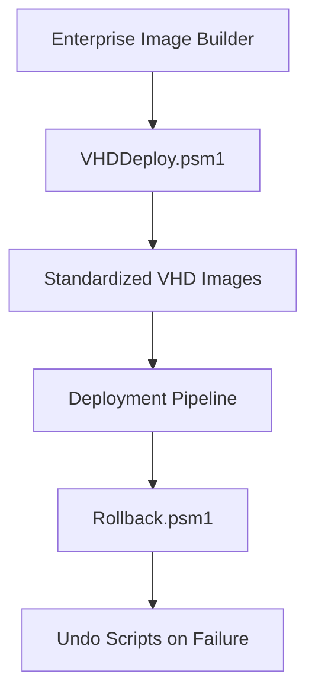

**Section sources**
- [VHDDeploy.psm1](file://modules/VHDDeploy.psm1#L96-L689)
- [Rollback.psm1](file://modules/Rollback.psm1#L29-L78)
- [Rollback.psm1](file://modules/Rollback.psm1#L461-L508)

### Custom Optimization Profiles
Goal: Tailor optimization to specific workloads.

Recommended steps:
- Use built-in profiles (Gaming, Developer, Office, Content Creator, Laptop, LowSpec)
- Preview profile actions and compare profiles
- Apply a profile and optionally export current service states
- Customize registry tweaks per profile

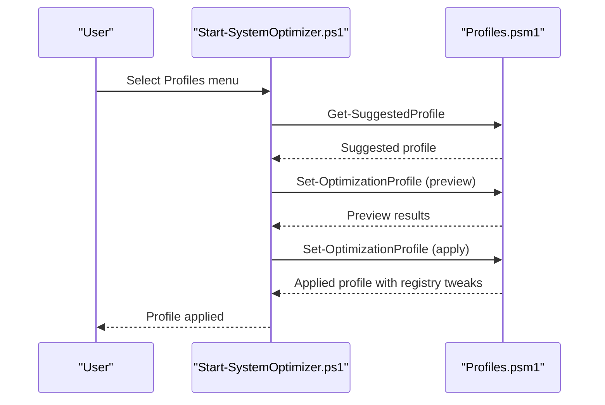

**Section sources**
- [Profiles.psm1](file://modules/Profiles.psm1#L246-L319)
- [Profiles.psm1](file://modules/Profiles.psm1#L365-L648)
- [Profiles.psm1](file://modules/Profiles.psm1#L722-L771)

### Backup and Recovery
Goal: Safeguard user data and system state.

Recommended steps:
- Back up user profile data selectively or comprehensively
- Choose backup destinations (default, external drives, existing backups)
- Restore profiles when needed
- Use rollback sessions to undo changes

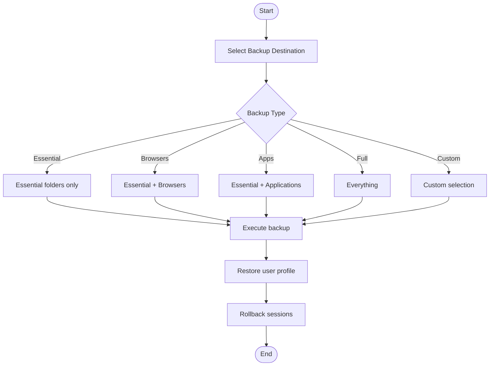

**Section sources**
- [Backup.psm1](file://modules/Backup.psm1#L68-L110)
- [Backup.psm1](file://modules/Backup.psm1#L702-L800)
- [Rollback.psm1](file://modules/Rollback.psm1#L461-L508)

### PowerShell Script Integration and Batch Patterns
Goal: Integrate with automation and CI/CD.

Patterns:
- Non-interactive runs via the entry script with -RunOption
- Batch launcher for quick actions and module downloads
- Combine modules programmatically for custom workflows

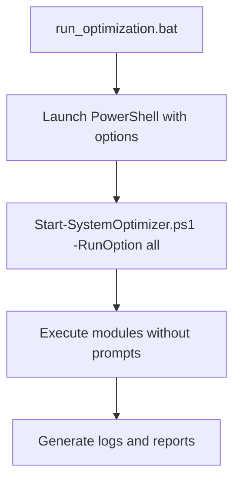

**Section sources**
- [run_optimization.bat](file://run_optimization.bat#L71-L146)
- [Start-SystemOptimizer.ps1](file://Start-SystemOptimizer.ps1#L159-L231)

## Dependency Analysis
The system exhibits strong modularity with explicit inter-module relationships:

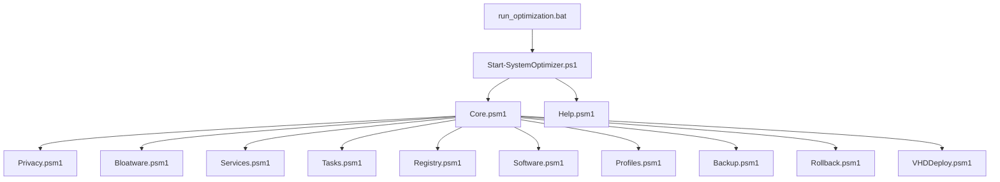

**Diagram sources**
- [Start-SystemOptimizer.ps1](file://Start-SystemOptimizer.ps1#L480-L521)
- [Core.psm1](file://modules/Core.psm1#L1-L869)
- [Privacy.psm1](file://modules/Privacy.psm1#L1-L206)
- [Bloatware.psm1](file://modules/Bloatware.psm1#L1-L1328)
- [Services.psm1](file://modules/Services.psm1#L1-L712)
- [Tasks.psm1](file://modules/Tasks.psm1#L1-L75)
- [Registry.psm1](file://modules/Registry.psm1#L1-L213)
- [Software.psm1](file://modules/Software.psm1#L1-L921)
- [Profiles.psm1](file://modules/Profiles.psm1#L1-L917)
- [Backup.psm1](file://modules/Backup.psm1#L1-L1471)
- [Rollback.psm1](file://modules/Rollback.psm1#L1-L1339)
- [VHDDeploy.psm1](file://modules/VHDDeploy.psm1#L1-L711)
- [Help.psm1](file://modules/Help.psm1#L1-L265)
- [run_optimization.bat](file://run_optimization.bat#L1-L176)

**Section sources**
- [Start-SystemOptimizer.ps1](file://Start-SystemOptimizer.ps1#L480-L521)

## Performance Considerations
- Use progress tracking and ETA calculations for long operations
- Prefer SSD-friendly registry and prefetch settings
- Limit concurrent heavy operations (e.g., software installs, VHD deployments)
- Schedule maintenance during off-hours to minimize impact

[No sources needed since this section provides general guidance]

## Troubleshooting Guide
Common issues and resolutions:
- Module load failures: The entry script attempts to reload missing modules or download them from GitHub
- Administrative privileges: Ensure elevation; the batch launcher requests elevation automatically
- Network connectivity: Many modules download content; verify outbound access and proxy settings
- Rollback: Use rollback sessions to undo changes; review generated undo scripts for errors

**Section sources**
- [Start-SystemOptimizer.ps1](file://Start-SystemOptimizer.ps1#L575-L623)
- [run_optimization.bat](file://run_optimization.bat#L28-L36)
- [Rollback.psm1](file://modules/Rollback.psm1#L514-L717)

## Conclusion
The System Optimizer provides a robust, modular framework for Windows optimization. By leveraging built-in workflows, profiles, and deployment tools—and by following the automation patterns outlined here—you can streamline daily maintenance, enhance privacy, manage software, and scale deployments across environments. Use rollback and backup modules to maintain safety, and rely on the help system to understand each menu item’s purpose.

[No sources needed since this section summarizes without analyzing specific files]

## Appendices

### Appendix A: Quick Reference Workflows
- Fresh install: Full Setup workflow
- Daily maintenance: Telemetry + Privacy + Bloatware + Registry + Tasks
- Privacy hardening: O&O ShutUp10 + Protect-Privacy + Disable-ScheduledTasks
- Software management: PatchMyPC + Winget presets + Remote desktop tools
- Deployment: VHD Quick Deploy

**Section sources**
- [Start-SystemOptimizer.ps1](file://Start-SystemOptimizer.ps1#L744-L791)
- [Privacy.psm1](file://modules/Privacy.psm1#L5-L75)
- [Bloatware.psm1](file://modules/Bloatware.psm1#L196-L427)
- [Registry.psm1](file://modules/Registry.psm1#L5-L207)
- [Tasks.psm1](file://modules/Tasks.psm1#L5-L69)
- [Software.psm1](file://modules/Software.psm1#L5-L131)
- [VHDDeploy.psm1](file://modules/VHDDeploy.psm1#L527-L657)