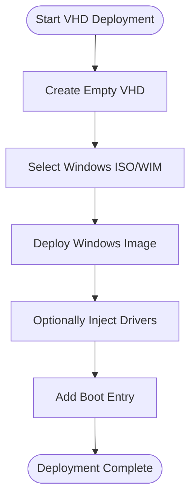

# External Tools Integration

<cite>
**Referenced Files in This Document**
- [Start-SystemOptimizer.ps1](file://Start-SystemOptimizer.ps1)
- [WindowsUpdate.psm1](file://modules/WindowsUpdate.psm1)
- [Privacy.psm1](file://modules/Privacy.psm1)
- [Security.psm1](file://modules/Security.psm1)
- [Drivers.psm1](file://modules/Drivers.psm1)
- [VHDDeploy.psm1](file://modules/VHDDeploy.psm1)
- [PatchMyPC.ini](file://configs/PatchMyPC.ini)
- [ooshutup10.cfg](file://configs/ooshutup10.cfg)
- [WinNTSetup.ini.txt](file://tools/WinNTSetup/WinNTSetup.ini.txt)
- [Win7-10-Select.xml](file://tools/WinNTSetup/unattend/Win7-10-Select.xml)
- [template.ini](file://tools/WinNTSetup/Prep/template.ini)
- [README.md](file://README.md)
</cite>

## Table of Contents
1. [Introduction](#introduction)
2. [Project Structure](#project-structure)
3. [Core Components](#core-components)
4. [Architecture Overview](#architecture-overview)
5. [Detailed Component Analysis](#detailed-component-analysis)
6. [Dependency Analysis](#dependency-analysis)
7. [Performance Considerations](#performance-considerations)
8. [Troubleshooting Guide](#troubleshooting-guide)
9. [Conclusion](#conclusion)

## Introduction
This document explains the System Optimizer's external tools integration system, focusing on how third-party tools are managed, configured, and executed. It covers the integration patterns for:
- WinNTSetup for Windows deployment
- O&O ShutUp10 for privacy controls
- WUpdater for Windows Update management
- Defender_Tools for security tool management
- Snappy Driver Installer for driver management

The documentation details tool installation procedures, configuration file management, process execution patterns, tool packaging, automatic tool detection, fallback mechanisms, tool-specific configuration options, command-line parameter passing, and result processing. It also explains the relationship between configuration files (PatchMyPC.ini, ooshutup10.cfg) and external tool behavior, along with compatibility, update procedures, and troubleshooting integration issues.

## Project Structure
The System Optimizer organizes external tool integration through:
- A centralized PowerShell module loader that dynamically loads modular components
- Dedicated modules for each tool category (Windows Update, Privacy, Security, Drivers, VHD Deployment)
- Configuration files stored under the configs directory
- Tool binaries and assets under the tools directory
- A main entry script that orchestrates menu-driven workflows and module execution

**Diagram sources**
- [Start-SystemOptimizer.ps1](file://Start-SystemOptimizer.ps1#L380-L474)
- [WindowsUpdate.psm1](file://modules/WindowsUpdate.psm1#L129-L149)
- [Privacy.psm1](file://modules/Privacy.psm1#L5-L75)
- [Security.psm1](file://modules/Security.psm1#L132-L142)
- [Drivers.psm1](file://modules/Drivers.psm1#L37-L104)

**Section sources**
- [README.md](file://README.md#L1-L88)
- [Start-SystemOptimizer.ps1](file://Start-SystemOptimizer.ps1#L380-L474)

## Core Components
The external tools integration relies on:
- Module-based orchestration: Each tool category is encapsulated in a dedicated PowerShell module with exported functions.
- Dynamic module loading: The main script loads modules from either embedded resources or a persistent cache, enabling runtime tool availability.
- Configuration-driven behavior: Tools consume configuration files (e.g., PatchMyPC.ini, ooshutup10.cfg) to tailor behavior.
- Remote tool acquisition: Many tools are downloaded on-demand from GitHub or official sources during execution.
- Process execution patterns: Tools are launched via Start-Process with arguments, and results are logged and surfaced to users.

Key integration patterns:
- Tool packaging: Tools are packaged as single executables or archives (e.g., WinNTSetup, SNAPPY_DRIVER.zip).
- Automatic detection: The system detects tool availability and falls back to downloading or prompting for user interaction.
- Command-line parameter passing: Tools receive parameters via Start-Process arguments, including quiet modes and configuration file paths.
- Result processing: Execution outcomes are logged, validated, and presented to users with clear success/error messaging.

**Section sources**
- [Start-SystemOptimizer.ps1](file://Start-SystemOptimizer.ps1#L575-L623)
- [WindowsUpdate.psm1](file://modules/WindowsUpdate.psm1#L129-L149)
- [Privacy.psm1](file://modules/Privacy.psm1#L5-L75)
- [Security.psm1](file://modules/Security.psm1#L132-L142)
- [Drivers.psm1](file://modules/Drivers.psm1#L37-L104)

## Architecture Overview
The external tools integration follows a layered architecture:
- Entry point: Start-SystemOptimizer.ps1 initializes logging, sets console size, and manages module loading.
- Module layer: Each tool category module exposes functions for launching, configuring, and managing tools.
- Configuration layer: Configuration files define tool behavior and preferences.
- Tool layer: Executables and archives are downloaded and executed as needed.

**Diagram sources**
- [Start-SystemOptimizer.ps1](file://Start-SystemOptimizer.ps1#L380-L474)
- [Start-SystemOptimizer.ps1](file://Start-SystemOptimizer.ps1#L575-L623)
- [WindowsUpdate.psm1](file://modules/WindowsUpdate.psm1#L129-L149)
- [Privacy.psm1](file://modules/Privacy.psm1#L5-L75)
- [Security.psm1](file://modules/Security.psm1#L132-L142)
- [Drivers.psm1](file://modules/Drivers.psm1#L37-L104)

## Detailed Component Analysis

### Windows Update Management (WUpdater)
WUpdater integrates as an AIO Windows Update management tool. The module provides:
- A menu-driven interface to pause updates, disable the service, open settings, install updates via PowerShell, run WUpdater GUI, and update drivers.
- On-demand download and launch of WUpdater.exe from a GitHub raw URL.
- Argument passing to run the GUI and manage update behavior.

**Diagram sources**
- [WindowsUpdate.psm1](file://modules/WindowsUpdate.psm1#L129-L149)

**Section sources**
- [WindowsUpdate.psm1](file://modules/WindowsUpdate.psm1#L5-L82)
- [WindowsUpdate.psm1](file://modules/WindowsUpdate.psm1#L129-L149)

### Privacy Controls (O&O ShutUp10)
O&O ShutUp10 integrates for comprehensive privacy configuration. The module:
- Offers two modes: recommended settings (quiet apply with ooshutup10.cfg) and interactive mode.
- Downloads OOSU10.exe and ooshutup10.cfg from GitHub.
- Applies configuration using Start-Process with arguments for quiet mode.

**Diagram sources**
- [Privacy.psm1](file://modules/Privacy.psm1#L5-L75)
- [ooshutup10.cfg](file://configs/ooshutup10.cfg#L1-L246)

**Section sources**
- [Privacy.psm1](file://modules/Privacy.psm1#L5-L75)
- [ooshutup10.cfg](file://configs/ooshutup10.cfg#L1-L246)

### Security Tool Management (Defender_Tools)
Defender_Tools integrates for advanced Windows Defender management. The module:
- Provides quick actions to disable/enable real-time protection and advanced registry-based controls.
- Downloads Defender_Tools.exe from GitHub and launches it for GUI-based management.
- Includes firewall and Defender exclusions for activation tools.

**Diagram sources**
- [Security.psm1](file://modules/Security.psm1#L132-L142)

**Section sources**
- [Security.psm1](file://modules/Security.psm1#L5-L278)
- [Security.psm1](file://modules/Security.psm1#L132-L142)

### Driver Management (Snappy Driver Installer)
Snappy Driver Installer integrates for driver updates and management. The module:
- Supports Windows Update-based updates, downloading SDI Lite, NexTool auto-update method, and opening the official download page.
- Handles architecture detection and launches the appropriate executable.
- Provides backup/restore of drivers using DISM.

**Diagram sources**
- [Drivers.psm1](file://modules/Drivers.psm1#L37-L104)

**Section sources**
- [Drivers.psm1](file://modules/Drivers.psm1#L5-L176)
- [Drivers.psm1](file://modules/Drivers.psm1#L37-L104)

### Windows Deployment (WinNTSetup)
WinNTSetup integrates for Windows deployment workflows. The module:
- Manages VHD creation, mounting, Windows deployment, driver injection, and adding entries to the boot menu.
- Uses WinNTSetup configuration files and unattend XML templates for automated deployments.

**Diagram sources**
- [VHDDeploy.psm1](file://modules/VHDDeploy.psm1#L527-L657)
- [WinNTSetup.ini.txt](file://tools/WinNTSetup/WinNTSetup.ini.txt#L1-L81)
- [Win7-10-Select.xml](file://tools/WinNTSetup/unattend/Win7-10-Select.xml#L1-L64)
- [template.ini](file://tools/WinNTSetup/Prep/template.ini#L1-L78)

**Section sources**
- [VHDDeploy.psm1](file://modules/VHDDeploy.psm1#L1-L711)
- [WinNTSetup.ini.txt](file://tools/WinNTSetup/WinNTSetup.ini.txt#L1-L81)
- [Win7-10-Select.xml](file://tools/WinNTSetup/unattend/Win7-10-Select.xml#L1-L64)
- [template.ini](file://tools/WinNTSetup/Prep/template.ini#L1-L78)

## Dependency Analysis
External tool integration depends on:
- PowerShell module loading and function availability
- HTTP client capabilities for downloading tools and configurations
- Administrative privileges for launching tools and writing to system locations
- Configuration file presence and correctness for tool behavior

**Diagram sources**
- [Start-SystemOptimizer.ps1](file://Start-SystemOptimizer.ps1#L380-L474)
- [WindowsUpdate.psm1](file://modules/WindowsUpdate.psm1#L129-L149)
- [Privacy.psm1](file://modules/Privacy.psm1#L5-L75)
- [Security.psm1](file://modules/Security.psm1#L132-L142)
- [Drivers.psm1](file://modules/Drivers.psm1#L37-L104)
- [VHDDeploy.psm1](file://modules/VHDDeploy.psm1#L1-L711)
- [PatchMyPC.ini](file://configs/PatchMyPC.ini#L1-L376)
- [ooshutup10.cfg](file://configs/ooshutup10.cfg#L1-L246)
- [WinNTSetup.ini.txt](file://tools/WinNTSetup/WinNTSetup.ini.txt#L1-L81)
- [Win7-10-Select.xml](file://tools/WinNTSetup/unattend/Win7-10-Select.xml#L1-L64)
- [template.ini](file://tools/WinNTSetup/Prep/template.ini#L1-L78)

**Section sources**
- [Start-SystemOptimizer.ps1](file://Start-SystemOptimizer.ps1#L380-L474)
- [WindowsUpdate.psm1](file://modules/WindowsUpdate.psm1#L129-L149)
- [Privacy.psm1](file://modules/Privacy.psm1#L5-L75)
- [Security.psm1](file://modules/Security.psm1#L132-L142)
- [Drivers.psm1](file://modules/Drivers.psm1#L37-L104)
- [VHDDeploy.psm1](file://modules/VHDDeploy.psm1#L1-L711)

## Performance Considerations
- Network bandwidth: Tools are downloaded on-demand; ensure sufficient bandwidth for large downloads (e.g., SDI archives).
- Execution time: Some tools (e.g., Windows deployment, driver backups/restores) can take significant time; schedule accordingly.
- Resource usage: Running multiple tools concurrently may impact system performance; execute sequentially when possible.
- Logging overhead: Extensive logging helps troubleshooting but can increase disk I/O; adjust verbosity as needed.

## Troubleshooting Guide
Common integration issues and resolutions:
- Tool download failures:
  - Verify internet connectivity and proxy settings.
  - Retry downloads or manually download tools to the expected directory.
- Permission errors:
  - Ensure the script runs as Administrator; many tools require elevated privileges.
- Configuration file mismatches:
  - Validate configuration file syntax and paths; incorrect entries can prevent tool execution.
- Tool not found:
  - Confirm the tool binary exists in the expected directory; the system may attempt to download it automatically.
- Execution timeouts:
  - Some tools may take longer than expected; increase timeout or run in the background with logging.

**Section sources**
- [Start-SystemOptimizer.ps1](file://Start-SystemOptimizer.ps1#L575-L623)
- [WindowsUpdate.psm1](file://modules/WindowsUpdate.psm1#L129-L149)
- [Privacy.psm1](file://modules/Privacy.psm1#L5-L75)
- [Security.psm1](file://modules/Security.psm1#L132-L142)
- [Drivers.psm1](file://modules/Drivers.psm1#L37-L104)

## Conclusion
The System Optimizer’s external tools integration provides a robust, configurable, and user-friendly framework for managing third-party tools. Through modular design, dynamic loading, configuration-driven behavior, and on-demand downloads, it enables seamless integration of WinNTSetup, O&O ShutUp10, WUpdater, Defender_Tools, and Snappy Driver Installer. Proper configuration, administrative privileges, and reliable networking are essential for successful tool execution. The documented patterns and troubleshooting guidance facilitate smooth operation and effective problem resolution.