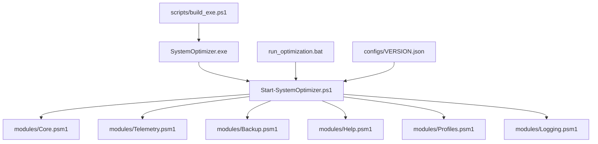
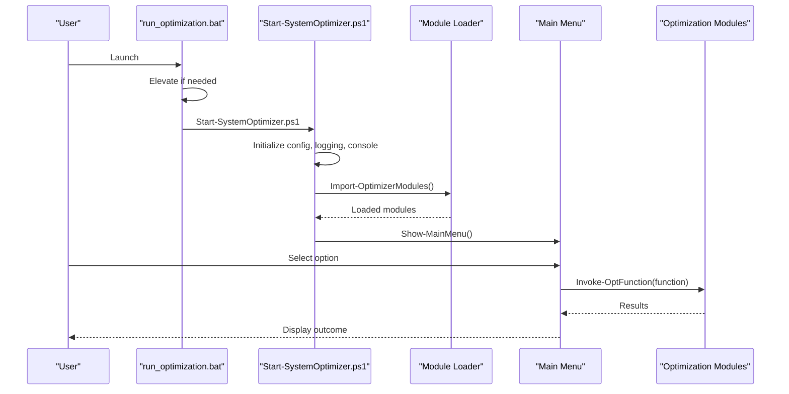
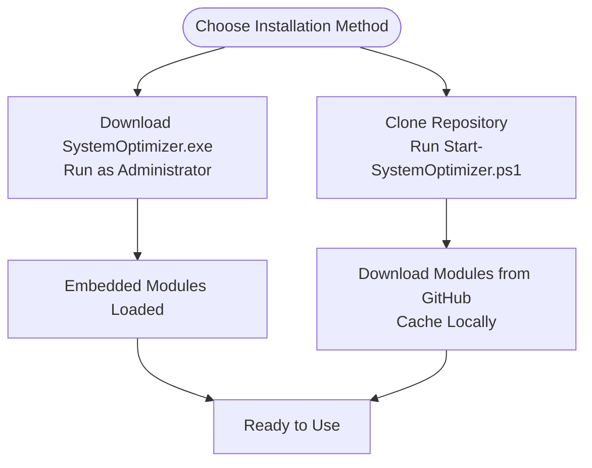
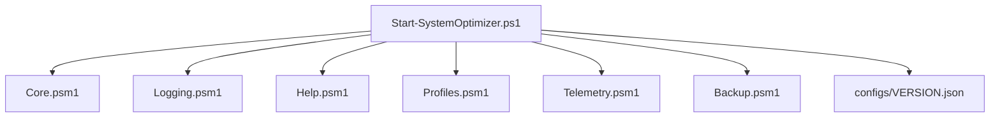

# Getting Started

<cite>
**Referenced Files in This Document**
- [README.md](file://README.md)
- [Start-SystemOptimizer.ps1](file://Start-SystemOptimizer.ps1)
- [run_optimization.bat](file://run_optimization.bat)
- [scripts/build_exe.ps1](file://scripts/build_exe.ps1)
- [docs/FEATURES.md](file://docs/FEATURES.md)
- [docs/STRUCTURE.md](file://docs/STRUCTURE.md)
- [CHANGELOG.md](file://CHANGELOG.md)
- [configs/VERSION.json](file://configs/VERSION.json)
- [modules/Core.psm1](file://modules/Core.psm1)
- [modules/Backup.psm1](file://modules/Backup.psm1)
- [modules/Help.psm1](file://modules/Help.psm1)
- [modules/Telemetry.psm1](file://modules/Telemetry.psm1)
- [modules/Profiles.psm1](file://modules/Profiles.psm1)
- [modules/Logging.psm1](file://modules/Logging.psm1)
- [modules/Network.psm1](file://modules/Network.psm1)
- [modules/Maintenance.psm1](file://modules/Maintenance.psm1)
</cite>

## Update Summary
**Changes Made**
- Updated menu structure documentation to reflect Network Tools (option 8) replacing Network Optimizations
- Updated menu structure documentation to reflect Maintenance Tools (option 10) replacing System Maintenance
- Updated menu numbering throughout the interface documentation
- Enhanced Understanding the Menu System section with accurate category listings
- Updated Quick Actions vs. Full Setup Workflows section with correct menu options
- Revised First-Time Setup Checklist to match current menu structure

## Table of Contents
1. [Introduction](#introduction)
2. [Project Structure](#project-structure)
3. [Core Components](#core-components)
4. [Architecture Overview](#architecture-overview)
5. [Detailed Component Analysis](#detailed-component-analysis)
6. [Dependency Analysis](#dependency-analysis)
7. [Performance Considerations](#performance-considerations)
8. [Troubleshooting Guide](#troubleshooting-guide)
9. [Conclusion](#conclusion)
10. [Appendices](#appendices)

## Introduction
System Optimizer is a comprehensive Windows 10/11 optimization toolkit designed for quick setup and safe operation. It ships as a standalone executable with all modules embedded (no runtime dependencies) and also supports a script-based installation via Git clone. The tool provides a modular architecture with 27+ modules covering privacy, services, bloatware, performance, software installation, and advanced deployment tools. It includes robust logging, a rollback system, and safety features such as optional system restore point creation and backups.

Key highlights for first-time users:
- Run as Administrator for all optimizations.
- Choose between Quick Actions (Run ALL) and Full Setup workflows.
- Create backups before starting.
- Use the menu system to select and apply targeted optimizations.

**Section sources**
- [README.md](file://README.md#L1-L88)
- [docs/STRUCTURE.md](file://docs/STRUCTURE.md#L1-L159)

## Project Structure
At a high level, the project consists of:
- A main entry point script and a standalone executable.
- A launcher batch script for quick options and non-interactive runs.
- A modules directory containing 27+ PowerShell modules implementing specific optimizations.
- Supporting scripts for building the EXE and managing versions.
- Documentation under docs/, including features, structure, roadmap, and changelog.
- Configuration files under configs/.

**Diagram sources**
- [Start-SystemOptimizer.ps1](file://Start-SystemOptimizer.ps1#L1-L994)
- [scripts/build_exe.ps1](file://scripts/build_exe.ps1#L1-L80)
- [docs/STRUCTURE.md](file://docs/STRUCTURE.md#L1-L159)
- [configs/VERSION.json](file://configs/VERSION.json#L1-L34)

**Section sources**
- [docs/STRUCTURE.md](file://docs/STRUCTURE.md#L1-L159)
- [CHANGELOG.md](file://CHANGELOG.md#L1-L69)

## Core Components
- Standalone executable (SystemOptimizer.exe) with embedded modules for immediate use.
- Script version (Start-SystemOptimizer.ps1) that dynamically loads modules from GitHub or a local cache.
- Launcher batch (run_optimization.bat) offering quick launch options and non-interactive runs.
- Modules for core optimizations (privacy, services, bloatware, registry, network, etc.), utilities, logging, backup, profiles, and deployment tools.
- Version management via configs/VERSION.json and module version caching.

Installation methods:
- Standalone EXE: Download the latest release and run as Administrator.
- Script version: Clone the repository and run Start-SystemOptimizer.ps1.

Prerequisites:
- Windows 10/11 (some features work on Windows 7/8.1).
- Administrator privileges.
- PowerShell 5.1+ (PowerShell 7+ recommended).
- Internet connection for updates and module downloads.

Initial configuration recommendations:
- Create backups before applying optimizations.
- Review the menu categories and choose appropriate options for your use case.
- Use Quick Actions (Run ALL) for a full system cleanup or Full Setup for new machines.

**Section sources**
- [README.md](file://README.md#L7-L88)
- [Start-SystemOptimizer.ps1](file://Start-SystemOptimizer.ps1#L27-L139)
- [run_optimization.bat](file://run_optimization.bat#L1-L176)
- [docs/STRUCTURE.md](file://docs/STRUCTURE.md#L115-L128)

## Architecture Overview
The system uses a modular PowerShell architecture. The main entry point initializes configuration, logging, and module loading. It then presents a menu-driven interface with categorized options. Modules encapsulate specific optimizations and are imported dynamically when needed.

**Diagram sources**
- [run_optimization.bat](file://run_optimization.bat#L28-L38)
- [Start-SystemOptimizer.ps1](file://Start-SystemOptimizer.ps1#L380-L474)
- [Start-SystemOptimizer.ps1](file://Start-SystemOptimizer.ps1#L627-L800)

## Detailed Component Analysis

### Installation Methods
- Standalone executable:
  - Download the latest SystemOptimizer.exe from releases.
  - Run as Administrator.
  - All modules are embedded; no setup required.
- Script-based installation:
  - Clone the repository.
  - Run Start-SystemOptimizer.ps1.
  - Modules are downloaded from GitHub and cached locally.

**Diagram sources**
- [README.md](file://README.md#L9-L26)
- [Start-SystemOptimizer.ps1](file://Start-SystemOptimizer.ps1#L380-L474)
- [scripts/build_exe.ps1](file://scripts/build_exe.ps1#L31-L67)

**Section sources**
- [README.md](file://README.md#L9-L26)
- [scripts/build_exe.ps1](file://scripts/build_exe.ps1#L1-L80)

### Running as Administrator
- The launcher batch script checks for administrative privileges and relaunches elevated if needed.
- The main script requires administrator privileges via a directive.
- Always run with elevated permissions to avoid failures during system-level changes.

**Section sources**
- [run_optimization.bat](file://run_optimization.bat#L28-L38)
- [Start-SystemOptimizer.ps1](file://Start-SystemOptimizer.ps1#L6-L6)

### Understanding the Menu System
The main menu organizes options into categories:
- Quick Actions: Run ALL Optimizations, Full Setup.
- Core Optimizations: Telemetry, Services, Bloatware, Tasks, Registry, VBS, Network Tools, OneDrive, Maintenance Tools.
- Software & Tools: Software Install, Office Tool Plus, MAS Activation.
- Utilities: Wi-Fi Passwords, Verify Status, Logs, Backup, Shutdown, Rollback, Hardware, Profiles.
- Power & System: Power Plan, O&O ShutUp10, GPO Reset, WMI, Cleanup, Updates, Drivers, Network Reset, Defender.
- Advanced: Debloat Scripts, WinUtil Sync, UI Tweaks, Image Tool.
- Deployment Tools: VHD Native Boot, Windows Installer, Image Tool.

Navigation:
- Use numeric keys to select options.
- Many options present submenus or interactive prompts.

**Updated** The menu structure has been updated with Network Tools (option 8) replacing Network Optimizations and Maintenance Tools (option 10) replacing System Maintenance.

**Section sources**
- [README.md](file://README.md#L48-L59)
- [Start-SystemOptimizer.ps1](file://Start-SystemOptimizer.ps1#L232-L299)
- [docs/FEATURES.md](file://docs/FEATURES.md#L1-L200)

### Quick Actions vs. Full Setup Workflows
- Quick Actions:
  - Run ALL Optimizations: Applies core optimizations in sequence (telemetry, services, bloatware, tasks, registry, network tools).
  - Best for fresh installs or full system cleanup.
- Full Setup:
  - Complete workflow for new machines: software installation, Office Tool Plus, service optimization, MAS activation.
  - Ideal for setting up a new PC from scratch.

**Section sources**
- [docs/FEATURES.md](file://docs/FEATURES.md#L3-L24)

### Prerequisites Verification and Compatibility
- Operating Systems: Windows 10/11 (some features work on Windows 7/8.1).
- PowerShell: 5.1+ recommended (PowerShell 7+ recommended).
- Privileges: Administrator required.
- Internet: Required for updates and module downloads.
- Disk Space: Ensure adequate space for logs, modules, and backups.

**Section sources**
- [README.md](file://README.md#L28-L33)
- [Start-SystemOptimizer.ps1](file://Start-SystemOptimizer.ps1#L276-L281)

### Initial Configuration Recommendations
- Create backups:
  - Use the Backup module to back up user profiles and optionally browser data.
  - Consider external drives for secure off-machine storage.
- Review profiles:
  - Use Optimization Profiles to auto-apply presets tailored to your workload (Gaming, Developer, Office, Content Creator, Laptop, LowSpec).
- Logging:
  - Logs are written to C:\System_Optimizer\Logs\ with automatic cleanup after 30 days.
- Safety:
  - The system includes a rollback system and backup of services/registry prior to changes.

**Section sources**
- [docs/STRUCTURE.md](file://docs/STRUCTURE.md#L115-L128)
- [modules/Backup.psm1](file://modules/Backup.psm1#L33-L66)
- [modules/Profiles.psm1](file://modules/Profiles.psm1#L1-L200)
- [modules/Logging.psm1](file://modules/Logging.psm1#L13-L66)

### Creating Backups Before Starting Optimizations
- Use the Backup module's menu to:
  - Back up the entire user profile.
  - Back up browser data only.
  - Back up Outlook data only.
  - View backup status and restore when needed.
- Destination options include default locations, browsing for custom folders, auto-detection of external drives, and searching for existing backups.

**Section sources**
- [modules/Backup.psm1](file://modules/Backup.psm1#L33-L110)
- [modules/Backup.psm1](file://modules/Backup.psm1#L112-L194)

### Understanding Core Optimizations
- Telemetry: Disables 35+ privacy and telemetry features, including advertising ID, activity history, Cortana, web search, feedback, PowerShell telemetry, and more.
- Services: Interactive service management with Safe and Aggressive modes, including Teams startup control and export of current states.
- Bloatware: Removes 40+ pre-installed apps (e.g., Xbox, Microsoft apps, TikTok, Candy Crush, Clipchamp, Phone Link, Quick Assist).
- Tasks: Disables 19 telemetry/diagnostic scheduled tasks.
- Registry: Applies 20+ performance tweaks (menu delays, animations, prefetch/Superfetch on SSD, hardware GPU scheduling, memory management).
- VBS: Disables virtualization-based security features (memory integrity, credential guard, HVCI) with a security warning.
- Network Tools: TCP/IP, DNS, and adapter optimizations (IPv6, Nagle's algorithm, throttling).
- OneDrive: Complete removal with policy disable and registry cleanup.
- Maintenance Tools: DISM, SFC, temporary file cleanup, Windows Update cache clear, component store cleanup.

**Updated** Network Optimizations has been renamed to Network Tools and System Maintenance has been renamed to Maintenance Tools.

**Section sources**
- [docs/FEATURES.md](file://docs/FEATURES.md#L27-L125)
- [modules/Telemetry.psm1](file://modules/Telemetry.psm1#L1-L200)

### Optimization Profiles
Profiles define preset combinations of module actions and registry tweaks:
- Gaming: High Performance, disables background apps, prioritizes GPU.
- Developer: Keeps WSL/Docker/search indexing; minimal service disruption.
- Office: Balanced for productivity; keeps OneDrive and minimal tweaks.
- Content Creator: Low-latency and GPU priority for video/audio production.
- Laptop: Power-saving optimizations to extend battery life.
- LowSpec: Maximum optimization for older/slower hardware.

Profiles integrate with hardware detection to suggest the best fit and can be manually applied.

**Section sources**
- [modules/Profiles.psm1](file://modules/Profiles.psm1#L1-L200)
- [docs/STRUCTURE.md](file://docs/STRUCTURE.md#L80-L96)

### Logging and Diagnostics
- Centralized logging to C:\System_Optimizer\Logs\ with timestamps and color-coded output.
- Automatic cleanup of logs older than 30 days.
- Debug mode can be enabled via an environment variable for detailed logs.

**Section sources**
- [docs/STRUCTURE.md](file://docs/STRUCTURE.md#L115-L128)
- [modules/Logging.psm1](file://modules/Logging.psm1#L13-L66)

### Module Loading and Reliability
- Modules are downloaded from GitHub and cached locally for reliability.
- The loader validates function availability and can prompt to download missing modules.
- Version tracking ensures consistent module sets across runs.

**Section sources**
- [Start-SystemOptimizer.ps1](file://Start-SystemOptimizer.ps1#L380-L474)
- [configs/VERSION.json](file://configs/VERSION.json#L1-L34)

## Dependency Analysis
- Internal dependencies:
  - Start-SystemOptimizer.ps1 depends on modules for specific functions.
  - Modules rely on shared logging and progress tracking utilities.
- External dependencies:
  - Internet connectivity for module downloads and updates.
  - Administrative privileges for system-level changes.
  - Optional: PowerShell 7+ for enhanced compatibility.

**Diagram sources**
- [Start-SystemOptimizer.ps1](file://Start-SystemOptimizer.ps1#L480-L521)
- [docs/STRUCTURE.md](file://docs/STRUCTURE.md#L38-L96)
- [configs/VERSION.json](file://configs/VERSION.json#L1-L34)

**Section sources**
- [Start-SystemOptimizer.ps1](file://Start-SystemOptimizer.ps1#L480-L521)
- [docs/STRUCTURE.md](file://docs/STRUCTURE.md#L38-L96)

## Performance Considerations
- Use Quick Actions (Run ALL) for broad system cleanup; expect longer runtime.
- Use Full Setup for new machines to streamline software installation and activation.
- Apply profiles suited to your workload to balance performance and functionality.
- Keep logs rotated to maintain disk hygiene.

## Troubleshooting Guide
Common first-time user scenarios and guidance:
- Cannot run as Administrator:
  - Use the launcher batch script to elevate automatically.
  - Ensure UAC is enabled and you are logged in as an administrator.
- Modules not loading:
  - The loader attempts to download missing modules from GitHub.
  - Check internet connectivity and firewall settings.
- Slow or stuck operations:
  - Use the Logs menu to review recent entries.
  - Re-run with debug logging enabled via the environment variable.
- Rollback needed:
  - Use the Rollback module to undo recent changes.
  - Confirm backups were created before applying risky tweaks.

Security considerations:
- Some optimizations reduce system security (e.g., disabling VBS).
- Always create backups and review changes before applying aggressive modes.
- Use the rollback system to revert modifications if issues arise.

**Section sources**
- [run_optimization.bat](file://run_optimization.bat#L28-L38)
- [Start-SystemOptimizer.ps1](file://Start-SystemOptimizer.ps1#L575-L623)
- [docs/STRUCTURE.md](file://docs/STRUCTURE.md#L115-L128)
- [README.md](file://README.md#L77-L80)

## Conclusion
System Optimizer provides a fast, safe, and flexible way to optimize Windows 10/11 systems. With a standalone executable and script-based installation, a comprehensive menu system, and strong safety features like backups and rollbacks, first-time users can confidently apply targeted optimizations or perform full system cleanups. Start with backups, choose the right workflow (Quick Actions or Full Setup), and leverage profiles and logging to tailor the experience to your needs.

## Appendices

### First-Time Setup Checklist
- Download SystemOptimizer.exe or clone the repository.
- Run as Administrator.
- Create backups using the Backup module.
- Choose Quick Actions (Run ALL) or Full Setup based on your scenario.
- Review logs and use rollback if needed.

**Updated** Updated menu options to reflect current structure with Network Tools (option 8) and Maintenance Tools (option 10).

**Section sources**
- [README.md](file://README.md#L7-L26)
- [docs/FEATURES.md](file://docs/FEATURES.md#L3-L24)
- [modules/Backup.psm1](file://modules/Backup.psm1#L33-L66)