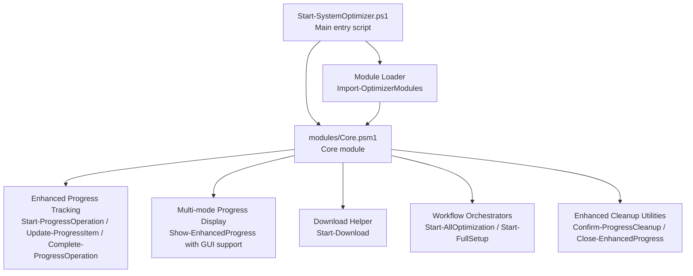
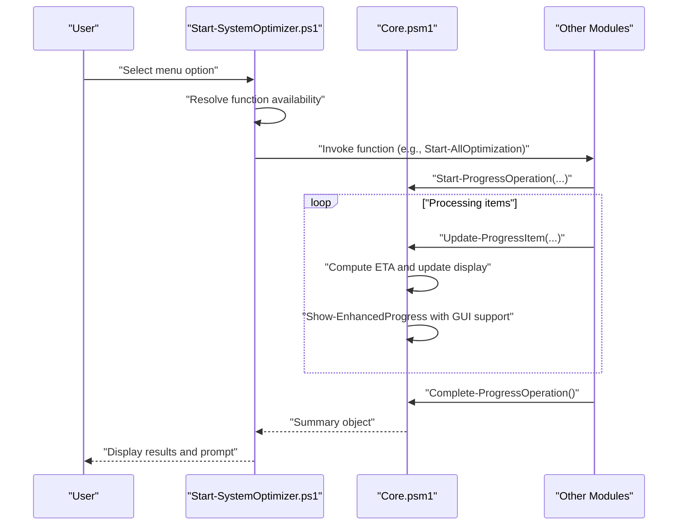
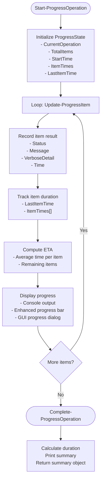
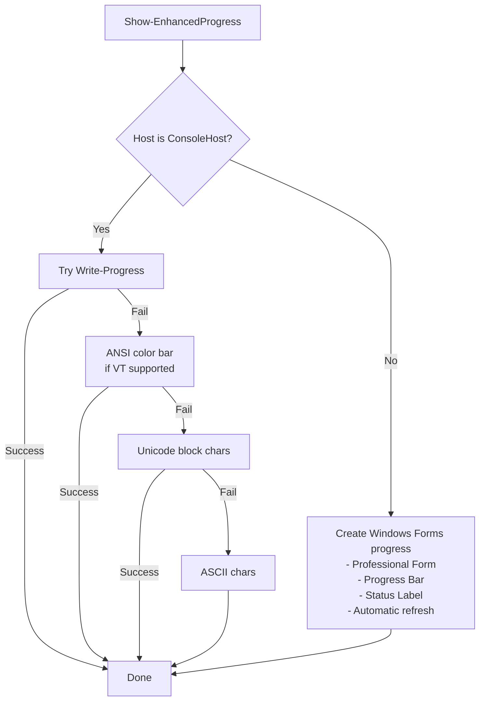
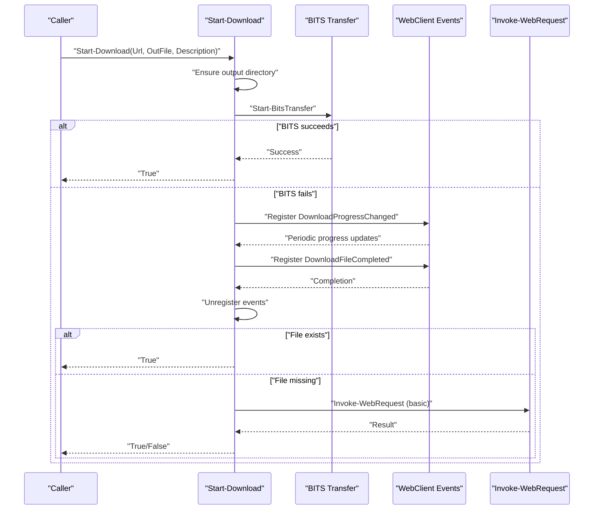
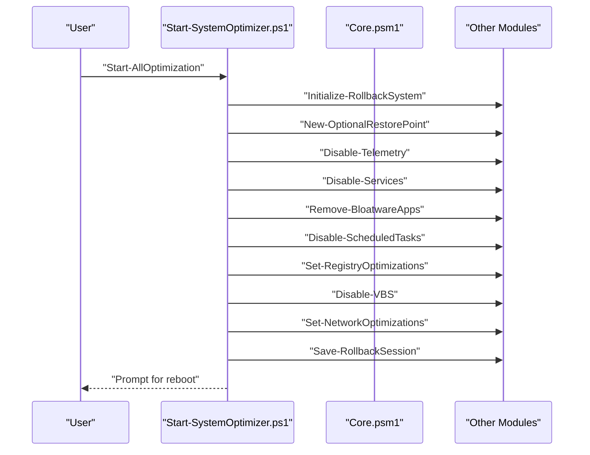
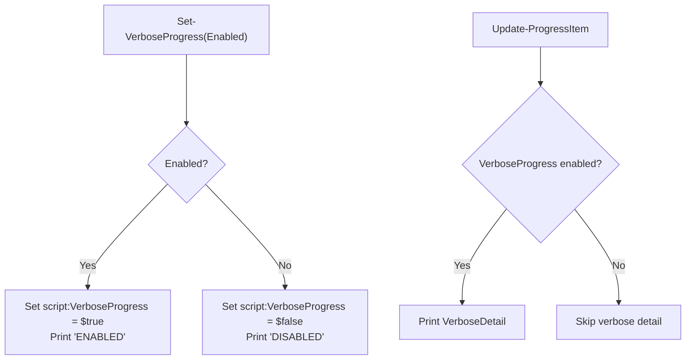
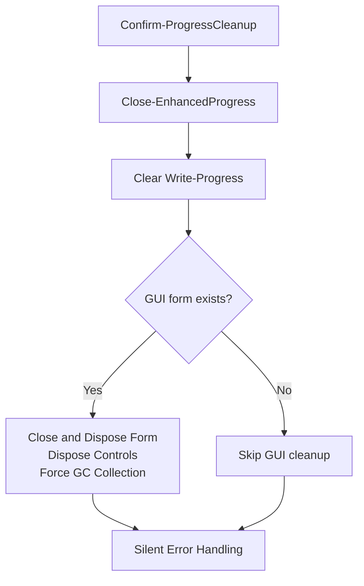
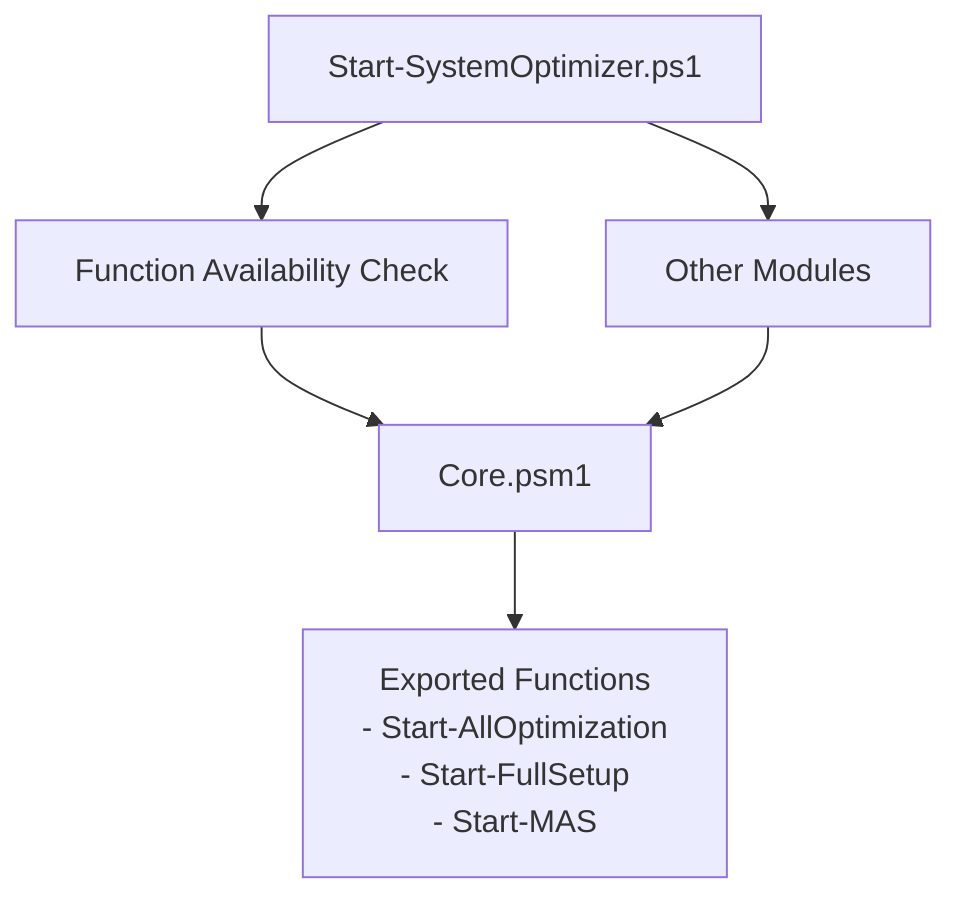

# Core Module

<cite>
**Referenced Files in This Document**
- [Core.psm1](file://modules/Core.psm1)
- [Start-SystemOptimizer.ps1](file://Start-SystemOptimizer.ps1)
- [README.md](file://README.md)
- [STRUCTURE.md](file://docs/STRUCTURE.md)
- [Logging.psm1](file://modules/Logging.psm1)
- [win11_ultimate_optimization.ps1](file://scripts/legacy/win11_ultimate_optimization.ps1)
</cite>

## Update Summary
**Changes Made**
- Updated function naming conventions from 'Run-' to 'Start-' prefix standards
- Enhanced progress tracking system with comprehensive GUI-style progress dialogs
- Improved error handling and fallback mechanisms for progress display
- Added robust cleanup functions including Confirm-ProgressCleanup
- Expanded workflow orchestration with better integration across modules
- Updated practical examples to use standardized function names
- Added documentation for enhanced progress state management and timing calculations

## Table of Contents
1. [Introduction](#introduction)
2. [Project Structure](#project-structure)
3. [Core Components](#core-components)
4. [Architecture Overview](#architecture-overview)
5. [Detailed Component Analysis](#detailed-component-analysis)
6. [Dependency Analysis](#dependency-analysis)
7. [Performance Considerations](#performance-considerations)
8. [Troubleshooting Guide](#troubleshooting-guide)
9. [Conclusion](#conclusion)
10. [Appendices](#appendices)

## Introduction
This document provides comprehensive documentation for the Core module that underpins the System Optimizer. The module has been significantly enhanced with a comprehensive progress tracking system featuring GUI-style progress dialogs, improved error handling, and better integration with the expanded module ecosystem. It focuses on the enhanced progress tracking system, multi-mode progress display with automatic GUI detection, the download helper with fallback mechanisms, workflow orchestration functions, verbose progress mode, and comprehensive cleanup utilities.

## Project Structure
The Core module resides within the modules directory and exports functions used by the main entry script and other modules. The main entry script orchestrates module loading and exposes menu-driven workflows that leverage Core's progress and download helpers. Function names now follow the 'Start-' prefix convention for workflow functions, providing consistency across the toolkit.

**Diagram sources**
- [Start-SystemOptimizer.ps1](file://Start-SystemOptimizer.ps1#L380-L434)
- [Core.psm1](file://modules/Core.psm1#L60-L251)
- [Core.psm1](file://modules/Core.psm1#L280-L396)
- [Core.psm1](file://modules/Core.psm1#L556-L696)
- [Core.psm1](file://modules/Core.psm1#L698-L791)

**Section sources**
- [STRUCTURE.md](file://docs/STRUCTURE.md#L1-L37)
- [README.md](file://README.md#L1-L88)
- [Start-SystemOptimizer.ps1](file://Start-SystemOptimizer.ps1#L380-L434)

## Core Components
- **Enhanced progress tracking system**: initializes operations, updates per-item progress, computes ETA, and produces summaries with comprehensive state management.
- **Multi-mode progress display**: supports console, GUI, and auto-detection modes with robust fallbacks including Windows Forms progress dialogs.
- **Download helper**: attempts BITS transfer first, falls back to WebClient with progress callbacks, and retries with basic web requests.
- **Workflow orchestration**: high-level functions to run all optimizations and a full setup workflow using standardized 'Start-' naming convention.
- **Verbose progress mode**: toggles detailed output for diagnostics with enhanced logging capabilities.
- **Enhanced cleanup utilities**: ensure proper closure of progress displays, disposal of GUI resources, and comprehensive resource cleanup.

**Section sources**
- [Core.psm1](file://modules/Core.psm1#L60-L251)
- [Core.psm1](file://modules/Core.psm1#L280-L396)
- [Core.psm1](file://modules/Core.psm1#L556-L696)
- [Core.psm1](file://modules/Core.psm1#L698-L791)
- [Core.psm1](file://modules/Core.psm1#L30-L58)
- [Core.psm1](file://modules/Core.psm1#L398-L479)

## Architecture Overview
The Core module integrates tightly with the main entry script. The entry script loads modules, validates function availability, and routes user choices to module functions. Core's progress and download helpers are invoked by other modules to provide consistent UX across the toolkit. Function names now follow standardized conventions for better clarity and consistency.

**Diagram sources**
- [Start-SystemOptimizer.ps1](file://Start-SystemOptimizer.ps1#L575-L623)
- [Core.psm1](file://modules/Core.psm1#L60-L251)

## Detailed Component Analysis

### Enhanced Progress Tracking System
The progress tracking system maintains a comprehensive global state for the current operation, including counts, timing, and results. It supports ETA computation based on per-item durations and integrates with the enhanced progress display system that includes automatic GUI detection.

Key functions:
- **Start-ProgressOperation**: initializes the operation with a name and optional total item count.
- **Update-ProgressItem**: updates counters, records item results, computes ETA, and displays progress with enhanced GUI support.
- **Complete-ProgressOperation**: closes progress displays, calculates duration, and returns a summary object.

**Diagram sources**
- [Core.psm1](file://modules/Core.psm1#L60-L87)
- [Core.psm1](file://modules/Core.psm1#L97-L203)
- [Core.psm1](file://modules/Core.psm1#L205-L251)

**Section sources**
- [Core.psm1](file://modules/Core.psm1#L60-L87)
- [Core.psm1](file://modules/Core.psm1#L97-L203)
- [Core.psm1](file://modules/Core.psm1#L205-L251)

### Multi-mode Progress Display with GUI Support
The enhanced progress display system provides adaptive progress visualization across different host environments:
- **Console host**: tries Write-Progress first, then ANSI color bars, then Unicode/ASCII fallbacks.
- **Non-console or forced GUI**: creates a Windows Forms progress window with professional styling.
- **Auto mode**: prefers console Write-Progress, otherwise GUI with automatic detection.

Modes:
- **Set-ProgressMode**: sets Auto, Console, or GUI mode.
- **Show-EnhancedProgress**: renders the progress bar according to mode and capabilities with comprehensive fallbacks.
- **Close-EnhancedProgress and Confirm-ProgressCleanup**: close and dispose progress UI cleanly with enhanced error handling.

**Diagram sources**
- [Core.psm1](file://modules/Core.psm1#L280-L396)
- [Core.psm1](file://modules/Core.psm1#L446-L479)
- [Core.psm1](file://modules/Core.psm1#L398-L444)
- [Core.psm1](file://modules/Core.psm1#L481-L509)

**Section sources**
- [Core.psm1](file://modules/Core.psm1#L280-L396)
- [Core.psm1](file://modules/Core.psm1#L446-L479)
- [Core.psm1](file://modules/Core.psm1#L398-L444)
- [Core.psm1](file://modules/Core.psm1#L481-L509)

### Download Helper with Comprehensive Fallbacks
The download helper prioritizes BITS transfer for native progress, then falls back to WebClient with event-driven progress updates, and finally to a basic web request with enhanced error handling.

Key steps:
- Validate output directory and ensure existence.
- Attempt Start-BitsTransfer; on failure, use WebClient events to compute progress and speed.
- On completion, clean up event subscriptions and report success/failure.
- If all else fails, retry with Invoke-WebRequest.

**Diagram sources**
- [Core.psm1](file://modules/Core.psm1#L556-L696)

**Section sources**
- [Core.psm1](file://modules/Core.psm1#L556-L696)

### Workflow Orchestration Functions
Two high-level workflows coordinate multiple module functions with standardized naming:
- **Start-AllOptimization**: applies a curated set of optimizations, optionally initializes rollback and restore points, and prompts for reboot.
- **Start-FullSetup**: executes a multi-step setup workflow involving software installation, Office setup, re-running services optimization, and activation.

**Updated** Function names now use the 'Start-' prefix for better consistency and clarity.

**Diagram sources**
- [Core.psm1](file://modules/Core.psm1#L722-L766)
- [Start-SystemOptimizer.ps1](file://Start-SystemOptimizer.ps1#L829-L844)

**Section sources**
- [Core.psm1](file://modules/Core.psm1#L722-L766)
- [Core.psm1](file://modules/Core.psm1#L768-L815)
- [Start-SystemOptimizer.ps1](file://Start-SystemOptimizer.ps1#L829-L844)

### Verbose Progress Mode
Verbose mode augments progress output with additional details (e.g., registry paths, file sizes) when enabled. It also exposes a logging helper for timestamped messages.

- **Set-VerboseProgress**: toggles verbose mode and prints status.
- **Get-VerboseProgress**: returns current verbose mode state.
- **Write-ProgressLog**: logs messages with icons and timestamps.

**Diagram sources**
- [Core.psm1](file://modules/Core.psm1#L30-L58)
- [Core.psm1](file://modules/Core.psm1#L97-L203)
- [Core.psm1](file://modules/Core.psm1#L511-L551)

**Section sources**
- [Core.psm1](file://modules/Core.psm1#L30-L58)
- [Core.psm1](file://modules/Core.psm1#L97-L203)
- [Core.psm1](file://modules/Core.psm1#L511-L551)

### Enhanced Cleanup Functions
Robust cleanup ensures progress UIs are closed and disposed, and lingering console progress indicators are cleared. The enhanced system includes comprehensive error handling and resource management.

- **Close-EnhancedProgress**: closes GUI form and clears Write-Progress.
- **Confirm-ProgressCleanup**: ensures both enhanced progress and Write-Progress are closed, disposes GUI, and forces garbage collection with comprehensive error handling.

**Diagram sources**
- [Core.psm1](file://modules/Core.psm1#L398-L444)
- [Core.psm1](file://modules/Core.psm1#L446-L479)

**Section sources**
- [Core.psm1](file://modules/Core.psm1#L398-L444)
- [Core.psm1](file://modules/Core.psm1#L446-L479)

## Dependency Analysis
The Core module is consumed by the main entry script and other modules. The entry script resolves function availability and routes user actions to module functions. Core exports its public functions for use across the system, with standardized naming conventions.

**Diagram sources**
- [Start-SystemOptimizer.ps1](file://Start-SystemOptimizer.ps1#L523-L526)
- [Start-SystemOptimizer.ps1](file://Start-SystemOptimizer.ps1#L575-L623)
- [Core.psm1](file://modules/Core.psm1#L871-L890)

**Section sources**
- [Start-SystemOptimizer.ps1](file://Start-SystemOptimizer.ps1#L523-L526)
- [Start-SystemOptimizer.ps1](file://Start-SystemOptimizer.ps1#L575-L623)
- [Core.psm1](file://modules/Core.psm1#L871-L890)

## Performance Considerations
- **ETA calculation**: uses moving averages of item durations; keep the ItemTimes array bounded by avoiding excessive granularity.
- **Console updates**: throttled progress updates prevent console spam and improve responsiveness.
- **GUI rendering**: Windows Forms refresh and Application.DoEvents ensure smooth progress updates; enhanced disposal prevents memory leaks.
- **Download progress**: event-driven updates with periodic throttling balance accuracy and performance.
- **Resource management**: comprehensive cleanup functions prevent resource leaks and ensure proper disposal.

## Troubleshooting Guide
Common issues and resolutions:
- **Write-Progress failures**: the enhanced progress system falls back to ANSI color bars, Unicode/ASCII bars, and finally basic ASCII. If none work, verify terminal capabilities or switch to GUI mode.
- **GUI progress not appearing**: ensure Windows Forms assemblies are available and the host supports UI rendering; use Set-ProgressMode GUI to force GUI mode.
- **BITS download failures**: the system automatically falls back to WebClient with event-driven progress and then to basic web requests.
- **Lingering progress indicators**: call Confirm-ProgressCleanup or Close-EnhancedProgress to clear console and GUI progress displays.
- **Verbose output not showing**: ensure Set-VerboseProgress is enabled before invoking progress functions that rely on verbose details.
- **GUI form not responding**: use Confirm-ProgressCleanup to force proper disposal and resource cleanup.

**Section sources**
- [Core.psm1](file://modules/Core.psm1#L280-L396)
- [Core.psm1](file://modules/Core.psm1#L481-L509)
- [Core.psm1](file://modules/Core.psm1#L556-L696)
- [Core.psm1](file://modules/Core.psm1#L398-L444)
- [Core.psm1](file://modules/Core.psm1#L30-L58)

## Conclusion
The Core module provides a robust foundation for progress tracking, multi-mode progress display, reliable downloads, and workflow orchestration. Its design emphasizes adaptability across environments, clear user feedback, and safe resource management through comprehensive cleanup routines. The enhanced GUI-style progress dialogs, improved error handling, and better integration with the expanded module ecosystem make it a cornerstone of the System Optimizer toolkit.

## Appendices

### Practical Examples and Usage Patterns
- **Progress tracking integration**:
  - Initialize operation with Start-ProgressOperation specifying operation name and total items.
  - For each item, call Update-ProgressItem with status and optional message/detail.
  - At completion, call Complete-ProgressOperation to print summary and receive a structured result object.
  - Example paths:
    - [Start-ProgressOperation](file://modules/Core.psm1#L60-L95)
    - [Update-ProgressItem](file://modules/Core.psm1#L97-L203)
    - [Complete-ProgressOperation](file://modules/Core.psm1#L205-L251)

- **Download operations**:
  - Use Start-Download to fetch files with native progress (BITS), falling back to event-driven WebClient updates, and finally basic web requests.
  - Example path:
    - [Start-Download](file://modules/Core.psm1#L556-L696)

- **Workflow execution**:
  - Start-AllOptimization orchestrates a comprehensive set of optimizations and handles rollback initialization and reboot prompts.
  - Start-FullSetup coordinates PatchMyPC, Office Tool Plus, services optimization, and MAS activation.
  - Example paths:
    - [Start-AllOptimization](file://modules/Core.psm1#L722-L766)
    - [Start-FullSetup](file://modules/Core.psm1#L768-L815)

- **Progress state management and timing**:
  - ProgressState tracks current operation, totals, completion counts, success/failure/skip counts, start time, per-item timings, and last item time for ETA calculations.
  - Example paths:
    - [ProgressState initialization](file://modules/Core.psm1#L9-L19)
    - [Update-ProgressItem timing](file://modules/Core.psm1#L120-L127)

- **Enhanced cleanup functions**:
  - Confirm-ProgressCleanup and Close-EnhancedProgress handle closing console and GUI progress displays and disposing resources with comprehensive error handling.
  - Example paths:
    - [Confirm-ProgressCleanup](file://modules/Core.psm1#L444-L493)
    - [Close-EnhancedProgress](file://modules/Core.psm1#L495-L530)

### Legacy Function Names Reference
For historical context, the legacy function names that have been standardized:
- **Run-AllOptimizations** (Legacy) → **Start-AllOptimization** (Current)
- **Run-FullSetup** (Legacy) → **Start-FullSetup** (Current)  
- **Run-MAS** (Legacy) → **Start-MAS** (Current)

These legacy functions are maintained in the legacy script for backward compatibility but should not be used in new implementations.

**Section sources**
- [win11_ultimate_optimization.ps1](file://scripts/legacy/win11_ultimate_optimization.ps1#L3025-L3052)
- [win11_ultimate_optimization.ps1](file://scripts/legacy/win11_ultimate_optimization.ps1#L3055-L3098)