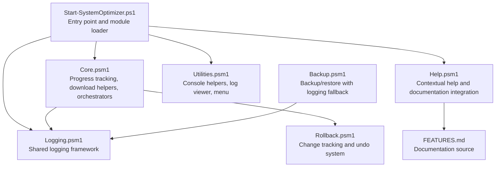
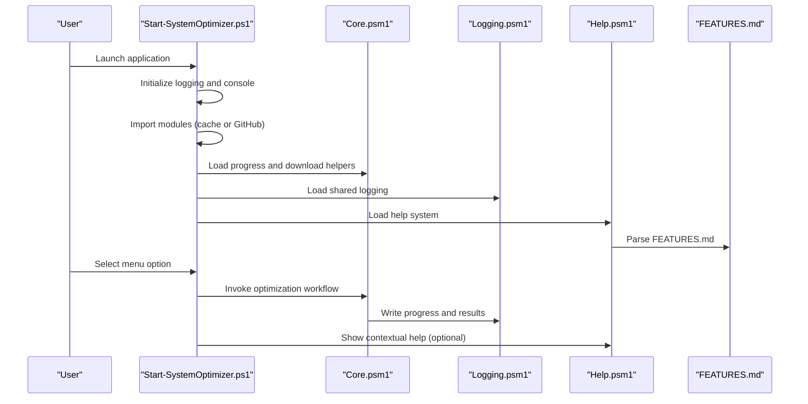
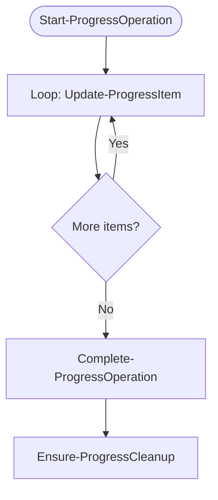
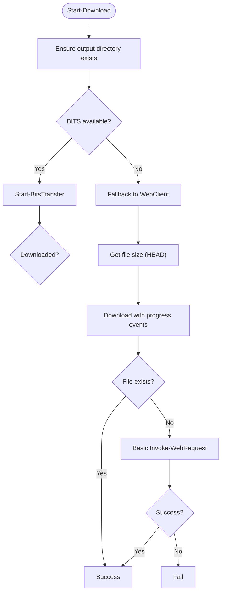
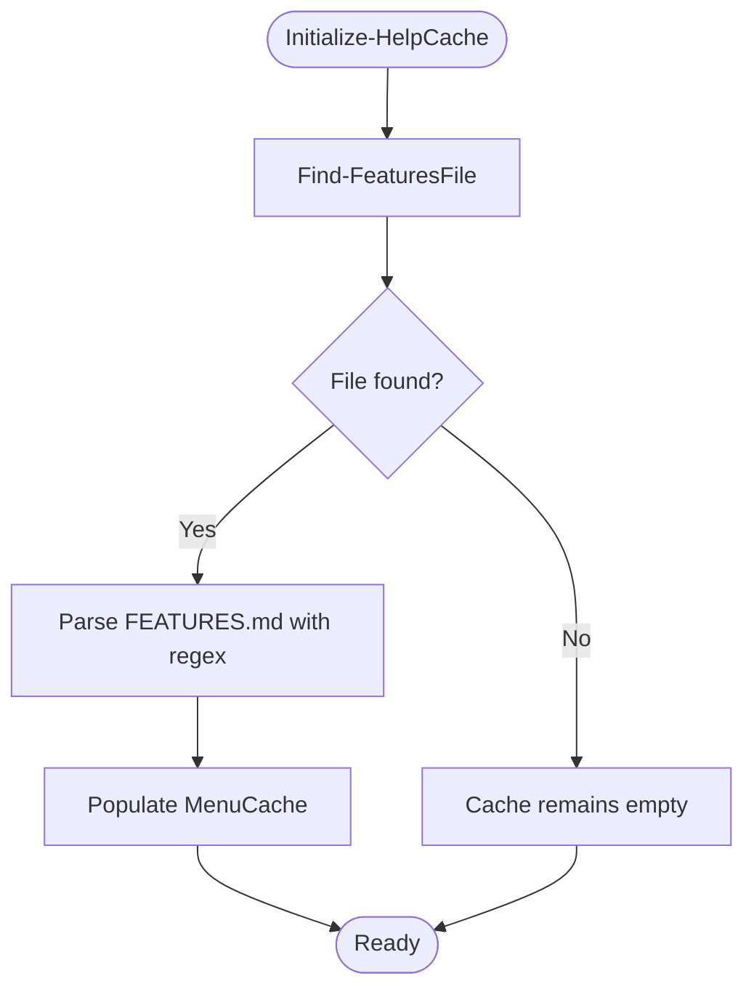
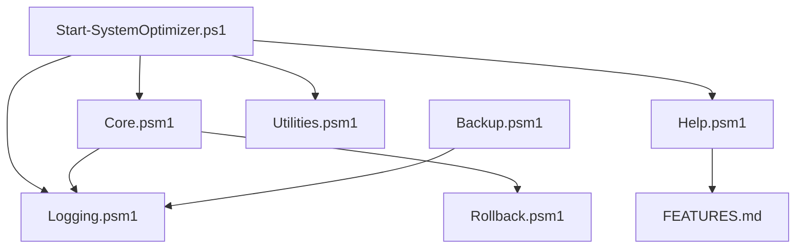

# Core Modules

<cite>
**Referenced Files in This Document**
- [Core.psm1](file://modules/Core.psm1)
- [Logging.psm1](file://modules/Logging.psm1)
- [Help.psm1](file://modules/Help.psm1)
- [Utilities.psm1](file://modules/Utilities.psm1)
- [Start-SystemOptimizer.ps1](file://Start-SystemOptimizer.ps1)
- [Backup.psm1](file://modules/Backup.psm1)
- [Rollback.psm1](file://modules/Rollback.psm1)
- [FEATURES.md](file://docs/FEATURES.md)
</cite>

## Table of Contents
1. [Introduction](#introduction)
2. [Project Structure](#project-structure)
3. [Core Components](#core-components)
4. [Architecture Overview](#architecture-overview)
5. [Detailed Component Analysis](#detailed-component-analysis)
6. [Dependency Analysis](#dependency-analysis)
7. [Performance Considerations](#performance-considerations)
8. [Troubleshooting Guide](#troubleshooting-guide)
9. [Conclusion](#conclusion)

## Introduction
This document describes the System Optimizer’s core modules that provide foundational functionality: Core, Logging, and Help. It explains the progress tracking system, logging framework, download helpers, and shared utilities. It also covers the Help module’s contextual assistance and documentation integration. For each module, you will find function documentation, parameters, return values, practical usage examples, and how these modules integrate with other components to form the system’s architecture.

## Project Structure
The core modules are organized as PowerShell modules under the modules directory. They are loaded dynamically by the main entry point script, which manages module discovery, caching, and versioning. The Logging module is also available as a shared module for other components. The Help module integrates with the centralized documentation to provide contextual assistance.

**Diagram sources**
- [Start-SystemOptimizer.ps1](file://Start-SystemOptimizer.ps1#L380-L474)
- [Core.psm1](file://modules/Core.psm1#L698-L791)
- [Logging.psm1](file://modules/Logging.psm1#L18-L58)
- [Help.psm1](file://modules/Help.psm1#L15-L56)
- [Utilities.psm1](file://modules/Utilities.psm1#L330-L383)
- [Backup.psm1](file://modules/Backup.psm1#L14-L31)
- [Rollback.psm1](file://modules/Rollback.psm1#L29-L78)
- [FEATURES.md](file://docs/FEATURES.md#L1-L40)

**Section sources**
- [Start-SystemOptimizer.ps1](file://Start-SystemOptimizer.ps1#L380-L474)
- [Core.psm1](file://modules/Core.psm1#L698-L791)
- [Logging.psm1](file://modules/Logging.psm1#L18-L58)
- [Help.psm1](file://modules/Help.psm1#L15-L56)
- [Utilities.psm1](file://modules/Utilities.psm1#L330-L383)
- [Backup.psm1](file://modules/Backup.psm1#L14-L31)
- [Rollback.psm1](file://modules/Rollback.psm1#L29-L78)
- [FEATURES.md](file://docs/FEATURES.md#L1-L40)

## Core Components
This section focuses on the three core modules and their primary responsibilities.

- Core.psm1: Provides progress tracking, enhanced progress bars, verbose mode, download helpers with progress, and orchestration functions for running all optimizations and full setup workflows.
- Logging.psm1: Offers a shared logging framework with file and console output, error reporting, command execution logging, operation timing, and log management utilities.
- Help.psm1: Integrates with FEATURES.md to provide contextual help, menu descriptions, and inline help for menu items.

**Section sources**
- [Core.psm1](file://modules/Core.psm1#L6-L29)
- [Logging.psm1](file://modules/Logging.psm1#L13-L16)
- [Help.psm1](file://modules/Help.psm1#L1-L14)

## Architecture Overview
The modules integrate through the main entry point, which loads modules from either a persistent cache or GitHub, and exposes a unified menu interface. The Core module coordinates operations and uses Logging for consistent output. The Help module reads documentation to present contextual assistance. Backup and Rollback modules rely on Logging for audit trails.

**Diagram sources**
- [Start-SystemOptimizer.ps1](file://Start-SystemOptimizer.ps1#L380-L474)
- [Core.psm1](file://modules/Core.psm1#L698-L791)
- [Logging.psm1](file://modules/Logging.psm1#L18-L58)
- [Help.psm1](file://modules/Help.psm1#L15-L56)
- [FEATURES.md](file://docs/FEATURES.md#L1-L40)

## Detailed Component Analysis

### Core Module
The Core module provides:
- Progress tracking: initialization, item updates, completion summaries, and cleanup.
- Enhanced progress display: console, GUI, and ANSI fallbacks.
- Download helpers: BITS-first download with fallbacks and progress reporting.
- Orchestrators: run all optimizations and full setup workflows with rollback integration.

Key functions and parameters:
- Set-VerboseProgress - Enables/disables verbose progress mode.
  - Parameters: Enabled (bool)
  - Returns: None
  - Practical usage: Call to toggle detailed output during operations.
- Start-ProgressOperation - Initializes a new progress tracking operation.
  - Parameters: Name (string), TotalItems (int)
  - Returns: None
  - Practical usage: Call before processing a batch of items.
- Update-ProgressItem - Updates progress for a single item.
  - Parameters: ItemName (string), Status (Success|Failed|Skipped|Info), Message (string), VerboseDetail (string)
  - Returns: None
  - Practical usage: Call after each item completes.
- Complete-ProgressOperation - Finalizes progress and prints summary.
  - Parameters: ShowDetails (switch)
  - Returns: Summary object with Operation, Duration, Success, Failed, Skipped, Total, Results
  - Practical usage: Call after finishing a batch.
- Show-EnhancedProgress - Renders a progress bar across environments.
  - Parameters: Percent (int), Activity (string), Status (string), Width (int), UseGUI (switch)
  - Returns: None
  - Practical usage: Call periodically to update progress.
- Ensure-ProgressCleanup - Ensures progress displays are closed.
  - Parameters: None
  - Returns: None
  - Practical usage: Call at the end of operations.
- Close-EnhancedProgress - Closes GUI and console progress displays.
  - Parameters: None
  - Returns: None
  - Practical usage: Call to finalize progress UI.
- Set-ProgressMode - Sets preferred progress display mode.
  - Parameters: Mode (Auto|Console|GUI)
  - Returns: None
  - Practical usage: Choose mode based on environment.
- Write-ProgressLog - Writes a timestamped progress message.
  - Parameters: Message (string), Type (Info|Success|Warning|Error|Section)
  - Returns: None
  - Practical usage: Log progress messages consistently.
- Start-Download - Downloads a file with progress and fallbacks.
  - Parameters: Url (string), OutFile (string), Description (string)
  - Returns: Boolean (success)
  - Practical usage: Download files with user-visible progress.
- Run-AllOptimizations - Runs the complete optimization workflow.
  - Parameters: None
  - Returns: None
  - Practical usage: Execute all optimizations with rollback session and optional restore point.
- Run-FullSetup - Executes the full setup workflow (software + Office + services + activation).
  - Parameters: None
  - Returns: None
  - Practical usage: Guided setup for new systems.

Integration highlights:
- Uses Logging for consistent output and progress messages.
- Integrates with Rollback to track changes and generate undo scripts.
- Provides download helpers used by software installation workflows.

**Section sources**
- [Core.psm1](file://modules/Core.psm1#L30-L50)
- [Core.psm1](file://modules/Core.psm1#L60-L95)
- [Core.psm1](file://modules/Core.psm1#L97-L203)
- [Core.psm1](file://modules/Core.psm1#L205-L251)
- [Core.psm1](file://modules/Core.psm1#L253-L278)
- [Core.psm1](file://modules/Core.psm1#L280-L396)
- [Core.psm1](file://modules/Core.psm1#L398-L444)
- [Core.psm1](file://modules/Core.psm1#L446-L479)
- [Core.psm1](file://modules/Core.psm1#L481-L509)
- [Core.psm1](file://modules/Core.psm1#L511-L551)
- [Core.psm1](file://modules/Core.psm1#L556-L696)
- [Core.psm1](file://modules/Core.psm1#L698-L791)

#### Progress Tracking Flow

**Diagram sources**
- [Core.psm1](file://modules/Core.psm1#L60-L95)
- [Core.psm1](file://modules/Core.psm1#L97-L203)
- [Core.psm1](file://modules/Core.psm1#L205-L251)
- [Core.psm1](file://modules/Core.psm1#L398-L444)

#### Download Helper Flow

**Diagram sources**
- [Core.psm1](file://modules/Core.psm1#L556-L696)

### Logging Module
The Logging module provides:
- Centralized logging with file and console output.
- Error reporting with exception details.
- Command execution logging with exit codes and optional output capture.
- Operation timing with start and completion messages.
- Log management: retention, viewing recent entries, exporting summaries, and completion footers.

Key functions and parameters:
- Initialize-Logging - Initializes logging for a component.
  - Parameters: ComponentName (string), CustomLogDir (string)
  - Returns: Current log file path
  - Practical usage: Call at the start of a component to create a log file.
- Remove-OldLogs - Cleans up logs older than retention threshold.
  - Parameters: None
  - Returns: None
  - Practical usage: Call periodically to manage disk usage.
- Write-OptLog - Writes a formatted log message.
  - Parameters: Message (string), Type (INFO|SUCCESS|ERROR|WARNING|SECTION|DEBUG), NoConsole (switch), NoFile (switch)
  - Returns: None
  - Practical usage: Use for general logging across components.
- Write-OptError - Logs an error with exception details.
  - Parameters: Message (string), ErrorRecord (ErrorRecord)
  - Returns: None
  - Practical usage: Use when catching exceptions to capture full details.
- Write-OptCommand - Logs command execution with result.
  - Parameters: Command (string), ExitCode (int), Output (string)
  - Returns: None
  - Practical usage: Log executed commands and outcomes.
- Write-OptSection - Logs a section header.
  - Parameters: SectionName (string)
  - Returns: None
  - Practical usage: Use to separate logical groups in logs.
- Start-OptOperation - Starts timing an operation.
  - Parameters: OperationName (string)
  - Returns: None
  - Practical usage: Call before performing a task to measure duration.
- Complete-OptOperation - Completes timing and logs outcome.
  - Parameters: Success (bool), Message (string)
  - Returns: None
  - Practical usage: Call after completing a task to record duration and status.
- Get-OptLogPath - Returns current log file path.
  - Parameters: None
  - Returns: String
  - Practical usage: Use to reference the active log file.
- Get-OptLogFiles - Lists log files filtered by component.
  - Parameters: ComponentFilter (string)
  - Returns: Array of FileInfo
  - Practical usage: Enumerate recent logs for analysis.
- Show-OptRecentLogs - Displays recent log entries.
  - Parameters: Lines (int), ComponentFilter (string)
  - Returns: None
  - Practical usage: Quickly inspect recent activity.
- Export-OptLogSummary - Exports a summary of log files.
  - Parameters: OutputPath (string)
  - Returns: String (path to summary)
  - Practical usage: Generate reports for support or auditing.
- Complete-Logging - Writes a completion footer to the log.
  - Parameters: None
  - Returns: None
  - Practical usage: Call at the end of a component lifecycle.

Integration highlights:
- Used by Core for consistent progress and operation logging.
- Used by Utilities for log viewer and backup/restore operations.
- Provides a shared interface for other modules to log reliably.

**Section sources**
- [Logging.psm1](file://modules/Logging.psm1#L18-L58)
- [Logging.psm1](file://modules/Logging.psm1#L61-L66)
- [Logging.psm1](file://modules/Logging.psm1#L69-L123)
- [Logging.psm1](file://modules/Logging.psm1#L126-L145)
- [Logging.psm1](file://modules/Logging.psm1#L148-L163)
- [Logging.psm1](file://modules/Logging.psm1#L166-L169)
- [Logging.psm1](file://modules/Logging.psm1#L172-L195)
- [Logging.psm1](file://modules/Logging.psm1#L198-L200)
- [Logging.psm1](file://modules/Logging.psm1#L203-L208)
- [Logging.psm1](file://modules/Logging.psm1#L211-L227)
- [Logging.psm1](file://modules/Logging.psm1#L230-L252)
- [Logging.psm1](file://modules/Logging.psm1#L255-L265)

### Help Module
The Help module provides:
- Contextual assistance by parsing FEATURES.md.
- Help caching to avoid repeated downloads.
- Display of help for specific menu items or a help menu.
- Inline help for menu items.

Key functions and parameters:
- Find-FeaturesFile - Locates FEATURES.md locally or downloads from GitHub.
  - Parameters: None
  - Returns: Path to FEATURES.md or null
  - Practical usage: Call to resolve documentation source.
- Initialize-HelpCache - Parses FEATURES.md and caches menu data.
  - Parameters: None
  - Returns: None
  - Practical usage: Call once to populate cache.
- Show-MenuHelp - Displays help for a specific menu item or the help menu.
  - Parameters: MenuNumber (string)
  - Returns: None
  - Practical usage: Present contextual help to users.
- Get-MenuItemDescription - Returns a brief description for a menu item.
  - Parameters: MenuNumber (int)
  - Returns: String or null
  - Practical usage: Use for inline descriptions in menus.

Integration highlights:
- Reads FEATURES.md to provide rich, contextual help.
- Supports both local and remote documentation sources.
- Used by the main menu to enhance user experience.

**Section sources**
- [Help.psm1](file://modules/Help.psm1#L15-L56)
- [Help.psm1](file://modules/Help.psm1#L58-L102)
- [Help.psm1](file://modules/Help.psm1#L104-L232)
- [Help.psm1](file://modules/Help.psm1#L234-L261)
- [FEATURES.md](file://docs/FEATURES.md#L1-L40)

#### Help Parsing Flow

**Diagram sources**
- [Help.psm1](file://modules/Help.psm1#L15-L56)
- [Help.psm1](file://modules/Help.psm1#L58-L102)

### Shared Utilities
Utilities provide:
- Console sizing and menu rendering.
- Log viewer for browsing and exporting logs.
- Wi-Fi password extraction.
- System status verification.

Key functions and parameters:
- Set-ConsoleSize - Resizes console window.
  - Parameters: Width (int), Height (int)
  - Returns: None
  - Practical usage: Ensure readable UI in various terminals.
- Show-Menu - Renders the main menu with available options.
  - Parameters: None
  - Returns: None
  - Practical usage: Display interactive menu.
- Show-LogViewer - Browses recent logs, exports summaries, clears old logs.
  - Parameters: None
  - Returns: None
  - Practical usage: Diagnose issues and manage logs.
- Get-WifiPasswords - Extracts saved Wi-Fi credentials.
  - Parameters: None
  - Returns: None
  - Practical usage: Audit network security.
- Verify-OptimizationStatus - Checks current system state against optimization targets.
  - Parameters: None
  - Returns: None
  - Practical usage: Validate applied changes.

Integration highlights:
- Used by the main entry point to render menus and manage console layout.
- Provides diagnostic capabilities integrated with logging.

**Section sources**
- [Utilities.psm1](file://modules/Utilities.psm1#L297-L328)
- [Utilities.psm1](file://modules/Utilities.psm1#L330-L383)
- [Utilities.psm1](file://modules/Utilities.psm1#L121-L243)
- [Utilities.psm1](file://modules/Utilities.psm1#L5-L42)
- [Utilities.psm1](file://modules/Utilities.psm1#L44-L119)

## Dependency Analysis
The modules depend on each other and on shared infrastructure:
- Core depends on Logging for consistent output and Rollback for change tracking.
- Help depends on FEATURES.md for content.
- Utilities depends on Logging for log viewer and backup/restore operations.
- Start-SystemOptimizer.ps1 orchestrates module loading and provides a unified menu.

**Diagram sources**
- [Start-SystemOptimizer.ps1](file://Start-SystemOptimizer.ps1#L380-L474)
- [Core.psm1](file://modules/Core.psm1#L698-L791)
- [Logging.psm1](file://modules/Logging.psm1#L18-L58)
- [Help.psm1](file://modules/Help.psm1#L15-L56)
- [Utilities.psm1](file://modules/Utilities.psm1#L330-L383)
- [Backup.psm1](file://modules/Backup.psm1#L14-L31)
- [Rollback.psm1](file://modules/Rollback.psm1#L29-L78)
- [FEATURES.md](file://docs/FEATURES.md#L1-L40)

**Section sources**
- [Start-SystemOptimizer.ps1](file://Start-SystemOptimizer.ps1#L380-L474)
- [Core.psm1](file://modules/Core.psm1#L698-L791)
- [Logging.psm1](file://modules/Logging.psm1#L18-L58)
- [Help.psm1](file://modules/Help.psm1#L15-L56)
- [Utilities.psm1](file://modules/Utilities.psm1#L330-L383)
- [Backup.psm1](file://modules/Backup.psm1#L14-L31)
- [Rollback.psm1](file://modules/Rollback.psm1#L29-L78)
- [FEATURES.md](file://docs/FEATURES.md#L1-L40)

## Performance Considerations
- Progress tracking: The Core module calculates ETA using item times; keep TotalItems accurate to improve ETA precision.
- Download helpers: Prefer BITS when available for native progress; fallbacks still provide user feedback.
- Logging: Avoid excessive DEBUG output in production; use environment variable toggles for debug verbosity.
- Help parsing: Cache parsed content to minimize repeated file operations and network calls.
- Console sizing: Resize only when necessary to avoid terminal flicker.

[No sources needed since this section provides general guidance]

## Troubleshooting Guide
Common issues and resolutions:
- Module load failures: The main entry point attempts to reload modules or download missing ones. Check network connectivity and module paths.
- Progress display anomalies: Use Set-ProgressMode to force GUI or console mode. Call Ensure-ProgressCleanup to reset state.
- Log retention: Use Remove-OldLogs or the log viewer to manage disk usage.
- Help unavailable: Ensure FEATURES.md is accessible locally or reachable via the internet; the module will attempt to download it.
- Download failures: The download helper tries multiple methods; check network and permissions.

**Section sources**
- [Start-SystemOptimizer.ps1](file://Start-SystemOptimizer.ps1#L575-L623)
- [Core.psm1](file://modules/Core.psm1#L398-L444)
- [Logging.psm1](file://modules/Logging.psm1#L61-L66)
- [Help.psm1](file://modules/Help.psm1#L37-L56)
- [Core.psm1](file://modules/Core.psm1#L698-L791)

## Conclusion
The Core, Logging, and Help modules form the foundation of System Optimizer’s operational and user experience layers. Core provides robust progress tracking and download helpers, Logging ensures consistent audit trails, and Help delivers contextual assistance powered by centralized documentation. Together with Utilities and the main entry point, they create a cohesive, extensible architecture suitable for both interactive use and automated workflows.