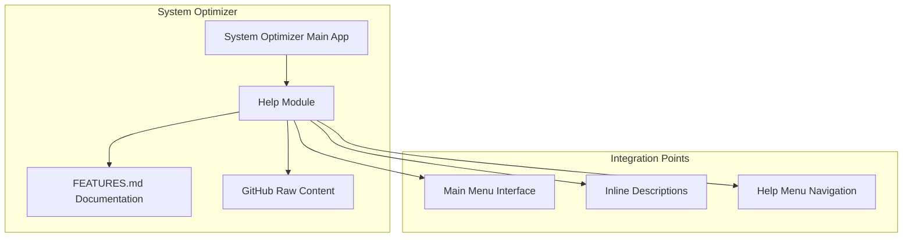
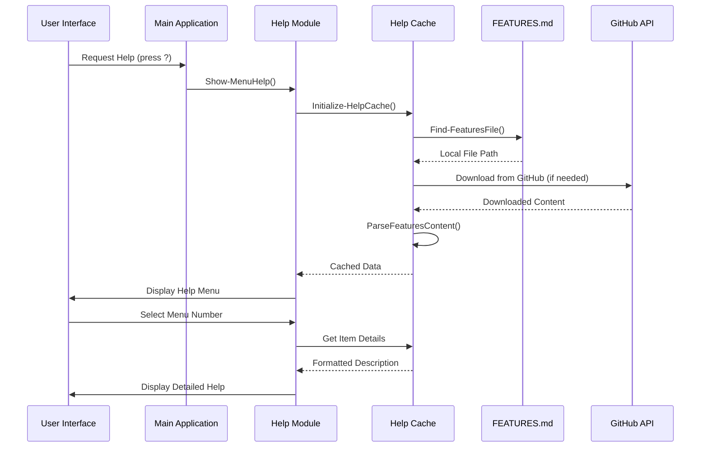
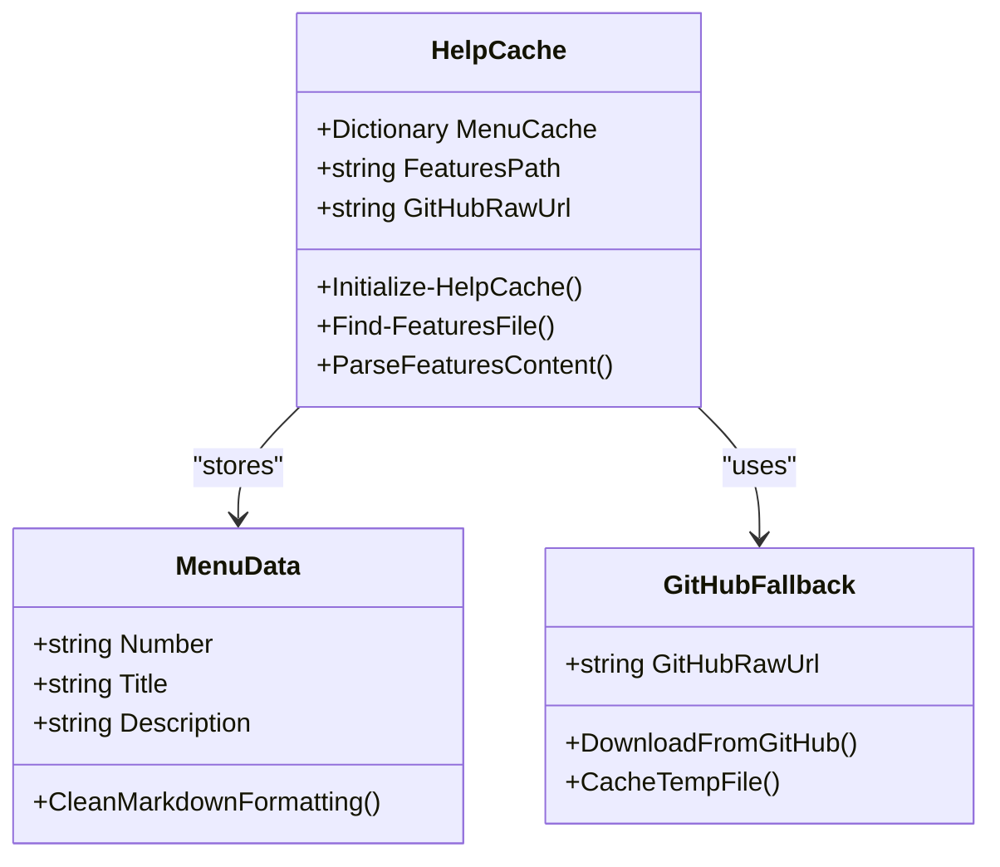
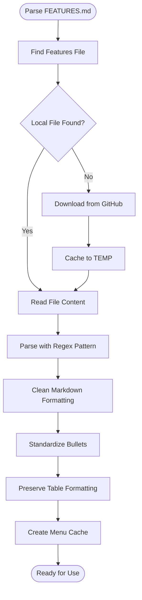
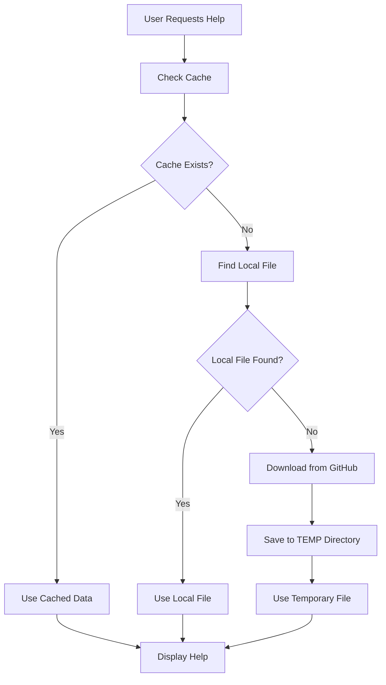
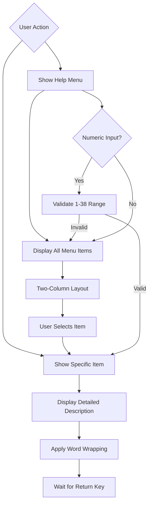
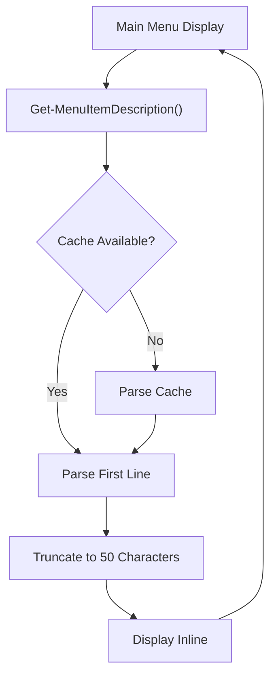
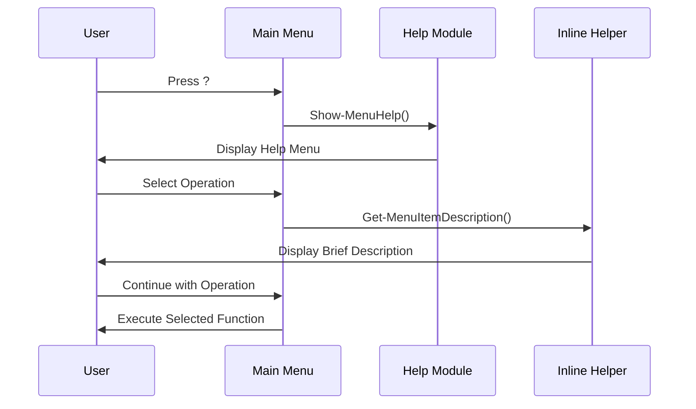
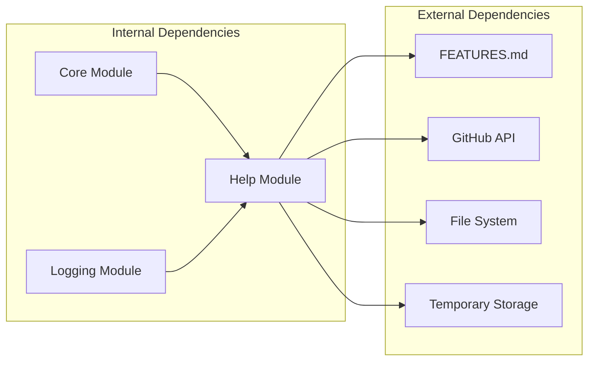

# Help Module

<cite>
**Referenced Files in This Document**
- [Help.psm1](file://modules/Help.psm1)
- [Start-SystemOptimizer.ps1](file://Start-SystemOptimizer.ps1)
- [FEATURES.md](file://docs/FEATURES.md)
</cite>

## Update Summary
**Changes Made**
- Complete rewrite of Help module with enhanced dynamic help parsing
- Added comprehensive caching capabilities for improved performance
- Implemented GitHub fallback mechanisms for documentation transparency
- Enhanced menu number matching for better documentation integration
- Improved content parsing with advanced markdown formatting support
- Added inline help functionality for real-time menu descriptions

## Table of Contents
1. [Introduction](#introduction)
2. [Project Structure](#project-structure)
3. [Core Components](#core-components)
4. [Architecture Overview](#architecture-overview)
5. [Detailed Component Analysis](#detailed-component-analysis)
6. [Dependency Analysis](#dependency-analysis)
7. [Performance Considerations](#performance-considerations)
8. [Troubleshooting Guide](#troubleshooting-guide)
9. [Conclusion](#conclusion)

## Introduction
The Help module provides contextual assistance and documentation integration for the System Optimizer's menu-driven interface. It serves as the primary source of user guidance during interactive operations, delivering detailed descriptions of menu items and supporting both novice and experienced users through progressive disclosure of information.

The help system transforms structured documentation from the FEATURES.md file into an accessible, navigable interface that enhances user experience by providing immediate, contextually relevant assistance without interrupting the optimization workflow. The module now features a complete rewrite with enhanced functionality including dynamic help parsing, comprehensive caching, and GitHub fallback mechanisms.

## Project Structure
The help system is organized as a standalone PowerShell module that integrates seamlessly with the main application:

**Diagram sources**
- [Help.psm1](file://modules/Help.psm1#L1-L293)
- [Start-SystemOptimizer.ps1](file://Start-SystemOptimizer.ps1#L958-L964)

**Section sources**
- [Help.psm1](file://modules/Help.psm1#L1-L293)
- [Start-SystemOptimizer.ps1](file://Start-SystemOptimizer.ps1#L958-L964)

## Core Components
The Help module consists of five primary functions that work together to deliver comprehensive assistance with enhanced functionality:

### Enhanced Help Cache System
The module maintains a persistent cache of parsed menu data with intelligent fallback mechanisms, eliminating redundant file operations and ensuring responsive help access throughout the application session.

### Dynamic Content Parser
A sophisticated regex-based parser extracts structured content from FEATURES.md, converting markdown-formatted descriptions into clean, console-friendly text suitable for terminal display with advanced formatting preservation.

### GitHub Fallback Mechanism
Intelligent file detection across multiple potential locations with automatic GitHub download when local files are unavailable, ensuring documentation transparency even when running from GitHub directly.

### Interactive Help Interface
A dual-mode help system that provides both quick inline descriptions and comprehensive detailed views, supporting progressive disclosure of information based on user needs with enhanced menu number validation.

### Inline Help Integration
Real-time help descriptions for menu items displayed directly in the main menu interface, providing immediate context without interrupting the optimization workflow.

**Section sources**
- [Help.psm1](file://modules/Help.psm1#L38-L41)
- [Help.psm1](file://modules/Help.psm1#L86-L130)
- [Help.psm1](file://modules/Help.psm1#L43-L84)
- [Help.psm1](file://modules/Help.psm1#L132-L260)
- [Help.psm1](file://modules/Help.psm1#L262-L289)

## Architecture Overview
The help system follows a modular architecture that separates concerns between content parsing, caching, and presentation with enhanced error handling and fallback mechanisms:

**Diagram sources**
- [Start-SystemOptimizer.ps1](file://Start-SystemOptimizer.ps1#L958-L964)
- [Help.psm1](file://modules/Help.psm1#L86-L130)
- [Help.psm1](file://modules/Help.psm1#L43-L84)

## Detailed Component Analysis

### Enhanced Help Cache Implementation
The caching mechanism ensures optimal performance by maintaining parsed menu data in memory with intelligent fallback and error handling:

**Diagram sources**
- [Help.psm1](file://modules/Help.psm1#L38-L41)
- [Help.psm1](file://modules/Help.psm1#L86-L130)
- [Help.psm1](file://modules/Help.psm1#L43-L84)

The cache system implements intelligent fallback mechanisms:
- Multiple local file detection across various potential locations
- Automatic GitHub download with temporary file caching
- Persistent caching to avoid repeated parsing operations
- Graceful degradation when documentation is unavailable

**Section sources**
- [Help.psm1](file://modules/Help.psm1#L38-L41)
- [Help.psm1](file://modules/Help.psm1#L43-L84)
- [Help.psm1](file://modules/Help.psm1#L86-L130)

### Advanced Content Parsing Engine
The parser converts markdown-formatted documentation into console-friendly text with enhanced formatting preservation:

**Diagram sources**
- [Help.psm1](file://modules/Help.psm1#L105-L129)

The parsing engine handles various markdown elements with enhanced formatting:
- Bold text removal for console display
- Bullet point standardization with spacing preservation
- Table formatting with pipe character spacing
- Line break normalization with maximum 2 newlines
- Comprehensive regex pattern matching for menu items

**Section sources**
- [Help.psm1](file://modules/Help.psm1#L105-L129)

### GitHub Fallback Mechanism
The fallback system ensures documentation availability even when running from GitHub directly:

**Diagram sources**
- [Help.psm1](file://modules/Help.psm1#L43-L84)

The fallback system includes:
- Multiple local path detection across different installation scenarios
- Automatic GitHub download with timeout handling
- Temporary file caching for offline access
- Error handling for network failures

**Section sources**
- [Help.psm1](file://modules/Help.psm1#L43-L84)

### Interactive Help Interface
The help interface provides multiple interaction modes with enhanced user experience:

**Diagram sources**
- [Help.psm1](file://modules/Help.psm1#L132-L260)

The interface supports:
- Quick navigation through menu items with column layout
- Detailed view of selected operations with word wrapping
- Responsive menu number validation (1-38 range)
- Intuitive return mechanisms with key press handling

**Section sources**
- [Help.psm1](file://modules/Help.psm1#L132-L260)

### Inline Help Integration
The inline help system provides real-time descriptions for menu items displayed directly in the main interface:

**Diagram sources**
- [Help.psm1](file://modules/Help.psm1#L262-L289)

The inline help system includes:
- Real-time description extraction for menu items
- First-line parsing with sentence boundary detection
- Character limit enforcement (50 characters max)
- Integration with main menu display system

**Section sources**
- [Help.psm1](file://modules/Help.psm1#L262-L289)

### Integration with Main Application
The help system integrates seamlessly with the main menu interface with enhanced error handling:

**Diagram sources**
- [Start-SystemOptimizer.ps1](file://Start-SystemOptimizer.ps1#L958-L964)
- [Help.psm1](file://modules/Help.psm1#L262-L289)

**Section sources**
- [Start-SystemOptimizer.ps1](file://Start-SystemOptimizer.ps1#L958-L964)
- [Help.psm1](file://modules/Help.psm1#L262-L289)

## Dependency Analysis
The help system maintains minimal external dependencies while providing maximum functionality with enhanced error handling:

**Diagram sources**
- [Help.psm1](file://modules/Help.psm1#L38-L41)
- [Help.psm1](file://modules/Help.psm1#L43-L84)

The module's dependency structure ensures:
- Self-contained functionality with robust external resource fallback
- Minimal impact on application startup time with lazy loading
- Graceful error handling for network and file system failures
- Temporary file management for offline access

**Section sources**
- [Help.psm1](file://modules/Help.psm1#L38-L41)
- [Help.psm1](file://modules/Help.psm1#L43-L84)

## Performance Considerations
The help system implements several optimization strategies with enhanced efficiency:

### Memory Management
- Single-time parsing with persistent caching and lazy initialization
- Efficient string processing for console output with word wrapping
- Temporary file caching to avoid repeated network requests

### Network Optimization
- Local file preference over network requests with multiple path detection
- Temporary file caching for offline access with automatic cleanup
- Timeout handling for network operations (10-second timeout)
- Error recovery and graceful degradation

### Console Efficiency
- Intelligent word wrapping to prevent line overflow with 76-character width
- Color-coded output for improved readability with enhanced formatting
- Minimal console refresh operations with batched output
- Column-based layout optimization for better screen utilization

**Section sources**
- [Help.psm1](file://modules/Help.psm1#L38-L41)
- [Help.psm1](file://modules/Help.psm1#L160-L187)
- [Help.psm1](file://modules/Help.psm1#L206-L235)

## Troubleshooting Guide

### Common Issues and Solutions

**Help Documentation Not Available**
- **Symptom**: Help system shows "Documentation not available" message
- **Cause**: FEATURES.md not found locally or network download failed
- **Solution**: Download full repository from GitHub or manually place FEATURES.md in docs/ directory
- **Enhanced**: System now provides specific guidance on accessing documentation

**Menu Number Validation Failures**
- **Symptom**: Invalid menu number errors when selecting help items
- **Cause**: Numbers outside 1-38 range or non-numeric input
- **Solution**: Ensure selection is numeric and within valid range (1-38)
- **Enhanced**: Improved validation with clear error messages

**Console Display Issues**
- **Symptom**: Text wrapping or formatting problems in help display
- **Cause**: Console width or character encoding issues
- **Solution**: Adjust console window size or verify UTF-8 encoding support
- **Enhanced**: Automatic word wrapping with 76-character width limit

**Performance Problems**
- **Symptom**: Slow help response times or delayed loading
- **Cause**: Large console buffers or frequent help requests
- **Solution**: Clear console buffer or reduce help usage frequency
- **Enhanced**: Persistent caching eliminates repeated parsing operations

**GitHub Download Failures**
- **Symptom**: Help system cannot download documentation from GitHub
- **Cause**: Network connectivity issues or GitHub API restrictions
- **Solution**: Check internet connection or manually download FEATURES.md
- **Enhanced**: Automatic fallback to cached temporary files when available

**Section sources**
- [Help.psm1](file://modules/Help.psm1#L190-L202)
- [Help.psm1](file://modules/Help.psm1#L256-L258)
- [Help.psm1](file://modules/Help.psm1#L168-L187)
- [Help.psm1](file://modules/Help.psm1#L64-L84)

## Conclusion
The Help module serves as a critical component of the System Optimizer's user experience, providing contextual assistance that bridges the gap between complex optimization operations and user understanding. Through its intelligent caching, robust parsing, GitHub fallback mechanisms, and seamless integration with the main application, it delivers progressive disclosure of information that supports users at every skill level.

The module's complete rewrite demonstrates best practices in PowerShell module design, with clear separation of concerns, efficient resource management, and graceful error handling. Its enhanced architecture with caching capabilities, dynamic help parsing, and improved menu number matching ensures that assistance is always available when needed while maintaining the streamlined workflow essential for system optimization tasks.

The integration with the menu-driven interface ensures that help is contextually relevant and immediately accessible, while the GitHub fallback mechanisms guarantee documentation transparency even when running from GitHub directly. By transforming structured documentation into an accessible, navigable interface with real-time inline help, the help system enhances user confidence, reduces learning curves, and ultimately improves the effectiveness of the System Optimizer as a comprehensive Windows optimization toolkit.

The enhanced functionality including comprehensive caching, intelligent fallback mechanisms, and improved user experience makes this module a cornerstone of the System Optimizer's accessibility and usability features.