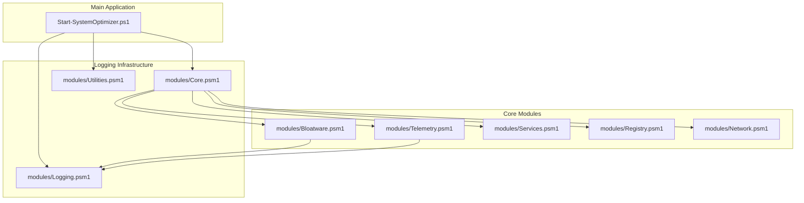
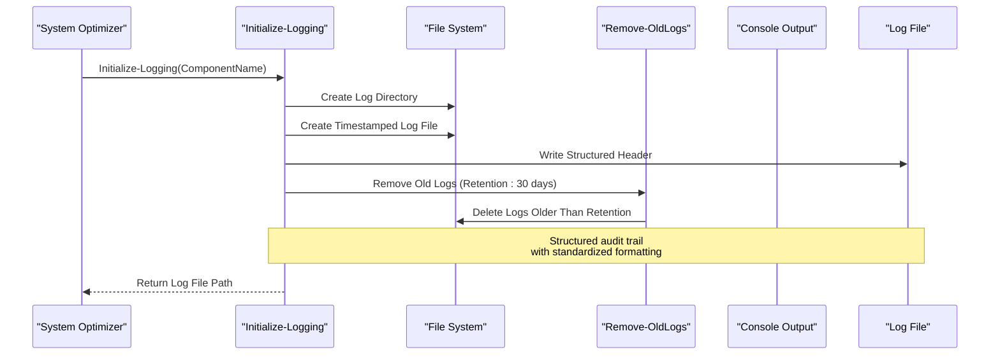
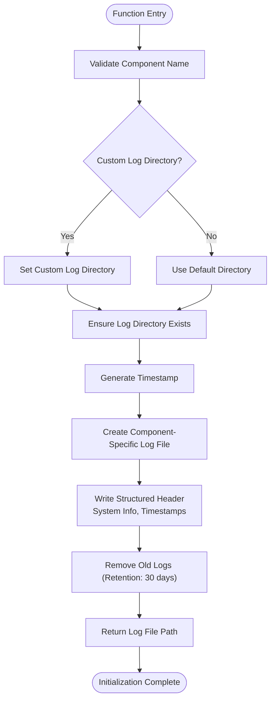
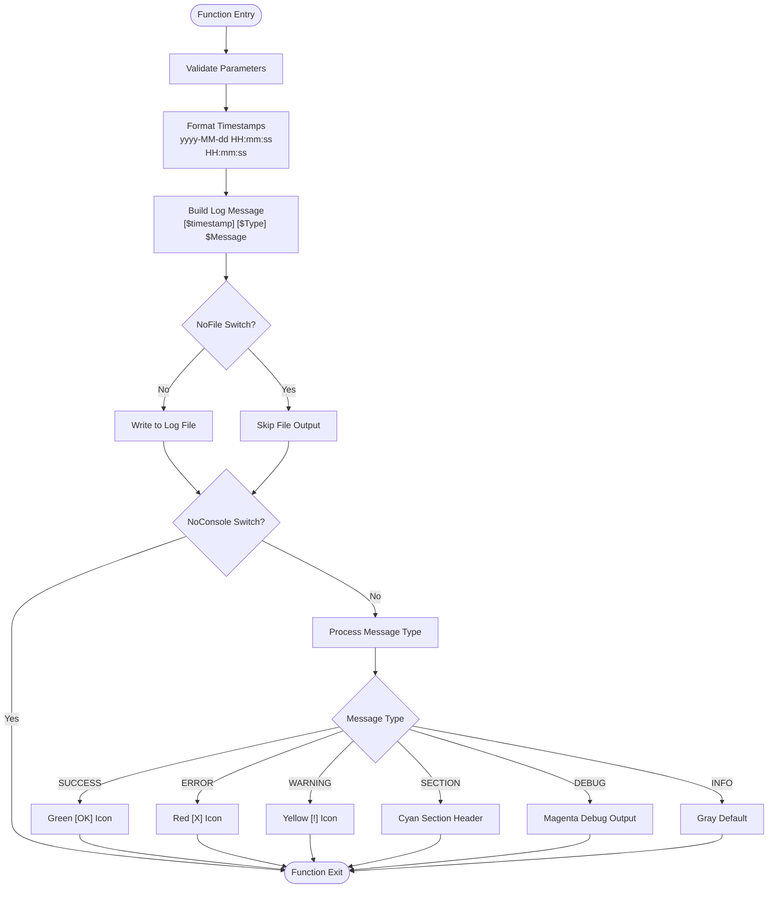
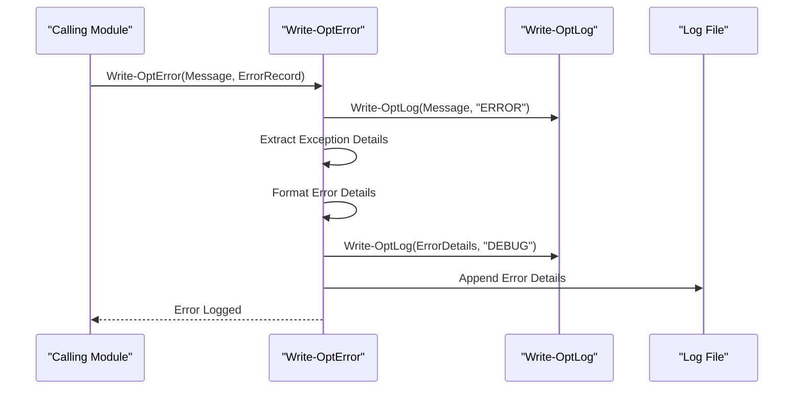
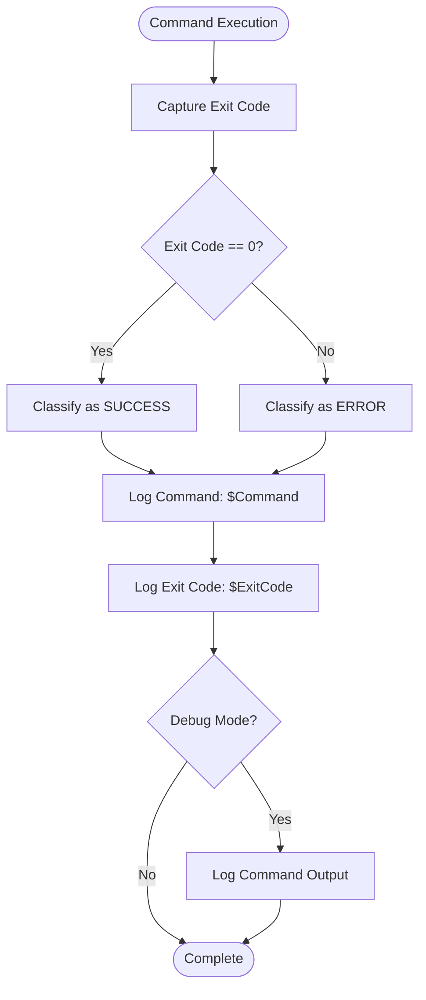
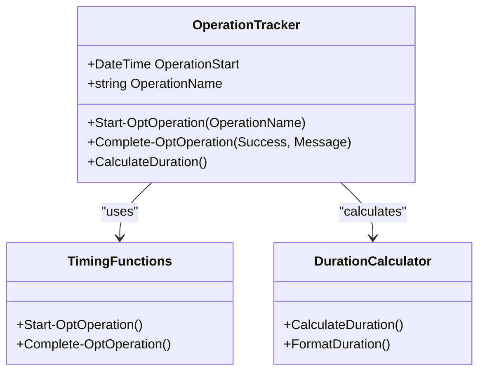
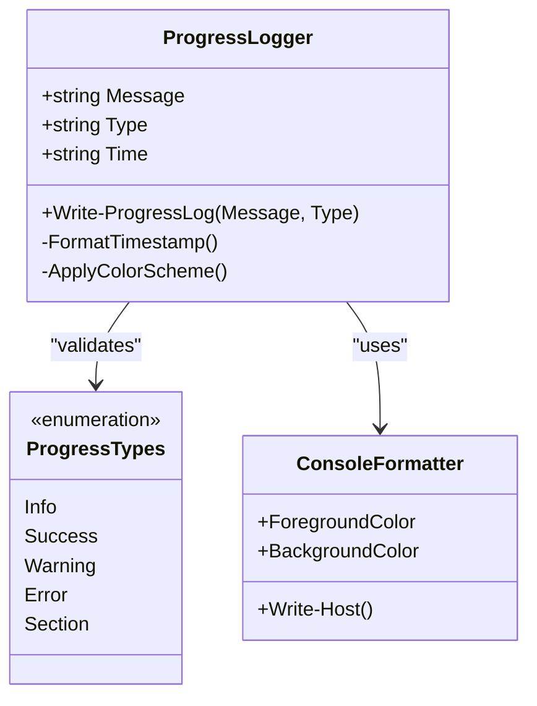
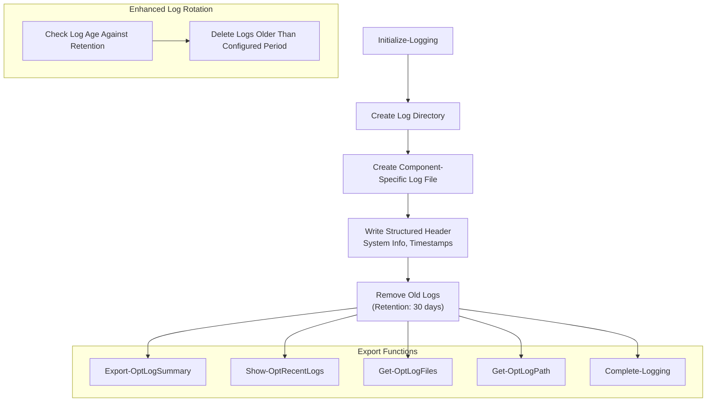
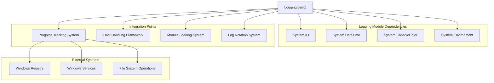

# Logging Module

<cite>
**Referenced Files in This Document**
- [Logging.psm1](file://modules/Logging.psm1)
- [Core.psm1](file://modules/Core.psm1)
- [Utilities.psm1](file://modules/Utilities.psm1)
- [Start-SystemOptimizer.ps1](file://Start-SystemOptimizer.ps1)
- [Bloatware.psm1](file://modules/Bloatware.psm1)
- [Telemetry.psm1](file://modules/Telemetry.psm1)
</cite>

## Update Summary
**Changes Made**
- Enhanced file rotation capabilities with configurable retention periods
- Added structured log entry formatting with standardized headers and footers
- Expanded logging function suite with new operation timing and summary features
- Improved audit trail management with comprehensive log lifecycle management
- Added component-specific logging with automatic file naming and organization

## Table of Contents
1. [Introduction](#introduction)
2. [Project Structure](#project-structure)
3. [Core Components](#core-components)
4. [Architecture Overview](#architecture-overview)
5. [Detailed Component Analysis](#detailed-component-analysis)
6. [Dependency Analysis](#dependency-analysis)
7. [Performance Considerations](#performance-considerations)
8. [Troubleshooting Guide](#troubleshooting-guide)
9. [Conclusion](#conclusion)

## Introduction
The Logging module provides comprehensive audit trail management and error reporting capabilities for the System Optimizer suite. It serves as a cross-cutting concern across all optimizer modules, ensuring consistent logging behavior, progress tracking integration, and standardized error reporting. The module offers multiple logging functions designed for different scenarios: detailed operation logging, progress messaging, and structured error reporting with exception details.

**Updated** The logging framework now features enhanced file rotation capabilities with configurable retention periods and structured log entry formatting that includes standardized headers, footers, and component-specific organization. These enhancements support the increased complexity and function count across the expanded module ecosystem.

The logging system integrates seamlessly with the progress tracking system, providing unified status updates that appear both in logs and real-time progress displays. This dual-channel approach ensures operators have immediate visual feedback while maintaining complete audit trails for troubleshooting and compliance.

## Project Structure
The logging system spans multiple modules within the System Optimizer architecture:

**Diagram sources**
- [Logging.psm1](file://modules/Logging.psm1#L1-L313)
- [Core.psm1](file://modules/Core.psm1#L1-L921)
- [Utilities.psm1](file://modules/Utilities.psm1#L1-L421)

**Section sources**
- [Logging.psm1](file://modules/Logging.psm1#L1-L313)
- [Core.psm1](file://modules/Core.psm1#L1-L921)

## Core Components
The logging system consists of several key components that work together to provide comprehensive audit trail management:

### Primary Logging Functions
The module provides nine primary logging functions, each designed for specific use cases:

- **Initialize-Logging**: Initializes logging for a specific component with automatic file creation and structured header formatting
- **Write-OptLog**: Main logging function for general operation logging with timestamp formatting and color-coded console output
- **Write-OptError**: Specialized error logging with exception details and stack trace information
- **Write-OptCommand**: Command execution logging with automatic success/error classification based on exit codes
- **Write-OptSection**: Section header logging with visual formatting for operation grouping
- **Start-OptOperation**: Operation timing and progress tracking with automatic duration calculation
- **Complete-OptOperation**: Operation completion logging with success/failure status and timing information
- **Get-OptLogPath**: Retrieves current log file path for external access
- **Complete-Logging**: Finalizes logging session with standardized footer formatting

### Enhanced File Rotation System
**Updated** The logging system now includes sophisticated file rotation capabilities:

- **Automatic Cleanup**: Removes logs older than configurable retention period (default: 30 days)
- **Component Organization**: Creates timestamped log files with component names for better organization
- **Structured Headers/Footers**: Adds standardized headers with system information and footers with completion timestamps
- **Retention Management**: Configurable retention periods with automatic cleanup during initialization

### Progress Integration
The logging system integrates with the progress tracking infrastructure through Write-ProgressLog, which provides real-time progress updates with consistent timestamp formatting and status icons.

### Audit Trail Management
**Updated** The module maintains comprehensive audit trails with automatic log rotation, structured formatting, and export capabilities for compliance and troubleshooting purposes. The enhanced system now supports:

- **Component-specific logging**: Separate log files for different system components
- **Standardized formatting**: Consistent header/footer structure across all log entries
- **Operation timing**: Automatic duration tracking for optimization operations
- **Summary exports**: Comprehensive log summaries with error/warning counts

**Section sources**
- [Logging.psm1](file://modules/Logging.psm1#L45-L86)
- [Logging.psm1](file://modules/Logging.psm1#L96-L151)
- [Logging.psm1](file://modules/Logging.psm1#L153-L173)
- [Logging.psm1](file://modules/Logging.psm1#L175-L191)
- [Logging.psm1](file://modules/Logging.psm1#L193-L223)
- [Logging.psm1](file://modules/Logging.psm1#L225-L293)

## Architecture Overview
The logging architecture follows a layered approach with clear separation of concerns:

**Diagram sources**
- [Logging.psm1](file://modules/Logging.psm1#L45-L86)
- [Logging.psm1](file://modules/Logging.psm1#L88-L94)

The architecture ensures that all logging operations maintain consistency across different execution contexts while providing flexibility for various output destinations.

## Detailed Component Analysis

### Initialize-Logging Function
**Updated** The Initialize-Logging function now provides comprehensive logging initialization with enhanced file rotation and structured formatting:

**Diagram sources**
- [Logging.psm1](file://modules/Logging.psm1#L45-L86)

The function creates component-specific log files with standardized headers containing system information, timestamps, and configuration details.

**Section sources**
- [Logging.psm1](file://modules/Logging.psm1#L45-L86)

### Write-OptLog Function
The Write-OptLog function serves as the primary logging mechanism, supporting six distinct message types:

**Diagram sources**
- [Logging.psm1](file://modules/Logging.psm1#L96-L151)

**Section sources**
- [Logging.psm1](file://modules/Logging.psm1#L96-L151)

### Write-OptError Function
The Write-OptError function provides specialized error handling with comprehensive exception details:

**Diagram sources**
- [Logging.psm1](file://modules/Logging.psm1#L153-L173)

The function automatically extracts and formats exception information including:
- Exception message and type
- Error category and target object
- Script location and line number
- Stack trace information for debugging

**Section sources**
- [Logging.psm1](file://modules/Logging.psm1#L153-L173)

### Write-OptCommand Function
Command execution logging provides automatic success/error classification based on exit codes:

**Diagram sources**
- [Logging.psm1](file://modules/Logging.psm1#L175-L191)

**Section sources**
- [Logging.psm1](file://modules/Logging.psm1#L175-L191)

### Enhanced Operation Timing System
**Updated** The logging system now includes sophisticated operation timing and tracking capabilities:

**Diagram sources**
- [Logging.psm1](file://modules/Logging.psm1#L200-L223)

The system tracks operation start times, calculates durations, and provides automatic success/failure logging with timing information.

**Section sources**
- [Logging.psm1](file://modules/Logging.psm1#L200-L223)

### Progress Integration
The Write-ProgressLog function provides real-time progress updates with consistent formatting:

**Diagram sources**
- [Core.psm1](file://modules/Core.psm1#L562-L602)

**Section sources**
- [Core.psm1](file://modules/Core.psm1#L562-L602)

### Enhanced Audit Trail Management
**Updated** The logging system maintains comprehensive audit trails with automatic cleanup and export capabilities:

**Diagram sources**
- [Logging.psm1](file://modules/Logging.psm1#L45-L86)
- [Logging.psm1](file://modules/Logging.psm1#L225-L293)

**Section sources**
- [Logging.psm1](file://modules/Logging.psm1#L45-L86)
- [Logging.psm1](file://modules/Logging.psm1#L225-L293)

## Dependency Analysis
The logging system has minimal external dependencies and integrates cleanly with the broader System Optimizer architecture:

**Diagram sources**
- [Logging.psm1](file://modules/Logging.psm1#L1-L313)
- [Core.psm1](file://modules/Core.psm1#L1-L921)

The logging system primarily depends on standard PowerShell cmdlets and .NET Framework classes, ensuring broad compatibility across different Windows environments.

**Section sources**
- [Logging.psm1](file://modules/Logging.psm1#L1-L313)
- [Core.psm1](file://modules/Core.psm1#L1-L921)

## Performance Considerations
The logging system is designed with performance optimization in mind:

### Asynchronous File Writing
The logging functions use asynchronous file writing operations to minimize blocking during heavy logging operations. The Add-Content cmdlet with ErrorAction SilentlyContinue ensures that logging failures don't interrupt the main optimization process.

### Conditional Debug Output
Debug logging is conditionally enabled through environment variables, preventing unnecessary overhead in production environments. The SYSTEM_OPTIMIZER_DEBUG environment variable controls debug message visibility.

### Efficient Progress Updates
Progress logging uses lightweight console output with minimal string manipulation, ensuring smooth progress display during long-running operations.

### Memory Management
The logging system uses efficient string formatting and avoids memory-intensive operations. Log rotation cleans up old files automatically, preventing disk space accumulation.

### Enhanced File Rotation Performance
**Updated** The enhanced file rotation system includes:
- Batch deletion of old log files during initialization
- Configurable retention periods to balance storage and compliance needs
- Non-blocking file operations to prevent performance impact
- Component-specific organization to improve log management efficiency

Best practices for maintaining optimal logging performance:
- Use appropriate log levels for different scenarios
- Avoid excessive debug logging in production
- Consider batching log writes for high-frequency operations
- Monitor log file sizes and adjust retention policies as needed
- Utilize component-specific logging for better organization and performance

## Troubleshooting Guide
Common logging issues and their solutions:

### Log File Access Problems
**Issue**: Cannot write to log files
**Solution**: Verify write permissions to the log directory and ensure the directory exists

### Progress Display Issues
**Issue**: Progress bars not displaying correctly
**Solution**: Check console compatibility and ensure proper initialization of the progress system

### Memory Leaks in Long Operations
**Issue**: Memory usage increases during extended logging
**Solution**: Implement periodic log flush operations and monitor log file sizes

### Cross-Module Consistency
**Issue**: Inconsistent log formatting across modules
**Solution**: Use the shared logging functions from the Logging module to ensure uniform formatting

### Enhanced File Rotation Issues
**Updated** **Issue**: Old logs not being cleaned up properly
**Solution**: Verify retention period configuration and check file permissions for cleanup operations

### Component Logging Conflicts
**Updated** **Issue**: Multiple components writing to the same log file
**Solution**: Use Initialize-Logging with unique component names to create separate log files

### Error Recovery
The logging system includes built-in error recovery mechanisms:
- Silent failure handling for file operations
- Graceful degradation when logging systems are unavailable
- Automatic cleanup of corrupted log entries
- Structured error handling with exception details

**Section sources**
- [Logging.psm1](file://modules/Logging.psm1#L153-L173)
- [Core.psm1](file://modules/Core.psm1#L444-L493)

## Conclusion
The Logging module provides a robust, scalable foundation for audit trail management and error reporting in the System Optimizer. Its integration with the progress tracking system ensures comprehensive coverage of all operational activities, while its flexible design accommodates various logging scenarios and performance requirements.

**Updated** The enhanced file rotation and structured log entry capabilities significantly improve the module's ability to manage complex logging requirements across the expanded module ecosystem. The addition of component-specific logging, standardized formatting, and automated cleanup operations provides better organization, compliance support, and operational efficiency.

The module's emphasis on consistency, reliability, and performance makes it an essential component of the System Optimizer architecture. By providing standardized logging across all modules, it enables effective troubleshooting, compliance reporting, and operational oversight.

Key benefits of the enhanced logging architecture:
- Unified logging interface across all modules with component-specific organization
- Comprehensive error handling with exception details and structured formatting
- Real-time progress updates with persistent audit trails and timing information
- Automatic log rotation and cleanup with configurable retention periods
- Flexible output formatting for different environments and compliance requirements
- Minimal performance impact on optimization operations through enhanced file rotation
- Standardized headers/footers and structured log entries for improved readability
- Operation timing and summary capabilities for better performance monitoring

The logging system successfully fulfills its role as a cross-cutting concern, providing reliable, consistent logging that enhances the overall quality and maintainability of the System Optimizer suite while supporting the increased complexity of the expanded module ecosystem.