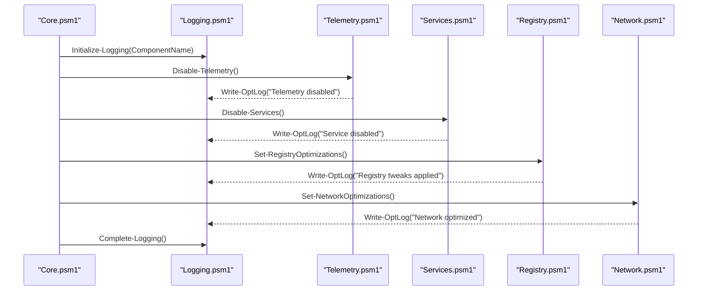
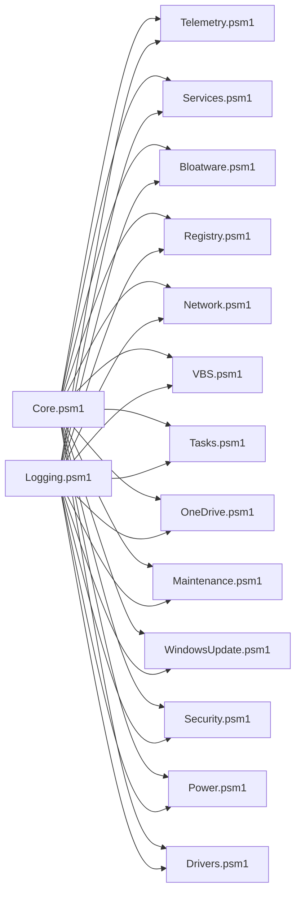

# Module Reference

<cite>
**Referenced Files in This Document**
- [Core.psm1](file://modules/Core.psm1)
- [Logging.psm1](file://modules/Logging.psm1)
- [Telemetry.psm1](file://modules/Telemetry.psm1)
- [Services.psm1](file://modules/Services.psm1)
- [Bloatware.psm1](file://modules/Bloatware.psm1)
- [Registry.psm1](file://modules/Registry.psm1)
- [Network.psm1](file://modules/Network.psm1)
- [VBS.psm1](file://modules/VBS.psm1)
- [Tasks.psm1](file://modules/Tasks.psm1)
- [OneDrive.psm1](file://modules/OneDrive.psm1)
- [Maintenance.psm1](file://modules/Maintenance.psm1)
- [WindowsUpdate.psm1](file://modules/WindowsUpdate.psm1)
- [Security.psm1](file://modules/Security.psm1)
- [Power.psm1](file://modules/Power.psm1)
- [Drivers.psm1](file://modules/Drivers.psm1)
- [Software.psm1](file://modules/Software.psm1)
- [Utilities.psm1](file://modules/Utilities.psm1)
- [UITweaks.psm1](file://modules/UITweaks.psm1)
- [Help.psm1](file://modules/Help.psm1)
- [Backup.psm1](file://modules/Backup.psm1)
- [Rollback.psm1](file://modules/Rollback.psm1)
- [Profiles.psm1](file://modules/Profiles.psm1)
- [Hardware.psm1](file://modules/Hardware.psm1)
- [ImageTool.psm1](file://modules/ImageTool.psm1)
- [Installer.psm1](file://modules/Installer.psm1)
- [VHDDeploy.psm1](file://modules/VHDDeploy.psm1)
- [Shutdown.psm1](file://modules/Shutdown.psm1)
</cite>

## Update Summary
**Changes Made**
- Updated Maintenance.psm1 section to document seven new comprehensive maintenance and repair functions
- Added detailed documentation for Start-CheckDisk, Start-SystemRestore, Start-BCDRepair, Start-MemoryDiagnostic, Get-DriveHealth, Start-WindowsUpdateRepair, and Start-DISMRepair
- Enhanced maintenance module description to reflect expanded diagnostic and repair capabilities
- Updated function documentation with parameters, return values, and practical usage examples

## Table of Contents
1. [Introduction](#introduction)
2. [Project Structure](#project-structure)
3. [Core Components](#core-components)
4. [Architecture Overview](#architecture-overview)
5. [Detailed Component Analysis](#detailed-component-analysis)
6. [Dependency Analysis](#dependency-analysis)
7. [Performance Considerations](#performance-considerations)
8. [Troubleshooting Guide](#troubleshooting-guide)
9. [Conclusion](#conclusion)
10. [Appendices](#appendices)

## Introduction
This document provides a comprehensive module reference for the System Optimizer's 27 specialized PowerShell modules. It organizes modules by functional categories, documents each module's purpose, exported functions, parameters, return values, and practical usage patterns. It also highlights integration patterns between modules and common optimization workflows.

## Project Structure
The System Optimizer is organized around modular PowerShell scripts under the modules directory. Each module encapsulates a focused set of optimizations or utilities. Modules integrate with shared core/logging infrastructure and can be orchestrated from the main entry point.

```mermaid
graph TB
subgraph "Core Infrastructure"
CORE["Core.psm1<br/>Progress tracking, logging helpers"]
LOG["Logging.psm1<br/>Structured logging"]
end
subgraph "Optimization Modules"
TEL["Telemetry.psm1"]
SRV["Services.psm1"]
BLT["Bloatware.psm1"]
REG["Registry.psm1"]
NET["Network.psm1"]
VBS["VBS.psm1"]
TSK["Tasks.psm1"]
OD["OneDrive.psm1"]
MAINT["Maintenance.psm1<br/>Enhanced diagnostic and repair capabilities"]
end
subgraph "System Management"
WU["WindowsUpdate.psm1"]
SEC["Security.psm1"]
POW["Power.psm1"]
DRV["Drivers.psm1"]
end
subgraph "Utilities"
SOFT["Software.psm1"]
UTIL["Utilities.psm1"]
UIT["UITweaks.psm1"]
HELP["Help.psm1"]
end
subgraph "Specialized"
BK["Backup.psm1"]
RB["Rollback.psm1"]
PR["Profiles.psm1"]
HW["Hardware.psm1"]
IMG["ImageTool.psm1"]
INST["Installer.psm1"]
VHD["VHDDeploy.psm1"]
SH["Shutdown.psm1"]
end
CORE --> TEL
CORE --> SRV
CORE --> BLT
CORE --> REG
CORE --> NET
CORE --> VBS
CORE --> TSK
CORE --> OD
CORE --> MAINT
CORE --> WU
CORE --> SEC
CORE --> POW
CORE --> DRV
CORE --> SOFT
CORE --> UTIL
CORE --> UIT
CORE --> HELP
CORE --> BK
CORE --> RB
CORE --> PR
CORE --> HW
CORE --> IMG
CORE --> INST
CORE --> VHD
CORE --> SH
```

**Diagram sources**
- [Core.psm1](file://modules/Core.psm1#L1-L869)
- [Logging.psm1](file://modules/Logging.psm1#L1-L285)
- [Telemetry.psm1](file://modules/Telemetry.psm1#L1-L503)
- [Services.psm1](file://modules/Services.psm1#L1-L712)
- [Bloatware.psm1](file://modules/Bloatware.psm1#L1-L1328)
- [Registry.psm1](file://modules/Registry.psm1#L1-L213)
- [Network.psm1](file://modules/Network.psm1#L1-L98)
- [VBS.psm1](file://modules/VBS.psm1#L1-L39)
- [Tasks.psm1](file://modules/Tasks.psm1#L1-L75)
- [OneDrive.psm1](file://modules/OneDrive.psm1#L1-L72)
- [Maintenance.psm1](file://modules/Maintenance.psm1#L1-L1658)
- [WindowsUpdate.psm1](file://modules/WindowsUpdate.psm1#L1-L382)
- [Security.psm1](file://modules/Security.psm1#L1-L495)
- [Power.psm1](file://modules/Power.psm1#L1-L93)
- [Drivers.psm1](file://modules/Drivers.psm1#L1-L176)
- [Software.psm1](file://modules/Software.psm1)
- [Utilities.psm1](file://modules/Utilities.psm1)
- [UITweaks.psm1](file://modules/UITweaks.psm1)
- [Help.psm1](file://modules/Help.psm1)
- [Backup.psm1](file://modules/Backup.psm1)
- [Rollback.psm1](file://modules/Rollback.psm1)
- [Profiles.psm1](file://modules/Profiles.psm1)
- [Hardware.psm1](file://modules/Hardware.psm1)
- [ImageTool.psm1](file://modules/ImageTool.psm1)
- [Installer.psm1](file://modules/Installer.psm1)
- [VHDDeploy.psm1](file://modules/VHDDeploy.psm1)
- [Shutdown.psm1](file://modules/Shutdown.psm1)

**Section sources**
- [Core.psm1](file://modules/Core.psm1#L1-L869)
- [Logging.psm1](file://modules/Logging.psm1#L1-L285)

## Core Components
- Core module: Provides progress tracking, enhanced progress bars, verbose mode toggles, download helpers, and orchestration functions for running all optimizations and full setup workflows.
- Logging module: Centralized logging with file and console output, log rotation, structured sections, and operation timing.

Key exports and capabilities:
- Progress tracking: Start/Update/Complete operations with ETA and detailed results.
- Enhanced progress UI: Console, GUI, and fallback rendering with color and Unicode support.
- Download helper: BITS/WebClient fallback with progress and speed metrics.
- Orchestration: Run-all optimizations and full setup workflow with rollback initialization and optional restore points.

**Section sources**
- [Core.psm1](file://modules/Core.psm1#L1-L869)
- [Logging.psm1](file://modules/Logging.psm1#L1-L285)

## Architecture Overview
Modules are designed for composability and incremental execution. Core and Logging modules are foundational, enabling consistent progress and logging across all optimizations. Optimization modules encapsulate domain-specific tweaks, while system management modules handle OS-level services and updates. Utilities and specialized modules provide additional capabilities such as backup/restore, hardware diagnostics, imaging, deployment, and shutdown procedures.

**Diagram sources**
- [Core.psm1](file://modules/Core.psm1#L698-L742)
- [Logging.psm1](file://modules/Logging.psm1#L18-L58)
- [Telemetry.psm1](file://modules/Telemetry.psm1#L5-L238)
- [Services.psm1](file://modules/Services.psm1#L5-L192)
- [Registry.psm1](file://modules/Registry.psm1#L5-L207)
- [Network.psm1](file://modules/Network.psm1#L5-L44)

## Detailed Component Analysis

### Core Modules
- Core.psm1
  - Purpose: Progress tracking, enhanced progress UI, verbose mode, download helper, orchestration functions.
  - Key functions:
    - Set-VerboseProgress, Get-VerboseProgress
    - Start-ProgressOperation, Update-ProgressItem, Complete-ProgressOperation
    - Show-EnhancedProgress, Close-EnhancedProgress, Ensure-ProgressCleanup
    - Set-ProgressMode
    - Write-ProgressLog
    - Start-Download
    - Run-AllOptimizations, Run-FullSetup
  - Parameters: Mostly switches and flags for modes and verbosity; progress functions accept item names, statuses, messages, and optional verbose details.
  - Returns: Summary objects from progress completion; boolean success indicators for downloads.
  - Usage patterns: Wrap optimization sequences with Start/Update/Complete; use enhanced progress for interactive sessions; leverage download helper for external assets.

- Logging.psm1
  - Purpose: Structured logging to file and console with retention, sections, and operation timing.
  - Key functions:
    - Initialize-Logging, Remove-OldLogs
    - Write-OptLog, Write-OptError, Write-OptCommand
    - Write-OptSection, Start-OptOperation, Complete-OptOperation
    - Get-OptLogPath, Get-OptLogFiles, Show-OptRecentLogs, Export-OptLogSummary
    - Complete-Logging
  - Parameters: Message, type (INFO/SUCCESS/WARNING/ERROR/SECTION/DEBUG), flags for console/file suppression, error records, command outputs.
  - Returns: Log file path, lists of log files, summaries.
  - Usage patterns: Initialize per component, write sections for major steps, capture errors with stack traces, export summaries for diagnostics.

**Section sources**
- [Core.psm1](file://modules/Core.psm1#L1-L869)
- [Logging.psm1](file://modules/Logging.psm1#L1-L285)

### Optimization Modules

#### Telemetry.psm1
- Purpose: Disable telemetry, privacy, suggestions, and related Windows features; optionally block telemetry domains.
- Key functions:
  - Disable-Telemetry
  - Block-TelemetryDomains
- Parameters: None (hardcoded registry tweaks and domain lists).
- Returns: Success messages via logging; domain blocking updates firewall rules.
- Usage patterns: Run prior to service/registry/network optimizations; use domain blocking for additional hardening.

**Section sources**
- [Telemetry.psm1](file://modules/Telemetry.psm1#L1-L503)

#### Services.psm1
- Purpose: Disable non-essential Windows services; manage Teams startup; sync with WinUtil configurations.
- Key functions:
  - Disable-Services (supports aggressive mode)
  - Show-ServicesMenu
  - Sync-WinUtilServices, Apply-WinUtilServiceConfig, Preview-WinUtilServiceChanges
  - Export-CurrentServiceStates
  - Disable-TeamsStartup, Enable-TeamsStartup
- Parameters: Aggressive switch; WinUtil JSON path; preview/export options.
- Returns: Progress updates; service state backups; success/failure per service.
- Usage patterns: Safe mode for general users; aggressive mode for advanced users; sync with WinUtil for curated service sets.

**Section sources**
- [Services.psm1](file://modules/Services.psm1#L1-L712)

#### Bloatware.psm1
- Purpose: Remove AppX/AppXProvisioned packages; clean registry remnants; protect privacy; optional Cortana enable/disable; PDF takeover prevention.
- Key functions:
  - DebloatAll, DebloatBlacklist
  - Remove-Key (registry cleanup)
  - Protect-Privacy, DisableCortana, EnableCortana
  - Stop-EdgePDF
  - Compatibility helpers: Test-AppxSupport, Get-AppxPackageSafe, Remove-AppxPackageSafe, Add-AppxPackageSafe
- Parameters: Package name filters; whitelist/provisioned exclusion patterns.
- Returns: Success/failure per package; registry key removal counts.
- Usage patterns: Run blacklist for targeted removals; debloat all for comprehensive cleanup; clean registry keys post-removal.

**Section sources**
- [Bloatware.psm1](file://modules/Bloatware.psm1#L1-L1328)

#### Registry.psm1
- Purpose: Apply registry optimizations for performance, UI, and behavior (e.g., GameDVR, transparency, animations, mouse acceleration, hibernation, memory management).
- Key functions:
  - Set-RegistryOptimizations
- Parameters: None (applies predefined registry tweaks).
- Returns: Progress updates; skips for unsupported configurations (e.g., SSD prefetch).
- Usage patterns: Run after telemetry/services/bloatware; review per-system compatibility (SSD vs HDD).

**Section sources**
- [Registry.psm1](file://modules/Registry.psm1#L1-L213)

#### Network.psm1
- Purpose: Network performance and configuration optimizations; reset network stack.
- Key functions:
  - Set-NetworkOptimizations
  - Reset-Network
- Parameters: None (applies registry and WinSock/IP resets).
- Returns: Success messages; warns about potential loss of custom configurations.
- Usage patterns: Apply before performance-sensitive tasks; reset when network issues occur.

**Section sources**
- [Network.psm1](file://modules/Network.psm1#L1-L98)

#### VBS.psm1
- Purpose: Disable Virtualization-Based Security (VBS/Memory Integrity) and Credential Guard for compatibility with virtualization-heavy environments.
- Key functions:
  - Disable-VBS
- Parameters: None (modifies Device Guard and LSA settings).
- Returns: Warning that reboot is required.
- Usage patterns: Use cautiously; ensure understanding of security implications.

**Section sources**
- [VBS.psm1](file://modules/VBS.psm1#L1-L39)

#### Tasks.psm1
- Purpose: Disable unnecessary scheduled tasks to reduce background activity.
- Key functions:
  - Disable-ScheduledTasks
- Parameters: None (hardcoded task list).
- Returns: Progress updates; skips if tasks not found.
- Usage patterns: Run alongside services/network optimizations.

**Section sources**
- [Tasks.psm1](file://modules/Tasks.psm1#L1-L75)

#### OneDrive.psm1
- Purpose: Uninstall OneDrive, remove folders, disable via policy, and remove Explorer integration.
- Key functions:
  - Remove-OneDrive
- Parameters: None (uses system paths and policy keys).
- Returns: Success messages per step.
- Usage patterns: Run after bloatware removal; ensure user data is backed up.

**Section sources**
- [OneDrive.psm1](file://modules/OneDrive.psm1#L1-L72)

#### Maintenance.psm1
- Purpose: **Enhanced** System maintenance routines with comprehensive diagnostic and repair capabilities including disk error checking, system restore point management, Boot Configuration Data repair, memory testing, SMART drive health monitoring, Windows Update component repair, and DISM repair capabilities.
- Key functions:
  - Start-SystemMaintenance (original maintenance functions)
  - Start-DiskCleanup (original cleanup function)
  - Reset-GroupPolicy (original policy reset)
  - Reset-WMI (original WMI reset)
  - **NEW** Start-CheckDisk - Comprehensive disk error checking with chkdsk scheduling
  - **NEW** Start-SystemRestore - System Restore point management and creation
  - **NEW** Start-BCDRepair - Boot Configuration Data repair for UEFI and BIOS systems
  - **NEW** Start-MemoryDiagnostic - Windows Memory Diagnostic scheduling
  - **NEW** Get-DriveHealth - SMART drive health monitoring and temperature reporting
  - **NEW** Start-WindowsUpdateRepair - Comprehensive Windows Update component repair
  - **NEW** Start-DISMRepair - Enhanced DISM repair with multiple scan options
  - Additional utility functions: Get-DiskSpaceInfo, Show-DiskSpaceReport, Get-CleanupTargetSize, Remove-FilesSafely
- Parameters: Various parameters for each function including drive selections, repair options, memory test types, and DISM scan modes.
- Returns: Success/warning/error messages; detailed diagnostic reports; repair completion status.
- Usage patterns: Use Start-CheckDisk for disk health monitoring; Start-SystemRestore for backup and recovery; Start-BCDRepair for boot issues; Start-MemoryDiagnostic for RAM testing; Get-DriveHealth for SMART monitoring; Start-WindowsUpdateRepair for update component issues; Start-DISMRepair for component store corruption.

**Updated** Added seven major new maintenance and repair functions that significantly expand the system's diagnostic and repair capabilities.

**Section sources**
- [Maintenance.psm1](file://modules/Maintenance.psm1#L1-L1658)

### System Management Modules

#### WindowsUpdate.psm1
- Purpose: Control Windows Update behavior, pause updates with scheduled tasks, install updates via PowerShell, update drivers, repair Windows Update components.
- Key functions:
  - Set-WindowsUpdateControl (menu-driven)
  - Set-UpdatePauseTask
  - Start-WUpdater
  - Install-WindowsUpdates
  - Update-DriversViaWindowsUpdate
  - Repair-WindowsUpdate (quick/full)
- Parameters: Days to pause; update/install options; category selection.
- Returns: Success messages; module installation prompts; repair outcomes.
- Usage patterns: Pause updates temporarily; install drivers separately; repair when update issues occur.

**Section sources**
- [WindowsUpdate.psm1](file://modules/WindowsUpdate.psm1#L1-L382)

#### Security.psm1
- Purpose: Manage Windows Defender (real-time protection, tamper protection, registry-based disable/enable), add firewall exceptions for activation tools, install third-party security tools via winget, configure Defender.
- Key functions:
  - Set-DefenderControl (menu-driven)
  - Install-SecurityTools, Install-SingleSecurityTool, Install-AllSecurityTools
  - Enable-WindowsDefender
- Parameters: Package IDs for winget; confirmation prompts for permanent removal.
- Returns: Success messages; warnings about conflicts when enabling multiple AVs.
- Usage patterns: Prefer enabling Defender; use exceptions for activation tools; avoid permanent removal unless necessary.

**Section sources**
- [Security.psm1](file://modules/Security.psm1#L1-L495)

#### Power.psm1
- Purpose: Switch power plans (High Performance, Ultimate Performance, Balanced) and configure sleep/hibernate timeouts for AC/Battery.
- Key functions:
  - Set-PowerPlan
  - Set-NeverSleepOnAC
- Parameters: Choice selection for plan; applies powercfg settings.
- Returns: Success messages per setting.
- Usage patterns: Use High/Ultimate for performance; Balanced for general use.

**Section sources**
- [Power.psm1](file://modules/Power.psm1#L1-L93)

#### Drivers.psm1
- Purpose: Driver management via Windows Update, Snappy Driver Installer (download/launch), and DISM-based backup/restore.
- Key functions:
  - Start-SnappyDriverInstaller (menu-driven)
- Parameters: Download URLs, extraction paths, backup/restore destinations.
- Returns: Success messages; launches SDI with auto-update flags.
- Usage patterns: Prefer Windows Update; use SDI for legacy or OEM-specific drivers; backup before major changes.

**Section sources**
- [Drivers.psm1](file://modules/Drivers.psm1#L1-L176)

### Utility Modules
- Software.psm1: Placeholder for software management functions.
- Utilities.psm1: Placeholder for general utilities.
- UITweaks.psm1: Placeholder for UI customization functions.
- Help.psm1: Placeholder for help and documentation functions.

[No sources needed since these modules are placeholders and do not analyze specific files]

### Specialized Modules
- Backup.psm1: Placeholder for backup functions.
- Rollback.psm1: Placeholder for rollback functions.
- Profiles.psm1: Placeholder for profile management functions.
- Hardware.psm1: Placeholder for hardware diagnostics functions.
- ImageTool.psm1: Placeholder for image manipulation functions.
- Installer.psm1: Placeholder for installer functions.
- VHDDeploy.psm1: Placeholder for VHD deployment functions.
- Shutdown.psm1: Placeholder for shutdown functions.

[No sources needed since these modules are placeholders and do not analyze specific files]

## Dependency Analysis
- Core and Logging are foundational and imported by most modules to provide consistent progress and logging.
- Optimization modules depend on Core/Logging for progress and output; they are largely independent of each other.
- System management modules (WindowsUpdate, Security, Power, Drivers) operate at OS boundaries and may require elevated privileges.
- Specialized modules (Backup, Rollback, Profiles, Hardware, ImageTool, Installer, VHDDeploy, Shutdown) are standalone and may rely on external tools or OS features.

**Diagram sources**
- [Core.psm1](file://modules/Core.psm1#L1-L869)
- [Logging.psm1](file://modules/Logging.psm1#L1-L285)
- [Telemetry.psm1](file://modules/Telemetry.psm1#L1-L503)
- [Services.psm1](file://modules/Services.psm1#L1-L712)
- [Bloatware.psm1](file://modules/Bloatware.psm1#L1-L1328)
- [Registry.psm1](file://modules/Registry.psm1#L1-L213)
- [Network.psm1](file://modules/Network.psm1#L1-L98)
- [VBS.psm1](file://modules/VBS.psm1#L1-L39)
- [Tasks.psm1](file://modules/Tasks.psm1#L1-L75)
- [OneDrive.psm1](file://modules/OneDrive.psm1#L1-L72)
- [Maintenance.psm1](file://modules/Maintenance.psm1#L1-L1658)
- [WindowsUpdate.psm1](file://modules/WindowsUpdate.psm1#L1-L382)
- [Security.psm1](file://modules/Security.psm1#L1-L495)
- [Power.psm1](file://modules/Power.psm1#L1-L93)
- [Drivers.psm1](file://modules/Drivers.psm1#L1-L176)

**Section sources**
- [Core.psm1](file://modules/Core.psm1#L1-L869)
- [Logging.psm1](file://modules/Logging.psm1#L1-L285)

## Performance Considerations
- Progress tracking reduces perceived latency by providing immediate feedback and ETA estimates.
- Download helper uses BITS when available for native progress; falls back to WebClient with periodic updates.
- Registry and service modifications are batched per module to minimize repeated registry writes.
- Network and power optimizations adjust system-level behavior; ensure compatibility with hardware and use cases.
- **NEW** Enhanced maintenance functions may require elevated privileges and can take significant time to complete (e.g., DISM repair, memory diagnostic, comprehensive disk checks).

[No sources needed since this section provides general guidance]

## Troubleshooting Guide
- Logging: Use Initialize-Logging and Write-OptError to capture detailed error information and exception metadata. Export summaries for diagnostics.
- Maintenance: Use Start-SystemMaintenance for DISM/SFC scans; Start-DiskCleanup for temp and cache cleanup; Reset-GroupPolicy and Reset-WMI for policy and WMI issues.
- **NEW** Use Start-CheckDisk for comprehensive disk error checking and chkdsk scheduling; Start-SystemRestore for restore point management; Start-BCDRepair for boot configuration issues; Start-MemoryDiagnostic for RAM testing; Get-DriveHealth for SMART monitoring; Start-WindowsUpdateRepair for update component issues; Start-DISMRepair for component store corruption.
- WindowsUpdate: Use Repair-WindowsUpdate (quick/full) to resolve persistent update issues; Set-UpdatePauseTask to temporarily pause updates.
- Security: Use Set-DefenderControl to toggle real-time protection and exceptions; consult tamper protection guidance for registry-based changes.
- Services: Use Export-CurrentServiceStates to back up service configurations; revert if issues arise.

**Section sources**
- [Logging.psm1](file://modules/Logging.psm1#L125-L195)
- [Maintenance.psm1](file://modules/Maintenance.psm1#L451-L1161)
- [WindowsUpdate.psm1](file://modules/WindowsUpdate.psm1#L247-L371)
- [Security.psm1](file://modules/Security.psm1#L5-L278)
- [Services.psm1](file://modules/Services.psm1#L461-L494)

## Conclusion
The System Optimizer's modular design enables granular, composable system optimizations. Core and Logging modules provide consistent progress and diagnostics, while specialized modules target specific areas such as telemetry, services, registry, networking, VBS, scheduled tasks, OneDrive, maintenance, Windows Update, security, power, and drivers. **The Maintenance module has been significantly enhanced with seven new comprehensive diagnostic and repair functions that greatly expand the system's ability to diagnose and repair various system issues.** Integrating these modules into workflows allows users to tailor optimizations to their needs, with robust logging and troubleshooting support.

[No sources needed since this section summarizes without analyzing specific files]

## Appendices
- Integration patterns:
  - Run telemetry → services → bloatware → tasks → registry → network → VBS → maintenance (optional) → Windows Update (optional) → security (optional) → power → drivers (optional).
  - Use Core.Run-AllOptimizations for a full-stack optimization with rollback initialization and optional restore points.
  - Use Core.Run-FullSetup to coordinate software installation and subsequent service optimization.
  - **NEW** Use Start-CheckDisk, Start-SystemRestore, Start-BCDRepair, Start-MemoryDiagnostic, Get-DriveHealth, Start-WindowsUpdateRepair, and Start-DISMRepair for comprehensive system diagnostics and repairs.

**Section sources**
- [Core.psm1](file://modules/Core.psm1#L698-L791)
- [Telemetry.psm1](file://modules/Telemetry.psm1#L5-L238)
- [Services.psm1](file://modules/Services.psm1#L5-L192)
- [Bloatware.psm1](file://modules/Bloatware.psm1#L110-L181)
- [Tasks.psm1](file://modules/Tasks.psm1#L5-L69)
- [Registry.psm1](file://modules/Registry.psm1#L5-L207)
- [Network.psm1](file://modules/Network.psm1#L5-L44)
- [VBS.psm1](file://modules/VBS.psm1#L5-L33)
- [Maintenance.psm1](file://modules/Maintenance.psm1#L5-L51)
- [WindowsUpdate.psm1](file://modules/WindowsUpdate.psm1#L5-L82)
- [Security.psm1](file://modules/Security.psm1#L5-L49)
- [Power.psm1](file://modules/Power.psm1#L5-L93)
- [Drivers.psm1](file://modules/Drivers.psm1#L5-L176)