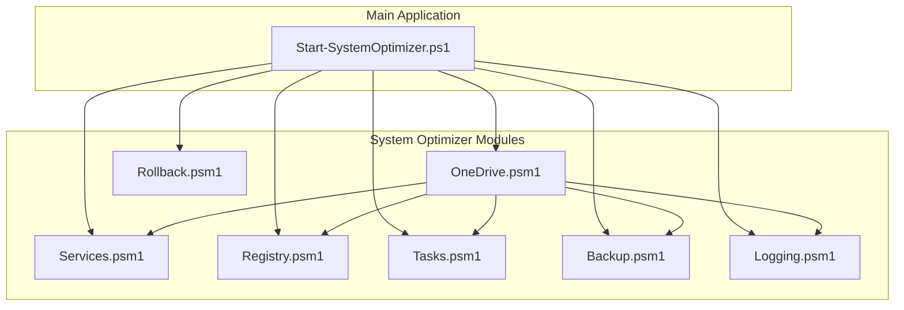
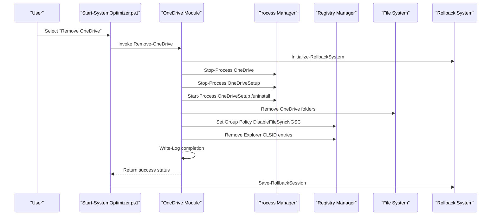
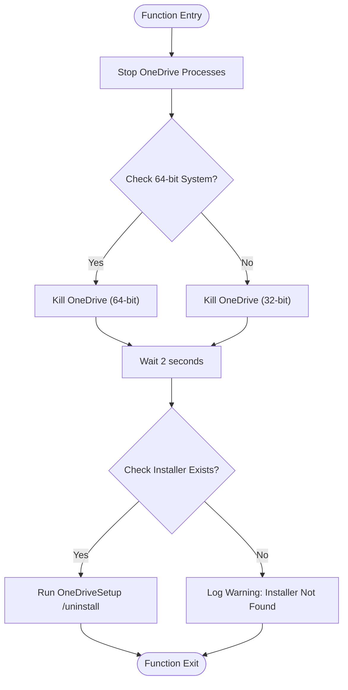
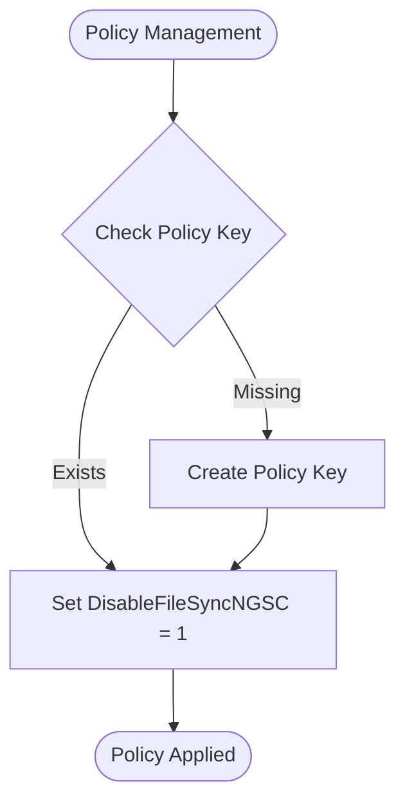
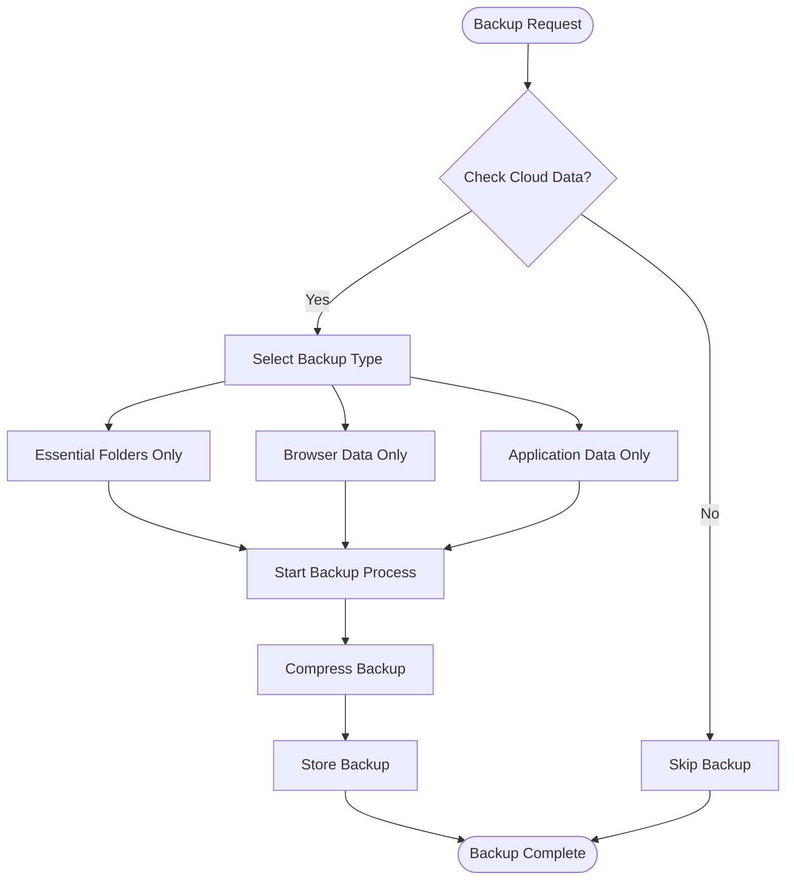
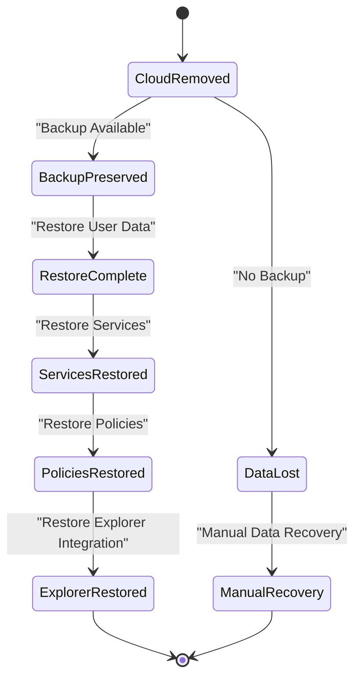
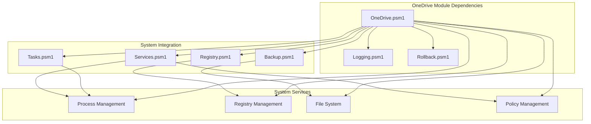

# Cloud Services

<cite>
**Referenced Files in This Document**
- [OneDrive.psm1](file://modules/OneDrive.psm1)
- [Services.psm1](file://modules/Services.psm1)
- [Registry.psm1](file://modules/Registry.psm1)
- [Tasks.psm1](file://modules/Tasks.psm1)
- [Backup.psm1](file://modules/Backup.psm1)
- [Logging.psm1](file://modules/Logging.psm1)
- [Start-SystemOptimizer.ps1](file://Start-SystemOptimizer.ps1)
- [Rollback.psm1](file://modules/Rollback.psm1)
</cite>

## Table of Contents
1. [Introduction](#introduction)
2. [Project Structure](#project-structure)
3. [Core Components](#core-components)
4. [Architecture Overview](#architecture-overview)
5. [Detailed Component Analysis](#detailed-component-analysis)
6. [Dependency Analysis](#dependency-analysis)
7. [Performance Considerations](#performance-considerations)
8. [Troubleshooting Guide](#troubleshooting-guide)
9. [Conclusion](#conclusion)
10. [Appendices](#appendices)

## Introduction
This document provides comprehensive documentation for the OneDrive module that handles cloud service optimization within the System Optimizer toolkit. It covers the complete OneDrive removal process including policy management, registry cleanup, and service termination. The document also explains the implementation of cloud service integration controls, automatic sync management, and storage optimization. Additionally, it documents cloud service operations, backup preservation procedures, and restoration workflows, along with practical examples, compatibility considerations, and best practices for maintaining system performance while managing cloud service integration.

## Project Structure
The System Optimizer is organized as a modular PowerShell toolkit with 27 specialized modules. The OneDrive module is one of the core modules responsible for removing OneDrive cloud storage integration and disabling related services and policies.



**Diagram sources**
- [Start-SystemOptimizer.ps1](file://Start-SystemOptimizer.ps1#L480-L521)
- [OneDrive.psm1](file://modules/OneDrive.psm1#L1-L72)

**Section sources**
- [Start-SystemOptimizer.ps1](file://Start-SystemOptimizer.ps1#L480-L521)

## Core Components
The OneDrive module implements a comprehensive removal process that targets multiple aspects of OneDrive integration:

### Primary Functions
- **Remove-OneDrive**: Main function orchestrating the complete OneDrive removal process
- **Service Termination**: Stops OneDrive processes and related services
- **Policy Management**: Disables OneDrive via Group Policy
- **Registry Cleanup**: Removes OneDrive-related registry entries
- **Storage Optimization**: Deletes OneDrive folders and temporary files

### Key Features
- Multi-platform support (64-bit and 32-bit Windows)
- Comprehensive cleanup of all OneDrive components
- Integration with rollback system for safety
- Progress tracking and logging capabilities
- Backup preservation for user data

**Section sources**
- [OneDrive.psm1](file://modules/OneDrive.psm1#L5-L66)

## Architecture Overview
The OneDrive removal process follows a systematic approach that ensures complete removal of cloud service integration while maintaining system stability.



**Diagram sources**
- [OneDrive.psm1](file://modules/OneDrive.psm1#L5-L66)
- [Start-SystemOptimizer.ps1](file://Start-SystemOptimizer.ps1#L480-L521)

## Detailed Component Analysis

### OneDrive Removal Process
The Remove-OneDrive function implements a comprehensive removal strategy that addresses all aspects of OneDrive integration.

#### Process Termination Phase
The module begins by terminating all OneDrive-related processes to ensure clean removal:



**Diagram sources**
- [OneDrive.psm1](file://modules/OneDrive.psm1#L8-L28)

#### Storage Cleanup Phase
The module performs comprehensive cleanup of OneDrive-related files and folders:

| Folder Path | Purpose | Cleanup Action |
|-------------|---------|----------------|
| `$env:USERPROFILE\OneDrive` | User's OneDrive folder | Recursively deleted |
| `$env:LOCALAPPDATA\Microsoft\OneDrive` | Local OneDrive cache | Recursively deleted |
| `$env:PROGRAMDATA\Microsoft OneDrive` | System-wide OneDrive data | Recursively deleted |
| `C:\OneDriveTemp` | Temporary OneDrive files | Recursively deleted |

#### Policy Management Phase
The module implements Group Policy controls to prevent OneDrive reactivation:



**Diagram sources**
- [OneDrive.psm1](file://modules/OneDrive.psm1#L46-L51)

#### Explorer Integration Removal
The module removes OneDrive from Windows Explorer integration:

| Registry Path | Property | Value | Purpose |
|---------------|----------|-------|---------|
| `HKCR:\CLSID\{018D5C66-4533-4307-9B53-224DE2ED1FE6}` | `System.IsPinnedToNameSpaceTree` | `0` | Remove from namespace tree |
| `HKCR:\Wow6432Node\CLSID\{018D5C66-4533-4307-9B53-224DE2ED1FE6}` | `System.IsPinnedToNameSpaceTree` | `0` | Remove from 32-bit namespace |

**Section sources**
- [OneDrive.psm1](file://modules/OneDrive.psm1#L30-L66)

### Cloud Service Integration Controls
The System Optimizer provides comprehensive controls for managing cloud service integration through multiple modules:

#### Service Management Integration
The Services module complements OneDrive removal by disabling related services:

| Service Name | Category | Impact | Safety Level |
|--------------|----------|--------|--------------|
| `OneSyncSvc` | Sync Services | Disables OneDrive sync | Safe |
| `WpnService` | Push Notifications | Disables cloud notifications | Safe |
| `CDPSvc` | Connected Devices | Disables device sync | Safe |

#### Registry-Based Controls
The Registry module implements system-wide cloud service controls:

| Registry Path | Setting | Value | Effect |
|---------------|---------|-------|--------|
| `HKLM:\SOFTWARE\Policies\Microsoft\Windows\OneDrive` | `DisableFileSyncNGSC` | `1` | Prevents OneDrive activation |
| `HKCU:\SOFTWARE\Microsoft\Windows\CurrentVersion\BackgroundAccessApplications` | `GlobalUserDisabled` | `1` | Disables background apps |
| `HKCU:\SOFTWARE\Microsoft\Windows\CurrentVersion\Search` | `BackgroundAppGlobalToggle` | `0` | Disables search background tasks |

#### Scheduled Task Management
The Tasks module removes OneDrive-related scheduled tasks:

| Task Path | Purpose | Removal Status |
|-----------|---------|----------------|
| `\Microsoft\Windows\CloudExperienceHost\CreateObjectTask` | Cloud experience initialization | Disabled |
| `\Microsoft\Windows\Maps\MapsToastTask` | Maps notifications | Disabled |
| `\Microsoft\Windows\Maps\MapsUpdateTask` | Maps updates | Disabled |

**Section sources**
- [Services.psm1](file://modules/Services.psm1#L15-L132)
- [Registry.psm1](file://modules/Registry.psm1#L44-L186)
- [Tasks.psm1](file://modules/Tasks.psm1#L8-L28)

### Backup Preservation Procedures
The System Optimizer implements comprehensive backup and rollback mechanisms to preserve user data during cloud service management:

#### User Profile Backup Integration
The Backup module provides selective backup options for cloud service data:



**Diagram sources**
- [Backup.psm1](file://modules/Backup.psm1#L702-L771)

#### Rollback System Integration
The Rollback module maintains comprehensive change tracking:

| Change Type | Tracking Mechanism | Recovery Method |
|-------------|-------------------|-----------------|
| Service Changes | `Backup-ServiceState` | `Restore-ServiceState` |
| Registry Modifications | `Backup-RegistryValue` | `Restore-RegistryValue` |
| File Operations | `Backup-FileState` | `Restore-FileState` |
| Cloud Service Removal | `Backup-CloudServiceState` | `Restore-CloudServiceState` |

#### Restoration Workflows
The System Optimizer provides multiple restoration approaches:



**Diagram sources**
- [Rollback.psm1](file://modules/Rollback.psm1#L297-L342)

**Section sources**
- [Backup.psm1](file://modules/Backup.psm1#L33-L66)
- [Rollback.psm1](file://modules/Rollback.psm1#L297-L342)

### Practical Examples and Usage Patterns

#### Example 1: Complete OneDrive Removal
```powershell
# Remove OneDrive with full cleanup
Remove-OneDrive

# Expected outcome:
# - OneDrive processes terminated
# - OneDrive uninstaller executed
# - All OneDrive folders removed
# - Group Policy applied to prevent reactivation
# - Explorer integration removed
```

#### Example 2: Selective Cloud Service Management
```powershell
# Disable specific cloud services
Disable-Services -Aggressive

# Target services disabled:
# - OneSyncSvc (OneDrive sync)
# - WpnService (Windows push notifications)
# - CDPSvc (Connected devices)
# - Other cloud-related services
```

#### Example 3: Backup and Restore Workflow
```powershell
# Backup user data before cloud service changes
Start-UserProfileBackup

# Remove cloud services
Remove-OneDrive
Disable-Services

# If issues occur, restore from backup
Start-UserProfileRestore
```

**Section sources**
- [OneDrive.psm1](file://modules/OneDrive.psm1#L5-L66)
- [Services.psm1](file://modules/Services.psm1#L5-L192)

## Dependency Analysis
The OneDrive module integrates with multiple system components and follows a layered dependency structure.



**Diagram sources**
- [OneDrive.psm1](file://modules/OneDrive.psm1#L1-L72)
- [Services.psm1](file://modules/Services.psm1#L5-L192)
- [Registry.psm1](file://modules/Registry.psm1#L5-L207)
- [Tasks.psm1](file://modules/Tasks.psm1#L5-L69)

### Cross-Module Dependencies
The OneDrive module depends on several other modules for comprehensive cloud service management:

| Module | Dependency Type | Purpose |
|--------|----------------|---------|
| `Logging.psm1` | Function Dependency | Provides `Write-Log` function for progress tracking |
| `Rollback.psm1` | Function Dependency | Provides `Initialize-RollbackSystem` and `Save-RollbackSession` |
| `Services.psm1` | Integration | Complements removal with service management |
| `Registry.psm1` | Integration | Provides registry optimization alongside OneDrive removal |
| `Tasks.psm1` | Integration | Removes OneDrive-related scheduled tasks |
| `Backup.psm1` | Integration | Provides backup capabilities for user data preservation |

**Section sources**
- [Start-SystemOptimizer.ps1](file://Start-SystemOptimizer.ps1#L480-L521)
- [OneDrive.psm1](file://modules/OneDrive.psm1#L1-L72)

## Performance Considerations
The OneDrive removal process is designed with performance optimization in mind:

### Resource Management
- **Process Termination**: Uses forceful termination to minimize cleanup time
- **Parallel Operations**: Multiple cleanup operations run concurrently where possible
- **Memory Optimization**: Minimizes memory footprint during long-running operations

### System Impact Mitigation
- **Service Coordination**: Integrates with Services module to avoid conflicts
- **Registry Optimization**: Uses efficient registry operations to minimize system overhead
- **File System Operations**: Implements batch deletion to reduce I/O operations

### Performance Monitoring
The System Optimizer provides built-in performance tracking through:
- **Progress Indicators**: Real-time progress updates for long operations
- **Timing Information**: Operation duration tracking for performance analysis
- **Resource Usage**: Monitoring of CPU and memory usage during operations

## Troubleshooting Guide

### Common Issues and Solutions

#### Issue 1: OneDrive Processes Cannot Be Terminated
**Symptoms**: OneDrive processes remain active after removal
**Solution**: 
```powershell
# Force terminate remaining processes
Stop-Process -Name "OneDrive*" -Force -ErrorAction SilentlyContinue
Stop-Process -Name "OneDriveSetup" -Force -ErrorAction SilentlyContinue
```

#### Issue 2: Registry Cleanup Failures
**Symptoms**: OneDrive remains accessible after removal
**Solution**:
```powershell
# Manually remove registry entries
Remove-Item "HKCR:\CLSID\{018D5C66-4533-4307-9B53-224DE2ED1FE6}" -Recurse -Force
Remove-Item "HKCR:\Wow6432Node\CLSID\{018D5C66-4533-4307-9B53-224DE2ED1FE6}" -Recurse -Force
```

#### Issue 3: Backup Restoration Issues
**Symptoms**: User data not restored after rollback
**Solution**:
```powershell
# Verify backup exists
Get-ChildItem "C:\System_Optimizer_Backup\UserProfiles"

# Restore specific backup
Start-UserProfileRestore -BackupPath "C:\System_Optimizer_Backup\UserProfiles\username"
```

### Diagnostic Commands
```powershell
# Check OneDrive installation status
Get-Process -Name "OneDrive*" -ErrorAction SilentlyContinue

# Verify registry cleanup
Get-ItemProperty "HKLM:\SOFTWARE\Policies\Microsoft\Windows\OneDrive" -Name "DisableFileSyncNGSC" -ErrorAction SilentlyContinue

# Check service status
Get-Service -Name "OneSyncSvc" -ErrorAction SilentlyContinue
```

**Section sources**
- [OneDrive.psm1](file://modules/OneDrive.psm1#L8-L28)
- [Rollback.psm1](file://modules/Rollback.psm1#L297-L342)

## Conclusion
The OneDrive module provides a comprehensive solution for cloud service optimization within the System Optimizer toolkit. Its systematic approach to OneDrive removal, combined with robust backup and rollback capabilities, ensures safe and effective cloud service management. The module's integration with other System Optimizer components creates a cohesive ecosystem for system optimization while maintaining user data integrity and system stability.

The implementation demonstrates best practices in PowerShell module development, including proper error handling, progress tracking, and integration with system services. The comprehensive logging and rollback mechanisms provide excellent operational visibility and safety guarantees for cloud service management operations.

## Appendices

### Best Practices for Cloud Service Management
1. **Always backup user data** before cloud service removal
2. **Use rollback capabilities** for safety during testing
3. **Monitor system performance** after cloud service removal
4. **Verify cleanup completeness** using diagnostic commands
5. **Consider user impact** when disabling cloud services

### Compatibility Considerations
- **Windows 10/11 Support**: Full compatibility with modern Windows versions
- **Multi-Architecture**: Supports both 32-bit and 64-bit systems
- **Administrator Privileges**: Requires elevated permissions for full functionality
- **PowerShell Version**: Compatible with PowerShell 5.1+ and PowerShell 7+

### Future Enhancements
- **Incremental Backup Integration**: Cloud backup synchronization
- **Advanced Conflict Resolution**: Automated conflict resolution for cloud services
- **Performance Analytics**: Detailed performance impact analysis
- **User Experience Improvements**: Enhanced GUI for cloud service management