# Network Module

<cite>
**Referenced Files in This Document**
- [Network.psm1](file://modules/Network.psm1)
- [Start-SystemOptimizer.ps1](file://Start-SystemOptimizer.ps1)
- [Logging.psm1](file://modules/Logging.psm1)
- [README.md](file://README.md)
- [FEATURES.md](file://docs/FEATURES.md)
</cite>

## Update Summary
**Changes Made**
- Expanded network module from 4 to 12 functions with substantial new capabilities
- Added comprehensive Wi-Fi management system with network discovery and signal monitoring
- Implemented proxy configuration system supporting manual and PAC-based proxy settings
- Introduced network diagnostics suite with ping, traceroute, and port testing
- Added firewall status inspection and common port validation
- Implemented network speed testing with multiple file size options
- Enhanced TCP settings management with gaming and throughput optimizations
- Updated menu structure to accommodate 11 network management options

## Table of Contents
1. [Introduction](#introduction)
2. [Project Structure](#project-structure)
3. [Core Components](#core-components)
4. [Architecture Overview](#architecture-overview)
5. [Detailed Component Analysis](#detailed-component-analysis)
6. [Dependency Analysis](#dependency-analysis)
7. [Performance Considerations](#performance-considerations)
8. [Troubleshooting Guide](#troubleshooting-guide)
9. [Conclusion](#conclusion)

## Introduction
The Network Module is a comprehensive PowerShell module within the System Optimizer toolkit designed to optimize, manage, and diagnose Windows networking functionality. This module provides 12 network-related functions covering TCP/IP optimization, Wi-Fi management, network adapter administration, proxy configuration, firewall inspection, network diagnostics, and advanced TCP settings management.

The module serves as a centralized hub for network optimization tasks, offering both automated optimization routines and interactive management interfaces. It integrates seamlessly with the broader System Optimizer ecosystem while maintaining standalone functionality for network-specific operations.

## Project Structure
The Network Module follows a modular architecture pattern within the System Optimizer framework, organized around distinct functional areas:

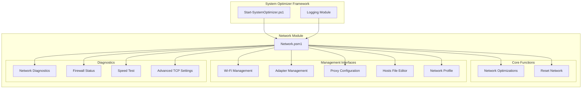

**Diagram sources**
- [Network.psm1](file://modules/Network.psm1#L1-L812)
- [Start-SystemOptimizer.ps1](file://Start-SystemOptimizer.ps1#L823-L893)

**Section sources**
- [Network.psm1](file://modules/Network.psm1#L1-L812)
- [Start-SystemOptimizer.ps1](file://Start-SystemOptimizer.ps1#L823-L893)

## Core Components
The Network Module consists of 12 key functional areas, each serving specific network management purposes:

### Network Optimization Engine
The core optimization engine provides automated network tuning through:
- IPv6 protocol disabling for environments where it's not needed
- Nagle's algorithm optimization for reduced latency applications
- Network throttling index adjustment for multimedia performance
- Network Location Wizard disabling to prevent unwanted prompts

### Interactive Management Interfaces
Comprehensive management interfaces for:
- Wi-Fi network profile management and signal monitoring
- Network adapter enable/disable operations and statistics
- Proxy server configuration and PAC file management
- Hosts file editing and backup capabilities
- Network profile category management (Private/Public)

### Diagnostic and Monitoring Tools
Advanced diagnostic capabilities including:
- Network connectivity testing (ping, traceroute, pathping)
- DNS resolution testing and port scanning
- Firewall rule inspection and common port status checking
- Network speed measurement with configurable file sizes
- Advanced TCP setting optimization for gaming or throughput

**Section sources**
- [Network.psm1](file://modules/Network.psm1#L35-L74)
- [Network.psm1](file://modules/Network.psm1#L123-L206)
- [Network.psm1](file://modules/Network.psm1#L208-L290)
- [Network.psm1](file://modules/Network.psm1#L292-L349)
- [Network.psm1](file://modules/Network.psm1#L351-L427)
- [Network.psm1](file://modules/Network.psm1#L429-L495)
- [Network.psm1](file://modules/Network.psm1#L497-L537)
- [Network.psm1](file://modules/Network.psm1#L539-L595)
- [Network.psm1](file://modules/Network.psm1#L597-L673)
- [Network.psm1](file://modules/Network.psm1#L675-L744)

## Architecture Overview
The Network Module employs a layered architecture with clear separation of concerns:

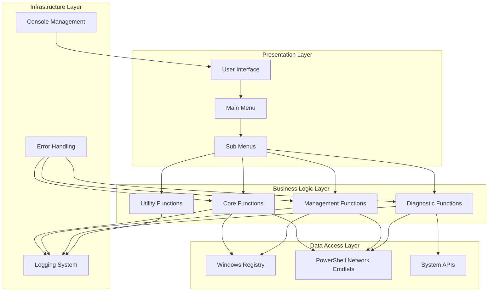

**Diagram sources**
- [Network.psm1](file://modules/Network.psm1#L746-L795)
- [Logging.psm1](file://modules/Logging.psm1#L46-L86)

The architecture ensures:
- **Separation of Concerns**: Each function has a specific responsibility
- **Reusability**: Common functionality is abstracted into shared utilities
- **Maintainability**: Clear boundaries between presentation, business logic, and data access
- **Extensibility**: Easy addition of new network management features

## Detailed Component Analysis

### Network Optimization Engine
The optimization engine provides automated network tuning through systematic registry modifications and system configuration changes.

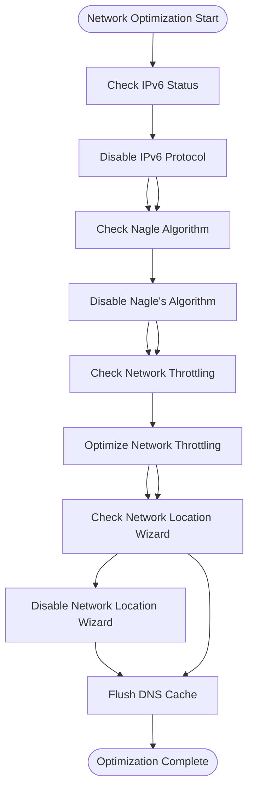

**Diagram sources**
- [Network.psm1](file://modules/Network.psm1#L35-L74)

Key optimization features include:
- **IPv6 Protocol Management**: Complete disablement of IPv6 components for environments where IPv4-only connectivity is preferred
- **Latency Reduction**: Nagle's algorithm disabling for applications requiring low-latency connections
- **Performance Tuning**: Network throttling index optimization for multimedia and streaming applications
- **System Integration**: Network Location Wizard disabling to prevent unwanted network discovery prompts

**Section sources**
- [Network.psm1](file://modules/Network.psm1#L35-L74)

### Wi-Fi Network Management System
The Wi-Fi management system provides comprehensive wireless network profile management and monitoring capabilities.

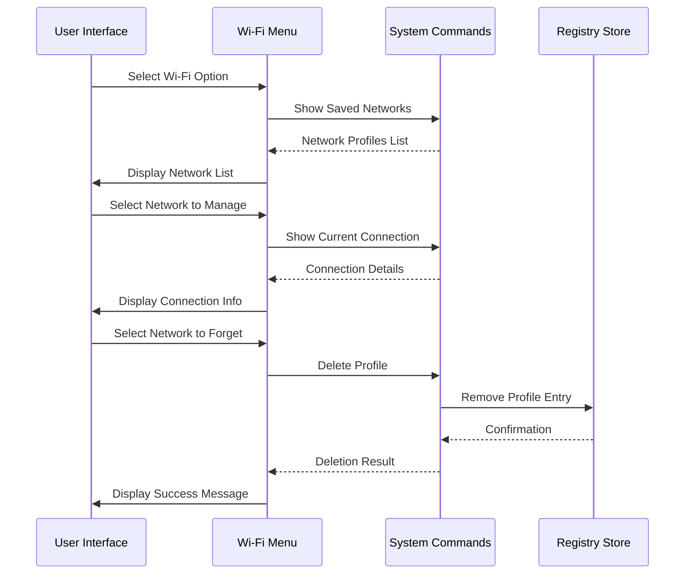

**Diagram sources**
- [Network.psm1](file://modules/Network.psm1#L123-L206)

The Wi-Fi management system offers:
- **Profile Discovery**: Automatic detection and display of saved Wi-Fi networks
- **Connection Monitoring**: Real-time signal strength and quality assessment
- **Profile Management**: Ability to remove unwanted network profiles
- **Signal Analysis**: Color-coded signal strength indicators for quick assessment

**Section sources**
- [Network.psm1](file://modules/Network.psm1#L123-L206)

### Network Adapter Management
The network adapter management system provides granular control over physical and logical network interfaces.

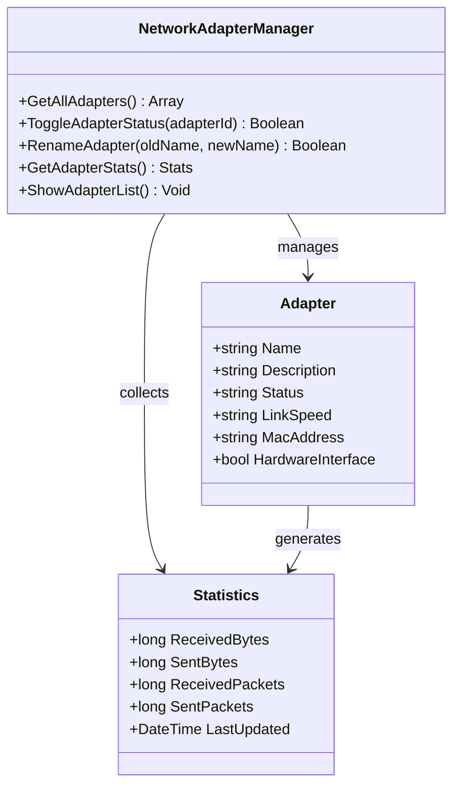

**Diagram sources**
- [Network.psm1](file://modules/Network.psm1#L208-L290)

Key adapter management capabilities include:
- **Adapter Enumeration**: Comprehensive listing of all network adapters with detailed specifications
- **Status Control**: Dynamic enable/disable operations for network interfaces
- **Naming Management**: Custom adapter renaming for organizational purposes
- **Performance Monitoring**: Real-time traffic statistics and bandwidth utilization

**Section sources**
- [Network.psm1](file://modules/Network.psm1#L208-L290)

### Proxy Configuration System
The proxy configuration system provides flexible proxy server management with support for various proxy types and configurations.

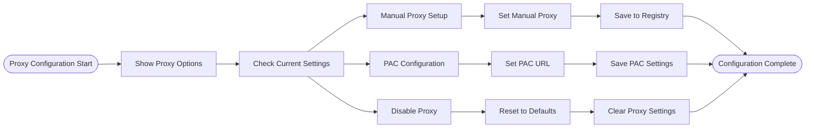

**Diagram sources**
- [Network.psm1](file://modules/Network.psm1#L292-L349)

The proxy configuration system supports:
- **Manual Proxy Setup**: Direct server configuration with bypass lists
- **Automatic Proxy Configuration**: PAC file URL management
- **Registry Integration**: Persistent configuration storage
- **Cross-Application Support**: WinHTTP and Internet Explorer proxy settings synchronization

**Section sources**
- [Network.psm1](file://modules/Network.psm1#L292-L349)

### Network Diagnostics Suite
The diagnostics suite provides comprehensive network troubleshooting capabilities with multiple testing methodologies.

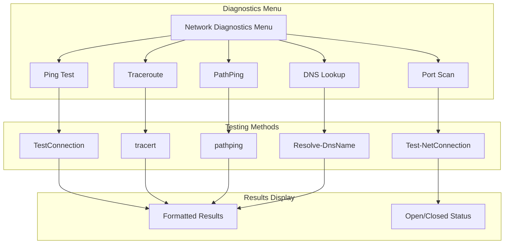

**Diagram sources**
- [Network.psm1](file://modules/Network.psm1#L429-L495)

Diagnostic capabilities include:
- **Connectivity Testing**: Multi-method ping testing with customizable parameters
- **Route Analysis**: Traceroute and PathPing for network path visualization
- **Resolution Testing**: DNS lookup with detailed record information
- **Port Validation**: Network port testing with success/failure indication
- **Performance Measurement**: Network speed testing with multiple file size options

**Section sources**
- [Network.psm1](file://modules/Network.psm1#L429-L495)

### Firewall Status and Management
The firewall management system provides comprehensive inspection and basic management capabilities for Windows Firewall.

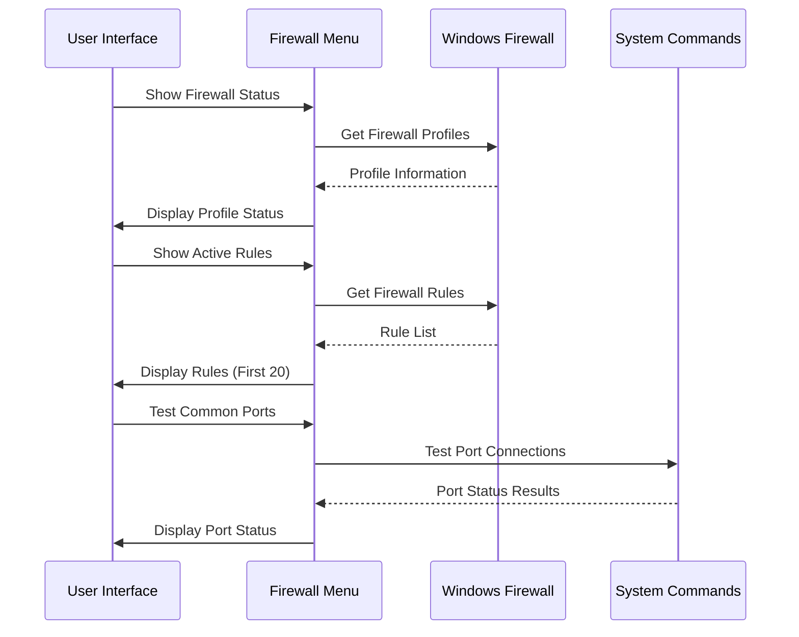

**Diagram sources**
- [Network.psm1](file://modules/Network.psm1#L497-L537)

Firewall management features include:
- **Profile Inspection**: Comprehensive firewall profile status examination
- **Rule Analysis**: Active rule listing with filtering capabilities
- **Port Testing**: Common port status checking for security assessment
- **Integration**: Seamless Windows Firewall cmdlet integration

**Section sources**
- [Network.psm1](file://modules/Network.psm1#L497-L537)

### Network Speed Testing
The network speed testing system provides comprehensive bandwidth measurement capabilities with multiple file size options.

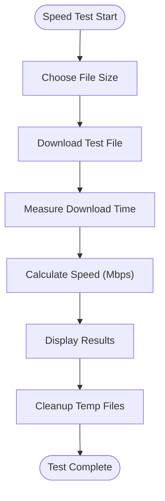

**Diagram sources**
- [Network.psm1](file://modules/Network.psm1#L539-L595)

Speed testing capabilities include:
- **Multi-Size Testing**: Quick (10MB), Standard (50MB), and Large (100MB) file options
- **Performance Metrics**: File size, duration, and calculated speed in Mbps
- **Visual Feedback**: Color-coded results based on performance thresholds
- **Automatic Cleanup**: Temporary files are automatically removed after testing

**Section sources**
- [Network.psm1](file://modules/Network.psm1#L539-L595)

### Advanced TCP Settings Management
The advanced TCP settings system provides fine-grained control over TCP/IP stack parameters for specific use cases.

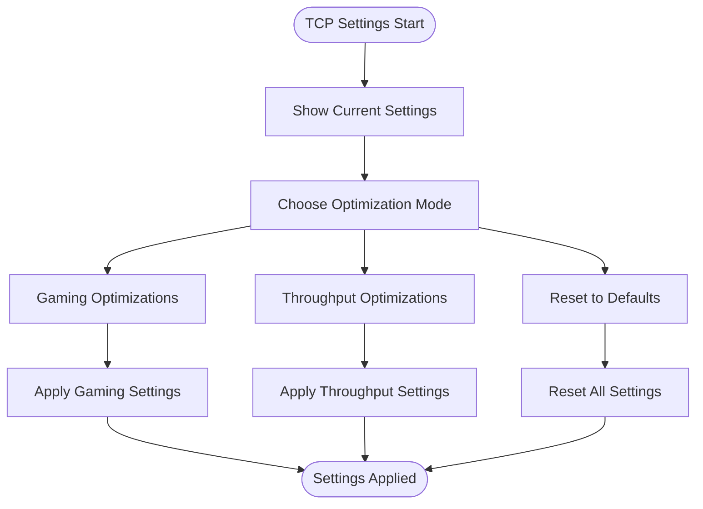

**Diagram sources**
- [Network.psm1](file://modules/Network.psm1#L675-L744)

Advanced TCP optimization features include:
- **Gaming Optimizations**: Low-latency settings with window scaling disabled and ECN enabled
- **Throughput Optimizations**: High-bandwidth settings with window scaling enabled and RSS optimization
- **Default Reset**: Return all TCP settings to Windows standard configurations
- **System Integration**: Uses netsh commands for registry-free configuration

**Section sources**
- [Network.psm1](file://modules/Network.psm1#L675-L744)

## Dependency Analysis
The Network Module maintains strategic dependencies that ensure robust functionality while minimizing external requirements.

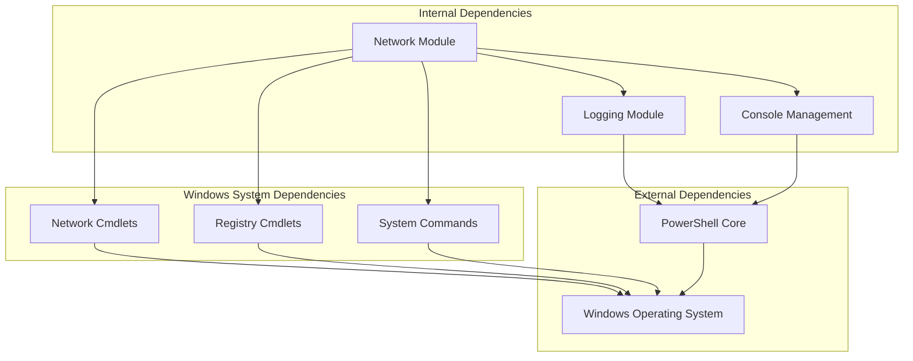

**Diagram sources**
- [Network.psm1](file://modules/Network.psm1#L1-L812)
- [Logging.psm1](file://modules/Logging.psm1#L1-L200)

Key dependency characteristics:
- **Minimal External Dependencies**: Pure PowerShell implementation with no external libraries
- **System Integration**: Deep integration with Windows networking infrastructure
- **Logging Integration**: Centralized logging system for all operations
- **Console Management**: Consistent user interface across all network functions

**Section sources**
- [Network.psm1](file://modules/Network.psm1#L1-L812)
- [Logging.psm1](file://modules/Logging.psm1#L1-L200)

## Performance Considerations
The Network Module is designed with performance optimization as a primary consideration:

### Optimization Strategies
- **Batch Operations**: Multiple network adapters processed in single operations
- **Selective Updates**: Only modified registry values that impact performance
- **Efficient Queries**: Minimized system calls through optimized PowerShell cmdlets
- **Resource Management**: Proper cleanup of temporary files and resources

### Memory and Resource Usage
- **Minimal Memory Footprint**: Functions designed for low memory consumption
- **Efficient String Processing**: Optimized string manipulation for network operations
- **Proper Resource Cleanup**: Automatic cleanup of temporary files and network connections

### Scalability Factors
- **Adapter Scaling**: Handles multiple network adapters efficiently
- **Registry Performance**: Optimized registry access patterns
- **Console Responsiveness**: Maintained user interface responsiveness during operations

## Troubleshooting Guide

### Common Issues and Solutions
**Network Optimization Failures**
- **Symptom**: IPv6 disabling fails on some systems
- **Solution**: Verify administrative privileges and Windows version compatibility
- **Prevention**: Check system requirements before running optimization

**Wi-Fi Management Problems**
- **Symptom**: Cannot delete Wi-Fi profiles
- **Solution**: Ensure Wi-Fi is disconnected before profile deletion
- **Prevention**: Always check current connection status before management operations

**Proxy Configuration Issues**
- **Symptom**: Proxy settings not persisting after reboot
- **Solution**: Verify registry write permissions and group policy restrictions
- **Prevention**: Check for conflicting proxy settings from enterprise policies

**Diagnostics Failures**
- **Symptom**: Network tests timeout or fail
- **Solution**: Verify network connectivity and firewall configuration
- **Prevention**: Test basic connectivity before running advanced diagnostics

**Speed Test Failures**
- **Symptom**: Speed tests fail with network errors
- **Solution**: Check internet connectivity and test server availability
- **Prevention**: Ensure stable network connection before testing

**TCP Settings Issues**
- **Symptom**: Advanced TCP settings don't take effect immediately
- **Solution**: Some settings require system reboot to fully apply
- **Prevention**: Review settings documentation for reboot requirements

### Error Handling Mechanisms
The Network Module implements comprehensive error handling:
- **Try-Catch Blocks**: Structured error handling for all major operations
- **Logging Integration**: Detailed error logging with context information
- **User Feedback**: Clear error messages with suggested solutions
- **Graceful Degradation**: Partial functionality when complete operations fail

**Section sources**
- [Network.psm1](file://modules/Network.psm1#L115-L120)
- [Network.psm1](file://modules/Network.psm1#L587-L594)

## Conclusion
The Network Module represents a comprehensive and well-architected solution for Windows network management within the System Optimizer ecosystem. Its expansion from 4 to 12 functions demonstrates significant enhancement in capabilities, providing both automated optimization and granular manual control over network configurations.

Key strengths of the Network Module include:
- **Comprehensive Coverage**: Addresses all major aspects of network management with 12 specialized functions
- **User-Friendly Interface**: Intuitive menu-driven navigation with clear feedback and color-coded results
- **Robust Architecture**: Well-structured code with proper error handling and logging integration
- **Performance Focus**: Optimized for efficiency and minimal system impact
- **Integration Excellence**: Seamless integration with the broader System Optimizer framework
- **Advanced Capabilities**: Includes specialized tools for gaming optimization, throughput optimization, and comprehensive network diagnostics

The module successfully balances functionality with usability, providing both automated optimization capabilities and granular manual control over network configurations. Its implementation demonstrates best practices in PowerShell module development, including proper error handling, logging integration, and user interface consistency.

Future enhancements could include expanded firewall management capabilities, additional network monitoring features, integration with modern network protocols and security frameworks, and support for network virtualization technologies.