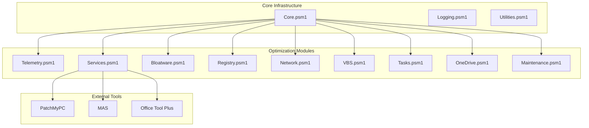
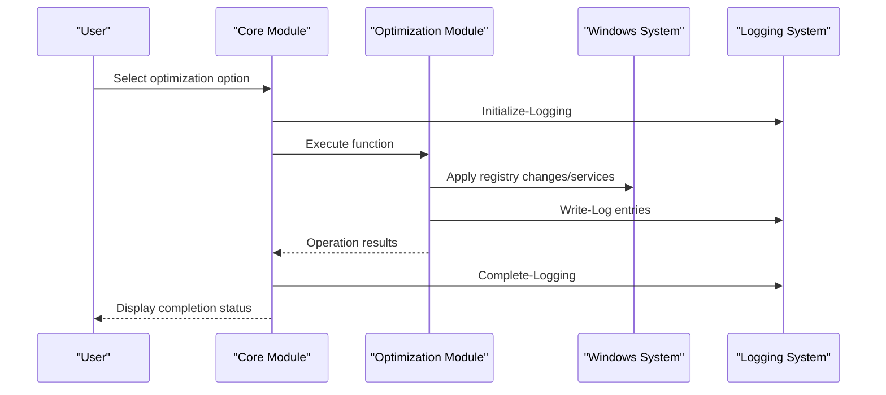
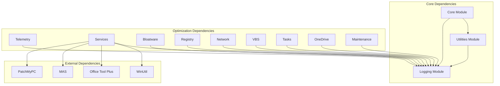

# Optimization Modules

<cite>
**Referenced Files in This Document**
- [README.md](file://README.md)
- [modules/Telemetry.psm1](file://modules/Telemetry.psm1)
- [modules/Services.psm1](file://modules/Services.psm1)
- [modules/Bloatware.psm1](file://modules/Bloatware.psm1)
- [modules/Registry.psm1](file://modules/Registry.psm1)
- [modules/Network.psm1](file://modules/Network.psm1)
- [modules/VBS.psm1](file://modules/VBS.psm1)
- [modules/Tasks.psm1](file://modules/Tasks.psm1)
- [modules/OneDrive.psm1](file://modules/OneDrive.psm1)
- [modules/Maintenance.psm1](file://modules/Maintenance.psm1)
- [modules/Core.psm1](file://modules/Core.psm1)
- [modules/Logging.psm1](file://modules/Logging.psm1)
- [modules/Utilities.psm1](file://modules/Utilities.psm1)
</cite>

## Table of Contents
1. [Introduction](#introduction)
2. [Project Structure](#project-structure)
3. [Core Components](#core-components)
4. [Architecture Overview](#architecture-overview)
5. [Detailed Component Analysis](#detailed-component-analysis)
6. [Dependency Analysis](#dependency-analysis)
7. [Performance Considerations](#performance-considerations)
8. [Troubleshooting Guide](#troubleshooting-guide)
9. [Conclusion](#conclusion)

## Introduction
This document provides comprehensive technical documentation for the System Optimizer's optimization modules. The toolkit offers 27 specialized modules covering privacy controls, service management, bloatware removal, registry optimizations, network tuning, virtualization security controls, scheduled task management, OneDrive removal, and system maintenance operations. Each module is designed with robust safety mechanisms, progress tracking, and detailed logging capabilities.

The System Optimizer replaces previous projects and provides a unified interface for Windows 10/11 system optimization with over 38 menu options and a standalone executable distribution.

## Project Structure
The optimization modules are organized as PowerShell modules (.psm1 files) within the modules/ directory, each encapsulating specific optimization functions:



**Diagram sources**
- [modules/Core.psm1](file://modules/Core.psm1#L698-L844)
- [modules/Telemetry.psm1](file://modules/Telemetry.psm1#L1-L503)
- [modules/Services.psm1](file://modules/Services.psm1#L1-L712)

**Section sources**
- [README.md](file://README.md#L1-L88)

## Core Components
The System Optimizer's core infrastructure provides unified progress tracking, logging, and orchestration capabilities:

### Progress Tracking System
The enhanced progress tracking system offers sophisticated operation monitoring with:
- Real-time ETA calculations based on item processing times
- Comprehensive success/failure/skip statistics
- Multi-mode progress display (console, GUI, enhanced)
- Automatic cleanup of progress resources

### Logging Framework
Centralized logging with:
- Structured timestamped entries with severity levels
- File-based persistence with automatic rotation
- Color-coded console output with debug-level filtering
- Error context capture with exception details

### Menu System
Interactive menu with 38 optimization options covering:
- Quick actions for complete optimization workflows
- Individual module-specific optimizations
- Software installation and activation tools
- Advanced system management utilities

**Section sources**
- [modules/Core.psm1](file://modules/Core.psm1#L60-L251)
- [modules/Logging.psm1](file://modules/Logging.psm1#L68-L195)
- [modules/Utilities.psm1](file://modules/Utilities.psm1#L330-L394)

## Architecture Overview
The optimization modules follow a modular architecture with clear separation of concerns:



**Diagram sources**
- [modules/Core.psm1](file://modules/Core.psm1#L698-L742)
- [modules/Logging.psm1](file://modules/Logging.psm1#L17-L58)

## Detailed Component Analysis

### Telemetry Module
The Telemetry module provides comprehensive privacy controls with 35+ optimization functions:

#### Privacy Controls
- **Advertising ID**: Disables advertising tracking identifiers
- **Activity History**: Prevents activity feed publishing
- **Bing Search**: Removes web search integration
- **Windows Feedback**: Stops feedback collection
- **Content Delivery**: Prevents bloatware reinstall
- **Location Tracking**: Disables geolocation services
- **Wi-Fi Sense**: Removes hotspot sharing
- **Data Collection**: Sets telemetry level to minimal
- **Cortana Controls**: Disables AI assistant features
- **Live Tiles**: Prevents tile synchronization
- **Feedback Notifications**: Stops feedback prompts
- **Tailored Experiences**: Disables personalized suggestions
- **Windows Error Reporting**: Disables crash reporting
- **Delivery Optimization**: Prevents peer-to-peer updates
- **Remote Assistance**: Disables remote help services
- **Task View & People**: Hides desktop integration features
- **News & Feeds**: Removes news aggregation
- **PowerShell Telemetry**: Disables PowerShell analytics
- **Copilot & Recall**: Disables AI features

#### Safety Mechanisms
- Graceful handling of missing registry keys
- Progress tracking with detailed status reporting
- Error containment with descriptive messages
- Backup capability through rollback system

#### Practical Workflow Example
```powershell
# Complete privacy optimization
Disable-Telemetry
Block-TelemetryDomains
```

**Section sources**
- [modules/Telemetry.psm1](file://modules/Telemetry.psm1#L5-L238)
- [modules/Telemetry.psm1](file://modules/Telemetry.psm1#L243-L494)

### Services Module
The Services module manages Windows services with two operational modes:

#### Safe Mode Operations (~45 services)
- **Telemetry Services**: DiagTrack, WerSvc, wisvc
- **Xbox Integration**: XblAuthManager, XboxGipSvc
- **Hyper-V Guest**: vmickvpexchange, vmicshutdown
- **Rarely Used**: Fax, RetailDemo, MapsBroker
- **Miscellaneous**: WMPNetworkSvc, SEMgrSvc

#### Aggressive Mode Operations (~90 services)
- **Performance Services**: SysMain (Superfetch), WSearch (Windows Search)
- **Hardware Services**: Spooler (Print), WbioSrvc (Biometrics)
- **Communication**: lfsvc (Location), PhoneSvc (Phone)
- **Remote Access**: TermService (RDP), SessionEnv
- **Security**: WpnService (Notifications), CDPSvc (Connected Devices)
- **Authentication**: NgcSvc (Windows Hello), Smart Card services

#### Service Management Strategies
- **Progress Tracking**: Real-time operation monitoring
- **Compatibility Detection**: Automatic Windows version checks
- **WinUtil Integration**: Synchronizes with external service configurations
- **Teams Management**: Separate startup control for Microsoft Teams

#### Practical Workflow Example
```powershell
# Safe service optimization
Disable-Services

# Aggressive optimization with confirmation
Disable-Services -Aggressive
```

**Section sources**
- [modules/Services.psm1](file://modules/Services.psm1#L5-L192)
- [modules/Services.psm1](file://modules/Services.psm1#L194-L402)
- [modules/Services.psm1](file://modules/Services.psm1#L404-L606)

### Bloatware Module
The Bloatware module provides comprehensive application removal with intelligent compatibility handling:

#### AppX Package Management
- **Universal Windows Apps**: 40+ pre-installed applications
- **Windows 10/11 Specific**: Clipchamp, Dev Home, Copilot
- **Gaming Apps**: Xbox ecosystem applications
- **Third-party Apps**: Adobe, Spotify, Netflix, TikTok integrations
- **Legacy Apps**: Reader, Maps, Reading List

#### Removal Strategies
- **Multi-user Support**: Handles both current user and all users
- **Provisioned Packages**: Prevents reinstallation for new users
- **Registry Cleanup**: Removes leftover extension points
- **Compatibility Detection**: Validates Windows version support

#### Privacy Protection Functions
- **Feedback Experience**: Disables Windows Feedback
- **Cortana Controls**: Comprehensive AI assistant management
- **Search Integration**: Removes Bing search integration
- **Location Services**: Disables geolocation tracking
- **Scheduled Tasks**: Disables telemetry-related tasks

#### Practical Workflow Example
```powershell
# Remove all non-essential apps
DebloatAll

# Remove specific bloatware categories
DebloatBlacklist
```

**Section sources**
- [modules/Bloatware.psm1](file://modules/Bloatware.psm1#L110-L181)
- [modules/Bloatware.psm1](file://modules/Bloatware.psm1#L196-L427)
- [modules/Bloatware.psm1](file://modules/Bloatware.psm1#L567-L706)

### Registry Module
The Registry module applies 20+ performance and usability optimizations:

#### Performance Optimizations
- **Game Bar/DVR**: Disables game recording features
- **Background Apps**: Prevents background application access
- **Transparency Effects**: Disables visual effects
- **Startup Delay**: Eliminates application startup delays
- **Mouse Acceleration**: Standardizes mouse behavior
- **Hibernation**: Disables hibernation for SSD optimization

#### System Enhancements
- **Menu Show Delay**: Reduces context menu response time
- **Thumbnail Cache**: Optimizes cache cleanup scheduling
- **Low Disk Space**: Disables low disk space warnings
- **NTFS Optimization**: Disables last access timestamps
- **8.3 Filenames**: Prevents legacy filename creation
- **Fullscreen Optimizations**: Disables FSO system-wide
- **GPU Scheduling**: Enables hardware-accelerated scheduling
- **Memory Management**: Optimizes cache allocation for 8GB+
- **Prefetch Optimization**: Disables prefetch for SSD systems
- **Windows Tips**: Removes suggestion prompts
- **Sticky Keys**: Disables accessibility prompts
- **Icon Cache**: Increases icon cache capacity

#### Practical Workflow Example
```powershell
# Apply all registry optimizations
Set-RegistryOptimizations
```

**Section sources**
- [modules/Registry.psm1](file://modules/Registry.psm1#L5-L207)

### Network Module
The Network module provides comprehensive networking optimizations:

#### IPv6 Management
- **Protocol Disablement**: Completely disables IPv6 protocol
- **Registry Configuration**: Sets DisabledComponents to 255
- **Adapter Binding**: Disables TCP/IP v6 on all network adapters

#### Latency Reduction
- **Nagle's Algorithm**: Disables for reduced network latency
- **TCP Acknowledgment**: Optimizes acknowledgment frequency
- **Network Throttling**: Sets throttling index to maximum
- **System Responsiveness**: Optimizes multimedia responsiveness

#### Network Management
- **Location Wizard**: Disables network connection wizard
- **DNS Cache**: Provides flush functionality
- **Reset Capabilities**: Complete network stack reset

#### Practical Workflow Example
```powershell
# Apply network optimizations
Set-NetworkOptimizations

# Reset network configuration
Reset-Network
```

**Section sources**
- [modules/Network.psm1](file://modules/Network.psm1#L5-L44)
- [modules/Network.psm1](file://modules/Network.psm1#L46-L91)

### VBS Module
The VBS (Virtualization-Based Security) module provides memory integrity controls:

#### Memory Integrity Management
- **HVCI Control**: Disables Hypervisor-Enforced Code Integrity
- **Credential Guard**: Removes virtualization-based security
- **Core Isolation**: Disables System Guard isolation
- **LSA Configuration**: Resets LSA security flags

#### Security Implications
- **Platform Security**: Requires reboot for changes to take effect
- **Security Trade-offs**: Disables hardware-based security features
- **Compatibility**: May affect security-dependent applications

#### Practical Workflow Example
```powershell
# Disable VBS and memory integrity
Disable-VBS
```

**Section sources**
- [modules/VBS.psm1](file://modules/VBS.psm1#L5-L33)

### Tasks Module
The Tasks module manages scheduled task optimization:

#### Task Categories
- **Application Experience**: Microsoft Compatibility Appraiser
- **Customer Experience**: CEIP data collection tasks
- **Disk Diagnostic**: Disk diagnostic data collectors
- **Feedback System**: Siuf data collection tasks
- **Windows Error Reporting**: Queue reporting tasks
- **Power Efficiency**: AnalyzeSystem diagnostics
- **Maps**: Maps update and toast tasks
- **Xbox**: Game save tasks

#### Management Approach
- **Batch Processing**: Handles multiple tasks efficiently
- **Progress Tracking**: Monitors individual task operations
- **Error Containment**: Continues despite individual failures
- **Validation**: Confirms task existence before modification

#### Practical Workflow Example
```powershell
# Disable all scheduled tasks
Disable-ScheduledTasks
```

**Section sources**
- [modules/Tasks.psm1](file://modules/Tasks.psm1#L5-L69)

### OneDrive Module
The OneDrive module provides comprehensive removal capabilities:

#### Removal Process
- **Process Termination**: Stops OneDrive and setup processes
- **Uninstallation**: Executes OneDriveSetup.exe with /uninstall parameter
- **Cleanup**: Removes all OneDrive-related folders and files
- **Policy Control**: Disables OneDrive via Group Policy
- **Explorer Integration**: Removes OneDrive from Windows Explorer

#### Cleanup Operations
- **User Profile**: Removes OneDrive folder from user profile
- **Local Data**: Deletes local OneDrive cache and data
- **System Data**: Removes program data and temporary files
- **Installation Files**: Cleans up OneDriveSetup.exe files

#### Practical Workflow Example
```powershell
# Remove OneDrive completely
Remove-OneDrive
```

**Section sources**
- [modules/OneDrive.psm1](file://modules/OneDrive.psm1#L5-L66)

### Maintenance Module
The Maintenance module provides comprehensive system health operations:

#### System Maintenance
- **DISM Health**: Runs DISM /Online /Cleanup-Image /RestoreHealth
- **SFC Scanning**: Executes sfc /scannow for system file integrity
- **Temporary Cleanup**: Removes TEMP, Prefetch, and Windows Temp files
- **Update Cache**: Clears Windows Update download cache

#### Disk Cleanup Operations
- **Quick Cleanup**: Temporary file removal only
- **Full Cleanup**: Comprehensive system cleanup
- **Log Management**: Clears Windows event logs
- **Thumbnail Cache**: Removes thumbnail database files

#### Advanced Operations
- **Group Policy Reset**: Removes all local policy settings
- **WMI Repository Reset**: Repairs WMI infrastructure
- **System Verification**: Validates optimization status

#### Practical Workflow Example
```powershell
# Run system maintenance
Start-SystemMaintenance

# Perform disk cleanup
Start-DiskCleanup
```

**Section sources**
- [modules/Maintenance.psm1](file://modules/Maintenance.psm1#L5-L47)
- [modules/Maintenance.psm1](file://modules/Maintenance.psm1#L49-L127)
- [modules/Maintenance.psm1](file://modules/Maintenance.psm1#L129-L183)
- [modules/Maintenance.psm1](file://modules/Maintenance.psm1#L185-L274)

## Dependency Analysis



**Diagram sources**
- [modules/Core.psm1](file://modules/Core.psm1#L698-L844)
- [modules/Services.psm1](file://modules/Services.psm1#L194-L313)

The optimization modules demonstrate a well-structured dependency hierarchy where:
- Core provides shared infrastructure (logging, progress tracking)
- Individual modules depend on Core for consistent behavior
- Services module integrates with external tools for enhanced functionality
- All modules leverage the centralized logging system

**Section sources**
- [modules/Core.psm1](file://modules/Core.psm1#L848-L866)
- [modules/Services.psm1](file://modules/Services.psm1#L194-L313)

## Performance Considerations
The System Optimizer implements several performance optimization strategies:

### Progress Optimization
- **ETA Calculation**: Tracks individual item processing times for accurate estimates
- **Resource Management**: Automatically cleans up progress displays to prevent UI conflicts
- **Multi-threading**: Uses asynchronous operations where possible

### System Impact Minimization
- **Selective Operations**: Only modifies affected system components
- **Compatibility Checks**: Validates Windows version and feature availability
- **Graceful Degradation**: Continues operations even when individual components fail

### Memory and Resource Management
- **Progress State Cleanup**: Ensures proper disposal of GUI elements
- **Event Handler Management**: Properly registers and unregisters event handlers
- **Resource Pooling**: Reuses connections and handles where possible

## Troubleshooting Guide

### Common Issues and Solutions
- **Permission Errors**: Many optimizations require administrator privileges
- **Service Conflicts**: Some services may be protected or in use
- **Registry Access**: Certain registry keys may be protected by Windows
- **File Locking**: Some files may be locked by running processes

### Diagnostic Tools
- **Status Verification**: Use `Verify-OptimizationStatus` to check current system state
- **Log Analysis**: Review detailed logs for error contexts and solutions
- **Component Testing**: Test individual modules in isolation

### Recovery Procedures
- **Rollback System**: Available for complete optimization sessions
- **Group Policy Reset**: Restores default policy settings
- **WMI Repair**: Repairs Windows Management Instrumentation
- **System Restore**: Creates restore points before major changes

**Section sources**
- [modules/Utilities.psm1](file://modules/Utilities.psm1#L44-L119)
- [modules/Logging.psm1](file://modules/Logging.psm1#L125-L145)

## Conclusion
The System Optimizer's optimization modules provide a comprehensive, enterprise-grade solution for Windows system optimization. With over 38 menu options spanning privacy controls, service management, application removal, registry optimizations, network tuning, and system maintenance, the toolkit offers both simplicity for casual users and depth for advanced administrators.

The modular architecture ensures maintainability and extensibility, while the centralized logging and progress tracking systems provide excellent operational visibility. The safety mechanisms built into each module protect against common failure scenarios and provide clear recovery pathways.

Key strengths include:
- **Comprehensive Coverage**: Addresses all major system optimization areas
- **Safety First**: Robust error handling and recovery mechanisms
- **Performance Focus**: Optimized for speed and resource efficiency
- **User Experience**: Intuitive menu system with detailed progress feedback
- **Extensibility**: Modular design allows for easy addition of new optimization functions

The System Optimizer represents a mature, production-ready solution for Windows system optimization with clear documentation, comprehensive testing, and extensive user support.