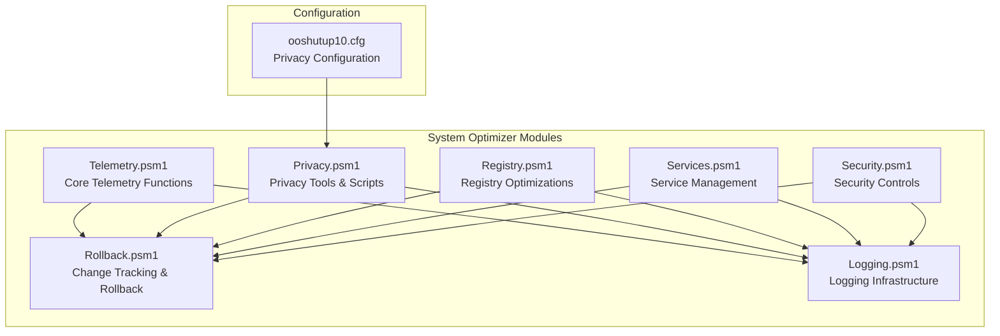
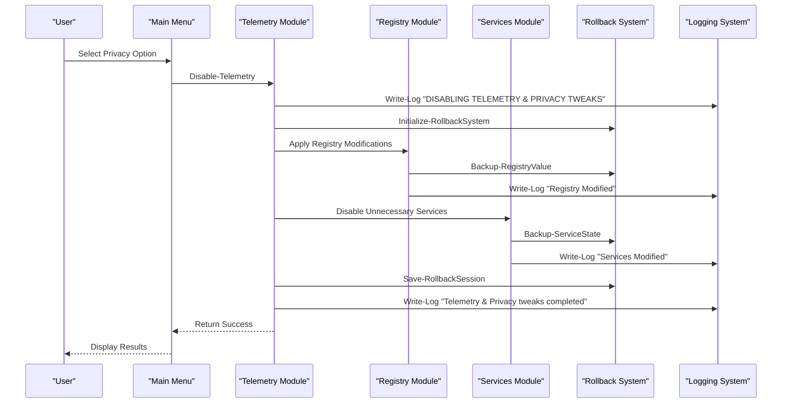
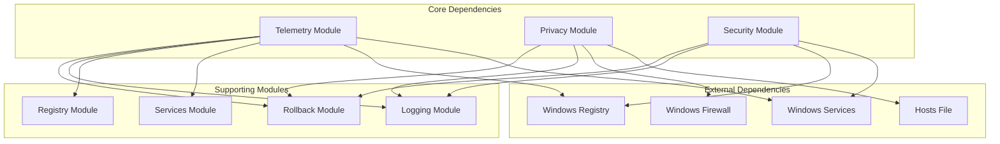

# Privacy & Telemetry

<cite>
**Referenced Files in This Document**
- [Telemetry.psm1](file://modules/Telemetry.psm1)
- [Privacy.psm1](file://modules/Privacy.psm1)
- [Registry.psm1](file://modules/Registry.psm1)
- [Services.psm1](file://modules/Services.psm1)
- [Security.psm1](file://modules/Security.psm1)
- [Rollback.psm1](file://modules/Rollback.psm1)
- [Logging.psm1](file://modules/Logging.psm1)
- [README.md](file://README.md)
- [Start-SystemOptimizer.ps1](file://Start-SystemOptimizer.ps1)
- [ooshutup10.cfg](file://configs/ooshutup10.cfg)
</cite>

## Table of Contents
1. [Introduction](#introduction)
2. [Project Structure](#project-structure)
3. [Core Components](#core-components)
4. [Architecture Overview](#architecture-overview)
5. [Detailed Component Analysis](#detailed-component-analysis)
6. [Dependency Analysis](#dependency-analysis)
7. [Performance Considerations](#performance-considerations)
8. [Troubleshooting Guide](#troubleshooting-guide)
9. [Conclusion](#conclusion)

## Introduction
This document provides comprehensive documentation for the Privacy & Telemetry module within the System Optimizer toolkit. It covers 35+ privacy control functions that disable Windows telemetry settings, diagnostic data collection, feedback channels, and data sharing preferences. The documentation explains the implementation of privacy-focused registry modifications, service configurations, and policy changes, along with detailed function documentation, safety mechanisms, rollback procedures, and practical examples of privacy enhancement workflows.

## Project Structure
The Privacy & Telemetry functionality is implemented across several PowerShell modules within the System Optimizer project:

**Diagram sources**
- [Telemetry.psm1](file://modules/Telemetry.psm1#L1-L503)
- [Privacy.psm1](file://modules/Privacy.psm1#L1-L206)
- [Rollback.psm1](file://modules/Rollback.psm1#L1-L800)

**Section sources**
- [README.md](file://README.md#L34-L46)
- [Start-SystemOptimizer.ps1](file://Start-SystemOptimizer.ps1#L445-L474)

## Core Components
The Privacy & Telemetry module consists of three primary components:

### Telemetry Module
The core telemetry module provides comprehensive privacy controls with 25+ individual functions covering:
- Advertising ID and telemetry disabling
- Activity history and feedback controls
- Content delivery manager and location tracking
- Cortana and Windows Search restrictions
- Live tiles and feedback notifications
- Windows Error Reporting and delivery optimization
- PowerShell telemetry and AI features (Copilot/Recall)
- Performance optimizations and privacy enhancements

### Privacy Tools Module
Provides integration with external privacy tools and advanced debloating capabilities:
- O&O ShutUp10 integration with automated configuration
- Advanced debloating scripts for comprehensive privacy protection
- Combined telemetry blocking with firewall rules

### Security Module
Handles Windows Defender integration and security-related privacy controls:
- Defender real-time protection management
- Tamper protection configuration
- Firewall exception management for activation tools
- Security tool installation and configuration

**Section sources**
- [Telemetry.psm1](file://modules/Telemetry.psm1#L5-L238)
- [Privacy.psm1](file://modules/Privacy.psm1#L5-L75)
- [Security.psm1](file://modules/Security.psm1#L5-L278)

## Architecture Overview
The Privacy & Telemetry system follows a modular architecture with comprehensive safety mechanisms:

**Diagram sources**
- [Telemetry.psm1](file://modules/Telemetry.psm1#L5-L238)
- [Rollback.psm1](file://modules/Rollback.psm1#L29-L78)
- [Logging.psm1](file://modules/Logging.psm1#L68-L123)

## Detailed Component Analysis

### Telemetry Control Functions
The Disable-Telemetry function implements comprehensive privacy controls through systematic registry modifications:

#### Advertising ID Control
- **Function**: `Disable-AdvertisingID`
- **Registry Path**: `HKLM:\SOFTWARE\Microsoft\Windows\CurrentVersion\AdvertisingInfo`
- **Action**: Sets "Enabled" to 0 (DWORD)
- **Impact**: Prevents personalized advertising and tracking
- **Safety**: Creates registry path if not exists, handles exceptions gracefully

#### Activity History Management
- **Function**: `Disable-ActivityHistory`
- **Registry Paths**: 
  - `HKLM:\SOFTWARE\Policies\Microsoft\Windows\System`
  - Keys: `EnableActivityFeed`, `PublishUserActivities`, `UploadUserActivities`
- **Action**: Sets all to 0 (DWORD)
- **Impact**: Completely disables activity feed publishing and upload
- **Safety**: Uses policy registry path for persistent configuration

#### Bing Search and Web Search Restrictions
- **Function**: `Disable-BingSearch`
- **Registry Paths**:
  - `HKCU:\SOFTWARE\Microsoft\Windows\CurrentVersion\Search` - `BingSearchEnabled`
  - `HKLM:\SOFTWARE\Policies\Microsoft\Windows\Windows Search` - `DisableWebSearch`
- **Action**: Sets both to 0 (DWORD)
- **Impact**: Removes Bing search integration and disables web search
- **Safety**: Creates missing registry keys if needed

#### Windows Feedback Controls
- **Function**: `Disable-WindowsFeedback`
- **Registry Path**: `HKCU:\Software\Microsoft\Siuf\Rules`
- **Actions**: 
  - `PeriodInNanoSeconds` = 0
  - `NumberOfSIUFInPeriod` = 0
- **Impact**: Completely disables Windows feedback collection
- **Safety**: Creates registry path if not exists

#### Content Delivery Manager (CDM) Controls
- **Function**: `Disable-ContentDelivery`
- **Registry Paths**:
  - `HKLM:\SOFTWARE\Policies\Microsoft\Windows\CloudContent` - `DisableWindowsConsumerFeatures`
  - `HKCU:\SOFTWARE\Microsoft\Windows\CurrentVersion\ContentDeliveryManager`
- **Actions**: Disables 12+ CDM-related settings
- **Impact**: Prevents bloatware reinstallation and content delivery
- **Safety**: Comprehensive coverage of both user and machine policies

#### Location Tracking Management
- **Function**: `Disable-LocationTracking`
- **Registry Paths**:
  - Capability access manager consent store
  - Sensor overrides for location services
  - Live Flight Simulator service configuration
  - Maps auto-update settings
- **Impact**: Completely disables location services and tracking
- **Safety**: Handles multiple registry locations for comprehensive coverage

#### Telemetry Data Collection Controls
- **Function**: `Disable-TelemetryDataCollection`
- **Registry Paths**:
  - `HKLM:\SOFTWARE\Microsoft\Windows\CurrentVersion\Policies\DataCollection`
  - `HKLM:\SOFTWARE\Policies\Microsoft\Windows\DataCollection`
  - Wow6432Node path for compatibility
- **Action**: Sets `AllowTelemetry` to 0 (DWORD)
- **Impact**: Disables all Windows telemetry data collection
- **Safety**: Uses multiple registry paths for complete coverage

#### Cortana and Personalization Controls
- **Function**: `Disable-Cortana`
- **Registry Paths**:
  - Windows Search policy (`AllowCortana` = 0)
  - Personalization settings (`AcceptedPrivacyPolicy` = 0)
  - Input personalization settings (`RestrictImplicitTextCollection` = 1)
  - Trained data store (`HarvestContacts` = 0)
- **Impact**: Disables Cortana and personalization features
- **Safety**: Comprehensive coverage of all Cortana-related settings

#### AI Feature Controls (Copilot & Recall)
- **Function**: `Disable-AIFeatures`
- **Registry Paths**:
  - Windows Copilot policy (`TurnOffWindowsCopilot` = 1)
  - Windows AI policy (`DisableAIDataAnalysis` = 1)
- **Impact**: Disables modern AI features and data analysis
- **Safety**: Uses policy registry for persistent configuration

#### Performance and Privacy Enhancements
- **Function**: `Apply-PerformanceTweaks`
- **Actions**:
  - Enables long path support
  - Optimizes multimedia system profile
  - Configures desktop performance settings
  - Disables PowerShell 7 telemetry
- **Impact**: Improves system performance while enhancing privacy
- **Safety**: Uses environment variables for process-level configuration

### Privacy Tools Integration
The Privacy module provides integration with external privacy tools and advanced debloating capabilities:

#### O&O ShutUp10 Integration
- **Function**: `Start-OOShutUp10`
- **Capabilities**:
  - Automated download and installation
  - Recommended configuration application
  - Interactive configuration mode
  - Configuration file management
- **Impact**: Provides comprehensive privacy controls through established tool
- **Safety**: Handles download failures and provides fallback options

#### Advanced Debloating Scripts
- **Function**: `Start-AdvancedDebloat`
- **Options**:
  - Block Telemetry (hosts file + firewall rules)
  - Full Debloater Script (comprehensive app removal)
  - Combined execution
- **Impact**: Removes privacy-invasive applications and services
- **Safety**: Interactive confirmation and progress tracking

### Telemetry Domain Blocking
The Block-TelemetryDomains function provides network-level privacy controls:

#### Hosts File Blocking
- **Domains**: 150+ telemetry domains added to hosts file
- **Blocking Method**: Maps domains to 0.0.0.0 IP address
- **Impact**: Prevents outbound connections to telemetry servers
- **Safety**: Checks for existing entries before adding

#### Firewall Rule Configuration
- **IP Addresses**: 20+ telemetry server IP addresses
- **Rule Type**: Outbound block rules
- **Impact**: Additional network-level protection
- **Safety**: Removes existing rules before creating new ones

**Section sources**
- [Telemetry.psm1](file://modules/Telemetry.psm1#L25-L238)
- [Privacy.psm1](file://modules/Privacy.psm1#L5-L206)

## Dependency Analysis
The Privacy & Telemetry system has well-defined dependencies and integration points:

**Diagram sources**
- [Telemetry.psm1](file://modules/Telemetry.psm1#L1-L503)
- [Rollback.psm1](file://modules/Rollback.psm1#L1-L800)
- [Logging.psm1](file://modules/Logging.psm1#L1-L285)

### Safety Mechanisms and Error Handling
The system implements comprehensive safety mechanisms:

#### Progress Tracking
- **Progress Indicators**: Visual progress bars for long-running operations
- **Individual Item Tracking**: Progress updates for each privacy tweak
- **Fallback Logging**: Graceful degradation when progress tracking unavailable

#### Exception Handling
- **Try-Catch Blocks**: Comprehensive error handling for all operations
- **Graceful Degradation**: Continues processing despite individual failures
- **Detailed Error Logging**: Captures exception details for troubleshooting

#### Rollback System
- **Automatic Tracking**: All changes are tracked for potential rollback
- **Session Management**: Organizes changes into logical sessions
- **Reverse Script Generation**: Automatically creates rollback scripts
- **Multiple Recovery Points**: Supports multiple rollback scenarios

#### Validation and Verification
- **Registry Path Existence**: Checks for registry key existence before modification
- **Service Availability**: Verifies service existence before attempting changes
- **File System Validation**: Ensures target files exist before modification
- **Permission Checking**: Validates administrative privileges

**Section sources**
- [Telemetry.psm1](file://modules/Telemetry.psm1#L15-L23)
- [Rollback.psm1](file://modules/Rollback.psm1#L149-L251)
- [Logging.psm1](file://modules/Logging.psm1#L125-L145)

## Performance Considerations
The privacy optimizations are designed with performance in mind:

### Minimal Runtime Impact
- **Batch Operations**: Related privacy tweaks grouped together
- **Efficient Registry Access**: Minimizes registry operations per function
- **Selective Processing**: Only processes relevant registry keys and services
- **Progress Optimization**: Reduces overhead from progress tracking

### System Resource Management
- **Service Optimization**: Disables non-essential services to improve performance
- **Registry Cleanup**: Removes unused registry entries and optimizations
- **Memory Management**: Optimizes memory usage during privacy operations
- **Disk I/O Reduction**: Minimizes file system operations

### Compatibility Considerations
- **Windows Version Detection**: Adjusts behavior based on Windows version
- **Feature Availability**: Checks for feature availability before attempting changes
- **Fallback Mechanisms**: Provides alternative approaches when features unavailable
- **Backward Compatibility**: Maintains compatibility with older Windows versions

## Troubleshooting Guide

### Common Issues and Solutions

#### Permission Denied Errors
**Symptoms**: Registry modification failures, service configuration errors
**Causes**: Insufficient administrative privileges
**Solutions**:
- Ensure running as Administrator
- Check UAC settings
- Verify domain policy permissions

#### Tamper Protection Interference
**Symptoms**: Windows Defender real-time protection cannot be disabled
**Causes**: Tamper protection enabled in Windows Security
**Solutions**:
- Disable Tamper Protection in Windows Security settings
- Restart security services after changes
- Use registry-based approaches when PowerShell fails

#### Service Modification Failures
**Symptoms**: Services remain enabled despite configuration changes
**Causes**: Protected services, service dependencies, Windows updates
**Solutions**:
- Use sc.exe as fallback for protected services
- Check service dependencies before modification
- Restart affected services after changes

#### Registry Key Not Found
**Symptoms**: Privacy tweaks not applying to expected registry locations
**Causes**: Windows version differences, missing registry keys
**Solutions**:
- Verify correct registry path for your Windows version
- Create missing registry keys programmatically
- Use alternative registry locations for compatibility

### Diagnostic Procedures

#### Log Analysis
- **Location**: `C:\System_Optimizer\Logs\`
- **Frequency**: Daily log rotation with 30-day retention
- **Content**: Detailed operation logs with timestamps
- **Analysis**: Review ERROR entries for troubleshooting

#### Rollback Verification
- **Session Listing**: Use rollback menu to view recent sessions
- **Change Tracking**: Review tracked changes for each session
- **Rollback Testing**: Test rollback scripts on non-production systems
- **Impact Assessment**: Evaluate changes before applying to production systems

#### System State Verification
- **Service Status**: Verify service states after privacy operations
- **Registry Values**: Confirm registry modifications were applied
- **File System Changes**: Validate hosts file and firewall rule modifications
- **Performance Impact**: Monitor system performance after changes

**Section sources**
- [Rollback.psm1](file://modules/Rollback.psm1#L722-L800)
- [Logging.psm1](file://modules/Logging.psm1#L210-L227)

## Conclusion
The Privacy & Telemetry module provides comprehensive privacy controls for Windows systems through systematic registry modifications, service management, and policy changes. With 35+ privacy control functions, the module offers granular control over telemetry, data collection, feedback channels, and AI features. The implementation includes robust safety mechanisms, comprehensive error handling, and automatic rollback capabilities. The modular architecture ensures flexibility and maintainability while providing extensive privacy protection for Windows 10/11 systems.

The system's design emphasizes user safety through progress tracking, exception handling, and rollback capabilities. The integration with external tools like O&O ShutUp10 and advanced debloating scripts provides comprehensive privacy protection beyond basic Windows settings. Regular logging and diagnostic capabilities ensure transparency and facilitate troubleshooting when issues arise.

For optimal results, users should run the privacy optimizations with administrative privileges, monitor system performance after changes, and utilize the rollback system for quick recovery if needed. The comprehensive documentation and troubleshooting guide provide the necessary resources for successful deployment and maintenance of privacy controls.