# Software Management

<cite>
**Referenced Files in This Document**
- [Bloatware.psm1](file://modules/Bloatware.psm1)
- [Software.psm1](file://modules/Software.psm1)
- [winget_packages.json](file://configs/winget_packages.json)
- [PatchMyPC.ini](file://configs/PatchMyPC.ini)
- [ooshutup10.cfg](file://configs/ooshutup10.cfg)
- [VERSION.json](file://configs/VERSION.json)
- [README.md](file://README.md)
</cite>

## Table of Contents
1. [Introduction](#introduction)
2. [Project Structure](#project-structure)
3. [Core Components](#core-components)
4. [Architecture Overview](#architecture-overview)
5. [Detailed Component Analysis](#detailed-component-analysis)
6. [Dependency Analysis](#dependency-analysis)
7. [Performance Considerations](#performance-considerations)
8. [Troubleshooting Guide](#troubleshooting-guide)
9. [Conclusion](#conclusion)
10. [Appendices](#appendices)

## Introduction
This document provides comprehensive documentation for the Software Management subsystem focused on application removal and software management. It covers the Bloatware module’s capabilities for removing unwanted applications, managing whitelists and blacklists, cross-platform compatibility handling, and bulk uninstall operations. It also explains system app detection, third-party software identification, and safe removal procedures. Practical examples, compatibility considerations, and best practices for maintaining system stability during app removal are included.

## Project Structure
The Software Management functionality spans two primary modules:
- Bloatware module: Handles AppX package removal, registry cleanup, privacy hardening, Cortana toggles, Edge PDF defaults, OneDrive uninstall, and restoration procedures.
- Software module: Provides software installation workflows via PatchMyPC, Winget presets, Chocolatey, and remote desktop tools, along with PDF default selection.

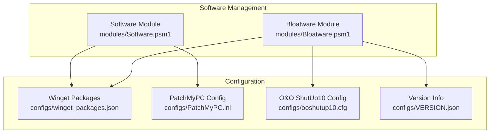

**Diagram sources**
- [Bloatware.psm1](file://modules/Bloatware.psm1#L1-L1328)
- [Software.psm1](file://modules/Software.psm1#L1-L921)
- [winget_packages.json](file://configs/winget_packages.json#L1-L108)
- [PatchMyPC.ini](file://configs/PatchMyPC.ini#L1-L376)
- [ooshutup10.cfg](file://configs/ooshutup10.cfg#L1-L246)
- [VERSION.json](file://configs/VERSION.json#L1-L34)

**Section sources**
- [README.md](file://README.md#L1-L88)
- [Bloatware.psm1](file://modules/Bloatware.psm1#L1-L1328)
- [Software.psm1](file://modules/Software.psm1#L1-L921)

## Core Components
- AppX Removal Engine: Safe wrappers around AppX cmdlets with compatibility checks and progress tracking.
- Whitelist/Blacklist Management: Built-in lists for essential and unwanted apps; pattern-based matching for third-party bloatware.
- Cross-Platform Compatibility: OS build detection and AppX availability checks; fallbacks for older Windows versions.
- Bulk Uninstall Operations: Iterative removal across all users, current user, and provisioned packages (Windows 10+).
- System App Detection: Uses AppX cmdlets and provisioned package enumeration to identify installed and provisioned apps.
- Third-Party Software Identification: Wildcard patterns and registry key cleanup for sponsored and third-party apps.
- Safe Removal Procedures: Progress tracking, error handling, and registry cleanup to remove leftover artifacts.
- Restoration Procedures: Reinstall AppX packages, re-enable privacy features, restore scheduled tasks, and reset services.
- Software Installation Workflows: PatchMyPC integration, Winget presets, Chocolatey, and remote desktop tools.

**Section sources**
- [Bloatware.psm1](file://modules/Bloatware.psm1#L11-L181)
- [Bloatware.psm1](file://modules/Bloatware.psm1#L196-L427)
- [Bloatware.psm1](file://modules/Bloatware.psm1#L429-L552)
- [Bloatware.psm1](file://modules/Bloatware.psm1#L821-L931)
- [Software.psm1](file://modules/Software.psm1#L5-L131)
- [Software.psm1](file://modules/Software.psm1#L209-L303)
- [Software.psm1](file://modules/Software.psm1#L305-L453)

## Architecture Overview
The Software Management subsystem integrates with configuration-driven presets and external tools to provide a unified interface for software management.

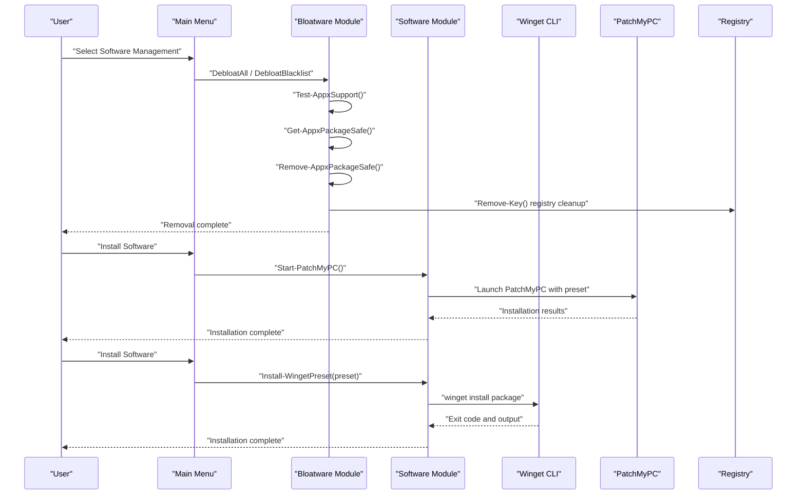

**Diagram sources**
- [Bloatware.psm1](file://modules/Bloatware.psm1#L110-L181)
- [Bloatware.psm1](file://modules/Bloatware.psm1#L196-L427)
- [Bloatware.psm1](file://modules/Bloatware.psm1#L429-L552)
- [Software.psm1](file://modules/Software.psm1#L5-L131)
- [Software.psm1](file://modules/Software.psm1#L209-L303)

## Detailed Component Analysis

### App Removal Engine
The AppX removal engine provides safe wrappers around AppX cmdlets with compatibility checks and progress tracking. It ensures removal only on supported platforms and gracefully handles errors.

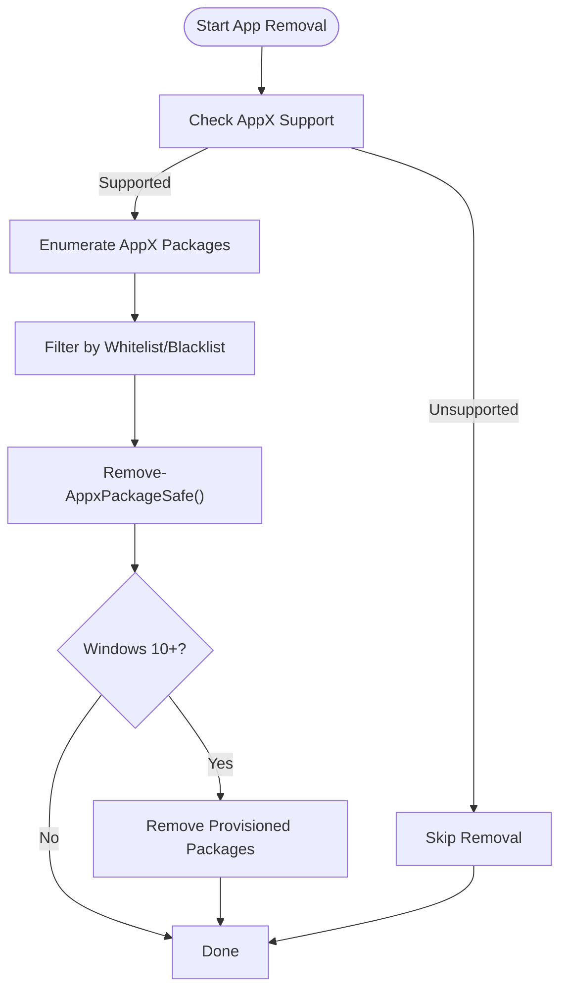

**Diagram sources**
- [Bloatware.psm1](file://modules/Bloatware.psm1#L19-L30)
- [Bloatware.psm1](file://modules/Bloatware.psm1#L32-L71)
- [Bloatware.psm1](file://modules/Bloatware.psm1#L110-L181)

Key functions:
- Test-AppxSupport: Validates AppX cmdlet availability and OS compatibility.
- Get-AppxPackageSafe: Retrieves AppX packages with version checks and error suppression.
- Remove-AppxPackageSafe: Safely removes AppX packages with pipeline support.
- Add-AppxPackageSafe: Registers AppX packages from manifest paths.

Operational behavior:
- Whitelist of essential apps prevents accidental removal of core system components.
- Blacklist of unwanted apps includes Windows built-ins, Xbox, and third-party bloatware.
- Provisioned packages are removed on Windows 10+ to prevent reinstallation on new users.
- Progress tracking integrates with optional progress operations for UI feedback.

**Section sources**
- [Bloatware.psm1](file://modules/Bloatware.psm1#L19-L30)
- [Bloatware.psm1](file://modules/Bloatware.psm1#L32-L71)
- [Bloatware.psm1](file://modules/Bloatware.psm1#L110-L181)
- [Bloatware.psm1](file://modules/Bloatware.psm1#L196-L427)

### Whitelist and Blacklist Management
The module maintains explicit whitelists and blacklists to guide removal decisions. Patterns are used to match third-party and sponsored apps.

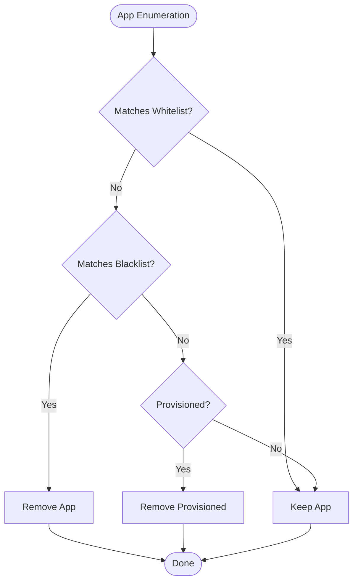

**Diagram sources**
- [Bloatware.psm1](file://modules/Bloatware.psm1#L127-L136)
- [Bloatware.psm1](file://modules/Bloatware.psm1#L196-L373)

Implementation highlights:
- Whitelist includes essential apps like calculator, store, photos, paint3D, and select Xbox components.
- Blacklist includes Windows 10/11 built-ins, Xbox apps, and third-party sponsored apps.
- Wildcards are used for third-party packages to capture variations.

**Section sources**
- [Bloatware.psm1](file://modules/Bloatware.psm1#L127-L136)
- [Bloatware.psm1](file://modules/Bloatware.psm1#L196-L373)

### Cross-Platform Compatibility Handling
Compatibility checks ensure operations are only executed on supported systems.

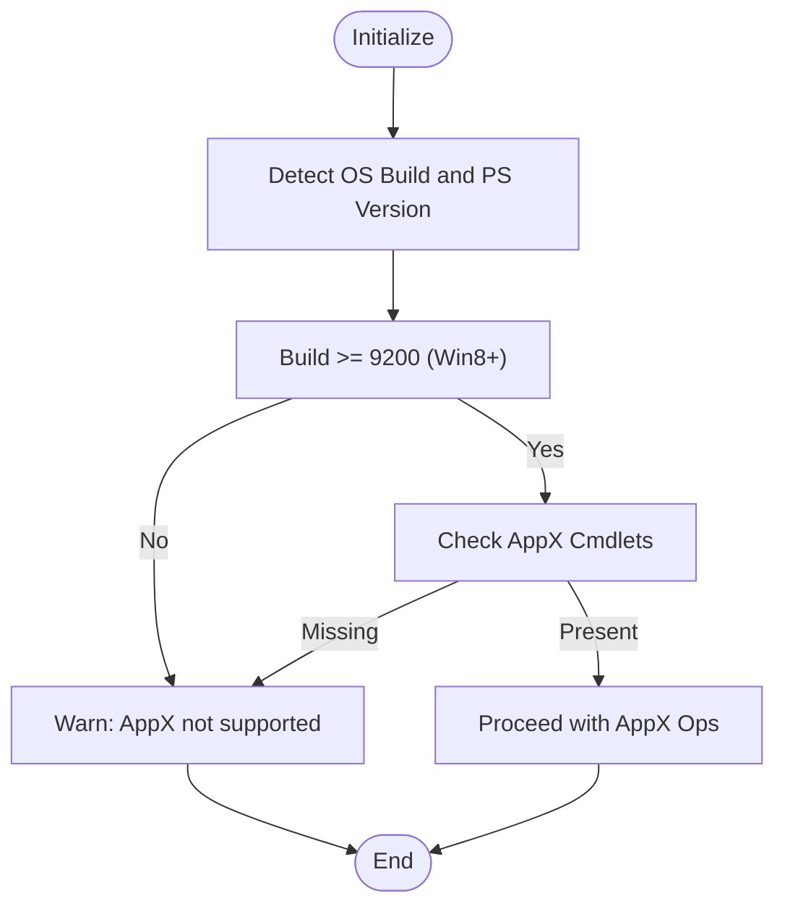

**Diagram sources**
- [Bloatware.psm1](file://modules/Bloatware.psm1#L13-L17)
- [Bloatware.psm1](file://modules/Bloatware.psm1#L19-L30)

Behavior:
- AppX cmdlets are only used on Windows 8 and later.
- Provisioned package removal is restricted to Windows 10 and later.
- Error actions are suppressed to avoid breaking the script flow.

**Section sources**
- [Bloatware.psm1](file://modules/Bloatware.psm1#L13-L17)
- [Bloatware.psm1](file://modules/Bloatware.psm1#L153-L165)

### Bulk Uninstall Operations
Bulk operations target all users, current user, and provisioned packages to maximize removal coverage.

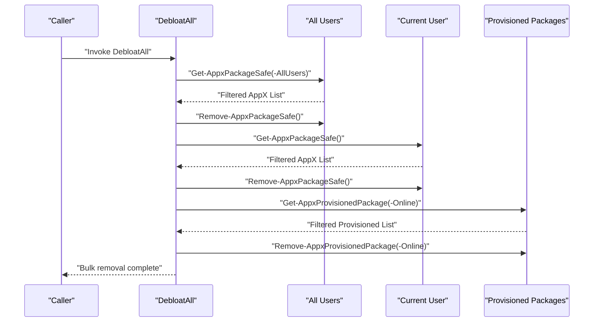

**Diagram sources**
- [Bloatware.psm1](file://modules/Bloatware.psm1#L110-L181)

**Section sources**
- [Bloatware.psm1](file://modules/Bloatware.psm1#L110-L181)

### System App Detection and Third-Party Identification
System app detection relies on AppX cmdlets and provisioned package enumeration. Third-party identification uses wildcard patterns and registry cleanup.

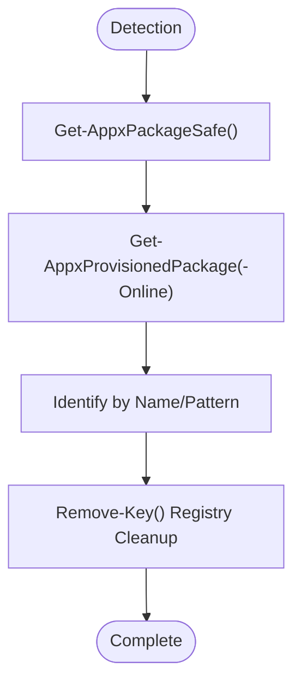

**Diagram sources**
- [Bloatware.psm1](file://modules/Bloatware.psm1#L32-L53)
- [Bloatware.psm1](file://modules/Bloatware.psm1#L196-L427)
- [Bloatware.psm1](file://modules/Bloatware.psm1#L429-L552)

**Section sources**
- [Bloatware.psm1](file://modules/Bloatware.psm1#L32-L53)
- [Bloatware.psm1](file://modules/Bloatware.psm1#L196-L427)
- [Bloatware.psm1](file://modules/Bloatware.psm1#L429-L552)

### Safe Removal Procedures
Safe removal procedures include progress tracking, error handling, and registry cleanup to remove leftover artifacts.

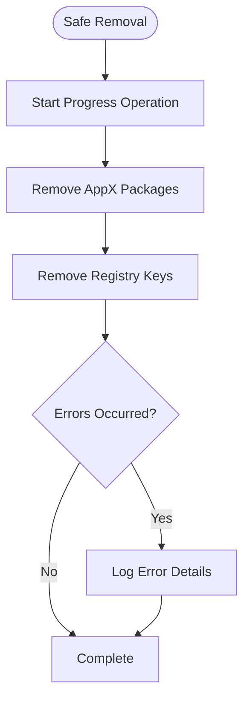

**Diagram sources**
- [Bloatware.psm1](file://modules/Bloatware.psm1#L121-L171)
- [Bloatware.psm1](file://modules/Bloatware.psm1#L429-L552)

**Section sources**
- [Bloatware.psm1](file://modules/Bloatware.psm1#L121-L171)
- [Bloatware.psm1](file://modules/Bloatware.psm1#L429-L552)

### Restoration Procedures
Restoration procedures revert debloat changes by reinstalling AppX packages and restoring privacy settings.

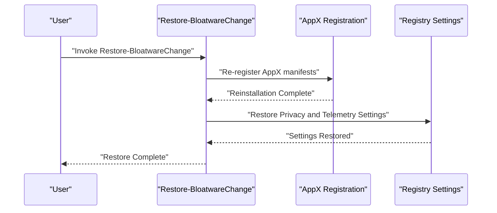

**Diagram sources**
- [Bloatware.psm1](file://modules/Bloatware.psm1#L821-L931)

**Section sources**
- [Bloatware.psm1](file://modules/Bloatware.psm1#L821-L931)

### Software Installation Workflows
The Software module provides multiple installation workflows via PatchMyPC, Winget presets, Chocolatey, and remote desktop tools.

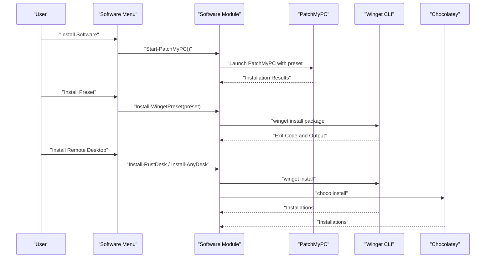

**Diagram sources**
- [Software.psm1](file://modules/Software.psm1#L5-L131)
- [Software.psm1](file://modules/Software.psm1#L209-L303)
- [Software.psm1](file://modules/Software.psm1#L506-L585)
- [Software.psm1](file://modules/Software.psm1#L587-L666)

**Section sources**
- [Software.psm1](file://modules/Software.psm1#L5-L131)
- [Software.psm1](file://modules/Software.psm1#L209-L303)
- [Software.psm1](file://modules/Software.psm1#L506-L585)
- [Software.psm1](file://modules/Software.psm1#L587-L666)

### Dependency Resolution and Preset Management
Dependency resolution is handled via configuration-driven presets for Winget and PatchMyPC.

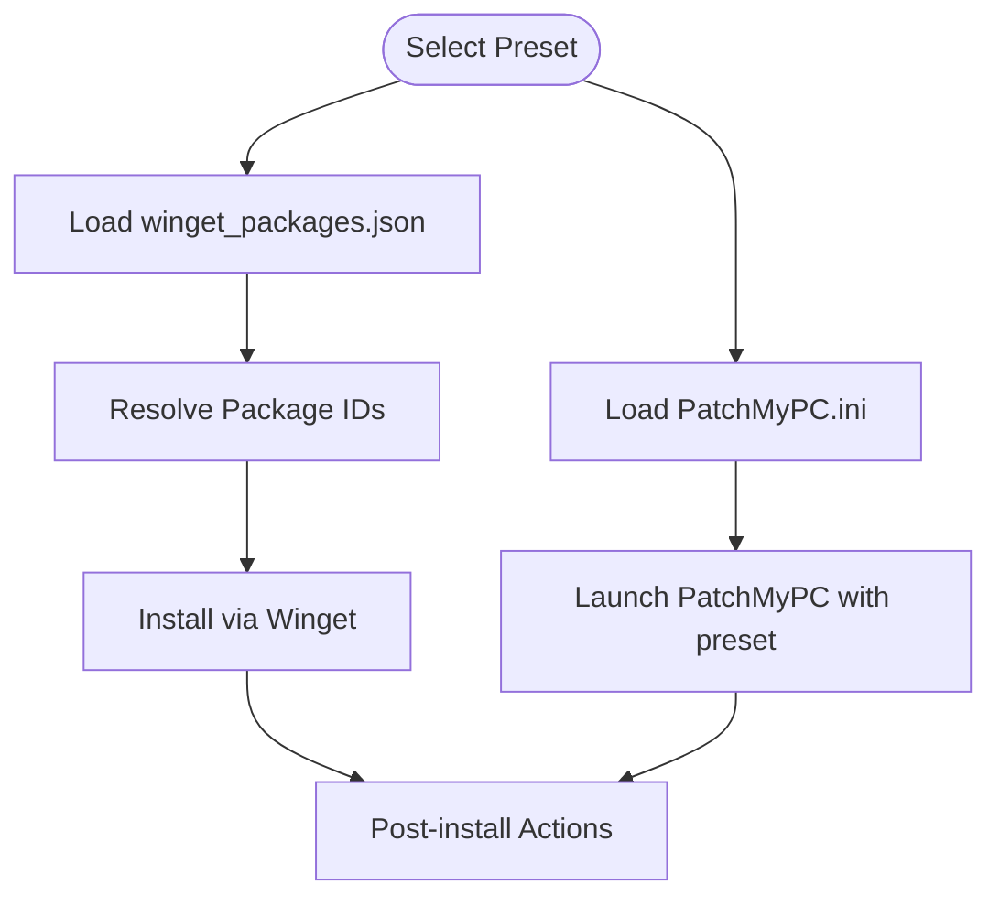

**Diagram sources**
- [Software.psm1](file://modules/Software.psm1#L209-L303)
- [Software.psm1](file://modules/Software.psm1#L5-L81)
- [winget_packages.json](file://configs/winget_packages.json#L1-L108)
- [PatchMyPC.ini](file://configs/PatchMyPC.ini#L1-L376)

**Section sources**
- [Software.psm1](file://modules/Software.psm1#L209-L303)
- [Software.psm1](file://modules/Software.psm1#L5-L81)
- [winget_packages.json](file://configs/winget_packages.json#L1-L108)
- [PatchMyPC.ini](file://configs/PatchMyPC.ini#L1-L376)

## Dependency Analysis
The Software Management subsystem depends on:
- PowerShell version and OS build for AppX cmdlet availability.
- External tools (Winget, PatchMyPC, Chocolatey) for software installation.
- Configuration files for presets and feature toggles.

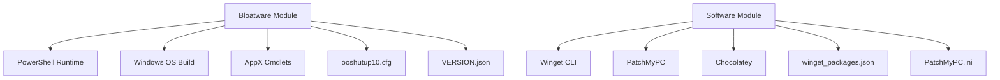

**Diagram sources**
- [Bloatware.psm1](file://modules/Bloatware.psm1#L13-L17)
- [Software.psm1](file://modules/Software.psm1#L209-L303)
- [Software.psm1](file://modules/Software.psm1#L5-L81)
- [winget_packages.json](file://configs/winget_packages.json#L1-L108)
- [PatchMyPC.ini](file://configs/PatchMyPC.ini#L1-L376)
- [ooshutup10.cfg](file://configs/ooshutup10.cfg#L1-L246)
- [VERSION.json](file://configs/VERSION.json#L1-L34)

**Section sources**
- [Bloatware.psm1](file://modules/Bloatware.psm1#L13-L17)
- [Software.psm1](file://modules/Software.psm1#L209-L303)
- [Software.psm1](file://modules/Software.psm1#L5-L81)
- [winget_packages.json](file://configs/winget_packages.json#L1-L108)
- [PatchMyPC.ini](file://configs/PatchMyPC.ini#L1-L376)
- [ooshutup10.cfg](file://configs/ooshutup10.cfg#L1-L246)
- [VERSION.json](file://configs/VERSION.json#L1-L34)

## Performance Considerations
- Use progress tracking to provide user feedback during long-running operations.
- Suppress errors during enumeration to avoid interruptions.
- Prefer filtering by patterns to minimize repeated calls to AppX cmdlets.
- Batch operations across all users and provisioned packages to reduce overhead.
- Validate OS compatibility before attempting AppX operations to avoid failures.

[No sources needed since this section provides general guidance]

## Troubleshooting Guide
Common issues and resolutions:
- AppX cmdlets not available: Ensure running on Windows 8 or later; verify AppX cmdlets presence.
- Provisioned package removal fails: Confirm Windows 10 or later; check online provisioning availability.
- Registry cleanup errors: Validate registry paths and permissions; handle wildcard expansion carefully.
- Installation failures: Verify external tool availability (Winget, PatchMyPC, Chocolatey); check network connectivity.
- Progress tracking not available: Fallback to basic logging and status messages.

**Section sources**
- [Bloatware.psm1](file://modules/Bloatware.psm1#L19-L30)
- [Bloatware.psm1](file://modules/Bloatware.psm1#L153-L165)
- [Bloatware.psm1](file://modules/Bloatware.psm1#L429-L552)
- [Software.psm1](file://modules/Software.psm1#L209-L303)
- [Software.psm1](file://modules/Software.psm1#L5-L81)

## Conclusion
The Software Management subsystem provides a robust framework for removing unwanted applications, managing whitelists and blacklists, and performing bulk uninstall operations safely. It integrates with configuration-driven presets and external tools to offer flexible installation workflows while maintaining system stability through compatibility checks, progress tracking, and restoration procedures.

[No sources needed since this section summarizes without analyzing specific files]

## Appendices

### Practical Examples

- Bulk removal of all non-essential apps:
  - Invoke the bulk removal function to enumerate and remove AppX packages for all users and current user, and remove provisioned packages on Windows 10+.
  - Monitor progress and review logs for any errors encountered.

- Removing specific bloatware by name:
  - Use the blacklist removal function to target specific unwanted packages by name or pattern.
  - Review the filtered list and confirm removal before proceeding.

- Restoring debloat changes:
  - Reinstall essential AppX packages and restore privacy settings to revert all debloat modifications.
  - Verify scheduled tasks and services are re-enabled.

- Installing software via presets:
  - Launch PatchMyPC with a preconfigured preset to install a curated set of applications.
  - Use Winget presets for essential, runtime, developer, and gaming categories.

- Managing PDF defaults:
  - Set Adobe Reader as the default PDF handler and adjust registry entries to prevent Edge from overriding defaults.

**Section sources**
- [Bloatware.psm1](file://modules/Bloatware.psm1#L110-L181)
- [Bloatware.psm1](file://modules/Bloatware.psm1#L196-L427)
- [Bloatware.psm1](file://modules/Bloatware.psm1#L821-L931)
- [Software.psm1](file://modules/Software.psm1#L5-L131)
- [Software.psm1](file://modules/Software.psm1#L209-L303)
- [Software.psm1](file://modules/Software.psm1#L133-L207)

### Best Practices
- Always create a system backup before performing bulk removals.
- Use whitelists to protect essential system apps and avoid unintended removals.
- Test removals on a single user profile before applying to all users.
- Validate OS compatibility and external tool availability prior to execution.
- Monitor logs and progress indicators to track operation outcomes.
- Use restoration procedures to revert changes if issues arise.

[No sources needed since this section provides general guidance]