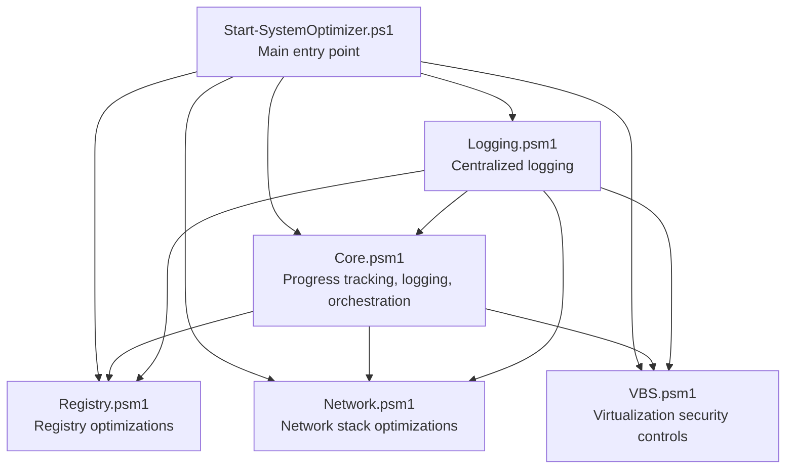
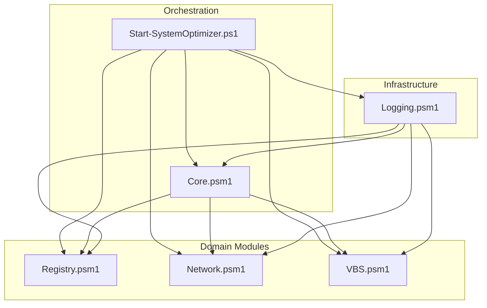
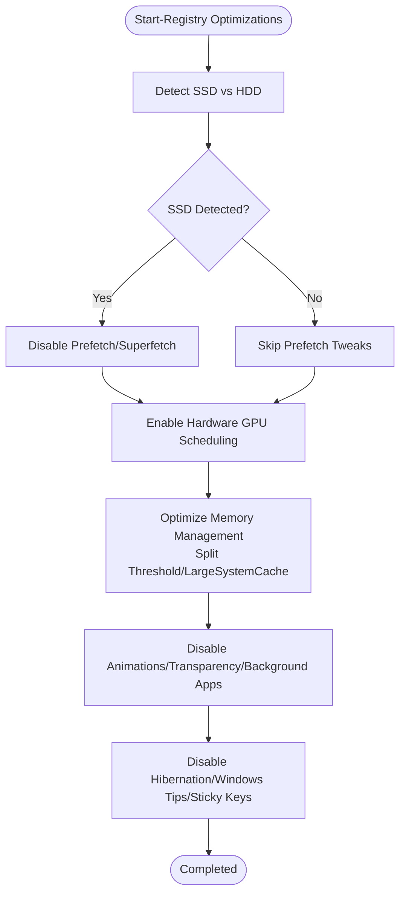
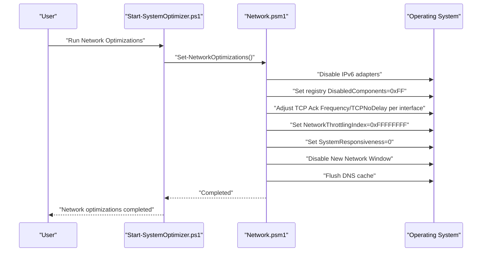
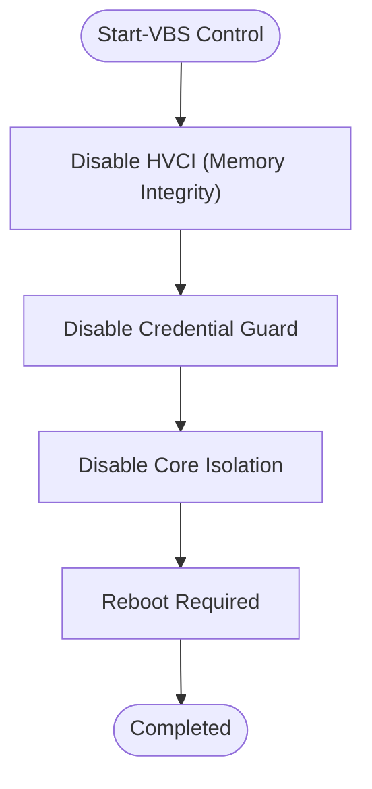
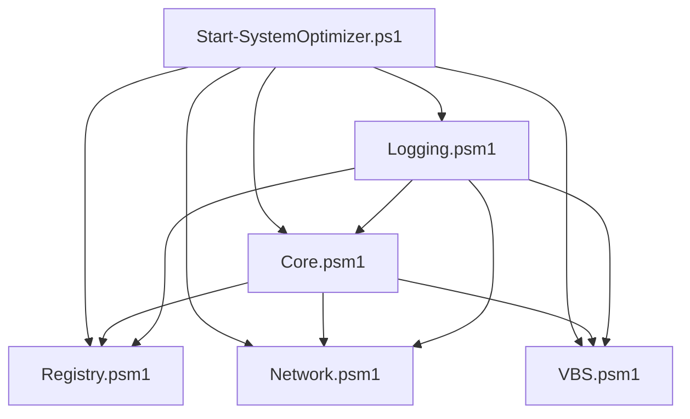

# System Configuration

<cite>
**Referenced Files in This Document**
- [Registry.psm1](file://modules/Registry.psm1)
- [Network.psm1](file://modules/Network.psm1)
- [VBS.psm1](file://modules/VBS.psm1)
- [Core.psm1](file://modules/Core.psm1)
- [Logging.psm1](file://modules/Logging.psm1)
- [Start-SystemOptimizer.ps1](file://Start-SystemOptimizer.ps1)
- [README.md](file://README.md)
- [docs/STRUCTURE.md](file://docs/STRUCTURE.md)
</cite>

## Table of Contents
1. [Introduction](#introduction)
2. [Project Structure](#project-structure)
3. [Core Components](#core-components)
4. [Architecture Overview](#architecture-overview)
5. [Detailed Component Analysis](#detailed-component-analysis)
6. [Dependency Analysis](#dependency-analysis)
7. [Performance Considerations](#performance-considerations)
8. [Troubleshooting Guide](#troubleshooting-guide)
9. [Conclusion](#conclusion)

## Introduction
This document provides comprehensive documentation for the system configuration modules focused on Registry, Network, and VBS optimizations. It explains how these modules enhance performance, improve security posture, and optimize system behavior. The documentation covers:
- Registry module optimization techniques for performance, security, and behavior modifications
- Network module stack optimization including TCP/IP configuration, adapter settings, and performance improvements
- VBS module virtualization security controls, memory integrity management, and gaming performance optimizations
- Function documentation, safety mechanisms, and practical examples for each configuration area

## Project Structure
The System Optimizer is a modular PowerShell toolkit with 27 modules. The Registry, Network, and VBS modules are part of the core optimization suite and integrate with shared infrastructure for logging, progress tracking, and safe execution.

**Diagram sources**
- [Start-SystemOptimizer.ps1](file://Start-SystemOptimizer.ps1#L1-L994)
- [Core.psm1](file://modules/Core.psm1#L1-L869)
- [Logging.psm1](file://modules/Logging.psm1#L1-L285)
- [Registry.psm1](file://modules/Registry.psm1#L1-L213)
- [Network.psm1](file://modules/Network.psm1#L1-L98)
- [VBS.psm1](file://modules/VBS.psm1#L1-L39)

**Section sources**
- [README.md](file://README.md#L1-L88)
- [docs/STRUCTURE.md](file://docs/STRUCTURE.md#L1-L159)

## Core Components
This section introduces the three modules under focus and their roles in system configuration.

- Registry module: Applies targeted registry tweaks to improve performance, reduce overhead, and tailor behavior for SSDs, gaming, and general responsiveness.
- Network module: Optimizes TCP/IP stack, disables IPv6, reduces latency via Nagle’s algorithm adjustments, and improves multimedia throughput.
- VBS module: Controls Virtualization-Based Security (VBS) and Memory Integrity to balance security and gaming performance.

Key integration points:
- Progress tracking and logging are centralized and used by all modules for consistent UX and diagnostics.
- The main entry script orchestrates module execution and provides safety checks and rollback support.

**Section sources**
- [Registry.psm1](file://modules/Registry.psm1#L1-L213)
- [Network.psm1](file://modules/Network.psm1#L1-L98)
- [VBS.psm1](file://modules/VBS.psm1#L1-L39)
- [Core.psm1](file://modules/Core.psm1#L1-L869)
- [Logging.psm1](file://modules/Logging.psm1#L1-L285)
- [Start-SystemOptimizer.ps1](file://Start-SystemOptimizer.ps1#L1-L994)

## Architecture Overview
The modules operate within a layered architecture:
- UI and orchestration: Main script and Core module handle menus, progress, and safe execution.
- Infrastructure: Logging module centralizes output and persistence.
- Domain modules: Registry, Network, and VBS apply configuration changes.

**Diagram sources**
- [Start-SystemOptimizer.ps1](file://Start-SystemOptimizer.ps1#L1-L994)
- [Core.psm1](file://modules/Core.psm1#L1-L869)
- [Logging.psm1](file://modules/Logging.psm1#L1-L285)
- [Registry.psm1](file://modules/Registry.psm1#L1-L213)
- [Network.psm1](file://modules/Network.psm1#L1-L98)
- [VBS.psm1](file://modules/VBS.psm1#L1-L39)

## Detailed Component Analysis

### Registry Module
The Registry module applies 20+ performance and behavior tweaks. It uses a progress-aware approach and includes safety mechanisms for each tweak.

Key capabilities:
- Gaming and UI optimizations: Disables Game Bar/DVR, background apps, transparency effects, animations, startup delay, mouse acceleration, Edge PDF takeover, and Windows tips.
- SSD and filesystem optimizations: Disables NTFS last access timestamp and legacy 8.3 filename creation; detects SSD and disables prefetch/Superfetch accordingly.
- System behavior: Disables hibernation, reduces menu show delay, disables thumbnail cache cleanup, low disk space warnings, and sticky keys prompts.
- Memory and GPU: Enables hardware GPU scheduling (Windows 10 2004+) and optimizes split threshold for systems with 8GB+ RAM.
- Icon cache: Increases icon cache size for improved UI responsiveness.

Safety and UX:
- Progress tracking with Start-ProgressOperation and Update-ProgressItem for each tweak.
- Try/catch blocks around each tweak with Update-ProgressItem reporting success/failure/skip.
- Conditional logic for SSD detection and RAM-based memory tuning.

Practical examples (paths):
- Disable Game Bar/DVR: [Registry.psm1](file://modules/Registry.psm1#L25-L42)
- Disable animations: [Registry.psm1](file://modules/Registry.psm1#L57-L62)
- Disable prefetch on SSD: [Registry.psm1](file://modules/Registry.psm1#L163-L177)
- Enable hardware GPU scheduling: [Registry.psm1](file://modules/Registry.psm1#L145-L150)
- Optimize memory management: [Registry.psm1](file://modules/Registry.psm1#L152-L161)

**Diagram sources**
- [Registry.psm1](file://modules/Registry.psm1#L145-L177)

**Section sources**
- [Registry.psm1](file://modules/Registry.psm1#L1-L213)
- [Core.psm1](file://modules/Core.psm1#L60-L251)
- [Logging.psm1](file://modules/Logging.psm1#L68-L123)

### Network Module
The Network module optimizes TCP/IP stack behavior, adapter settings, and multimedia throughput to reduce latency and improve performance.

Key capabilities:
- IPv6 control: Disables IPv6 at the adapter level and via registry.
- TCP/IP latency reduction: Disables Nagle’s algorithm by adjusting interface-level TCP settings.
- Multimedia throughput: Sets network throttling index to maximum and system responsiveness to zero.
- Network wizard: Disables the new network window prompt.
- DNS hygiene: Flushes DNS cache.

Safety and UX:
- Reset-Network function provides a controlled reset path with user confirmation and multiple reset steps (WinSock, WinHTTP proxy, IP configuration, DNS, and IP renew).

Practical examples (paths):
- Disable IPv6: [Network.psm1](file://modules/Network.psm1#L8-L14)
- Disable Nagle’s Algorithm: [Network.psm1](file://modules/Network.psm1#L16-L23)
- Optimize network throttling: [Network.psm1](file://modules/Network.psm1#L25-L30)
- Reset network configuration: [Network.psm1](file://modules/Network.psm1#L46-L91)

**Diagram sources**
- [Network.psm1](file://modules/Network.psm1#L5-L44)
- [Start-SystemOptimizer.ps1](file://Start-SystemOptimizer.ps1#L1-L994)

**Section sources**
- [Network.psm1](file://modules/Network.psm1#L1-L98)
- [Core.psm1](file://modules/Core.psm1#L60-L251)
- [Logging.psm1](file://modules/Logging.psm1#L68-L123)

### VBS Module
The VBS module manages Virtualization-Based Security (VBS) and Memory Integrity to balance security and gaming performance.

Key capabilities:
- Memory Integrity (HVCI): Disables Device Guard scenarios for Hypervisor Enforced Code Integrity.
- Credential Guard: Disables virtualization-based security and related LSA flags.
- Core Isolation: Disables System Guard scenarios to improve gaming performance.

Safety and UX:
- Emphasizes that disabling VBS requires a reboot.
- Provides clear status messages and logs for each step.

Practical examples (paths):
- Disable Memory Integrity: [VBS.psm1](file://modules/VBS.psm1#L8-L13)
- Disable Credential Guard: [VBS.psm1](file://modules/VBS.psm1#L15-L23)
- Disable Core Isolation: [VBS.psm1](file://modules/VBS.psm1#L25-L30)

**Diagram sources**
- [VBS.psm1](file://modules/VBS.psm1#L5-L33)

**Section sources**
- [VBS.psm1](file://modules/VBS.psm1#L1-L39)
- [Core.psm1](file://modules/Core.psm1#L60-L251)
- [Logging.psm1](file://modules/Logging.psm1#L68-L123)

## Dependency Analysis
The modules depend on shared infrastructure for logging and progress tracking. The main entry script coordinates module execution and provides safety and rollback support.

**Diagram sources**
- [Start-SystemOptimizer.ps1](file://Start-SystemOptimizer.ps1#L1-L994)
- [Core.psm1](file://modules/Core.psm1#L1-L869)
- [Logging.psm1](file://modules/Logging.psm1#L1-L285)
- [Registry.psm1](file://modules/Registry.psm1#L1-L213)
- [Network.psm1](file://modules/Network.psm1#L1-L98)
- [VBS.psm1](file://modules/VBS.psm1#L1-L39)

**Section sources**
- [Start-SystemOptimizer.ps1](file://Start-SystemOptimizer.ps1#L475-L623)
- [Core.psm1](file://modules/Core.psm1#L60-L251)
- [Logging.psm1](file://modules/Logging.psm1#L68-L123)

## Performance Considerations
- Registry optimizations reduce UI overhead and improve responsiveness by disabling animations/transparency and minimizing background processes.
- SSD-specific optimizations (disabling prefetch/Superfetch and NTFS last access) reduce wear and improve IO performance.
- Network optimizations lower latency by disabling Nagle’s algorithm and increasing multimedia throughput.
- VBS control can improve gaming performance by disabling memory integrity and credential guard when necessary.

[No sources needed since this section provides general guidance]

## Troubleshooting Guide
Common issues and remedies:
- Permission errors: Ensure execution as Administrator; the main script enforces this requirement.
- Module load failures: The main script attempts to reload modules or download missing ones from GitHub.
- Logging: All operations are logged to C:\System_Optimizer\Logs\ with timestamps and error details.
- Network reset: Use Reset-Network to revert to defaults if misconfigurations occur.
- Rollback: The Core module integrates with a rollback system to undo changes when available.

Practical examples (paths):
- Logging infrastructure: [Logging.psm1](file://modules/Logging.psm1#L13-L123)
- Module loader and safe caller: [Start-SystemOptimizer.ps1](file://Start-SystemOptimizer.ps1#L380-L623)
- Network reset: [Network.psm1](file://modules/Network.psm1#L46-L91)

**Section sources**
- [Start-SystemOptimizer.ps1](file://Start-SystemOptimizer.ps1#L306-L351)
- [Logging.psm1](file://modules/Logging.psm1#L68-L123)
- [Network.psm1](file://modules/Network.psm1#L46-L91)

## Conclusion
The Registry, Network, and VBS modules provide targeted system configuration improvements:
- Registry: Performance, SSD optimization, and behavior customization
- Network: TCP/IP latency reduction and multimedia throughput
- VBS: Virtualization security controls for gaming performance

They integrate seamlessly with shared logging and progress tracking, ensuring a robust, observable, and safe optimization experience.

[No sources needed since this section summarizes without analyzing specific files]