# Maintenance Module

<cite>
**Referenced Files in This Document**
- [Maintenance.psm1](file://modules/Maintenance.psm1)
- [Core.psm1](file://modules/Core.psm1)
- [Logging.psm1](file://modules/Logging.psm1)
- [Utilities.psm1](file://modules/Utilities.psm1)
- [Start-SystemOptimizer.ps1](file://Start-SystemOptimizer.ps1)
- [WindowsUpdate.psm1](file://modules/WindowsUpdate.psm1)
- [Services.psm1](file://modules/Services.psm1)
</cite>

## Update Summary
**Changes Made**
- Updated function count from 4 to 19 functions with comprehensive new capabilities
- Added detailed documentation for new maintenance functions including disk optimization, system repair utilities, memory diagnostics, drive health monitoring, Windows Update repair, time synchronization repair, search index rebuild, and startup program management
- Enhanced architecture overview to reflect expanded functionality
- Updated dependency analysis to include new external tool integrations
- Added comprehensive coverage of new maintenance operations

## Table of Contents
1. [Introduction](#introduction)
2. [Project Structure](#project-structure)
3. [Core Components](#core-components)
4. [Architecture Overview](#architecture-overview)
5. [Detailed Component Analysis](#detailed-component-analysis)
6. [Dependency Analysis](#dependency-analysis)
7. [Performance Considerations](#performance-considerations)
8. [Troubleshooting Guide](#troubleshooting-guide)
9. [Conclusion](#conclusion)

## Introduction

The Maintenance Module is a comprehensive system maintenance toolkit designed for Windows 10/11 optimization. It provides automated solutions for system cleanup, disk optimization, boot repair, and various maintenance operations that help keep Windows systems running efficiently and reliably. The module integrates seamlessly with the broader System Optimizer ecosystem and offers both automated and interactive maintenance capabilities.

The module focuses on nineteen primary areas: system health maintenance (DISM, SFC), disk cleanup and optimization, boot configuration repair, Windows Update troubleshooting, comprehensive system diagnostics, memory testing, drive optimization, time synchronization repair, search index management, and startup program control. It provides robust error handling, progress tracking, and detailed logging to ensure reliable operation across different Windows environments.

## Project Structure

The Maintenance Module is part of the larger System Optimizer project, which follows a modular architecture pattern. The maintenance functionality is encapsulated within the Maintenance.psm1 module, which depends on shared utility modules for logging, progress tracking, and console management.

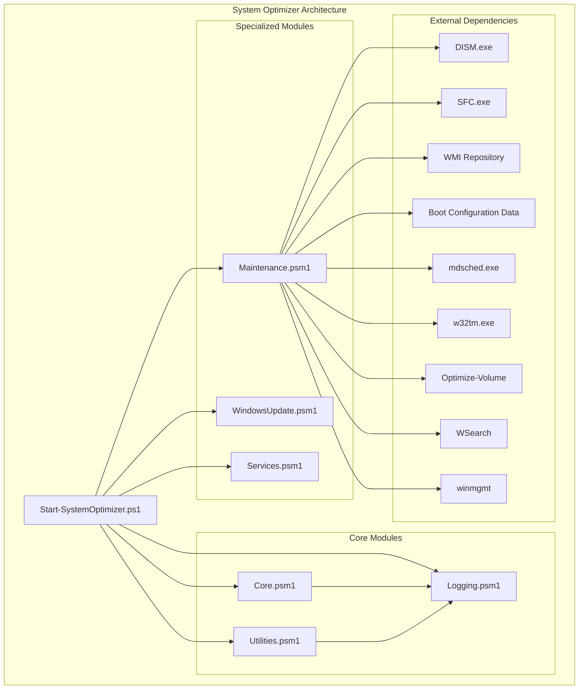

**Diagram sources**
- [Start-SystemOptimizer.ps1](file://Start-SystemOptimizer.ps1#L378-L434)
- [Maintenance.psm1](file://modules/Maintenance.psm1#L1-L51)
- [Core.psm1](file://modules/Core.psm1#L1-L50)

**Section sources**
- [Start-SystemOptimizer.ps1](file://Start-SystemOptimizer.ps1#L378-L434)
- [Maintenance.psm1](file://modules/Maintenance.psm1#L1-L51)

## Core Components

The Maintenance Module consists of nineteen key components that work together to provide comprehensive system maintenance functionality:

### System Maintenance Functions
- **Start-SystemMaintenance**: Automated maintenance routine combining DISM health checks, SFC scans, and temporary file cleanup
- **Start-DiskCleanup**: Interactive disk cleanup with multiple modes (quick, full, aggressive, preview)
- **Reset-GroupPolicy**: Complete Group Policy reset with registry cleanup
- **Reset-WMI**: WMI repository repair with salvage and full reset options

### Advanced Maintenance Tools
- **Start-CheckDisk**: Comprehensive disk checking with chkdsk integration
- **Start-SystemRestore**: System Restore point management
- **Start-BCDRepair**: Boot Configuration Data repair for both UEFI and BIOS systems
- **Start-WindowsUpdateRepair**: Complete Windows Update component troubleshooting

### Diagnostic and Optimization Tools
- **Get-DriveHealth**: SMART data analysis for drive health monitoring
- **Start-DriveOptimization**: Automated drive optimization (defrag/TRIM)
- **Start-TimeSyncRepair**: Windows Time service troubleshooting
- **Start-SearchIndexRebuild**: Windows Search index management
- **Start-StartupProgramManager**: Startup program management

### New Comprehensive Maintenance Functions
- **Start-MemoryDiagnostic**: Memory test scheduling with standard and extended test options
- **Start-DISMRepair**: Enhanced DISM repair tools with multiple scan options (CheckHealth, ScanHealth, RestoreHealth)
- **Get-DiskSpaceInfo**: Drive space information retrieval
- **Show-DiskSpaceReport**: Formatted disk space reporting
- **Get-CleanupTargetSize**: Intelligent file size calculation for cleanup targets
- **Remove-FilesSafely**: Safe file deletion with age checking and error handling

**Section sources**
- [Maintenance.psm1](file://modules/Maintenance.psm1#L5-L51)
- [Maintenance.psm1](file://modules/Maintenance.psm1#L144-L302)
- [Maintenance.psm1](file://modules/Maintenance.psm1#L304-L358)
- [Maintenance.psm1](file://modules/Maintenance.psm1#L970-L1012)
- [Maintenance.psm1](file://modules/Maintenance.psm1#L1143-L1202)
- [Maintenance.psm1](file://modules/Maintenance.psm1#L94-L134)

## Architecture Overview

The Maintenance Module follows a layered architecture pattern with clear separation of concerns:

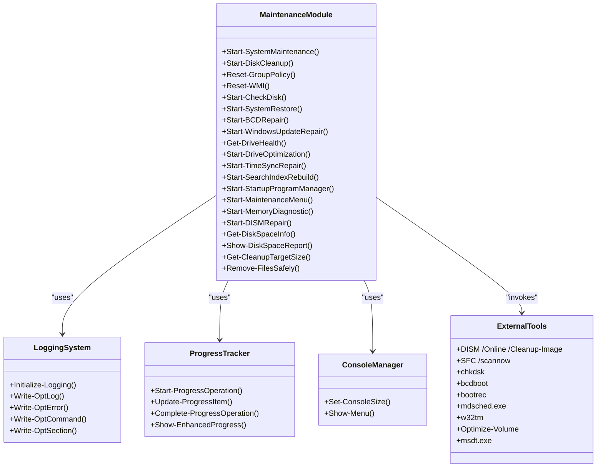

**Diagram sources**
- [Maintenance.psm1](file://modules/Maintenance.psm1#L1-L1761)
- [Logging.psm1](file://modules/Logging.psm1#L1-L285)
- [Core.psm1](file://modules/Core.psm1#L60-L266)

The module architecture emphasizes modularity and reusability through:

- **Interface Abstraction**: All maintenance operations follow consistent function signatures
- **Error Handling**: Centralized error handling with detailed logging
- **Progress Tracking**: Built-in progress monitoring for long-running operations
- **Interactive Menus**: User-friendly interface with multiple operation modes
- **External Tool Integration**: Seamless integration with Windows system tools

**Section sources**
- [Maintenance.psm1](file://modules/Maintenance.psm1#L1638-L1697)
- [Core.psm1](file://modules/Core.psm1#L60-L266)

## Detailed Component Analysis

### System Maintenance Operations

The core system maintenance functionality provides automated solutions for common Windows maintenance issues:

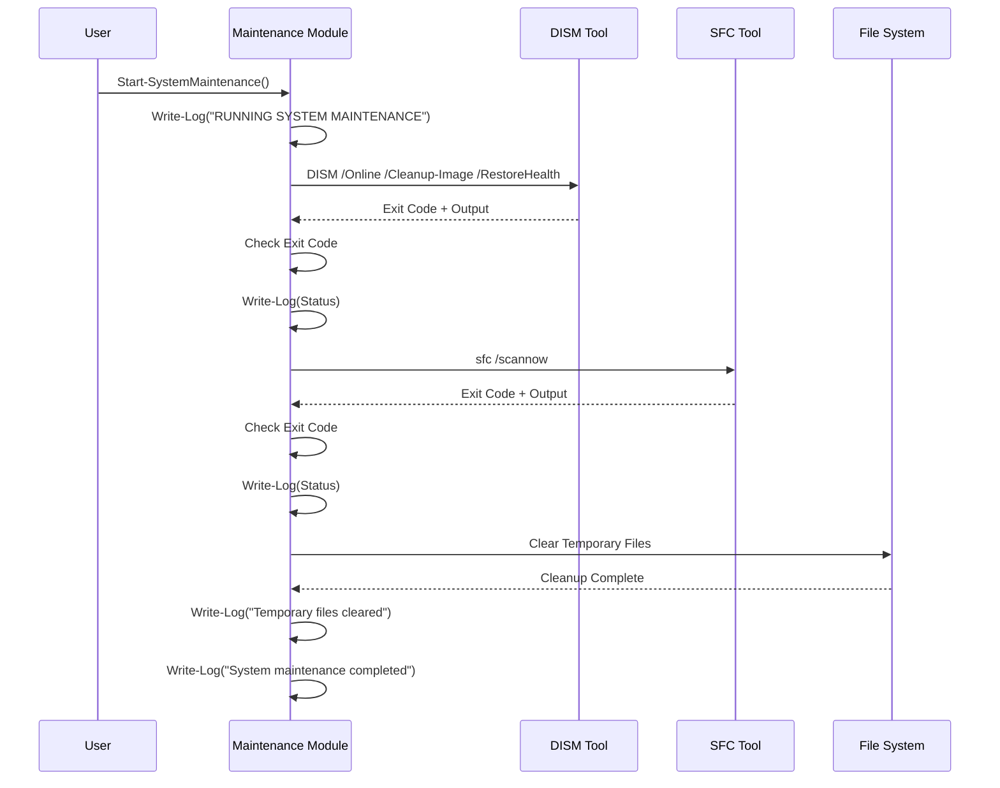

**Diagram sources**
- [Maintenance.psm1](file://modules/Maintenance.psm1#L46-L92)

The system maintenance process includes:

1. **DISM Health Check**: Validates and repairs Windows image corruption
2. **SFC Scan**: Checks system file integrity and repairs damaged files
3. **Temporary File Cleanup**: Removes temporary files, prefetch data, and cache files
4. **Windows Update Cache Clearing**: Resets Windows Update components safely

**Section sources**
- [Maintenance.psm1](file://modules/Maintenance.psm1#L46-L92)

### Disk Cleanup System

The disk cleanup functionality provides multiple cleaning modes with intelligent file targeting:

```mermaid
flowchart TD
Start([Start-DiskCleanup]) --> ShowMenu[Show Cleanup Menu]
ShowMenu --> Choice{User Choice}
Choice --> |Quick Cleanup| QuickMode[Quick Cleanup Mode]
Choice --> |Full Cleanup| FullMode[Full Cleanup Mode]
Choice --> |Aggressive| AggressiveMode[Aggressive Mode]
Choice --> |Preview| PreviewMode[Preview Mode]
Choice --> |GUI| LaunchGUI[Launch Disk Cleanup GUI]
Choice --> |Cancel| Cancel[Cancel Operation]
QuickMode --> DefineTargets[Define Cleanup Targets]
FullMode --> DefineTargets
AggressiveMode --> DefineTargets
PreviewMode --> DefineTargets
DefineTargets --> ProcessTargets[Process Cleanup Targets]
ProcessTargets --> CheckSize{Check Target Size}
CheckSize --> |Size > 0| ProcessFiles[Process Files]
CheckSize --> |Size = 0| NextTarget[Next Target]
ProcessFiles --> CheckPreview{Preview Mode?}
CheckPreview --> |Yes| CalculateSize[Calculate Size]
CheckPreview --> |No| DeleteFiles[Delete Files]
DeleteFiles --> CheckService{Service Needed?}
CheckService --> |Yes| StopService[Stop Service]
CheckService --> |No| UpdateStats[Update Statistics]
StopService --> DeleteFiles
UpdateStats --> NextTarget
CalculateSize --> NextTarget
NextTarget --> MoreTargets{More Targets?}
MoreTargets --> |Yes| ProcessTargets
MoreTargets --> |No| ComponentStore[Component Store Cleanup]
ComponentStore --> EventLogs[Clear Event Logs]
EventLogs --> RecycleBin[Empty Recycle Bin (Aggressive)]
RecycleBin --> ShowResults[Show Results]
EventLogs --> ShowResults
ComponentStore --> ShowResults
LaunchGUI --> End([End])
ShowResults --> End
Cancel --> End
```

**Diagram sources**
- [Maintenance.psm1](file://modules/Maintenance.psm1#L185-L343)

The cleanup system supports four distinct modes:

- **Quick Cleanup**: Basic temporary file removal with 7-day age threshold
- **Full Cleanup**: Includes Windows Update cache, logs, and thumbnail cache
- **Aggressive Cleanup**: Browser caches, crash dumps, and additional temporary files
- **Preview Mode**: Analyzes potential cleanup without making changes

**Section sources**
- [Maintenance.psm1](file://modules/Maintenance.psm1#L185-L343)

### Boot Configuration Data Repair

The BCD repair functionality handles both UEFI and BIOS boot scenarios:

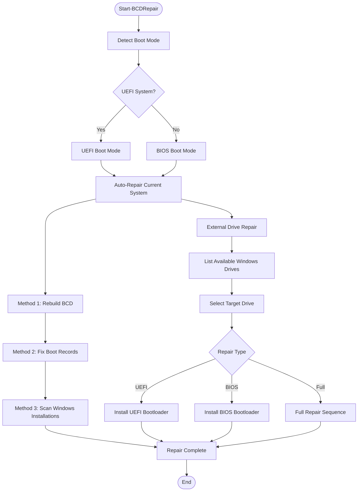

**Diagram sources**
- [Maintenance.psm1](file://modules/Maintenance.psm1#L636-L967)

The BCD repair system provides comprehensive boot recovery capabilities:

- **Automatic Repair**: Handles common boot issues with minimal user intervention
- **External Drive Support**: Repairs offline Windows installations
- **UEFI/BIOS Detection**: Automatically detects and handles appropriate boot modes
- **Bootloader Reinstallation**: Supports both UEFI and BIOS bootloader restoration

**Section sources**
- [Maintenance.psm1](file://modules/Maintenance.psm1#L636-L967)

### Windows Update Repair System

The Windows Update repair functionality addresses common update component failures:

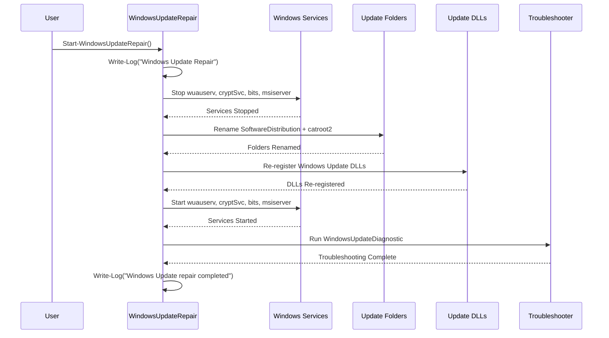

**Diagram sources**
- [Maintenance.psm1](file://modules/Maintenance.psm1#L1074-L1141)

The Windows Update repair process includes:

1. **Service Management**: Properly stops and restarts Windows Update services
2. **Cache Cleanup**: Removes corrupted update cache files
3. **Component Re-registration**: Re-registers essential Windows Update DLLs
4. **Troubleshooting Integration**: Leverages built-in Windows Update troubleshooter

**Section sources**
- [Maintenance.psm1](file://modules/Maintenance.psm1#L1074-L1141)

### Drive Health Monitoring

The drive health monitoring system provides comprehensive hardware diagnostics:

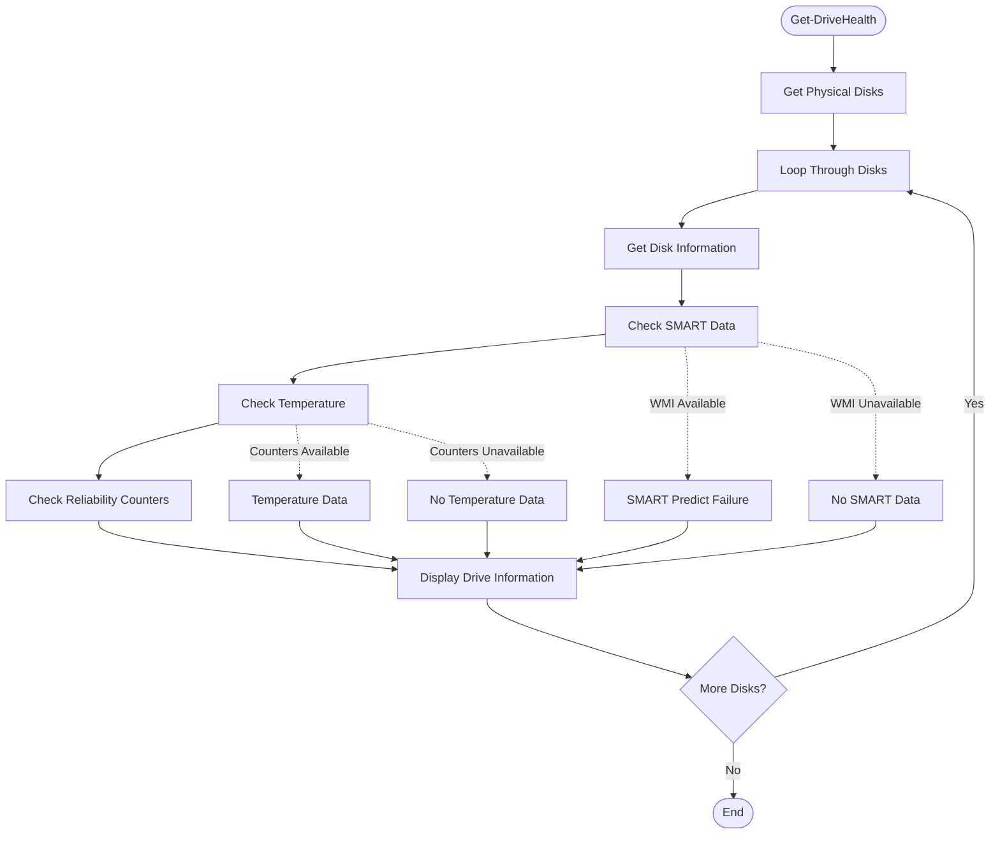

**Diagram sources**
- [Maintenance.psm1](file://modules/Maintenance.psm1#L1014-L1072)

The drive health monitoring provides:

- **SMART Data Analysis**: Predictive failure indicators
- **Temperature Monitoring**: Thermal health assessment
- **Power-On Hours Tracking**: Component longevity metrics
- **Start/Stop Cycle Count**: Mechanical wear indicators

**Section sources**
- [Maintenance.psm1](file://modules/Maintenance.psm1#L1014-L1072)

### Memory Diagnostic System

The memory diagnostic system provides comprehensive RAM testing capabilities:

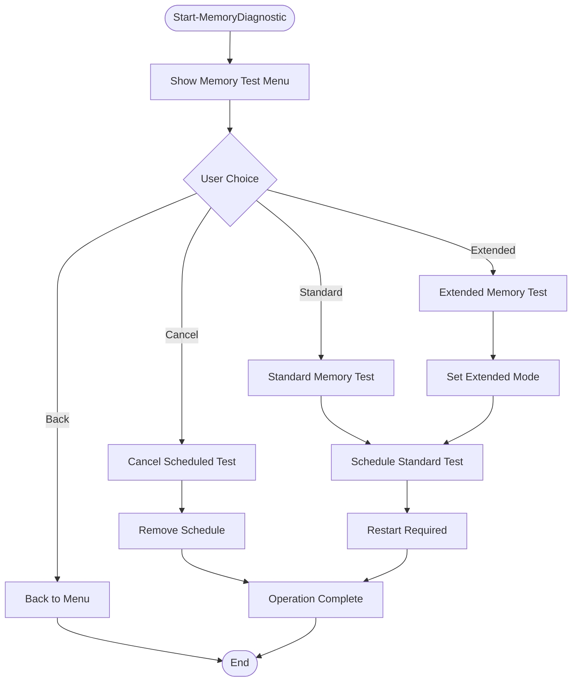

**Diagram sources**
- [Maintenance.psm1](file://modules/Maintenance.psm1#L970-L1012)

The memory diagnostic system provides:

- **Standard Testing**: Quick 15-minute memory test
- **Extended Testing**: Thorough 30-minute memory test with extended mode
- **Test Scheduling**: Automatic scheduling for next reboot
- **Test Cancellation**: Ability to cancel scheduled memory tests

**Section sources**
- [Maintenance.psm1](file://modules/Maintenance.psm1#L970-L1012)

### DISM Repair Tools

The DISM repair system provides comprehensive Windows image repair capabilities:

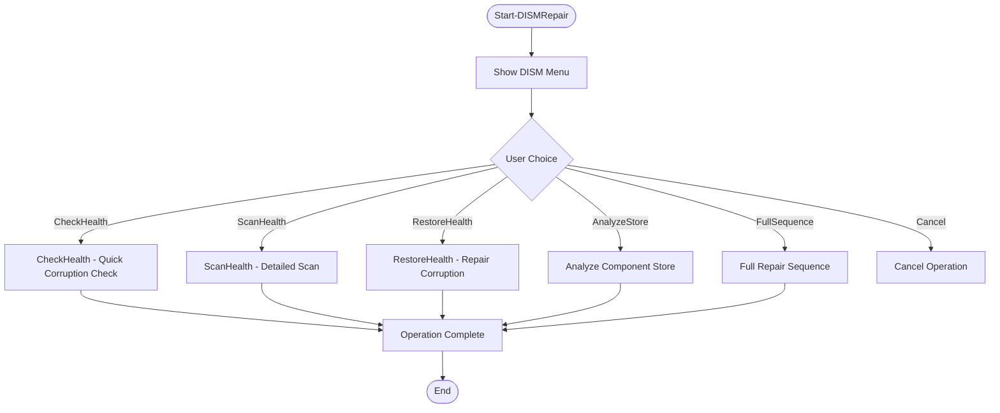

**Diagram sources**
- [Maintenance.psm1](file://modules/Maintenance.psm1#L1143-L1202)

The DISM repair system provides:

- **CheckHealth**: Quick corruption verification
- **ScanHealth**: Detailed corruption scanning (5-10 minutes)
- **RestoreHealth**: Comprehensive corruption repair (15-30 minutes)
- **Component Store Analysis**: Analysis of cleanup potential
- **Full Repair Sequence**: Complete three-step repair process

**Section sources**
- [Maintenance.psm1](file://modules/Maintenance.psm1#L1143-L1202)

### Drive Optimization System

The drive optimization system provides intelligent optimization for both SSDs and HDDs:

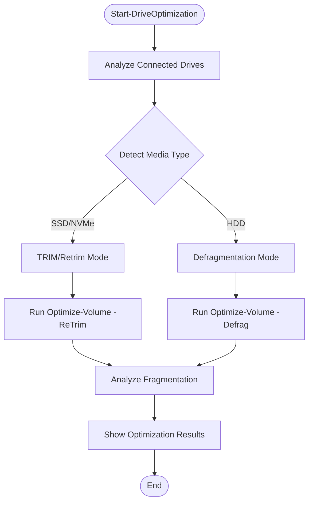

**Diagram sources**
- [Maintenance.psm1](file://modules/Maintenance.psm1#L1204-L1290)

The drive optimization system provides:

- **Automatic Media Detection**: Identifies SSD vs HDD automatically
- **Intelligent Optimization**: TRIM for SSDs, defragmentation for HDDs
- **Fragmentation Analysis**: Post-optimization fragmentation analysis
- **Batch Optimization**: Ability to optimize multiple drives simultaneously

**Section sources**
- [Maintenance.psm1](file://modules/Maintenance.psm1#L1204-L1290)

### Time Synchronization Repair

The time synchronization repair system provides comprehensive Windows Time service management:

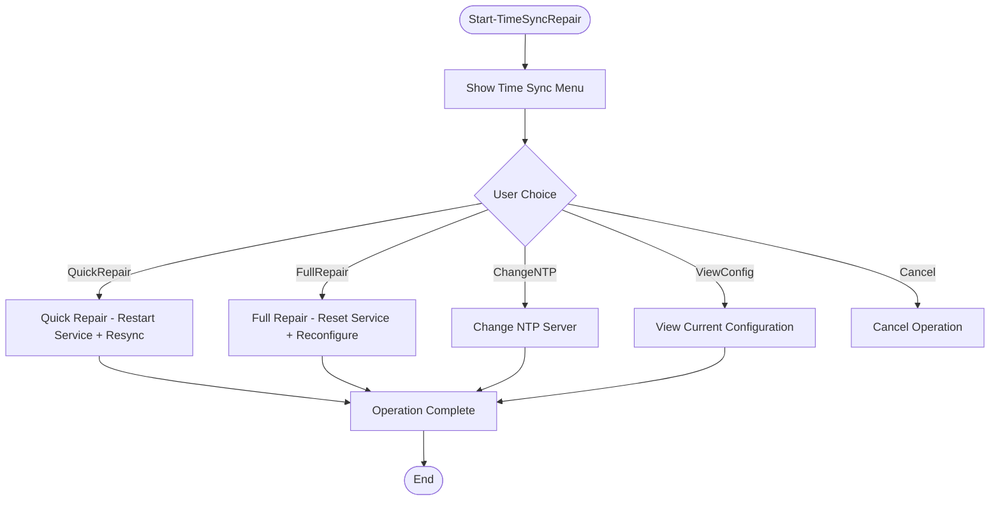

**Diagram sources**
- [Maintenance.psm1](file://modules/Maintenance.psm1#L1292-L1393)

The time synchronization repair system provides:

- **Quick Repair**: Restart service and force resync
- **Full Repair**: Complete service reset with NTP reconfiguration
- **NTP Server Management**: Change and configure NTP servers
- **Configuration Monitoring**: View current time service configuration

**Section sources**
- [Maintenance.psm1](file://modules/Maintenance.psm1#L1292-L1393)

### Search Index Rebuild System

The search index rebuild system provides comprehensive Windows Search management:

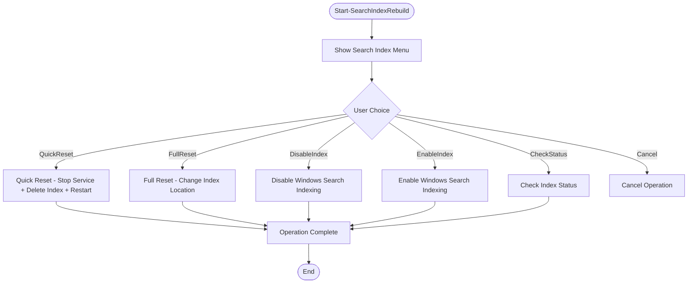

**Diagram sources**
- [Maintenance.psm1](file://modules/Maintenance.psm1#L1395-L1515)

The search index rebuild system provides:

- **Quick Reset**: Fast service restart with index deletion
- **Full Reset**: Complete reset with custom index location
- **Indexing Control**: Enable/disable Windows Search indexing
- **Status Monitoring**: Check current index status and configuration

**Section sources**
- [Maintenance.psm1](file://modules/Maintenance.psm1#L1395-L1515)

### Startup Program Manager

The startup program manager provides comprehensive control over system startup programs:

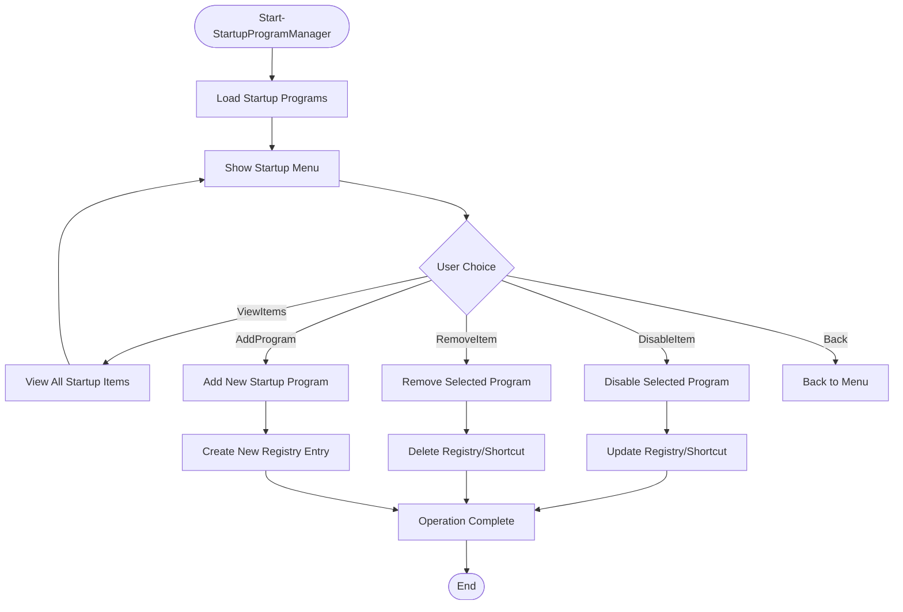

**Diagram sources**
- [Maintenance.psm1](file://modules/Maintenance.psm1#L1517-L1677)

The startup program manager provides:

- **Multi-source Detection**: Registry, startup folders, and Task Manager sources
- **Program Control**: Enable/disable/remove startup programs
- **Registry Management**: Direct registry manipulation for persistence
- **Shortcut Management**: Handle desktop and startup folder shortcuts
- **Add/Remove Functions**: Create new startup entries or remove existing ones

**Section sources**
- [Maintenance.psm1](file://modules/Maintenance.psm1#L1517-L1677)

## Dependency Analysis

The Maintenance Module has well-defined dependencies that support its comprehensive functionality:

```mermaid
graph TB
subgraph "Internal Dependencies"
Maintenance[Maintenance.psm1]
Core[Core.psm1]
Logging[Logging.psm1]
Utilities[Utilities.psm1]
end
subgraph "External Dependencies"
DISM[DISM.exe]
SFC[SFC.exe]
WMI[WMI Repository]
BCD[Boot Configuration Data]
chkdsk[chkdsk.exe]
bootrec[bootrec.exe]
bcdboot[bcdboot.exe]
mdsched[mdsched.exe]
w32tm[w32tm.exe]
OptimizeVolume[Optimize-Volume]
w32tm[w32tm.exe]
wsearch[WSearch]
winmgmt[winmgmt]
msdt[msdt.exe]
end
subgraph "Windows Services"
WUA[wuauserv]
WPM[wpm]
WSearch[WSearch]
W32Time[w32time]
Winmgmt[winmgmt]
end
Maintenance --> Core
Maintenance --> Logging
Maintenance --> Utilities
Maintenance --> DISM
Maintenance --> SFC
Maintenance --> WMI
Maintenance --> BCD
Maintenance --> chkdsk
Maintenance --> bootrec
Maintenance --> bcdboot
Maintenance --> mdsched
Maintenance --> w32tm
Maintenance --> OptimizeVolume
Maintenance --> WUA
Maintenance --> WPM
Maintenance --> WSearch
Maintenance --> W32Time
Maintenance --> Winmgmt
Maintenance --> msdt
```

**Diagram sources**
- [Maintenance.psm1](file://modules/Maintenance.psm1#L1-L1761)
- [Core.psm1](file://modules/Core.psm1#L1-L800)
- [Logging.psm1](file://modules/Logging.psm1#L1-L285)

### Module Integration Points

The Maintenance Module integrates with several core system components:

- **Core Module**: Provides progress tracking, enhanced progress bars, and download functionality
- **Logging Module**: Ensures comprehensive logging with timestamps and structured output
- **Utilities Module**: Leverages console management and menu systems

### External Tool Dependencies

The module relies on several Windows system tools for core functionality:

- **DISM**: System image health checking and repair
- **SFC**: System file integrity verification
- **WMI**: Windows Management Instrumentation for system diagnostics
- **Boot Tools**: Various Windows boot utilities for BCD repair
- **Memory Diagnostic**: Windows Memory Diagnostic scheduler
- **Time Service**: Windows Time service management
- **Search Service**: Windows Search service management
- **Optimization Tools**: Drive optimization utilities

**Section sources**
- [Maintenance.psm1](file://modules/Maintenance.psm1#L1-L1761)
- [Core.psm1](file://modules/Core.psm1#L1-L800)
- [Logging.psm1](file://modules/Logging.psm1#L1-L285)

## Performance Considerations

The Maintenance Module is designed with performance optimization in mind:

### Memory Management
- **Efficient File Processing**: Uses streaming operations for large file collections
- **Progress Tracking**: Minimizes memory overhead through incremental processing
- **Resource Cleanup**: Properly disposes of COM objects and handles

### I/O Optimization
- **Batch Operations**: Groups file operations to minimize system calls
- **Parallel Processing**: Utilizes PowerShell's built-in parallel execution where appropriate
- **Error Handling**: Implements efficient error handling to prevent resource leaks

### Network Considerations
- **Offline Operations**: Most maintenance functions operate without network connectivity
- **Download Integration**: When downloading tools, implements proper timeout and retry mechanisms
- **Bandwidth Management**: Downloads use minimal bandwidth and respect system resources

### System Impact Mitigation
- **Service Coordination**: Properly coordinates with Windows services to minimize conflicts
- **Resource Scheduling**: Avoids peak system usage periods when possible
- **Recovery Mechanisms**: Implements rollback capabilities for critical operations

## Troubleshooting Guide

### Common Issues and Solutions

**DISM/Component Store Issues**
- **Problem**: DISM reports corruption but cannot repair
- **Solution**: Use the full repair sequence (CheckHealth → ScanHealth → RestoreHealth)
- **Prevention**: Regular maintenance prevents severe corruption

**SFC Scan Failures**
- **Problem**: SFC cannot replace protected files
- **Solution**: Run DISM repair before SFC, or use System File Checker with different parameters
- **Prevention**: Address disk errors promptly

**Windows Update Repair Ineffectiveness**
- **Problem**: Windows Update continues to fail after repair
- **Solution**: Use the comprehensive repair sequence including service management and DLL re-registration
- **Prevention**: Regular Windows Update maintenance prevents component degradation

**Boot Configuration Issues**
- **Problem**: System fails to boot after BCD modifications
- **Solution**: Use the automatic repair option which handles most scenarios
- **Prevention**: Create system restore points before major boot changes

**Memory Diagnostic Failures**
- **Problem**: Memory tests fail or hang
- **Solution**: Use standard test first, then extended test if needed, ensure adequate RAM for testing
- **Prevention**: Schedule tests during low-usage periods

**Drive Optimization Issues**
- **Problem**: SSD TRIM or HDD defragmentation fails
- **Solution**: Check drive health, ensure sufficient free space, run as administrator
- **Prevention**: Regular drive optimization prevents fragmentation and maintains performance

### Error Recovery Strategies

The module implements comprehensive error recovery:

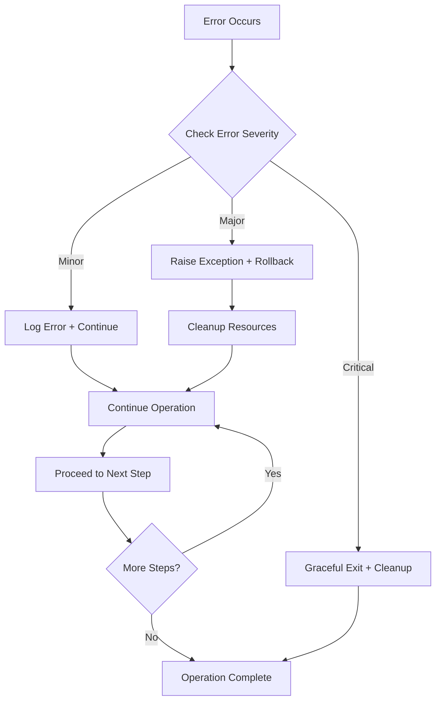

**Diagram sources**
- [Maintenance.psm1](file://modules/Maintenance.psm1#L1-L1761)

### Diagnostic Tools

The module provides extensive diagnostic capabilities:

- **Drive Health Monitoring**: SMART data analysis and thermal monitoring
- **Service Status Verification**: Confirms service states after maintenance
- **File System Integrity Checks**: Validates cleanup operations
- **Registry Health Assessment**: Verifies registry modifications
- **Memory Testing**: Comprehensive RAM diagnostics
- **Search Index Status**: Monitors Windows Search service health

**Section sources**
- [Maintenance.psm1](file://modules/Maintenance.psm1#L1014-L1072)
- [Maintenance.psm1](file://modules/Maintenance.psm1#L1-L1761)

## Conclusion

The Maintenance Module represents a comprehensive solution for Windows system maintenance and optimization. Its modular design, extensive functionality, and robust error handling make it an essential component of the System Optimizer ecosystem.

Key strengths of the module include:

- **Comprehensive Coverage**: Addresses all major system maintenance categories with 19 functions
- **User-Friendly Interface**: Provides both automated and interactive operation modes
- **Robust Error Handling**: Implements comprehensive error recovery and logging
- **Performance Optimization**: Minimizes system impact during maintenance operations
- **Integration Capabilities**: Seamlessly integrates with the broader System Optimizer framework
- **Advanced Diagnostics**: Provides comprehensive system health monitoring and testing
- **Flexible Operation Modes**: Supports both quick fixes and comprehensive maintenance routines

The module's architecture supports future enhancements and maintains backward compatibility with existing System Optimizer installations. Its extensive use of Windows system tools ensures reliability and effectiveness across different Windows environments.

For optimal results, users should regularly perform system maintenance operations and monitor system health through the provided diagnostic tools. The module's comprehensive logging system provides detailed audit trails for troubleshooting and compliance purposes.

The expanded functionality from 4 to 19 functions demonstrates the module's evolution into a complete system maintenance toolkit, covering everything from basic cleanup operations to advanced system diagnostics and optimization procedures.