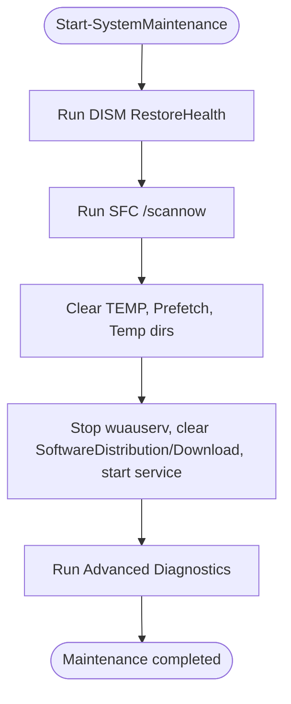

# System Health

<cite>
**Referenced Files in This Document**
- [Maintenance.psm1](file://modules/Maintenance.psm1)
- [Logging.psm1](file://modules/Logging.psm1)
- [Utilities.psm1](file://modules/Utilities.psm1)
- [WindowsUpdate.psm1](file://modules/WindowsUpdate.psm1)
- [Security.psm1](file://modules/Security.psm1)
- [Services.psm1](file://modules/Services.psm1)
- [ROADMAP.md](file://docs/ROADMAP.md)
</cite>

## Update Summary
**Changes Made**
- Added comprehensive advanced diagnostic tools including CheckDisk, SystemRestore, BCDRepair, MemoryDiagnostic, and DriveHealth
- Enhanced DISM repair capabilities with multiple scan options and component store analysis
- Integrated Windows Update repair with comprehensive DLL re-registration and component reset
- Added drive optimization tools for SSD TRIM and HDD defragmentation
- Implemented time synchronization repair and Windows Search index rebuilding
- Expanded startup program management with registry and shortcut handling
- Enhanced troubleshooting capabilities with SMART drive health monitoring

## Table of Contents
1. [Introduction](#introduction)
2. [Project Structure](#project-structure)
3. [Core Components](#core-components)
4. [Architecture Overview](#architecture-overview)
5. [Detailed Component Analysis](#detailed-component-analysis)
6. [Advanced Diagnostic Tools](#advanced-diagnostic-tools)
7. [Enhanced Repair Capabilities](#enhanced-repair-capabilities)
8. [Dependency Analysis](#dependency-analysis)
9. [Performance Considerations](#performance-considerations)
10. [Troubleshooting Guide](#troubleshooting-guide)
11. [Conclusion](#conclusion)
12. [Appendices](#appendices)

## Introduction
This document describes the Maintenance module that powers system health operations in the System Optimizer project. The module has been significantly expanded to include advanced diagnostic tools and comprehensive repair functions that complement the existing DISM/SFC operations, disk cleanup, and Windows Update repair capabilities. It covers system file validation, component repair, disk cleanup operations, hardware diagnostics, and automated maintenance workflows with enhanced troubleshooting capabilities.

## Project Structure
The Maintenance module is part of a modular PowerShell-based optimization toolkit. It integrates with shared logging, utilities, Windows Update, security, and services modules to deliver a comprehensive maintenance experience with advanced diagnostic capabilities.

**Diagram sources**
- [Maintenance.psm1](file://modules/Maintenance.psm1#L1-L1658)
- [Logging.psm1](file://modules/Logging.psm1#L1-L285)
- [Utilities.psm1](file://modules/Utilities.psm1#L1-L395)
- [WindowsUpdate.psm1](file://modules/WindowsUpdate.psm1#L1-L382)
- [Security.psm1](file://modules/Security.psm1#L1-L495)
- [Services.psm1](file://modules/Services.psm1#L1-L712)

**Section sources**
- [Maintenance.psm1](file://modules/Maintenance.psm1#L1-L1658)
- [Logging.psm1](file://modules/Logging.psm1#L1-L285)

## Core Components
- **System Maintenance Workflow**: Orchestrates DISM and SFC scans, clears temp files, and cleans Windows Update cache.
- **Enhanced Disk Cleanup Engine**: Provides flexible, safe, and preview-capable cleanup with configurable modes (quick, full, super aggressive).
- **Advanced Diagnostic Tools**: Comprehensive hardware and system diagnostics including SMART drive health, memory testing, and boot configuration analysis.
- **Expanded Repair Capabilities**: Enhanced DISM repair with multiple scan options, Windows Update comprehensive repair, and system restoration tools.
- **Health Monitoring Helpers**: Disk space reporting and verification of optimization status with expanded metrics.
- **System Optimization Tools**: Drive optimization for SSD TRIM and HDD defragmentation, time synchronization repair, and Windows Search index management.

**Section sources**
- [Maintenance.psm1](file://modules/Maintenance.psm1#L5-L51)
- [Maintenance.psm1](file://modules/Maintenance.psm1#L144-L302)
- [Maintenance.psm1](file://modules/Maintenance.psm1#L451-L535)
- [Maintenance.psm1](file://modules/Maintenance.psm1#L537-L593)
- [Maintenance.psm1](file://modules/Maintenance.psm1#L595-L927)
- [Maintenance.psm1](file://modules/Maintenance.psm1#L929-L1031)
- [Maintenance.psm1](file://modules/Maintenance.psm1#L1033-L1161)
- [Maintenance.psm1](file://modules/Maintenance.psm1#L1163-L1249)
- [Maintenance.psm1](file://modules/Maintenance.psm1#L1251-L1352)
- [Maintenance.psm1](file://modules/Maintenance.psm1#L1354-L1474)
- [Maintenance.psm1](file://modules/Maintenance.psm1#L1476-L1636)

## Architecture Overview
The Maintenance module coordinates system health operations by invoking system utilities and PowerShell cmdlets, logging outcomes, and providing interactive cleanup workflows with advanced diagnostic capabilities.

**Diagram sources**
- [Maintenance.psm1](file://modules/Maintenance.psm1#L5-L51)
- [Logging.psm1](file://modules/Logging.psm1#L68-L123)

## Detailed Component Analysis

### System Maintenance Workflow
- **Purpose**: Perform routine system health checks and cleanup with enhanced diagnostic capabilities.
- **Operations**:
  - DISM online image health repair with comprehensive error handling.
  - SFC system file check with detailed logging.
  - Temporary file cleanup (temp, prefetch).
  - Windows Update cache refresh with service management.
  - Integration with advanced diagnostic tools for comprehensive system analysis.

**Diagram sources**
- [Maintenance.psm1](file://modules/Maintenance.psm1#L5-L51)

**Section sources**
- [Maintenance.psm1](file://modules/Maintenance.psm1#L5-L51)

### Disk Cleanup Engine
- **Purpose**: Provide flexible, safe, and preview-capable disk cleanup with enhanced browser cache management.
- **Modes**:
  - Quick: temp files older than 7 days.
  - Full: includes Windows Update cache, logs, thumbnail cache.
  - Super Aggressive: browser caches, crash dumps, WER reports.
  - Preview: estimate cleanup size without deleting.
- **Enhanced Targets**:
  - Windows Temp, User Temp, Local AppData Temp, Prefetch.
  - Windows Update Cache (with service stop/start).
  - Thumbnail cache, Windows Logs, CBS Logs, DISM Logs.
  - Browser caches (Chrome, Edge, Firefox), IE/Edge temp, Crash Dumps, WER Reports.
  - Component Store cleanup and event log clearing in Full/Aggressive modes.
  - Recycle Bin emptying in Super Aggressive mode.

**Diagram sources**
- [Maintenance.psm1](file://modules/Maintenance.psm1#L144-L302)

**Section sources**
- [Maintenance.psm1](file://modules/Maintenance.psm1#L144-L302)

### Health Monitoring and Reporting
- **Disk space reporting**: Enumerates logical disks, computes free/used space and percentages, and color-codes drive health.
- **Optimization status verification**: Reports memory usage, running services, startup items, power plan, telemetry, Game Bar, VBS/Memory Integrity, Defender real-time, IPv6, background apps, and disabled critical services.
- **Enhanced metrics collection**: Includes SMART drive health monitoring, memory diagnostics, and system component status.

**Diagram sources**
- [Maintenance.psm1](file://modules/Maintenance.psm1#L53-L93)
- [Utilities.psm1](file://modules/Utilities.psm1#L44-L119)
- [Maintenance.psm1](file://modules/Maintenance.psm1#L973-L1031)
- [Maintenance.psm1](file://modules/Maintenance.psm1#L929-L1031)

**Section sources**
- [Maintenance.psm1](file://modules/Maintenance.psm1#L53-L93)
- [Utilities.psm1](file://modules/Utilities.psm1#L44-L119)

## Advanced Diagnostic Tools

### CheckDisk (CHKDSK) Operations
- **Purpose**: Comprehensive disk error checking and repair with multiple scan levels.
- **Capabilities**:
  - Read-only check for immediate error detection.
  - Check and fix with automatic scheduling when drive is in use.
  - Thorough check with bad sector scanning (slow but comprehensive).
  - Drive selection interface with capacity and label information.
  - Warning prompts for time-intensive operations.

**Diagram sources**
- [Maintenance.psm1](file://modules/Maintenance.psm1#L451-L535)

**Section sources**
- [Maintenance.psm1](file://modules/Maintenance.psm1#L451-L535)

### System Restore Management
- **Purpose**: Manage Windows System Restore points with comprehensive operations.
- **Capabilities**:
  - Create new restore points with custom descriptions.
  - List available restore points with timestamps and descriptions.
  - Clean old restore points to free disk space.
  - Integration with VSS (Volume Shadow Copy) service.
  - Error handling for restore point operations.

**Diagram sources**
- [Maintenance.psm1](file://modules/Maintenance.psm1#L537-L593)

**Section sources**
- [Maintenance.psm1](file://modules/Maintenance.psm1#L537-L593)

### BCD and Boot Configuration Repair
- **Purpose**: Comprehensive Boot Configuration Data repair for both UEFI and BIOS systems.
- **Capabilities**:
  - Auto-repair current system BCD with multiple recovery methods.
  - Repair external/offline Windows drives with Windows detection.
  - Rebuild BCD from scratch with backup and recovery.
  - Fix boot records (MBR for BIOS, EFI for UEFI).
  - Reinstall UEFI bootloader files with partition detection.
  - Scan and add Windows installations to BCD.
  - Set active partition (BIOS only) and assign drive letters.

**Diagram sources**
- [Maintenance.psm1](file://modules/Maintenance.psm1#L595-L927)

**Section sources**
- [Maintenance.psm1](file://modules/Maintenance.psm1#L595-L927)

### Memory Diagnostic Testing
- **Purpose**: Schedule Windows Memory Diagnostic tests for RAM health verification.
- **Capabilities**:
  - Standard memory test (recommended for most users).
  - Extended memory test (thorough but time-consuming).
  - Test cancellation with registry cleanup.
  - Integration with Windows Memory Diagnostic Scheduler (mdsched.exe).
  - Test scheduling for next reboot with automatic execution.

**Diagram sources**
- [Maintenance.psm1](file://modules/Maintenance.psm1#L929-L971)

**Section sources**
- [Maintenance.psm1](file://modules/Maintenance.psm1#L929-L971)

### Drive Health Monitoring (SMART)
- **Purpose**: Comprehensive drive health analysis using SMART data and reliability counters.
- **Capabilities**:
  - Physical disk enumeration with model and capacity information.
  - SMART predictive failure detection via WMI.
  - Temperature monitoring with color-coded alerts.
  - Power-on hours tracking and start/stop cycle counting.
  - Media type detection (SSD, HDD, NVMe) for appropriate optimization.
  - Error handling for systems without SMART support.

**Diagram sources**
- [Maintenance.psm1](file://modules/Maintenance.psm1#L973-L1031)

**Section sources**
- [Maintenance.psm1](file://modules/Maintenance.psm1#L973-L1031)

## Enhanced Repair Capabilities

### Comprehensive Windows Update Repair
- **Purpose**: Perform thorough Windows Update component repair with extensive service management.
- **Enhanced Operations**:
  - Multiple service stop with comprehensive service list (wuauserv, cryptSvc, bits, msiserver).
  - Safe renaming of update folders (SoftwareDistribution.old, catroot2.old).
  - Extensive DLL re-registration covering 30+ Windows Update components.
  - WinSock and HTTP proxy reset for network connectivity.
  - Windows Update troubleshooter integration.
  - Automatic service restart and system restart recommendation.

**Diagram sources**
- [Maintenance.psm1](file://modules/Maintenance.psm1#L1033-L1100)

**Section sources**
- [Maintenance.psm1](file://modules/Maintenance.psm1#L1033-L1100)

### Enhanced DISM Repair Tools
- **Purpose**: Provide comprehensive DISM repair with multiple scan levels and component analysis.
- **Enhanced Operations**:
  - CheckHealth for quick corruption verification.
  - ScanHealth for detailed corruption analysis (5-10 minutes).
  - RestoreHealth for comprehensive repair (15-30 minutes).
  - AnalyzeComponentStore for cleanup potential assessment.
  - Full repair sequence combining all operations.
  - Detailed progress reporting and completion notifications.

**Diagram sources**
- [Maintenance.psm1](file://modules/Maintenance.psm1#L1102-L1161)

**Section sources**
- [Maintenance.psm1](file://modules/Maintenance.psm1#L1102-L1161)

### Drive Optimization Tools
- **Purpose**: Optimize storage devices based on media type with automatic detection.
- **Capabilities**:
  - Automatic media type detection (SSD, HDD, NVMe).
  - TRIM optimization for SSDs with Retrim support.
  - Defragmentation for HDDs with progress tracking.
  - Fragmentation analysis and reporting.
  - Multi-drive optimization with selection interface.
  - Error handling and detailed logging.

**Diagram sources**
- [Maintenance.psm1](file://modules/Maintenance.psm1#L1163-L1249)

**Section sources**
- [Maintenance.psm1](file://modules/Maintenance.psm1#L1163-L1249)

### Time Synchronization Repair
- **Purpose**: Repair Windows Time service and synchronize with NTP servers.
- **Capabilities**:
  - Quick repair with service restart and manual sync.
  - Full repair with service re-registration and NTP configuration.
  - NTP server selection with common options (time.windows.com, pool.ntp.org).
  - Time configuration viewing and status reporting.
  - Special poll interval configuration for improved accuracy.

**Diagram sources**
- [Maintenance.psm1](file://modules/Maintenance.psm1#L1251-L1352)

**Section sources**
- [Maintenance.psm1](file://modules/Maintenance.psm1#L1251-L1352)

### Windows Search Index Rebuild
- **Purpose**: Rebuild Windows Search index database with comprehensive management options.
- **Capabilities**:
  - Quick reset with service management and index file removal.
  - Full reset with index location change for SSD optimization.
  - Windows Search service enable/disable management.
  - Index status monitoring and performance metrics.
  - Indexed locations management and reporting.

**Diagram sources**
- [Maintenance.psm1](file://modules/Maintenance.psm1#L1354-L1474)

**Section sources**
- [Maintenance.psm1](file://modules/Maintenance.psm1#L1354-L1474)

### Startup Program Management
- **Purpose**: Comprehensive startup program management with registry and shortcut handling.
- **Capabilities**:
  - Multi-source startup item discovery (registry, startup folders, Task Manager).
  - Detailed startup item listing with location and type information.
  - Program disable with registry value renaming and shortcut disabling.
  - Program removal with confirmation and file system cleanup.
  - New program addition with scope selection (machine/user).
  - Comprehensive error handling and logging.

**Diagram sources**
- [Maintenance.psm1](file://modules/Maintenance.psm1#L1476-L1636)

**Section sources**
- [Maintenance.psm1](file://modules/Maintenance.psm1#L1476-L1636)

## Dependency Analysis
- **Maintenance module** depends on:
  - **Logging module** for consistent messaging and structured logs.
  - **Utilities module** for disk space reporting and status verification.
  - **Windows Update module** for cache management and repair workflows.
  - **Security module** for Defender controls and related exceptions.
  - **Services module** for service state management and related optimizations.
  - **Enhanced diagnostic tools** integrate with system utilities (chkdsk, bcdboot, wmic, etc.).

**Diagram sources**
- [Maintenance.psm1](file://modules/Maintenance.psm1#L1-L1658)
- [Logging.psm1](file://modules/Logging.psm1#L1-L285)
- [Utilities.psm1](file://modules/Utilities.psm1#L1-L395)
- [WindowsUpdate.psm1](file://modules/WindowsUpdate.psm1#L1-L382)
- [Security.psm1](file://modules/Security.psm1#L1-L495)
- [Services.psm1](file://modules/Services.psm1#L1-L712)

**Section sources**
- [Maintenance.psm1](file://modules/Maintenance.psm1#L1-L1658)
- [Logging.psm1](file://modules/Logging.psm1#L1-L285)
- [Utilities.psm1](file://modules/Utilities.psm1#L1-L395)
- [WindowsUpdate.psm1](file://modules/WindowsUpdate.psm1#L1-L382)
- [Security.psm1](file://modules/Security.psm1#L1-L495)
- [Services.psm1](file://modules/Services.psm1#L1-L712)

## Performance Considerations
- **DISM and SFC operations** can be lengthy; the module captures exit codes and outputs for diagnostics.
- **Disk cleanup operations** leverage recursive deletion and age-based filtering; preview mode avoids destructive actions.
- **Windows Update cache operations** temporarily stop services to prevent file locks.
- **WMI reset and Windows Update repair** involve extensive service control and DLL re-registration; these are intensive operations requiring elevated privileges.
- **Advanced diagnostic tools** may require elevated privileges and can be time-intensive (memory tests, disk scans, defragmentation).
- **SMART drive monitoring** may not be available on all systems and includes error handling for unsupported hardware.
- **System restore operations** can be resource-intensive and may require significant disk space for restore point creation.
- **Drive optimization operations** vary by media type; SSD TRIM is typically fast while HDD defragmentation can take considerable time.
- **Time synchronization repair** operations are generally quick but may require service restarts.
- **Windows Search index rebuild** can be time-consuming depending on system size and requires service downtime.

## Troubleshooting Guide
### Common Issues and Resolutions
- **DISM warnings or failures**:
  - Use Windows Update repair quick/full workflows to reset components and caches.
  - Ensure sufficient disk space and run as administrator.
  - Try enhanced DISM repair tools with multiple scan levels.
- **SFC false positives**:
  - Review SFC output logs and re-run after DISM repair.
  - Consider running SFC with system file replacement.
- **Disk cleanup not freeing expected space**:
  - Use preview mode to estimate reclaimed space.
  - Confirm service stops for protected locations (e.g., Windows Update cache).
  - Check for file locks and retry operations.
- **Group Policy reset not taking effect**:
  - Verify gpupdate executed and reboot if necessary.
  - Check for conflicting policies in different scopes.
- **WMI repository corruption**:
  - Attempt salvage; fall back to full reset with re-registration of providers and DLLs.
  - Ensure sufficient disk space for WMI repository rebuild.
- **Windows Update stuck**:
  - Use comprehensive repair workflows to stop services, clear caches, re-register DLLs, reset WinSock, and force detection.
  - Consider component cleanup and system file verification.
- **Boot configuration issues**:
  - Use BCD repair tools for automatic repair, external drive repair, or complete rebuild.
  - Check firmware type (UEFI/BIOS) for appropriate repair methods.
- **Memory diagnostic failures**:
  - Schedule standard or extended tests for thorough analysis.
  - Check for hardware compatibility and system requirements.
- **Drive health concerns**:
  - Use SMART monitoring to detect potential drive failures.
  - Implement preventive measures based on temperature and reliability data.
- **Startup program conflicts**:
  - Use startup manager to identify and resolve conflicts.
  - Disable unnecessary startup items to improve boot performance.
- **Drive optimization issues**:
  - Ensure proper media type detection (SSD vs HDD).
  - Check for sufficient free space before defragmentation.
  - Verify TRIM support for SSD optimization.
- **Time synchronization problems**:
  - Use quick repair for basic service restart and sync.
  - Try full repair with NTP reconfiguration for persistent issues.
  - Verify firewall settings allow NTP traffic.
- **Windows Search index problems**:
  - Use quick reset for simple service restart and index cleanup.
  - Consider moving index location to separate drive for SSD users.
  - Check indexed locations and permissions for access issues.

**Section sources**
- [Maintenance.psm1](file://modules/Maintenance.psm1#L5-L51)
- [Maintenance.psm1](file://modules/Maintenance.psm1#L144-L302)
- [Maintenance.psm1](file://modules/Maintenance.psm1#L304-L449)
- [Maintenance.psm1](file://modules/Maintenance.psm1#L451-L535)
- [Maintenance.psm1](file://modules/Maintenance.psm1#L537-L593)
- [Maintenance.psm1](file://modules/Maintenance.psm1#L595-L927)
- [Maintenance.psm1](file://modules/Maintenance.psm1#L929-L1031)
- [Maintenance.psm1](file://modules/Maintenance.psm1#L1033-L1100)
- [Maintenance.psm1](file://modules/Maintenance.psm1#L1102-L1161)
- [Maintenance.psm1](file://modules/Maintenance.psm1#L1163-L1249)
- [Maintenance.psm1](file://modules/Maintenance.psm1#L1251-L1352)
- [Maintenance.psm1](file://modules/Maintenance.psm1#L1354-L1474)
- [Maintenance.psm1](file://modules/Maintenance.psm1#L1476-L1636)
- [WindowsUpdate.psm1](file://modules/WindowsUpdate.psm1#L247-L371)

## Conclusion
The Maintenance module provides a comprehensive, integrated approach to system health operations with significantly expanded diagnostic and repair capabilities. The enhanced module now includes advanced diagnostic tools for hardware and system analysis, comprehensive repair workflows for various system components, and sophisticated optimization tools. The module's logging, preview capabilities, and safety checks ensure reliable maintenance workflows with minimal risk while providing extensive troubleshooting capabilities for complex system issues.

## Appendices

### Function Reference Index
- **Start-SystemMaintenance**: Orchestrates DISM, SFC, temp cleanup, and Windows Update cache refresh.
- **Start-DiskCleanup**: Interactive cleanup with modes and preview.
- **Get-DiskSpaceInfo**: Retrieves per-drive disk usage statistics.
- **Show-DiskSpaceReport**: Displays formatted disk space report.
- **Get-CleanupTargetSize**: Computes size of files in a target path.
- **Remove-FilesSafely**: Safely removes files with age checks and error handling.
- **Reset-GroupPolicy**: Resets local Group Policy settings.
- **Reset-WMI**: Resets WMI repository with quick and full modes.
- **Start-CheckDisk**: Comprehensive disk error checking and repair.
- **Start-SystemRestore**: Manages Windows System Restore points.
- **Start-BCDRepair**: Comprehensive Boot Configuration Data repair.
- **Start-MemoryDiagnostic**: Schedules Windows Memory Diagnostic tests.
- **Get-DriveHealth**: SMART drive health monitoring and analysis.
- **Start-WindowsUpdateRepair**: Comprehensive Windows Update component repair.
- **Start-DISMRepair**: Enhanced DISM repair with multiple scan options.
- **Start-DriveOptimization**: Drive optimization for SSD TRIM and HDD defrag.
- **Start-TimeSyncRepair**: Windows Time service repair and NTP configuration.
- **Start-SearchIndexRebuild**: Windows Search index management and rebuild.
- **Start-StartupProgramManager**: Comprehensive startup program management.

**Section sources**
- [Maintenance.psm1](file://modules/Maintenance.psm1#L5-L51)
- [Maintenance.psm1](file://modules/Maintenance.psm1#L76-L93)
- [Maintenance.psm1](file://modules/Maintenance.psm1#L95-L142)
- [Maintenance.psm1](file://modules/Maintenance.psm1#L144-L302)
- [Maintenance.psm1](file://modules/Maintenance.psm1#L304-L449)
- [Maintenance.psm1](file://modules/Maintenance.psm1#L451-L535)
- [Maintenance.psm1](file://modules/Maintenance.psm1#L537-L593)
- [Maintenance.psm1](file://modules/Maintenance.psm1#L595-L927)
- [Maintenance.psm1](file://modules/Maintenance.psm1#L929-L1031)
- [Maintenance.psm1](file://modules/Maintenance.psm1#L1033-L1100)
- [Maintenance.psm1](file://modules/Maintenance.psm1#L1102-L1161)
- [Maintenance.psm1](file://modules/Maintenance.psm1#L1163-L1249)
- [Maintenance.psm1](file://modules/Maintenance.psm1#L1251-L1352)
- [Maintenance.psm1](file://modules/Maintenance.psm1#L1354-L1474)
- [Maintenance.psm1](file://modules/Maintenance.psm1#L1476-L1636)

### System Health Monitoring Procedures
- Use disk space reporting to proactively monitor drive health.
- Use optimization status verification to assess system configuration and potential risks.
- Integrate logging to capture maintenance outcomes and troubleshoot issues.
- Utilize SMART drive health monitoring for predictive failure detection.
- Schedule regular memory diagnostic tests for RAM health verification.
- Monitor system restore points for adequate protection coverage.
- Regularly check drive optimization status and fragmentation levels.
- Monitor time synchronization accuracy and NTP server configuration.
- Track Windows Search index health and rebuild progress.
- Audit startup programs for unnecessary system load.

**Section sources**
- [Maintenance.psm1](file://modules/Maintenance.psm1#L53-L93)
- [Utilities.psm1](file://modules/Utilities.psm1#L44-L119)
- [Logging.psm1](file://modules/Logging.psm1#L68-L123)
- [Maintenance.psm1](file://modules/Maintenance.psm1#L973-L1031)
- [Maintenance.psm1](file://modules/Maintenance.psm1#L929-L971)
- [Maintenance.psm1](file://modules/Maintenance.psm1#L537-L593)

### Automated Maintenance Workflows
- **Scheduled maintenance**: Combine Start-SystemMaintenance with periodic disk cleanup.
- **Pre-update maintenance**: Run DISM/SFC and cleanup before applying updates.
- **Post-update maintenance**: Repair Windows Update components if needed.
- **Advanced diagnostics**: Regular SMART monitoring, memory testing, and drive optimization.
- **Boot health maintenance**: Periodic BCD repair and boot record verification.
- **Search optimization**: Regular Windows Search index maintenance and optimization.
- **Performance maintenance**: Regular drive optimization and startup program audits.
- **Time synchronization**: Periodic time service repair and NTP configuration verification.

**Section sources**
- [Maintenance.psm1](file://modules/Maintenance.psm1#L5-L51)
- [Maintenance.psm1](file://modules/Maintenance.psm1#L451-L535)
- [Maintenance.psm1](file://modules/Maintenance.psm1#L595-L927)
- [Maintenance.psm1](file://modules/Maintenance.psm1#L929-L1031)
- [Maintenance.psm1](file://modules/Maintenance.psm1#L1163-L1249)
- [Maintenance.psm1](file://modules/Maintenance.psm1#L1354-L1474)
- [Maintenance.psm1](file://modules/Maintenance.psm1#L1251-L1352)
- [WindowsUpdate.psm1](file://modules/WindowsUpdate.psm1#L247-L371)

### Safety Considerations
- Always run maintenance operations with administrative privileges.
- Use preview mode for disk cleanup to estimate impact.
- Back up critical data before performing WMI or Windows Update repairs.
- Avoid disabling critical services unless necessary; prefer selective disabling.
- Schedule memory diagnostic tests for next reboot to avoid system interruption.
- Use caution with BCD repair operations as they modify boot configuration.
- Ensure sufficient disk space for system restore point creation and maintenance.
- Regular SMART monitoring helps prevent catastrophic drive failure.
- Consider system stability implications when performing comprehensive repairs.
- **Drive optimization safety**: Verify media type detection before optimization operations.
- **Time synchronization safety**: Test NTP connectivity before changing configurations.
- **Windows Search safety**: Back up index data before major rebuild operations.
- **Startup program safety**: Always backup registry keys before making changes.

**Section sources**
- [Maintenance.psm1](file://modules/Maintenance.psm1#L144-L302)
- [Maintenance.psm1](file://modules/Maintenance.psm1#L304-L449)
- [Maintenance.psm1](file://modules/Maintenance.psm1#L451-L535)
- [Maintenance.psm1](file://modules/Maintenance.psm1#L537-L593)
- [Maintenance.psm1](file://modules/Maintenance.psm1#L595-L927)
- [Maintenance.psm1](file://modules/Maintenance.psm1#L929-L1031)
- [Maintenance.psm1](file://modules/Maintenance.psm1#L1033-L1100)
- [Maintenance.psm1](file://modules/Maintenance.psm1#L1163-L1249)
- [Maintenance.psm1](file://modules/Maintenance.psm1#L1251-L1352)
- [Maintenance.psm1](file://modules/Maintenance.psm1#L1354-L1474)
- [Maintenance.psm1](file://modules/Maintenance.psm1#L1476-L1636)
- [ROADMAP.md](file://docs/ROADMAP.md#L46-L56)