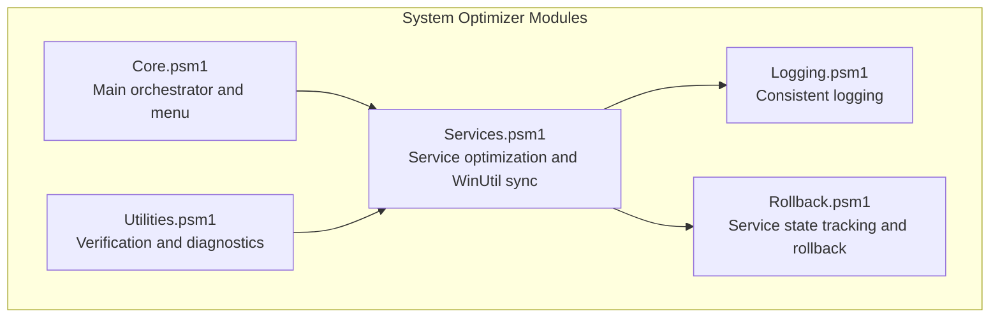
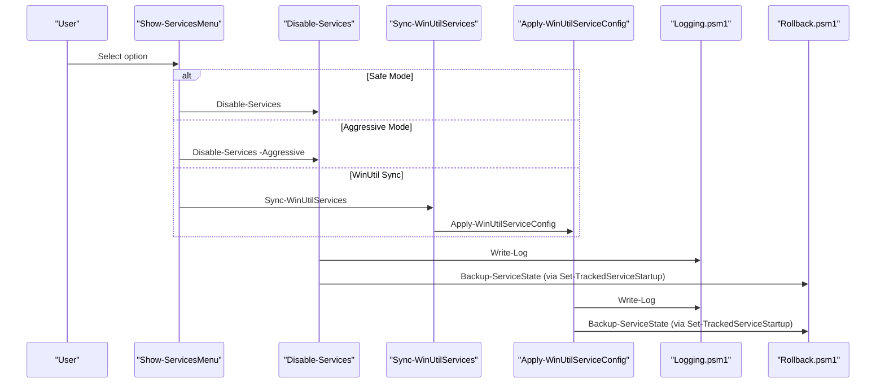
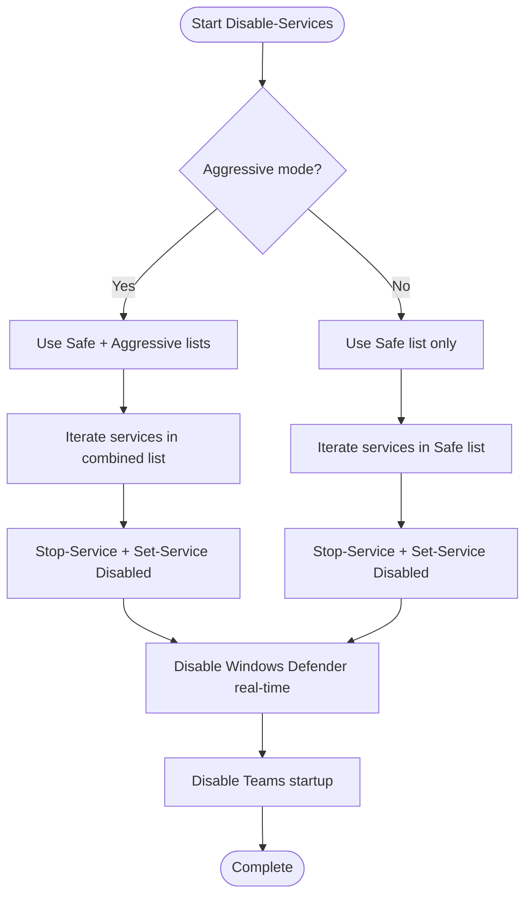
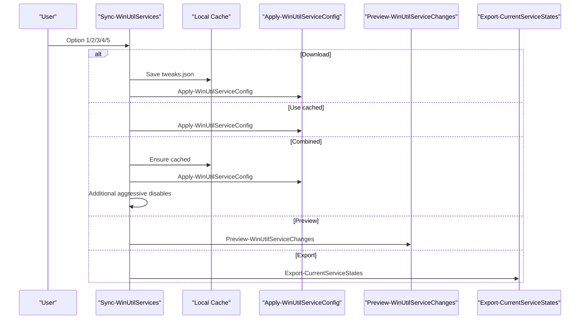
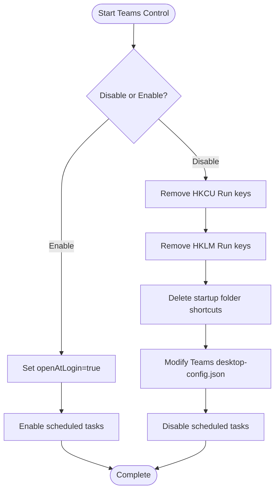
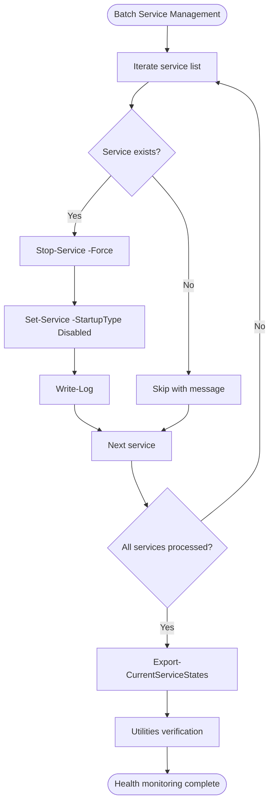
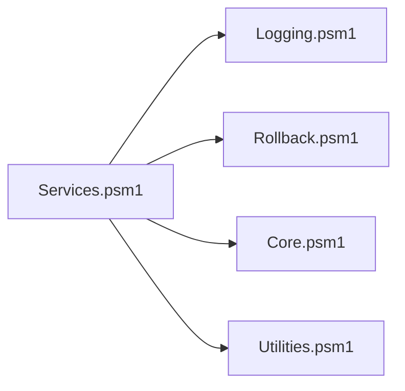

# System Services

<cite>
**Referenced Files in This Document**
- [Services.psm1](file://modules/Services.psm1)
- [Core.psm1](file://modules/Core.psm1)
- [Logging.psm1](file://modules/Logging.psm1)
- [Rollback.psm1](file://modules/Rollback.psm1)
- [Utilities.psm1](file://modules/Utilities.psm1)
- [README.md](file://README.md)
</cite>

## Table of Contents
1. [Introduction](#introduction)
2. [Project Structure](#project-structure)
3. [Core Components](#core-components)
4. [Architecture Overview](#architecture-overview)
5. [Detailed Component Analysis](#detailed-component-analysis)
6. [Dependency Analysis](#dependency-analysis)
7. [Performance Considerations](#performance-considerations)
8. [Troubleshooting Guide](#troubleshooting-guide)
9. [Conclusion](#conclusion)
10. [Appendices](#appendices)

## Introduction
This document describes the Services module that manages Windows service optimization within the System Optimizer project. It explains service management strategies including Safe and Aggressive modes, WinUtil integration, and service startup type modifications. It documents service disable/enable operations, dependency management, and service state tracking. It also provides function documentation for service control operations, batch service management, and service health monitoring, along with examples of service optimization workflows, safety considerations, and troubleshooting common service-related issues.

## Project Structure
The Services module is implemented as a PowerShell module with a primary script file that exposes functions for service optimization and WinUtil synchronization. It integrates with other modules for logging, rollback, and verification.

**Diagram sources**
- [Services.psm1](file://modules/Services.psm1#L1-L712)
- [Core.psm1](file://modules/Core.psm1#L793-L845)
- [Logging.psm1](file://modules/Logging.psm1#L1-L285)
- [Rollback.psm1](file://modules/Rollback.psm1#L256-L356)
- [Utilities.psm1](file://modules/Utilities.psm1#L103-L119)

**Section sources**
- [README.md](file://README.md#L34-L46)
- [Services.psm1](file://modules/Services.psm1#L1-L712)

## Core Components
- Disable-Services: Applies Safe or Aggressive service optimizations, stopping and disabling services, and optionally disables Windows Defender real-time monitoring and Teams startup.
- Sync-WinUtilServices: Interactive menu to synchronize service configurations from WinUtil, including preview, caching, and combined application with aggressive tweaks.
- Apply-WinUtilServiceConfig: Parses WinUtil’s service configuration JSON and applies startup type changes, including delayed start via sc.exe.
- Preview-WinUtilServiceChanges: Previews upcoming service changes from WinUtil without applying them.
- Export-CurrentServiceStates: Exports current service states to a JSON backup for restoration.
- Disable-TeamsStartup and Enable-TeamsStartup: Functions to manage Microsoft Teams auto-start via registry, startup folders, config files, and scheduled tasks.
- Show-ServicesMenu: Interactive menu to select Safe/Aggressive modes, Teams startup controls, WinUtil sync, and export backups.

**Section sources**
- [Services.psm1](file://modules/Services.psm1#L5-L192)
- [Services.psm1](file://modules/Services.psm1#L194-L494)
- [Services.psm1](file://modules/Services.psm1#L496-L606)
- [Services.psm1](file://modules/Services.psm1#L608-L699)

## Architecture Overview
The Services module orchestrates service optimization through a layered approach:
- Safe and Aggressive service lists define which services to target.
- WinUtil integration allows downloading and applying curated service configurations.
- Logging and progress reporting provide visibility during operations.
- Rollback tracking captures service state before changes for potential restoration.
- Verification utilities confirm service states post-optimization.

**Diagram sources**
- [Services.psm1](file://modules/Services.psm1#L608-L699)
- [Services.psm1](file://modules/Services.psm1#L5-L192)
- [Services.psm1](file://modules/Services.psm1#L194-L402)
- [Logging.psm1](file://modules/Logging.psm1#L68-L123)
- [Rollback.psm1](file://modules/Rollback.psm1#L256-L356)

## Detailed Component Analysis

### Safe and Aggressive Modes
- Safe mode targets non-essential services that generally do not impact common functionality (e.g., telemetry, Xbox services, rarely used features, Hyper-V guest services).
- Aggressive mode targets additional services that may affect workflows (e.g., Windows Search, Print Spooler, Remote Desktop, Camera/Scanner, Notifications, Windows Hello, Location services).

Implementation highlights:
- Service lists are defined centrally and merged depending on the selected mode.
- Progress tracking is conditionally enabled if progress functions are available.
- Windows Defender real-time monitoring and Teams startup are disabled as part of the process.

**Diagram sources**
- [Services.psm1](file://modules/Services.psm1#L5-L192)

**Section sources**
- [Services.psm1](file://modules/Services.psm1#L15-L142)

### WinUtil Integration
WinUtil integration enables synchronized service configuration from a curated JSON file:
- Download or cache tweaks.json from WinUtil.
- Preview changes before applying.
- Apply WinUtil service configuration with progress reporting.
- Combine WinUtil config with additional aggressive tweaks.
- Export current service states as a backup.

Key behaviors:
- Parsing WinUtil JSON and mapping startup types to PowerShell equivalents.
- Using sc.exe for delayed start when WinUtil specifies AutomaticDelayedStart.
- Providing enhanced progress indicators when available.

**Diagram sources**
- [Services.psm1](file://modules/Services.psm1#L194-L313)
- [Services.psm1](file://modules/Services.psm1#L315-L402)
- [Services.psm1](file://modules/Services.psm1#L404-L459)
- [Services.psm1](file://modules/Services.psm1#L461-L494)

**Section sources**
- [Services.psm1](file://modules/Services.psm1#L194-L402)
- [Services.psm1](file://modules/Services.psm1#L404-L494)

### Service Control Operations
Functions for managing service startup types and states:
- Disable-TeamsStartup: Removes Teams auto-start via registry Run keys, startup folders, config file, and scheduled tasks.
- Enable-TeamsStartup: Restores Teams auto-start by updating config and enabling scheduled tasks.

**Diagram sources**
- [Services.psm1](file://modules/Services.psm1#L496-L606)

**Section sources**
- [Services.psm1](file://modules/Services.psm1#L496-L606)

### Batch Service Management and Health Monitoring
- Batch operations iterate through service lists, applying stop and startup type changes with robust error handling.
- Health monitoring includes exporting current service states to JSON for backup and verification.
- Verification utilities display critical service statuses to confirm optimization outcomes.

**Diagram sources**
- [Services.psm1](file://modules/Services.psm1#L150-L191)
- [Services.psm1](file://modules/Services.psm1#L461-L494)
- [Utilities.psm1](file://modules/Utilities.psm1#L103-L119)

**Section sources**
- [Services.psm1](file://modules/Services.psm1#L150-L191)
- [Services.psm1](file://modules/Services.psm1#L461-L494)
- [Utilities.psm1](file://modules/Utilities.psm1#L103-L119)

## Dependency Analysis
The Services module depends on:
- Logging.psm1 for consistent logging and progress reporting.
- Rollback.psm1 for backing up service state prior to changes and restoring original configurations.
- Core.psm1 for menu orchestration and invoking service optimization functions.
- Utilities.psm1 for verification of service states post-optimization.

**Diagram sources**
- [Services.psm1](file://modules/Services.psm1#L1-L712)
- [Core.psm1](file://modules/Core.psm1#L793-L845)
- [Logging.psm1](file://modules/Logging.psm1#L1-L285)
- [Rollback.psm1](file://modules/Rollback.psm1#L256-L356)
- [Utilities.psm1](file://modules/Utilities.psm1#L103-L119)

**Section sources**
- [Core.psm1](file://modules/Core.psm1#L793-L845)
- [Rollback.psm1](file://modules/Rollback.psm1#L256-L356)

## Performance Considerations
- Safe vs Aggressive modes balance performance gains against usability. Aggressive mode disables more services, potentially reducing resource usage but increasing risk of breaking features.
- Using sc.exe for delayed start avoids PowerShell limitations and ensures compatibility with protected services.
- Progress indicators improve user experience during long operations; fallbacks ensure operations continue even without advanced progress support.
- Exporting service states enables quick restoration and reduces downtime during troubleshooting.

## Troubleshooting Guide
Common issues and resolutions:
- Protected services failing to change startup type: The rollback module falls back to sc.exe for protected services, ensuring changes are applied when PowerShell Set-Service fails.
- Services not found: The code gracefully skips missing services and logs warnings, preventing failures from halting the entire process.
- WinUtil sync failures: The module handles network errors by falling back to cached configurations and provides clear error messages.
- Teams auto-start not disabled/enabled: The Teams control functions address multiple entry points (registry, startup folders, config, scheduled tasks) to ensure complete coverage.

Operational tips:
- Use Export-CurrentServiceStates to create backups before applying aggressive optimizations.
- Verify service states using Utilities verification to confirm expected outcomes.
- Leverage rollback sessions to revert changes if issues arise.

**Section sources**
- [Services.psm1](file://modules/Services.psm1#L166-L172)
- [Services.psm1](file://modules/Services.psm1#L230-L233)
- [Services.psm1](file://modules/Services.psm1#L377-L382)
- [Rollback.psm1](file://modules/Rollback.psm1#L332-L355)
- [Utilities.psm1](file://modules/Utilities.psm1#L103-L119)

## Conclusion
The Services module provides a robust framework for Windows service optimization with Safe and Aggressive modes, WinUtil integration, and comprehensive state tracking. It balances performance improvements with safety through logging, progress reporting, and rollback capabilities. Users can confidently optimize services while maintaining the ability to verify outcomes and restore configurations when needed.

## Appendices

### Example Workflows
- Safe Mode Optimization: Select Safe Mode from the Services menu to disable non-essential services and optionally disable Windows Defender real-time monitoring and Teams startup.
- Aggressive Mode Optimization: Confirm the warning and select Aggressive Mode to disable additional services that may affect workflows.
- WinUtil Sync: Download the latest WinUtil configuration, preview changes, and apply either the WinUtil configuration alone or combine it with additional aggressive tweaks.
- Export and Verify: Export current service states as a backup, then verify service statuses post-optimization.

**Section sources**
- [Services.psm1](file://modules/Services.psm1#L608-L699)
- [Services.psm1](file://modules/Services.psm1#L194-L313)
- [Services.psm1](file://modules/Services.psm1#L461-L494)
- [Utilities.psm1](file://modules/Utilities.psm1#L103-L119)