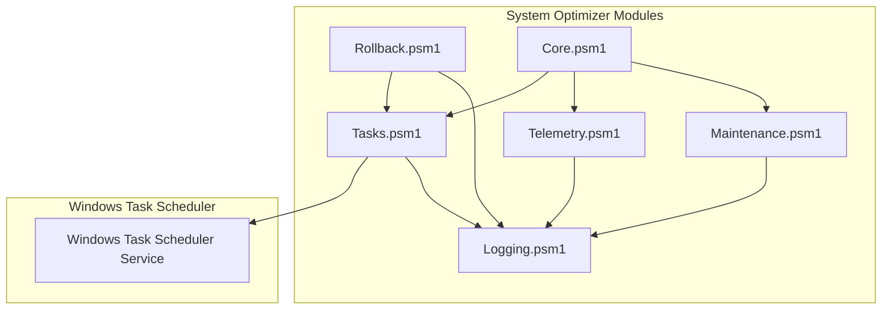
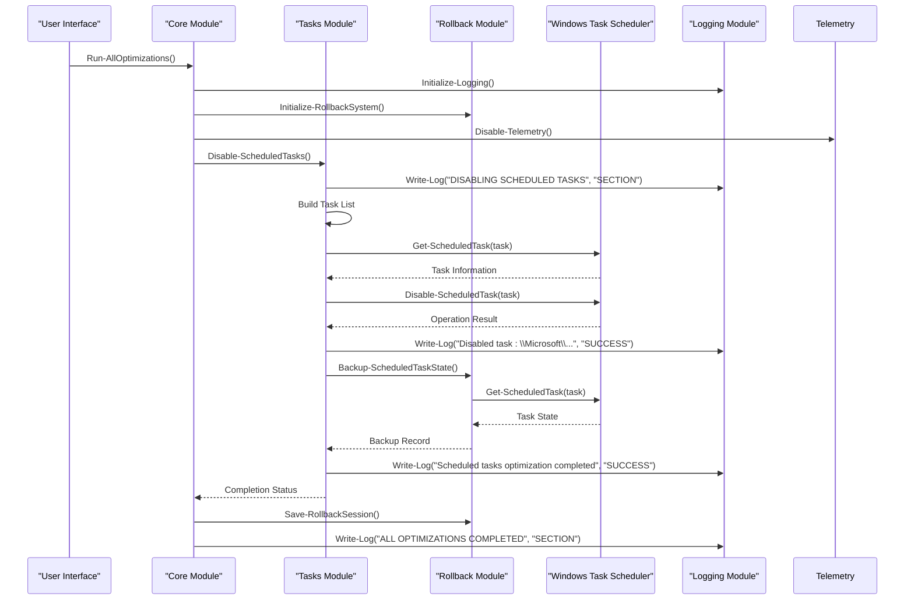
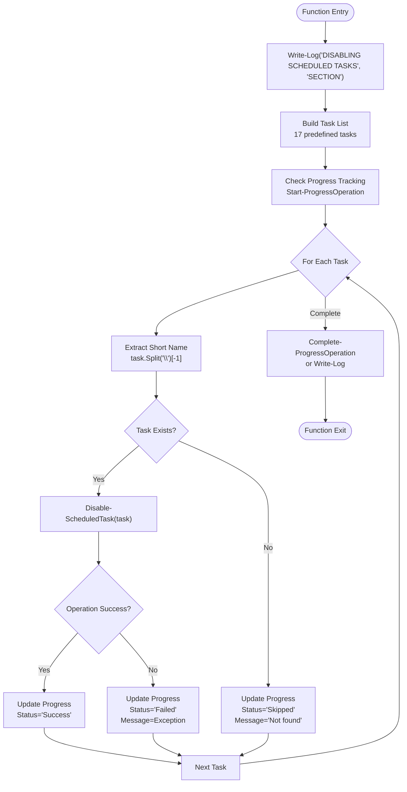
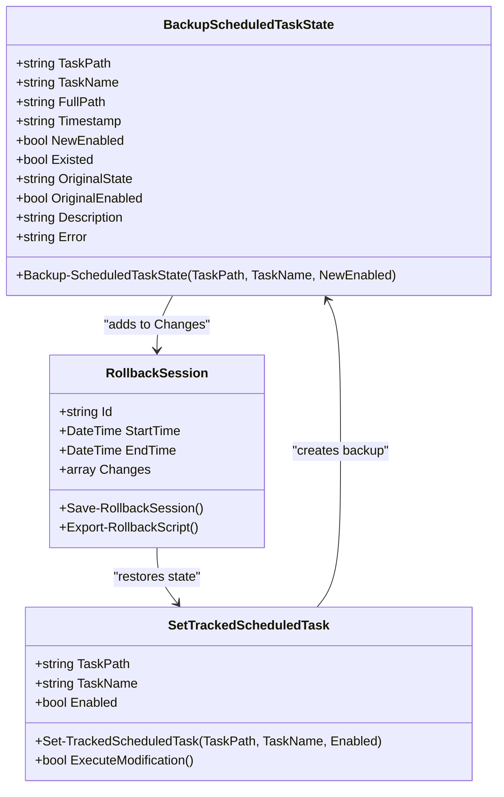
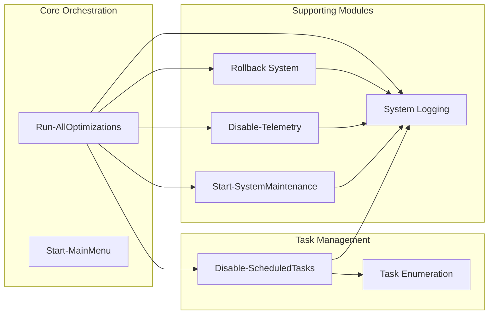
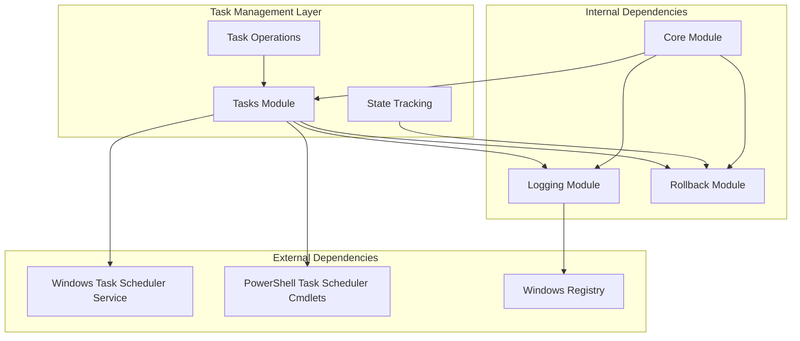
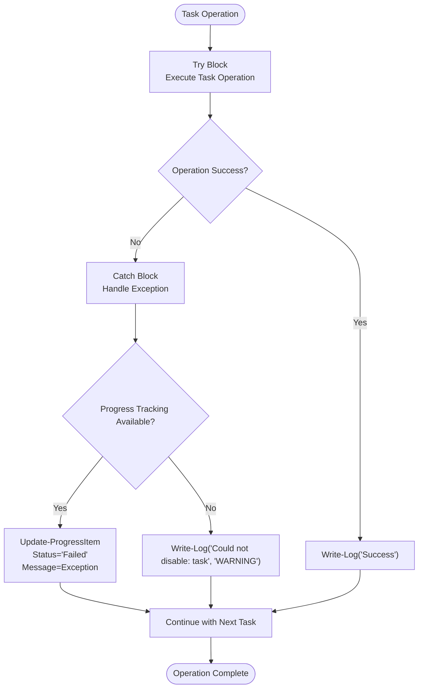

# Task Management

<cite>
**Referenced Files in This Document**
- [Tasks.psm1](file://modules/Tasks.psm1)
- [Rollback.psm1](file://modules/Rollback.psm1)
- [Maintenance.psm1](file://modules/Maintenance.psm1)
- [Telemetry.psm1](file://modules/Telemetry.psm1)
- [Core.psm1](file://modules/Core.psm1)
- [Logging.psm1](file://modules/Logging.psm1)
</cite>

## Table of Contents
1. [Introduction](#introduction)
2. [Project Structure](#project-structure)
3. [Core Components](#core-components)
4. [Architecture Overview](#architecture-overview)
5. [Detailed Component Analysis](#detailed-component-analysis)
6. [Dependency Analysis](#dependency-analysis)
7. [Performance Considerations](#performance-considerations)
8. [Troubleshooting Guide](#troubleshooting-guide)
9. [Conclusion](#conclusion)

## Introduction
This document provides comprehensive documentation for the Tasks module that manages scheduled task optimization within the System Optimizer project. It covers scheduled task management including telemetry task disabling, maintenance automation, and task cleanup procedures. The documentation explains the implementation of task enumeration, modification, and deletion operations, along with detailed function documentation for task control operations, task dependency management, and task scheduling optimization. It also includes examples of task management workflows, safety considerations for task modifications, and troubleshooting common task-related issues.

## Project Structure
The Tasks module is part of the System Optimizer project, which is organized into modular PowerShell scripts. The Tasks module specifically focuses on scheduled task management and integrates with other modules for telemetry control, maintenance automation, and rollback functionality.

**Diagram sources**
- [Tasks.psm1](file://modules/Tasks.psm1#L1-L75)
- [Rollback.psm1](file://modules/Rollback.psm1#L361-L456)
- [Core.psm1](file://modules/Core.psm1#L717-L720)

**Section sources**
- [Tasks.psm1](file://modules/Tasks.psm1#L1-L75)
- [Core.psm1](file://modules/Core.psm1#L717-L720)

## Core Components
The Tasks module provides a focused interface for managing Windows scheduled tasks. The primary component is the Disable-ScheduledTasks function, which systematically disables a curated list of Windows system tasks that are commonly considered unnecessary or resource-intensive.

Key capabilities include:
- Bulk task disabling with progress tracking
- Error handling and logging for individual task operations
- Integration with the rollback system for safe modifications
- Compatibility checking for task existence
- Graceful fallback mechanisms for task modification

**Section sources**
- [Tasks.psm1](file://modules/Tasks.psm1#L5-L69)

## Architecture Overview
The task management system follows a layered architecture that integrates with the broader System Optimizer framework. The architecture ensures modularity, safety, and traceability through several key design patterns.

**Diagram sources**
- [Core.psm1](file://modules/Core.psm1#L717-L720)
- [Tasks.psm1](file://modules/Tasks.psm1#L5-L69)
- [Rollback.psm1](file://modules/Rollback.psm1#L361-L456)

## Detailed Component Analysis

### Disable-ScheduledTasks Function
The Disable-ScheduledTasks function serves as the primary interface for task optimization. It implements a comprehensive approach to task management with robust error handling and progress tracking.

**Diagram sources**
- [Tasks.psm1](file://modules/Tasks.psm1#L5-L69)

#### Task Enumeration and Selection
The function maintains a curated list of 17 specific Windows system tasks that are commonly targeted for optimization. These tasks are selected based on their impact on system performance and user privacy concerns.

Task categories include:
- Application Experience tasks (compatibility analysis)
- Customer Experience Improvement Program tasks
- Disk diagnostic and maintenance tasks
- Feedback and telemetry collection tasks
- Power efficiency diagnostics
- Cloud experience host tasks
- Maintenance automation tasks
- Family safety monitoring tasks
- Xbox game save tasks

#### Modification Operations
The function implements a two-stage approach for task modification:
1. **Existence Verification**: Uses Get-ScheduledTask to confirm task availability
2. **State Modification**: Applies Disable-ScheduledTask for task deactivation

#### Deletion Operations
While the current implementation focuses on disabling tasks rather than permanent deletion, the rollback system provides comprehensive backup and restoration capabilities for any task modifications.

**Section sources**
- [Tasks.psm1](file://modules/Tasks.psm1#L5-L69)

### Rollback System Integration
The rollback system provides comprehensive tracking and restoration capabilities for scheduled task modifications.

**Diagram sources**
- [Rollback.psm1](file://modules/Rollback.psm1#L361-L456)

#### Backup Mechanism
The Backup-ScheduledTaskState function captures comprehensive state information before any modifications:
- Task existence verification
- Current state assessment
- Original enablement status
- Task description and metadata
- Timestamp tracking

#### Restoration Process
The Set-TrackedScheduledTask function provides dual-path restoration:
1. **Primary Method**: Uses PowerShell cmdlets for native task management
2. **Fallback Method**: Employs schtasks.exe for compatibility across different environments

**Section sources**
- [Rollback.psm1](file://modules/Rollback.psm1#L361-L456)

### Integration with System Optimizer
The Tasks module integrates seamlessly with the broader System Optimizer ecosystem through the core orchestration functions.

**Diagram sources**
- [Core.psm1](file://modules/Core.psm1#L717-L720)
- [Tasks.psm1](file://modules/Tasks.psm1#L5-L69)

**Section sources**
- [Core.psm1](file://modules/Core.psm1#L717-L720)

## Dependency Analysis
The task management system exhibits well-structured dependencies that promote modularity and maintainability.

**Diagram sources**
- [Tasks.psm1](file://modules/Tasks.psm1#L5-L69)
- [Rollback.psm1](file://modules/Rollback.psm1#L361-L456)
- [Logging.psm1](file://modules/Logging.psm1#L1-L200)

### Coupling and Cohesion
The system demonstrates strong internal cohesion within the task management domain while maintaining loose coupling with external systems. The Tasks module has minimal external dependencies, primarily relying on Windows Task Scheduler APIs and the logging infrastructure.

### Circular Dependencies
No circular dependencies were identified in the task management system. The dependency flow is unidirectional from the core orchestrator to specialized modules.

**Section sources**
- [Tasks.psm1](file://modules/Tasks.psm1#L5-L69)
- [Rollback.psm1](file://modules/Rollback.psm1#L361-L456)

## Performance Considerations
The task management system is designed for efficiency and reliability in production environments.

### Execution Performance
- **Batch Processing**: Tasks are processed sequentially with progress tracking to provide user feedback
- **Early Existence Checks**: Prevent unnecessary operations on non-existent tasks
- **Graceful Degradation**: Fallback mechanisms ensure operations continue even when individual tasks fail

### Memory and Resource Usage
- **Minimal Memory Footprint**: Task lists are static arrays with predictable memory usage
- **Efficient Logging**: Progress tracking minimizes console output overhead
- **Resource Cleanup**: Proper error handling prevents resource leaks during task operations

### Scalability Factors
- **Linear Complexity**: O(n) performance relative to the number of tasks processed
- **Parallel Processing Potential**: Future enhancements could leverage parallel task processing
- **Extensibility**: Modular design allows easy addition of new task categories

## Troubleshooting Guide

### Common Task Modification Issues
**Issue**: Task not found during disable operation
- **Cause**: Task path mismatch or task removal by Windows updates
- **Solution**: Verify task existence using Get-ScheduledTask, update task list if necessary
- **Prevention**: Regular task enumeration before optimization runs

**Issue**: Permission denied when modifying tasks
- **Cause**: Insufficient administrative privileges
- **Solution**: Run PowerShell as Administrator, verify Task Scheduler service status
- **Prevention**: Include privilege checks in startup routines

**Issue**: Task re-enables after system restart
- **Cause**: Task modifications not persisted or restored by Windows
- **Solution**: Verify task state after restart, implement rollback verification
- **Prevention**: Comprehensive rollback system integration

### Error Handling and Recovery
The system implements comprehensive error handling at multiple levels:

**Diagram sources**
- [Tasks.psm1](file://modules/Tasks.psm1#L55-L61)

### Safety Considerations for Task Modifications
1. **Backup First**: Always create rollback backups before modifications
2. **Selective Operations**: Target only non-essential system tasks
3. **Testing Environment**: Validate changes in development environments first
4. **Documentation**: Maintain records of all task modifications
5. **Monitoring**: Implement post-modification verification procedures

### Validation Procedures
- **State Verification**: Confirm task state after modifications
- **Functionality Testing**: Verify system functionality remains intact
- **Performance Monitoring**: Monitor system performance after changes
- **Rollback Testing**: Regularly test rollback procedures

**Section sources**
- [Tasks.psm1](file://modules/Tasks.psm1#L55-L61)
- [Rollback.psm1](file://modules/Rollback.psm1#L361-L456)

## Conclusion
The Tasks module provides a robust, well-architected solution for scheduled task optimization within the System Optimizer framework. Its design emphasizes safety, traceability, and maintainability through comprehensive rollback integration, structured error handling, and modular architecture.

Key strengths of the implementation include:
- **Comprehensive Task Coverage**: Addresses 17 categories of system tasks commonly considered unnecessary
- **Safety-First Design**: Integrates with rollback system for reversible modifications
- **User Experience**: Provides progress tracking and detailed logging
- **Extensibility**: Modular design allows future enhancements and customization
- **Reliability**: Robust error handling and fallback mechanisms

The module successfully balances aggressive optimization with system stability, making it suitable for both automated optimization workflows and manual intervention scenarios. Its integration with the broader System Optimizer ecosystem ensures consistent behavior and comprehensive system management capabilities.

Future enhancements could include expanded task categorization, parallel processing capabilities, and enhanced telemetry integration for performance monitoring and reporting.