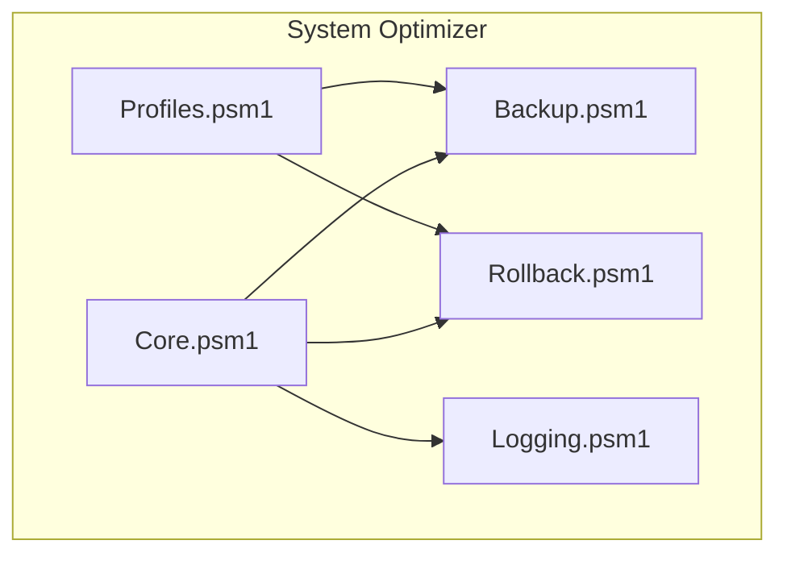
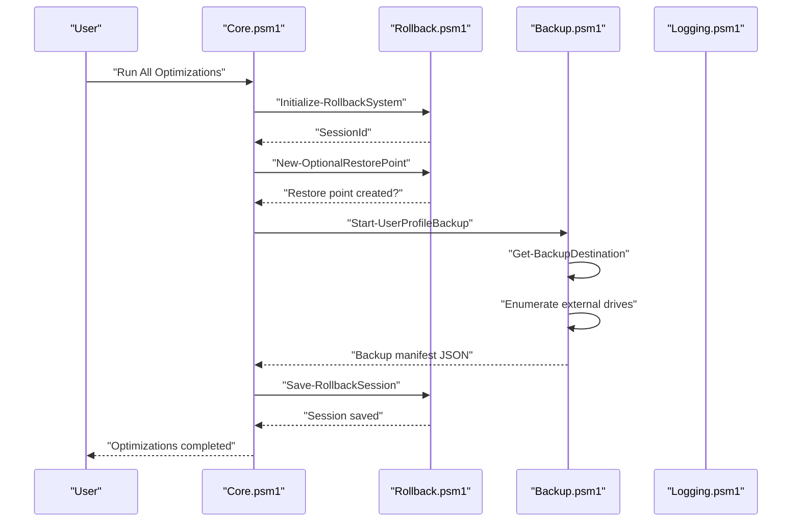
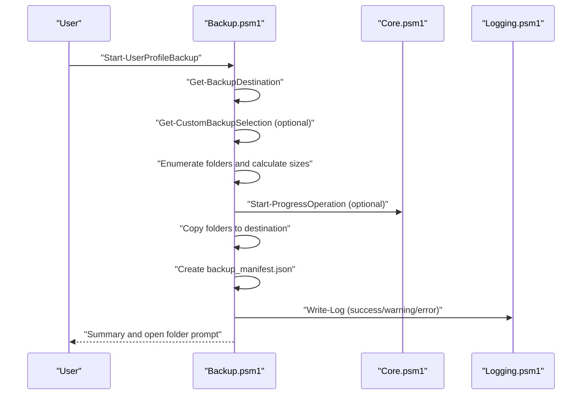
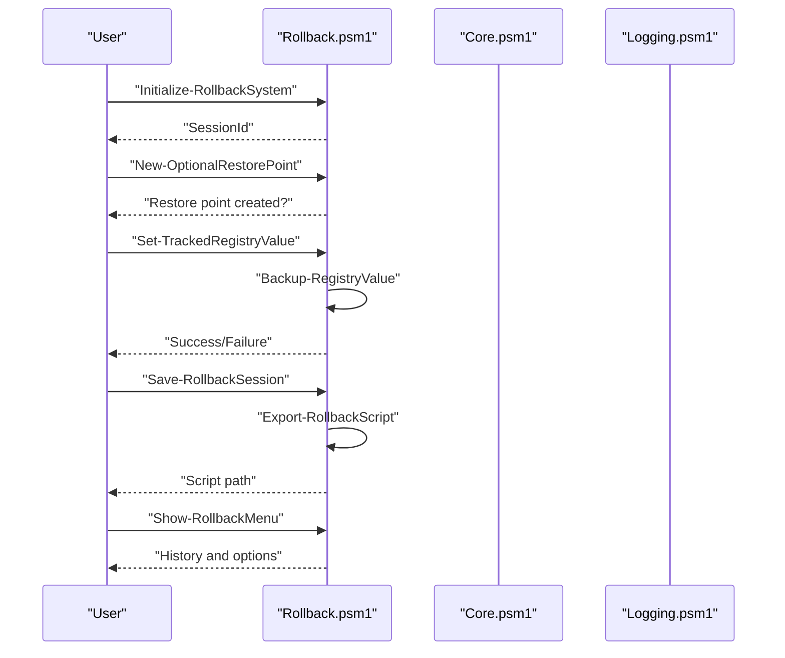
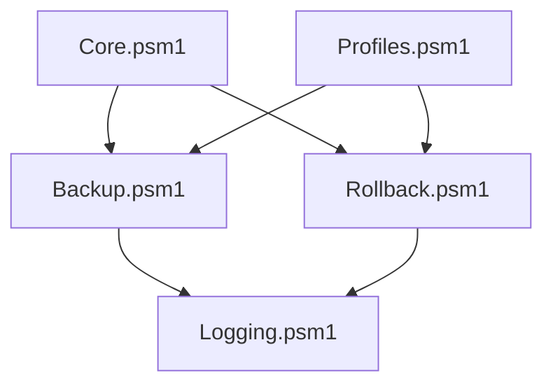

# Data Management Modules

<cite>
**Referenced Files in This Document**
- [Backup.psm1](file://modules/Backup.psm1)
- [Rollback.psm1](file://modules/Rollback.psm1)
- [Core.psm1](file://modules/Core.psm1)
- [Logging.psm1](file://modules/Logging.psm1)
- [Profiles.psm1](file://modules/Profiles.psm1)
- [README.md](file://README.md)
</cite>

## Table of Contents
1. [Introduction](#introduction)
2. [Project Structure](#project-structure)
3. [Core Components](#core-components)
4. [Architecture Overview](#architecture-overview)
5. [Detailed Component Analysis](#detailed-component-analysis)
6. [Dependency Analysis](#dependency-analysis)
7. [Performance Considerations](#performance-considerations)
8. [Troubleshooting Guide](#troubleshooting-guide)
9. [Conclusion](#conclusion)
10. [Appendices](#appendices)

## Introduction
This document provides comprehensive documentation for the System Optimizer’s data management modules focused on critical system data operations. It covers:
- Backup module’s user profile backup system including external drive integration, backup scheduling, compression options, and restore procedures
- Rollback module’s change tracking system, undo functionality, session management, and recovery mechanisms

It includes function documentation with parameter specifications, return values, error handling, practical examples, configuration options, storage requirements, performance considerations, integration patterns, and best practices for data safety and recovery.

## Project Structure
The System Optimizer is organized as a PowerShell-based modular toolkit with a primary executable and numerous module scripts. The data management modules are:
- Backup module: User profile backup, restore, browser data backup, Outlook data backup, and backup status reporting
- Rollback module: Change tracking, session lifecycle, restore point creation, and automated rollback script generation

**Diagram sources**
- [Core.psm1](file://modules/Core.psm1#L698-L742)
- [Backup.psm1](file://modules/Backup.psm1#L33-L66)
- [Rollback.psm1](file://modules/Rollback.psm1#L29-L78)
- [Logging.psm1](file://modules/Logging.psm1#L13-L58)
- [Profiles.psm1](file://modules/Profiles.psm1#L365-L648)

**Section sources**
- [README.md](file://README.md#L48-L59)
- [Core.psm1](file://modules/Core.psm1#L698-L742)

## Core Components
- Backup module: Provides user profile backup and restore, browser-only backup, Outlook-only backup, and backup status reporting. It integrates with external drives, custom destinations, and progress tracking.
- Rollback module: Provides initialization of rollback sessions, change tracking for registry, services, and scheduled tasks, optional restore point creation, session persistence, and automated rollback script generation.

Key integration points:
- Core module orchestrates rollbacks and optional restore points during optimization runs
- Profiles module applies optimization profiles and integrates with rollback sessions
- Logging module provides centralized logging for backup and rollback operations

**Section sources**
- [Backup.psm1](file://modules/Backup.psm1#L33-L66)
- [Rollback.psm1](file://modules/Rollback.psm1#L29-L78)
- [Core.psm1](file://modules/Core.psm1#L698-L742)
- [Profiles.psm1](file://modules/Profiles.psm1#L365-L648)
- [Logging.psm1](file://modules/Logging.psm1#L13-L58)

## Architecture Overview
The data management architecture centers around two primary modules with shared infrastructure:
- Backup module manages user profile data, external drive discovery, and restore procedures with manifest-based metadata
- Rollback module tracks changes across registry, services, and scheduled tasks, persists sessions, and generates undo scripts

**Diagram sources**
- [Core.psm1](file://modules/Core.psm1#L698-L742)
- [Rollback.psm1](file://modules/Rollback.psm1#L29-L78)
- [Rollback.psm1](file://modules/Rollback.psm1#L461-L508)
- [Backup.psm1](file://modules/Backup.psm1#L68-L110)
- [Backup.psm1](file://modules/Backup.psm1#L702-L910)
- [Logging.psm1](file://modules/Logging.psm1#L13-L58)

## Detailed Component Analysis

### Backup Module

#### Overview
The Backup module provides:
- User profile backup and restore with manifest-based metadata
- External drive detection and selection
- Browser-only and Outlook-only backup workflows
- Backup status reporting across local and external drives
- Progress tracking integration with the Core module

#### Key Functions and Parameters

- Show-UserBackupMenu
  - Purpose: Presents interactive backup menu
  - Parameters: None
  - Returns: None
  - Error handling: Displays invalid option warning and continues

- Get-BackupDestination
  - Purpose: Determines backup destination (default, browse, external drive, search)
  - Parameters: DefaultPath (string)
  - Returns: Destination path (string)
  - Error handling: Falls back to default on failure

- Get-ExternalDriveDestination
  - Purpose: Auto-detects external drives and selects one
  - Parameters: DefaultPath (string)
  - Returns: Selected drive path (string)
  - Error handling: Creates directory if missing; falls back to default

- Search-ExistingBackups
  - Purpose: Searches for existing backups across drives and common locations
  - Parameters: DefaultPath (string)
  - Returns: Selected backup location (string)
  - Error handling: Falls back to default if none found

- Get-CustomBackupSelection
  - Purpose: Allows custom selection of folders and paths
  - Parameters: None
  - Returns: Array of selected paths (string[])
  - Error handling: Validates selections and allows removal

- Add-CustomPath
  - Purpose: Adds a custom path for backup
  - Parameters: None
  - Returns: Path string or null
  - Error handling: Confirms non-existent paths

- Add-GameSavesPath
  - Purpose: Adds common game save locations
  - Parameters: None
  - Returns: Path string or null
  - Error handling: Prompts for game name

- Add-ApplicationDataPath
  - Purpose: Adds application data locations
  - Parameters: None
  - Returns: Path string or null
  - Error handling: Supports custom paths

- Remove-Selection
  - Purpose: Removes selected items from backup list
  - Parameters: SelectedFolders (ref), CustomPaths (ref)
  - Returns: None
  - Error handling: Handles invalid indices

- Start-UserProfileBackup
  - Purpose: Executes user profile backup with progress tracking
  - Parameters: None
  - Returns: None
  - Error handling: Renames existing backup; handles copy failures

- Start-UserProfileRestore
  - Purpose: Restores user profile from backup
  - Parameters: None
  - Returns: None
  - Error handling: Renames existing folders with .old extension; validates selection

- Start-BrowserBackup
  - Purpose: Backs up browser data only
  - Parameters: None
  - Returns: None
  - Error handling: Closes browsers before backup

- Start-OutlookBackup
  - Purpose: Backs up Outlook data only
  - Parameters: None
  - Returns: None
  - Error handling: Closes Outlook before backup

- Backup-OutlookPSTFiles
  - Purpose: Backs up Outlook PST files
  - Parameters: BackupPath (string)
  - Returns: None
  - Error handling: Scans common PST locations

- Show-BackupStatus
  - Purpose: Reports backup status across drives
  - Parameters: None
  - Returns: None
  - Error handling: Aggregates backup stats and folder presence

#### Backup Workflow Example
- Choose backup type (essential, browsers, applications, full, custom)
- Select destination (default, browse, external drive, search)
- Start backup with progress tracking
- Generate backup manifest with metadata
- Open backup folder on completion

#### Restore Procedure Example
- Search for available backups across drives
- Select backup by user and date
- Confirm restore with overwrite warning
- Restore folders with .old renaming for existing data
- Generate restore log

#### Configuration Options
- Default backup location: C:\System_Optimizer_Backup\UserProfiles
- Backup manifest includes username, computer name, backup date, type, size, folders, system info, and stats
- External drive detection filters removable/fixed drives excluding system drive

#### Storage Requirements
- Backup size depends on selected folders and applications
- Manifest and restore logs are small JSON files
- External drives are auto-detected and validated for free space

#### Error Handling
- Graceful fallbacks to default paths on failures
- Progress updates with success/failure/skipped counts
- Detailed logging with timestamps and severity levels

**Section sources**
- [Backup.psm1](file://modules/Backup.psm1#L33-L66)
- [Backup.psm1](file://modules/Backup.psm1#L68-L110)
- [Backup.psm1](file://modules/Backup.psm1#L112-L194)
- [Backup.psm1](file://modules/Backup.psm1#L196-L291)
- [Backup.psm1](file://modules/Backup.psm1#L293-L322)
- [Backup.psm1](file://modules/Backup.psm1#L324-L524)
- [Backup.psm1](file://modules/Backup.psm1#L526-L641)
- [Backup.psm1](file://modules/Backup.psm1#L643-L694)
- [Backup.psm1](file://modules/Backup.psm1#L702-L910)
- [Backup.psm1](file://modules/Backup.psm1#L912-L1165)
- [Backup.psm1](file://modules/Backup.psm1#L1167-L1208)
- [Backup.psm1](file://modules/Backup.psm1#L1210-L1256)
- [Backup.psm1](file://modules/Backup.psm1#L1258-L1301)
- [Backup.psm1](file://modules/Backup.psm1#L1303-L1447)
- [Backup.psm1](file://modules/Backup.psm1#L1452-L1468)

#### Backup Module Sequence Diagram

**Diagram sources**
- [Backup.psm1](file://modules/Backup.psm1#L702-L910)
- [Backup.psm1](file://modules/Backup.psm1#L852-L887)
- [Core.psm1](file://modules/Core.psm1#L60-L95)
- [Logging.psm1](file://modules/Logging.psm1#L68-L123)

### Rollback Module

#### Overview
The Rollback module provides:
- Session initialization and configuration
- Optional Windows System Restore point creation
- Tracking of registry, service, and scheduled task changes
- Session persistence and automated rollback script generation
- History management and interactive rollback menu

#### Key Functions and Parameters

- Initialize-RollbackSystem
  - Purpose: Initializes rollback directory structure and starts a new session
  - Parameters: OperationName (string)
  - Returns: SessionId (string)
  - Error handling: Creates directories if missing

- New-OptionalRestorePoint
  - Purpose: Optionally creates a Windows System Restore point
  - Parameters: Description (string), Force (switch)
  - Returns: Boolean indicating success
  - Error handling: Enables System Restore if needed; continues on failure

- Backup-RegistryValue
  - Purpose: Backs up registry value before modification
  - Parameters: Path (string), Name (string), NewValue (string), NewType (string)
  - Returns: Backup record (hashtable)
  - Error handling: Captures original value/type or marks as non-existent

- Set-TrackedRegistryValue
  - Purpose: Sets registry value with automatic backup tracking
  - Parameters: Path (string), Name (string), Value (object), Type (string), Force (switch)
  - Returns: Boolean indicating success
  - Error handling: Uses compatible methods across Windows versions

- Backup-ServiceState
  - Purpose: Backs up service configuration before modification
  - Parameters: ServiceName (string), NewStartType (string)
  - Returns: Backup record (hashtable)
  - Error handling: Captures service state and start type

- Set-TrackedServiceStartup
  - Purpose: Changes service startup type with automatic backup
  - Parameters: ServiceName (string), StartupType (string)
  - Returns: Boolean indicating success
  - Error handling: Falls back to sc.exe for protected services

- Backup-ScheduledTaskState
  - Purpose: Backs up scheduled task state before modification
  - Parameters: TaskPath (string), TaskName (string), NewEnabled (bool)
  - Returns: Backup record (hashtable)
  - Error handling: Captures task state and enabled status

- Set-TrackedScheduledTask
  - Purpose: Enables/disables scheduled task with tracking
  - Parameters: TaskPath (string), TaskName (string), Enabled (bool)
  - Returns: Boolean indicating success
  - Error handling: Falls back to schtasks.exe

- Save-RollbackSession
  - Purpose: Saves current session to disk and generates rollback script
  - Parameters: None
  - Returns: Boolean indicating success
  - Error handling: Calculates summary and writes JSON

- Export-RollbackScript
  - Purpose: Generates a PowerShell script to undo all changes from a session
  - Parameters: SessionId (string)
  - Returns: Script path (string) or null
  - Error handling: Writes auto-generated script with error handling

- Get-RollbackHistory
  - Purpose: Retrieves list of rollback sessions
  - Parameters: Last (int)
  - Returns: Array of session summaries
  - Error handling: Filters invalid JSON files

- Show-RollbackMenu
  - Purpose: Interactive menu for viewing history and running rollback scripts
  - Parameters: None
  - Returns: None
  - Error handling: Handles invalid selections gracefully

- Show-SessionDetails
  - Purpose: Displays detailed information about a rollback session
  - Parameters: SessionFile (string)
  - Returns: None
  - Error handling: Reads and parses session JSON

- Invoke-Rollback
  - Purpose: Executes rollback for a specific session
  - Parameters: SessionId (string)
  - Returns: None
  - Error handling: Generates script if missing; prompts for confirmation

- Clear-OldSessions
  - Purpose: Removes old rollback sessions
  - Parameters: KeepLast (int)
  - Returns: None
  - Error handling: Confirms deletion and removes associated scripts

- Get-WindowsVersionInfo
  - Purpose: Retrieves Windows version information for compatibility checks
  - Parameters: None
  - Returns: Version info object
  - Error handling: Returns defaults if registry access fails

- Test-CommandAvailable
  - Purpose: Checks if a command/cmdlet is available
  - Parameters: Command (string)
  - Returns: Boolean
  - Error handling: Returns false if command not found

- Start-TrackedOperation
  - Purpose: Starts tracking an operation with optional restore point
  - Parameters: Name (string), PromptRestorePoint (switch), ForceRestorePoint (switch)
  - Returns: SessionId (string)
  - Error handling: Initializes session and optionally creates restore point

- Stop-TrackedOperation
  - Purpose: Finishes tracking and saves the session
  - Parameters: None
  - Returns: None
  - Error handling: Calls Save-RollbackSession

- Add-RegistryChangeToSession
  - Purpose: Manually adds a registry change to the current session
  - Parameters: Path (string), Name (string), OriginalValue (object), NewValue (object), Type (string), Existed (bool)
  - Returns: None
  - Error handling: Appends change to session registry array

- Add-ServiceChangeToSession
  - Purpose: Manually adds a service change to the current session
  - Parameters: ServiceName (string), OriginalStartType (string), NewStartType (string)
  - Returns: None
  - Error handling: Appends change to session services array

- Snapshot-based tracking helpers
  - Get-RegistrySnapshot, Compare-RegistrySnapshots
  - Get-ServiceSnapshot, Compare-ServiceSnapshots
  - Purpose: Alternative approach using before/after snapshots
  - Parameters: Paths (string[]), Before/After (hashtable), ServiceNames (string[])
  - Returns: Snapshots or changes arrays
  - Error handling: Skips unreadable paths and properties

#### Rollback Scenario Example
- Initialize rollback session before running optimizations
- Optionally create a restore point
- Track registry/service/task changes during operations
- Save session and generate rollback script
- Use rollback menu to view history and execute undo

#### Configuration Options
- Rollback directory: C:\System_Optimizer_Backup\Rollback
- Max history: 50 sessions
- Session file naming: Sessions/<operation>_<timestamp>.json
- Rollback script naming: Scripts/Undo_<session>.ps1

#### Storage Requirements
- Session JSON files: small to moderate size depending on changes
- Rollback scripts: generated dynamically per session
- Maximum 50 sessions retained by default

#### Error Handling
- Graceful handling of missing restore points
- Fallback methods for protected services and tasks
- Detailed logging with timestamps and error messages
- Session validation and cleanup of corrupted entries

**Section sources**
- [Rollback.psm1](file://modules/Rollback.psm1#L29-L78)
- [Rollback.psm1](file://modules/Rollback.psm1#L83-L144)
- [Rollback.psm1](file://modules/Rollback.psm1#L149-L203)
- [Rollback.psm1](file://modules/Rollback.psm1#L205-L251)
- [Rollback.psm1](file://modules/Rollback.psm1#L256-L299)
- [Rollback.psm1](file://modules/Rollback.psm1#L302-L356)
- [Rollback.psm1](file://modules/Rollback.psm1#L361-L404)
- [Rollback.psm1](file://modules/Rollback.psm1#L406-L455)
- [Rollback.psm1](file://modules/Rollback.psm1#L461-L508)
- [Rollback.psm1](file://modules/Rollback.psm1#L514-L717)
- [Rollback.psm1](file://modules/Rollback.psm1#L722-L843)
- [Rollback.psm1](file://modules/Rollback.psm1#L845-L905)
- [Rollback.psm1](file://modules/Rollback.psm1#L907-L938)
- [Rollback.psm1](file://modules/Rollback.psm1#L940-L983)
- [Rollback.psm1](file://modules/Rollback.psm1#L988-L1006)
- [Rollback.psm1](file://modules/Rollback.psm1#L1008-L1020)
- [Rollback.psm1](file://modules/Rollback.psm1#L1027-L1065)
- [Rollback.psm1](file://modules/Rollback.psm1#L1067-L1133)
- [Rollback.psm1](file://modules/Rollback.psm1#L1140-L1171)
- [Rollback.psm1](file://modules/Rollback.psm1#L1173-L1233)
- [Rollback.psm1](file://modules/Rollback.psm1#L1235-L1262)
- [Rollback.psm1](file://modules/Rollback.psm1#L1264-L1294)

#### Rollback Module Sequence Diagram

**Diagram sources**
- [Rollback.psm1](file://modules/Rollback.psm1#L29-L78)
- [Rollback.psm1](file://modules/Rollback.psm1#L83-L144)
- [Rollback.psm1](file://modules/Rollback.psm1#L149-L203)
- [Rollback.psm1](file://modules/Rollback.psm1#L205-L251)
- [Rollback.psm1](file://modules/Rollback.psm1#L461-L508)
- [Rollback.psm1](file://modules/Rollback.psm1#L514-L717)
- [Rollback.psm1](file://modules/Rollback.psm1#L722-L843)

### Integration Patterns
- Core module initializes rollback sessions and optional restore points before running optimizations
- Profiles module applies optimization profiles and integrates with rollback sessions
- Logging module centralizes logging for both backup and rollback operations
- Backup module uses external drive detection and progress tracking integrated with Core

Best practices:
- Always initialize rollback sessions before major operations
- Create restore points when performing risky changes
- Use backup manifests to track backup metadata and integrity
- Regularly review and prune old rollback sessions to manage storage

**Section sources**
- [Core.psm1](file://modules/Core.psm1#L698-L742)
- [Profiles.psm1](file://modules/Profiles.psm1#L365-L648)
- [Logging.psm1](file://modules/Logging.psm1#L13-L58)
- [Backup.psm1](file://modules/Backup.psm1#L112-L194)

## Dependency Analysis
The data management modules depend on shared infrastructure and each other as follows:

**Diagram sources**
- [Core.psm1](file://modules/Core.psm1#L698-L742)
- [Backup.psm1](file://modules/Backup.psm1#L33-L66)
- [Rollback.psm1](file://modules/Rollback.psm1#L29-L78)
- [Logging.psm1](file://modules/Logging.psm1#L13-L58)
- [Profiles.psm1](file://modules/Profiles.psm1#L365-L648)

**Section sources**
- [Core.psm1](file://modules/Core.psm1#L698-L742)
- [Backup.psm1](file://modules/Backup.psm1#L33-L66)
- [Rollback.psm1](file://modules/Rollback.psm1#L29-L78)
- [Logging.psm1](file://modules/Logging.psm1#L13-L58)
- [Profiles.psm1](file://modules/Profiles.psm1#L365-L648)

## Performance Considerations
- Backup operations:
  - Progress tracking reduces perceived latency during large folder copies
  - External drive selection requires enumeration of logical disks
  - Backup manifest creation adds minimal overhead
- Rollback operations:
  - Session persistence writes JSON files periodically
  - Rollback script generation occurs on-demand or at session save
  - Snapshot-based tracking requires enumerating registry keys and services
- Storage:
  - Default backup location is on the system drive; external drives recommended for large backups
  - Rollback sessions are limited to 50 by default to control storage usage

[No sources needed since this section provides general guidance]

## Troubleshooting Guide
Common issues and resolutions:
- Backup destination not found:
  - Use external drive detection or browse for custom location
  - Verify permissions to write to destination
- Restore point creation fails:
  - System Restore may be disabled; module attempts to enable it
  - Proceed without restore point if necessary
- Backup/restore failures:
  - Check for locked files (browsers/outlook running)
  - Verify sufficient disk space on destination
  - Review logs for detailed error messages
- Rollback script execution:
  - Requires administrative privileges
  - Some changes may require system restart to take effect

**Section sources**
- [Backup.psm1](file://modules/Backup.psm1#L112-L194)
- [Backup.psm1](file://modules/Backup.psm1#L912-L1165)
- [Rollback.psm1](file://modules/Rollback.psm1#L83-L144)
- [Rollback.psm1](file://modules/Rollback.psm1#L907-L938)
- [Logging.psm1](file://modules/Logging.psm1#L68-L123)

## Conclusion
The System Optimizer’s data management modules provide robust capabilities for user profile backup and restore, along with a comprehensive rollback system for tracking and reversing system changes. The Backup module offers flexible destination selection, external drive integration, and detailed metadata through manifests. The Rollback module enables safe experimentation by tracking changes across registry, services, and scheduled tasks, generating automated undo scripts, and managing session history. Together, these modules support reliable data safety and recovery workflows within the broader optimization toolkit.

[No sources needed since this section summarizes without analyzing specific files]

## Appendices

### Practical Examples

#### Backup Workflow Example
- Navigate to Backup menu
- Select “Backup User Profile”
- Choose backup type (essential, browsers, applications, full, custom)
- Select destination (default, browse, external drive, search)
- Start backup; monitor progress
- Review backup manifest and open backup folder

#### Restore Procedure Example
- Navigate to Backup menu
- Select “Restore User Profile”
- Search for available backups across drives
- Select backup by user and date
- Confirm restore with overwrite warning
- Monitor restore progress and review restore log

#### Rollback Scenario Example
- Initialize rollback session before running optimizations
- Optionally create a restore point
- Track registry/service/task changes during operations
- Save session and generate rollback script
- Use rollback menu to view history and execute undo

[No sources needed since this section provides general guidance]