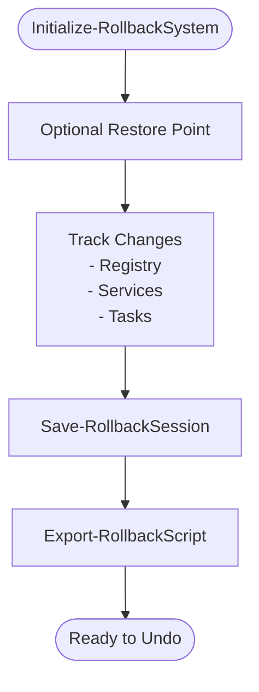

# Specialized Modules

<cite>
**Referenced Files in This Document**
- [Backup.psm1](file://modules/Backup.psm1)
- [Rollback.psm1](file://modules/Rollback.psm1)
- [Profiles.psm1](file://modules/Profiles.psm1)
- [Hardware.psm1](file://modules/Hardware.psm1)
- [ImageTool.psm1](file://modules/ImageTool.psm1)
- [Installer.psm1](file://modules/Installer.psm1)
- [VHDDeploy.psm1](file://modules/VHDDeploy.psm1)
- [Shutdown.psm1](file://modules/Shutdown.psm1)
</cite>

## Table of Contents
1. [Introduction](#introduction)
2. [Project Structure](#project-structure)
3. [Core Components](#core-components)
4. [Architecture Overview](#architecture-overview)
5. [Detailed Component Analysis](#detailed-component-analysis)
6. [Dependency Analysis](#dependency-analysis)
7. [Performance Considerations](#performance-considerations)
8. [Troubleshooting Guide](#troubleshooting-guide)
9. [Conclusion](#conclusion)

## Introduction
This document provides comprehensive technical and practical documentation for the System Optimizer’s specialized modules that handle advanced system operations and deployment scenarios. It focuses on:
- Backup: user profile backup and external drive integration
- Rollback: change tracking and undo functionality
- Profiles: optimization profiles and hardware detection
- Hardware: system analysis and compatibility checking
- ImageTool: Windows image management and ISO creation
- Installer: Windows deployment and disk preparation
- VHDDeploy: VHD deployment and native boot configuration
- Shutdown: power state management and restart procedures

For each module, we describe functions, advanced usage patterns, and practical workflows, with diagrams where appropriate.

## Project Structure
The specialized modules are organized as PowerShell modules under the modules directory. Each module encapsulates a cohesive set of functions for a specific domain (backup, deployment, shutdown, etc.). They share common patterns:
- Centralized logging helpers
- Menu-driven interactive workflows
- Robust error handling and user prompts
- Integration with Windows APIs and tools (DISM, BCDEdit, DiskPart, etc.)

**Diagram sources**
- [Backup.psm1](file://modules/Backup.psm1#L33-L66)
- [Rollback.psm1](file://modules/Rollback.psm1#L29-L78)
- [Profiles.psm1](file://modules/Profiles.psm1#L246-L319)
- [Hardware.psm1](file://modules/Hardware.psm1#L48-L243)
- [ImageTool.psm1](file://modules/ImageTool.psm1#L312-L346)
- [Installer.psm1](file://modules/Installer.psm1#L97-L123)
- [VHDDeploy.psm1](file://modules/VHDDeploy.psm1#L96-L120)
- [Shutdown.psm1](file://modules/Shutdown.psm1#L7-L67)

**Section sources**
- [Backup.psm1](file://modules/Backup.psm1#L1-L120)
- [Rollback.psm1](file://modules/Rollback.psm1#L1-L40)
- [Profiles.psm1](file://modules/Profiles.psm1#L1-L40)
- [Hardware.psm1](file://modules/Hardware.psm1#L1-L40)
- [ImageTool.psm1](file://modules/ImageTool.psm1#L1-L40)
- [Installer.psm1](file://modules/Installer.psm1#L1-L40)
- [VHDDeploy.psm1](file://modules/VHDDeploy.psm1#L1-L40)
- [Shutdown.psm1](file://modules/Shutdown.psm1#L1-L20)

## Core Components
- Backup: interactive menu, external drive auto-detection, custom selection, and robust destination resolution
- Rollback: session initialization, change tracking (registry, services, scheduled tasks), optional restore points, and automated undo script generation
- Profiles: preset profiles (Gaming, Developer, Office, ContentCreator, Laptop, LowSpec), hardware-aware suggestion, and profile application orchestration
- Hardware: cross-version compatibility wrappers, CPU/GPU/disk detection, and health/trait reporting
- ImageTool: ISO selection, WIM mounting, image tweaks, driver injection, bloatware removal, unattended answer file creation, and cleanup
- Installer: disk preparation (single/dual/custom), Windows deployment, quick install, and WinNTSetup integration
- VHDDeploy: VHD creation (GPT/MBR), mount/dismount, Windows deployment to VHD, boot menu integration, driver injection, feature enablement, and quick deploy
- Shutdown: immediate/force shutdown/restart, scheduled shutdowns/timers, hibernate/sleep, and schedule management

**Section sources**
- [Backup.psm1](file://modules/Backup.psm1#L33-L110)
- [Rollback.psm1](file://modules/Rollback.psm1#L29-L78)
- [Profiles.psm1](file://modules/Profiles.psm1#L18-L201)
- [Hardware.psm1](file://modules/Hardware.psm1#L17-L43)
- [ImageTool.psm1](file://modules/ImageTool.psm1#L312-L346)
- [Installer.psm1](file://modules/Installer.psm1#L97-L123)
- [VHDDeploy.psm1](file://modules/VHDDeploy.psm1#L96-L120)
- [Shutdown.psm1](file://modules/Shutdown.psm1#L7-L67)

## Architecture Overview
The modules are designed around:
- Centralized logging and progress helpers
- Interactive menus for guided workflows
- Integration with Windows imaging and deployment tools
- Safe change tracking with rollback capability
- Hardware-aware profile selection

**Diagram sources**
- [Profiles.psm1](file://modules/Profiles.psm1#L246-L319)
- [Hardware.psm1](file://modules/Hardware.psm1#L48-L243)
- [Installer.psm1](file://modules/Installer.psm1#L511-L681)
- [VHDDeploy.psm1](file://modules/VHDDeploy.psm1#L307-L398)
- [Rollback.psm1](file://modules/Rollback.psm1#L29-L78)
- [Backup.psm1](file://modules/Backup.psm1#L702-L762)

## Detailed Component Analysis

### Backup Module
- Purpose: User profile backup and restore with external drive integration and custom selection
- Key functions:
  - Show-UserBackupMenu: interactive menu for backup/restore options
  - Get-BackupDestination: choose default, browse, auto-detect external drives, or search existing backups
  - Get-ExternalDriveDestination: auto-detect external drives, validate free space, and create backup directory
  - Search-ExistingBackups: scan drives and locate existing backups with manifests
  - Get-CustomBackupSelection: curated selection of folders (Essential, Browsers, Applications) with add/remove and custom paths
  - Start-UserProfileBackup: orchestrates backup with progress tracking, optional app closure, and logging
- Advanced usage patterns:
  - Use external drive auto-detection for portable backups
  - Combine Essential + Browser/Applications for targeted backups
  - Use custom selection to include game saves or application data
  - Search existing backups to reuse previous snapshots
- Practical workflows:
  - Backup user profile to external drive for disaster recovery
  - Backup browser data only for migration scenarios
  - Backup Outlook data only to preserve mail profiles

**Diagram sources**
- [Backup.psm1](file://modules/Backup.psm1#L33-L110)
- [Backup.psm1](file://modules/Backup.psm1#L112-L194)
- [Backup.psm1](file://modules/Backup.psm1#L196-L291)
- [Backup.psm1](file://modules/Backup.psm1#L324-L524)
- [Backup.psm1](file://modules/Backup.psm1#L702-L762)

**Section sources**
- [Backup.psm1](file://modules/Backup.psm1#L33-L110)
- [Backup.psm1](file://modules/Backup.psm1#L112-L194)
- [Backup.psm1](file://modules/Backup.psm1#L196-L291)
- [Backup.psm1](file://modules/Backup.psm1#L324-L524)
- [Backup.psm1](file://modules/Backup.psm1#L702-L800)

### Rollback Module
- Purpose: Track system changes and generate undo scripts for safe rollback
- Key functions:
  - Initialize-RollbackSystem: create directories and start a new session
  - New-OptionalRestorePoint: optionally create a System Restore point
  - Backup-RegistryValue/Set-TrackedRegistryValue: track and set registry values safely
  - Backup-ServiceState/Set-TrackedServiceStartup: track and modify service startup types
  - Backup-ScheduledTaskState/Set-TrackedScheduledTask: track and enable/disable scheduled tasks
  - Save-RollbackSession: persist session and generate undo script
  - Export-RollbackScript: generate PowerShell undo script per session
  - Get-RollbackHistory/Show-RollbackMenu: manage and run rollback sessions
- Advanced usage patterns:
  - Wrap risky operations inside tracked functions to capture originals
  - Use optional restore points for extra safety during major changes
  - Export individual undo scripts for specific sessions
- Practical workflows:
  - Before applying a profile, initialize a rollback session
  - After changes, save the session and review summary
  - Revert using generated undo script if issues arise

**Diagram sources**
- [Rollback.psm1](file://modules/Rollback.psm1#L29-L78)
- [Rollback.psm1](file://modules/Rollback.psm1#L83-L144)
- [Rollback.psm1](file://modules/Rollback.psm1#L149-L251)
- [Rollback.psm1](file://modules/Rollback.psm1#L256-L356)
- [Rollback.psm1](file://modules/Rollback.psm1#L406-L455)
- [Rollback.psm1](file://modules/Rollback.psm1#L461-L508)
- [Rollback.psm1](file://modules/Rollback.psm1#L514-L717)
- [Rollback.psm1](file://modules/Rollback.psm1#L722-L800)

**Section sources**
- [Rollback.psm1](file://modules/Rollback.psm1#L29-L78)
- [Rollback.psm1](file://modules/Rollback.psm1#L83-L144)
- [Rollback.psm1](file://modules/Rollback.psm1#L149-L251)
- [Rollback.psm1](file://modules/Rollback.psm1#L256-L356)
- [Rollback.psm1](file://modules/Rollback.psm1#L406-L455)
- [Rollback.psm1](file://modules/Rollback.psm1#L461-L508)
- [Rollback.psm1](file://modules/Rollback.psm1#L514-L717)
- [Rollback.psm1](file://modules/Rollback.psm1#L722-L800)

### Profiles Module
- Purpose: Provide optimization profiles and apply them with hardware-aware suggestions
- Key functions:
  - Get-ProfileList/Get-Profile: enumerate and fetch profile definitions
  - Get-SuggestedProfile: auto-suggest profile based on hardware detection
  - Get-ActiveProfile/Set-ActiveProfile: persist active profile
  - Set-OptimizationProfile: apply profile by invoking existing module functions
  - Show-ProfileDetails/Compare-Profiles: display and compare profile actions
  - Show-ProfileMenu: interactive profile selection
- Advanced usage patterns:
  - Use WhatIf mode to preview changes without applying
  - Combine profile application with rollback sessions
  - Compare profiles side-by-side to understand differences
- Practical workflows:
  - Auto-suggest a profile and apply it
  - Manually select a profile and preview actions
  - Apply Developer profile to keep WSL/Hyper-V enabled

**Diagram sources**
- [Profiles.psm1](file://modules/Profiles.psm1#L206-L244)
- [Profiles.psm1](file://modules/Profiles.psm1#L246-L319)
- [Profiles.psm1](file://modules/Profiles.psm1#L321-L360)
- [Profiles.psm1](file://modules/Profiles.psm1#L365-L648)
- [Profiles.psm1](file://modules/Profiles.psm1#L650-L681)
- [Profiles.psm1](file://modules/Profiles.psm1#L776-L800)

**Section sources**
- [Profiles.psm1](file://modules/Profiles.psm1#L18-L201)
- [Profiles.psm1](file://modules/Profiles.psm1#L206-L244)
- [Profiles.psm1](file://modules/Profiles.psm1#L246-L319)
- [Profiles.psm1](file://modules/Profiles.psm1#L321-L360)
- [Profiles.psm1](file://modules/Profiles.psm1#L365-L648)
- [Profiles.psm1](file://modules/Profiles.psm1#L650-L681)
- [Profiles.psm1](file://modules/Profiles.psm1#L776-L800)

### Hardware Module
- Purpose: Detect CPU, GPU, storage, and memory for smart optimization recommendations
- Key functions:
  - Get-CimOrWmi: compatibility wrapper for CIM/WMI
  - Get-CPUInfo: manufacturer, generation, architecture, cores/threads, hybrid detection
  - Get-GPUInfo: manufacturer, series/architecture, dedicated/integrated, VRAM, driver info
  - Get-StorageInfo: modern (Storage module) and legacy (WMI) disk detection
  - Get-DedicatedVRAMFromRegistry: extended GPU info for >4GB VRAM
- Advanced usage patterns:
  - Use manufacturer/series detection to tailor profile choices
  - Use hybrid CPU detection to optimize for P/E cores
  - Use storage health/trait reporting to guide partitioning decisions
- Practical workflows:
  - Detect system capabilities before applying profiles
  - Verify GPU series/architecture for driver compatibility
  - Assess storage health for deployment decisions

**Diagram sources**
- [Hardware.psm1](file://modules/Hardware.psm1#L17-L43)
- [Hardware.psm1](file://modules/Hardware.psm1#L48-L243)
- [Hardware.psm1](file://modules/Hardware.psm1#L319-L493)
- [Hardware.psm1](file://modules/Hardware.psm1#L539-L800)

**Section sources**
- [Hardware.psm1](file://modules/Hardware.psm1#L17-L43)
- [Hardware.psm1](file://modules/Hardware.psm1#L48-L243)
- [Hardware.psm1](file://modules/Hardware.psm1#L319-L493)
- [Hardware.psm1](file://modules/Hardware.psm1#L539-L800)

### ImageTool Module
- Purpose: Windows image management, ISO creation, and deployment utilities
- Key functions:
  - Initialize-ImageToolLogging/Write-ImageLog: centralized logging
  - Initialize-WorkDirectories/Settings menu: configure work directories and logs
  - Show-ImageToolMenu: main menu for ISO/WIM/image operations
  - Select-WindowsISO/Mount-WindowsISO/Copy-ISOContents: ISO handling
  - Get-WindowsImageIndex: select image index
  - Mount-WindowsWIM: mount WIM/ESD and convert as needed
  - Apply-ImageTweaks: apply registry tweaks (bypass checks, telemetry, sponsored apps, OOBE, animations, theme, Teams)
  - Inject-Drivers: export and inject drivers
  - Remove-ImageBloatware: remove provisioned packages, features, and folders
  - Create-UnattendFile: generate unattended answer file
  - Cleanup and utilities
- Advanced usage patterns:
  - Use ESD-to-WIM conversion for compatibility
  - Apply multiple image tweaks in one pass
  - Export current system drivers and inject into mounted images
- Practical workflows:
  - Create a customized Windows ISO with pre-applied tweaks
  - Mount and modify an existing image for deployment
  - Inject drivers and remove bloatware before deployment

**Diagram sources**
- [ImageTool.psm1](file://modules/ImageTool.psm1#L312-L346)
- [ImageTool.psm1](file://modules/ImageTool.psm1#L351-L417)
- [ImageTool.psm1](file://modules/ImageTool.psm1#L419-L443)
- [ImageTool.psm1](file://modules/ImageTool.psm1#L449-L487)
- [ImageTool.psm1](file://modules/ImageTool.psm1#L489-L551)
- [ImageTool.psm1](file://modules/ImageTool.psm1#L619-L663)
- [ImageTool.psm1](file://modules/ImageTool.psm1#L668-L774)

**Section sources**
- [ImageTool.psm1](file://modules/ImageTool.psm1#L23-L90)
- [ImageTool.psm1](file://modules/ImageTool.psm1#L119-L141)
- [ImageTool.psm1](file://modules/ImageTool.psm1#L312-L346)
- [ImageTool.psm1](file://modules/ImageTool.psm1#L351-L417)
- [ImageTool.psm1](file://modules/ImageTool.psm1#L419-L443)
- [ImageTool.psm1](file://modules/ImageTool.psm1#L449-L487)
- [ImageTool.psm1](file://modules/ImageTool.psm1#L489-L551)
- [ImageTool.psm1](file://modules/ImageTool.psm1#L619-L663)
- [ImageTool.psm1](file://modules/ImageTool.psm1#L668-L774)

### Installer Module
- Purpose: Deploy Windows to blank drives with disk preparation and quick install
- Key functions:
  - Show-InstallerMenu: main menu for disk prep and deployment
  - Show-AvailableDisks/Show-DiskPartitions: discover disks/partitions
  - Create-SingleDiskScript/Create-DualDiskPrimaryScript/Create-DualDiskSecondaryScript/Create-CustomDisk: generate DiskPart scripts
  - Prepare-SingleDisk/Prepare-DualDiskPrimary/Prepare-DualDiskSecondary/Prepare-CustomDisk: prepare disks
  - Deploy-Windows: apply Windows image and create boot entries
  - Start-QuickInstall: prepare + deploy in one step
  - Download-WinNTSetup: download and launch GUI installer
- Advanced usage patterns:
  - Use Quick Install for streamlined clean installs
  - Customize partition layouts for dual-boot scenarios
  - Leverage WinNTSetup for GUI-based deployments
- Practical workflows:
  - Prepare a single disk for UEFI boot
  - Prepare dual disks with Windows on primary and data on secondary
  - Perform a quick install to a target disk

**Diagram sources**
- [Installer.psm1](file://modules/Installer.psm1#L97-L123)
- [Installer.psm1](file://modules/Installer.psm1#L175-L217)
- [Installer.psm1](file://modules/Installer.psm1#L219-L321)
- [Installer.psm1](file://modules/Installer.psm1#L327-L506)
- [Installer.psm1](file://modules/Installer.psm1#L511-L681)
- [Installer.psm1](file://modules/Installer.psm1#L687-L733)

**Section sources**
- [Installer.psm1](file://modules/Installer.psm1#L97-L123)
- [Installer.psm1](file://modules/Installer.psm1#L175-L217)
- [Installer.psm1](file://modules/Installer.psm1#L219-L321)
- [Installer.psm1](file://modules/Installer.psm1#L327-L506)
- [Installer.psm1](file://modules/Installer.psm1#L511-L681)
- [Installer.psm1](file://modules/Installer.psm1#L687-L733)

### VHDDeploy Module
- Purpose: Create and deploy bootable VHD/VHDX for native boot configurations
- Key functions:
  - Show-VHDMenu: main menu for VHD operations
  - New-EmptyVHD/Start-CreateEmptyVHD: create VHD with GPT/MBR layouts
  - Mount-ExistingVHD/Dismount-ExistingVHD: manage mounted VHDs
  - Deploy-WindowsToVHD: deploy Windows to mounted VHD
  - Add-VHDToBootMenu: add VHD to boot menu via BCDEdit
  - Add-DriversToVHD: inject drivers into VHD
  - Enable-VHDFeatures: enable Hyper-V/WSL in VHD
  - Start-QuickVHDDeploy: end-to-end VHD creation + deployment + boot menu + drivers
- Advanced usage patterns:
  - Use QuickVHDDeploy for all-in-one VHD deployment
  - Inject drivers and enable features post-deployment
  - Manage multiple VHDs and boot entries
- Practical workflows:
  - Create a GPT VHD and deploy Windows
  - Mount an existing VHD, deploy updates, and add to boot menu
  - Enable Hyper-V/WSL inside the VHD for development

**Diagram sources**
- [VHDDeploy.psm1](file://modules/VHDDeploy.psm1#L96-L120)
- [VHDDeploy.psm1](file://modules/VHDDeploy.psm1#L125-L183)
- [VHDDeploy.psm1](file://modules/VHDDeploy.psm1#L185-L227)
- [VHDDeploy.psm1](file://modules/VHDDeploy.psm1#L232-L302)
- [VHDDeploy.psm1](file://modules/VHDDeploy.psm1#L307-L398)
- [VHDDeploy.psm1](file://modules/VHDDeploy.psm1#L403-L431)
- [VHDDeploy.psm1](file://modules/VHDDeploy.psm1#L436-L479)
- [VHDDeploy.psm1](file://modules/VHDDeploy.psm1#L484-L522)
- [VHDDeploy.psm1](file://modules/VHDDeploy.psm1#L527-L680)

**Section sources**
- [VHDDeploy.psm1](file://modules/VHDDeploy.psm1#L96-L120)
- [VHDDeploy.psm1](file://modules/VHDDeploy.psm1#L125-L183)
- [VHDDeploy.psm1](file://modules/VHDDeploy.psm1#L185-L227)
- [VHDDeploy.psm1](file://modules/VHDDeploy.psm1#L232-L302)
- [VHDDeploy.psm1](file://modules/VHDDeploy.psm1#L307-L398)
- [VHDDeploy.psm1](file://modules/VHDDeploy.psm1#L403-L431)
- [VHDDeploy.psm1](file://modules/VHDDeploy.psm1#L436-L479)
- [VHDDeploy.psm1](file://modules/VHDDeploy.psm1#L484-L522)
- [VHDDeploy.psm1](file://modules/VHDDeploy.psm1#L527-L680)

### Shutdown Module
- Purpose: Manage power state operations including shutdown, restart, sleep, hibernate, and scheduling
- Key functions:
  - Show-ShutdownMenu: interactive menu for power operations
  - Invoke-ImmediateShutdown/Invoke-ImmediateRestart: immediate actions with confirmation
  - Invoke-LogOff/Invoke-LockWorkstation: user session operations
  - Schedule-ShutdownAtTime/Schedule-RestartAtTime: schedule at specific time
  - Schedule-ShutdownTimer/Schedule-RestartTimer: schedule with minutes
  - Invoke-ForceShutdown/Invoke-ForceRestart: force operations with warnings
  - Invoke-Hibernate/Invoke-Sleep: advanced power states with checks/enabled
  - Show-ScheduledShutdowns/Cancel-AllScheduledShutdowns: schedule management
- Advanced usage patterns:
  - Use force operations sparingly due to risk of data loss
  - Schedule shutdowns/timers for maintenance windows
  - Cancel scheduled shutdowns before rebooting
- Practical workflows:
  - Schedule a restart for maintenance at a specific time
  - Force restart after critical updates
  - Hibernate or sleep for power savings

**Diagram sources**
- [Shutdown.psm1](file://modules/Shutdown.psm1#L7-L67)
- [Shutdown.psm1](file://modules/Shutdown.psm1#L69-L135)
- [Shutdown.psm1](file://modules/Shutdown.psm1#L159-L239)
- [Shutdown.psm1](file://modules/Shutdown.psm1#L241-L323)
- [Shutdown.psm1](file://modules/Shutdown.psm1#L325-L377)
- [Shutdown.psm1](file://modules/Shutdown.psm1#L379-L422)
- [Shutdown.psm1](file://modules/Shutdown.psm1#L424-L470)

**Section sources**
- [Shutdown.psm1](file://modules/Shutdown.psm1#L7-L67)
- [Shutdown.psm1](file://modules/Shutdown.psm1#L69-L135)
- [Shutdown.psm1](file://modules/Shutdown.psm1#L159-L239)
- [Shutdown.psm1](file://modules/Shutdown.psm1#L241-L323)
- [Shutdown.psm1](file://modules/Shutdown.psm1#L325-L377)
- [Shutdown.psm1](file://modules/Shutdown.psm1#L379-L422)
- [Shutdown.psm1](file://modules/Shutdown.psm1#L424-L470)

## Dependency Analysis
- Profiles depends on Hardware for auto-suggestion
- Installer and VHDDeploy depend on ImageTool for WIM/ISO handling
- Rollback integrates with Backup for change tracking
- Shutdown is standalone but complements Installer/VHDDeploy for lifecycle management

**Diagram sources**
- [Profiles.psm1](file://modules/Profiles.psm1#L246-L319)
- [Hardware.psm1](file://modules/Hardware.psm1#L48-L243)
- [Installer.psm1](file://modules/Installer.psm1#L511-L681)
- [ImageTool.psm1](file://modules/ImageTool.psm1#L449-L487)
- [VHDDeploy.psm1](file://modules/VHDDeploy.psm1#L307-L398)
- [Rollback.psm1](file://modules/Rollback.psm1#L29-L78)
- [Backup.psm1](file://modules/Backup.psm1#L702-L762)
- [Shutdown.psm1](file://modules/Shutdown.psm1#L69-L135)

**Section sources**
- [Profiles.psm1](file://modules/Profiles.psm1#L246-L319)
- [Installer.psm1](file://modules/Installer.psm1#L511-L681)
- [VHDDeploy.psm1](file://modules/VHDDeploy.psm1#L307-L398)
- [Rollback.psm1](file://modules/Rollback.psm1#L29-L78)
- [Backup.psm1](file://modules/Backup.psm1#L702-L762)
- [Shutdown.psm1](file://modules/Shutdown.psm1#L69-L135)

## Performance Considerations
- Backup: external drive I/O can be a bottleneck; prefer fast USB 3.0/SSD; use selective backup modes
- Rollback: registry/service/task tracking adds overhead; limit to critical operations
- Profiles: hardware detection is lightweight; avoid repeated queries by caching results
- Hardware: WMI/CIM queries can be slow on older systems; use compatibility wrapper judiciously
- ImageTool: WIM mounting and DISM operations are I/O intensive; use separate drive for work directory
- Installer/VHDDeploy: disk preparation and image apply are long-running; ensure adequate free space and time
- Shutdown: scheduled operations rely on Task Scheduler; ensure scheduler is responsive

[No sources needed since this section provides general guidance]

## Troubleshooting Guide
- Backup
  - External drive not detected: verify drive type and permissions; fallback to default path
  - Invalid selection/input: ensure numeric input within range; validate custom paths
- Rollback
  - Missing session: initialize a new session before tracking changes
  - Undo script errors: run as Administrator; verify registry paths and service names
- Profiles
  - Hardware detection unavailable: fallback to default profile suggestion
  - Module functions missing: ensure dependent modules are loaded
- Hardware
  - WMI/CIM failures: use compatibility wrapper; check PowerShell version
- ImageTool
  - WIM/ESD not found: verify ISO contents; ensure correct path
  - Mount failures: check permissions and available drive letters
- Installer
  - Diskpart failures: verify disk numbers and confirmations; check for mounted images
  - Deployment errors: ensure correct edition index and sufficient disk space
- VHDDeploy
  - VHD mount issues: dismount existing VHDs; verify diskpart script
  - Boot entry failures: ensure correct Windows path and partition style
- Shutdown
  - Scheduled shutdown not cancelling: use shutdown /a; verify Task Scheduler availability

**Section sources**
- [Backup.psm1](file://modules/Backup.psm1#L112-L194)
- [Rollback.psm1](file://modules/Rollback.psm1#L514-L717)
- [Profiles.psm1](file://modules/Profiles.psm1#L246-L319)
- [Hardware.psm1](file://modules/Hardware.psm1#L17-L43)
- [ImageTool.psm1](file://modules/ImageTool.psm1#L419-L487)
- [Installer.psm1](file://modules/Installer.psm1#L327-L506)
- [VHDDeploy.psm1](file://modules/VHDDeploy.psm1#L232-L302)
- [Shutdown.psm1](file://modules/Shutdown.psm1#L424-L470)

## Conclusion
The System Optimizer’s specialized modules provide a comprehensive toolkit for advanced system operations and deployment scenarios. They emphasize safety (rollback), automation (profiles), and reliability (hardware-awareness) while integrating seamlessly with Windows imaging and deployment tools. By leveraging the documented workflows and advanced usage patterns, users can confidently manage backups, apply optimized configurations, deploy Windows images, and control power states.

[No sources needed since this section summarizes without analyzing specific files]