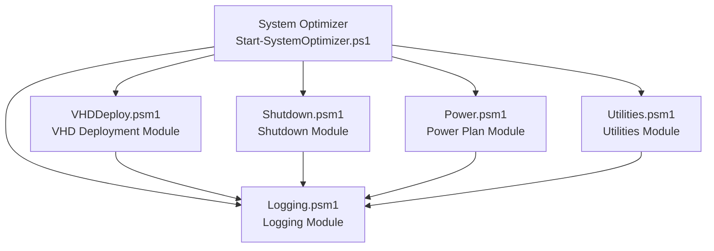
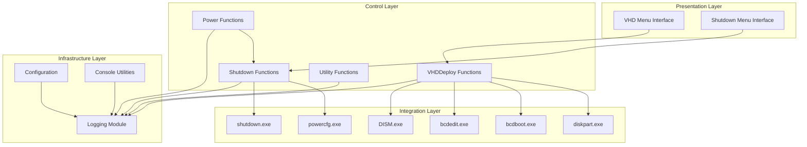
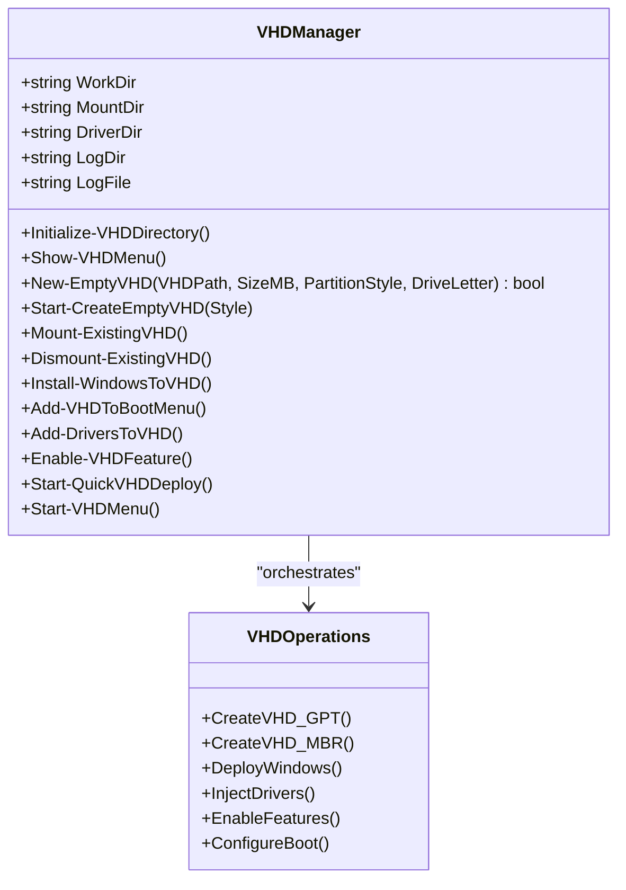
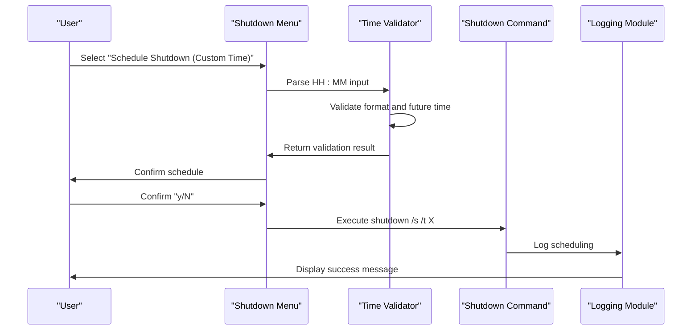
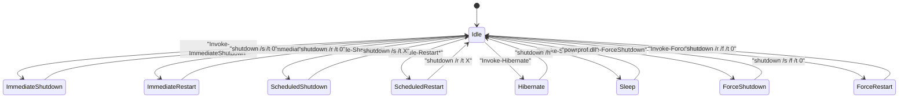
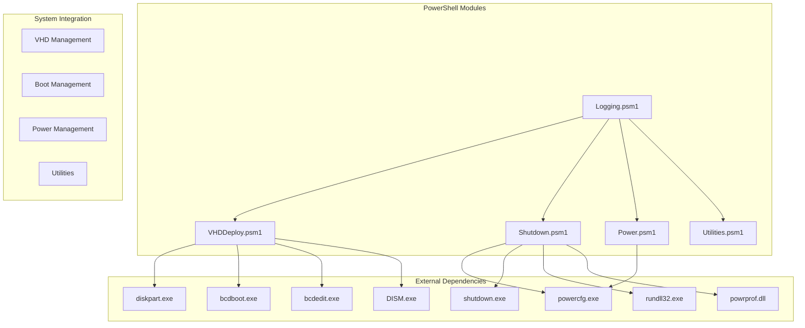

# System Control Modules

<cite>
**Referenced Files in This Document**
- [VHDDeploy.psm1](file://modules/VHDDeploy.psm1)
- [Shutdown.psm1](file://modules/Shutdown.psm1)
- [Power.psm1](file://modules/Power.psm1)
- [Utilities.psm1](file://modules/Utilities.psm1)
- [Logging.psm1](file://modules/Logging.psm1)
- [Start-SystemOptimizer.ps1](file://Start-SystemOptimizer.ps1)
- [README.md](file://README.md)
</cite>

## Update Summary
**Changes Made**
- Updated VHD Deployment module function names to reflect standardization changes
- Modified function documentation for Initialize-VHDDirectory, Install-WindowsToVHD, and Enable-VHDFeature
- Updated code examples and internal references to use new function names
- Enhanced function naming consistency across the VHD deployment workflow

## Table of Contents
1. [Introduction](#introduction)
2. [Project Structure](#project-structure)
3. [Core Components](#core-components)
4. [Architecture Overview](#architecture-overview)
5. [Detailed Component Analysis](#detailed-component-analysis)
6. [Dependency Analysis](#dependency-analysis)
7. [Performance Considerations](#performance-considerations)
8. [Troubleshooting Guide](#troubleshooting-guide)
9. [Conclusion](#conclusion)

## Introduction
This document provides comprehensive technical and practical documentation for the System Optimizer's system control modules focused on system state and deployment operations. It covers:
- The VHD Deployment module for creating and managing virtual hard disks, native boot configuration, multi-boot support, and deployment verification
- The Shutdown module for power state management including shutdown controls, restart procedures, hibernate operations, and power management integration

The documentation includes function specifications, parameter details, system requirements, operational procedures, practical examples, configuration options, compatibility considerations, and integration points with other system management modules.

## Project Structure
The System Optimizer is organized as a modular PowerShell toolkit with a main entry point and multiple specialized modules. The system control modules are part of this modular architecture and integrate with shared logging and utility infrastructure.



**Diagram sources**
- [Start-SystemOptimizer.ps1](file://Start-SystemOptimizer.ps1#L625-L800)
- [VHDDeploy.psm1](file://modules/VHDDeploy.psm1#L1-L743)
- [Shutdown.psm1](file://modules/Shutdown.psm1#L1-L490)
- [Power.psm1](file://modules/Power.psm1#L1-L93)
- [Utilities.psm1](file://modules/Utilities.psm1#L1-L395)
- [Logging.psm1](file://modules/Logging.psm1#L1-L285)

**Section sources**
- [README.md](file://README.md#L1-L88)
- [Start-SystemOptimizer.ps1](file://Start-SystemOptimizer.ps1#L625-L800)

## Core Components
This section outlines the two primary system control modules and their responsibilities:
- VHD Deployment Module: Manages virtual hard disk creation, mounting, Windows deployment, driver injection, feature enabling, and boot menu integration for native boot scenarios
- Shutdown Module: Provides comprehensive power state management including immediate actions, scheduled operations, advanced controls, and hibernate/sleep integration

Both modules leverage shared logging infrastructure for consistent operation tracking and error reporting.

**Section sources**
- [VHDDeploy.psm1](file://modules/VHDDeploy.psm1#L1-L743)
- [Shutdown.psm1](file://modules/Shutdown.psm1#L1-L490)
- [Logging.psm1](file://modules/Logging.psm1#L1-L285)

## Architecture Overview
The system control modules operate within a layered architecture:
- Presentation Layer: Menu-driven interfaces for user interaction
- Control Layer: Module functions orchestrating system operations
- Integration Layer: PowerShell cmdlets, Windows APIs, and external tools
- Infrastructure Layer: Logging, configuration, and utility functions



**Diagram sources**
- [VHDDeploy.psm1](file://modules/VHDDeploy.psm1#L125-L183)
- [Shutdown.psm1](file://modules/Shutdown.psm1#L69-L422)
- [Power.psm1](file://modules/Power.psm1#L5-L86)
- [Logging.psm1](file://modules/Logging.psm1#L18-L58)

## Detailed Component Analysis

### VHD Deployment Module

#### Module Overview
The VHD Deployment module provides a comprehensive toolkit for creating and managing virtual hard disks with native boot capabilities. It supports both UEFI (GPT) and legacy (MBR) boot scenarios, automated driver injection, feature enabling, and seamless integration with Windows boot management.

#### Core Functions and Parameters

##### Initialize-VHDDirectory
Initializes the VHD deployment environment including logging setup and console configuration.

**Parameters:** None

**Return:** Void

**Section sources**
- [VHDDeploy.psm1](file://modules/VHDDeploy.psm1#L89-L97)

##### New-EmptyVHD
Creates a new virtual hard disk with specified partition layout and formatting.

**Parameters:**
- `$VHDPath`: String - Full path to VHD file (supports .vhd/.vhdx)
- `$SizeMB`: Integer - Maximum size in megabytes (default: 102400)
- `$PartitionStyle`: String - "GPT" or "MBR" (default: "GPT")
- `$DriveLetter`: String - Drive letter assignment (default: "W")

**Return:** Boolean indicating success/failure

**Section sources**
- [VHDDeploy.psm1](file://modules/VHDDeploy.psm1#L128-L186)

##### Start-CreateEmptyVHD
Interactive wrapper for VHD creation with user input validation and overwrite handling.

**Parameters:**
- `$Style`: String - "GPT" or "MBR" (default: "GPT")

**Operational Flow:**
1. Validates existing VHD presence and handles overwrite
2. Prompts for path, size, and drive letter
3. Calls New-EmptyVHD with validated parameters
4. Provides success/failure feedback

**Section sources**
- [VHDDeploy.psm1](file://modules/VHDDeploy.psm1#L188-L233)

##### Install-WindowsToVHD
Deploys Windows operating system to a mounted VHD from ISO or WIM sources.

**Updated** Function name standardized from Deploy-WindowsToVHD to Install-WindowsToVHD for improved readability

**Operational Steps:**
1. Validates mounted VHD with W: drive
2. Supports ISO mounting or direct WIM/ESD selection
3. Lists available Windows editions and allows selection
4. Applies image using Expand-WindowsImage with DISM fallback
5. Handles ISO dismounting post-deployment

**Section sources**
- [VHDDeploy.psm1](file://modules/VHDDeploy.psm1#L313-L404)

##### Add-VHDToBootMenu
Integrates VHD into Windows Boot Manager for native boot capability.

**Process:**
1. Verifies Windows directory presence
2. Creates boot files using bcdboot.exe
3. Renames boot entry with user-specified description
4. Provides restart instructions for boot menu activation

**Section sources**
- [VHDDeploy.psm1](file://modules/VHDDeploy.psm1#L409-L437)

##### Add-DriversToVHD
Injects drivers into deployed VHD for hardware compatibility.

**Options:**
1. Export current system drivers and inject into VHD
2. Manually select driver folder for injection
3. Uses DISM for driver addition with recursion support

**Section sources**
- [VHDDeploy.psm1](file://modules/VHDDeploy.psm1#L442-L485)

##### Enable-VHDFeature
Enables Windows features within the VHD environment.

**Updated** Function name standardized from Enable-VHDFeatures to Enable-VHDFeature for improved readability

**Supported Features:**
- Hyper-V virtualization platform
- Windows Subsystem for Linux (WSL)
- Combined Hyper-V and WSL enabling

**Implementation:** Uses DISM with feature name parameters

**Section sources**
- [VHDDeploy.psm1](file://modules/VHDDeploy.psm1#L490-L528)

##### Start-QuickVHDDeploy
End-to-end wizard for complete VHD deployment workflow.

**Workflow:**
1. Create VHD with user-defined parameters
2. Deploy Windows from ISO/WIM
3. Optional driver injection
4. Add to boot menu with custom name
5. Create desktop shortcuts for easy access
6. Optional automatic restart

**Section sources**
- [VHDDeploy.psm1](file://modules/VHDDeploy.psm1#L533-L689)

#### VHD Management Operations

##### Mount-ExistingVHD
Provides GUI-based file selection for VHD mounting with partition enumeration.

**Features:**
- Windows Forms OpenFileDialog integration
- Automatic partition discovery and display
- Error handling for mount failures

**Section sources**
- [VHDDeploy.psm1](file://modules/VHDDeploy.psm1#L238-L268)

##### Dismount-ExistingVHD
Manages multiple mounted VHDs with selective and bulk dismount capabilities.

**Capabilities:**
- Lists all attached VHDs
- Single VHD dismount selection
- Bulk dismount all option
- Confirmation prompts for destructive operations

**Section sources**
- [VHDDeploy.psm1](file://modules/VHDDeploy.psm1#L270-L308)

#### System Requirements and Compatibility
- Windows 10/11 with administrative privileges
- PowerShell 5.1+ (PowerShell 7+ recommended)
- Diskpart.exe for VHD creation
- bcdboot.exe and bcdedit.exe for boot management
- DISM.exe for image deployment and driver injection
- Minimum 100GB storage for default VHD size

#### Practical Examples

##### Example 1: Basic VHD Creation
```powershell
# Create GPT-formatted VHD with default settings
Start-CreateEmptyVHD -Style "GPT"

# Create MBR-formatted VHD with custom parameters
Start-CreateEmptyVHD -Style "MBR"
```

##### Example 2: Complete VHD Deployment
```powershell
# Run the guided deployment wizard
Start-QuickVHDDeploy
```

##### Example 3: Manual VHD Management
```powershell
# Mount existing VHD
Mount-ExistingVHD

# Deploy Windows to VHD
Install-WindowsToVHD

# Add to boot menu
Add-VHDToBootMenu
```

**Section sources**
- [VHDDeploy.psm1](file://modules/VHDDeploy.psm1#L96-L120)
- [VHDDeploy.psm1](file://modules/VHDDeploy.psm1#L533-L689)

#### Class Diagram for VHD Operations


**Diagram sources**
- [VHDDeploy.psm1](file://modules/VHDDeploy.psm1#L89-L120)
- [VHDDeploy.psm1](file://modules/VHDDeploy.psm1#L128-L186)
- [VHDDeploy.psm1](file://modules/VHDDeploy.psm1#L313-L404)

### Shutdown Module

#### Module Overview
The Shutdown module provides comprehensive power state management with immediate actions, scheduled operations, advanced controls, and hibernate/sleep integration. It offers both interactive menus and programmatic control for system power management.

#### Core Functions and Parameters

##### Show-ShutdownMenu
Primary interface for shutdown and power management operations.

**Menu Categories:**
- Immediate Actions: Shutdown, Restart, Log Off, Lock Workstation
- Scheduled Actions: Custom time and timer-based operations
- Advanced Options: Force operations and hibernate/sleep
- Schedule Management: View and cancel scheduled operations

**Section sources**
- [Shutdown.psm1](file://modules/Shutdown.psm1#L7-L67)

##### Invoke-ImmediateShutdown
Executes immediate system shutdown with confirmation and countdown.

**Parameters:** None (internal confirmation prompt)

**Safety Features:**
- Explicit confirmation requirement ("SHUTDOWN")
- 10-second countdown with visual feedback
- Warning about unsaved work loss

**Section sources**
- [Shutdown.psm1](file://modules/Shutdown.psm1#L69-L101)

##### Invoke-ImmediateRestart
Executes immediate system restart with confirmation and countdown.

**Parameters:** None (internal confirmation prompt)

**Safety Features:**
- Explicit confirmation requirement ("RESTART")
- 10-second countdown with visual feedback
- Warning about unsaved work loss

**Section sources**
- [Shutdown.psm1](file://modules/Shutdown.psm1#L103-L135)

##### Schedule-ShutdownAtTime
Schedules shutdown at specific 24-hour format time.

**Parameters:**
- Time input in HH:MM format
- Automatic date adjustment for next day if time has passed

**Validation:**
- Time format validation (HH:MM)
- Minimum 1-minute future requirement
- Automatic target time calculation

**Section sources**
- [Shutdown.psm1](file://modules/Shutdown.psm1#L159-L198)

##### Schedule-RestartAtTime
Schedules restart at specific 24-hour format time.

**Parameters:**
- Time input in HH:MM format
- Automatic date adjustment for next day if time has passed

**Validation:**
- Time format validation (HH:MM)
- Minimum 1-minute future requirement
- Automatic target time calculation

**Section sources**
- [Shutdown.psm1](file://modules/Shutdown.psm1#L200-L239)

##### Schedule-ShutdownTimer
Schedules shutdown after specified number of minutes.

**Parameters:**
- Minutes input (1-1440 minutes, 24-hour maximum)
- Automatic target time calculation

**Validation:**
- Numeric input validation
- Range validation (minimum 1, maximum 1440)
- Future time requirement

**Section sources**
- [Shutdown.psm1](file://modules/Shutdown.psm1#L241-L281)

##### Schedule-RestartTimer
Schedules restart after specified number of minutes.

**Parameters:**
- Minutes input (1-1440 minutes, 24-hour maximum)
- Automatic target time calculation

**Validation:**
- Numeric input validation
- Range validation (minimum 1, maximum 1440)
- Future time requirement

**Section sources**
- [Shutdown.psm1](file://modules/Shutdown.psm1#L283-L323)

##### Invoke-ForceShutdown
Executes forced shutdown that terminates all processes.

**Parameters:** None (internal confirmation prompt)

**Safety Features:**
- Explicit confirmation requirement ("FORCE SHUTDOWN")
- 5-second countdown with visual feedback
- Warning about potential data loss

**Section sources**
- [Shutdown.psm1](file://modules/Shutdown.psm1#L325-L350)

##### Invoke-ForceRestart
Executes forced restart that terminates all processes.

**Parameters:** None (internal confirmation prompt)

**Safety Features:**
- Explicit confirmation requirement ("FORCE RESTART")
- 5-second countdown with visual feedback
- Warning about potential data loss

**Section sources**
- [Shutdown.psm1](file://modules/Shutdown.psm1#L352-L377)

##### Invoke-Hibernate
Controls hibernation state with automatic hibernation enablement.

**Process:**
1. Checks hibernation availability using powercfg
2. Enables hibernation if not available
3. Confirms hibernation action
4. Executes shutdown with hibernate flag

**Section sources**
- [Shutdown.psm1](file://modules/Shutdown.psm1#L379-L409)

##### Invoke-Sleep
Controls sleep state using Windows power management.

**Process:**
1. Confirms sleep action
2. Executes SetSuspendState via powrprof.dll
3. Provides immediate feedback

**Section sources**
- [Shutdown.psm1](file://modules/Shutdown.psm1#L411-L422)

##### Show-ScheduledShutdowns
Displays currently scheduled shutdown/restart operations.

**Features:**
- Task Scheduler integration for scheduled tasks
- Special handling for shutdown.exe scheduled operations
- Manual task scheduler query fallback

**Section sources**
- [Shutdown.psm1](file://modules/Shutdown.psm1#L424-L448)

##### Cancel-AllScheduledShutdowns
Cancels all pending shutdown/restart operations scheduled with shutdown.exe.

**Process:**
1. Confirms cancellation action
2. Executes shutdown /a command
3. Handles cancellation success/failure

**Section sources**
- [Shutdown.psm1](file://modules/Shutdown.psm1#L450-L470)

#### Power Management Integration

##### Set-PowerPlan
Configures Windows power plans with advanced settings.

**Options:**
- High Performance (8c5e7fda-e8bf-4a96-9a85-a6e23a8c635c)
- Ultimate Performance (creates if not exists)
- Balanced (381b4222-f694-41f0-9685-ff5bb260df2e)

**Advanced Settings:**
- AC power: Never sleep, never hibernate, never turn off screen
- DC power: Screen 30min, sleep 1hr, hibernate 2hr
- Hybrid sleep disabled on AC

**Section sources**
- [Power.psm1](file://modules/Power.psm1#L5-L86)

##### Set-NeverSleepOnAC
Configures sleep behavior specifically for AC power.

**Settings:**
- Standby timeout: 0 (never)
- Hibernate timeout: 0 (never)
- Monitor timeout: 0 (never)
- Hybrid sleep: Disabled
- DC power defaults: Screen 30min, sleep 1hr, hibernate 2hr

**Section sources**
- [Power.psm1](file://modules/Power.psm1#L55-L86)

#### Practical Examples

##### Example 1: Immediate System Operations
```powershell
# Immediate shutdown with confirmation
Invoke-ImmediateShutdown

# Force restart without confirmation
Invoke-ForceRestart
```

##### Example 2: Scheduled Operations
```powershell
# Schedule shutdown at 23:30 today
Schedule-ShutdownAtTime

# Schedule restart in 30 minutes
Schedule-RestartTimer -Minutes 30
```

##### Example 3: Power Management
```powershell
# Set Ultimate Performance power plan
Set-PowerPlan

# Configure AC power sleep behavior
Set-NeverSleepOnAC
```

**Section sources**
- [Shutdown.psm1](file://modules/Shutdown.psm1#L7-L67)
- [Power.psm1](file://modules/Power.psm1#L5-L86)

#### Sequence Diagram: Scheduled Shutdown Process


**Diagram sources**
- [Shutdown.psm1](file://modules/Shutdown.psm1#L159-L198)

#### State Diagram: Power State Management


**Diagram sources**
- [Shutdown.psm1](file://modules/Shutdown.psm1#L69-L422)

## Dependency Analysis
The system control modules demonstrate clear separation of concerns with well-defined dependencies:



**Diagram sources**
- [VHDDeploy.psm1](file://modules/VHDDeploy.psm1#L174-L175)
- [Shutdown.psm1](file://modules/Shutdown.psm1#L97-L98)
- [Power.psm1](file://modules/Power.psm1#L23-L36)

**Section sources**
- [VHDDeploy.psm1](file://modules/VHDDeploy.psm1#L1-L743)
- [Shutdown.psm1](file://modules/Shutdown.psm1#L1-L490)
- [Power.psm1](file://modules/Power.psm1#L1-L93)

## Performance Considerations
- VHD creation and deployment operations are I/O intensive and benefit from adequate disk throughput
- Windows deployment uses both PowerShell Expand-WindowsImage and DISM fallback for reliability
- Scheduled operations leverage Windows Task Scheduler for efficient resource utilization
- Logging operations use asynchronous file writes to minimize performance impact
- Console resizing operations are optimized to prevent excessive terminal refresh cycles

## Troubleshooting Guide

### VHD Deployment Issues
**Common Problems:**
- VHD creation fails with diskpart errors
  - Verify administrative privileges
  - Check available disk space (minimum 100GB for default)
  - Ensure diskpart.exe is accessible in PATH
- Windows deployment fails
  - Verify ISO/WIM accessibility and integrity
  - Check available memory for deployment process
  - Validate partition style compatibility
- Boot menu integration issues
  - Verify bcdboot.exe availability
  - Check boot entry creation permissions
  - Validate Windows directory presence

**Diagnostic Commands:**
```powershell
# Check VHD status
Get-VHD

# Verify diskpart availability
Get-Command diskpart

# Validate boot configuration
bcdedit /enum {bootmgr}
```

### Shutdown Operations Issues
**Common Problems:**
- Scheduled shutdown cancellation fails
  - Verify shutdown.exe is running with elevated privileges
  - Check Task Scheduler permissions
  - Validate shutdown command syntax
- Hibernate operations fail
  - Verify hibernation is enabled via powercfg
  - Check system support for hibernation
  - Validate disk space for hibernation file
- Power plan changes ineffective
  - Verify powercfg.exe availability
  - Check Windows Power Service status
  - Validate policy restrictions

**Diagnostic Commands:**
```powershell
# Check scheduled tasks
schtasks /query

# Verify hibernation status
powercfg /a

# Check active power plan
powercfg /getactivescheme
```

**Section sources**
- [VHDDeploy.psm1](file://modules/VHDDeploy.psm1#L238-L268)
- [Shutdown.psm1](file://modules/Shutdown.psm1#L424-L470)

## Conclusion
The System Optimizer's system control modules provide robust, enterprise-grade capabilities for system state management and deployment operations. The VHD Deployment module offers comprehensive virtual disk management with native boot support, while the Shutdown module delivers complete power state control with advanced scheduling and safety features.

Key strengths include:
- Modular architecture enabling independent development and testing
- Comprehensive logging and error handling for reliable operations
- User-friendly interfaces with extensive validation and safety checks
- Integration with native Windows tools for optimal performance
- Flexible configuration options supporting diverse deployment scenarios

The modules demonstrate strong separation of concerns, clear function boundaries, and comprehensive error handling, making them suitable for both automated deployments and interactive administration scenarios.

**Updated** Function name standardization improvements enhance code readability and maintainability while preserving full functionality across all VHD deployment operations.