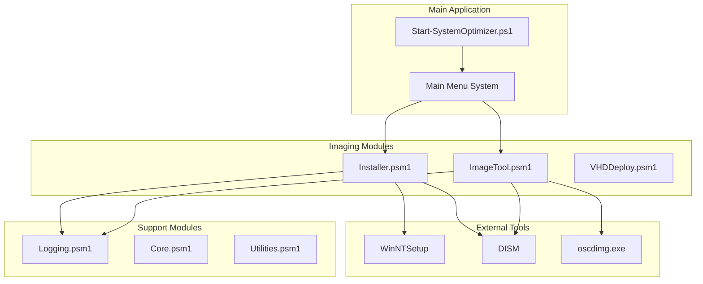
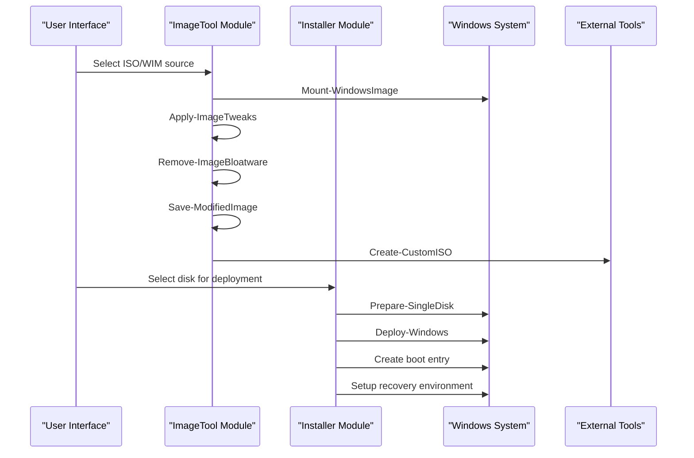
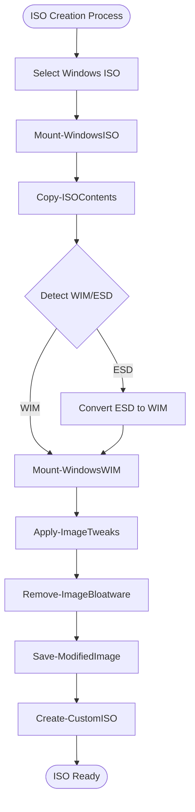
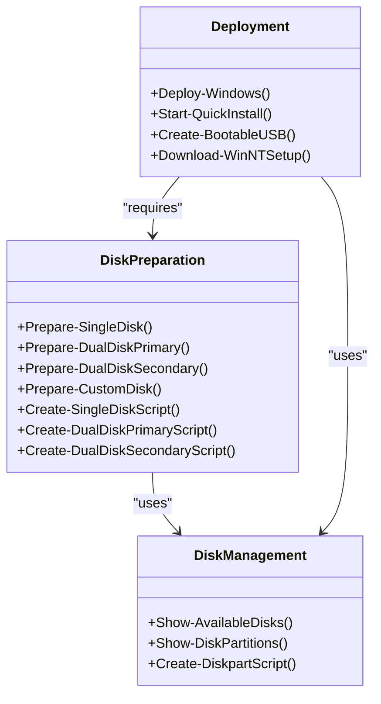
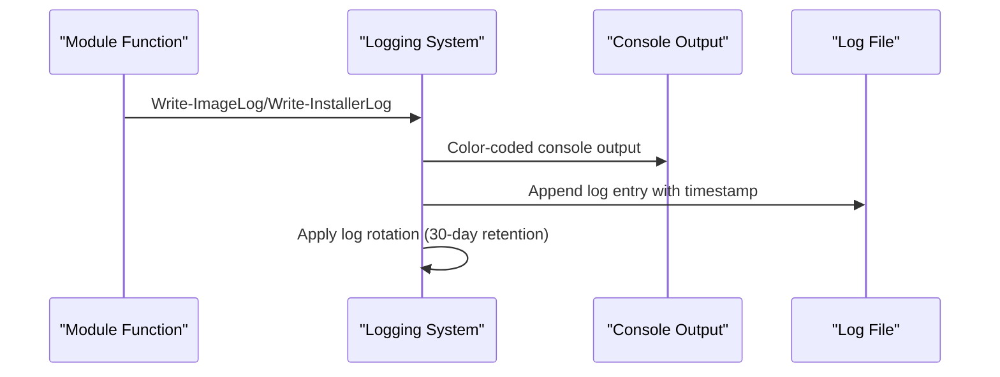
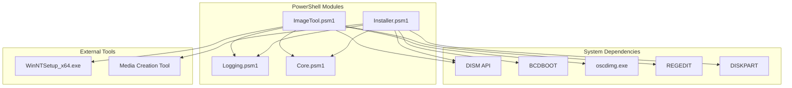

# System Imaging Modules

<cite>
**Referenced Files in This Document**
- [Start-SystemOptimizer.ps1](file://Start-SystemOptimizer.ps1)
- [ImageTool.psm1](file://modules/ImageTool.psm1)
- [Installer.psm1](file://modules/Installer.psm1)
- [Logging.psm1](file://modules/Logging.psm1)
- [Core.psm1](file://modules/Core.psm1)
</cite>

## Table of Contents
1. [Introduction](#introduction)
2. [Project Structure](#project-structure)
3. [Core Components](#core-components)
4. [Architecture Overview](#architecture-overview)
5. [Detailed Component Analysis](#detailed-component-analysis)
6. [Dependency Analysis](#dependency-analysis)
7. [Performance Considerations](#performance-considerations)
8. [Troubleshooting Guide](#troubleshooting-guide)
9. [Conclusion](#conclusion)

## Introduction
This document provides comprehensive documentation for the System Optimizer's system imaging modules focused on Windows image management and deployment operations. The documentation covers two primary modules:
- ImageTool: Windows image management including ISO creation, WIM file manipulation, image optimization, and deployment preparation
- Installer: Windows deployment system covering disk preparation, system installation procedures, partition management, and post-installation configuration

The modules integrate with the broader System Optimizer ecosystem, providing a unified interface for Windows image customization and deployment workflows.

## Project Structure
The System Optimizer project follows a modular PowerShell architecture with centralized logging and configuration management:

**Diagram sources**
- [Start-SystemOptimizer.ps1](file://Start-SystemOptimizer.ps1#L628-L894)
- [ImageTool.psm1](file://modules/ImageTool.psm1#L1-L1739)
- [Installer.psm1](file://modules/Installer.psm1#L1-L856)

**Section sources**
- [Start-SystemOptimizer.ps1](file://Start-SystemOptimizer.ps1#L1-L994)

## Core Components
The imaging modules are built around several core components that handle different aspects of Windows image management:

### ImageTool Module Components
- **ISO Management**: ISO selection, mounting, and extraction
- **WIM Image Manipulation**: Mounting, editing, and optimization
- **Image Customization**: Registry tweaks, driver injection, bloatware removal
- **Deployment Preparation**: Unattend file creation, desktop shortcuts
- **Storage Management**: Work directory configuration and cleanup

### Installer Module Components
- **Disk Preparation**: GPT/UEFI partitioning and disk formatting
- **Windows Deployment**: Image application and boot configuration
- **Post-Installation**: Recovery environment setup and automation
- **Integration Tools**: WinNTSetup launcher and utility downloads

**Section sources**
- [ImageTool.psm1](file://modules/ImageTool.psm1#L1-L1739)
- [Installer.psm1](file://modules/Installer.psm1#L1-L856)

## Architecture Overview
The imaging modules operate within a layered architecture that separates concerns between user interface, image manipulation, and system deployment:

**Diagram sources**
- [ImageTool.psm1](file://modules/ImageTool.psm1#L1456-L1587)
- [Installer.psm1](file://modules/Installer.psm1#L511-L681)

## Detailed Component Analysis

### ImageTool Module Analysis

#### ISO Creation and Management
The ImageTool module provides comprehensive ISO creation capabilities with support for both WIM and ESD formats:

**Diagram sources**
- [ImageTool.psm1](file://modules/ImageTool.psm1#L1456-L1587)

#### WIM Image Manipulation Functions
The module implements extensive WIM image manipulation capabilities:

| Function | Purpose | Parameters | Output |
|----------|---------|------------|--------|
| `Mount-WindowsWIM` | Mount WIM image for editing | `[int]$Index` | Boolean success |
| `Apply-ImageTweaks` | Apply system optimizations | `[string]$TweakType` | Registry modifications |
| `Remove-ImageBloatware` | Remove pre-installed applications | `[string]$RemovalType` | Package removal |
| `Optimize-WIMImage` | Reduce WIM file size | `[string]$OptimizationType` | Cleanup operations |
| `Save-ModifiedImage` | Persist changes to WIM | `[bool]$Cleanup` | Saved image |

#### Image Optimization Capabilities
The module provides comprehensive image optimization through multiple approaches:

**Registry-Based Optimizations:**
- Telemetry and data collection disablement
- Sponsored apps and suggestions removal
- TPM/SecureBoot bypass for testing environments
- Local account enablement during OOBE
- First logon animation skipping
- Dark theme enforcement
- Teams auto-install disabling

**File-Based Optimizations:**
- Provisioned package removal
- Windows feature disabling
- Bloatware folder deletion
- Driver injection from system or external sources

**Section sources**
- [ImageTool.psm1](file://modules/ImageTool.psm1#L449-L975)

### Installer Module Analysis

#### Disk Preparation and Partition Management
The Installer module handles comprehensive disk preparation with multiple partitioning strategies:

**Diagram sources**
- [Installer.psm1](file://modules/Installer.psm1#L327-L506)
- [Installer.psm1](file://modules/Installer.psm1#L511-L733)

#### Windows Deployment Workflows
The module implements flexible deployment workflows supporting various scenarios:

**Standard Deployment Process:**
1. Disk preparation with GPT/UEFI partitioning
2. Windows image application using Expand-WindowsImage
3. Boot entry creation with BCDBOOT
4. Recovery environment setup
5. Post-installation automation

**Quick Install Workflow:**
- Automated disk preparation and deployment
- Single-step process for streamlined installation
- Built-in error handling and rollback capabilities

**Section sources**
- [Installer.psm1](file://modules/Installer.psm1#L511-L733)

### Integration with System Optimizer Framework

#### Logging and Progress Tracking
Both modules integrate with the System Optimizer's centralized logging system:

**Diagram sources**
- [Logging.psm1](file://modules/Logging.psm1#L68-L123)
- [ImageTool.psm1](file://modules/ImageTool.psm1#L71-L90)
- [Installer.psm1](file://modules/Installer.psm1#L43-L60)

#### Configuration Management
The modules utilize a shared configuration system for persistent settings:

**Configuration Options:**
- Work directory locations for ISO and WIM processing
- Log file management and retention policies
- Console window sizing preferences
- Module-specific settings for optimization levels

**Section sources**
- [ImageTool.psm1](file://modules/ImageTool.psm1#L53-L70)
- [Logging.psm1](file://modules/Logging.psm1#L13-L16)

## Dependency Analysis

### Module Dependencies
The imaging modules depend on several system components and external tools:

**Diagram sources**
- [ImageTool.psm1](file://modules/ImageTool.psm1#L1-L1739)
- [Installer.psm1](file://modules/Installer.psm1#L1-L856)

### External Tool Integration
The modules integrate with several external tools for enhanced functionality:

**Required Tools:**
- **DISM**: Windows Imaging and Configuration Management
- **BCDBOOT**: Boot configuration database management
- **oscdimg**: ISO creation utility
- **REGEDIT**: Registry modification for image customization

**Optional Tools:**
- **WinNTSetup**: Graphical Windows installation tool
- **Media Creation Tool**: Official Microsoft Windows ISO creation
- **DISM++**: Third-party image optimization utilities

**Section sources**
- [ImageTool.psm1](file://modules/ImageTool.psm1#L1376-L1393)
- [Installer.psm1](file://modules/Installer.psm1#L738-L798)

## Performance Considerations

### Storage Requirements
The imaging modules require significant disk space for temporary operations:

**Minimum Requirements:**
- **Work Directory**: 20-50 GB depending on Windows version
- **ISO Extraction**: 5-15 GB for Windows ISO contents
- **WIM Processing**: Additional 5-10 GB for mounted images
- **Temporary Files**: 2-5 GB for optimization and cleanup

**Optimization Strategies:**
- SSD work directories for improved performance
- Temporary file cleanup after operations
- Incremental optimization to reduce processing time

### Processing Time Expectations
- **ISO Creation**: 10-30 minutes depending on ISO size and compression
- **Image Mounting**: 2-5 minutes for typical Windows images
- **Bloatware Removal**: 5-15 minutes depending on package count
- **WIM Optimization**: 15-45 minutes for full cleanup operations
- **Windows Deployment**: 15-30 minutes for standard installation

### Memory and CPU Usage
- **Peak Memory**: 1-2 GB during large image operations
- **CPU Utilization**: 50-80% during compression and optimization
- **I/O Operations**: High during ISO creation and deployment

## Troubleshooting Guide

### Common Issues and Solutions

#### ISO Mounting Failures
**Symptoms:** Unable to mount Windows ISO files
**Causes:** Corrupted ISO, insufficient permissions, antivirus interference
**Solutions:**
- Verify ISO integrity using checksum verification
- Run as Administrator to ensure proper permissions
- Temporarily disable antivirus during mounting operations
- Use alternative ISO mounting tools if PowerShell fails

#### WIM Image Corruption
**Symptoms:** DISM errors during image operations
**Causes:** Interrupted operations, insufficient disk space, corrupted source images
**Solutions:**
- Use `dism /image:$Path /Cleanup-Image /AnalyzeComponentStore` to diagnose issues
- Perform full cleanup with `ResetBase` if necessary
- Ensure adequate disk space (minimum 2x image size for operations)
- Recreate WIM from original ISO if corruption persists

#### Deployment Failures
**Symptoms:** Windows installation hangs or fails during boot
**Causes:** Incorrect partitioning, missing boot files, incompatible drivers
**Solutions:**
- Verify GPT/UEFI compatibility with target system
- Ensure proper EFI system partition creation (100 MB FAT32)
- Check boot entry creation with BCDBOOT
- Validate driver compatibility for target hardware

#### Performance Issues
**Symptoms:** Slow operations, high memory usage
**Causes:** Insufficient system resources, large images, inefficient workflows
**Solutions:**
- Move work directories to SSD for improved performance
- Use incremental optimization instead of full cleanup
- Close unnecessary applications during operations
- Monitor system resources during long-running operations

**Section sources**
- [ImageTool.psm1](file://modules/ImageTool.psm1#L1395-L1450)
- [Installer.psm1](file://modules/Installer.psm1#L128-L170)

## Conclusion
The System Optimizer's imaging modules provide comprehensive Windows image management and deployment capabilities through a well-structured, modular architecture. The ImageTool module excels at ISO creation, WIM manipulation, and image customization, while the Installer module offers robust deployment solutions with flexible partitioning options.

Key strengths of the implementation include:
- **Modular Design**: Clean separation of concerns between image management and deployment
- **Comprehensive Logging**: Detailed operation tracking with automatic cleanup
- **Flexible Workflows**: Multiple approaches to meet diverse deployment scenarios
- **External Tool Integration**: Seamless integration with industry-standard Windows tools
- **Performance Optimization**: Efficient resource utilization and progress tracking

The modules are suitable for both individual users and enterprise environments, providing the flexibility to customize Windows installations while maintaining system reliability and performance. The comprehensive error handling and troubleshooting capabilities ensure reliable operation across diverse hardware configurations.

Future enhancements could include expanded Windows version support, automated testing frameworks, and enhanced integration with cloud-based deployment scenarios.