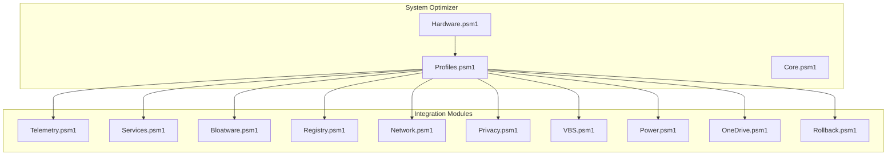
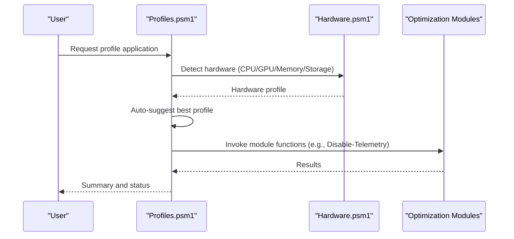
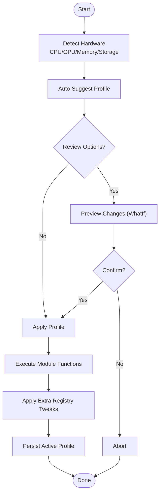
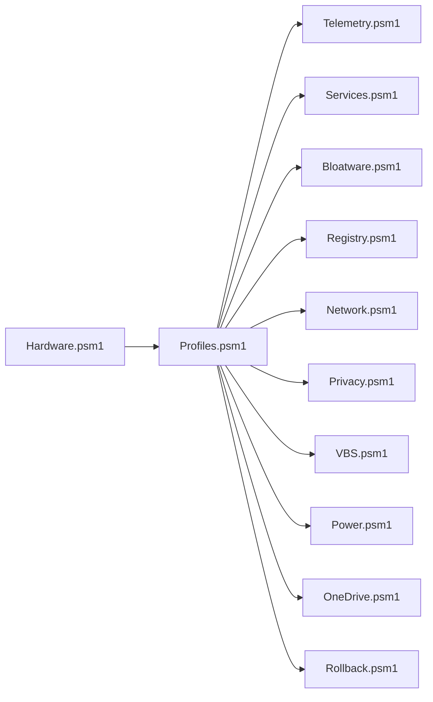

# System Intelligence Modules

<cite>
**Referenced Files in This Document**
- [README.md](file://README.md)
- [docs/STRUCTURE.md](file://docs/STRUCTURE.md)
- [modules/Profiles.psm1](file://modules/Profiles.psm1)
- [modules/Hardware.psm1](file://modules/Hardware.psm1)
- [modules/Core.psm1](file://modules/Core.psm1)
</cite>

## Table of Contents
1. [Introduction](#introduction)
2. [Project Structure](#project-structure)
3. [Core Components](#core-components)
4. [Architecture Overview](#architecture-overview)
5. [Detailed Component Analysis](#detailed-component-analysis)
6. [Dependency Analysis](#dependency-analysis)
7. [Performance Considerations](#performance-considerations)
8. [Troubleshooting Guide](#troubleshooting-guide)
9. [Conclusion](#conclusion)
10. [Appendices](#appendices)

## Introduction
This document explains the System Optimizer’s system intelligence modules that provide automated system analysis and optimization recommendations. It focuses on:
- Profiles module: optimization profiles system including hardware detection, preset configurations, and automatic optimization selection
- Hardware module: system analysis capabilities covering CPU detection, memory assessment, storage evaluation, and compatibility checking

It provides function documentation with parameter specifications, detection algorithms, and recommendation logic, along with practical examples and integration guidance.

## Project Structure
The System Optimizer is organized into modular PowerShell modules. The Profiles and Hardware modules are part of the “Advanced” category and integrate with other optimization modules to apply targeted recommendations.

**Diagram sources**
- [docs/STRUCTURE.md](file://docs/STRUCTURE.md#L80-L97)
- [modules/Profiles.psm1](file://modules/Profiles.psm1#L365-L648)
- [modules/Hardware.psm1](file://modules/Hardware.psm1#L1296-L1319)

**Section sources**
- [README.md](file://README.md#L34-L46)
- [docs/STRUCTURE.md](file://docs/STRUCTURE.md#L38-L97)

## Core Components
- Profiles module: Defines preset optimization profiles, auto-suggests the best profile based on hardware, and applies selected profiles by invoking existing optimization modules.
- Hardware module: Detects CPU, GPU, memory, and storage; generates recommendations; and exposes helper functions for compatibility checks.

Key responsibilities:
- Profiles: profile definitions, suggestion engine, action orchestration, interactive menu, active profile persistence
- Hardware: cross-platform WMI compatibility, detailed hardware parsing, recommendations, export utilities

**Section sources**
- [modules/Profiles.psm1](file://modules/Profiles.psm1#L18-L201)
- [modules/Hardware.psm1](file://modules/Hardware.psm1#L48-L1320)

## Architecture Overview
The Profiles module orchestrates optimization by delegating to existing modules. The Hardware module supplies the intelligence for automatic profile selection and displays system insights.

**Diagram sources**
- [modules/Profiles.psm1](file://modules/Profiles.psm1#L246-L319)
- [modules/Hardware.psm1](file://modules/Hardware.psm1#L915-L1045)

## Detailed Component Analysis

### Profiles Module

#### Profile Definitions and Presets
- Six built-in profiles: Gaming, Developer, Office, ContentCreator, Laptop, LowSpec
- Each profile defines:
  - Actions: which module functions to run and with what parameters
  - ExtraRegistry: additional registry tweaks beyond module defaults
  - Requirements: minimum RAM, dedicated GPU requirement, recommended use cases

Detection and suggestion logic:
- Auto-suggestion considers RAM, CPU cores, laptop vs. desktop, and dedicated GPU presence
- Fallback to default profile if hardware detection is unavailable

Application workflow:
- Validates profile existence
- Optionally previews changes (WhatIf)
- Confirms unless forced
- Starts rollback session if available
- Iterates through actions, invoking corresponding module functions
- Applies extra registry tweaks
- Saves active profile

Interactive menu:
- Lists profiles with icons/colors
- Shows suggested profile and hardware summary
- Supports details, comparison, preview, and application

Practical examples:
- Apply a profile: call the profile application function with the desired profile name
- Preview changes: use the WhatIf switch to list planned actions without applying
- Compare profiles: compare two profiles side-by-side to understand differences
- View details: inspect a profile’s requirements and actions

Configuration options:
- Profiles directory and active profile file path are configurable
- Profiles can be extended or customized by adding new entries to the presets dictionary

Integration with other modules:
- Calls module functions such as Disable-Telemetry, Disable-Services, DebloatBlacklist/DebloatAll, Set-RegistryOptimizations, Set-NetworkOptimizations, Protect-Privacy, Disable-VBS, Set-PowerPlan, Remove-OneDrive
- Uses rollback session management when available

**Section sources**
- [modules/Profiles.psm1](file://modules/Profiles.psm1#L18-L201)
- [modules/Profiles.psm1](file://modules/Profiles.psm1#L246-L319)
- [modules/Profiles.psm1](file://modules/Profiles.psm1#L365-L648)
- [modules/Profiles.psm1](file://modules/Profiles.psm1#L776-L895)

#### Function Documentation

- Get-ProfileList
  - Purpose: Retrieve a list of available profiles with metadata
  - Parameters: none
  - Output: list of profile summaries (name, description, icon, color, min RAM, GPU requirement, recommended for)
  - Complexity: O(P) where P is number of profiles

- Get-Profile
  - Purpose: Retrieve a specific profile by name or alias
  - Parameters: Name (mandatory)
  - Output: profile definition or null if not found

- Get-SuggestedProfile
  - Purpose: Auto-suggest best profile based on hardware detection
  - Parameters: none
  - Output: suggestion object with profile name, reason, and detected hardware metrics
  - Algorithm: evaluates RAM, laptop vs. desktop, dedicated GPU, CPU cores; falls back to default if detection fails

- Get-ActiveProfile/Set-ActiveProfile
  - Purpose: Persist and retrieve the last applied profile
  - Parameters: Set-ActiveProfile requires Name
  - Output: active profile object or null

- Set-OptimizationProfile
  - Purpose: Apply a profile by invoking existing module functions
  - Parameters: Name (mandatory), WhatIf, Force
  - Behavior: validates profile, optionally previews, confirms unless forced, invokes module functions, applies extra registry tweaks, manages rollback session, persists active profile
  - Output: boolean success indicator

- Show-ProfileActions
  - Purpose: Display what a profile will do
  - Parameters: ProfileData
  - Output: formatted list of actions and extras

- Show-ProfileDetails
  - Purpose: Show detailed settings for a profile
  - Parameters: Name (mandatory)
  - Output: formatted profile details including requirements and actions

- Compare-Profiles
  - Purpose: Compare two profiles side by side
  - Parameters: Profile1, Profile2
  - Output: formatted comparison table

- Show-ProfileMenu
  - Purpose: Interactive menu for profile selection
  - Parameters: none
  - Features: lists profiles, shows suggested and active, hardware summary, details, comparison, preview, application

**Section sources**
- [modules/Profiles.psm1](file://modules/Profiles.psm1#L206-L244)
- [modules/Profiles.psm1](file://modules/Profiles.psm1#L246-L319)
- [modules/Profiles.psm1](file://modules/Profiles.psm1#L321-L360)
- [modules/Profiles.psm1](file://modules/Profiles.psm1#L365-L648)
- [modules/Profiles.psm1](file://modules/Profiles.psm1#L650-L681)
- [modules/Profiles.psm1](file://modules/Profiles.psm1#L686-L721)
- [modules/Profiles.psm1](file://modules/Profiles.psm1#L722-L771)
- [modules/Profiles.psm1](file://modules/Profiles.psm1#L776-L895)

### Hardware Module

#### Hardware Detection Capabilities
- CPU detection:
  - Identifies manufacturer, generation, architecture, core/thread counts, hybrid P/E cores, hyperthreading, virtualization support
  - Parses CPU names to infer generations and architectures for Intel and AMD
  - Uses hybrid core detection for Alder Lake and newer Intel CPUs

- GPU detection:
  - Identifies manufacturer, series, architecture, dedicated vs. integrated, VRAM, driver info
  - Handles >4GB VRAM via registry parsing
  - Detects NVIDIA RTX series, AMD RX series, Intel Arc/Iris/UHD/HD families

- Storage detection:
  - Modern path: uses Storage module (Windows 8+) for SSD/HDD/NVMe detection, health, TRIM support, volumes
  - Legacy path: WMI fallback for Windows 7/PowerShell 2.0 compatibility
  - Determines device type by MediaType, BusType, and heuristics

- Memory detection:
  - Aggregates total capacity, sticks, speeds, types (DDR/DDR2/DDR3/DDR4/DDR5), channels
  - Estimates dual/quad channel configuration
  - Detects XMP/DOCP potential based on configured vs. JEDEC speeds

- Recommendations:
  - Generates actionable recommendations based on detected hardware (CPU, GPU, storage, memory)
  - Flags warnings for low RAM, high usage, unhealthy drives, low free space, TRIM disabled, single-channel RAM

- Helper functions:
  - Test-IsGamingCapable: checks for dedicated GPU with sufficient VRAM
  - Test-IsLaptop: detects battery presence
  - Test-HasSSD/Test-HasNVMe: checks boot drive type
  - Get-RecommendedProfile: suggests a profile based on hardware

Practical examples:
- Show hardware summary: prints formatted CPU, GPU, storage, memory, and recommendations
- Export hardware profile: writes a JSON snapshot for later analysis
- Get hardware profile: returns structured data for programmatic use

Configuration options:
- Cross-platform compatibility via a WMI wrapper that selects Get-CimInstance or Get-WmiObject depending on PowerShell version
- Registry-based VRAM extraction for drivers that report incorrect values via WMI

Integration with Profiles:
- Provides hardware metrics used by Profiles module for auto-suggestion
- Supplies helper functions consumed by Profiles module during profile application

**Section sources**
- [modules/Hardware.psm1](file://modules/Hardware.psm1#L48-L243)
- [modules/Hardware.psm1](file://modules/Hardware.psm1#L245-L314)
- [modules/Hardware.psm1](file://modules/Hardware.psm1#L319-L493)
- [modules/Hardware.psm1](file://modules/Hardware.psm1#L495-L534)
- [modules/Hardware.psm1](file://modules/Hardware.psm1#L539-L810)
- [modules/Hardware.psm1](file://modules/Hardware.psm1#L815-L909)
- [modules/Hardware.psm1](file://modules/Hardware.psm1#L915-L1045)
- [modules/Hardware.psm1](file://modules/Hardware.psm1#L1050-L1184)
- [modules/Hardware.psm1](file://modules/Hardware.psm1#L1186-L1208)
- [modules/Hardware.psm1](file://modules/Hardware.psm1#L1213-L1291)

#### Function Documentation

- Get-CPUInfo
  - Purpose: Detect CPU manufacturer, model, cores, threads, hybrid architecture, hyperthreading, virtualization
  - Parameters: none
  - Output: PSCustomObject with CPU details
  - Notes: Uses manufacturer-specific parsing and hybrid core detection

- Get-HybridCoreInfo
  - Purpose: Detect P-cores and E-cores on Intel hybrid CPUs
  - Parameters: none
  - Output: PSCustomObject with core counts and identifiers

- Get-GPUInfo
  - Purpose: Detect GPU(s), manufacturer, VRAM, driver info, series/architecture
  - Parameters: none
  - Output: Array of GPU details
  - Notes: Handles >4GB VRAM via registry parsing

- Get-DedicatedVRAMFromRegistry
  - Purpose: Extract VRAM and additional GPU info from registry
  - Parameters: AdapterName
  - Output: Hashtable with VRAM, BIOS, chip type

- Get-StorageInfo
  - Purpose: Detect storage devices, type, health, free space
  - Parameters: none
  - Output: Array of storage details
  - Notes: Chooses modern or legacy path based on OS version

- Get-StorageInfoModern
  - Purpose: Modern storage detection using Storage module
  - Parameters: none
  - Output: Array of storage details with TRIM support and volume mapping

- Get-StorageInfoLegacy
  - Purpose: Legacy storage detection using WMI
  - Parameters: none
  - Output: Array of storage details with heuristics for SSD/HDD/NVMe

- Get-MemoryInfo
  - Purpose: Detect RAM amount, speed, configuration, channel mode
  - Parameters: none
  - Output: PSCustomObject with memory details
  - Notes: Estimates XMP/DOCP potential

- Get-HardwareProfile
  - Purpose: Get complete hardware profile for the system
  - Parameters: none
  - Output: PSCustomObject with CPU, GPUs, Storage, Memory, recommendations

- Get-HardwareRecommendation
  - Purpose: Generate optimization recommendations based on detected hardware
  - Parameters: CPU, GPU, Storage, Memory
  - Output: Array of recommendation strings

- Show-HardwareSummary
  - Purpose: Display a formatted hardware summary
  - Parameters: Detailed (optional)
  - Output: Formatted console output; returns structured data if Detailed is set

- Export-HardwareProfile
  - Purpose: Export hardware profile to JSON file
  - Parameters: Path (default C:\System_Optimizer\hardware_profile.json)
  - Output: Path to exported file

- Test-IsGamingCapable
  - Purpose: Check if system has dedicated GPU suitable for gaming
  - Parameters: none
  - Output: Boolean

- Test-IsLaptop
  - Purpose: Detect if system is a laptop (has battery)
  - Parameters: none
  - Output: Boolean

- Test-HasSSD/Test-HasNVMe
  - Purpose: Check boot drive or any NVMe storage presence
  - Parameters: none
  - Output: Boolean

- Get-RecommendedProfile
  - Purpose: Suggest an optimization profile based on hardware
  - Parameters: none
  - Output: String profile name

**Section sources**
- [modules/Hardware.psm1](file://modules/Hardware.psm1#L48-L243)
- [modules/Hardware.psm1](file://modules/Hardware.psm1#L245-L314)
- [modules/Hardware.psm1](file://modules/Hardware.psm1#L319-L493)
- [modules/Hardware.psm1](file://modules/Hardware.psm1#L495-L534)
- [modules/Hardware.psm1](file://modules/Hardware.psm1#L539-L810)
- [modules/Hardware.psm1](file://modules/Hardware.psm1#L815-L909)
- [modules/Hardware.psm1](file://modules/Hardware.psm1#L915-L1045)
- [modules/Hardware.psm1](file://modules/Hardware.psm1#L1050-L1184)
- [modules/Hardware.psm1](file://modules/Hardware.psm1#L1186-L1208)
- [modules/Hardware.psm1](file://modules/Hardware.psm1#L1213-L1291)

### Conceptual Overview
The Profiles and Hardware modules collaborate to deliver intelligent optimization:
- Hardware module gathers system facts
- Profiles module interprets facts and selects optimal presets
- Profiles module executes the chosen optimizations by invoking existing modules
- Users can preview, compare, and interactively select profiles

[No sources needed since this diagram shows conceptual workflow, not actual code structure]

## Dependency Analysis
- Profiles module depends on Hardware module for auto-suggestion and on existing optimization modules for profile application
- Hardware module depends on WMI/CIM cmdlets and registry for cross-platform compatibility
- Both modules export functions for use by other modules and the main application

**Diagram sources**
- [modules/Profiles.psm1](file://modules/Profiles.psm1#L365-L648)
- [modules/Hardware.psm1](file://modules/Hardware.psm1#L1296-L1319)

**Section sources**
- [modules/Profiles.psm1](file://modules/Profiles.psm1#L365-L648)
- [modules/Hardware.psm1](file://modules/Hardware.psm1#L1296-L1319)

## Performance Considerations
- Hardware detection uses WMI/CIM queries; on older systems, legacy WMI fallbacks are used to maintain compatibility
- CPU and GPU parsing involves string matching and registry reads; generally lightweight but can be slower on systems with many GPUs or complex naming
- Storage detection prefers modern APIs on Windows 8+; legacy path adds overhead due to manual mapping
- Memory detection aggregates multiple WMI instances; typically fast but depends on installed memory modules
- Profiles application iterates through actions and invokes module functions; rollback session management adds minimal overhead
- Recommendations generation is linear in the number of detected components

[No sources needed since this section provides general guidance]

## Troubleshooting Guide
Common issues and resolutions:
- Hardware detection failures:
  - Symptoms: null or partial hardware info, warnings
  - Causes: missing WMI, restricted permissions, unsupported hardware
  - Resolution: run as Administrator, ensure WMI service is running, use modern OS with Storage module if possible

- Profile application errors:
  - Symptoms: individual actions fail or are skipped
  - Causes: module not loaded, insufficient privileges, conflicting settings
  - Resolution: verify module availability, run with elevated privileges, review WhatIf output, confirm before applying

- Auto-suggestion not matching expectations:
  - Symptoms: unexpected profile selection
  - Causes: insufficient RAM reported, missing dedicated GPU detection, hybrid CPU misclassification
  - Resolution: manually select profile, adjust hardware assumptions, verify VRAM and GPU detection

- Registry tweak failures:
  - Symptoms: extra registry tweaks not applied
  - Causes: permission denied, invalid registry paths
  - Resolution: run as Administrator, verify registry paths, check for conflicts

**Section sources**
- [modules/Hardware.psm1](file://modules/Hardware.psm1#L17-L43)
- [modules/Profiles.psm1](file://modules/Profiles.psm1#L432-L630)

## Conclusion
The Profiles and Hardware modules form the intelligence backbone of System Optimizer. Hardware module delivers robust, cross-platform system detection, while Profiles module transforms hardware insights into actionable, preset-driven optimizations. Together, they enable automated, safe, and user-friendly system tuning tailored to the underlying hardware.

[No sources needed since this section summarizes without analyzing specific files]

## Appendices

### Practical Examples

- Apply a profile
  - Steps: select profile via interactive menu or call the application function with the profile name; confirm unless forced; observe summary
  - References: [modules/Profiles.psm1](file://modules/Profiles.psm1#L776-L895), [modules/Profiles.psm1](file://modules/Profiles.psm1#L365-L648)

- Preview changes
  - Steps: use WhatIf switch to list planned actions without applying; review and confirm
  - References: [modules/Profiles.psm1](file://modules/Profiles.psm1#L401-L406), [modules/Profiles.psm1](file://modules/Profiles.psm1#L650-L681)

- Compare profiles
  - Steps: compare two profiles side-by-side to understand differences in actions and settings
  - References: [modules/Profiles.psm1](file://modules/Profiles.psm1#L722-L771)

- Show hardware summary
  - Steps: display formatted CPU, GPU, storage, memory, and recommendations
  - References: [modules/Hardware.psm1](file://modules/Hardware.psm1#L1050-L1184)

- Export hardware profile
  - Steps: export JSON snapshot for later analysis or sharing
  - References: [modules/Hardware.psm1](file://modules/Hardware.psm1#L1186-L1208)

- Integration with other modules
  - Steps: Profiles module invokes existing modules (Telemetry, Services, Bloatware, Registry, Network, Privacy, VBS, Power, OneDrive) during profile application
  - References: [modules/Profiles.psm1](file://modules/Profiles.psm1#L432-L630), [docs/STRUCTURE.md](file://docs/STRUCTURE.md#L48-L87)

### Configuration Options
- Profiles module
  - Profiles directory and active profile file path are configurable constants
  - Profiles presets can be extended or customized by adding new entries
  - References: [modules/Profiles.psm1](file://modules/Profiles.psm1#L11-L12), [modules/Profiles.psm1](file://modules/Profiles.psm1#L18-L201)

- Hardware module
  - Cross-platform compatibility via WMI wrapper
  - Registry-based VRAM extraction for drivers reporting incorrect values
  - References: [modules/Hardware.psm1](file://modules/Hardware.psm1#L17-L43), [modules/Hardware.psm1](file://modules/Hardware.psm1#L495-L534)

### Performance Impact Considerations
- Hardware detection is generally lightweight but can be slower on systems with many GPUs or complex naming
- Storage detection prefers modern APIs on Windows 8+; legacy path adds overhead
- Profiles application iterates through actions and invokes module functions; rollback session management adds minimal overhead
- Recommendations generation is linear in the number of detected components

[No sources needed since this section provides general guidance]