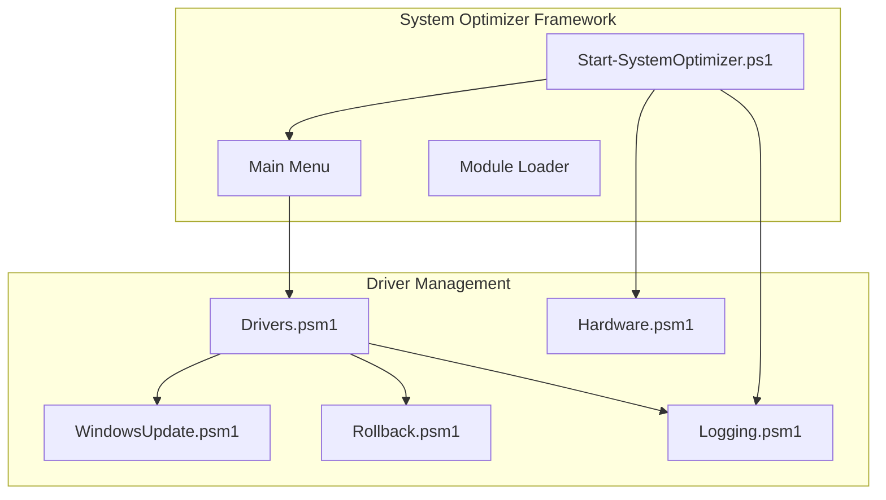
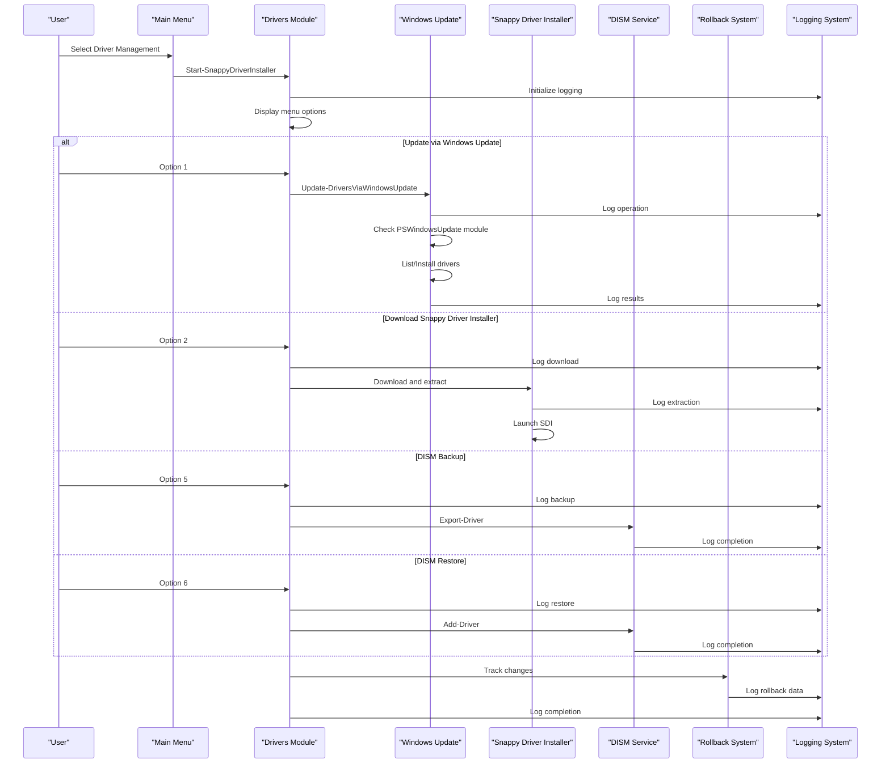
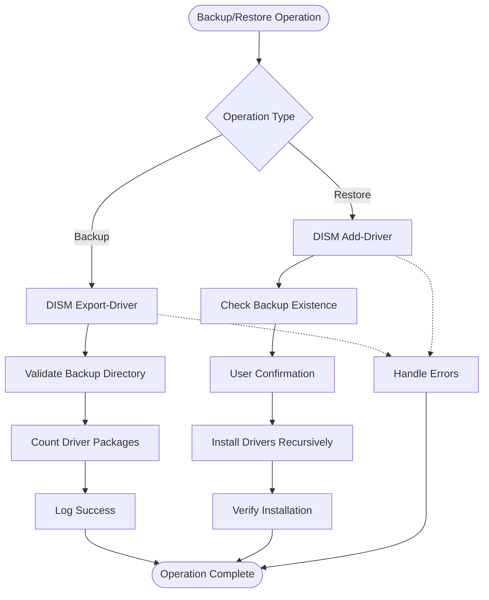
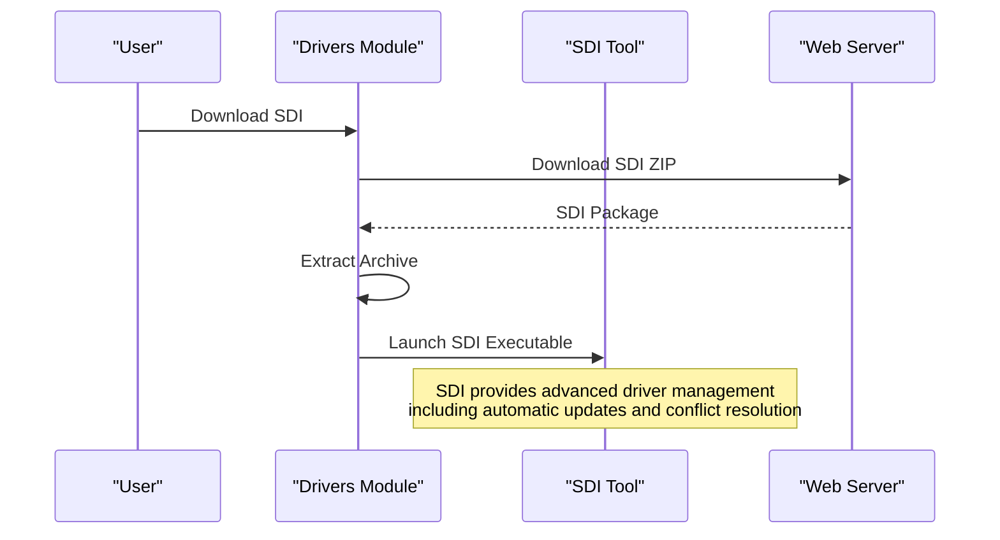
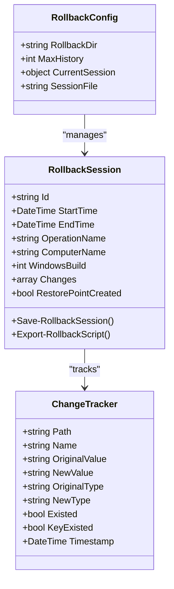
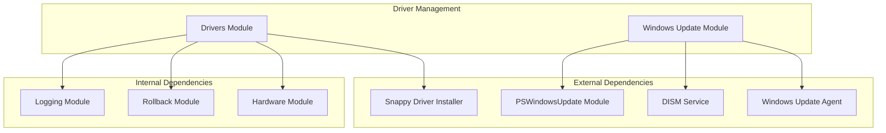
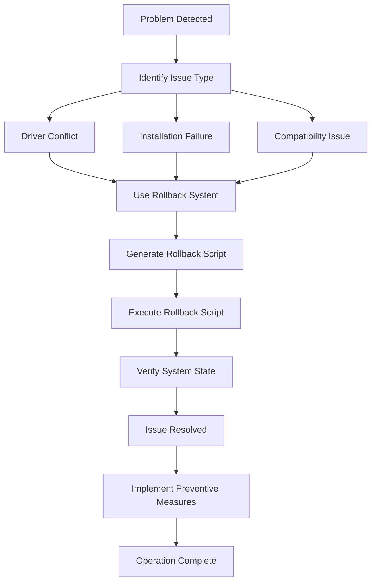

# Driver Management

<cite>
**Referenced Files in This Document**
- [Drivers.psm1](file://modules/Drivers.psm1)
- [WindowsUpdate.psm1](file://modules/WindowsUpdate.psm1)
- [Rollback.psm1](file://modules/Rollback.psm1)
- [Logging.psm1](file://modules/Logging.psm1)
- [Hardware.psm1](file://modules/Hardware.psm1)
- [Start-SystemOptimizer.ps1](file://Start-SystemOptimizer.ps1)
</cite>

## Table of Contents
1. [Introduction](#introduction)
2. [Project Structure](#project-structure)
3. [Core Components](#core-components)
4. [Architecture Overview](#architecture-overview)
5. [Detailed Component Analysis](#detailed-component-analysis)
6. [Dependency Analysis](#dependency-analysis)
7. [Performance Considerations](#performance-considerations)
8. [Troubleshooting Guide](#troubleshooting-guide)
9. [Conclusion](#conclusion)

## Introduction
This document provides comprehensive documentation for the Driver Management module within the System Optimizer toolkit. The module focuses on driver installation, update procedures, and driver backup/restore functionality. It covers driver detection algorithms, automatic driver installation processes, driver signature verification, and rollback procedures. The documentation includes function documentation for driver package management, hardware compatibility checks, and driver database operations. It also explains integration with Windows Update driver service, third-party driver sources, and enterprise driver management systems, along with practical examples and troubleshooting guidance.

## Project Structure
The Driver Management module is organized as a PowerShell module that integrates with the broader System Optimizer framework. The module provides a menu-driven interface for managing drivers, with options for Windows Update integration, third-party driver sources, and DISM-based backup/restore operations.

**Diagram sources**
- [Start-SystemOptimizer.ps1](file://Start-SystemOptimizer.ps1#L824-L894)
- [Drivers.psm1](file://modules/Drivers.psm1#L1-L176)
- [WindowsUpdate.psm1](file://modules/WindowsUpdate.psm1#L1-L382)

**Section sources**
- [Start-SystemOptimizer.ps1](file://Start-SystemOptimizer.ps1#L824-L894)
- [Drivers.psm1](file://modules/Drivers.psm1#L1-L176)

## Core Components
The Driver Management module consists of several key components that work together to provide comprehensive driver management functionality:

### Driver Management Module (Drivers.psm1)
The primary module responsible for driver operations, including:
- Interactive driver management menu
- Windows Update integration
- Third-party driver source integration
- DISM-based backup and restore operations
- Snappy Driver Installer integration

### Windows Update Integration (WindowsUpdate.psm1)
Provides driver update capabilities through Windows Update, including:
- Driver discovery and listing
- Automated driver installation
- Windows Update repair functionality
- Integration with PSWindowsUpdate module

### Rollback System (Rollback.psm1)
Comprehensive rollback functionality for driver operations:
- Automatic change tracking
- Registry and service state backup
- Scheduled task state management
- Automated rollback script generation

### Hardware Detection (Hardware.psm1)
Hardware compatibility checking and detection:
- CPU, GPU, storage, and memory detection
- Hardware profiling for optimization recommendations
- Compatibility assessment for driver installations

### Logging System (Logging.psm1)
Centralized logging for all driver operations:
- Structured logging with severity levels
- Operation timing and completion tracking
- Error reporting and debugging support

**Section sources**
- [Drivers.psm1](file://modules/Drivers.psm1#L1-L176)
- [WindowsUpdate.psm1](file://modules/WindowsUpdate.psm1#L1-L382)
- [Rollback.psm1](file://modules/Rollback.psm1#L1-L1339)
- [Hardware.psm1](file://modules/Hardware.psm1#L1-L1320)
- [Logging.psm1](file://modules/Logging.psm1#L1-L285)

## Architecture Overview
The Driver Management system follows a modular architecture with clear separation of concerns:

**Diagram sources**
- [Drivers.psm1](file://modules/Drivers.psm1#L5-L170)
- [WindowsUpdate.psm1](file://modules/WindowsUpdate.psm1#L202-L245)
- [Rollback.psm1](file://modules/Rollback.psm1#L29-L78)

## Detailed Component Analysis

### Driver Management Module (Drivers.psm1)
The core driver management functionality provides a comprehensive interface for various driver operations:

#### Main Menu Interface
The module presents a structured menu with the following options:
- **Update via Windows Update**: Recommended approach using built-in Windows Update mechanisms
- **Download Snappy Driver Installer Lite**: Third-party driver management tool integration
- **SDI Auto-Update**: Automated driver update using NexTool methodology
- **Open SDI download page**: Direct access to official Snappy Driver Installer resources
- **Backup current drivers (DISM)**: Systematic driver backup using DISM
- **Restore drivers from backup**: Restoration of previously backed up drivers

#### Driver Backup and Restore Operations
The DISM-based backup system provides robust driver management:

**Diagram sources**
- [Drivers.psm1](file://modules/Drivers.psm1#L112-L159)

#### Third-Party Driver Integration
The module integrates with Snappy Driver Installer (SDI) for enhanced driver management:

**Diagram sources**
- [Drivers.psm1](file://modules/Drivers.psm1#L38-L104)

**Section sources**
- [Drivers.psm1](file://modules/Drivers.psm1#L1-L176)

### Windows Update Integration (WindowsUpdate.psm1)
The Windows Update integration provides comprehensive driver update capabilities:

#### Driver Update Categories
The system supports targeted driver updates through Windows Update categories:
- **Driver Discovery**: Identifies available driver updates for the system
- **Automated Installation**: Installs driver updates without requiring manual intervention
- **Category Filtering**: Focuses specifically on driver-related updates

#### PSWindowsUpdate Integration
The module leverages the PSWindowsUpdate PowerShell module for enhanced functionality:
- Automatic module installation and configuration
- Category-based update filtering
- Flexible installation options (with/without reboot)

#### Windows Update Repair
Comprehensive repair functionality for Windows Update components:
- Quick repair: Stops services, clears cache, restarts components
- Full repair: Re-registers DLLs, resets components, performs deep cleanup

**Section sources**
- [WindowsUpdate.psm1](file://modules/WindowsUpdate.psm1#L202-L245)
- [WindowsUpdate.psm1](file://modules/WindowsUpdate.psm1#L247-L371)

### Rollback System (Rollback.psm1)
The rollback system provides comprehensive change tracking and recovery:

#### Change Tracking Architecture
The rollback system tracks changes across multiple system areas:
- **Registry Modifications**: Automatic backup and restoration of registry values
- **Service State Changes**: Tracking and restoration of service configurations
- **Scheduled Task Modifications**: Management of scheduled task states
- **File System Changes**: Tracking of file and directory modifications

#### Automatic Rollback Script Generation
The system generates automated rollback scripts that can restore the system to its previous state:

**Diagram sources**
- [Rollback.psm1](file://modules/Rollback.psm1#L10-L78)
- [Rollback.psm1](file://modules/Rollback.psm1#L149-L203)

**Section sources**
- [Rollback.psm1](file://modules/Rollback.psm1#L1-L1339)

### Hardware Detection Integration (Hardware.psm1)
The hardware detection system provides essential compatibility information:

#### Multi-Platform Compatibility
The hardware detection system maintains compatibility across different PowerShell versions and Windows platforms:
- **PowerShell 2.0/3.0+ Compatibility**: Uses fallback mechanisms for older systems
- **Windows 7/8/10/11 Support**: Comprehensive hardware detection across all supported versions
- **WMI/CIM Integration**: Uses modern CIM cmdlets when available, falls back to WMI for compatibility

#### Hardware Profiling
The system provides detailed hardware profiling for optimization recommendations:
- **CPU Detection**: Manufacturer identification, generation detection, hybrid architecture support
- **GPU Detection**: Vendor identification, VRAM detection, driver version tracking
- **Storage Detection**: Drive type detection, health monitoring, TRIM support detection
- **Memory Detection**: Capacity detection, speed detection, configuration analysis

**Section sources**
- [Hardware.psm1](file://modules/Hardware.psm1#L1-L1320)

## Dependency Analysis
The Driver Management module has well-defined dependencies that ensure modularity and maintainability:

**Diagram sources**
- [Drivers.psm1](file://modules/Drivers.psm1#L1-L176)
- [WindowsUpdate.psm1](file://modules/WindowsUpdate.psm1#L1-L382)

### Module Interdependencies
The driver management system relies on several internal modules for comprehensive functionality:
- **Logging Integration**: All operations are logged consistently for troubleshooting
- **Rollback Coordination**: Automatic change tracking for recovery operations
- **Hardware Compatibility**: Hardware detection ensures driver compatibility
- **Windows Update Integration**: Leverages built-in Windows Update infrastructure

**Section sources**
- [Drivers.psm1](file://modules/Drivers.psm1#L1-L176)
- [WindowsUpdate.psm1](file://modules/WindowsUpdate.psm1#L1-L382)
- [Rollback.psm1](file://modules/Rollback.psm1#L1-L1339)
- [Hardware.psm1](file://modules/Hardware.psm1#L1-L1320)

## Performance Considerations
The driver management system is designed with performance and reliability in mind:

### Memory Management
- **Lazy Loading**: Modules are loaded only when needed
- **Resource Cleanup**: Proper cleanup of temporary files and processes
- **Efficient Logging**: Minimal overhead logging with configurable verbosity

### Network Operations
- **Download Caching**: Local caching reduces repeated downloads
- **Error Resilience**: Robust error handling for network failures
- **Progress Reporting**: Real-time feedback during long operations

### System Resource Impact
- **Background Operations**: Many operations run without blocking the main interface
- **Batch Processing**: Multiple driver operations can be batched for efficiency
- **Resource Monitoring**: Built-in monitoring prevents excessive resource consumption

## Troubleshooting Guide

### Common Driver Installation Issues
1. **Driver Signature Verification Failures**
   - Use Windows Update's built-in signature verification
   - Check for driver compatibility with current Windows version
   - Consider using enterprise driver catalogs for signed drivers

2. **Driver Conflicts**
   - Review hardware compatibility before installation
   - Use rollback functionality to revert problematic changes
   - Check for conflicting drivers using device manager

3. **Installation Failures**
   - Verify sufficient disk space for driver installation
   - Ensure administrator privileges for driver installation
   - Check Windows Update connectivity for online updates

### Recovery Procedures
The rollback system provides comprehensive recovery options:

**Diagram sources**
- [Rollback.psm1](file://modules/Rollback.psm1#L514-L717)

### Windows Update Troubleshooting
For Windows Update-related driver issues:
1. **Quick Repair**: Stop services, clear cache, restart components
2. **Full Repair**: Re-register DLLs, reset components, deep cleanup
3. **Component Verification**: Check Windows Update components integrity

### Logging and Diagnostics
The logging system provides comprehensive diagnostic information:
- **Operation Details**: Complete audit trail of all driver operations
- **Error Analysis**: Detailed error messages and stack traces
- **Performance Metrics**: Timing and resource usage information

**Section sources**
- [Rollback.psm1](file://modules/Rollback.psm1#L514-L717)
- [Logging.psm1](file://modules/Logging.psm1#L69-L195)

## Conclusion
The Driver Management module provides a comprehensive solution for driver lifecycle management within the System Optimizer framework. It combines the reliability of Windows Update integration with the flexibility of third-party tools and the robustness of enterprise-grade backup and recovery systems. The module's modular design ensures maintainability and extensibility, while its comprehensive logging and rollback capabilities provide the safety and reliability required for production environments.

Key strengths of the system include:
- **Multi-source Integration**: Support for Windows Update, third-party tools, and manual management
- **Enterprise-grade Safety**: Comprehensive rollback and recovery capabilities
- **Cross-platform Compatibility**: Support for multiple PowerShell and Windows versions
- **Performance Optimization**: Efficient resource usage and minimal system impact
- **Comprehensive Diagnostics**: Detailed logging and troubleshooting capabilities

The module serves as a foundation for enterprise driver management while remaining accessible for individual users seeking reliable driver management solutions.