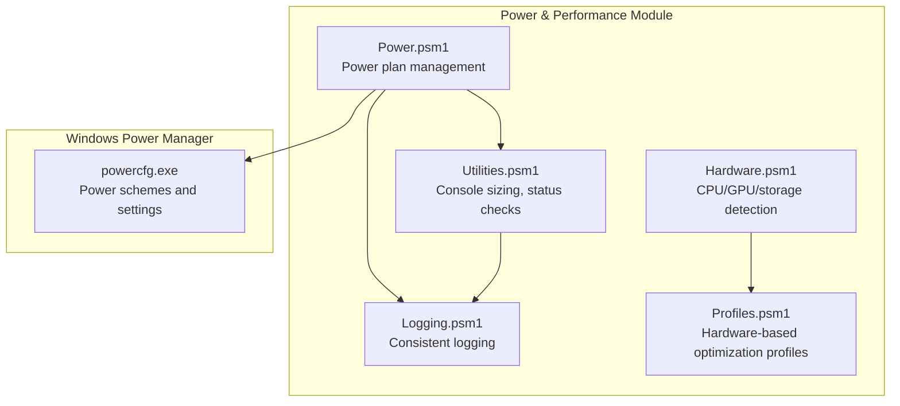
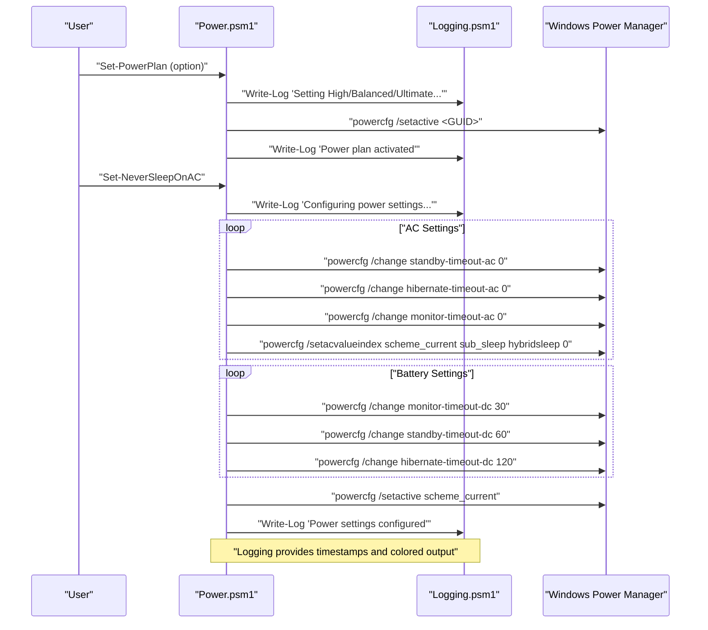
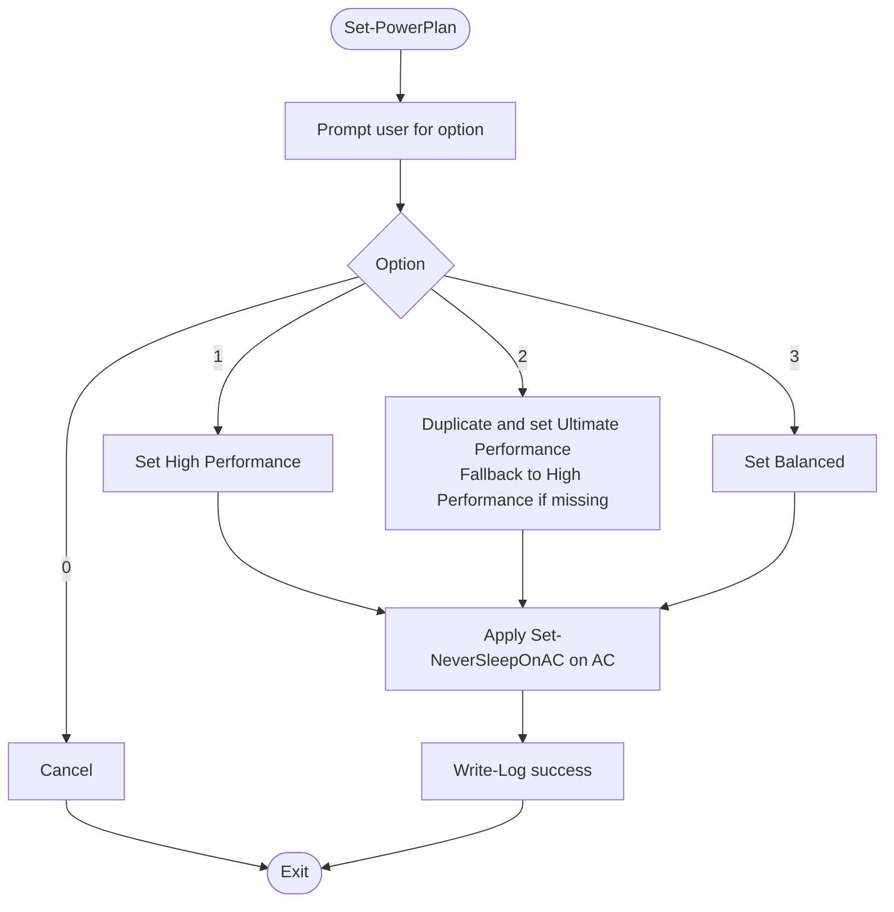
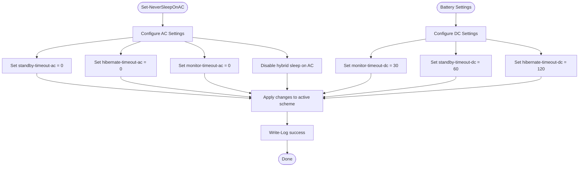
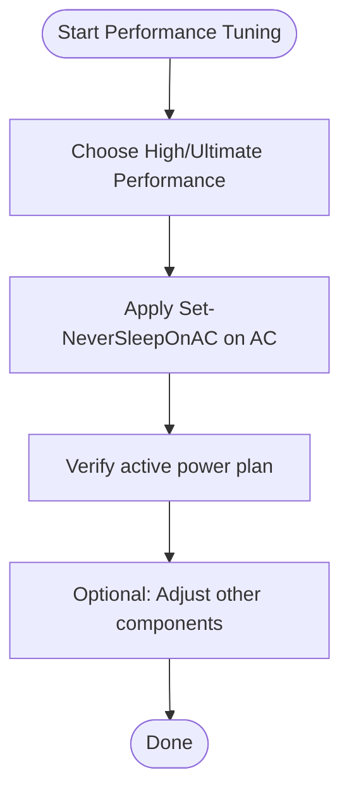
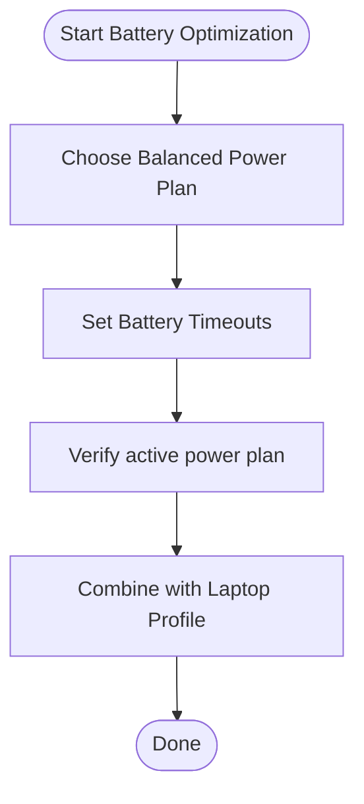
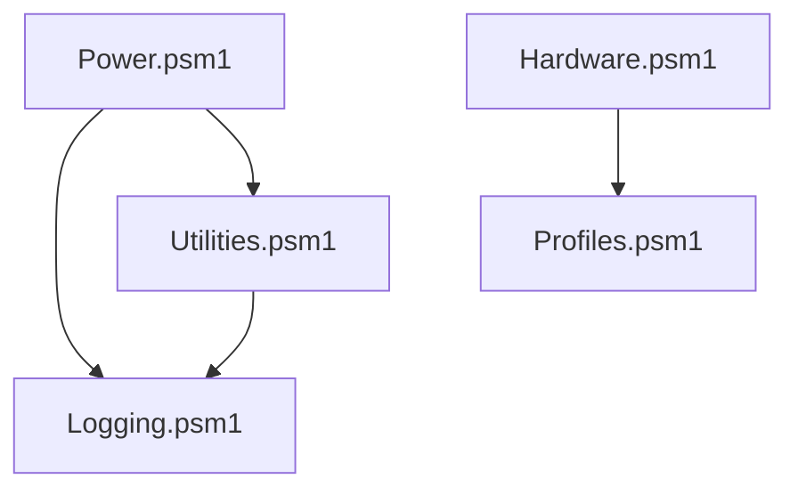

# Power & Performance

<cite>
**Referenced Files in This Document**
- [Power.psm1](file://modules/Power.psm1)
- [Logging.psm1](file://modules/Logging.psm1)
- [Utilities.psm1](file://modules/Utilities.psm1)
- [Hardware.psm1](file://modules/Hardware.psm1)
- [Profiles.psm1](file://modules/Profiles.psm1)
- [README.md](file://README.md)
- [FEATURES.md](file://docs/FEATURES.md)
- [win11_ultimate_optimization.ps1](file://scripts/legacy/win11_ultimate_optimization.ps1)
</cite>

## Table of Contents
1. [Introduction](#introduction)
2. [Project Structure](#project-structure)
3. [Core Components](#core-components)
4. [Architecture Overview](#architecture-overview)
5. [Detailed Component Analysis](#detailed-component-analysis)
6. [Dependency Analysis](#dependency-analysis)
7. [Performance Considerations](#performance-considerations)
8. [Troubleshooting Guide](#troubleshooting-guide)
9. [Conclusion](#conclusion)
10. [Appendices](#appendices)

## Introduction
This document describes the Power & Performance module within the System Optimizer project. It focuses on power plan management, CPU performance tuning, and battery configuration for laptops. The module integrates with Windows Power Manager (powercfg) to configure power schemes, manage sleep/hibernate behavior, and optimize performance versus battery life trade-offs. It also provides guidance for thermal management controls and CPU frequency scaling, with practical workflows for performance tuning and battery life optimization.

## Project Structure
The Power & Performance functionality is primarily implemented in a PowerShell module that orchestrates Windows power management commands. Supporting modules provide logging, console sizing, and hardware detection to inform power-related decisions.

**Diagram sources**
- [Power.psm1](file://modules/Power.psm1#L1-L93)
- [Logging.psm1](file://modules/Logging.psm1#L1-L285)
- [Utilities.psm1](file://modules/Utilities.psm1#L297-L328)
- [Hardware.psm1](file://modules/Hardware.psm1#L1-L120)
- [Profiles.psm1](file://modules/Profiles.psm1#L136-L175)

**Section sources**
- [Power.psm1](file://modules/Power.psm1#L1-L93)
- [README.md](file://README.md#L34-L46)
- [FEATURES.md](file://docs/FEATURES.md#L186-L201)

## Core Components
- Power plan management: High Performance, Ultimate Performance (with fallback), and Balanced plans.
- Power behavior configuration: Never sleep/hibernate on AC; reasonable timeouts on battery.
- Integration with Windows Power Manager via powercfg commands.
- Logging and console management for consistent user feedback.
- Hardware detection to inform power-related recommendations (e.g., laptop detection).

Key functions:
- Set-PowerPlan: Presents options and applies selected power plan.
- Set-NeverSleepOnAC: Configures sleep/hibernate/monitor timeouts for AC and DC power.

**Section sources**
- [Power.psm1](file://modules/Power.psm1#L5-L53)
- [Power.psm1](file://modules/Power.psm1#L55-L86)

## Architecture Overview
The Power & Performance module follows a straightforward orchestration pattern:
- User selects a power plan option.
- The module executes powercfg commands to set the active scheme.
- It configures sleep/hibernate/monitor timeouts for AC and DC power.
- Logging is used to track actions and outcomes.

**Diagram sources**
- [Power.psm1](file://modules/Power.psm1#L5-L86)
- [Logging.psm1](file://modules/Logging.psm1#L69-L123)

## Detailed Component Analysis

### Power Plan Management
- High Performance plan: Activated via a known GUID and paired with never-sleep settings on AC.
- Ultimate Performance plan: Created by duplicating a built-in scheme and activating it if present; otherwise falls back to High Performance.
- Balanced plan: Activated via a known GUID and paired with never-sleep settings on AC.

**Diagram sources**
- [Power.psm1](file://modules/Power.psm1#L5-L53)
- [Power.psm1](file://modules/Power.psm1#L55-L86)

**Section sources**
- [Power.psm1](file://modules/Power.psm1#L5-L53)
- [FEATURES.md](file://docs/FEATURES.md#L188-L201)

### Power Behavior Configuration (AC vs. Battery)
- AC power: Never sleep, never hibernate, never turn off screen; hybrid sleep disabled.
- Battery power: Screen off after 30 minutes, sleep after 1 hour, hibernate after 2 hours.
- Changes are applied to the active power scheme and re-applied to persist.

**Diagram sources**
- [Power.psm1](file://modules/Power.psm1#L55-L86)

**Section sources**
- [Power.psm1](file://modules/Power.psm1#L55-L86)
- [FEATURES.md](file://docs/FEATURES.md#L191-L196)

### Integration with Windows Power Manager
- powercfg is used to:
  - List and set active power schemes.
  - Duplicate built-in schemes to create Ultimate Performance.
  - Change timeouts for standby, hibernate, and monitor.
  - Modify AC-specific values and set the active scheme.

These commands are executed directly from the module functions.

**Section sources**
- [Power.psm1](file://modules/Power.psm1#L22-L42)
- [Power.psm1](file://modules/Power.psm1#L58-L83)

### Thermal Management Controls
- The current module does not implement explicit CPU governor or fan control settings.
- Thermal throttling prevention is indirectly addressed by:
  - Keeping the screen on AC to reduce unnecessary wake cycles.
  - Avoiding hybrid sleep on AC to prevent potential thermal spikes during resume.
  - Using balanced timeouts on battery to reduce heat generation under load.

For advanced thermal controls (e.g., CPU governor tuning), external tools or Windows-specific mechanisms would be required. The module’s logging and console management remain useful for monitoring and validating changes.

**Section sources**
- [Power.psm1](file://modules/Power.psm1#L58-L83)

### CPU Frequency Scaling and Performance Tuning
- The module does not directly configure CPU frequency scaling policies.
- Performance tuning is achieved through:
  - Selecting High Performance or Ultimate Performance power plans.
  - Ensuring AC power prevents sleep/hibernate, maintaining consistent CPU performance.
  - Combining with hardware detection to tailor recommendations for laptops and desktops.

**Section sources**
- [Power.psm1](file://modules/Power.psm1#L5-L53)
- [Hardware.psm1](file://modules/Hardware.psm1#L1228-L1234)

### Battery Optimization Parameters
- Battery-specific timeouts:
  - Screen off after 30 minutes.
  - Sleep after 1 hour.
  - Hibernate after 2 hours.
- These parameters balance performance and battery life for typical laptop usage.

**Section sources**
- [Power.psm1](file://modules/Power.psm1#L72-L81)
- [FEATURES.md](file://docs/FEATURES.md#L191-L196)

### Practical Workflows

#### Performance Tuning Workflow
- Use the Power Plan menu to select High Performance or Ultimate Performance.
- Confirm that AC power settings never sleep/hibernate to maintain peak performance.
- Monitor system behavior and adjust other components (e.g., services, registry) as needed.

**Diagram sources**
- [Power.psm1](file://modules/Power.psm1#L5-L53)
- [Power.psm1](file://modules/Power.psm1#L55-L86)

#### Battery Life Optimization Procedure
- Use the Power Plan menu to select Balanced.
- Ensure battery timeouts are set (screen 30 min, sleep 1 hr, hibernate 2 hr).
- Combine with hardware-based profiles designed for laptops to maximize battery life.

**Diagram sources**
- [Power.psm1](file://modules/Power.psm1#L44-L49)
- [Power.psm1](file://modules/Power.psm1#L72-L81)
- [Profiles.psm1](file://modules/Profiles.psm1#L144-L170)

#### Power Consumption Monitoring
- Use the status verification utility to confirm power plan and related settings.
- Review logs for timestamps and outcomes of power configuration actions.

**Section sources**
- [Utilities.psm1](file://modules/Utilities.psm1#L44-L119)
- [Logging.psm1](file://modules/Logging.psm1#L69-L123)

## Dependency Analysis
- Power.psm1 depends on:
  - Windows Power Manager (powercfg) for scheme management and settings.
  - Logging.psm1 for consistent logging and console output.
  - Utilities.psm1 for console sizing and status verification.
- Hardware.psm1 provides hardware context (e.g., laptop detection) that informs power-related recommendations.
- Profiles.psm1 defines hardware-based profiles that include power plan choices (e.g., Balanced for Laptop).

**Diagram sources**
- [Power.psm1](file://modules/Power.psm1#L1-L93)
- [Logging.psm1](file://modules/Logging.psm1#L1-L285)
- [Utilities.psm1](file://modules/Utilities.psm1#L297-L328)
- [Hardware.psm1](file://modules/Hardware.psm1#L1228-L1234)
- [Profiles.psm1](file://modules/Profiles.psm1#L144-L170)

**Section sources**
- [Power.psm1](file://modules/Power.psm1#L1-L93)
- [Hardware.psm1](file://modules/Hardware.psm1#L1228-L1234)
- [Profiles.psm1](file://modules/Profiles.psm1#L144-L170)

## Performance Considerations
- High Performance and Ultimate Performance plans generally favor performance over battery life.
- Never-sleep settings on AC keep CPU and GPU active, reducing thermal throttling during sustained workloads.
- Battery timeouts on Balanced strike a balance between usability and longevity.
- For laptops, pairing Balanced with hardware-based profiles improves battery life.

[No sources needed since this section provides general guidance]

## Troubleshooting Guide
Common issues and resolutions:
- Ultimate Performance not available:
  - The module attempts to duplicate the scheme and activate it; if not found, it falls back to High Performance.
- Power settings not persisting:
  - Ensure the active scheme is re-applied after changes.
- Logging and console sizing:
  - Use the logging module to review timestamps and outcomes; console sizing helps readability.

**Section sources**
- [Power.psm1](file://modules/Power.psm1#L28-L42)
- [Power.psm1](file://modules/Power.psm1#L82-L86)
- [Logging.psm1](file://modules/Logging.psm1#L69-L123)
- [Utilities.psm1](file://modules/Utilities.psm1#L297-L328)

## Conclusion
The Power & Performance module provides essential power plan management and battery configuration for Windows systems. By leveraging powercfg, it enables users to select High Performance, Ultimate Performance, or Balanced plans and to configure AC and DC power behavior. While the module does not directly control CPU governors or fans, it contributes to thermal stability and performance by keeping systems responsive on AC and optimizing battery life on DC. Combined with hardware detection and profiles, it offers a practical foundation for performance tuning and battery optimization workflows.

[No sources needed since this section summarizes without analyzing specific files]

## Appendices

### Function Reference

- Set-PowerPlan
  - Purpose: Present power plan options and apply selected plan.
  - Behavior: Supports High Performance, Ultimate Performance (fallback), and Balanced.
  - Integration: Calls powercfg to set active scheme and invokes Set-NeverSleepOnAC on AC.

- Set-NeverSleepOnAC
  - Purpose: Configure sleep/hibernate/monitor timeouts for AC and DC power.
  - Behavior: Never sleep/hibernate on AC; reasonable timeouts on battery.

**Section sources**
- [Power.psm1](file://modules/Power.psm1#L5-L53)
- [Power.psm1](file://modules/Power.psm1#L55-L86)

### Platform and Hardware Notes
- Laptop detection:
  - The hardware module detects whether the system has a battery, enabling tailored recommendations.
- Profiles:
  - Profiles include a “Laptop / Battery” profile that selects Balanced and disables animations to save battery.

**Section sources**
- [Hardware.psm1](file://modules/Hardware.psm1#L1228-L1234)
- [Profiles.psm1](file://modules/Profiles.psm1#L144-L170)