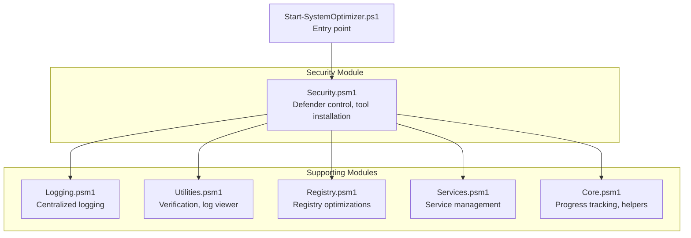
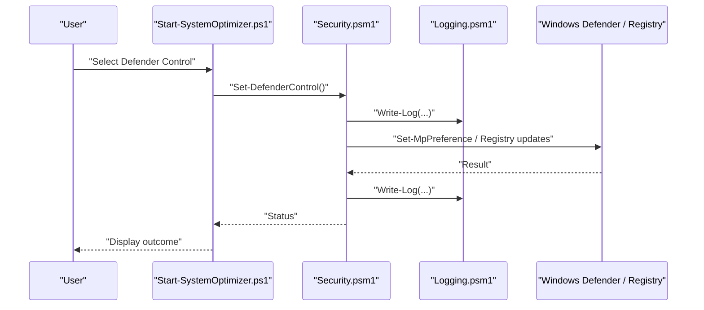
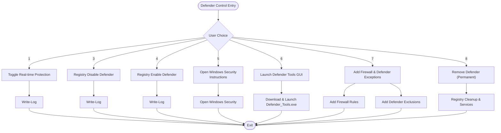
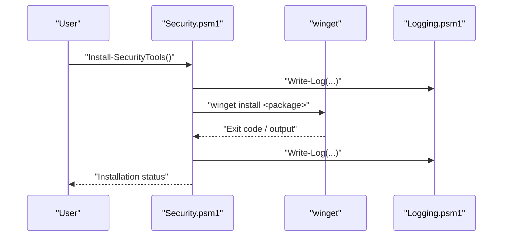
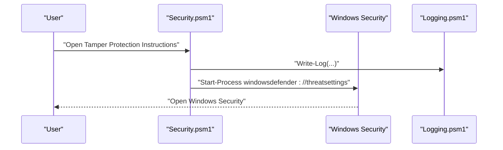
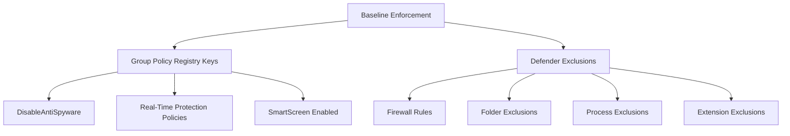
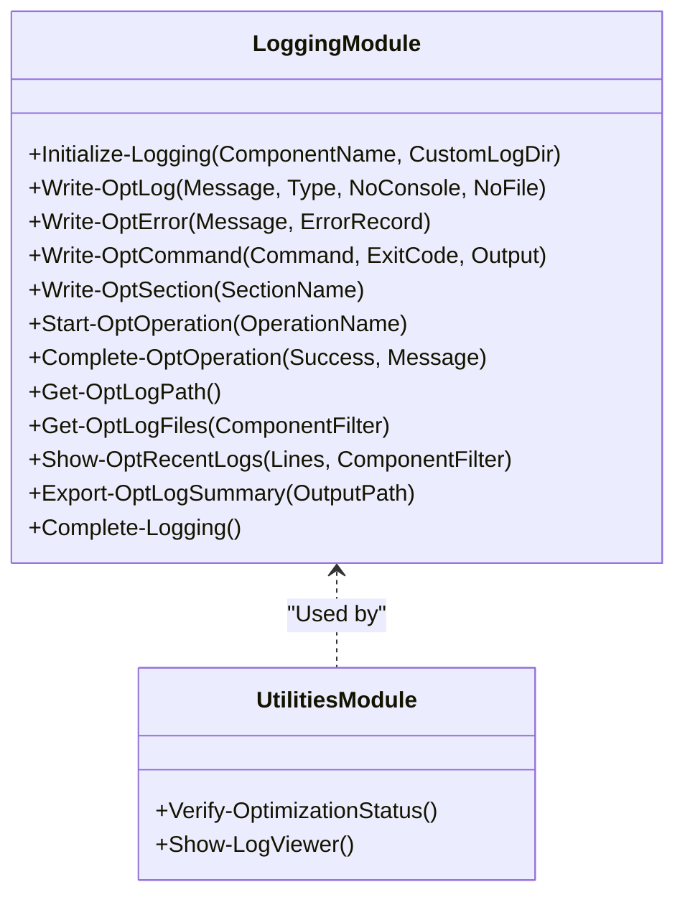
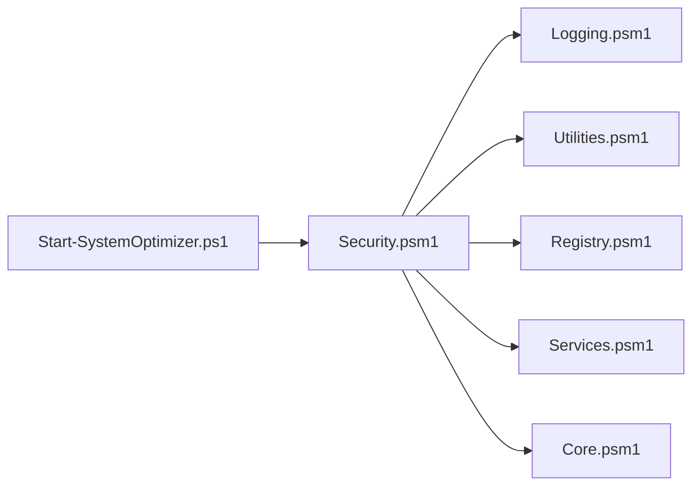

# Security & Protection

<cite>
**Referenced Files in This Document**
- [Security.psm1](file://modules/Security.psm1)
- [Services.psm1](file://modules/Services.psm1)
- [Registry.psm1](file://modules/Registry.psm1)
- [Logging.psm1](file://modules/Logging.psm1)
- [Utilities.psm1](file://modules/Utilities.psm1)
- [Start-SystemOptimizer.ps1](file://Start-SystemOptimizer.ps1)
- [Core.psm1](file://modules/Core.psm1)
</cite>

## Table of Contents
1. [Introduction](#introduction)
2. [Project Structure](#project-structure)
3. [Core Components](#core-components)
4. [Architecture Overview](#architecture-overview)
5. [Detailed Component Analysis](#detailed-component-analysis)
6. [Dependency Analysis](#dependency-analysis)
7. [Performance Considerations](#performance-considerations)
8. [Troubleshooting Guide](#troubleshooting-guide)
9. [Conclusion](#conclusion)
10. [Appendices](#appendices)

## Introduction
This document describes the Security & Protection module within the System Optimizer project. It focuses on Windows Defender configuration, real-time protection management, cloud-delivered protection settings, and security intelligence updates. It also covers security policy application, threat detection configuration, and security baseline enforcement. Integration points with Windows Security Center, Defender ATP capabilities, and enterprise security policies are explained alongside practical examples for security hardening workflows, threat protection automation, and security monitoring procedures. Security considerations, audit logging, and compliance requirements for different Windows editions are addressed.

## Project Structure
The Security & Protection module is implemented as a PowerShell module with cohesive functions for managing Windows Defender, installing third-party security tools, and integrating with Windows security features. Supporting modules provide logging, service management, registry optimizations, and verification utilities.

**Diagram sources**
- [Security.psm1](file://modules/Security.psm1#L1-L495)
- [Logging.psm1](file://modules/Logging.psm1#L1-L285)
- [Utilities.psm1](file://modules/Utilities.psm1#L1-L395)
- [Registry.psm1](file://modules/Registry.psm1#L1-L213)
- [Services.psm1](file://modules/Services.psm1#L1-L712)
- [Core.psm1](file://modules/Core.psm1#L1-L869)
- [Start-SystemOptimizer.ps1](file://Start-SystemOptimizer.ps1#L1-L994)

**Section sources**
- [Security.psm1](file://modules/Security.psm1#L1-L495)
- [Start-SystemOptimizer.ps1](file://Start-SystemOptimizer.ps1#L1-L994)

## Core Components
- Defender control and configuration:
  - Real-time protection toggles
  - Cloud-delivered protection settings
  - Security intelligence updates
  - Controlled folder access and PUA protection
- Security tool installation:
  - ESET NOD32, Malwarebytes, AdwCleaner, Wireshark, Nmap, BleachBit, Eraser
  - Winget-based installation orchestration
- Windows Security Center integration:
  - Opening Windows Security settings
  - Tamper protection instructions
- Enterprise and policy alignment:
  - Group Policy registry keys for Defender
  - SmartScreen configuration
  - Defender exclusions for activation tools
- Audit logging and monitoring:
  - Centralized logging with timestamps and severity
  - Log retention and export capabilities
  - Verification utilities for Defender status

**Section sources**
- [Security.psm1](file://modules/Security.psm1#L5-L495)
- [Logging.psm1](file://modules/Logging.psm1#L1-L285)
- [Utilities.psm1](file://modules/Utilities.psm1#L44-L119)

## Architecture Overview
The Security module orchestrates Defender operations and integrates with Windows APIs and registry policies. It leverages centralized logging and utility functions for verification and monitoring.

**Diagram sources**
- [Start-SystemOptimizer.ps1](file://Start-SystemOptimizer.ps1#L797-L798)
- [Security.psm1](file://modules/Security.psm1#L5-L278)
- [Logging.psm1](file://modules/Logging.psm1#L68-L123)

## Detailed Component Analysis

### Defender Control Functions
- Real-time protection management:
  - Temporarily disable/enable real-time protection
  - Handles tamper protection prerequisites
- Registry-based Defender control:
  - Policy-level disable via Group Policy registry keys
  - Restore registry settings to enable Defender
- Cloud-delivered protection and SmartScreen:
  - Configure Spynet/MAPS reporting
  - Adjust SmartScreen settings
- Security intelligence updates:
  - Signature update invocation
- Enhanced protection features:
  - Controlled folder access
  - PUA protection

**Diagram sources**
- [Security.psm1](file://modules/Security.psm1#L5-L278)

**Section sources**
- [Security.psm1](file://modules/Security.psm1#L5-L278)

### Security Tool Installation
- Single tool installation:
  - ESET NOD32 (with warnings)
  - Malwarebytes, AdwCleaner, Wireshark, Nmap, BleachBit, Eraser
- Bulk installation:
  - Installs all tools with warnings about conflicts
- Winget integration:
  - Uses winget with package agreements and source agreements

**Diagram sources**
- [Security.psm1](file://modules/Security.psm1#L280-L458)
- [Logging.psm1](file://modules/Logging.psm1#L68-L123)

**Section sources**
- [Security.psm1](file://modules/Security.psm1#L280-L458)

### Windows Security Center Integration
- Opening Windows Security settings for Defender configuration
- Tamper protection instructions and guidance
- Integration with Windows Security Center for policy and settings

**Diagram sources**
- [Security.psm1](file://modules/Security.psm1#L120-L131)

**Section sources**
- [Security.psm1](file://modules/Security.psm1#L120-L131)

### Security Baseline Enforcement
- Registry-based baseline controls:
  - Disable anti-spyware via Group Policy registry keys
  - Real-time protection policy keys
  - SmartScreen configuration
- Defender exclusions for activation tools:
  - Firewall rules for script hosts
  - Folder, process, and extension exclusions

**Diagram sources**
- [Security.psm1](file://modules/Security.psm1#L57-L119)
- [Security.psm1](file://modules/Security.psm1#L144-L225)

**Section sources**
- [Security.psm1](file://modules/Security.psm1#L57-L119)
- [Security.psm1](file://modules/Security.psm1#L144-L225)

### Audit Logging and Monitoring
- Centralized logging:
  - Initialize logging with component name and timestamp
  - Log levels: INFO, SUCCESS, ERROR, WARNING, SECTION, DEBUG
  - Optional console and file output
- Log retention and cleanup:
  - Automatic cleanup of logs older than 30 days
  - Export log summaries
- Verification utilities:
  - Check Defender real-time protection status
  - Verify telemetry, Game Bar, VBS, IPv6, background apps, and critical services

**Diagram sources**
- [Logging.psm1](file://modules/Logging.psm1#L18-L285)
- [Utilities.psm1](file://modules/Utilities.psm1#L44-L119)

**Section sources**
- [Logging.psm1](file://modules/Logging.psm1#L18-L285)
- [Utilities.psm1](file://modules/Utilities.psm1#L44-L119)

## Dependency Analysis
The Security module depends on:
- Centralized logging for consistent audit trails
- Utility functions for verification and log viewing
- Registry module for baseline configuration
- Services module for coordinated optimization
- Core module for progress tracking and helper functions

**Diagram sources**
- [Security.psm1](file://modules/Security.psm1#L1-L495)
- [Logging.psm1](file://modules/Logging.psm1#L1-L285)
- [Utilities.psm1](file://modules/Utilities.psm1#L1-L395)
- [Registry.psm1](file://modules/Registry.psm1#L1-L213)
- [Services.psm1](file://modules/Services.psm1#L1-L712)
- [Core.psm1](file://modules/Core.psm1#L1-L869)
- [Start-SystemOptimizer.ps1](file://Start-SystemOptimizer.ps1#L1-L994)

**Section sources**
- [Security.psm1](file://modules/Security.psm1#L1-L495)
- [Start-SystemOptimizer.ps1](file://Start-SystemOptimizer.ps1#L507-L521)

## Performance Considerations
- Minimize repeated registry writes by batching operations where possible.
- Use centralized logging sparingly during bulk operations to reduce I/O overhead.
- Prefer group policy registry keys for system-wide changes to avoid per-user overhead.
- Avoid disabling real-time protection unless necessary; re-enable promptly after operations.

[No sources needed since this section provides general guidance]

## Troubleshooting Guide
Common issues and resolutions:
- Tamper protection enabled:
  - Requires manual disable in Windows Security before registry-based Defender control.
- Permission errors:
  - Ensure running as Administrator for registry and service changes.
- Conflicting antivirus solutions:
  - Install only one antivirus to avoid conflicts; the installer warns against multiple AVs.
- Windows Security Center integration:
  - Use the provided instructions to open Windows Security settings for manual adjustments.
- Logging and verification:
  - Use verification utilities to confirm Defender status and other security settings.
  - Review logs for errors and warnings; export summaries for auditing.

**Section sources**
- [Security.psm1](file://modules/Security.psm1#L40-L56)
- [Security.psm1](file://modules/Security.psm1#L120-L131)
- [Utilities.psm1](file://modules/Utilities.psm1#L44-L119)
- [Logging.psm1](file://modules/Logging.psm1#L230-L252)

## Conclusion
The Security & Protection module provides robust capabilities for managing Windows Defender, configuring cloud-delivered protection, applying security baselines, and integrating with Windows Security Center. It offers practical workflows for security hardening, threat protection automation, and continuous monitoring through centralized logging and verification utilities. Careful use of registry-based policies and guided user actions ensures alignment with enterprise security requirements while maintaining system stability.

[No sources needed since this section summarizes without analyzing specific files]

## Appendices

### Practical Workflows

- Security hardening workflow:
  - Enable Windows Defender and update signatures
  - Configure enhanced protection features
  - Apply registry-based security baselines
  - Add Defender exclusions for activation tools if needed
  - Verify Defender status and other security settings

- Threat protection automation:
  - Schedule signature updates
  - Configure controlled folder access and PUA protection
  - Monitor Defender logs for alerts and anomalies

- Security monitoring procedures:
  - Regular verification of Defender status
  - Review logs for errors and warnings
  - Export log summaries for compliance audits

[No sources needed since this section provides general guidance]