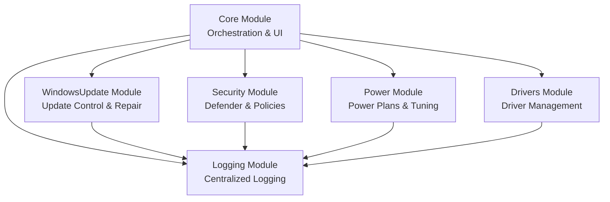
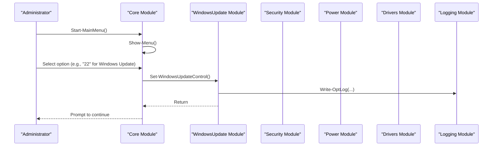
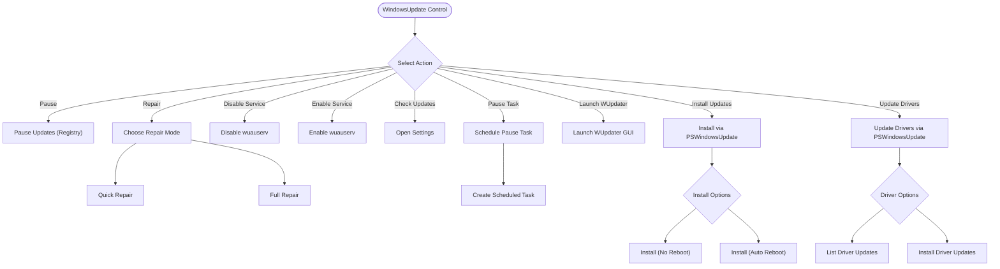
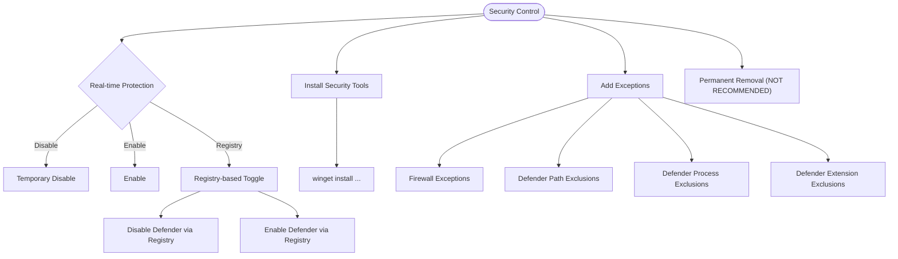
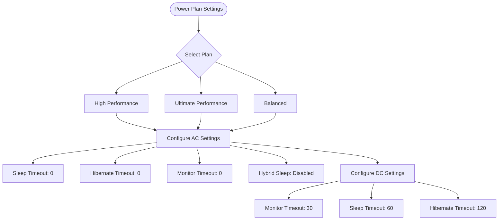
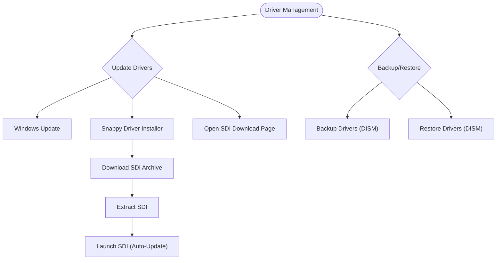
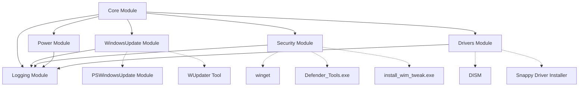

# System Management Modules

<cite>
**Referenced Files in This Document**
- [README.md](file://README.md)
- [modules/Core.psm1](file://modules/Core.psm1)
- [modules/Logging.psm1](file://modules/Logging.psm1)
- [modules/WindowsUpdate.psm1](file://modules/WindowsUpdate.psm1)
- [modules/Security.psm1](file://modules/Security.psm1)
- [modules/Power.psm1](file://modules/Power.psm1)
- [modules/Drivers.psm1](file://modules/Drivers.psm1)
</cite>

## Table of Contents
1. [Introduction](#introduction)
2. [Project Structure](#project-structure)
3. [Core Components](#core-components)
4. [Architecture Overview](#architecture-overview)
5. [Detailed Component Analysis](#detailed-component-analysis)
6. [Dependency Analysis](#dependency-analysis)
7. [Performance Considerations](#performance-considerations)
8. [Troubleshooting Guide](#troubleshooting-guide)
9. [Conclusion](#conclusion)

## Introduction
This document provides comprehensive documentation for the System Optimizer’s system management modules that handle critical Windows system functions. It focuses on four core modules:
- WindowsUpdate: update control mechanisms and component repair
- Security: Defender management and policy configuration
- Power: power plan optimization and performance tuning
- Drivers: driver management tools and update procedures

For each module, we explain function documentation, system integration patterns, safety considerations, and practical examples of system administration workflows. The content is grounded in the repository’s PowerShell modules and integrates with the shared logging and core orchestration infrastructure.

## Project Structure
The System Optimizer is organized as a modular PowerShell toolkit with a central orchestration module and specialized modules for system management. The modules are designed to be imported and used within the main application flow.

**Diagram sources**
- [modules/Core.psm1](file://modules/Core.psm1#L793-L845)
- [modules/WindowsUpdate.psm1](file://modules/WindowsUpdate.psm1#L1-L382)
- [modules/Security.psm1](file://modules/Security.psm1#L1-L495)
- [modules/Power.psm1](file://modules/Power.psm1#L1-L93)
- [modules/Drivers.psm1](file://modules/Drivers.psm1#L1-L176)
- [modules/Logging.psm1](file://modules/Logging.psm1#L1-L285)

**Section sources**
- [README.md](file://README.md#L48-L59)
- [modules/Core.psm1](file://modules/Core.psm1#L793-L845)

## Core Components
- Core Module: Provides the main menu, orchestration, and integration points for all modules. It exposes functions to run all optimizations, manage progress, and coordinate module invocations.
- Logging Module: Centralized logging with timestamps, colored console output, and file persistence. Used consistently across modules for auditability and troubleshooting.
- WindowsUpdate Module: Offers update control (pause/resume, service enable/disable), update installation via PowerShell, driver updates, and repair routines for Windows Update components.
- Security Module: Manages Windows Defender preferences, registry-based policies, firewall exceptions, and optional permanent removal of Defender components.
- Power Module: Activates and configures power plans (High Performance, Ultimate Performance, Balanced) and sets power behavior for AC and battery.
- Drivers Module: Integrates with Windows Update for driver updates, downloads and launches Snappy Driver Installer, and performs driver backups/restores using DISM.

**Section sources**
- [modules/Core.psm1](file://modules/Core.psm1#L793-L845)
- [modules/Logging.psm1](file://modules/Logging.psm1#L68-L123)
- [modules/WindowsUpdate.psm1](file://modules/WindowsUpdate.psm1#L5-L382)
- [modules/Security.psm1](file://modules/Security.psm1#L5-L495)
- [modules/Power.psm1](file://modules/Power.psm1#L5-L93)
- [modules/Drivers.psm1](file://modules/Drivers.psm1#L5-L176)

## Architecture Overview
The system follows a menu-driven architecture where the Core Module presents options and delegates to specialized modules. Each module encapsulates its domain logic and uses the Logging Module for consistent output and auditing.

**Diagram sources**
- [modules/Core.psm1](file://modules/Core.psm1#L793-L845)
- [modules/WindowsUpdate.psm1](file://modules/WindowsUpdate.psm1#L5-L82)
- [modules/Logging.psm1](file://modules/Logging.psm1#L68-L123)

## Detailed Component Analysis

### WindowsUpdate Module
The WindowsUpdate module provides a comprehensive interface for controlling Windows Update behavior, installing updates, launching external tools, and repairing Windows Update components.

Key capabilities:
- Update control: pause updates for a fixed period, schedule a task to pause and resume, disable/enable the Windows Update service, open Windows Update settings, and launch the WUpdater GUI.
- Update installation: integrates with the PSWindowsUpdate module to list and install updates with options for reboot behavior.
- Driver updates: uses PSWindowsUpdate to discover and install driver updates.
- Component repair: offers quick and full repair routines including stopping services, clearing caches, re-registering DLLs, resetting WinSock, and forcing update detection.

Integration patterns:
- Uses centralized logging for all operations.
- Leverages scheduled tasks for automated resumption of updates.
- Downloads and launches external tools (WUpdater) when needed.

Safety considerations:
- Disabling Windows Update or tampering with components can delay critical security patches.
- Full repair requires a reboot and may affect update delivery.
- Tamper Protection must be disabled before registry-based Defender policy changes.

Practical workflows:
- Pause updates temporarily for maintenance windows using either registry-based pause or scheduled task method.
- Install updates selectively with reboot control using the PSWindowsUpdate integration.
- Repair Windows Update components when encountering persistent failures.

**Diagram sources**
- [modules/WindowsUpdate.psm1](file://modules/WindowsUpdate.psm1#L5-L382)

**Section sources**
- [modules/WindowsUpdate.psm1](file://modules/WindowsUpdate.psm1#L5-L382)

### Security Module
The Security module manages Windows Defender and related security policies, including real-time protection toggles, registry-based policy changes, firewall exceptions, and optional permanent removal of Defender components.

Key capabilities:
- Defender control: temporary disable/enable of real-time protection, registry-based disable/enable of Defender, and instructions for disabling Tamper Protection.
- Security tools installation: integrates with winget to install antivirus and anti-malware tools, with warnings against conflicting antivirus solutions.
- Firewall and Defender exceptions: adds firewall rules for script hosts and configures Defender exclusions for paths, processes, and file extensions commonly used by activation tools.
- Permanent removal: removes Defender components using a dedicated tool and cleans up registry and services.

Integration patterns:
- Uses centralized logging for all actions.
- Launches external tools (Defender_Tools.exe, install_wim_tweak.exe) when required.
- Configures Windows Defender preferences and registry policies.

Safety considerations:
- Disabling real-time protection reduces system security; Tamper Protection must be disabled first.
- Removing Defender permanently leaves the system unprotected; a reboot is required.
- Adding firewall exceptions and Defender exclusions can increase attack surface; use judiciously.

Practical workflows:
- Temporarily disable real-time protection for compatibility testing.
- Configure Defender policies via registry for enterprise environments.
- Add exceptions for legitimate activation tools while maintaining security posture.
- Install and configure additional security tools using winget.

**Diagram sources**
- [modules/Security.psm1](file://modules/Security.psm1#L5-L495)

**Section sources**
- [modules/Security.psm1](file://modules/Security.psm1#L5-L495)

### Power Module
The Power module optimizes power plans and power behavior for both AC and battery scenarios to improve performance and responsiveness.

Key capabilities:
- Power plan selection: activates High Performance, creates/activates Ultimate Performance (if available), or sets Balanced.
- Power behavior tuning: configures sleep, hibernate, and monitor timeouts for AC and DC power, and disables hybrid sleep on AC.

Integration patterns:
- Uses centralized logging for all actions.
- Calls powercfg commands to change active power plan and modify individual power settings.

Safety considerations:
- Ultimate Performance may increase power consumption and heat generation.
- Disabling sleep/hibernate on AC can reduce energy savings but improves responsiveness.

Practical workflows:
- Switch to High Performance or Ultimate Performance for gaming or development workloads.
- Configure power behavior to keep the system responsive on AC while preserving battery life on DC.

**Diagram sources**
- [modules/Power.psm1](file://modules/Power.psm1#L5-L93)

**Section sources**
- [modules/Power.psm1](file://modules/Power.psm1#L5-L93)

### Drivers Module
The Drivers module provides driver management capabilities, including leveraging Windows Update for driver updates, downloading and launching Snappy Driver Installer, and performing driver backups and restores using DISM.

Key capabilities:
- Update drivers via Windows Update.
- Download and launch Snappy Driver Installer (SDI) with automatic update support.
- Backup current drivers using DISM and restore them later.
- Open SDI download page for manual installation.

Integration patterns:
- Uses centralized logging for all actions.
- Downloads and extracts SDI archives, then launches the appropriate executable.
- Uses DISM commands to export and import drivers.

Safety considerations:
- Driver updates can cause instability if incompatible; use backups.
- Restoring drivers requires confirmation and may fail if drivers are missing or incompatible.
- SDI downloads and launches third-party executables; ensure trust and verification.

Practical workflows:
- Update drivers through Windows Update for reliability.
- Use SDI for advanced driver management and auto-update features.
- Back up drivers before major system changes and restore if needed.

**Diagram sources**
- [modules/Drivers.psm1](file://modules/Drivers.psm1#L5-L176)

**Section sources**
- [modules/Drivers.psm1](file://modules/Drivers.psm1#L5-L176)

## Dependency Analysis
The modules depend on the Core Module for menu orchestration and on the Logging Module for consistent logging. The WindowsUpdate module depends on external tools (WUpdater) and the PSWindowsUpdate module for update operations. The Security module depends on winget for tool installation and external tools for advanced operations. The Drivers module depends on DISM for driver backup/restore and external tools for driver updates.

**Diagram sources**
- [modules/Core.psm1](file://modules/Core.psm1#L793-L845)
- [modules/WindowsUpdate.psm1](file://modules/WindowsUpdate.psm1#L156-L219)
- [modules/Security.psm1](file://modules/Security.psm1#L280-L342)
- [modules/Drivers.psm1](file://modules/Drivers.psm1#L38-L104)

**Section sources**
- [modules/Core.psm1](file://modules/Core.psm1#L793-L845)
- [modules/WindowsUpdate.psm1](file://modules/WindowsUpdate.psm1#L156-L219)
- [modules/Security.psm1](file://modules/Security.psm1#L280-L342)
- [modules/Drivers.psm1](file://modules/Drivers.psm1#L38-L104)

## Performance Considerations
- Windows Update operations (especially full repair) can be resource-intensive and may require a reboot; schedule during maintenance windows.
- Driver updates and restores using DISM can take significant time; ensure adequate disk space and network bandwidth.
- Enabling Ultimate Performance increases CPU usage and heat; monitor system temperatures and adjust workload accordingly.
- Logging verbosity can impact performance in long-running operations; use the verbose progress setting judiciously.

## Troubleshooting Guide
Common issues and resolutions:
- Windows Update repair failures: Use the quick repair routine to stop services, clear caches, and restart components; if unresolved, use the full repair routine and reboot.
- Tamper Protection blocking Defender changes: Follow the instructions to disable Tamper Protection in Windows Security before applying registry-based policy changes.
- Driver update conflicts: Use DISM to back up drivers before updates; if issues occur, restore from backup.
- Missing PSWindowsUpdate module: The WindowsUpdate module attempts to install it automatically; if it fails, install manually and retry.
- winget not found: Install the Microsoft Store App Installer to enable winget, then retry security tool installations.

**Section sources**
- [modules/WindowsUpdate.psm1](file://modules/WindowsUpdate.psm1#L247-L371)
- [modules/Security.psm1](file://modules/Security.psm1#L120-L131)
- [modules/Drivers.psm1](file://modules/Drivers.psm1#L111-L130)
- [modules/WindowsUpdate.psm1](file://modules/WindowsUpdate.psm1#L156-L219)
- [modules/Security.psm1](file://modules/Security.psm1#L280-L288)

## Conclusion
The System Optimizer’s system management modules provide robust, integrated capabilities for Windows Update control, Defender management, power plan optimization, and driver management. They leverage centralized logging for transparency and safety, offer multiple operational modes for different use cases, and integrate with external tools to extend functionality. Administrators should carefully evaluate the safety implications of each operation, especially those that reduce system security or alter critical components, and use the provided workflows to maintain system stability and performance.