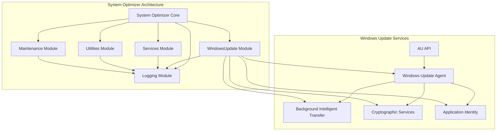
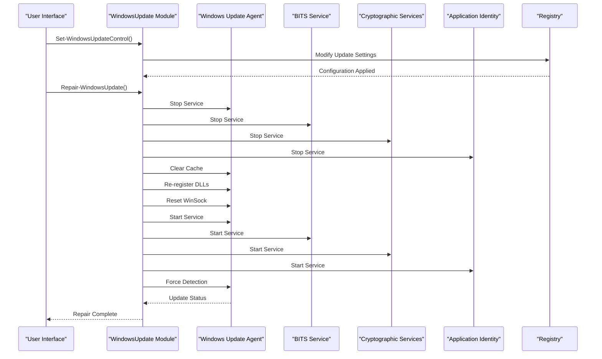
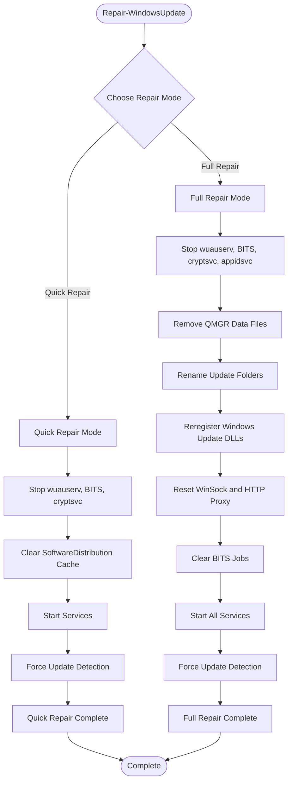
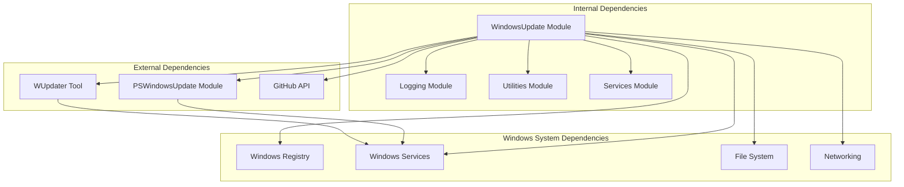

# Windows Update Management

<cite>
**Referenced Files in This Document**
- [WindowsUpdate.psm1](file://modules/WindowsUpdate.psm1)
- [Services.psm1](file://modules/Services.psm1)
- [Utilities.psm1](file://modules/Utilities.psm1)
- [Logging.psm1](file://modules/Logging.psm1)
- [Maintenance.psm1](file://modules/Maintenance.psm1)
- [Start-SystemOptimizer.ps1](file://Start-SystemOptimizer.ps1)
- [STRUCTURE.md](file://docs/STRUCTURE.md)
- [README.md](file://README.md)
</cite>

## Update Summary
**Changes Made**
- Updated function naming convention documentation to reflect standardized `Install-WindowsUpdate` (singular form)
- Updated main menu documentation to reflect the new function name
- Added clarification about grammatical consistency improvements
- Updated troubleshooting guidance to reference the standardized function name

## Table of Contents
1. [Introduction](#introduction)
2. [Project Structure](#project-structure)
3. [Core Components](#core-components)
4. [Architecture Overview](#architecture-overview)
5. [Detailed Component Analysis](#detailed-component-analysis)
6. [Dependency Analysis](#dependency-analysis)
7. [Performance Considerations](#performance-considerations)
8. [Troubleshooting Guide](#troubleshooting-guide)
9. [Conclusion](#conclusion)

## Introduction
The Windows Update Management module provides comprehensive control over Windows Update services, component repair procedures, and update policy management. This module integrates with the broader System Optimizer toolkit to offer automated update management, service control, and troubleshooting capabilities for Windows 10/11 systems.

The module focuses on four primary areas:
- Windows Update service lifecycle management
- Component repair and restoration procedures
- Update scheduling and policy control
- Integration with Windows Update architecture and service dependencies

**Updated** The module now follows standardized function naming conventions with grammatical consistency, using singular forms for update-related functions.

## Project Structure
The Windows Update Management module is part of the System Optimizer toolkit, which consists of 27 modular PowerShell components designed for comprehensive Windows optimization.



**Diagram sources**
- [WindowsUpdate.psm1](file://modules/WindowsUpdate.psm1#L1-L385)
- [Services.psm1](file://modules/Services.psm1#L1-L712)
- [Maintenance.psm1](file://modules/Maintenance.psm1#L1-L283)

**Section sources**
- [STRUCTURE.md](file://docs/STRUCTURE.md#L1-L159)
- [README.md](file://README.md#L1-L88)

## Core Components
The Windows Update Management module provides six primary functions that handle different aspects of Windows Update control and maintenance:

### Service Control Functions
- **Set-WindowsUpdateControl**: Interactive menu for Windows Update management
- **Set-UpdatePauseTask**: Scheduled task-based update pausing mechanism
- **Start-WUpdater**: Launches the WUpdater GUI tool for Windows Update management

### Update Installation Functions
- **Install-WindowsUpdate**: PowerShell-based update installation using PSWindowsUpdate module
- **Update-DriversViaWindowsUpdate**: Driver update management through Windows Update

### Component Repair Functions
- **Repair-WindowsUpdate**: Comprehensive Windows Update component repair with two modes

**Updated** Function naming follows standardized grammatical conventions with singular forms for update-related operations.

**Section sources**
- [WindowsUpdate.psm1](file://modules/WindowsUpdate.psm1#L5-L385)

## Architecture Overview
The Windows Update Management module operates within the Windows Update architecture, interacting with several critical Windows services and components.



**Diagram sources**
- [WindowsUpdate.psm1](file://modules/WindowsUpdate.psm1#L247-L371)

The module manages the following Windows Update services:
- **wuauserv**: Windows Update Agent service
- **BITS**: Background Intelligent Transfer service
- **cryptsvc**: Cryptographic Services
- **appidsvc**: Application Identity service

**Section sources**
- [WindowsUpdate.psm1](file://modules/WindowsUpdate.psm1#L263-L366)

## Detailed Component Analysis

### Windows Update Control Function
The primary interface for Windows Update management, providing an interactive menu with six main options:

```mermaid
flowchart TD
Start([Windows Update Control]) --> Menu[Display Menu Options]
Menu --> PauseReg[Pause Updates (Registry)]
Menu --> PauseTask[Pause Updates (Scheduled Task)]
Menu --> DisableSvc[Disable Windows Update Service]
Menu --> EnableSvc[Enable Windows Update Service]
Menu --> CheckUpdates[Check for Updates]
Menu --> InstallUpdates[Install Updates via PowerShell]
Menu --> LaunchGUI[Launch WUpdater GUI]
Menu --> UpdateDrivers[Update Drivers via Windows Update]
PauseReg --> RegPause[Set Registry Pause Values]
PauseTask --> TaskPause[Create Scheduled Task]
DisableSvc --> StopWUA[Stop wuauserv Service]
EnableSvc --> StartWUA[Start wuauserv Service]
CheckUpdates --> OpenSettings[Open Windows Update Settings]
InstallUpdates --> PSUpdate[Install via PSWindowsUpdate]
LaunchGUI --> WUpdater[Launch WUpdater Tool]
UpdateDrivers --> DriverUpdate[Update Drivers]
RegPause --> End([Complete])
TaskPause --> End
StopWUA --> End
StartWUA --> End
OpenSettings --> End
PSUpdate --> End
WUpdater --> End
DriverUpdate --> End
```

**Diagram sources**
- [WindowsUpdate.psm1](file://modules/WindowsUpdate.psm1#L5-L82)

**Function Documentation: Set-WindowsUpdateControl**
- **Purpose**: Provides interactive menu for Windows Update management
- **Parameters**: None (interactive)
- **Returns**: Void (interactive menu)
- **Error Handling**: Menu validation and logging for invalid selections
- **Dependencies**: Registry manipulation, service control, scheduled task management

**Section sources**
- [WindowsUpdate.psm1](file://modules/WindowsUpdate.psm1#L5-L82)

### Scheduled Task-Based Update Pausing
The module implements a sophisticated scheduled task system for temporary Windows Update pausing:

**Function Documentation: Set-UpdatePauseTask**
- **Purpose**: Creates a scheduled task to temporarily pause Windows Update
- **Parameters**: Days (integer) - pause duration in days
- **Returns**: Void (interactive)
- **Error Handling**: Input validation, service control, task creation
- **Dependencies**: Scheduled Task API, service control, date/time calculations

The function performs the following operations:
1. Validates pause duration input
2. Stops and disables Windows Update service immediately
3. Calculates resume date based on pause duration
4. Removes existing pause task if present
5. Creates new scheduled task with automatic re-enablement

**Section sources**
- [WindowsUpdate.psm1](file://modules/WindowsUpdate.psm1#L84-L127)

### Windows Update Component Repair
The repair functionality provides two distinct repair modes for different levels of component restoration:



**Diagram sources**
- [WindowsUpdate.psm1](file://modules/WindowsUpdate.psm1#L247-L371)

**Function Documentation: Repair-WindowsUpdate**
- **Purpose**: Comprehensive Windows Update component repair and restoration
- **Parameters**: None (interactive)
- **Returns**: Void (interactive)
- **Error Handling**: Comprehensive error handling for all repair operations
- **Dependencies**: Service control, file system operations, DLL registration, networking

**Section sources**
- [WindowsUpdate.psm1](file://modules/WindowsUpdate.psm1#L247-L371)

### PowerShell-Based Update Installation
The module integrates with the PSWindowsUpdate PowerShell module for automated update management:

**Function Documentation: Install-WindowsUpdate**
- **Purpose**: Automated Windows Update installation via PowerShell
- **Parameters**: None (interactive)
- **Returns**: Void (interactive)
- **Error Handling**: Module installation, update listing, installation control
- **Dependencies**: PSWindowsUpdate module, Windows Update Agent

**Updated** Function name follows standardized grammatical convention with singular "Update" instead of plural "Updates".

**Section sources**
- [WindowsUpdate.psm1](file://modules/WindowsUpdate.psm1#L151-L200)

### Driver Update Management
The module provides specialized driver update management through Windows Update:

**Function Documentation: Update-DriversViaWindowsUpdate**
- **Purpose**: Driver update management via Windows Update
- **Parameters**: None (interactive)
- **Returns**: Void (interactive)
- **Error Handling**: Module installation, driver update listing, installation control
- **Dependencies**: PSWindowsUpdate module, Windows Update Agent

**Section sources**
- [WindowsUpdate.psm1](file://modules/WindowsUpdate.psm1#L202-L245)

### WUpdater Integration
The module includes integration with the WUpdater GUI tool for Windows Update management:

**Function Documentation: Start-WUpdater**
- **Purpose**: Downloads and launches WUpdater GUI tool
- **Parameters**: None
- **Returns**: Void
- **Error Handling**: Download failure handling, manual download instructions
- **Dependencies**: Internet connectivity, file system operations

**Section sources**
- [WindowsUpdate.psm1](file://modules/WindowsUpdate.psm1#L129-L149)

## Dependency Analysis
The Windows Update Management module has several important dependencies and relationships with other system components:



**Diagram sources**
- [WindowsUpdate.psm1](file://modules/WindowsUpdate.psm1#L1-L385)
- [Logging.psm1](file://modules/Logging.psm1#L1-L285)
- [Utilities.psm1](file://modules/Utilities.psm1#L1-L395)

### Service Dependencies
The Windows Update Management module interacts with several critical Windows services:

| Service | Purpose | Role in Update Management |
|---------|---------|---------------------------|
| **wuauserv** | Windows Update Agent | Primary service controlled by the module |
| **BITS** | Background Intelligent Transfer | Download engine for updates |
| **cryptsvc** | Cryptographic Services | Certificate validation for updates |
| **appidsvc** | Application Identity | Component identity verification |

### Registry Dependencies
The module modifies several registry locations for update control:

| Registry Path | Purpose | Configuration |
|---------------|---------|---------------|
| `HKLM:\SOFTWARE\Microsoft\WindowsUpdate\UX\Settings` | Update Pause Settings | Pause expiration, feature quality updates |
| `HKCU:\SOFTWARE\Microsoft\Windows\CurrentVersion\WindowsUpdate\UX\Settings` | User Update Settings | Personal update preferences |

**Section sources**
- [WindowsUpdate.psm1](file://modules/WindowsUpdate.psm1#L31-L55)

## Performance Considerations
The Windows Update Management module is designed with several performance considerations:

### Service Control Efficiency
- **Minimal Service Impact**: Only stops necessary services during repair operations
- **Batch Operations**: Groups service operations to minimize overhead
- **Error Tolerance**: Uses silent error handling to prevent interruptions

### Cache Management
- **Selective Cleanup**: Targets only Windows Update cache directories
- **Preserves Data**: Maintains user data while clearing problematic cache
- **Recovery Operations**: Restarts services after cache cleanup

### Network Optimization
- **BITS Integration**: Leverages existing BITS infrastructure for downloads
- **Proxy Awareness**: Respects system proxy settings during updates
- **Bandwidth Management**: Uses BITS for efficient bandwidth utilization

## Troubleshooting Guide

### Common Update Issues and Solutions

#### Windows Update Service Failures
**Symptoms**: Windows Update shows "Checking for updates" indefinitely
**Solution**: Use the repair function to reset Windows Update components

#### Update Download Failures
**Symptoms**: Updates fail with error codes
**Solution**: Clear Windows Update cache and re-register components

#### Service Conflicts
**Symptoms**: Windows Update conflicts with antivirus or security software
**Solution**: Temporarily pause updates using scheduled task method

### Repair Procedures

#### Quick Repair Workflow
1. Stop all Windows Update services
2. Clear SoftwareDistribution cache
3. Restart services
4. Force update detection

#### Full Repair Workflow
1. Stop all Windows Update services
2. Remove QMGR data files
3. Rename update folders (create backups)
4. Re-register Windows Update DLLs
5. Reset WinSock and HTTP proxy
6. Clear BITS jobs
7. Restart all services
8. Force update detection

### Function Name Standardization Guidance
**Updated** When referencing the update installation function, use the standardized `Install-WindowsUpdate` (singular form) instead of the legacy `Install-WindowsUpdates` (plural form).

**Legacy Reference**: The legacy script still uses `Install-WindowsUpdates` but the current module standardizes to `Install-WindowsUpdate`.

**Log Categories**:
- **SUCCESS**: Operations completed successfully
- **ERROR**: Operations failed with error details
- **WARNING**: Operations completed with warnings
- **SECTION**: Major operation sections
- **INFO**: General informational messages

**Log Location**: `C:\System_Optimizer\Logs\`

**Section sources**
- [WindowsUpdate.psm1](file://modules/WindowsUpdate.psm1#L247-L371)
- [Utilities.psm1](file://modules/Utilities.psm1#L121-L243)

## Conclusion
The Windows Update Management module provides comprehensive control over Windows Update services, offering both automated management capabilities and advanced troubleshooting tools. The module's design emphasizes safety, reliability, and user control while maintaining integration with the broader System Optimizer ecosystem.

Key strengths of the module include:
- **Dual Repair Modes**: Quick and full repair options for different scenarios
- **Service Integration**: Proper coordination with Windows Update service dependencies
- **Logging and Monitoring**: Comprehensive logging for troubleshooting and auditing
- **User Experience**: Intuitive menu-driven interface with clear feedback
- **Safety Measures**: Error handling and rollback capabilities
- **Grammatical Consistency**: Standardized function naming with singular forms for improved readability

The module serves as a crucial component in comprehensive Windows optimization toolkits, providing essential update management capabilities that complement other system optimization features.

**Updated** The recent function name standardization improves code readability and grammatical consistency, making the module more professional and easier to understand for developers and users alike.