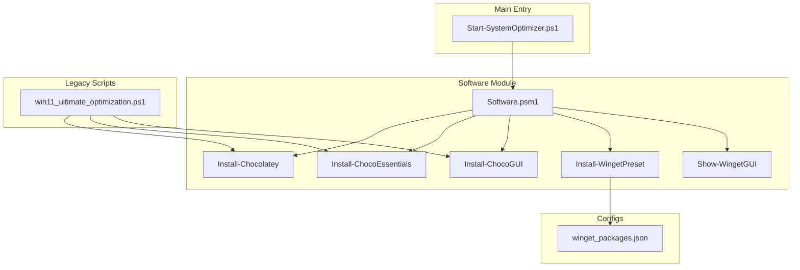
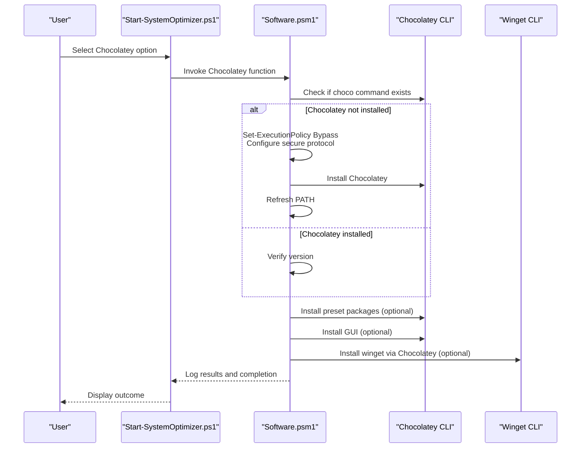
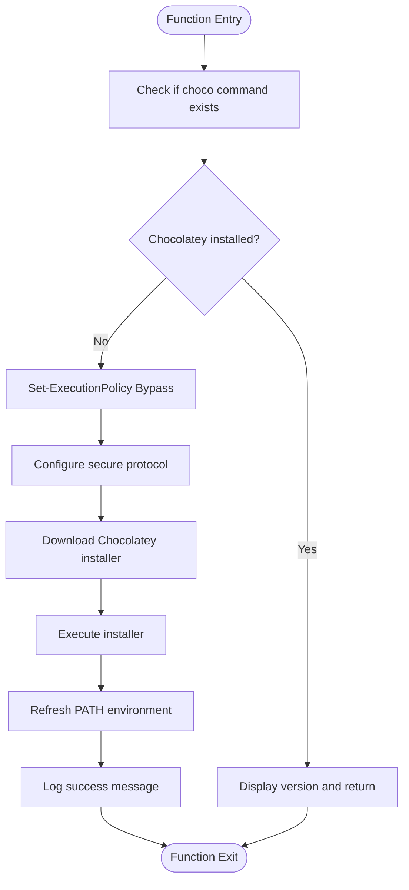
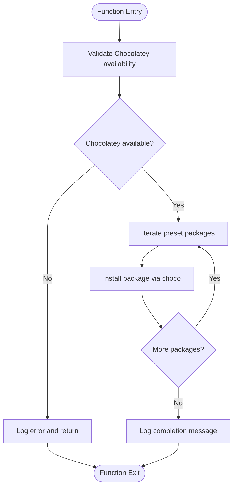
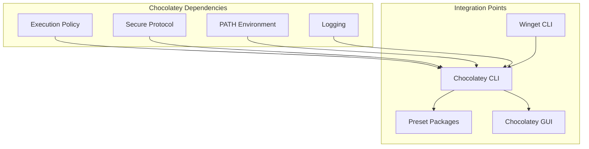

# Chocolatey Package Manager Support

<cite>
**Referenced Files in This Document**
- [Software.psm1](file://modules/Software.psm1)
- [Start-SystemOptimizer.ps1](file://Start-SystemOptimizer.ps1)
- [win11_ultimate_optimization.ps1](file://scripts/legacy/win11_ultimate_optimization.ps1)
- [winget_packages.json](file://configs/winget_packages.json)
</cite>

## Table of Contents
1. [Introduction](#introduction)
2. [Project Structure](#project-structure)
3. [Core Components](#core-components)
4. [Architecture Overview](#architecture-overview)
5. [Detailed Component Analysis](#detailed-component-analysis)
6. [Dependency Analysis](#dependency-analysis)
7. [Performance Considerations](#performance-considerations)
8. [Troubleshooting Guide](#troubleshooting-guide)
9. [Conclusion](#conclusion)

## Introduction
This document covers the Chocolatey package manager integration within the System Optimizer project. It explains how Chocolatey is installed and verified, how the Install-Chocolatey function handles PowerShell execution policy and secure protocol configuration, and how the Install-ChocoEssentials preset system manages essential packages. It also documents the Install-ChocoGUI function for Chocolatey GUI management, integration with existing Winget installations, PATH refresh mechanisms, and error handling for installation failures. Finally, it provides setup instructions for Chocolatey users, package management workflows, and troubleshooting guidance for common Chocolatey issues.

## Project Structure
Chocolatey integration is implemented primarily within the Software module and supported by the main entry script and legacy scripts. The integration includes:
- Installation verification and installation functions
- Preset system for essential packages
- Chocolatey GUI management
- Integration with Winget and PATH refresh
- Error handling and logging

**Diagram sources**
- [Software.psm1](file://modules/Software.psm1#L105-L131)
- [Start-SystemOptimizer.ps1](file://Start-SystemOptimizer.ps1#L480-L521)
- [win11_ultimate_optimization.ps1](file://scripts/legacy/win11_ultimate_optimization.ps1#L1183-L1265)
- [winget_packages.json](file://configs/winget_packages.json#L82-L87)

**Section sources**
- [Software.psm1](file://modules/Software.psm1#L105-L131)
- [Start-SystemOptimizer.ps1](file://Start-SystemOptimizer.ps1#L480-L521)

## Core Components
- Install-Chocolatey: Installs Chocolatey if not present, sets execution policy and secure protocol, verifies installation, and logs outcomes.
- Install-ChocoEssentials: Installs a curated list of essential packages via Chocolatey presets.
- Install-ChocoGUI: Installs Chocolatey GUI for managing packages through a graphical interface.
- Integration with Winget: Functions check for Winget availability and coordinate installation workflows.
- PATH refresh: Ensures Chocolatey binaries are accessible after installation.
- Error handling: Comprehensive logging and error reporting for installation failures.

**Section sources**
- [Software.psm1](file://modules/Software.psm1#L455-L476)
- [Software.psm1](file://modules/Software.psm1#L478-L504)
- [Software.psm1](file://modules/Software.psm1#L889-L903)
- [Software.psm1](file://modules/Software.psm1#L506-L577)

## Architecture Overview
The Chocolatey integration follows a modular approach:
- The main entry script loads modules and exposes menu options.
- The Software module provides Chocolatey installation, preset management, and GUI integration.
- Legacy scripts offer alternative installation paths and additional workflows.
- Configuration files support preset definitions for Winget packages.

**Diagram sources**
- [Software.psm1](file://modules/Software.psm1#L455-L476)
- [Software.psm1](file://modules/Software.psm1#L506-L577)
- [Software.psm1](file://modules/Software.psm1#L889-L903)

## Detailed Component Analysis

### Install-Chocolatey Function
Purpose:
- Verify Chocolatey installation
- Install Chocolatey if missing
- Configure PowerShell execution policy and secure protocol
- Log installation status and handle errors

Key behaviors:
- Checks for existing choco command
- Sets execution policy to Bypass for the current process
- Configures secure protocol for HTTPS communication
- Downloads and executes the official Chocolatey installer
- Refreshes PATH to include Chocolatey binaries
- Logs success or failure messages

**Diagram sources**
- [Software.psm1](file://modules/Software.psm1#L455-L476)

**Section sources**
- [Software.psm1](file://modules/Software.psm1#L455-L476)

### Install-ChocoEssentials Preset System
Purpose:
- Install a curated set of essential applications via Chocolatey
- Provide a standardized baseline of commonly used software

Essential packages included:
- Firefox (web browser)
- 7-Zip (compression tool)
- VLC (media player)
- Notepad++ (text editor)
- Adobe Reader (PDF viewer)
- Visual C++ redistributables (vcredist-all)
- .NET Desktop Runtime (dotnet-desktopruntime)

Workflow:
- Validates Chocolatey presence
- Iterates through the preset list
- Executes choco install for each package
- Provides progress feedback and logs completion

**Diagram sources**
- [Software.psm1](file://modules/Software.psm1#L478-L504)

**Section sources**
- [Software.psm1](file://modules/Software.psm1#L478-L504)

### Install-ChocoGUI Function
Purpose:
- Install Chocolatey GUI for graphical package management
- Provide a user-friendly interface for Chocolatey operations

Behavior:
- Verifies Chocolatey installation
- Installs chocolateygui package
- Logs successful installation and provides usage instructions

Integration:
- Works alongside command-line Chocolatey operations
- Leverages the installed Chocolatey infrastructure

**Section sources**
- [Software.psm1](file://modules/Software.psm1#L889-L903)

### Integration with Winget and PATH Refresh
Integration patterns:
- Check for Winget availability before proceeding
- Coordinate installation workflows between Winget and Chocolatey
- Refresh PATH environment variables to include Chocolatey binaries
- Attempt to install Winget via Chocolatey if missing

Error handling:
- Graceful degradation when Winget is unavailable
- Logging of installation attempts and outcomes
- Fallback mechanisms for remote desktop tools

**Section sources**
- [Software.psm1](file://modules/Software.psm1#L506-L577)

### Legacy Script Integration
The legacy script provides an alternative installation path with similar functionality:
- Chocolatey installation with execution policy and secure protocol configuration
- Essential package installation via Chocolatey
- Chocolatey GUI installation
- PATH refresh after installation

**Section sources**
- [win11_ultimate_optimization.ps1](file://scripts/legacy/win11_ultimate_optimization.ps1#L1183-L1265)
- [win11_ultimate_optimization.ps1](file://scripts/legacy/win11_ultimate_optimization.ps1#L1388-L1416)

## Dependency Analysis
Chocolatey integration depends on:
- PowerShell execution policy settings
- Secure protocol configuration for HTTPS
- Environment PATH updates
- Existing Winget installations for coordinated workflows
- Logging infrastructure for error reporting

**Diagram sources**
- [Software.psm1](file://modules/Software.psm1#L455-L476)
- [Software.psm1](file://modules/Software.psm1#L506-L577)
- [Software.psm1](file://modules/Software.psm1#L889-L903)

**Section sources**
- [Software.psm1](file://modules/Software.psm1#L455-L476)
- [Software.psm1](file://modules/Software.psm1#L506-L577)
- [Software.psm1](file://modules/Software.psm1#L889-L903)

## Performance Considerations
- Execution policy and secure protocol configuration are lightweight operations performed once per installation.
- Package installation performance depends on network connectivity and package sizes.
- PATH refresh ensures immediate availability of Chocolatey commands without requiring a shell restart.
- Coordinated installation with Winget minimizes redundant downloads and installations.

## Troubleshooting Guide
Common issues and resolutions:
- Installation failures: Check network connectivity and proxy settings. Review logs for detailed error messages.
- Execution policy restrictions: The installer temporarily sets execution policy to Bypass for the current process.
- Secure protocol errors: The installer configures secure protocol for HTTPS communication.
- PATH not updated: The installer refreshes PATH environment variables to include Chocolatey binaries.
- Chocolatey GUI not launching: Ensure Chocolatey is installed and the GUI package is successfully installed.

Setup instructions:
- Run as Administrator to ensure proper permissions
- Allow the installer to modify execution policy and secure protocol settings
- Verify installation by checking choco --version
- Use Install-ChocoEssentials to install essential packages
- Use Install-ChocoGUI for graphical package management

Package management workflows:
- Use Install-ChocoEssentials for a standardized set of essential applications
- Use Install-ChocoGUI for interactive package management
- Coordinate with Winget for complementary package management needs

Proxy configuration:
- Configure system-wide proxy settings if required
- Ensure HTTPS traffic is permitted for Chocolatey community repository
- Verify secure protocol settings for HTTPS communication

Package source problems:
- Verify Chocolatey repository accessibility
- Check for custom sources and their availability
- Ensure proper network connectivity to package sources

**Section sources**
- [Software.psm1](file://modules/Software.psm1#L455-L476)
- [Software.psm1](file://modules/Software.psm1#L506-L577)
- [Software.psm1](file://modules/Software.psm1#L889-L903)

## Conclusion
The Chocolatey integration in System Optimizer provides a robust foundation for package management on Windows systems. The implementation includes installation verification, secure configuration, preset management, and GUI integration. The system coordinates with Winget for comprehensive software management and includes comprehensive error handling and logging. Users can leverage both command-line and graphical interfaces for efficient package management workflows.