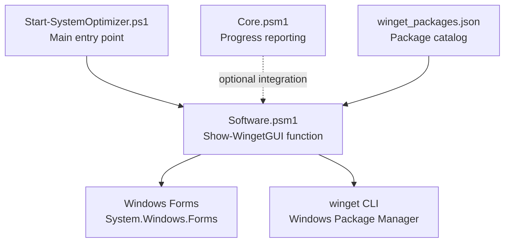
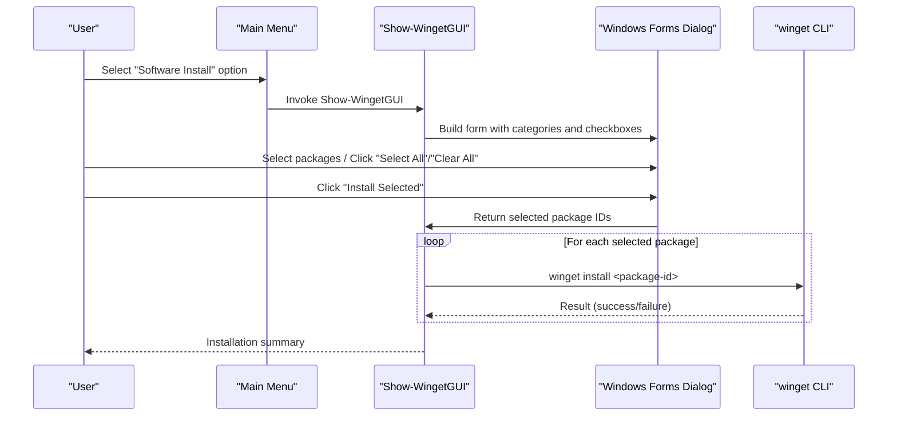
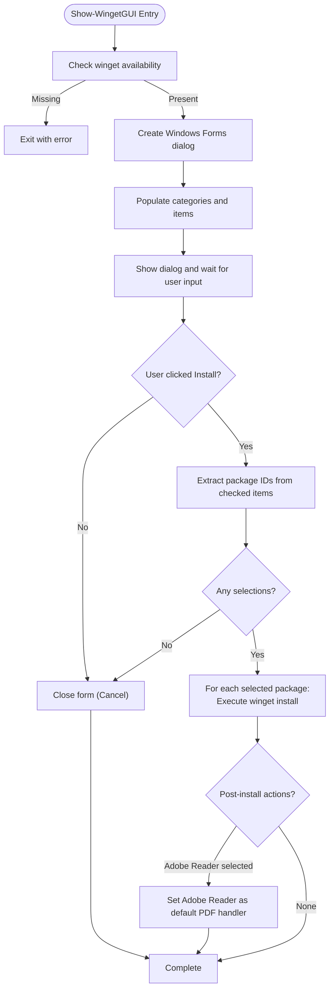
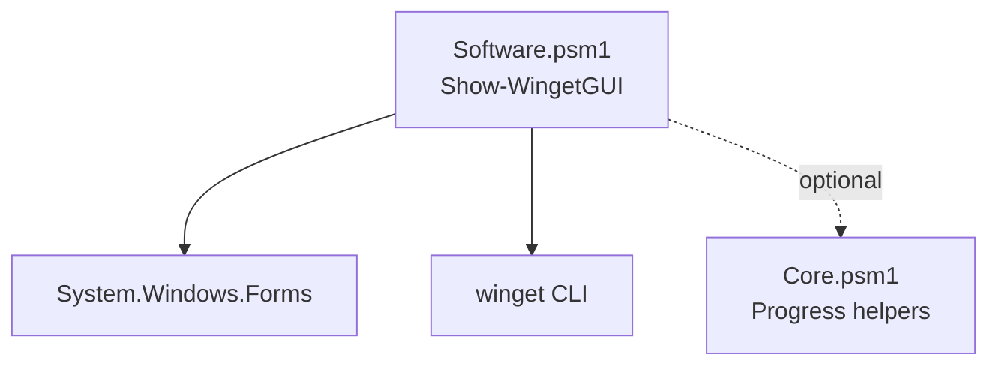

# GUI Package Selector

<cite>
**Referenced Files in This Document**
- [Start-SystemOptimizer.ps1](file://Start-SystemOptimizer.ps1)
- [Software.psm1](file://modules/Software.psm1)
- [Core.psm1](file://modules/Core.psm1)
- [winget_packages.json](file://configs/winget_packages.json)
</cite>

## Table of Contents
1. [Introduction](#introduction)
2. [Project Structure](#project-structure)
3. [Core Components](#core-components)
4. [Architecture Overview](#architecture-overview)
5. [Detailed Component Analysis](#detailed-component-analysis)
6. [Dependency Analysis](#dependency-analysis)
7. [Performance Considerations](#performance-considerations)
8. [Troubleshooting Guide](#troubleshooting-guide)
9. [Conclusion](#conclusion)

## Introduction
This document explains the Show-WingetGUI interactive package selector interface built with Windows Forms. It covers the categorized package listing system, checkbox-based selection mechanism, Select All/Clear All functionality, form layout, package ID extraction from display strings, and the batch installation workflow. It also documents the integration with the underlying Winget installation system, progress reporting, and success/failure handling. Usage instructions, package filtering, and troubleshooting selection issues are included, along with guidance on how new packages can be added to the selector.

## Project Structure
The GUI package selector is implemented as part of the Software module and integrates with the main application entry point. The configuration for package categories is maintained in a JSON file.

**Diagram sources**
- [Start-SystemOptimizer.ps1](file://Start-SystemOptimizer.ps1#L918-L994)
- [Software.psm1](file://modules/Software.psm1#L305-L453)
- [Core.psm1](file://modules/Core.psm1#L29-L51)
- [winget_packages.json](file://configs/winget_packages.json#L1-L108)

**Section sources**
- [Start-SystemOptimizer.ps1](file://Start-SystemOptimizer.ps1#L918-L994)
- [Software.psm1](file://modules/Software.psm1#L305-L453)
- [Core.psm1](file://modules/Core.psm1#L29-L51)
- [winget_packages.json](file://configs/winget_packages.json#L1-L108)

## Core Components
- Show-WingetGUI: The Windows Forms dialog that lists packages by category, supports checkbox selection, and triggers batch installation via winget.
- Package Categories: Predefined categories (Browsers, Utilities, Documents, Development, Runtimes, Remote, Gaming) populated from a curated list.
- Checkbox Selection: Users can select/deselect individual packages or use Select All/Clear All buttons.
- Batch Installation: Executes winget install for each selected package ID.
- Progress Reporting: Optional integration with the enhanced progress system for console/GUI progress display.
- Package Catalog: JSON-based configuration supporting presets and broader categories.

**Section sources**
- [Software.psm1](file://modules/Software.psm1#L305-L453)
- [Core.psm1](file://modules/Core.psm1#L29-L51)
- [winget_packages.json](file://configs/winget_packages.json#L1-L108)

## Architecture Overview
The GUI selector is invoked from the main menu and presents a Windows Forms dialog. The dialog builds a categorized list, captures selections, extracts package IDs, and executes winget install commands.

**Diagram sources**
- [Software.psm1](file://modules/Software.psm1#L305-L453)

## Detailed Component Analysis

### Show-WingetGUI Implementation
The function creates a Windows Forms dialog with:
- A categorized list of packages displayed in a CheckedListBox.
- Buttons for Select All, Clear All, Install Selected, and Cancel.
- Event handlers for button clicks and form closing.
- Extraction of package IDs from the display string format used in the list.

Key behaviors:
- Validates winget availability before proceeding.
- Populates categories using a predefined array of entries.
- Extracts package IDs using a pattern that captures the ID inside square brackets.
- Installs packages via winget with acceptance flags for agreements.

**Diagram sources**
- [Software.psm1](file://modules/Software.psm1#L305-L453)

**Section sources**
- [Software.psm1](file://modules/Software.psm1#L305-L453)

### Package Categorization Logic
The selector organizes packages into seven categories:
- Browsers: Firefox, Chrome, Brave
- Utilities: 7-Zip, Notepad++, VLC, Everything
- Documents: Adobe Reader, SumatraPDF
- Development: PowerShell, Git, VS Code, Windows Terminal, Python
- Runtimes: .NET runtimes, VC++ redistributables, Java runtime
- Remote: RustDesk, AnyDesk
- Gaming: Steam, Discord, Epic Games Launcher

Each category is represented by a header line starting with three dashes, followed by package entries in the format "Publisher.Id|Display Name".

**Section sources**
- [Software.psm1](file://modules/Software.psm1#L332-L364)

### Checkbox-Based Selection Mechanism
- CheckedListBox enables click-on-check behavior.
- Category headers are added as-is and ignored during selection processing.
- Selected items are iterated to extract package IDs using a regex pattern that captures the ID inside square brackets.

**Section sources**
- [Software.psm1](file://modules/Software.psm1#L325-L375)
- [Software.psm1](file://modules/Software.psm1#L428-L437)

### Select All/Clear All Functionality
- Select All: Iterates through all items and checks those that are not category headers.
- Clear All: Unchecks all items regardless of type.

**Section sources**
- [Software.psm1](file://modules/Software.psm1#L377-L401)

### Form Layout and Controls
- Form: FixedDialog, centered screen, non-resizable.
- CheckedListBox: Large list area with CheckOnClick enabled.
- Buttons: Select All, Clear All, Install Selected (highlighted), Cancel.
- Install Selected triggers OK result and closes the form.

**Section sources**
- [Software.psm1](file://modules/Software.psm1#L318-L324)
- [Software.psm1](file://modules/Software.psm1#L377-L424)

### Package ID Extraction from Display Strings
- Display format: "Display Name [Package ID]"
- Extraction uses a regex to capture the content within square brackets.
- Only non-header items are considered for extraction.

**Section sources**
- [Software.psm1](file://modules/Software.psm1#L366-L373)
- [Software.psm1](file://modules/Software.psm1#L432-L435)

### Batch Installation Workflow
- Collects selected package IDs.
- Executes winget install for each package with acceptance flags.
- Provides installation summary and handles post-install steps (e.g., setting Adobe Reader as default).

**Section sources**
- [Software.psm1](file://modules/Software.psm1#L428-L452)

### Integration with Winget Installation System
- The function validates winget presence and proceeds only if available.
- Uses winget install with flags to accept package and source agreements.
- Handles failures by logging warnings and continuing with remaining packages.

**Section sources**
- [Software.psm1](file://modules/Software.psm1#L308-L313)
- [Software.psm1](file://modules/Software.psm1#L441-L444)

### Progress Reporting and Success/Failure Handling
- Optional integration with the enhanced progress system is available through the Core module.
- The progress system supports console and GUI modes, with automatic cleanup.
- Success/failure is logged for each package installation.

**Section sources**
- [Core.psm1](file://modules/Core.psm1#L29-L51)
- [Core.psm1](file://modules/Core.psm1#L280-L396)
- [Core.psm1](file://modules/Core.psm1#L398-L444)
- [Software.psm1](file://modules/Software.psm1#L279-L291)

### Package Filtering and Presets
- The JSON configuration defines broader categories and presets for automated installation.
- While the GUI focuses on a curated subset, the JSON provides a comprehensive catalog and preset definitions.

**Section sources**
- [winget_packages.json](file://configs/winget_packages.json#L1-L108)

### Adding New Packages to the Selector
To add a new package to the GUI selector:
1. Decide the appropriate category (e.g., Browsers, Utilities, Documents, Development, Runtimes, Remote, Gaming).
2. Add a new entry in the packages array using the format "Publisher.Id|Display Name".
3. Ensure the display name is user-friendly and the ID is the correct winget package identifier.
4. Re-run the GUI to verify the new entry appears correctly.

**Section sources**
- [Software.psm1](file://modules/Software.psm1#L332-L364)

## Dependency Analysis
The GUI selector depends on:
- Windows Forms assemblies for UI rendering.
- winget CLI for package installation.
- Optional progress reporting from the Core module.

**Diagram sources**
- [Software.psm1](file://modules/Software.psm1#L315-L316)
- [Software.psm1](file://modules/Software.psm1#L441-L444)
- [Core.psm1](file://modules/Core.psm1#L29-L51)

**Section sources**
- [Software.psm1](file://modules/Software.psm1#L315-L316)
- [Software.psm1](file://modules/Software.psm1#L441-L444)
- [Core.psm1](file://modules/Core.psm1#L29-L51)

## Performance Considerations
- The Windows Forms dialog is lightweight and suitable for small to medium-sized package lists.
- Batch installation runs sequentially; consider parallelization only if the underlying winget supports concurrent installs and the system can handle it.
- Progress reporting is optional; enabling GUI mode may improve responsiveness for long-running installations.

## Troubleshooting Guide
Common issues and resolutions:
- Winget not found: The function exits early with an error. Install the Microsoft Store App Installer to obtain winget.
- No packages selected: The function skips installation when no items are checked.
- Installation failures: The function logs warnings for failed or already installed packages and continues. Review the winget logs for details.
- Adobe Reader default setting: If Adobe Reader is selected, the function attempts to set it as the default PDF handler; Windows may require confirmation in Settings.

**Section sources**
- [Software.psm1](file://modules/Software.psm1#L308-L313)
- [Software.psm1](file://modules/Software.psm1#L283-L291)
- [Software.psm1](file://modules/Software.psm1#L447-L450)

## Conclusion
The Show-WingetGUI interactive package selector provides a user-friendly way to browse, filter, and install packages via winget. Its Windows Forms interface offers immediate visual feedback, while the underlying architecture supports easy extension with new categories and packages. Optional progress reporting enhances the user experience during batch operations.