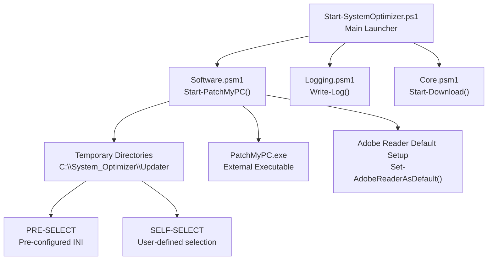
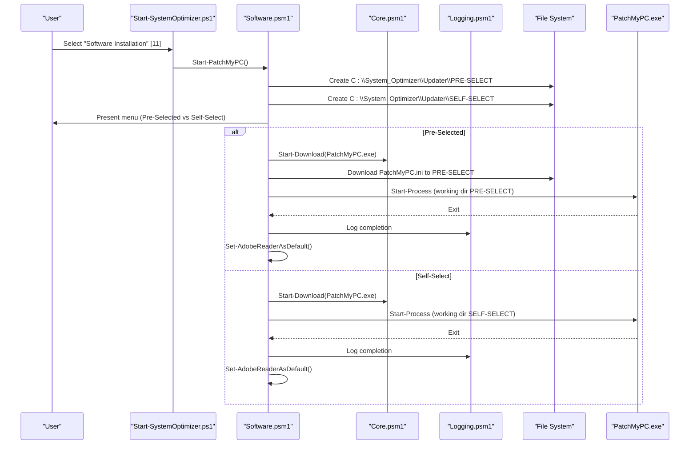
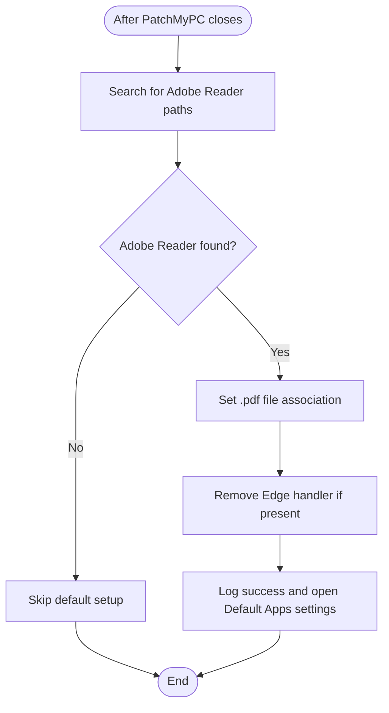
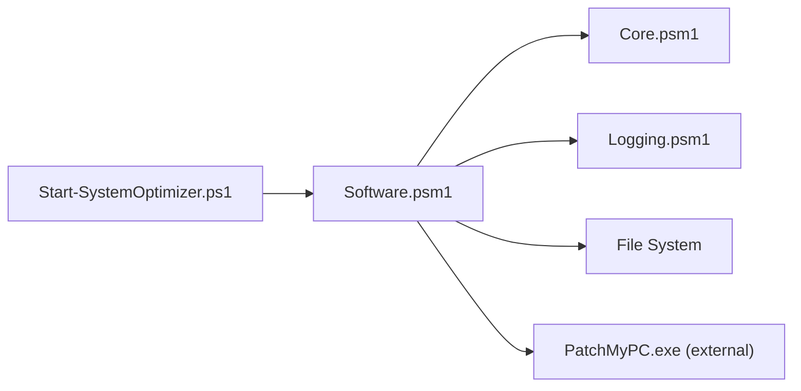

# PatchMyPC Integration

<cite>
**Referenced Files in This Document**
- [Start-SystemOptimizer.ps1](file://Start-SystemOptimizer.ps1)
- [Software.psm1](file://modules/Software.psm1)
- [Logging.psm1](file://modules/Logging.psm1)
- [Core.psm1](file://modules/Core.psm1)
- [PatchMyPC.ini](file://configs/PatchMyPC.ini)
- [README.md](file://README.md)
- [FEATURES.md](file://docs/FEATURES.md)
</cite>

## Table of Contents
1. [Introduction](#introduction)
2. [Project Structure](#project-structure)
3. [Core Components](#core-components)
4. [Architecture Overview](#architecture-overview)
5. [Detailed Component Analysis](#detailed-component-analysis)
6. [Dependency Analysis](#dependency-analysis)
7. [Performance Considerations](#performance-considerations)
8. [Troubleshooting Guide](#troubleshooting-guide)
9. [Conclusion](#conclusion)

## Introduction
This document explains the PatchMyPC integration system within the System Optimizer toolkit. It covers the two installation modes—Pre-Selected Apps (common software) and Self-Select Apps (custom selection)—the automated download and execution workflow, temporary directory structure, INI configuration management, integration with external PatchMyPC.exe, menu-driven interface, progress tracking, error handling, and automatic Adobe Reader default application setup. It also provides troubleshooting guidance and examples of typical software selections.

## Project Structure
The PatchMyPC integration is implemented as part of the Software module and integrates with the main System Optimizer launcher. Key elements:
- Software module provides the PatchMyPC menu and workflow
- Temporary directories under C:\System_Optimizer\Updater for downloads and execution
- Centralized logging via the Logging module
- Shared progress tracking utilities in Core module
- Pre-configured INI file for Pre-Selected Apps mode

**Diagram sources**
- [Start-SystemOptimizer.ps1](file://Start-SystemOptimizer.ps1#L492-L494)
- [Software.psm1](file://modules/Software.psm1#L5-L131)
- [Logging.psm1](file://modules/Logging.psm1#L334-L351)
- [Core.psm1](file://modules/Core.psm1#L556-L696)

**Section sources**
- [README.md](file://README.md#L42-L46)
- [FEATURES.md](file://docs/FEATURES.md#L129-L141)

## Core Components
- Start-PatchMyPC(): Orchestrates the PatchMyPC workflow, presents the menu, manages downloads, executes PatchMyPC.exe, and handles post-installation actions.
- Temporary Directories: Creates and uses C:\System_Optimizer\Updater with subfolders PRE-SELECT and SELF-SELECT.
- Download Helpers: Uses Start-Download() when available; falls back to Invoke-WebRequest otherwise.
- INI Management: Downloads a pre-configured PatchMyPC.ini for Pre-Selected mode; Self-Select mode runs without a pre-configured INI.
- Adobe Reader Default Setup: Automatically sets Adobe Reader as the default PDF handler when detected.
- Logging: Centralized Write-Log() function for consistent logging across operations.

**Section sources**
- [Software.psm1](file://modules/Software.psm1#L5-L131)
- [Software.psm1](file://modules/Software.psm1#L133-L207)
- [Core.psm1](file://modules/Core.psm1#L556-L696)
- [Logging.psm1](file://modules/Logging.psm1#L334-L351)

## Architecture Overview
The PatchMyPC integration follows a modular architecture:
- The main launcher loads modules and exposes menu options.
- The Software module implements the PatchMyPC workflow.
- Downloads are performed with progress support when available.
- Execution is synchronous (waits for PatchMyPC.exe to exit).
- Post-execution, the system checks for Adobe Reader and sets it as the default PDF handler.

**Diagram sources**
- [Start-SystemOptimizer.ps1](file://Start-SystemOptimizer.ps1#L492-L494)
- [Software.psm1](file://modules/Software.psm1#L5-L131)
- [Core.psm1](file://modules/Core.psm1#L556-L696)
- [Logging.psm1](file://modules/Logging.psm1#L334-L351)

## Detailed Component Analysis

### Temporary Directory Structure
- Base: C:\System_Optimizer\Updater
- Subdirectories:
  - PRE-SELECT: Used for Pre-Selected Apps mode; contains PatchMyPC.exe and PatchMyPC.ini
  - SELF-SELECT: Used for Self-Select Apps mode; contains PatchMyPC.exe only

Behavior:
- Both directories are created if they do not exist.
- PatchMyPC.exe is downloaded to the respective subdirectory.
- Pre-Selected mode additionally downloads a pre-configured PatchMyPC.ini from the repository.

**Section sources**
- [Software.psm1](file://modules/Software.psm1#L6-L12)
- [Software.psm1](file://modules/Software.psm1#L49-L67)
- [Software.psm1](file://modules/Software.psm1#L83-L95)

### Menu-Driven Interface
The menu presents:
- Pre-Selected Apps (Common software): Downloads PatchMyPC.exe and a pre-configured INI, then launches PatchMyPC.exe.
- Self-Select Apps (Choose your own): Downloads PatchMyPC.exe only, then launches PatchMyPC.exe for user-driven selection.

Post-execution:
- The system waits for PatchMyPC.exe to exit.
- After execution, it attempts to set Adobe Reader as the default PDF handler.

**Section sources**
- [Software.psm1](file://modules/Software.psm1#L17-L43)
- [Software.psm1](file://modules/Software.psm1#L48-L109)

### Automated Download and Execution Workflow
- Download:
  - Uses Start-Download() if available; otherwise falls back to Invoke-WebRequest.
  - Downloads PatchMyPC.exe from the official updater URL.
  - For Pre-Selected mode, also downloads PatchMyPC.ini from the repository.
- Execution:
  - Starts PatchMyPC.exe with working directory set to the appropriate subdirectory.
  - Waits synchronously for the process to exit.
- Logging:
  - Writes progress and completion messages using Write-Log().

**Section sources**
- [Software.psm1](file://modules/Software.psm1#L54-L61)
- [Software.psm1](file://modules/Software.psm1#L64-L67)
- [Software.psm1](file://modules/Software.psm1#L69-L74)
- [Software.psm1](file://modules/Software.psm1#L87-L95)
- [Software.psm1](file://modules/Software.psm1#L97-L102)
- [Core.psm1](file://modules/Core.psm1#L556-L696)
- [Logging.psm1](file://modules/Logging.psm1#L334-L351)

### INI Configuration Management
- Pre-Selected mode:
  - Downloads a pre-configured PatchMyPC.ini from the repository.
  - This INI defines which applications are selected by default.
- Self-Select mode:
  - Does not download a pre-configured INI.
  - Users select applications within PatchMyPC.exe.

Typical categories in the pre-configured INI include:
- Options (e.g., logging, silent install, minimize behavior)
- Plugins and Runtimes (e.g., Java, .NET Framework, Silverlight)
- Browsers (e.g., Chrome, Firefox, Brave)
- Multimedia (e.g., VLC, K-Lite Codec Pack)
- Utilities (e.g., CCleaner, Everything, WinMerge)
- Documents (e.g., Adobe Reader, SumatraPDF)
- Media Tools (e.g., HandBrake, OBS Studio)
- Messaging (e.g., Discord, Telegram)
- Developer tools (e.g., VS Code, Git, PowerShell)
- Microsoft Visual C++ Runtimes
- Graphics (e.g., ImageGlass, FastStone ImageViewer)
- Security (e.g., Malwarebytes, Bitdefender)
- Miscellaneous and Gaming (e.g., Steam, Origin, GOG Galaxy)

**Section sources**
- [Software.psm1](file://modules/Software.psm1#L64-L67)
- [PatchMyPC.ini](file://configs/PatchMyPC.ini#L1-L376)

### Integration with External PatchMyPC.exe
- The integration launches the external PatchMyPC.exe with working directory set to either PRE-SELECT or SELF-SELECT.
- The process is launched and awaited to completion.
- This allows PatchMyPC.exe to manage its own UI, download, and installation logic.

**Section sources**
- [Software.psm1](file://modules/Software.psm1#L72-L74)
- [Software.psm1](file://modules/Software.psm1#L100-L102)

### Progress Tracking and Error Handling
- Progress:
  - Start-Download() provides a progress bar and speed display when available.
  - Fallback to Invoke-WebRequest without progress.
- Error handling:
  - Try/catch blocks around download and execution steps.
  - Errors are logged via Write-Log() with ERROR severity.
  - On failure, the system logs the exception and continues.

**Section sources**
- [Core.psm1](file://modules/Core.psm1#L556-L696)
- [Software.psm1](file://modules/Software.psm1#L78-L80)
- [Software.psm1](file://modules/Software.psm1#L107-L109)
- [Logging.psm1](file://modules/Logging.psm1#L334-L351)

### Automatic Adobe Reader Default Application Setup
After PatchMyPC completes:
- The system searches for Adobe Reader installations in common paths.
- If found, it sets Adobe Reader as the default PDF handler via registry manipulation.
- If Windows protects UserChoice, it opens the Default Apps settings for user confirmation.

**Diagram sources**
- [Software.psm1](file://modules/Software.psm1#L133-L207)

**Section sources**
- [Software.psm1](file://modules/Software.psm1#L133-L207)

### Typical Software Selections and Customization
- Pre-Selected Apps:
  - Includes commonly used applications across browsers, multimedia, utilities, documents, media tools, messaging, developer tools, runtimes, graphics, security, and gaming.
  - The selection is defined by the pre-configured INI file.
- Self-Select Apps:
  - Allows users to choose applications directly within PatchMyPC.exe.
  - No pre-configured INI is downloaded.

Examples of categories and representative tools:
- Browsers: Google Chrome, Mozilla Firefox, Brave
- Utilities: 7-Zip, VLC, CCleaner, Everything, WinMerge
- Documents: Adobe Reader, SumatraPDF
- Media Tools: HandBrake, OBS Studio
- Messaging: Discord, Telegram
- Developer: VS Code, Git, PowerShell
- Runtimes: .NET, VC++, Java
- Security: Malwarebytes, Bitdefender
- Gaming: Steam, Discord, Epic Games

**Section sources**
- [PatchMyPC.ini](file://configs/PatchMyPC.ini#L36-L376)
- [FEATURES.md](file://docs/FEATURES.md#L129-L158)

## Dependency Analysis
- Start-SystemOptimizer.ps1 depends on Software.psm1 for the PatchMyPC workflow.
- Software.psm1 depends on:
  - Core.psm1 for Start-Download() and progress tracking
  - Logging.psm1 for Write-Log() and centralized logging
  - FileSystem for creating directories and managing files
- PatchMyPC.exe is external and managed independently by the PatchMyPC team.

**Diagram sources**
- [Start-SystemOptimizer.ps1](file://Start-SystemOptimizer.ps1#L492-L494)
- [Software.psm1](file://modules/Software.psm1#L5-L131)
- [Core.psm1](file://modules/Core.psm1#L556-L696)
- [Logging.psm1](file://modules/Logging.psm1#L334-L351)

**Section sources**
- [Start-SystemOptimizer.ps1](file://Start-SystemOptimizer.ps1#L481-L521)
- [Software.psm1](file://modules/Software.psm1#L5-L131)

## Performance Considerations
- Download performance:
  - Prefer Start-Download() for progress and speed metrics; it uses BITS when available.
  - Fallback to Invoke-WebRequest is slower and lacks progress indicators.
- Execution:
  - The workflow waits for PatchMyPC.exe to exit, which can take several minutes depending on selected applications.
- Logging overhead:
  - Logging is lightweight but still writes to disk; ensure sufficient disk space in C:\System_Optimizer\Logs.

[No sources needed since this section provides general guidance]

## Troubleshooting Guide

### Download Failures
Symptoms:
- Download does not start or immediately fails.
- Progress bar does not appear.

Common causes and fixes:
- Network connectivity issues:
  - Verify internet access and proxy/firewall settings.
- Repository availability:
  - The system downloads from patchmypc.com and GitHub raw content. If either is blocked, downloads will fail.
- Fallback mechanism:
  - The system automatically falls back to Invoke-WebRequest if Start-Download() is unavailable or fails.

Actions:
- Retry the download manually using a browser.
- Check firewall/antivirus interference.
- Ensure outbound HTTPS traffic is permitted.

**Section sources**
- [Software.psm1](file://modules/Software.psm1#L56-L61)
- [Software.psm1](file://modules/Software.psm1#L89-L95)
- [Core.psm1](file://modules/Core.psm1#L593-L601)

### Execution Issues
Symptoms:
- PatchMyPC.exe does not launch or exits immediately.
- The system reports “PatchMyPC closed” but no changes occurred.

Common causes and fixes:
- Working directory issues:
  - Ensure the working directory is set to PRE-SELECT or SELF-SELECT.
- Permission issues:
  - Run the launcher as Administrator.
- Conflicting antivirus:
  - Temporarily disable real-time protection or add exceptions for the updater directories.

Actions:
- Manually launch PatchMyPC.exe from the appropriate subdirectory.
- Check logs in C:\System_Optimizer\Logs for error details.

**Section sources**
- [Software.psm1](file://modules/Software.psm1#L72-L74)
- [Software.psm1](file://modules/Software.psm1#L100-L102)

### Configuration Problems
Symptoms:
- Pre-Selected mode does not install expected applications.
- Self-Select mode shows no pre-configured selections.

Common causes and fixes:
- Corrupted or missing INI:
  - Delete the pre-configured INI in PRE-SELECT and re-run Pre-Selected mode to re-download it.
- User choice conflicts:
  - Windows may protect UserChoice for file associations. The system opens Default Apps settings for confirmation.

Actions:
- Re-download the INI file.
- Manually set Adobe Reader as default via Windows settings if prompted.

**Section sources**
- [Software.psm1](file://modules/Software.psm1#L64-L67)
- [Software.psm1](file://modules/Software.psm1#L176-L199)

### Adobe Reader Default Not Set
Symptoms:
- PDF files open with another application despite successful installation.

Common causes and fixes:
- Adobe Reader not detected:
  - Verify installation paths and reinstall if necessary.
- Windows protected UserChoice:
  - The system opens Default Apps settings; follow prompts to set Adobe Reader as default.

Actions:
- Manually set the default PDF handler in Windows settings.
- Ensure Adobe Reader is installed and registered.

**Section sources**
- [Software.psm1](file://modules/Software.psm1#L133-L207)

## Conclusion
The PatchMyPC integration in System Optimizer provides a streamlined, menu-driven approach to software installation and updates. It supports both Pre-Selected Apps (with a curated INI) and Self-Select Apps modes, manages downloads with progress tracking, executes PatchMyPC.exe with proper working directories, and automates Adobe Reader default application setup. Robust logging and error handling ensure reliable operation, while troubleshooting guidance helps resolve common issues quickly.