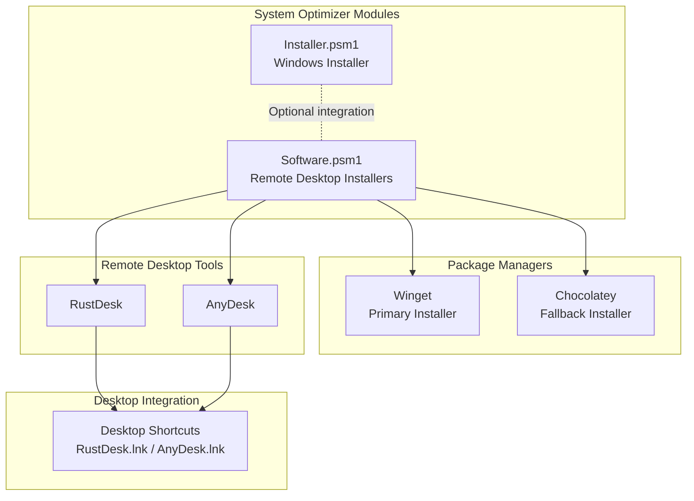
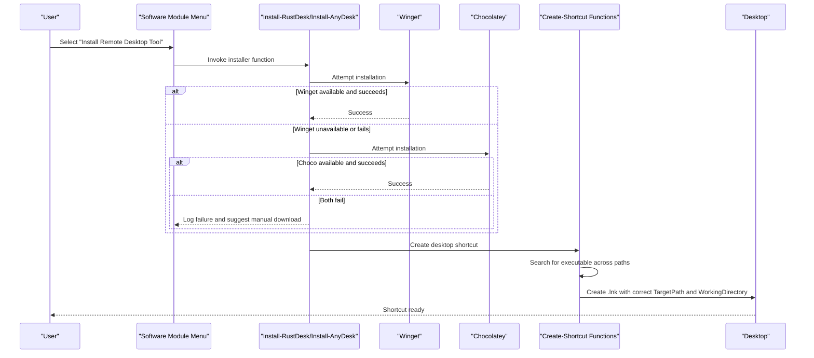
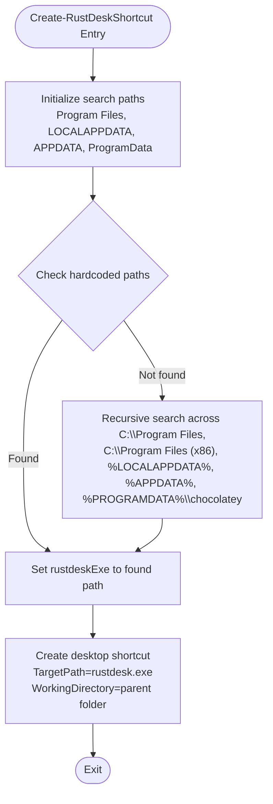
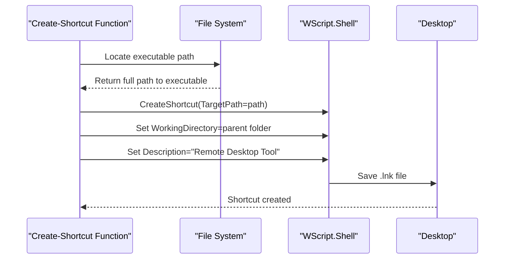
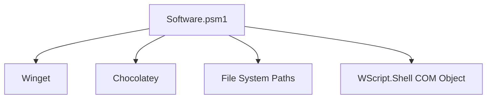

# Remote Desktop Tools

<cite>
**Referenced Files in This Document**
- [Software.psm1](file://modules/Software.psm1)
- [Installer.psm1](file://modules/Installer.psm1)
- [winget_packages.json](file://configs/winget_packages.json)
- [FEATURES.md](file://docs/FEATURES.md)
- [README.md](file://README.md)
</cite>

## Table of Contents
1. [Introduction](#introduction)
2. [Project Structure](#project-structure)
3. [Core Components](#core-components)
4. [Architecture Overview](#architecture-overview)
5. [Detailed Component Analysis](#detailed-component-analysis)
6. [Dependency Analysis](#dependency-analysis)
7. [Performance Considerations](#performance-considerations)
8. [Troubleshooting Guide](#troubleshooting-guide)
9. [Conclusion](#conclusion)
10. [Appendices](#appendices)

## Introduction
This document explains the remote desktop tool installation system integrated into the System Optimizer toolkit. It covers the dual-installation strategy using Winget as the primary package manager and Chocolatey as a fallback, automatic installation method detection, and the desktop shortcut creation process for RustDesk and AnyDesk. It also documents the comprehensive search algorithms used to locate installed executables across standard installation paths, user profiles, and Chocolatey-managed locations. Finally, it provides troubleshooting guidance for installation failures, shortcut creation issues, and common remote desktop configuration problems, along with manual download instructions and alternative installation methods.

## Project Structure
The remote desktop installation system is implemented within the Software module and integrates with the broader System Optimizer framework. Key elements include:
- Software module functions for installing RustDesk and AnyDesk
- Automatic detection and fallback between Winget and Chocolatey
- Desktop shortcut creation with proper target paths and working directories
- Comprehensive search algorithms for locating installed executables
- Integration with the Windows Installer module for system-wide deployment scenarios

**Diagram sources**
- [Software.psm1](file://modules/Software.psm1#L506-L666)
- [Installer.psm1](file://modules/Installer.psm1#L511-L681)

**Section sources**
- [Software.psm1](file://modules/Software.psm1#L1-L131)
- [README.md](file://README.md#L34-L46)

## Core Components
- Install-RustDesk: Installs RustDesk using Winget first, then falls back to Chocolatey if Winget is unavailable or fails. On success, creates a desktop shortcut.
- Install-AnyDesk: Installs AnyDesk using Winget first, then falls back to Chocolatey if Winget is unavailable or fails. On success, creates a desktop shortcut.
- Create-RustDeskShortcut: Searches for the RustDesk executable across standard installation paths, user profiles, and Chocolatey-managed locations, then creates a desktop shortcut with the correct working directory.
- Create-AnyDeskShortcut: Searches for the AnyDesk executable across standard installation paths, user profiles, and Chocolatey-managed locations, then creates a desktop shortcut with the correct working directory.
- Automatic method detection: Both installers detect the presence of Winget and Chocolatey, attempting Winget first and falling back to Chocolatey when necessary.

**Section sources**
- [Software.psm1](file://modules/Software.psm1#L506-L666)
- [Software.psm1](file://modules/Software.psm1#L668-L773)

## Architecture Overview
The remote desktop installation system follows a layered architecture:
- Presentation Layer: Menu-driven interface in the Software module exposes options for installing RustDesk and AnyDesk.
- Business Logic Layer: Installer functions encapsulate the dual-installation strategy and shortcut creation logic.
- Integration Layer: Functions integrate with Winget and Chocolatey to perform package installations.
- Discovery Layer: Shortcut creators implement comprehensive search algorithms to locate installed executables.
- Persistence Layer: Desktop shortcuts are created with appropriate target paths and working directories.

**Diagram sources**
- [Software.psm1](file://modules/Software.psm1#L506-L666)
- [Software.psm1](file://modules/Software.psm1#L668-L773)

## Detailed Component Analysis

### Install-RustDesk
The RustDesk installer implements a robust dual-installation strategy:
- Primary method: Winget installation with acceptance of package and source agreements
- Fallback method: Chocolatey installation with automatic Chocolatey installation if not present
- Post-installation: Creates a desktop shortcut pointing to the discovered RustDesk executable

Key behaviors:
- Checks for Winget availability before attempting installation
- Attempts Chocolatey installation if Winget is unavailable or fails
- Refreshes PATH environment after Chocolatey installation to ensure command availability
- Optionally installs Winget via Chocolatey if Chocolatey succeeds but Winget is missing
- Invokes Create-RustDeskShortcut on successful installation

**Section sources**
- [Software.psm1](file://modules/Software.psm1#L506-L585)

### Install-AnyDesk
The AnyDesk installer mirrors the RustDesk installer’s dual-installation approach:
- Primary method: Winget installation with acceptance of package and source agreements
- Fallback method: Chocolatey installation with automatic Chocolatey installation if not present
- Post-installation: Creates a desktop shortcut pointing to the discovered AnyDesk executable

Key behaviors:
- Checks for Winget availability before attempting installation
- Attempts Chocolatey installation if Winget is unavailable or fails
- Refreshes PATH environment after Chocolatey installation to ensure command availability
- Optionally installs Winget via Chocolatey if Chocolatey succeeds but Winget is missing
- Invokes Create-AnyDeskShortcut on successful installation

**Section sources**
- [Software.psm1](file://modules/Software.psm1#L587-L666)

### Create-RustDeskShortcut
The RustDesk shortcut creator implements a comprehensive search algorithm:
- Hardcoded common installation paths for RustDesk across Program Files, LOCALAPPDATA, APPDATA, and ProgramData
- Explicitly checks Chocolatey-managed locations
- Performs recursive search across common installation directories if initial checks fail
- Creates a desktop shortcut with:
  - TargetPath: Path to rustdesk.exe
  - WorkingDirectory: Directory containing rustdesk.exe
  - Description: Human-readable description for the shortcut

**Diagram sources**
- [Software.psm1](file://modules/Software.psm1#L668-L721)

**Section sources**
- [Software.psm1](file://modules/Software.psm1#L668-L721)

### Create-AnyDeskShortcut
The AnyDesk shortcut creator mirrors the RustDesk shortcut creator’s approach:
- Hardcoded common installation paths for AnyDesk across Program Files, LOCALAPPDATA, APPDATA, and ProgramData
- Explicitly checks Chocolatey-managed locations
- Performs recursive search across common installation directories if initial checks fail
- Creates a desktop shortcut with:
  - TargetPath: Path to AnyDesk.exe
  - WorkingDirectory: Directory containing AnyDesk.exe
  - Description: Human-readable description for the shortcut

**Diagram sources**
- [Software.psm1](file://modules/Software.psm1#L723-L773)

**Section sources**
- [Software.psm1](file://modules/Software.psm1#L723-L773)

### Automatic Installation Method Detection
Both installers implement automatic detection of available package managers:
- Winget detection: Uses Get-Command to check for winget availability
- Chocolatey detection: Uses Get-Command to check for choco availability
- Conditional execution: Attempts Winget first; if unavailable or fails, attempts Chocolatey
- Environment refresh: After Chocolatey installation, refreshes PATH to ensure choco is available in the current session

**Section sources**
- [Software.psm1](file://modules/Software.psm1#L511-L528)
- [Software.psm1](file://modules/Software.psm1#L592-L609)
- [Software.psm1](file://modules/Software.psm1#L536-L550)
- [Software.psm1](file://modules/Software.psm1#L617-L631)

### Desktop Shortcut Creation Process
The shortcut creation process ensures proper configuration:
- TargetPath: Points directly to the discovered executable
- WorkingDirectory: Set to the directory containing the executable
- Description: Provides a meaningful description for the shortcut
- Location: Created on the user’s desktop

**Diagram sources**
- [Software.psm1](file://modules/Software.psm1#L707-L715)
- [Software.psm1](file://modules/Software.psm1#L759-L766)

**Section sources**
- [Software.psm1](file://modules/Software.psm1#L707-L715)
- [Software.psm1](file://modules/Software.psm1#L759-L766)

## Dependency Analysis
The remote desktop installation system depends on:
- Package managers: Winget and Chocolatey for software installation
- File system: Standard installation directories and Chocolatey-managed locations
- COM automation: WScript.Shell for creating desktop shortcuts
- PowerShell cmdlets: Get-Command, Get-ChildItem, Test-Path for discovery and validation

**Diagram sources**
- [Software.psm1](file://modules/Software.psm1#L506-L666)
- [Software.psm1](file://modules/Software.psm1#L668-L773)

**Section sources**
- [Software.psm1](file://modules/Software.psm1#L506-L666)
- [Software.psm1](file://modules/Software.psm1#L668-L773)

## Performance Considerations
- Minimizing search overhead: The search algorithm prioritizes hardcoded paths to reduce recursive scanning.
- Early termination: Once an executable is found, the search stops to avoid redundant operations.
- Environment refresh: Refreshing PATH after Chocolatey installation avoids repeated detection failures.
- Logging: Extensive logging helps diagnose performance bottlenecks and installation issues.

## Troubleshooting Guide
Common issues and resolutions:
- Installation failures:
  - Winget not found: Install the App Installer from the Microsoft Store or use Chocolatey as a fallback.
  - Chocolatey not found: Install Chocolatey using the dedicated function; ensure the session PATH is refreshed.
  - Permission errors: Run the script with administrative privileges.
  - Network connectivity: Ensure outbound access to package repositories is available.
- Shortcut creation issues:
  - Executable not found: Verify the tool is installed and located in a standard path or Chocolatey-managed directory.
  - Desktop write permissions: Ensure the user has permission to create files on the desktop.
  - Working directory mismatch: Confirm the shortcut’s WorkingDirectory points to the executable’s directory.
- Remote desktop configuration problems:
  - Port conflicts: Adjust firewall rules and router port forwarding as needed.
  - Authentication: Ensure credentials are correct and account policies allow remote connections.
  - Security policies: Review group policies and antivirus settings that may block remote desktop traffic.

Manual download instructions:
- RustDesk: Visit the official download page for manual installation.
- AnyDesk: Visit the official download page for manual installation.

Alternative installation methods:
- Use the Windows Installer module to deploy tools during system setup.
- Use the Winget GUI to select and install remote desktop tools interactively.
- Use Chocolatey GUI to manage and install remote desktop tools.

**Section sources**
- [Software.psm1](file://modules/Software.psm1#L578-L580)
- [Software.psm1](file://modules/Software.psm1#L660-L661)
- [Software.psm1](file://modules/Software.psm1#L668-L721)
- [Software.psm1](file://modules/Software.psm1#L723-L773)

## Conclusion
The remote desktop installation system in System Optimizer provides a reliable, automated approach to installing and configuring RustDesk and AnyDesk. By leveraging Winget as the primary installer and Chocolatey as a robust fallback, it maximizes compatibility across diverse environments. The comprehensive search algorithms ensure that desktop shortcuts are created accurately, regardless of installation location. With clear troubleshooting guidance and manual download options, users can confidently deploy remote desktop tools as part of their system optimization workflow.

## Appendices
- Related configuration: Winget package lists include remote desktop tools for streamlined installation.
- Feature documentation: The features reference highlights remote desktop installation capabilities.

**Section sources**
- [winget_packages.json](file://configs/winget_packages.json#L21-L25)
- [FEATURES.md](file://docs/FEATURES.md#L155-L157)