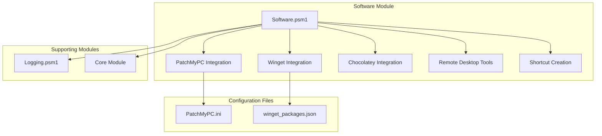
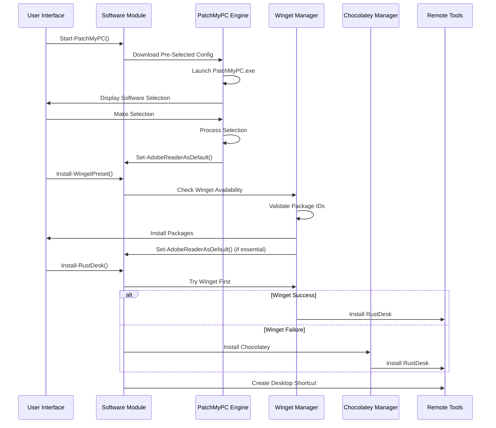
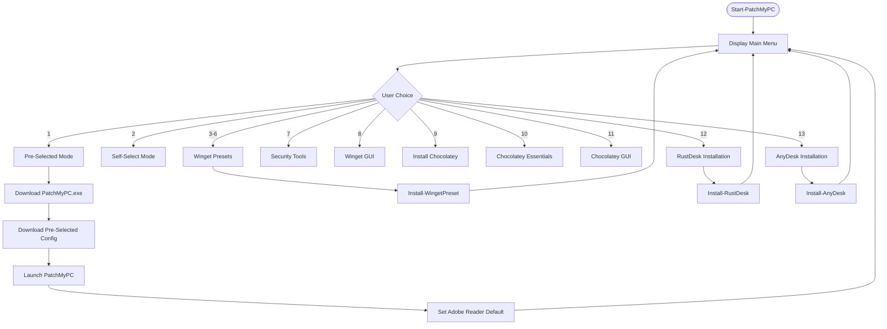
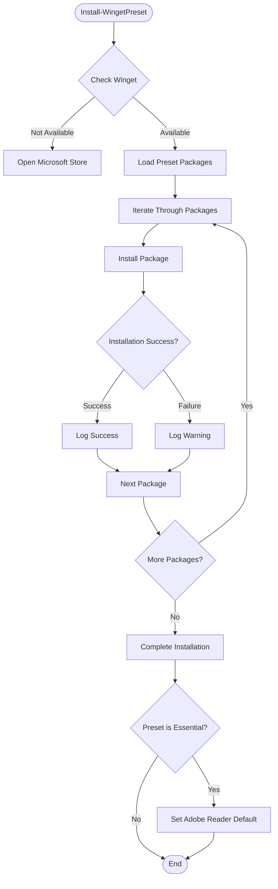
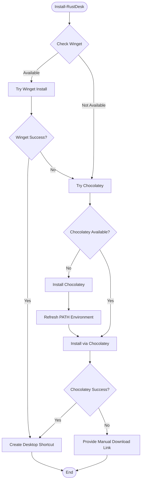
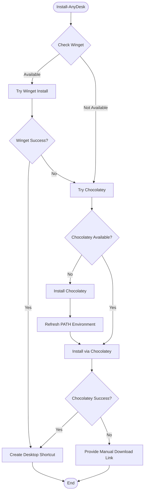
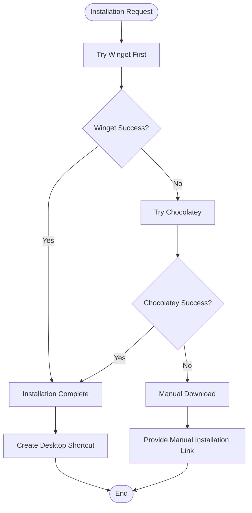
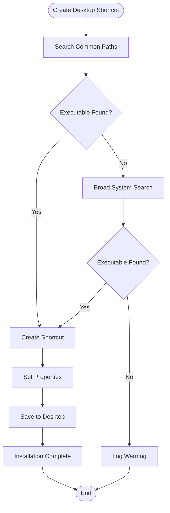
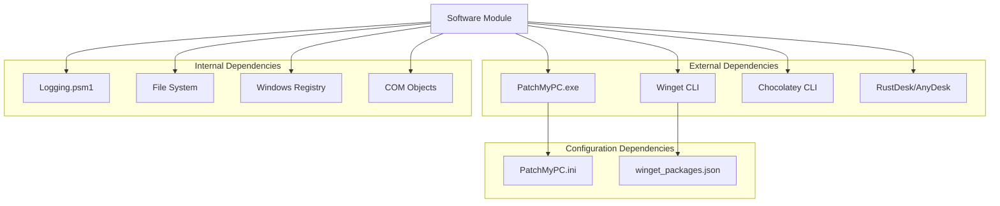

# Software Module

<cite>
**Referenced Files in This Document**
- [Software.psm1](file://modules/Software.psm1)
- [PatchMyPC.ini](file://configs/PatchMyPC.ini)
- [winget_packages.json](file://configs/winget_packages.json)
- [Logging.psm1](file://modules/Logging.psm1)
- [README.md](file://README.md)
</cite>

## Update Summary
**Changes Made**
- Enhanced Remote Desktop Tools section to document RustDesk and AnyDesk installation capabilities
- Added detailed documentation for Install-RustDesk and Install-AnyDesk functions
- Updated Remote Desktop Tools integration with comprehensive fallback mechanisms
- Expanded desktop shortcut creation documentation for remote desktop tools
- Added practical examples for remote desktop tool installations

## Table of Contents
1. [Introduction](#introduction)
2. [Project Structure](#project-structure)
3. [Core Components](#core-components)
4. [Architecture Overview](#architecture-overview)
5. [Detailed Component Analysis](#detailed-component-analysis)
6. [Dependency Analysis](#dependency-analysis)
7. [Performance Considerations](#performance-considerations)
8. [Troubleshooting Guide](#troubleshooting-guide)
9. [Conclusion](#conclusion)

## Introduction
The Software module is a comprehensive third-party software installation and management system integrated into the System Optimizer toolkit. It provides unified access to multiple package managers and installation strategies, enabling automated software deployment with fallback mechanisms and user-friendly interfaces.

The module integrates three primary installation systems:
- **PatchMyPC Integration**: Automated software updater with pre-selected and self-select configurations
- **Winget Package Manager**: Windows-native package manager with preset categories (essential, runtimes, developer, gaming)
- **Chocolatey Package Manager**: Enterprise-grade package management with GUI support

Additionally, it includes specialized remote desktop tool installations (RustDesk, AnyDesk) with automatic desktop shortcut creation and comprehensive fallback strategies.

## Project Structure
The Software module follows a modular architecture with clear separation of concerns:

**Diagram sources**
- [Software.psm1](file://modules/Software.psm1#L1-L131)
- [PatchMyPC.ini](file://configs/PatchMyPC.ini#L1-L376)
- [winget_packages.json](file://configs/winget_packages.json#L1-L108)

**Section sources**
- [Software.psm1](file://modules/Software.psm1#L1-L131)
- [README.md](file://README.md#L42-L46)

## Core Components

### PatchMyPC Integration System
The PatchMyPC integration provides two distinct installation modes:

**Pre-Selected Mode**: Downloads a pre-configured configuration file containing approved software selections, eliminating user decision-making while ensuring compatibility.

**Self-Select Mode**: Provides interactive selection interface allowing users to choose from available software options.

Both modes utilize a structured configuration system that defines which applications to install and their installation parameters.

**Section sources**
- [Software.psm1](file://modules/Software.psm1#L48-L108)
- [PatchMyPC.ini](file://configs/PatchMyPC.ini#L1-L376)

### Winget Package Manager Integration
The Winget integration offers four preset categories designed for different user needs:

- **Essential Apps**: Core productivity software including browsers, compression tools, media players, and Adobe Reader
- **Runtimes**: Comprehensive runtime libraries (.NET, Visual C++, Java, DirectX)
- **Developer Tools**: Development environment essentials (PowerShell, Git, VS Code, Python)
- **Gaming Apps**: Gaming platform and related software (Steam, Epic Games, Discord)

Each preset is carefully curated to provide optimal functionality while maintaining compatibility across different Windows versions.

**Section sources**
- [Software.psm1](file://modules/Software.psm1#L209-L303)
- [winget_packages.json](file://configs/winget_packages.json#L82-L106)

### Chocolatey Package Manager Support
Chocolatey integration provides enterprise-grade package management with three key capabilities:

- **Chocolatey Installation**: Automated installation of the Chocolatey package manager itself
- **Essential Packages**: Streamlined installation of commonly needed software
- **Chocolatey GUI**: Installation of the graphical user interface for package management

Chocolatey serves as a robust fallback system when Winget installations encounter issues or when enterprise environments require additional package management capabilities.

**Section sources**
- [Software.psm1](file://modules/Software.psm1#L455-L504)
- [Software.psm1](file://modules/Software.psm1#L889-L903)

### Remote Desktop Tool Management
Specialized installation functions for popular remote desktop solutions:

- **RustDesk**: Open-source alternative with automatic shortcut creation
- **AnyDesk**: Commercial remote desktop solution with comprehensive fallback support

Both tools include intelligent installation strategies that attempt Winget installation first, fall back to Chocolatey if needed, and finally provide manual download links when automated methods fail.

**Updated** Enhanced remote desktop tool integration with comprehensive installation strategies and desktop shortcut creation

**Section sources**
- [Software.psm1](file://modules/Software.psm1#L506-L585)
- [Software.psm1](file://modules/Software.psm1#L587-L666)
- [Software.psm1](file://modules/Software.psm1#L628-L708)

## Architecture Overview

**Diagram sources**
- [Software.psm1](file://modules/Software.psm1#L5-L131)
- [Software.psm1](file://modules/Software.psm1#L209-L303)
- [Software.psm1](file://modules/Software.psm1#L506-L585)

## Detailed Component Analysis

### Start-PatchMyPC Function
The main entry point provides a comprehensive software installation interface with 13 distinct options covering all supported installation methods.

**Diagram sources**
- [Software.psm1](file://modules/Software.psm1#L5-L131)

**Section sources**
- [Software.psm1](file://modules/Software.psm1#L5-L131)

### Install-WingetPreset Function
Provides categorized software installation with comprehensive error handling and user feedback.

**Diagram sources**
- [Software.psm1](file://modules/Software.psm1#L209-L303)

**Section sources**
- [Software.psm1](file://modules/Software.psm1#L209-L303)

### Install-RustDesk Function
Comprehensive remote desktop installation with multi-source fallback support.

**Diagram sources**
- [Software.psm1](file://modules/Software.psm1#L548-L627)

**Section sources**
- [Software.psm1](file://modules/Software.psm1#L548-L627)

### Install-AnyDesk Function
Enterprise-grade remote desktop installation with identical fallback strategy to RustDesk.

**Diagram sources**
- [Software.psm1](file://modules/Software.psm1#L629-L708)

**Section sources**
- [Software.psm1](file://modules/Software.psm1#L629-L708)

### Multi-Source Installation Strategy
The system implements a sophisticated fallback mechanism that maximizes installation success rates:

**Diagram sources**
- [Software.psm1](file://modules/Software.psm1#L506-L585)
- [Software.psm1](file://modules/Software.psm1#L587-L666)

**Section sources**
- [Software.psm1](file://modules/Software.psm1#L506-L585)
- [Software.psm1](file://modules/Software.psm1#L587-L666)

### Desktop Shortcut Creation System
Automatically creates desktop shortcuts for installed applications using a comprehensive search strategy:

**Diagram sources**
- [Software.psm1](file://modules/Software.psm1#L668-L721)
- [Software.psm1](file://modules/Software.psm1#L723-L773)

**Section sources**
- [Software.psm1](file://modules/Software.psm1#L668-L721)
- [Software.psm1](file://modules/Software.psm1#L723-L773)

## Dependency Analysis

**Diagram sources**
- [Software.psm1](file://modules/Software.psm1#L5-L131)
- [PatchMyPC.ini](file://configs/PatchMyPC.ini#L1-L376)
- [winget_packages.json](file://configs/winget_packages.json#L1-L108)

**Section sources**
- [Software.psm1](file://modules/Software.psm1#L1-L921)
- [Logging.psm1](file://modules/Logging.psm1#L1-L284)

## Performance Considerations
The Software module is designed for efficient operation with several built-in optimizations:

- **Parallel Processing**: Individual package installations are processed sequentially to maintain stability and provide clear feedback
- **Resource Management**: Temporary files are cleaned up automatically after successful installations
- **Network Efficiency**: Configuration files are cached locally to minimize repeated downloads
- **Error Containment**: Failed installations don't block subsequent package processing
- **Memory Usage**: Minimal memory footprint with efficient string handling and object disposal

## Troubleshooting Guide

### Common Installation Issues

**Winget Not Found**
- **Symptom**: Winget installation fails with "command not found"
- **Solution**: Install Microsoft Store App Installer or manually install Winget
- **Detection**: Automatic check with Microsoft Store redirection

**PatchMyPC Configuration Issues**
- **Symptom**: Pre-selected mode fails to load configuration
- **Solution**: Verify internet connectivity and retry download
- **Detection**: Network timeout handling with fallback mechanisms

**Chocolatey Installation Failures**
- **Symptom**: Chocolatey installation fails due to execution policy
- **Solution**: Run with administrative privileges and bypass execution policy
- **Detection**: Automatic execution policy adjustment

**Remote Desktop Installation Problems**
- **Symptom**: RustDesk/AnyDesk installation fails
- **Solution**: Try alternative package manager or manual download
- **Detection**: Multi-stage fallback with comprehensive error logging

**Desktop Shortcut Creation Failures**
- **Symptom**: Shortcuts not created despite successful installations
- **Solution**: Manually create shortcuts or check desktop permissions
- **Detection**: Comprehensive file system search with fallback strategies

**Section sources**
- [Software.psm1](file://modules/Software.psm1#L212-L219)
- [Software.psm1](file://modules/Software.psm1#L458-L475)
- [Software.psm1](file://modules/Software.psm1#L694-L701)

## Conclusion
The Software module represents a comprehensive solution for third-party software management on Windows systems. Its multi-source approach ensures high installation success rates through intelligent fallback mechanisms, while its modular design provides flexibility for different deployment scenarios.

Key strengths include:
- **Reliability**: Multi-layered fallback strategies maximize installation success
- **Usability**: Intuitive interfaces for both automated and manual installation modes
- **Flexibility**: Support for multiple package managers and installation methods
- **Integration**: Seamless integration with external configuration systems
- **Automation**: Comprehensive automation with minimal user intervention

The module successfully addresses the challenge of managing diverse software ecosystems while maintaining system stability and user control. Its design principles provide a foundation for future enhancements and additional package manager integrations.

**Updated** Enhanced with comprehensive remote desktop tool installation capabilities, providing users with reliable access to both open-source and commercial remote desktop solutions through intelligent fallback mechanisms and automated desktop shortcut creation.