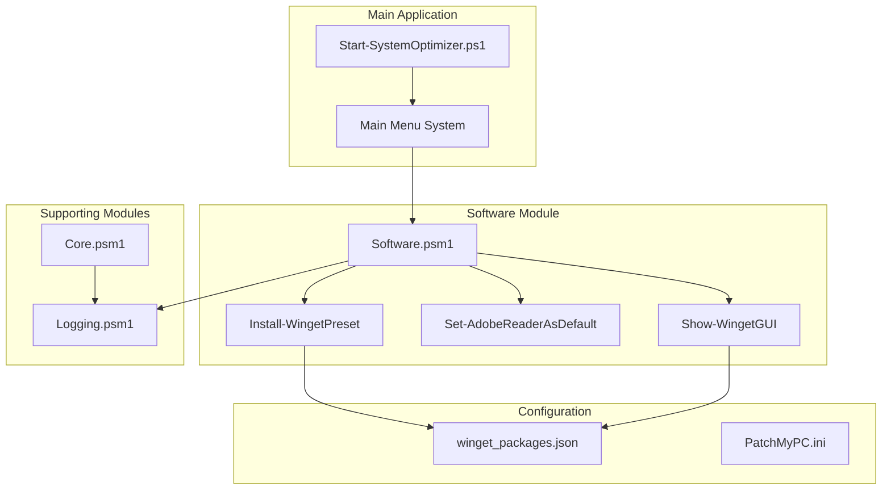
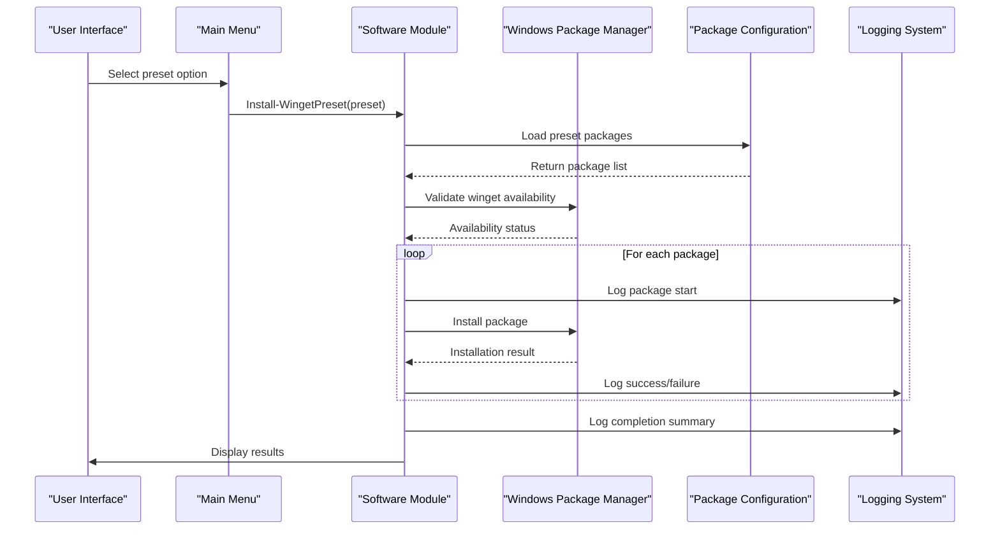
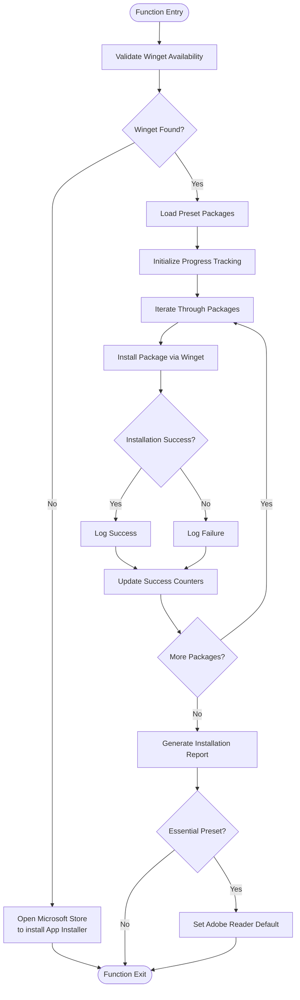
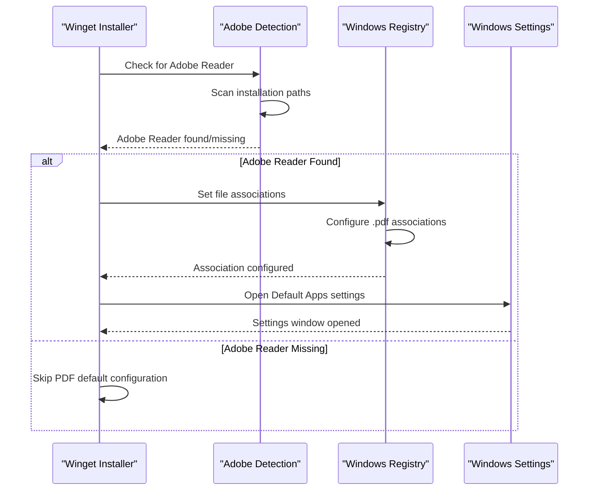
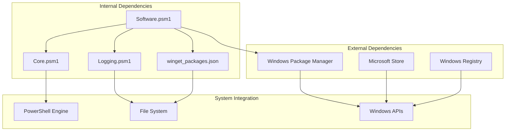

# Winget Preset System

<cite>
**Referenced Files in This Document**
- [Software.psm1](file://modules/Software.psm1)
- [Core.psm1](file://modules/Core.psm1)
- [Logging.psm1](file://modules/Logging.psm1)
- [Start-SystemOptimizer.ps1](file://Start-SystemOptimizer.ps1)
- [winget_packages.json](file://configs/winget_packages.json)
- [README.md](file://README.md)
</cite>

## Table of Contents
1. [Introduction](#introduction)
2. [Project Structure](#project-structure)
3. [Core Components](#core-components)
4. [Architecture Overview](#architecture-overview)
5. [Detailed Component Analysis](#detailed-component-analysis)
6. [Dependency Analysis](#dependency-analysis)
7. [Performance Considerations](#performance-considerations)
8. [Troubleshooting Guide](#troubleshooting-guide)
9. [Conclusion](#conclusion)
10. [Appendices](#appendices)

## Introduction
The Winget Preset System is a comprehensive software installation framework integrated into the System Optimizer toolkit. This system provides predefined package categories for efficient bulk software deployment on Windows 10/11 systems. The system supports four main preset categories: Essential Apps, Runtimes, Developer Tools, and Gaming Apps, each containing carefully curated packages for common use cases.

The system leverages Microsoft's Windows Package Manager (winget) as the primary installation mechanism, with robust error handling, progress tracking, and fallback mechanisms. It includes specialized integration for Adobe Reader default PDF handling and provides both automated preset installation and interactive GUI selection capabilities.

## Project Structure
The Winget Preset System is organized within the broader System Optimizer framework, utilizing a modular architecture that separates concerns across multiple components:

**Diagram sources**
- [Start-SystemOptimizer.ps1](file://Start-SystemOptimizer.ps1#L824-L894)
- [Software.psm1](file://modules/Software.psm1#L209-L303)
- [winget_packages.json](file://configs/winget_packages.json#L1-L108)

**Section sources**
- [README.md](file://README.md#L1-L88)
- [Start-SystemOptimizer.ps1](file://Start-SystemOptimizer.ps1#L378-L474)

## Core Components

### Install-WingetPreset Function
The central orchestrator for preset-based package installation, this function manages the complete lifecycle of software deployment including validation, installation, and reporting.

**Key Features:**
- **Package Validation**: Automatically checks for winget availability and validates package IDs against the configuration database
- **Progress Tracking**: Provides real-time installation progress with individual package status reporting
- **Success/Failure Reporting**: Comprehensive logging of installation results with detailed success metrics
- **Integration Points**: Seamlessly integrates with Adobe Reader default PDF handling for essential packages

**Section sources**
- [Software.psm1](file://modules/Software.psm1#L209-L303)

### Package Configuration System
The system utilizes a structured JSON configuration that defines both individual packages and preset categories:

**Configuration Categories:**
- **Essential Apps**: Browser, compression tools, media player, office reader, Visual C++ redistributables
- **Runtimes**: .NET frameworks, Visual C++ versions, DirectX, Java
- **Developer Tools**: PowerShell, Git, VS Code, Windows Terminal, Python
- **Gaming Apps**: Steam, Epic Games, Discord, NVIDIA GeForce Experience

**Section sources**
- [winget_packages.json](file://configs/winget_packages.json#L1-L108)

### Set-AdobeReaderAsDefault Integration
Specialized integration for Adobe Reader PDF handling that automatically sets Adobe Reader as the default PDF viewer when installed through the essential preset.

**Implementation Details:**
- Multi-path detection for various Adobe Reader installation locations
- Registry manipulation for file associations
- Windows Settings integration for confirmation prompts
- Fallback handling for different Windows versions

**Section sources**
- [Software.psm1](file://modules/Software.psm1#L133-L207)

## Architecture Overview

The Winget Preset System follows a layered architecture pattern that separates presentation, business logic, and data access concerns:

**Diagram sources**
- [Software.psm1](file://modules/Software.psm1#L209-L303)
- [Start-SystemOptimizer.ps1](file://Start-SystemOptimizer.ps1#L824-L894)

**Section sources**
- [Software.psm1](file://modules/Software.psm1#L209-L303)
- [Start-SystemOptimizer.ps1](file://Start-SystemOptimizer.ps1#L824-L894)

## Detailed Component Analysis

### Install-WingetPreset Function Analysis

The Install-WingetPreset function serves as the primary interface for preset-based package installation, implementing comprehensive error handling and progress tracking:

**Diagram sources**
- [Software.psm1](file://modules/Software.psm1#L209-L303)

**Section sources**
- [Software.psm1](file://modules/Software.psm1#L209-L303)

### Package Validation and Error Handling

The system implements robust validation mechanisms to ensure reliable package installation:

**Validation Steps:**
1. **Winget Availability Check**: Verifies Windows Package Manager installation
2. **Package ID Validation**: Confirms package IDs exist in the configuration database
3. **Network Connectivity**: Tests internet connectivity for package downloads
4. **Conflicts Detection**: Identifies potential package conflicts or dependencies

**Error Handling Strategies:**
- **Graceful Degradation**: Continues installation despite individual package failures
- **Fallback Mechanisms**: Provides alternative installation paths when primary methods fail
- **Detailed Logging**: Comprehensive error reporting for troubleshooting
- **User Feedback**: Clear status indicators for successful and failed installations

**Section sources**
- [Software.psm1](file://modules/Software.psm1#L212-L291)

### Progress Tracking and Reporting

The system provides comprehensive progress tracking through multiple mechanisms:

**Progress Tracking Components:**
- **Real-time Status Updates**: Individual package installation progress
- **Success Metrics**: Count of successful, failed, and skipped installations
- **Completion Reports**: Summary statistics and failure lists
- **Visual Indicators**: Color-coded status messages and progress bars

**Reporting Features:**
- **Installation Summary**: Total packages vs. successful installations
- **Failure Analysis**: Detailed list of failed packages with reasons
- **Performance Metrics**: Installation duration and average per-package time
- **Integration Reports**: Special handling for Adobe Reader default settings

**Section sources**
- [Software.psm1](file://modules/Software.psm1#L272-L298)

### Set-AdobeReaderAsDefault Integration

The Adobe Reader integration provides seamless PDF default handling:

**Diagram sources**
- [Software.psm1](file://modules/Software.psm1#L133-L207)

**Section sources**
- [Software.psm1](file://modules/Software.psm1#L133-L207)

### Show-WingetGUI Interactive Selection

The GUI component provides interactive package selection with comprehensive filtering:

**GUI Features:**
- **Category-based Filtering**: Organized package lists by functional categories
- **Interactive Selection**: Checkboxes for individual package selection
- **Batch Operations**: Select All and Clear All functionality
- **Real-time Installation**: Direct package installation from GUI interface

**Section sources**
- [Software.psm1](file://modules/Software.psm1#L305-L453)

## Dependency Analysis

The Winget Preset System has well-defined dependencies that support modularity and maintainability:

**Diagram sources**
- [Software.psm1](file://modules/Software.psm1#L209-L303)
- [Core.psm1](file://modules/Core.psm1#L1-L800)
- [Logging.psm1](file://modules/Logging.psm1#L1-L285)

**Section sources**
- [Software.psm1](file://modules/Software.psm1#L209-L303)
- [Core.psm1](file://modules/Core.psm1#L1-L800)
- [Logging.psm1](file://modules/Logging.psm1#L1-L285)

## Performance Considerations

The Winget Preset System is designed with several performance optimization strategies:

**Installation Performance:**
- **Parallel Processing**: Individual package installations occur sequentially to maintain stability
- **Resource Management**: Efficient memory usage during package validation and installation
- **Network Optimization**: Leverages winget's built-in caching and download optimization
- **Progress Efficiency**: Minimal overhead for progress tracking and logging

**System Integration Performance:**
- **Lazy Loading**: Modules are loaded only when needed
- **Caching**: Configuration data is cached to minimize repeated file access
- **Minimal Dependencies**: Relies primarily on built-in Windows components
- **Efficient Logging**: Structured logging minimizes I/O overhead

**Scalability Considerations:**
- **Modular Design**: Easy addition of new package categories and presets
- **Configuration-driven**: Extensible package definitions without code changes
- **Error Isolation**: Individual package failures don't impact overall system performance

## Troubleshooting Guide

### Winget Availability Issues
**Symptoms:** Installation fails immediately with winget not found errors
**Solutions:**
1. **Microsoft Store Installation**: The system automatically opens the Microsoft Store to install App Installer
2. **Manual Installation**: Download App Installer from Microsoft Store manually
3. **Windows Update**: Ensure Windows Update is current for winget availability
4. **PATH Environment**: Verify winget is in system PATH

**Section sources**
- [Software.psm1](file://modules/Software.psm1#L212-L219)

### Network Connectivity Problems
**Symptoms:** Package downloads fail or timeout during installation
**Solutions:**
1. **Proxy Configuration**: Configure proxy settings for winget if behind corporate firewall
2. **DNS Resolution**: Verify DNS resolution for package sources
3. **Firewall Rules**: Ensure outbound connections for winget package sources
4. **Alternative Sources**: Configure winget source repositories if primary sources blocked

**Section sources**
- [Software.psm1](file://modules/Software.psm1#L283-L291)

### Package Conflicts and Dependencies
**Symptoms:** Installation fails due to conflicting packages or missing dependencies
**Solutions:**
1. **Conflict Resolution**: Review failed package list and resolve conflicts manually
2. **Dependency Management**: Install required dependencies before attempting main packages
3. **Package Updates**: Update winget database with `winget update --all`
4. **Manual Installation**: Use alternative installation methods for problematic packages

**Section sources**
- [Software.psm1](file://modules/Software.psm1#L287-L291)

### Adobe Reader Integration Issues
**Symptoms:** Adobe Reader not set as default PDF handler
**Solutions:**
1. **Registry Access**: Ensure sufficient permissions for registry modifications
2. **Windows Version Compatibility**: Verify compatibility with current Windows version
3. **Alternative Methods**: Manually set PDF default through Windows Settings
4. **Path Verification**: Confirm Adobe Reader installation paths are correct

**Section sources**
- [Software.psm1](file://modules/Software.psm1#L164-L206)

## Conclusion

The Winget Preset System represents a mature, production-ready solution for bulk software deployment on Windows systems. Its comprehensive architecture provides reliability, scalability, and user-friendly operation through multiple installation modes.

**Key Strengths:**
- **Robust Error Handling**: Comprehensive validation and fallback mechanisms
- **Flexible Configuration**: Easy extension through JSON-based package definitions
- **User Experience**: Both automated presets and interactive GUI options
- **Integration Capabilities**: Seamless integration with system components like Adobe Reader

**Future Enhancement Opportunities:**
- **Multi-source Support**: Integration with multiple package managers beyond winget
- **Advanced Conflict Resolution**: Automated conflict detection and resolution
- **Performance Monitoring**: Real-time performance metrics and optimization suggestions
- **Custom Preset Creation**: User-friendly tools for creating custom package categories

The system successfully balances automation with user control, providing both rapid deployment capabilities and detailed oversight for enterprise environments.

## Appendices

### Custom Package Addition Examples

**Adding New Essential Apps:**
1. Edit `configs/winget_packages.json`
2. Add package entries under the "utilities" or "browsers" category
3. Include both package ID and human-readable name
4. Test installation through the preset system

**Extending Developer Tools:**
1. Add package entries to the "development" category
2. Include development tools like IDEs, SDKs, or specialized utilities
3. Test compatibility with existing developer workflow
4. Update preset definitions if adding to existing categories

**Creating New Preset Categories:**
1. Define new category in `configs/winget_packages.json`
2. Add package entries with appropriate IDs
3. Reference new preset in `Install-WingetPreset` function
4. Test preset functionality through the main menu system

### Preset Configuration Reference

**Essential Apps Category:**
- Browsers: Firefox, Google Chrome, Brave Browser
- Compression Tools: 7-Zip
- Media Players: VLC Media Player
- Office Readers: Adobe Reader DC, SumatraPDF, LibreOffice
- Visual C++ Redistributables: 2015-2022 x64/x86 variants

**Runtimes Category:**
- .NET Frameworks: Runtime 6, 7, 8 (including Desktop Runtime variants)
- Visual C++ Redistributables: 2010, 2012, 2013, 2015-2022
- DirectX Components
- Java Runtime Environment

**Developer Tools Category:**
- PowerShell 7
- Git Version Control
- Visual Studio Code
- Windows Terminal
- Python 3.11

**Gaming Apps Category:**
- Steam Gaming Platform
- Epic Games Launcher
- Discord Communication
- NVIDIA GeForce Experience
- NVIDIA PhysX Components