# UI Tweaks Module

<cite>
**Referenced Files in This Document**
- [UITweaks.psm1](file://modules/UITweaks.psm1)
- [Core.psm1](file://modules/Core.psm1)
- [Logging.psm1](file://modules/Logging.psm1)
- [Registry.psm1](file://modules/Registry.psm1)
- [README.md](file://README.md)
- [FEATURES.md](file://docs/FEATURES.md)
- [STRUCTURE.md](file://docs/STRUCTURE.md)
- [Start-SystemOptimizer.ps1](file://Start-SystemOptimizer.ps1)
</cite>

## Table of Contents
1. [Introduction](#introduction)
2. [Project Structure](#project-structure)
3. [Core Components](#core-components)
4. [Architecture Overview](#architecture-overview)
5. [Detailed Component Analysis](#detailed-component-analysis)
6. [Dependency Analysis](#dependency-analysis)
7. [Performance Considerations](#performance-considerations)
8. [Troubleshooting Guide](#troubleshooting-guide)
9. [Conclusion](#conclusion)

## Introduction
The UI Tweaks module is a comprehensive Windows user interface customization toolkit designed to enhance and optimize the Windows experience through targeted registry-based modifications. This module provides users with granular control over Windows appearance, behavior, and usability through a structured approach to system-wide UI changes.

The module follows the DISM++ style philosophy of providing focused, safe, and reversible UI customizations that improve user productivity and system responsiveness. It operates primarily through registry modifications, ensuring compatibility across Windows 10 and Windows 11 environments while maintaining system stability.

## Project Structure
The UI Tweaks module is part of the broader System Optimizer toolkit, which consists of 27 specialized PowerShell modules working together to provide comprehensive system optimization capabilities.

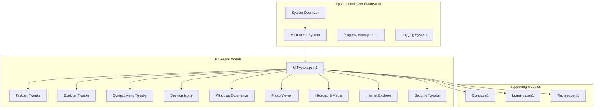

**Diagram sources**
- [STRUCTURE.md](file://docs/STRUCTURE.md#L38-L97)
- [UITweaks.psm1](file://modules/UITweaks.psm1#L1-L628)

**Section sources**
- [STRUCTURE.md](file://docs/STRUCTURE.md#L1-L159)
- [README.md](file://README.md#L1-L88)

## Core Components
The UI Tweaks module consists of ten primary functions, each targeting specific aspects of the Windows user interface:

### Primary Functions
1. **Apply-TaskbarTweaks** - Controls taskbar appearance and behavior
2. **Apply-ExplorerTweaks** - Customizes File Explorer behavior and appearance
3. **Apply-ContextMenuTweaks** - Modifies right-click context menu options
4. **Apply-DesktopIconTweaks** - Manages desktop icon visibility
5. **Apply-WindowsExperienceTweaks** - Controls Windows 10/11 experience features
6. **Enable-WindowsPhotoViewer** - Re-enables classic Windows Photo Viewer
7. **Apply-NotepadMediaTweaks** - Enhances text editor and media player
8. **Apply-InternetExplorerTweaks** - Optimizes Internet Explorer and IE Mode
9. **Apply-SecurityTweaks** - Configures security-related UI settings
10. **Start-DISMStyleTweaks** - Provides interactive menu interface

Each function operates independently while sharing common infrastructure for logging, progress tracking, and error handling.

**Section sources**
- [UITweaks.psm1](file://modules/UITweaks.psm1#L24-L628)

## Architecture Overview
The UI Tweaks module employs a modular architecture with clear separation of concerns and robust error handling mechanisms.

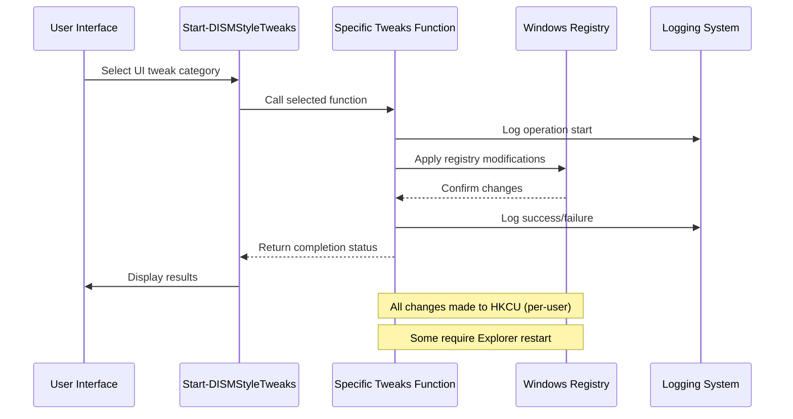

**Diagram sources**
- [UITweaks.psm1](file://modules/UITweaks.psm1#L557-L613)
- [Logging.psm1](file://modules/Logging.psm1#L68-L123)

The architecture emphasizes safety through:
- Per-user registry modifications (HKCU) rather than system-wide changes
- Comprehensive error handling with graceful degradation
- Interactive confirmation for potentially disruptive changes
- Immediate feedback through the logging system

## Detailed Component Analysis

### Taskbar and Start Menu Tweaks
The taskbar customization system provides comprehensive control over Windows shell appearance and behavior.

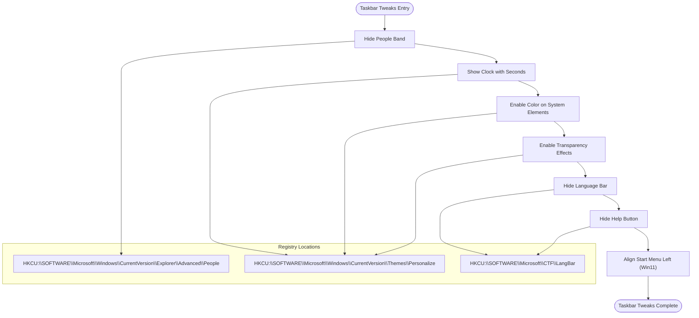

**Diagram sources**
- [UITweaks.psm1](file://modules/UITweaks.psm1#L24-L69)

Key features include:
- **People Band Management**: Hides the social media integration panel
- **Clock Customization**: Enables second-level precision display
- **Visual Theme Control**: Manages accent color application across system elements
- **Transparency Effects**: Controls blur effects on taskbar and start menu
- **Language Bar Configuration**: Hides input method indicators and help buttons
- **Start Menu Alignment**: Left-aligns the Windows 11 start menu for traditional layout

**Section sources**
- [UITweaks.psm1](file://modules/UITweaks.psm1#L24-L69)

### Explorer Customization System
File Explorer receives extensive customization options focusing on productivity and accessibility.

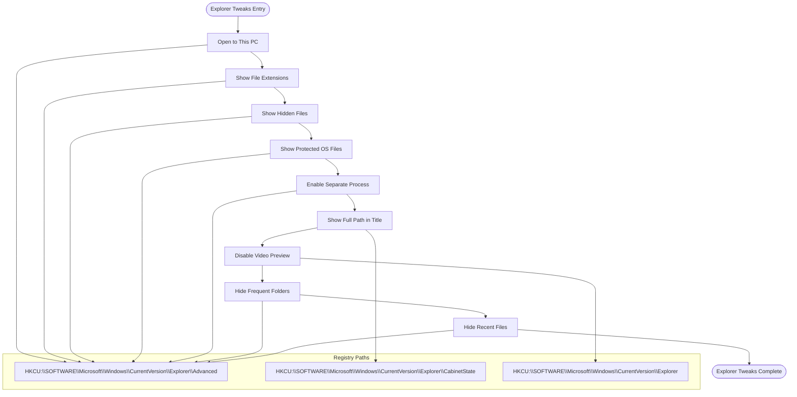

**Diagram sources**
- [UITweaks.psm1](file://modules/UITweaks.psm1#L71-L125)

The customization options include:
- **Navigation Behavior**: Sets default Explorer launch location to This PC
- **File Visibility**: Shows all file extensions and hidden/system files
- **Process Isolation**: Runs each folder in separate processes for stability
- **Interface Enhancement**: Displays full path in window title for navigation clarity
- **Performance Optimization**: Disables thumbnail cache for video files to improve performance
- **Quick Access Management**: Removes frequently accessed and recently used file entries

**Section sources**
- [UITweaks.psm1](file://modules/UITweaks.psm1#L71-L125)

### Context Menu Modifications
The context menu system provides both classic interface restoration and security-focused removals.

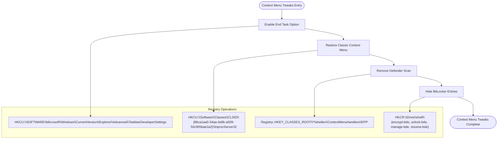

**Diagram sources**
- [UITweaks.psm1](file://modules/UITweaks.psm1#L127-L193)

Advanced features include:
- **Taskbar Developer Settings**: Enables "End Task" option in taskbar context menus
- **Classic Interface Restoration**: Reverts to traditional Windows context menu layout
- **Security Integration**: Removes Windows Defender scan options from context menu
- **BitLocker Management**: Hides BitLocker encryption options from quick access

**Section sources**
- [UITweaks.psm1](file://modules/UITweaks.psm1#L127-L193)

### Desktop Icon Management
The desktop icon system provides granular control over visible desktop elements with immediate visual feedback.

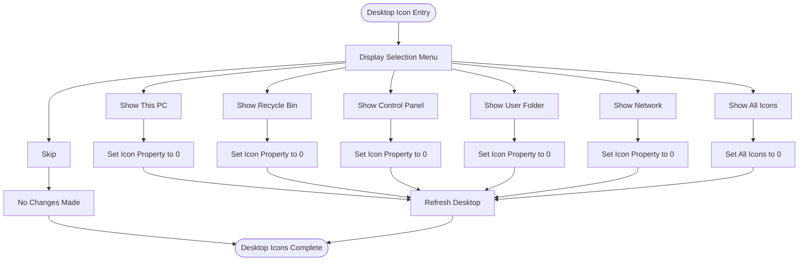

**Diagram sources**
- [UITweaks.psm1](file://modules/UITweaks.psm1#L491-L555)

The desktop management system offers:
- **Selective Icon Display**: Choose individual icons to show (This PC, Recycle Bin, Control Panel, User Folder, Network)
- **Bulk Operations**: Show all desktop icons with a single selection
- **Immediate Visual Feedback**: Automatic desktop refresh after changes
- **Persistent Configuration**: Registry-based persistence across sessions

**Section sources**
- [UITweaks.psm1](file://modules/UITweaks.psm1#L491-L555)

### Windows Experience Enhancements
The Windows Experience module focuses on reducing distractions and improving system responsiveness through selective feature disabling.

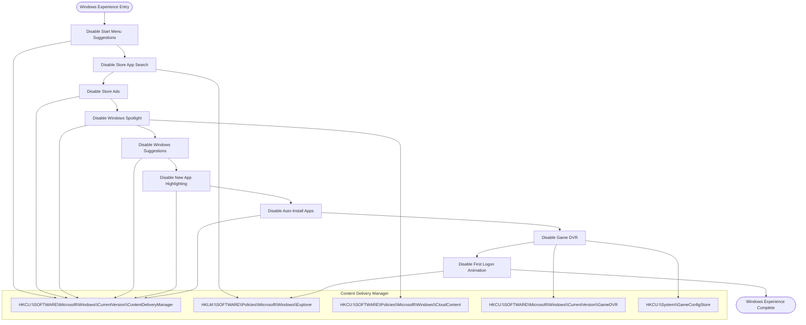

**Diagram sources**
- [UITweaks.psm1](file://modules/UITweaks.psm1#L225-L291)

Key experience improvements include:
- **Reduced Distractions**: Disables Start menu suggestions and Windows suggestions
- **Performance Optimization**: Prevents automatic app installations and background downloads
- **Privacy Enhancement**: Blocks Windows Spotlight and related telemetry
- **System Responsiveness**: Disables Game DVR and First Logon Animation

**Section sources**
- [UITweaks.psm1](file://modules/UITweaks.psm1#L225-L291)

### Security Settings Configuration
Security-focused UI modifications balance usability with protection measures.

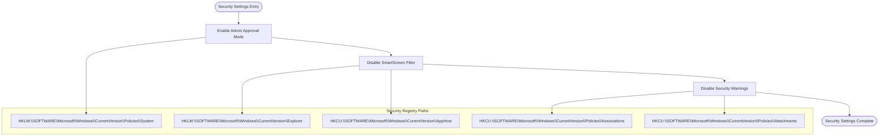

**Diagram sources**
- [UITweaks.psm1](file://modules/UITweaks.psm1#L195-L223)

Security enhancements include:
- **Administrative Control**: Enables UAC approval for built-in administrator accounts
- **SmartScreen Management**: Disables SmartScreen filtering for trusted environments
- **File Safety Controls**: Removes security warnings for trusted file types
- **Attachment Handling**: Configures safe handling of downloaded files

**Section sources**
- [UITweaks.psm1](file://modules/UITweaks.psm1#L195-L223)

### Windows Photo Viewer Integration
The Photo Viewer system provides classic image viewing capabilities with modern integration.

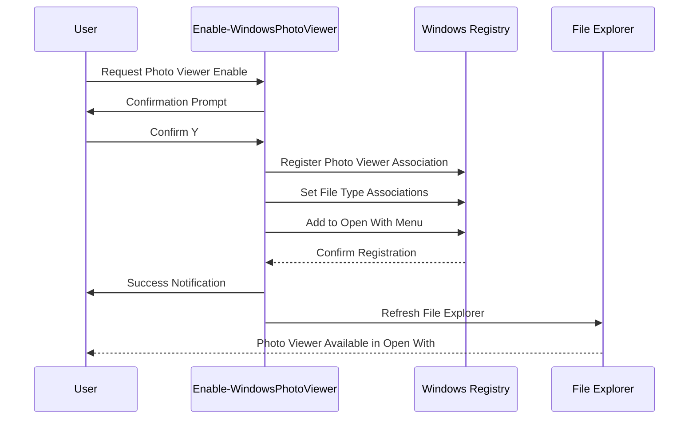

**Diagram sources**
- [UITweaks.psm1](file://modules/UITweaks.psm1#L293-L340)

The Photo Viewer integration provides:
- **Classic Image Viewing**: Restores Windows Photo Viewer for supported image formats
- **Integration with Modern UI**: Adds viewer to "Open with" context menu
- **File Type Support**: Enables viewing for JPG, PNG, BMP, GIF, TIFF, ICO formats
- **User-Friendly Interface**: Maintains familiar Windows Photo Viewer experience

**Section sources**
- [UITweaks.psm1](file://modules/UITweaks.psm1#L293-L340)

### Notepad and Media Enhancements
Productivity-focused enhancements for built-in Windows applications.

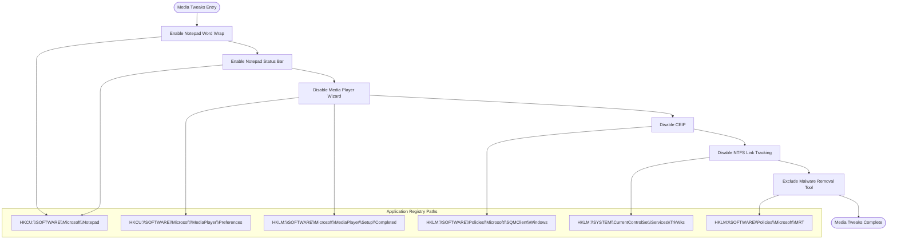

**Diagram sources**
- [UITweaks.psm1](file://modules/UITweaks.psm1#L342-L394)

Enhancement features include:
- **Notepad Productivity**: Enables word wrapping and status bar display
- **Media Player Optimization**: Disables first-run wizards and privacy prompts
- **System Service Management**: Disables NTFS link tracking service
- **Update Control**: Excludes Malware Removal Tool from Windows Update

**Section sources**
- [UITweaks.psm1](file://modules/UITweaks.psm1#L342-L394)

### Internet Explorer Configuration
Legacy browser optimization for compatibility scenarios.

```mermaid
flowchart TD
IEStart([IE Tweaks Entry]) --> Links["Open Links in New Tabs"]
Links --> Compatibility["Enable Compatibility View"]
Compatibility --> AutoComplete["Enable AutoComplete"]
AutoComplete --> Suggestions["Disable Suggested Sites"]
Suggestions --> Wizard["Disable First Run Wizard"]
Wizard --> Attachments["Configure Attachment Security"]
Attachments --> Toolbar["Lock IE Toolbar"]
Toolbar --> Downloads["Set Max Downloads"]
Downloads --> Popups["Always Open Pop-ups in New Tab"]
Popups --> Feedback["Hide Feedback Button"]
Feedback --> IEEnd([IE Tweaks Complete])
subgraph "IE Registry Paths"
Main["HKCU:\\SOFTWARE\\Microsoft\\Internet Explorer\\Main"]
NewWin["HKCU:\\SOFTWARE\\Microsoft\\Internet Explorer\\New Windows"]
Tabs["HKCU:\\SOFTWARE\\Microsoft\\Internet Explorer\\TabbedBrowsing"]
Suggest["HKCU:\\SOFTWARE\\Microsoft\\Internet Explorer\\Suggested Sites"]
ToolbarPath["HKCU:\\SOFTWARE\\Microsoft\\Internet Explorer\\Toolbar"]
Download["HKCU:\\SOFTWARE\\Microsoft\\Windows\\CurrentVersion\\Internet Settings"]
BrowserEmulation["HKCU:\\SOFTWARE\\Microsoft\\Internet Explorer\\BrowserEmulation"]
AutoCompletePath["HKCU:\\SOFTWARE\\Microsoft\\Windows\\CurrentVersion\\Explorer\\AutoComplete"]
Restrictions["HKLM:\\SOFTWARE\\Policies\\Microsoft\\Internet Explorer\\Restrictions"]
}
end
Links --> Tabs
Links --> NewWin
Compatibility --> BrowserEmulation
AutoComplete --> Main
AutoComplete --> AutoCompletePath
Suggestions --> Suggest
Suggestions --> Restrictions
Wizard --> Main
Attachments --> Main
Toolbar --> ToolbarPath
Downloads --> Download
Popups --> Tabs
Feedback --> Main
Feedback --> Restrictions
```

**Diagram sources**
- [UITweaks.psm1](file://modules/UITweaks.psm1#L396-L489)

IE optimization features include:
- **Navigation Enhancement**: Opens external links in new tabs within existing windows
- **Compatibility Mode**: Enables compatibility view for all websites
- **Form Management**: Activates AutoComplete for forms and passwords
- **Privacy Controls**: Disables suggested sites and feedback prompts
- **Performance Tuning**: Configures optimal download concurrency

**Section sources**
- [UITweaks.psm1](file://modules/UITweaks.psm1#L396-L489)

## Dependency Analysis
The UI Tweaks module maintains loose coupling with supporting infrastructure while providing comprehensive UI customization capabilities.

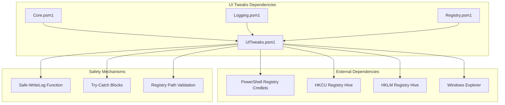

**Diagram sources**
- [UITweaks.psm1](file://modules/UITweaks.psm1#L5-L22)
- [Core.psm1](file://modules/Core.psm1#L1-L800)
- [Logging.psm1](file://modules/Logging.psm1#L1-L285)

The dependency relationships demonstrate:
- **Primary Dependencies**: PowerShell registry cmdlets and Windows Explorer
- **Supporting Infrastructure**: Core progress tracking and centralized logging
- **Safety Systems**: Graceful fallback mechanisms and comprehensive error handling
- **Registry Access Patterns**: Consistent use of HKCU for user-specific changes

**Section sources**
- [UITweaks.psm1](file://modules/UITweaks.psm1#L1-L628)
- [Core.psm1](file://modules/Core.psm1#L1-L800)
- [Logging.psm1](file://modules/Logging.psm1#L1-L285)

## Performance Considerations
The UI Tweaks module is designed for minimal performance impact while delivering significant user experience improvements.

### Registry Modification Impact
- **HKCU vs HKLM**: All modifications target the current user registry hive, avoiding system-wide impacts
- **Batch Operations**: Related tweaks are grouped within individual functions to minimize registry overhead
- **Conditional Logic**: Functions check for existing registry paths before creating new entries
- **Error Recovery**: Try-catch blocks prevent cascading failures from single registry operations

### Memory and Resource Usage
- **Minimal Footprint**: Each function operates independently with local scope variables
- **Efficient Logging**: Centralized logging system minimizes I/O overhead
- **Progress Tracking**: Optional progress system adds minimal computational overhead
- **Service Management**: Some functions temporarily stop services, with automatic cleanup

### User Experience Benefits
- **Immediate Feedback**: Real-time status updates through the logging system
- **Interactive Menus**: User-driven selection prevents unintended changes
- **Reversible Operations**: All changes can be undone through the rollback system
- **Explorer Integration**: Automatic desktop refresh eliminates manual intervention

## Troubleshooting Guide

### Common Issues and Solutions

#### Registry Access Permissions
**Problem**: Functions fail with access denied errors
**Solution**: Ensure the script is running with administrative privileges
- Registry modifications require appropriate permissions
- Some HKLM operations may require elevation

#### Explorer Restart Required
**Problem**: UI changes don't appear until restart
**Solution**: Restart Windows Explorer or log off/log back on
- Desktop icon changes require Explorer refresh
- Some registry modifications need Explorer restart

#### Function-Specific Issues

**Taskbar Tweaks Failures**:
- Verify Windows version compatibility (Start menu alignment requires Windows 11)
- Check for conflicting third-party taskbar applications

**Context Menu Modifications**:
- Classic context menu restoration may conflict with third-party shell extensions
- Defender scan removal requires appropriate registry permissions

**Photo Viewer Enable**:
- Windows Photo Viewer must be available on the system
- Some Windows 11 builds may not include Photo Viewer

**Section sources**
- [UITweaks.psm1](file://modules/UITweaks.psm1#L1-L628)

### Diagnostic Procedures
1. **Verify Execution Context**: Confirm running as Administrator
2. **Check Registry Paths**: Validate expected registry locations exist
3. **Test Individual Functions**: Run specific functions in isolation
4. **Review Log Files**: Check C:\System_Optimizer\Logs\ for detailed error information
5. **System Compatibility**: Verify Windows version support for specific features

### Recovery Options
- **Rollback System**: Use the integrated rollback system for complete restoration
- **Individual Undo**: Many functions can be reversed by setting registry values back to defaults
- **System Restore**: Create restore points before applying major UI changes
- **Manual Registry Cleanup**: Direct registry editing for advanced users

## Conclusion
The UI Tweaks module represents a comprehensive approach to Windows user interface customization, providing users with granular control over their Windows experience while maintaining system stability and security. Through careful registry-based modifications, the module delivers significant improvements in productivity, aesthetics, and system responsiveness.

The module's strength lies in its systematic approach to UI customization, with each function addressing specific aspects of the Windows interface. The integration with the broader System Optimizer framework ensures consistent behavior, comprehensive logging, and reliable rollback capabilities.

Key benefits include:
- **Safety-First Design**: All modifications target user-specific registry hives
- **Comprehensive Coverage**: Addresses all major aspects of Windows UI customization
- **User Control**: Interactive menus and confirmation steps prevent unwanted changes
- **Performance Focus**: Optimizations designed to improve system responsiveness
- **Future-Proof Architecture**: Modular design allows for easy updates and extensions

The UI Tweaks module serves as an excellent foundation for personalized Windows experiences, offering both immediate improvements and long-term system optimization benefits. Its integration with the broader System Optimizer ecosystem provides users with a complete toolkit for Windows system management and customization.