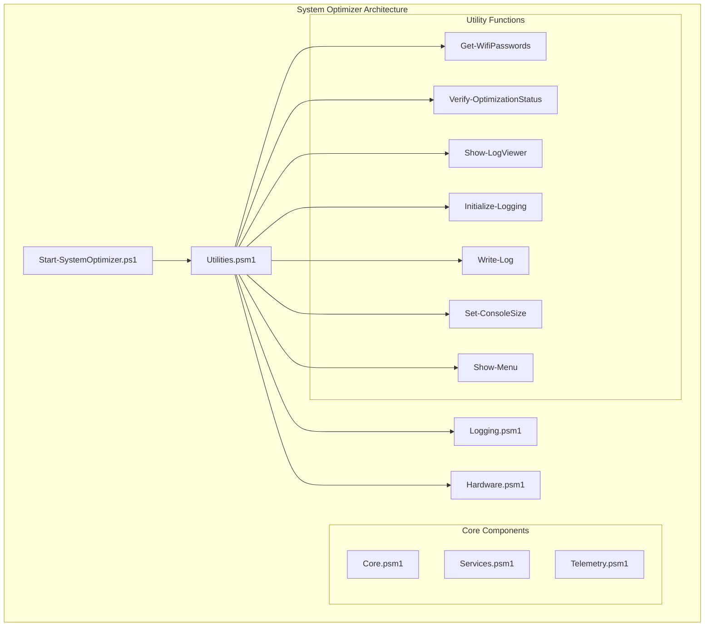
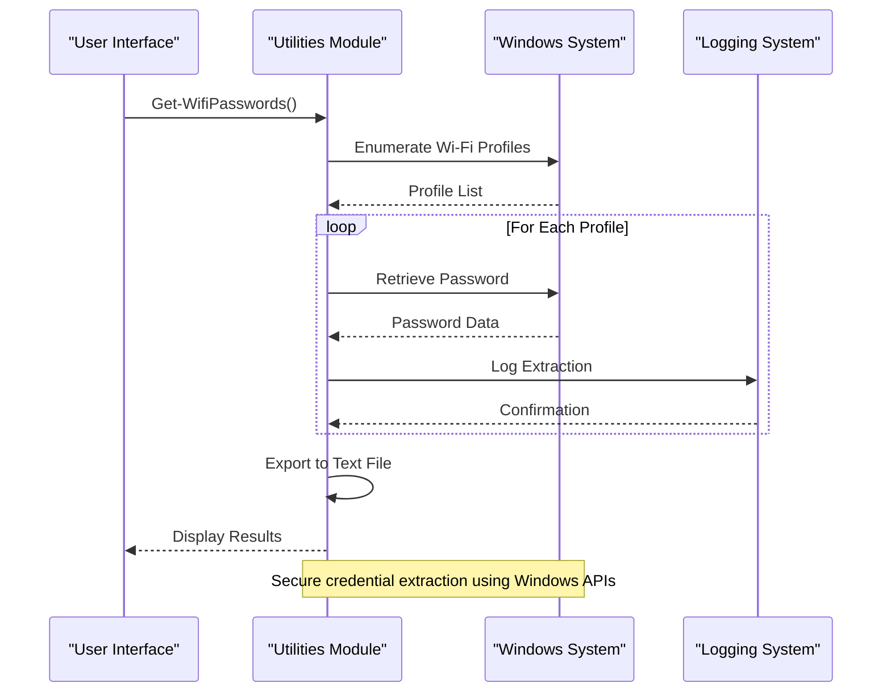
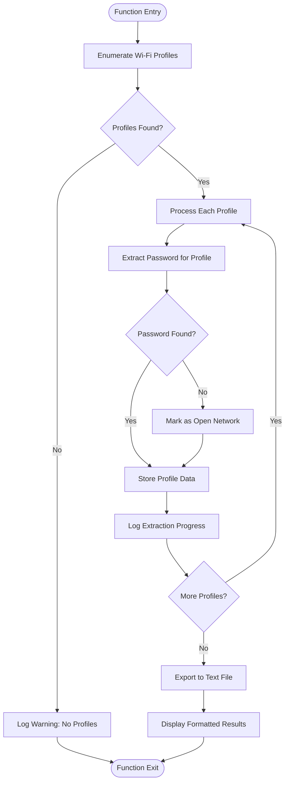
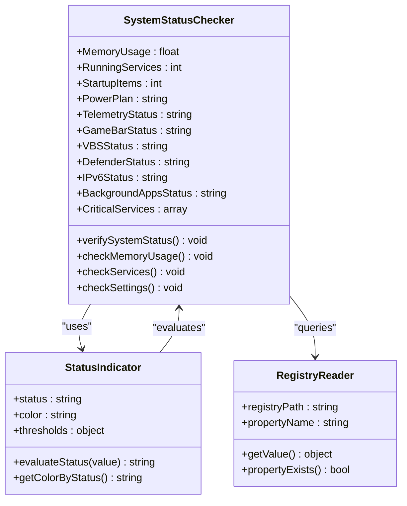
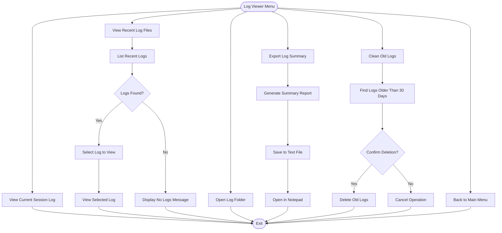
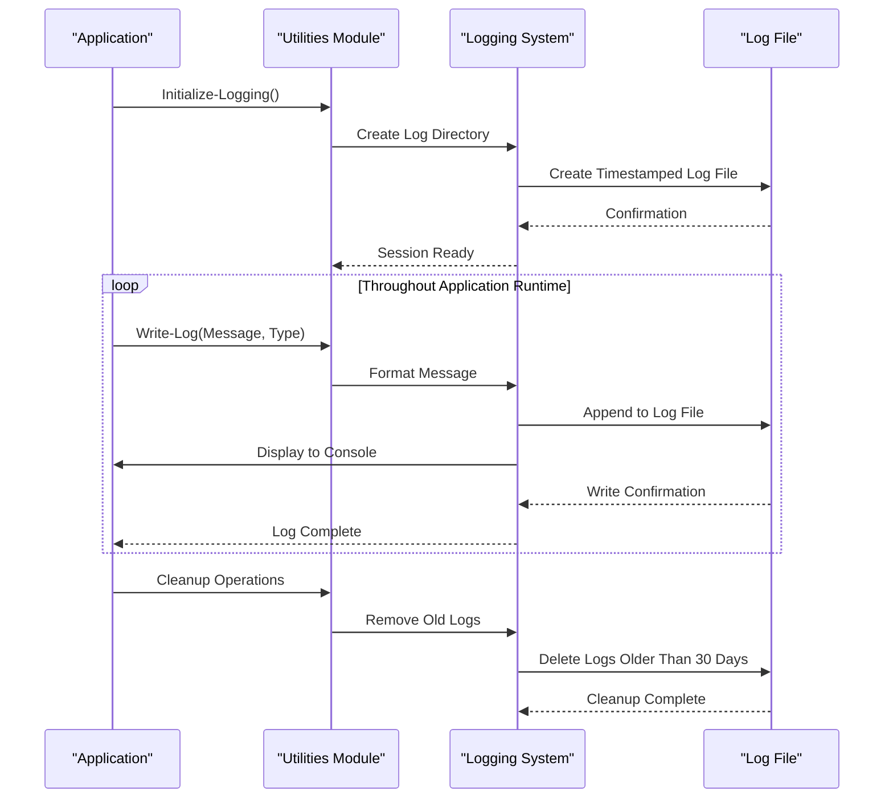
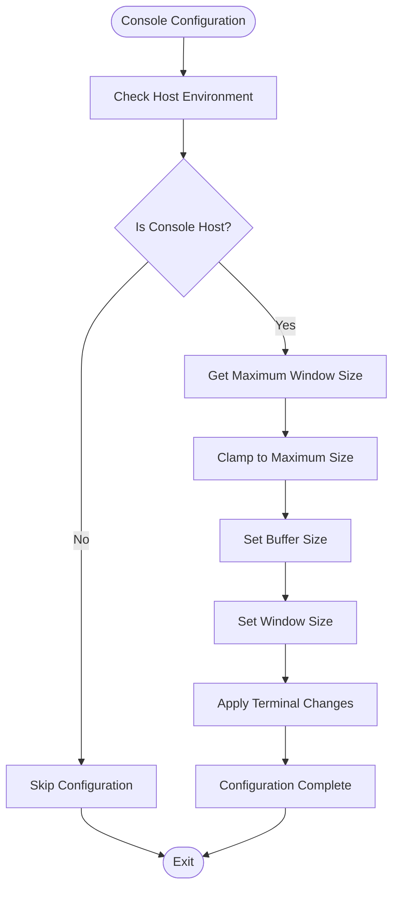
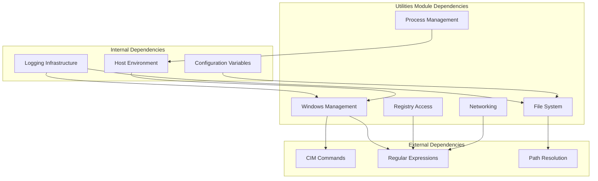

# Utilities Module

<cite>
**Referenced Files in This Document**
- [Utilities.psm1](file://modules/Utilities.psm1)
- [Logging.psm1](file://modules/Logging.psm1)
- [Start-SystemOptimizer.ps1](file://Start-SystemOptimizer.ps1)
- [Hardware.psm1](file://modules/Hardware.psm1)
- [Network.psm1](file://modules/Network.psm1)
- [win11_ultimate_optimization.ps1](file://scripts/legacy/win11_ultimate_optimization.ps1)
</cite>

## Update Summary
**Changes Made**
- Updated Wi-Fi Password Extraction System section to reflect variable naming improvements
- Added documentation for the critical bug fix in Get-WifiPasswords function
- Enhanced troubleshooting guidance for variable naming conflicts
- Updated code examples to demonstrate improved variable scoping

## Table of Contents
1. [Introduction](#introduction)
2. [Project Structure](#project-structure)
3. [Core Components](#core-components)
4. [Architecture Overview](#architecture-overview)
5. [Detailed Component Analysis](#detailed-component-analysis)
6. [Dependency Analysis](#dependency-analysis)
7. [Performance Considerations](#performance-considerations)
8. [Troubleshooting Guide](#troubleshooting-guide)
9. [Conclusion](#conclusion)

## Introduction
The Utilities module serves as a foundational component within the System Optimizer toolkit, providing essential helper functions and system information gathering capabilities. This module consolidates common utility patterns that support other components through reusable functions, standardized logging integration, and cross-platform system health monitoring.

The module focuses on three primary areas: system information collection, hardware detection, and operational utilities. It provides functions for extracting Wi-Fi credentials, verifying system optimization status, managing log viewing operations, and establishing consistent logging infrastructure across the entire toolkit.

**Updated** Fixed critical bug in Get-WifiPasswords function where variable naming was corrected from `$profile` to `$wifiProfile` to avoid namespace collisions and improve readability.

## Project Structure
The Utilities module operates within a modular PowerShell architecture where each component maintains specialized functionality while sharing common utility functions. The module integrates seamlessly with the main System Optimizer script and other specialized modules.

**Diagram sources**
- [Utilities.psm1](file://modules/Utilities.psm1#L1-L421)
- [Start-SystemOptimizer.ps1](file://Start-SystemOptimizer.ps1#L1-L800)

**Section sources**
- [Utilities.psm1](file://modules/Utilities.psm1#L1-L50)
- [Start-SystemOptimizer.ps1](file://Start-SystemOptimizer.ps1#L57-L67)

## Core Components
The Utilities module comprises six primary functions that collectively provide comprehensive system utility capabilities:

### Wi-Fi Credential Extraction
The `Get-WifiPasswords` function performs secure extraction of saved Wi-Fi network credentials using Windows networking commands. It enumerates all wireless profiles, retrieves associated passwords, and exports the results to a structured text file.

**Updated** The function now uses improved variable naming conventions to avoid namespace collisions and enhance code readability. The variable `$wifiProfile` is used consistently throughout the function scope, replacing the previous `$profile` variable that could conflict with other scopes.

### System Health Verification
The `Verify-OptimizationStatus` function provides comprehensive system status assessment by checking memory usage, running services, startup programs, power plans, and critical system settings including telemetry, game bar, virtualization-based security, and IPv6 configuration.

### Log Management Interface
The `Show-LogViewer` function offers an interactive interface for log file management, including viewing recent logs, exporting summaries, cleaning old logs, and opening log directories in file explorer.

### Logging Infrastructure
The module provides two complementary logging approaches: the main `Write-Log` function for basic logging operations and the `Initialize-Logging` function for establishing persistent logging sessions with automatic cleanup and timestamp management.

### Console Management
The `Set-ConsoleSize` function manages terminal dimensions and buffer sizes, ensuring optimal display conditions across different PowerShell hosts and terminal environments.

### User Interface Integration
The `Show-Menu` function generates the primary user interface with categorized options for system optimization workflows, utility functions, and administrative tools.

**Section sources**
- [Utilities.psm1](file://modules/Utilities.psm1#L31-L68)
- [Utilities.psm1](file://modules/Utilities.psm1#L70-L145)
- [Utilities.psm1](file://modules/Utilities.psm1#L147-L269)
- [Utilities.psm1](file://modules/Utilities.psm1#L271-L300)
- [Utilities.psm1](file://modules/Utilities.psm1#L302-L321)
- [Utilities.psm1](file://modules/Utilities.psm1#L323-L354)
- [Utilities.psm1](file://modules/Utilities.psm1#L356-L409)

## Architecture Overview
The Utilities module follows a layered architecture pattern where each function serves a specific purpose while maintaining loose coupling with other system components. The module leverages PowerShell's built-in cmdlets and Windows management interfaces to provide robust system information gathering capabilities.

**Diagram sources**
- [Utilities.psm1](file://modules/Utilities.psm1#L31-L68)

The module integrates with the broader System Optimizer ecosystem through shared configuration variables and logging infrastructure. The main script establishes global variables including log directory paths and console dimensions, which the Utilities module utilizes for consistent behavior across all operations.

**Section sources**
- [Utilities.psm1](file://modules/Utilities.psm1#L386-L395)
- [Start-SystemOptimizer.ps1](file://Start-SystemOptimizer.ps1#L57-L67)

## Detailed Component Analysis

### Wi-Fi Password Extraction System
The Wi-Fi credential extraction system demonstrates sophisticated PowerShell scripting combined with Windows networking APIs. The implementation handles multiple scenarios including networks without passwords, encrypted connections, and system permission limitations.

**Updated** The function has been improved with better variable scoping to prevent namespace collisions. The variable `$wifiProfile` is now consistently used throughout the function scope, eliminating potential conflicts with other variables in different scopes.

**Diagram sources**
- [Utilities.psm1](file://modules/Utilities.psm1#L31-L68)

The function implements comprehensive error handling and logging throughout the extraction process, ensuring reliable operation even when encountering system limitations or permission restrictions.

**Section sources**
- [Utilities.psm1](file://modules/Utilities.psm1#L31-L68)

### System Status Verification Framework
The verification system provides multi-dimensional system health assessment through targeted checks of critical system components. Each verification category employs specific Windows management interfaces and registry queries to gather accurate system information.

**Diagram sources**
- [Utilities.psm1](file://modules/Utilities.psm1#L70-L145)

The verification system employs color-coded status indicators to provide immediate visual feedback on system health, with thresholds designed to highlight potential optimization opportunities or security concerns.

**Section sources**
- [Utilities.psm1](file://modules/Utilities.psm1#L70-L145)

### Log Management Interface
The log viewer interface provides comprehensive log file management capabilities through an interactive menu system. Users can navigate between different log operations including viewing recent entries, exploring log archives, and performing maintenance operations.

**Diagram sources**
- [Utilities.psm1](file://modules/Utilities.psm1#L147-L269)

The log management system implements intelligent filtering and sorting mechanisms to help users quickly locate relevant information in large log archives.

**Section sources**
- [Utilities.psm1](file://modules/Utilities.psm1#L147-L269)

### Logging Infrastructure Integration
The Utilities module provides two distinct logging approaches that complement each other for different operational contexts. The main `Write-Log` function offers immediate console and file logging capabilities, while the `Initialize-Logging` function establishes persistent logging sessions with comprehensive cleanup policies.

**Diagram sources**
- [Utilities.psm1](file://modules/Utilities.psm1#L271-L300)

The logging infrastructure implements automatic cleanup policies to prevent log directories from growing indefinitely, with configurable retention periods and intelligent file management.

**Section sources**
- [Utilities.psm1](file://modules/Utilities.psm1#L271-L300)

### Console Management System
The console management system provides adaptive terminal configuration that works across different PowerShell hosts and execution environments. The `Set-ConsoleSize` function intelligently adjusts window dimensions and buffer sizes while respecting host limitations.

**Diagram sources**
- [Utilities.psm1](file://modules/Utilities.psm1#L323-L354)

The console management system includes comprehensive error handling to gracefully handle terminal configuration failures that may occur in constrained environments.

**Section sources**
- [Utilities.psm1](file://modules/Utilities.psm1#L323-L354)

## Dependency Analysis
The Utilities module exhibits well-managed dependencies that promote maintainability and reusability. The module maintains loose coupling with other system components while providing essential services that multiple modules depend upon.

**Diagram sources**
- [Utilities.psm1](file://modules/Utilities.psm1#L1-L421)

The module's dependency structure demonstrates clear separation of concerns, with system-specific operations isolated from logging and configuration management. This design enables easy testing and maintenance of individual components.

**Section sources**
- [Utilities.psm1](file://modules/Utilities.psm1#L1-L421)

## Performance Considerations
The Utilities module implements several performance optimization strategies to ensure efficient operation across diverse system configurations:

### Memory Management
The module employs efficient data structures and streaming operations to minimize memory footprint during log processing and system information gathering. Large datasets are processed incrementally rather than loaded entirely into memory.

### Network Operations
Wi-Fi credential extraction operations are optimized to minimize network overhead and reduce execution time through batch processing of profile enumeration and password retrieval operations.

### File I/O Optimization
Log file operations utilize buffered writing and asynchronous processing to improve performance when handling large log files or frequent logging operations.

### Resource Cleanup
The module implements comprehensive resource cleanup procedures to prevent memory leaks and ensure proper disposal of system handles and file descriptors.

## Troubleshooting Guide

### Common Issues and Solutions

**Permission Denied Errors**
When extracting Wi-Fi passwords or accessing system information, permission errors may occur. The module handles these gracefully by logging warnings and continuing operation. Users should ensure they are running with appropriate administrative privileges.

**Log Directory Access Problems**
If the log directory cannot be accessed or created, the system falls back to alternative locations and continues operation. Check file system permissions and disk space availability.

**Console Configuration Failures**
Terminal resizing operations may fail in constrained environments like ISE or VS Code. The module includes comprehensive error handling to gracefully skip configuration when unsupported.

**Registry Access Issues**
System status verification relies on registry access for various settings. When registry keys are missing or inaccessible, the system reports default values and continues with available information.

**Variable Naming Conflicts**
**Updated** The Get-WifiPasswords function has been improved to use `$wifiProfile` instead of `$profile` to avoid namespace collisions. This prevents conflicts with other variables in different scopes and improves code readability. If you encounter issues with variable scoping in custom implementations, ensure you use descriptive variable names like `$wifiProfile` rather than generic names like `$profile`.

### Diagnostic Procedures
For systematic troubleshooting, users should:
1. Verify administrative privileges before running operations
2. Check log directory accessibility and write permissions
3. Review recent log entries for error patterns
4. Validate system configuration settings
5. Test individual functions in isolation

**Section sources**
- [Utilities.psm1](file://modules/Utilities.psm1#L323-L354)
- [Utilities.psm1](file://modules/Utilities.psm1#L271-L300)

## Conclusion
The Utilities module represents a critical foundation component within the System Optimizer toolkit, providing essential helper functions and system information gathering capabilities. Through its comprehensive suite of functions, the module enables other components to leverage shared functionality while maintaining clean architectural boundaries.

The module's design emphasizes reliability, performance, and user experience through thoughtful error handling, efficient resource management, and intuitive user interfaces. Its integration with the broader System Optimizer ecosystem demonstrates effective modular architecture principles that promote maintainability and extensibility.

**Updated** Recent improvements include enhanced variable naming conventions in the Get-WifiPasswords function, which resolve potential namespace collisions and improve code readability. These changes contribute to the module's overall reliability and maintainability.

Future enhancements could include expanded hardware detection capabilities, additional system health monitoring features, and enhanced automation workflows for common optimization scenarios. The existing foundation provides a solid platform for continued development and improvement.