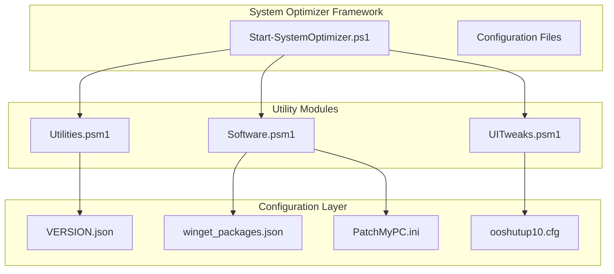
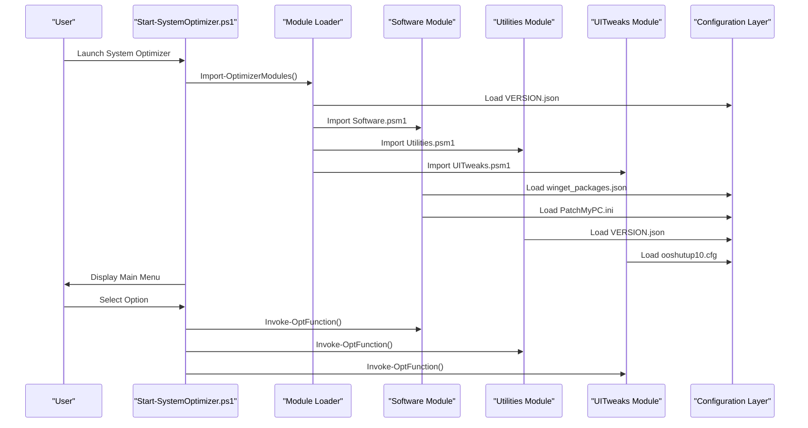
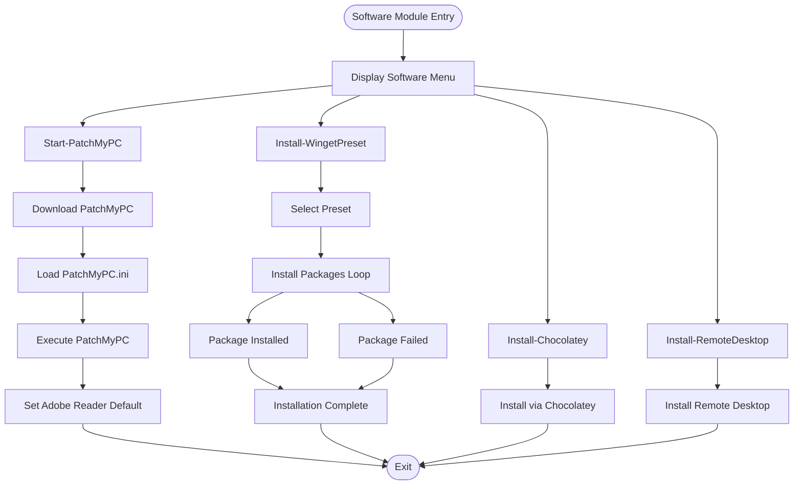
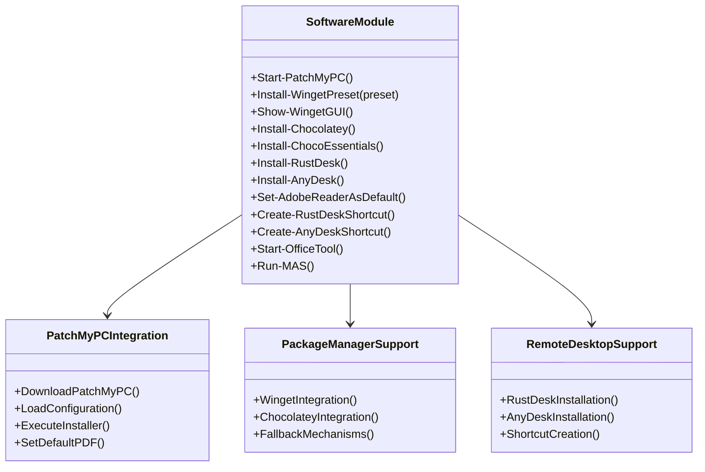
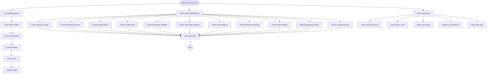
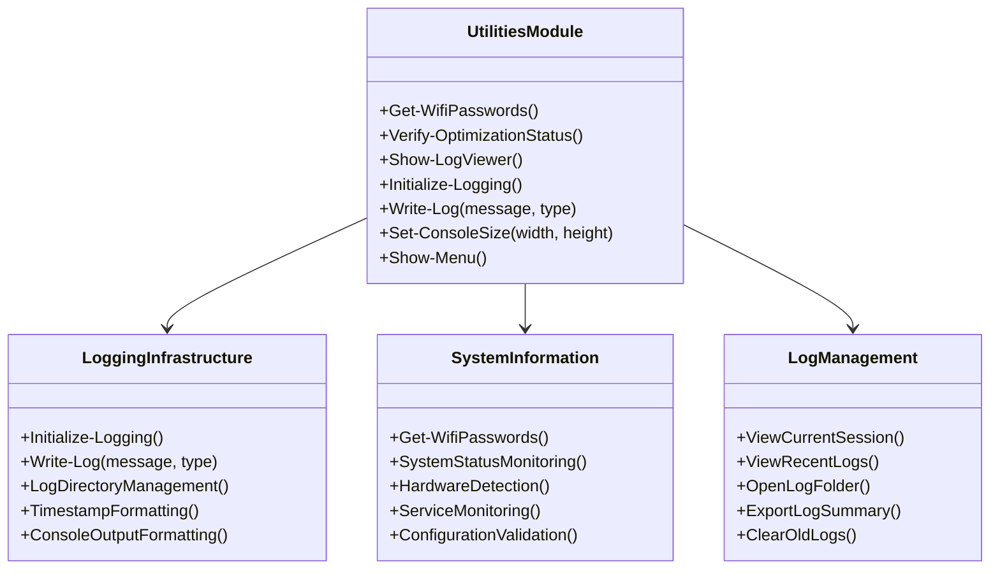
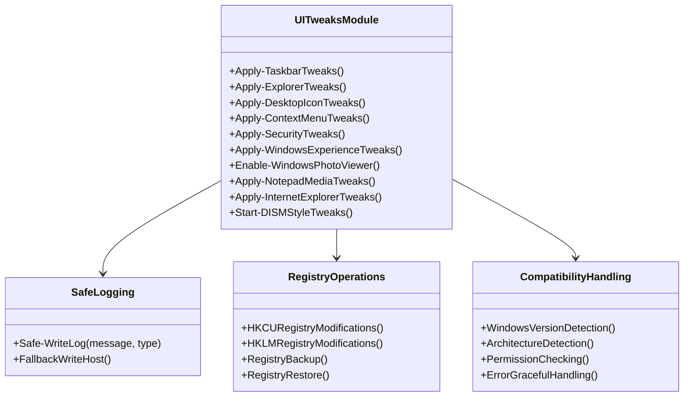
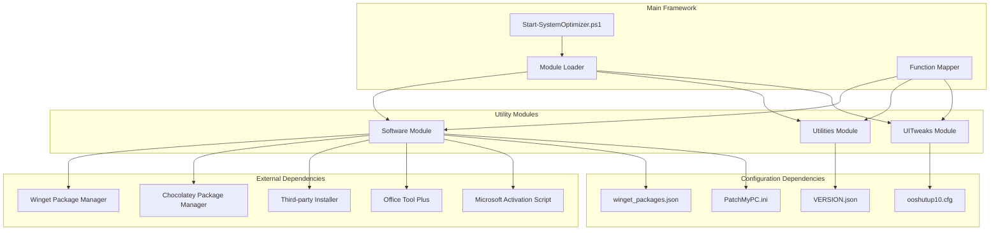

# Utility Modules

<cite>
**Referenced Files in This Document**
- [Software.psm1](file://modules/Software.psm1)
- [Utilities.psm1](file://modules/Utilities.psm1)
- [UITweaks.psm1](file://modules/UITweaks.psm1)
- [Start-SystemOptimizer.ps1](file://Start-SystemOptimizer.ps1)
- [VERSION.json](file://configs/VERSION.json)
- [winget_packages.json](file://configs/winget_packages.json)
- [PatchMyPC.ini](file://configs/PatchMyPC.ini)
- [ooshutup10.cfg](file://configs/ooshutup10.cfg)
</cite>

## Table of Contents
1. [Introduction](#introduction)
2. [Project Structure](#project-structure)
3. [Core Components](#core-components)
4. [Architecture Overview](#architecture-overview)
5. [Detailed Component Analysis](#detailed-component-analysis)
6. [Dependency Analysis](#dependency-analysis)
7. [Performance Considerations](#performance-considerations)
8. [Troubleshooting Guide](#troubleshooting-guide)
9. [Conclusion](#conclusion)

## Introduction

The System Optimizer's utility modules provide essential supporting functionality and user experience enhancements that complement the core optimization capabilities. This documentation focuses on three key utility modules: Software module for third-party tool integration and package manager support, Utilities module for general helper functions and system information gathering, and UITweaks module for UI customization options and Windows experience enhancements.

These modules work together to provide a comprehensive toolkit for Windows system optimization, offering both automated solutions and manual control options for users of varying technical expertise levels.

## Project Structure

The utility modules are organized as PowerShell modules within the System Optimizer framework, each serving distinct functional areas:

**Diagram sources**
- [Start-SystemOptimizer.ps1](file://Start-SystemOptimizer.ps1#L378-L474)
- [Software.psm1](file://modules/Software.psm1#L1-L50)
- [Utilities.psm1](file://modules/Utilities.psm1#L1-L10)

**Section sources**
- [Start-SystemOptimizer.ps1](file://Start-SystemOptimizer.ps1#L57-L67)
- [VERSION.json](file://configs/VERSION.json#L1-L34)

## Core Components

The utility modules provide three distinct layers of functionality:

### Software Module
Handles third-party software installation and management through multiple package managers and tools, including PatchMyPC integration, Winget presets, Chocolatey support, and remote desktop applications.

### Utilities Module  
Provides system information gathering, logging infrastructure, and administrative utilities for Wi-Fi password extraction, optimization verification, and log management.

### UITweaks Module
Focuses on user interface customization and Windows experience enhancements, offering granular control over taskbar, explorer, context menus, and system appearance settings.

**Section sources**
- [Software.psm1](file://modules/Software.psm1#L1-L50)
- [Utilities.psm1](file://modules/Utilities.psm1#L1-L10)
- [UITweaks.psm1](file://modules/UITweaks.psm1#L1-L10)

## Architecture Overview

The utility modules integrate seamlessly with the main System Optimizer framework through a centralized module loading system and consistent logging infrastructure:

**Diagram sources**
- [Start-SystemOptimizer.ps1](file://Start-SystemOptimizer.ps1#L380-L434)
- [Software.psm1](file://modules/Software.psm1#L906-L921)
- [Utilities.psm1](file://modules/Utilities.psm1#L386-L395)
- [UITweaks.psm1](file://modules/UITweaks.psm1#L616-L628)

## Detailed Component Analysis

### Software Module Analysis

The Software module serves as the primary interface for third-party software management and installation automation, integrating multiple package managers and tools.

#### Third-Party Tool Integration

The module provides comprehensive integration with external tools through automated workflows:

**Diagram sources**
- [Software.psm1](file://modules/Software.psm1#L5-L131)
- [Software.psm1](file://modules/Software.psm1#L209-L303)

#### Package Manager Support

The module implements sophisticated package manager integration with fallback mechanisms and error handling:

**Winget Integration Features:**
- Preset-based package installation (essential, developer, runtimes, gaming)
- GUI-based package selection interface
- Progress tracking and failure reporting
- Automatic Adobe Reader default PDF handler configuration

**Chocolatey Integration Features:**
- Essential package installation workflow
- Chocolatey GUI support
- Execution policy management
- Cross-platform compatibility

**Remote Desktop Applications:**
- RustDesk installation with shortcut creation
- AnyDesk installation with shortcut creation
- Multi-method installation fallback (winget → chocolatey → manual)

#### Integration Patterns

The Software module follows consistent integration patterns:

**Diagram sources**
- [Software.psm1](file://modules/Software.psm1#L906-L921)
- [Software.psm1](file://modules/Software.psm1#L209-L303)

**Section sources**
- [Software.psm1](file://modules/Software.psm1#L1-L921)

### Utilities Module Analysis

The Utilities module provides essential system administration and monitoring capabilities through comprehensive logging infrastructure and system information gathering functions.

#### System Information Gathering

The module implements robust system information gathering with real-time monitoring capabilities:

**Diagram sources**
- [Utilities.psm1](file://modules/Utilities.psm1#L5-L42)
- [Utilities.psm1](file://modules/Utilities.psm1#L44-L119)
- [Utilities.psm1](file://modules/Utilities.psm1#L121-L243)

#### Logging Infrastructure

The module implements a comprehensive logging system with multiple output formats and filtering capabilities:

**Logging Features:**
- Timestamped log entries with severity levels
- Color-coded console output for different log types
- File-based log persistence with automatic cleanup
- Structured log format for easy parsing
- Real-time log viewer with navigation capabilities

**Integration Patterns:**

**Diagram sources**
- [Utilities.psm1](file://modules/Utilities.psm1#L245-L274)
- [Utilities.psm1](file://modules/Utilities.psm1#L276-L295)
- [Utilities.psm1](file://modules/Utilities.psm1#L121-L243)

**Section sources**
- [Utilities.psm1](file://modules/Utilities.psm1#L1-L395)

### UITweaks Module Analysis

The UITweaks module provides extensive user interface customization capabilities, allowing users to fine-tune their Windows experience through registry modifications and system settings adjustments.

#### UI Customization Categories

The module organizes UI customization into logical categories with comprehensive coverage:

```mermaid
flowchart TD
Start([UITweaks Module Entry]) --> Taskbar[Apply-TaskbarTweaks]
Start --> Explorer[Apply-ExplorerTweaks]
Start --> Desktop[Apply-DesktopIconTweaks]
Start --> Context[Apply-ContextMenuTweaks]
Start --> Security[Apply-SecurityTweaks]
Start --> Experience[Apply-WindowsExperienceTweaks]
Start --> PhotoViewer[Enable-WindowsPhotoViewer]
Start --> Media[Apply-NotepadMediaTweaks]
Start --> InternetExplorer[Apply-InternetExplorerTweaks]
Start --> DISMStyle[Start-DISMStyleTweaks]
Taskbar --> PeopleBand[Hide People Band]
Taskbar --> ClockVisibility[Show Clock]
Taskbar --> ColorTheme[Enable Color Theme]
Taskbar --> Transparency[Enable Transparency]
Taskbar --> LanguageBar[Hide Language Bar]
Taskbar --> Win11Alignment[Align Start Menu]
Explorer --> OpenToThisPC[Open to This PC]
Explorer --> ShowExtensions[Show File Extensions]
Explorer --> ShowHidden[Show Hidden Files]
Explorer --> ShowProtected[Show Protected OS Files]
Explorer --> SeparateProcess[Separate Process]
Explorer --> FullPath[Show Full Path]
Explorer --> DisableVideoPreview[Disable Video Preview]
Explorer --> DisableQuickAccess[Disable Quick Access Items]
Context --> EndTask[Enable End Task]
Context --> ClassicMenu[Restore Classic Menu]
Context --> RemoveDefender[Remove Defender Context Menu]
Context --> HideBitLocker[Hide BitLocker Entries]
Security --> AdminApproval[Configure Admin Approval]
Security --> DisableSmartScreen[Disable SmartScreen]
Security --> DisableSecurityWarnings[Disable Security Warnings]
Experience --> DisableSuggestions[Disable Start Suggestions]
Experience --> DisableStoreSearch[Disable Store Search]
Experience --> DisableStoreAds[Disable Store Ads]
Experience --> DisableSpotlight[Disable Windows Spotlight]
Experience --> DisableWindowsSuggestions[Disable Windows Suggestions]
Experience --> DisableNewProgramHighlighting[Disable New Program Highlighting]
Experience --> DisableAutoInstall[Disable Auto Install]
Experience --> DisableGameDVR[Disable Game DVR]
Experience --> DisableFirstLogonAnimation[Disable First Logon Animation]
PhotoViewer --> RegisterPhotoViewer[Register Photo Viewer]
Media --> EnableNotepadWrap[Enable Notepad Word Wrap]
Media --> EnableNotepadStatus[Enable Notepad Status Bar]
Media --> DisableMediaWizard[Disable Media Player Wizard]
Media --> DisableCEIP[Disable CEIP]
Media --> DisableTrkWks[Disable TrkWks Service]
Media --> ExcludeMRT[Exclude MRT from Updates]
InternetExplorer --> EnableCompatibility[Enable Compatibility View]
InternetExplorer --> EnableAutoComplete[Enable AutoComplete]
InternetExplorer --> DisableSuggestedSites[Disable Suggested Sites]
InternetExplorer --> DisableFirstRunWizard[Disable First Run Wizard]
InternetExplorer --> ConfigureAttachmentSecurity[Configure Attachment Security]
InternetExplorer --> LockToolbar[Lock Toolbar]
InternetExplorer --> SetMaxDownloads[Set Max Downloads]
InternetExplorer --> HideFeedbackButton[Hide Feedback Button]
Desktop --> IconSelection[Select Desktop Icons]
IconSelection --> ShowThisPC[Show This PC]
IconSelection --> ShowRecycleBin[Show Recycle Bin]
IconSelection --> ShowControlPanel[Show Control Panel]
IconSelection --> ShowUserFolder[Show User Folder]
IconSelection --> ShowNetwork[Show Network]
IconSelection --> ShowAllIcons[Show All Icons]
DISMStyle --> ApplyAllTweaks[Apply All Tweaks]
ApplyAllTweaks --> Taskbar
ApplyAllTweaks --> Explorer
ApplyAllTweaks --> Desktop
ApplyAllTweaks --> Context
ApplyAllTweaks --> Security
ApplyAllTweaks --> Experience
ApplyAllTweaks --> PhotoViewer
ApplyAllTweaks --> Media
ApplyAllTweaks --> InternetExplorer
```

**Diagram sources**
- [UITweaks.psm1](file://modules/UITweaks.psm1#L24-L69)
- [UITweaks.psm1](file://modules/UITweaks.psm1#L71-L125)
- [UITweaks.psm1](file://modules/UITweaks.psm1#L491-L555)

#### Safety and Compatibility Features

The module implements comprehensive safety measures and compatibility handling:

**Safety Features:**
- Safe registry modifications using HKCU (Current User) registry hive
- Fallback mechanisms for missing Write-Log function
- Graceful error handling for permission issues
- Administrative privilege checking
- Registry backup and restoration capabilities

**Compatibility Features:**
- Windows 11 specific optimizations
- Legacy Windows compatibility
- Architecture detection (x86/x64)
- PowerShell version compatibility checks
- Module availability validation

#### Integration Patterns

The UITweaks module integrates with the main System Optimizer through the centralized function mapping system:

**Diagram sources**
- [UITweaks.psm1](file://modules/UITweaks.psm1#L6-L22)
- [UITweaks.psm1](file://modules/UITweaks.psm1#L24-L69)
- [UITweaks.psm1](file://modules/UITweaks.psm1#L195-L223)

**Section sources**
- [UITweaks.psm1](file://modules/UITweaks.psm1#L1-L628)

## Dependency Analysis

The utility modules demonstrate a well-structured dependency hierarchy with clear separation of concerns and minimal coupling between components.

**Diagram sources**
- [Start-SystemOptimizer.ps1](file://Start-SystemOptimizer.ps1#L380-L521)
- [Software.psm1](file://modules/Software.psm1#L906-L921)
- [Utilities.psm1](file://modules/Utilities.psm1#L386-L395)
- [UITweaks.psm1](file://modules/UITweaks.psm1#L616-L628)

**Section sources**
- [Start-SystemOptimizer.ps1](file://Start-SystemOptimizer.ps1#L481-L521)
- [VERSION.json](file://configs/VERSION.json#L4-L32)

## Performance Considerations

The utility modules are designed with performance optimization in mind, implementing several strategies to minimize resource usage and maximize responsiveness:

### Memory Management
- Lazy loading of module components
- Efficient registry operations using batch updates
- Minimal console output buffering
- Optimized file I/O operations for logging

### Network Efficiency
- Configurable timeout settings for external operations
- Fallback mechanisms for failed network requests
- Batch processing for multiple package installations
- Progress indication for long-running operations

### Resource Optimization
- Non-blocking operations where possible
- Proper disposal of COM objects and file handles
- Efficient string concatenation and formatting
- Minimized dependency on external tools

## Troubleshooting Guide

### Common Issues and Solutions

**Software Module Issues:**
- **Winget not found**: The module automatically detects missing dependencies and provides installation guidance
- **Package installation failures**: Built-in retry mechanisms and detailed error logging
- **Adobe Reader conflicts**: Automatic conflict resolution and default PDF handler configuration

**Utilities Module Issues:**
- **Log file access denied**: Permission checking and alternative log locations
- **WiFi password extraction failures**: Fallback to manual extraction methods
- **System information gathering errors**: Graceful degradation to available information

**UITweaks Module Issues:**
- **Registry modification failures**: Safe operation using HKCU registry hive
- **Permission errors**: Automatic elevation prompt and fallback handling
- **Compatibility issues**: Windows version detection and feature availability checks

**Section sources**
- [Software.psm1](file://modules/Software.psm1#L212-L219)
- [Utilities.psm1](file://modules/Utilities.psm1#L334-L351)
- [UITweaks.psm1](file://modules/UITweaks.psm1#L6-L22)

## Conclusion

The System Optimizer's utility modules provide a comprehensive foundation for Windows system optimization through their specialized functionality and seamless integration patterns. Each module addresses distinct user needs while maintaining consistency in design principles and operational reliability.

The Software module excels in third-party tool integration and package management automation, the Utilities module delivers robust system administration capabilities through intelligent logging and monitoring, and the UITweaks module offers extensive user interface customization with safety and compatibility considerations.

Together, these modules create a cohesive ecosystem that enhances the overall user experience while providing powerful optimization capabilities for Windows systems of all configurations and technical expertise levels.