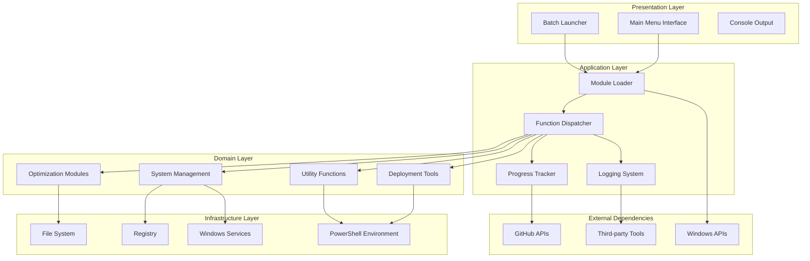
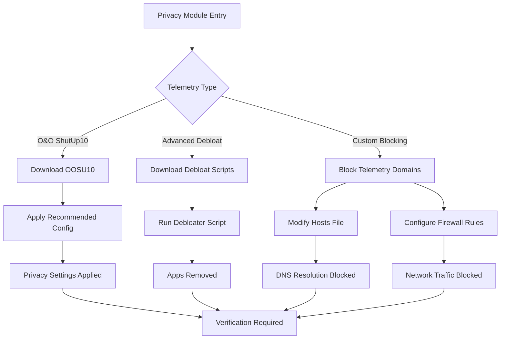
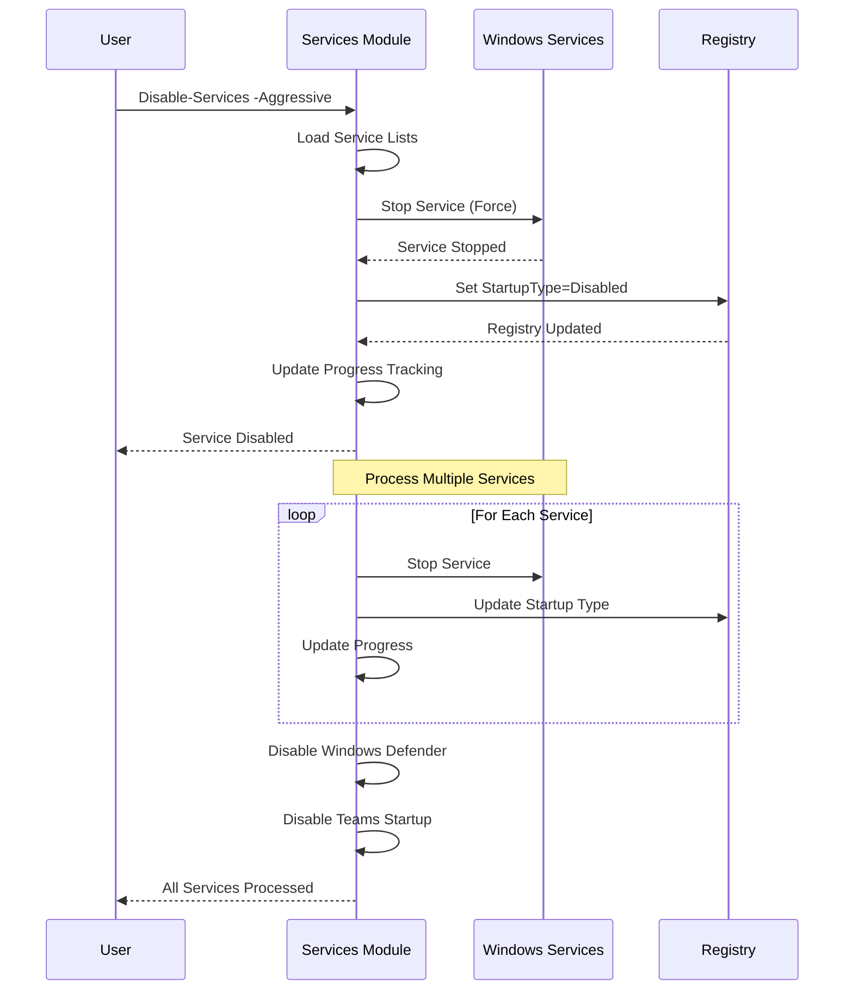
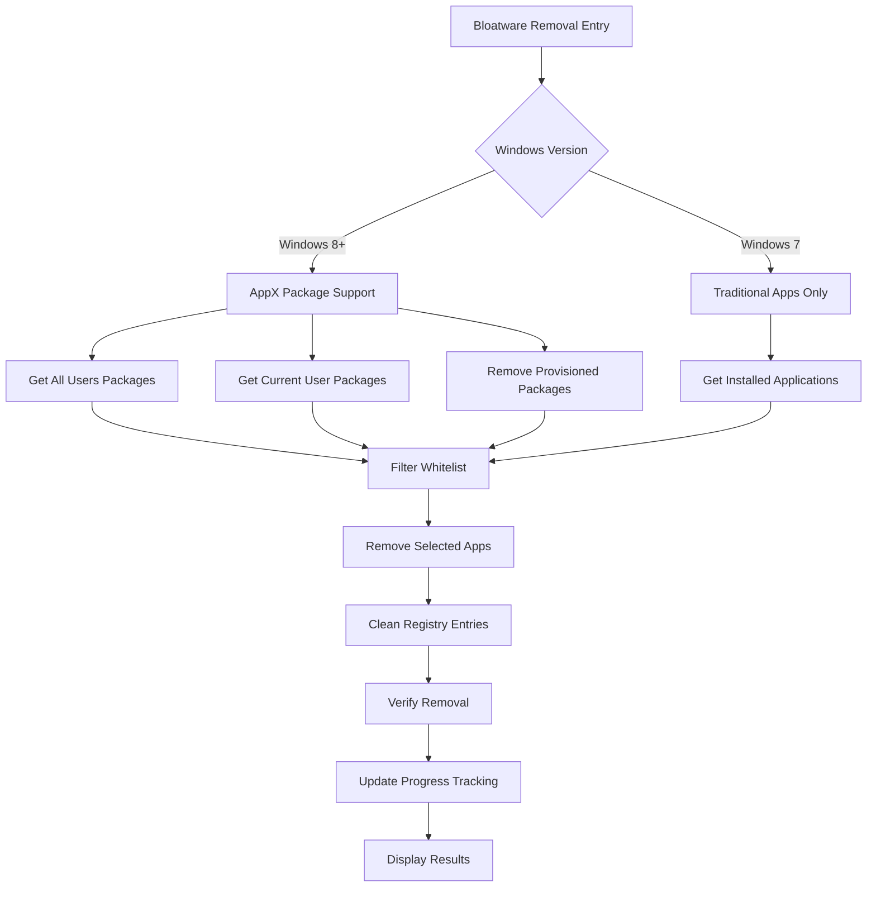
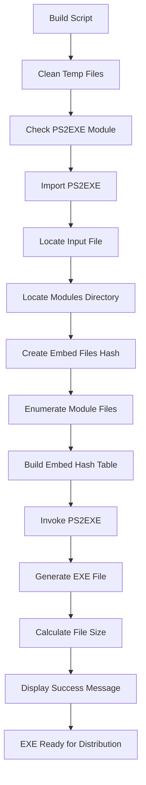
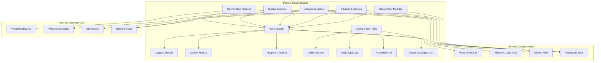

# Project Overview

<cite>
**Referenced Files in This Document**
- [README.md](file://README.md)
- [CHANGELOG.md](file://CHANGELOG.md)
- [Start-SystemOptimizer.ps1](file://Start-SystemOptimizer.ps1)
- [run_optimization.bat](file://run_optimization.bat)
- [configs/VERSION.json](file://configs/VERSION.json)
- [docs/FEATURES.md](file://docs/FEATURES.md)
- [docs/STRUCTURE.md](file://docs/STRUCTURE.md)
- [modules/Core.psm1](file://modules/Core.psm1)
- [modules/Privacy.psm1](file://modules/Privacy.psm1)
- [modules/Bloatware.psm1](file://modules/Bloatware.psm1)
- [modules/Services.psm1](file://modules/Services.psm1)
- [scripts/build_exe.ps1](file://scripts/build_exe.ps1)
- [scripts/legacy/win11_ultimate_optimization.ps1](file://scripts/legacy/win11_ultimate_optimization.ps1)
</cite>

## Update Summary
**Changes Made**
- Updated menu structure documentation to reflect the reorganized "Network Tools" and "Maintenance Tools" categories
- Corrected function mappings and menu numbering based on the current Start-SystemOptimizer.ps1 implementation
- Updated architecture diagrams to show the actual module organization and function relationships
- Revised menu options to match the current 38-menu structure with proper categorization

## Table of Contents
1. [Introduction](#introduction)
2. [Project Structure](#project-structure)
3. [Core Components](#core-components)
4. [Architecture Overview](#architecture-overview)
5. [Detailed Component Analysis](#detailed-component-analysis)
6. [Dependency Analysis](#dependency-analysis)
7. [Performance Considerations](#performance-considerations)
8. [Troubleshooting Guide](#troubleshooting-guide)
9. [Conclusion](#conclusion)

## Introduction
System Optimizer is a comprehensive Windows 10/11 optimization toolkit designed to replace previous projects like AIO and NexTool. It consolidates powerful system optimization features into a modular PowerShell solution with 27 specialized modules and 38 menu options. The project emphasizes ease of use through a standalone executable that requires no external dependencies, while maintaining flexibility for advanced users who prefer the script-based approach.

The toolkit focuses on five primary categories: privacy and telemetry control, services management, bloatware removal, performance optimization, and advanced deployment tools. It provides both guided workflows for beginners and granular controls for experienced users, with comprehensive logging, rollback capabilities, and safety features built-in.

**Section sources**
- [README.md](file://README.md#L1-L88)
- [CHANGELOG.md](file://CHANGELOG.md#L1-L69)

## Project Structure
The System Optimizer project follows a modular architecture with clear separation of concerns across 27 specialized PowerShell modules. The structure supports both standalone execution and script-based deployment, with comprehensive documentation and tooling.

```mermaid
graph TB
subgraph "Entry Points"
A[SystemOptimizer.exe] --> B[Start-SystemOptimizer.ps1]
C[run_optimization.bat] --> B
D[Start-SystemOptimizer.ps1] --> E[Module Loader]
end
subgraph "Core Modules"
E --> F[Core.psm1]
E --> G[Logging.psm1]
E --> H[Utilities.psm1]
end
subgraph "Optimization Modules"
E --> I[Telemetry.psm1]
E --> J[Services.psm1]
E --> K[Bloatware.psm1]
E --> L[Tasks.psm1]
E --> M[Registry.psm1]
E --> N[VBS.psm1]
E --> O[Network.psm1]
E --> P[OneDrive.psm1]
E --> Q[Privacy.psm1]
E --> R[UITweaks.psm1]
end
subgraph "System Modules"
E --> S[Maintenance.psm1]
E --> T[Power.psm1]
E --> U[Security.psm1]
E --> V[WindowsUpdate.psm1]
E --> W[Shutdown.psm1]
end
subgraph "Software Modules"
E --> X[Software.psm1]
E --> Y[Drivers.psm1]
end
subgraph "Advanced Modules"
E --> Z[Hardware.psm1]
E --> AA[Profiles.psm1]
E --> BB[Rollback.psm1]
E --> CC[Backup.psm1]
end
subgraph "Deployment Modules"
E --> DD[ImageTool.psm1]
E --> EE[Installer.psm1]
E --> FF[VHDDeploy.psm1]
end
subgraph "Configuration"
GG[configs/] --> HH[VERSION.json]
GG --> II[ooshutup10.cfg]
GG --> JJ[PatchMyPC.ini]
GG --> KK[winget_packages.json]
end
subgraph "Tools"
LL[tools/] --> MM[WinNTSetup]
LL --> NN[ooshutup10.exe]
LL --> OO[WUpdater.exe]
LL --> PP[Defender_Tools.exe]
end
```

**Diagram sources**
- [docs/STRUCTURE.md](file://docs/STRUCTURE.md#L1-L159)
- [configs/VERSION.json](file://configs/VERSION.json#L1-L34)

The modular design enables independent development, testing, and maintenance of each optimization category while providing a unified interface through the main entry point script. Each module encapsulates specific functionality with clear responsibilities and minimal coupling to other modules.

**Section sources**
- [docs/STRUCTURE.md](file://docs/STRUCTURE.md#L1-L159)
- [configs/VERSION.json](file://configs/VERSION.json#L1-L34)

## Core Components
System Optimizer's core functionality centers around four fundamental pillars that work together to provide comprehensive system optimization:

### Main Entry Point and Module System
The primary execution point is Start-SystemOptimizer.ps1, which serves as both the script-based entry point and the foundation for the standalone executable. The module loader dynamically imports 27 specialized modules, each containing focused optimization functions. The system supports both persistent module caching and on-demand GitHub downloads for maximum flexibility.

### Enhanced Progress Tracking System
The Core module implements a sophisticated progress tracking system that provides real-time feedback for all operations. This includes ETA calculations, detailed logging, and comprehensive result reporting. The system tracks individual item processing times to provide accurate completion estimates and maintains detailed operation histories for troubleshooting.

### Centralized Logging and Safety Features
All operations are logged to C:\System_Optimizer\Logs\ with timestamped entries, operation details, and error information. The system includes automatic backup creation, rollback capabilities, and comprehensive error handling to ensure system safety during optimization processes.

### Menu-Based Interface System
The toolkit provides a structured menu system with 38 distinct options organized into logical categories. The interface adapts based on module availability and provides clear visual indicators for available vs. unavailable functions. The menu supports both guided workflows and direct function execution.

**Section sources**
- [Start-SystemOptimizer.ps1](file://Start-SystemOptimizer.ps1#L1-L994)
- [modules/Core.psm1](file://modules/Core.psm1#L1-L200)
- [docs/FEATURES.md](file://docs/FEATURES.md#L1-L200)

## Architecture Overview
System Optimizer employs a layered architecture that separates concerns while maintaining tight integration between components. The architecture supports both standalone execution and modular development, enabling scalability and maintainability.

**Diagram sources**
- [Start-SystemOptimizer.ps1](file://Start-SystemOptimizer.ps1#L378-L474)
- [modules/Core.psm1](file://modules/Core.psm1#L1-L200)

The architecture ensures loose coupling between modules while providing strong cohesion within each functional area. The module loader handles dynamic imports, version management, and error recovery. The progress tracking system integrates across all layers to provide consistent user feedback.

**Section sources**
- [Start-SystemOptimizer.ps1](file://Start-SystemOptimizer.ps1#L378-L474)
- [modules/Core.psm1](file://modules/Core.psm1#L1-L200)

## Detailed Component Analysis

### Privacy and Telemetry Module
The Privacy module provides comprehensive control over Windows telemetry and data collection mechanisms. It includes integration with O&O ShutUp10 for privacy configuration and implements custom telemetry blocking through hosts file modifications and firewall rules.

**Diagram sources**
- [modules/Privacy.psm1](file://modules/Privacy.psm1#L1-L200)

The module supports both automated privacy configurations and manual selection of specific privacy controls. It includes comprehensive verification steps to ensure privacy settings are properly applied and provides rollback capabilities for privacy modifications.

**Section sources**
- [modules/Privacy.psm1](file://modules/Privacy.psm1#L1-L200)

### Services Management Module
The Services module implements a sophisticated service optimization system with both safe and aggressive modes. It manages over 90 services across multiple categories, providing granular control over system functionality while maintaining operational stability.

**Diagram sources**
- [modules/Services.psm1](file://modules/Services.psm1#L1-L200)

The aggressive mode removes services that may impact functionality for some users, while the safe mode focuses on non-essential services that won't break common workflows. The system includes comprehensive error handling and rollback capabilities for service modifications.

**Section sources**
- [modules/Services.psm1](file://modules/Services.psm1#L1-L200)

### Bloatware Removal Module
The Bloatware module provides comprehensive application removal capabilities with support for both AppX packages (Windows 8+) and traditional MSI installations. It implements sophisticated filtering and whitelisting to preserve essential applications while removing unwanted software.

**Diagram sources**
- [modules/Bloatware.psm1](file://modules/Bloatware.psm1#L1-L200)

The module includes extensive compatibility checking, progress tracking, and comprehensive logging for all removal operations. It preserves essential applications while removing over 40 pre-installed applications including Xbox, Microsoft apps, and third-party software.

**Section sources**
- [modules/Bloatware.psm1](file://modules/Bloatware.psm1#L1-L200)

### Standalone Executable System
The project includes a sophisticated build system that creates a standalone executable with all modules embedded. This eliminates external dependencies while maintaining the full functionality of the script-based version.

**Diagram sources**
- [scripts/build_exe.ps1](file://scripts/build_exe.ps1#L1-L80)

The build system automatically discovers all module files, embeds them into the executable, and creates a self-contained application. The resulting executable requires administrator privileges and includes all necessary modules for operation.

**Section sources**
- [scripts/build_exe.ps1](file://scripts/build_exe.ps1#L1-L80)

### Menu Structure and Organization
The System Optimizer features a comprehensive menu system organized into logical categories with 38 total options. The menu structure has been carefully designed to balance accessibility for beginners with advanced functionality for experienced users.

**Core Optimizations (Items 2-10)**: Primary system optimization functions including telemetry control, service management, bloatware removal, scheduled tasks, registry tweaks, VBS control, network tools, OneDrive removal, and maintenance tools.

**Software & Tools (Items 11-13)**: Third-party software installation and management tools including PatchMyPC, Office Tool Plus, and Microsoft Activation Scripts.

**Advanced Tools (Items 17-26)**: Power management, privacy controls, Windows Update management, driver management, Windows Update repair, Defender control, advanced debloating, WinUtil service synchronization, DISM-style UI tweaks, and Windows Image Tool.

**Utilities & Management (Items 14-15, 31-38)**: Wi-Fi password extraction, status verification, log viewing, user profile backup/restore, shutdown options, VHD deployment, Windows installer, rollback center, hardware detection, and optimization profiles.

**Section sources**
- [Start-SystemOptimizer.ps1](file://Start-SystemOptimizer.ps1#L238-L263)
- [docs/FEATURES.md](file://docs/FEATURES.md#L1-L464)

## Dependency Analysis
System Optimizer maintains minimal external dependencies while leveraging the Windows ecosystem effectively. The dependency graph reflects a clean separation between internal modules and external tools.

**Diagram sources**
- [docs/STRUCTURE.md](file://docs/STRUCTURE.md#L1-L159)
- [configs/VERSION.json](file://configs/VERSION.json#L1-L34)

The modular design ensures that each component has clear dependencies and minimal coupling to other modules. The system gracefully handles missing modules by attempting automatic downloads from GitHub, maintaining functionality even when modules aren't present locally.

**Section sources**
- [docs/STRUCTURE.md](file://docs/STRUCTURE.md#L1-L159)
- [configs/VERSION.json](file://configs/VERSION.json#L1-L34)

## Performance Considerations
System Optimizer is designed with performance optimization as a core principle. The toolkit implements several strategies to minimize resource usage and maximize execution efficiency:

### Efficient Module Loading
The module loader implements intelligent caching and version management to minimize startup overhead. Modules are cached locally and only re-downloaded when version mismatches occur, reducing network usage and improving response times.

### Progress Tracking and ETA Calculation
The progress tracking system calculates estimated completion times based on historical processing times for each operation. This allows users to plan their optimization sessions effectively and provides realistic expectations for completion times.

### Memory Management
The system implements efficient memory usage patterns, particularly important for long-running optimization sequences. Temporary files are cleaned up promptly, and large data structures are managed to prevent memory accumulation during extended operations.

### Network Optimization
When downloading modules or external tools, the system implements efficient caching strategies and parallel processing where appropriate. Network requests are minimized through intelligent module discovery and selective downloading.

## Troubleshooting Guide
System Optimizer includes comprehensive troubleshooting capabilities and error handling mechanisms:

### Common Issues and Solutions
- **Administrator Privileges**: Many operations require administrator privileges. The system checks for elevation and requests it when needed.
- **Module Loading Failures**: The system attempts automatic module downloads from GitHub when modules are missing or outdated.
- **Network Connectivity**: Operations requiring internet access will fail gracefully with informative error messages.
- **Insufficient Disk Space**: The system checks available disk space before performing operations that require significant storage.

### Logging and Diagnostics
All operations are logged to C:\System_Optimizer\Logs\ with detailed timestamps and error information. The logging system captures both successful operations and failures, enabling comprehensive troubleshooting.

### Rollback Capabilities
The rollback system maintains detailed change logs and provides mechanisms to undo most optimization operations. This includes registry backups, service state preservation, and application restoration.

### Verification Tools
The toolkit includes verification functions that check the current state of system optimizations. These tools help identify partially applied changes and verify that operations completed successfully.

**Section sources**
- [Start-SystemOptimizer.ps1](file://Start-SystemOptimizer.ps1#L306-L351)
- [docs/FEATURES.md](file://docs/FEATURES.md#L177-L183)

## Conclusion
System Optimizer represents a comprehensive evolution of Windows optimization tools, consolidating the best features from previous projects into a modern, modular PowerShell solution. The project successfully balances ease of use with advanced functionality, providing both guided workflows for beginners and granular controls for experienced users.

The modular architecture ensures maintainability and extensibility while the standalone executable provides maximum accessibility. With 27 specialized modules, 38 menu options, and comprehensive safety features, System Optimizer delivers a complete optimization solution for Windows 10/11 systems.

The project's emphasis on education and personal use licensing, combined with its robust feature set and user-friendly interface, positions it as an excellent choice for both learning Windows optimization techniques and implementing comprehensive system improvements.