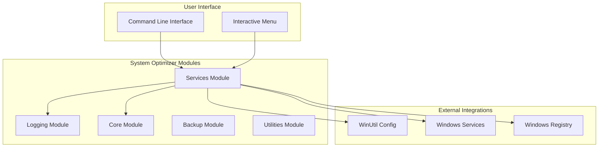
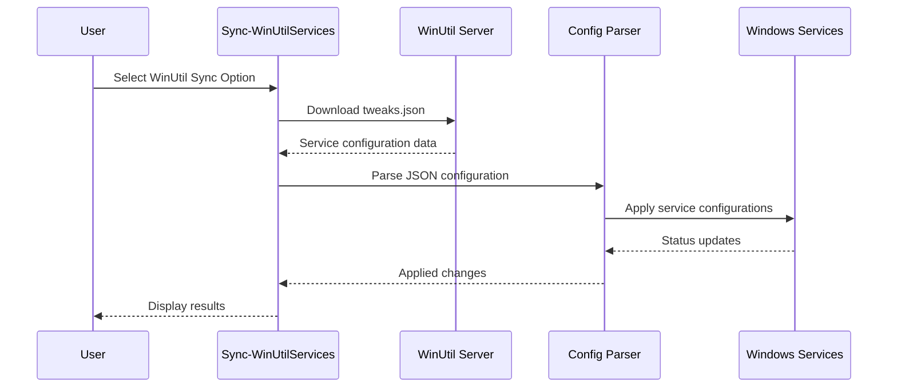
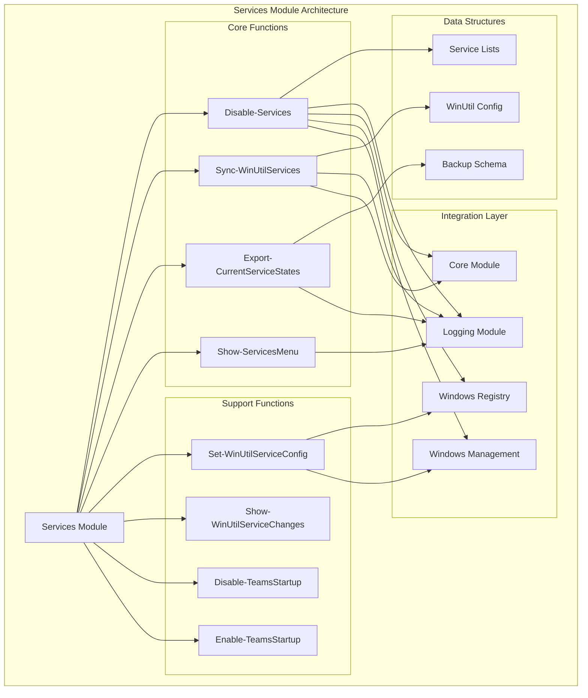
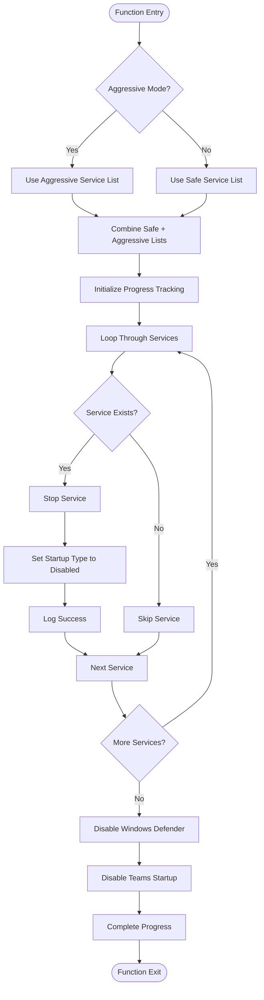
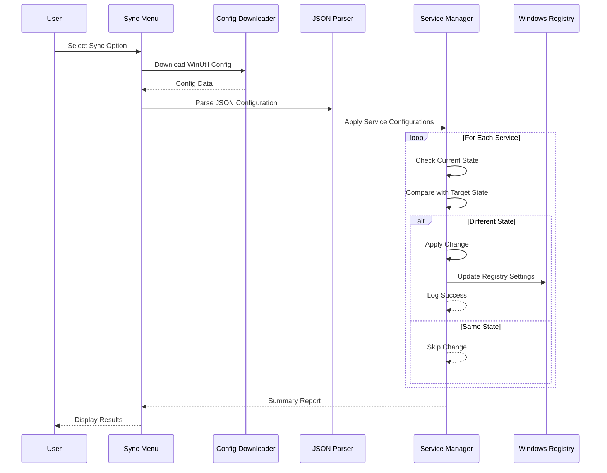
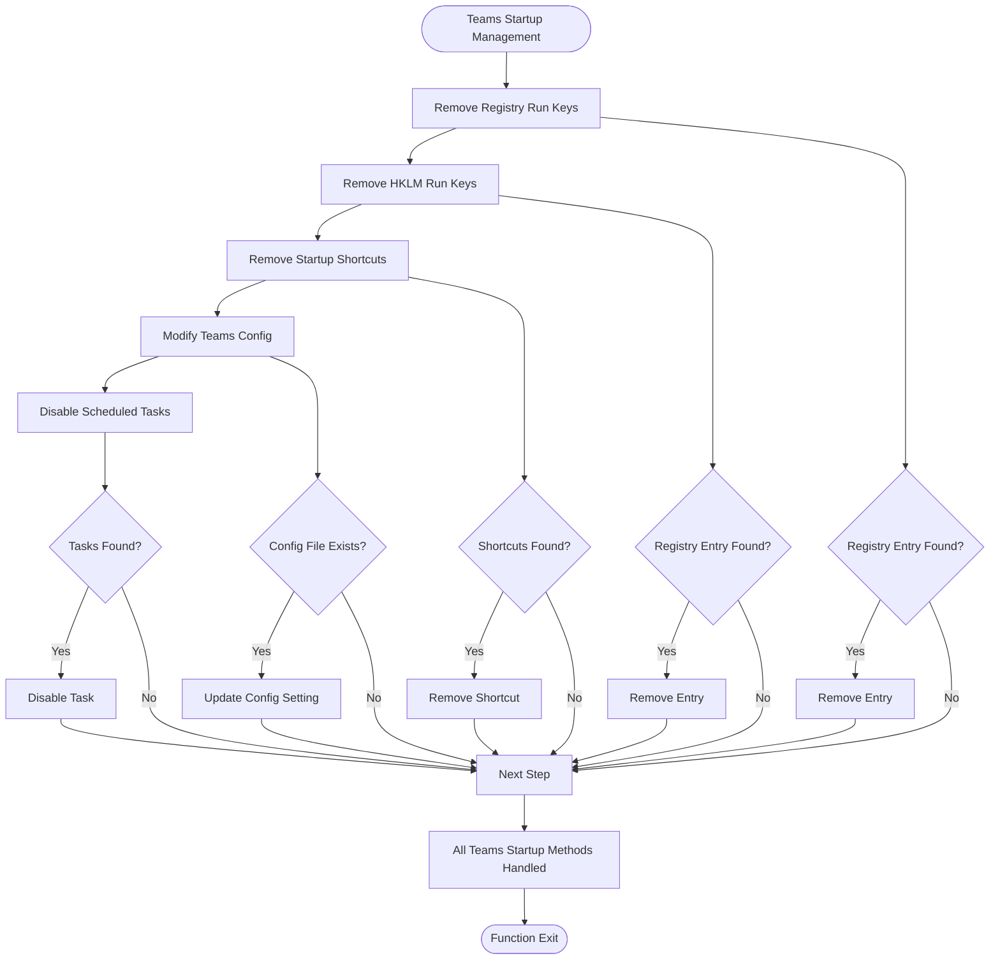
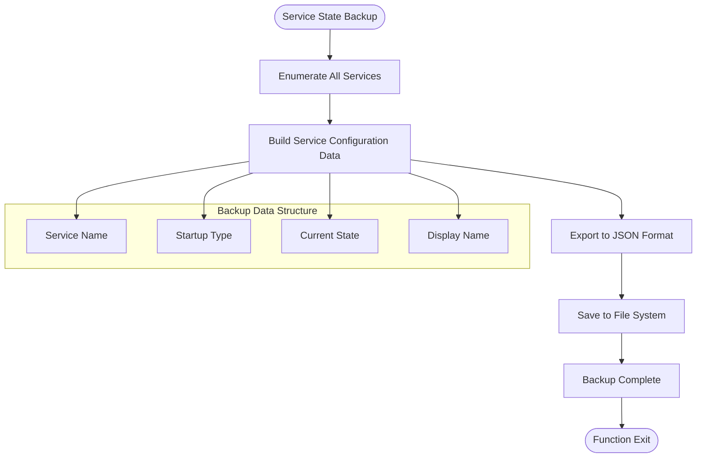
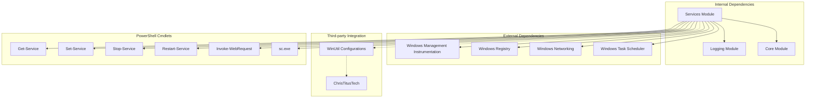

# Services Module

<cite>
**Referenced Files in This Document**
- [Services.psm1](file://modules/Services.psm1)
- [Logging.psm1](file://modules/Logging.psm1)
- [Core.psm1](file://modules/Core.psm1)
- [Start-SystemOptimizer.ps1](file://Start-SystemOptimizer.ps1)
- [README.md](file://README.md)
</cite>

## Table of Contents
1. [Introduction](#introduction)
2. [Project Structure](#project-structure)
3. [Core Components](#core-components)
4. [Architecture Overview](#architecture-overview)
5. [Detailed Component Analysis](#detailed-component-analysis)
6. [Dependency Analysis](#dependency-analysis)
7. [Performance Considerations](#performance-considerations)
8. [Troubleshooting Guide](#troubleshooting-guide)
9. [Conclusion](#conclusion)

## Introduction

The Services Module is a comprehensive Windows service management system within the System Optimizer toolkit. This module provides sophisticated service optimization capabilities with two distinct modes of operation: Safe Mode (disabling ~45 services) and Aggressive Mode (disabling ~90 services). The module integrates seamlessly with the broader System Optimizer ecosystem while offering standalone functionality for service management.

The module focuses on eliminating unnecessary Windows services that consume system resources without impacting essential functionality. It includes advanced features such as WinUtil integration, comprehensive logging, progress tracking, and backup/restore capabilities for service configurations.

## Project Structure

The Services Module is organized as part of the System Optimizer's modular architecture, designed for maintainability and extensibility:

**Diagram sources**
- [Services.psm1](file://modules/Services.psm1#L1-L40)
- [Logging.psm1](file://modules/Logging.psm1#L1-L40)
- [Core.psm1](file://modules/Core.psm1#L1-L32)

**Section sources**
- [Services.psm1](file://modules/Services.psm1#L1-L40)
- [README.md](file://README.md#L34-L46)

## Core Components

The Services Module consists of several key components that work together to provide comprehensive service management:

### Service Management Functions

The module provides four primary service management functions:

1. **Disable-Services**: Main service disabling function with dual mode support
2. **Sync-WinUtilServices**: Integration with ChrisTitusTech's WinUtil service configurations
3. **Export-CurrentServiceStates**: Backup and restore functionality for service configurations
4. **Show-ServicesMenu**: Interactive menu interface for service optimization

### Service Categories

The module organizes services into logical categories based on their necessity and impact:

```mermaid
flowchart TD
A[Service Categories] --> B[Telemetry Services]
A --> C[Xbox Gaming Services]
A --> D[Hyper-V Guest Services]
A --> E[Rarely Used Features]
A --> F[Performance Services]
A --> G[Print Services]
A --> H[Touch/Biometric Services]
A --> I[Location Services]
A --> J[Remote Desktop Services]
A --> K[Smart Card Services]
A --> L[Sync Services]
A --> M[Notification Services]
A --> N[Connected Devices]
A --> O[Windows Hello Services]
A --> P[Diagnostics Services]
A --> Q[Other Services]
B --> B1[DiagTrack]
B --> B2[dmwappushservice]
B --> B3[WerSvc]
C --> C1[Xbox Services]
D --> D1[Hyper-V Services]
F --> F1[SysMain]
F --> F2[WSearch]
```

**Diagram sources**
- [Services.psm1](file://modules/Services.psm1#L52-L169)

### WinUtil Integration

The module includes sophisticated integration with WinUtil, a popular Windows optimization tool:

**Diagram sources**
- [Services.psm1](file://modules/Services.psm1#L231-L350)
- [Services.psm1](file://modules/Services.psm1#L352-L445)

**Section sources**
- [Services.psm1](file://modules/Services.psm1#L42-L229)
- [Services.psm1](file://modules/Services.psm1#L231-L350)
- [Services.psm1](file://modules/Services.psm1#L504-L537)

## Architecture Overview

The Services Module follows a modular architecture that emphasizes separation of concerns and maintainability:

**Diagram sources**
- [Services.psm1](file://modules/Services.psm1#L42-L755)
- [Logging.psm1](file://modules/Logging.psm1#L1-L200)
- [Core.psm1](file://modules/Core.psm1#L1-L200)

The architecture demonstrates clear separation between service management logic, configuration parsing, and external integrations. Each function maintains focused responsibilities while leveraging shared infrastructure from the logging and core modules.

**Section sources**
- [Services.psm1](file://modules/Services.psm1#L1-L755)
- [Core.psm1](file://modules/Core.psm1#L34-L86)

## Detailed Component Analysis

### Disable-Services Function

The primary service management function implements sophisticated logic for service optimization:

**Diagram sources**
- [Services.psm1](file://modules/Services.psm1#L42-L229)

The function implements comprehensive error handling and progress tracking, making it suitable for both automated and interactive use cases.

**Section sources**
- [Services.psm1](file://modules/Services.psm1#L42-L229)

### WinUtil Integration System

The WinUtil integration provides advanced service configuration synchronization:

**Diagram sources**
- [Services.psm1](file://modules/Services.psm1#L231-L350)
- [Services.psm1](file://modules/Services.psm1#L352-L445)

The integration handles complex scenarios including delayed start services, automatic/manual service types, and provides comprehensive error reporting.

**Section sources**
- [Services.psm1](file://modules/Services.psm1#L231-L445)

### Teams Startup Management

The Teams startup management function demonstrates sophisticated multi-faceted approach to application startup control:

**Diagram sources**
- [Services.psm1](file://modules/Services.psm1#L539-L649)

This implementation showcases the module's attention to detail in handling various Windows startup mechanisms.

**Section sources**
- [Services.psm1](file://modules/Services.psm1#L539-L649)

### Service State Backup and Restore

The backup and restore functionality provides comprehensive service configuration management:

**Diagram sources**
- [Services.psm1](file://modules/Services.psm1#L504-L537)

The backup system captures comprehensive service metadata including startup types, current states, and display names for complete restoration capability.

**Section sources**
- [Services.psm1](file://modules/Services.psm1#L504-L537)

## Dependency Analysis

The Services Module maintains strategic dependencies that enhance functionality while preserving modularity:

**Diagram sources**
- [Services.psm1](file://modules/Services.psm1#L1-L755)
- [Logging.psm1](file://modules/Logging.psm1#L1-L200)
- [Core.psm1](file://modules/Core.psm1#L1-L200)

The dependency analysis reveals a well-structured module that leverages PowerShell's built-in capabilities while integrating with external systems through controlled interfaces.

**Section sources**
- [Services.psm1](file://modules/Services.psm1#L1-L755)
- [Logging.psm1](file://modules/Logging.psm1#L1-L200)
- [Core.psm1](file://modules/Core.psm1#L1-L200)

## Performance Considerations

The Services Module implements several performance optimization strategies:

### Parallel Processing Approach

The module utilizes a sequential processing model optimized for reliability over speed, with progress tracking that provides immediate feedback during long operations. This approach prioritizes system stability and user experience over raw performance.

### Memory Management

Service configuration data is processed in memory-efficient chunks, with temporary objects being disposed of promptly to minimize memory footprint during extended operations.

### Network Optimization

WinUtil integration includes timeout management and retry logic to handle network connectivity issues gracefully, with appropriate error handling to prevent operation failure.

### Resource Cleanup

The module ensures proper cleanup of temporary files and registry modifications, preventing resource leaks that could impact system performance over time.

## Troubleshooting Guide

### Common Issues and Solutions

**Service Not Found Errors**
- Verify service names match Windows service identifiers
- Check if services are present in current Windows version
- Review Windows version compatibility requirements

**Permission Issues**
- Ensure administrator privileges for service modification
- Verify UAC settings allow service configuration changes
- Check if services are protected by Windows protection policies

**WinUtil Integration Problems**
- Verify internet connectivity for configuration downloads
- Check firewall settings blocking GitHub access
- Validate JSON configuration format and integrity

**Teams Startup Issues**
- Verify Teams installation path and configuration files
- Check if Teams is currently running and blocking file access
- Review Windows version compatibility for scheduled task management

### Diagnostic Commands

The module provides comprehensive logging that enables systematic troubleshooting of service management operations. Log files are automatically generated with timestamps and detailed operation information.

**Section sources**
- [Services.psm1](file://modules/Services.psm1#L203-L209)
- [Services.psm1](file://modules/Services.psm1#L267-L270)
- [Services.psm1](file://modules/Services.psm1#L423-L426)

## Conclusion

The Services Module represents a sophisticated and well-architected solution for Windows service management within the System Optimizer ecosystem. Its dual-mode approach to service optimization, comprehensive integration with external tools like WinUtil, and robust error handling make it a valuable component for system administrators and power users alike.

The module's emphasis on safety, logging, and backup capabilities demonstrates a mature approach to system optimization that balances performance improvements with system stability. The modular design ensures maintainability and extensibility for future enhancements.

Key strengths of the module include its comprehensive service categorization, sophisticated WinUtil integration, multi-faceted Teams startup management, and robust backup/restore functionality. These features collectively provide users with powerful tools for optimizing Windows system performance while maintaining control and safety.

The Services Module exemplifies best practices in PowerShell module development, with clear separation of concerns, comprehensive error handling, and thoughtful user experience design that makes complex system optimization accessible to users of varying technical expertise levels.