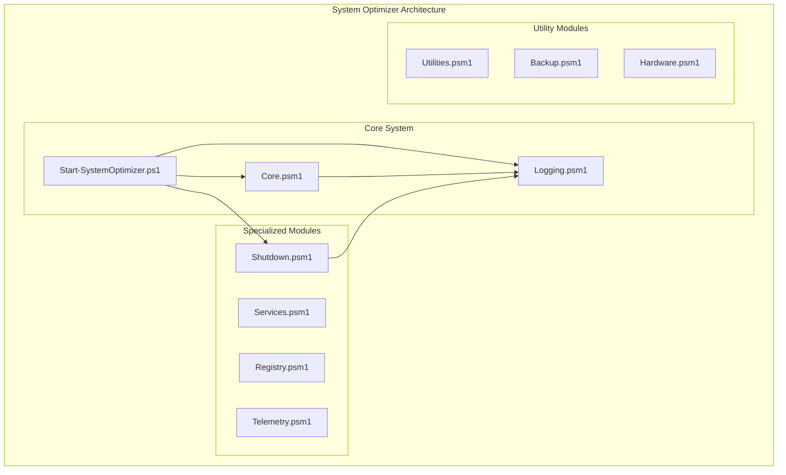
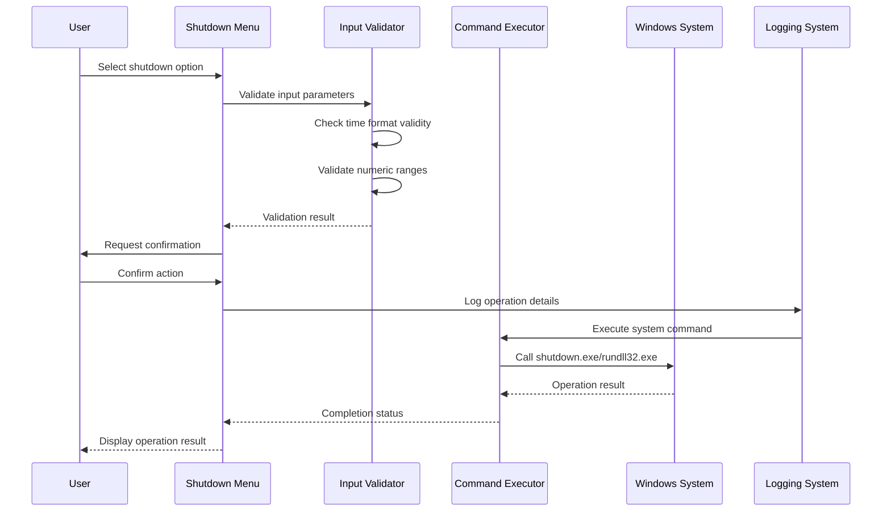
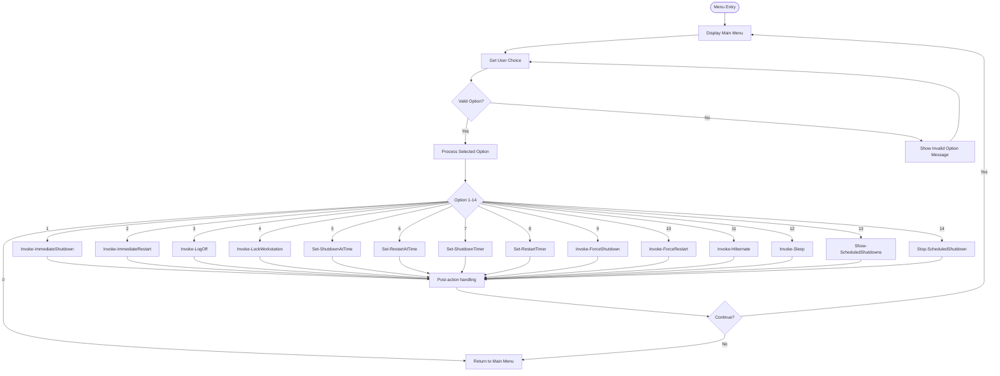
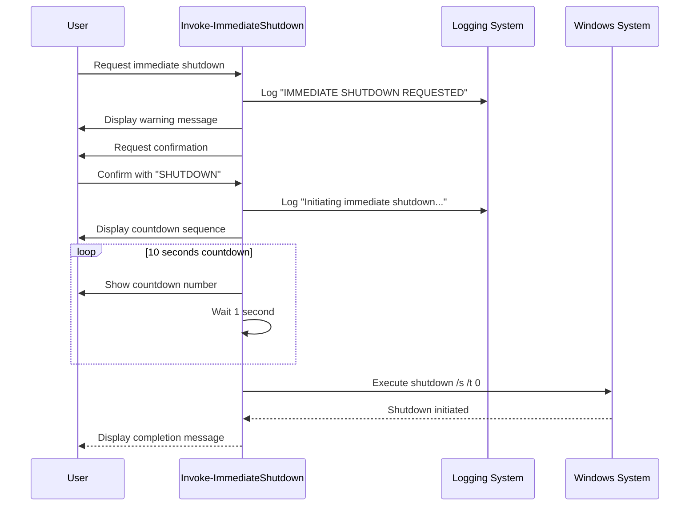
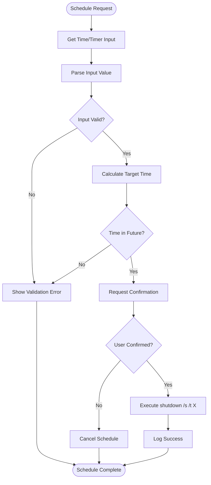
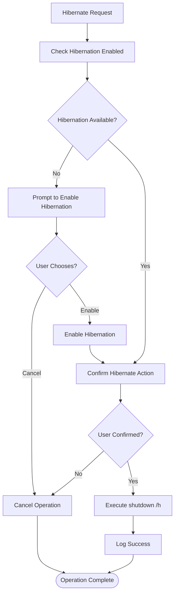
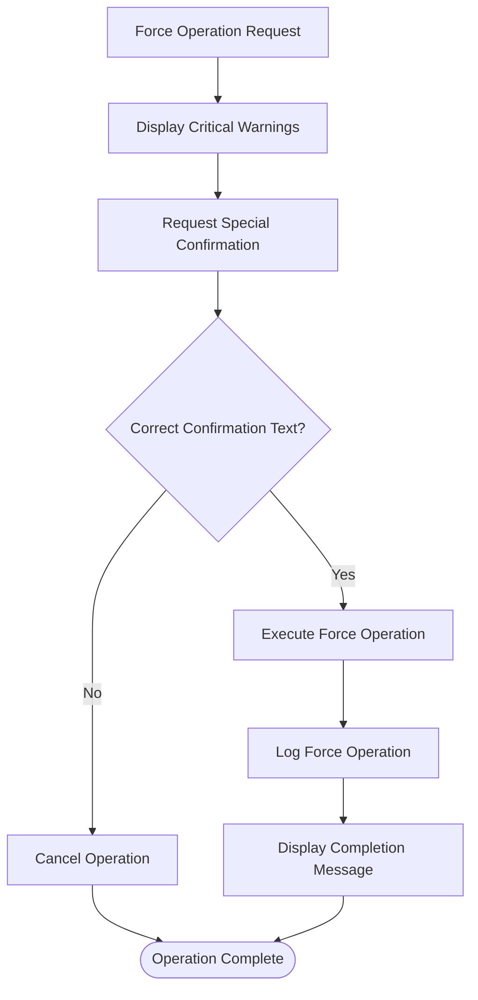
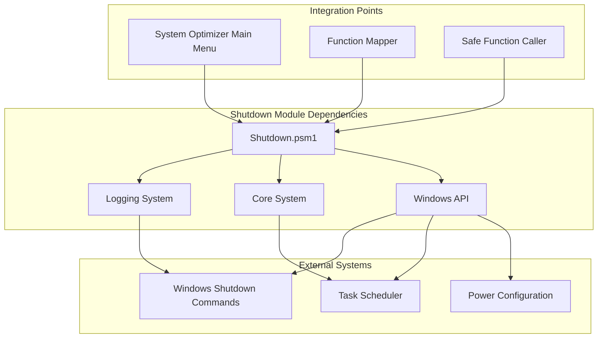

# Shutdown Module

<cite>
**Referenced Files in This Document**
- [Shutdown.psm1](file://modules/Shutdown.psm1)
- [Core.psm1](file://modules/Core.psm1)
- [Logging.psm1](file://modules/Logging.psm1)
- [Start-SystemOptimizer.ps1](file://Start-SystemOptimizer.ps1)
- [Utilities.psm1](file://modules/Utilities.psm1)
</cite>

## Table of Contents
1. [Introduction](#introduction)
2. [Project Structure](#project-structure)
3. [Core Components](#core-components)
4. [Architecture Overview](#architecture-overview)
5. [Detailed Component Analysis](#detailed-component-analysis)
6. [Dependency Analysis](#dependency-analysis)
7. [Performance Considerations](#performance-considerations)
8. [Troubleshooting Guide](#troubleshooting-guide)
9. [Conclusion](#conclusion)

## Introduction
The Shutdown Module is a comprehensive power state management system for the System Optimizer toolkit. It provides users with complete control over their Windows system's power states, offering both immediate actions and scheduled operations. The module serves as a central hub for system shutdown, restart, sleep, hibernate, and other power-related operations, integrating seamlessly with the broader System Optimizer ecosystem.

The module implements a sophisticated menu-driven interface with extensive user interaction capabilities, including confirmation prompts, countdown timers, and safety mechanisms to prevent accidental system shutdowns. It leverages Windows-native shutdown commands and system APIs to ensure reliable operation across different Windows versions.

## Project Structure
The Shutdown Module is organized as part of the System Optimizer modular architecture, positioned alongside other specialized modules for different optimization categories. The module follows PowerShell's standard module structure with clear function exports and comprehensive documentation.

**Diagram sources**
- [Start-SystemOptimizer.ps1](file://Start-SystemOptimizer.ps1#L378-L432)
- [Shutdown.psm1](file://modules/Shutdown.psm1#L1-L526)

**Section sources**
- [Shutdown.psm1](file://modules/Shutdown.psm1#L1-L50)
- [Start-SystemOptimizer.ps1](file://Start-SystemOptimizer.ps1#L378-L432)

## Core Components
The Shutdown Module consists of several key components that work together to provide comprehensive power state management:

### Primary Functions
The module exports 14 primary functions covering all essential power state operations:

- **Interactive Menu System**: `Show-ShutdownMenu` - Central hub for all shutdown operations
- **Immediate Actions**: `Invoke-ImmediateShutdown`, `Invoke-ImmediateRestart`, `Invoke-LogOff`, `Invoke-LockWorkstation`
- **Scheduled Operations**: `Set-ShutdownAtTime`, `Set-RestartAtTime`, `Set-ShutdownTimer`, `Set-RestartTimer`
- **Advanced Operations**: `Invoke-ForceShutdown`, `Invoke-ForceRestart`, `Invoke-Hibernate`, `Invoke-Sleep`
- **Management Functions**: `Show-ScheduledShutdowns`, `Stop-ScheduledShutdown`

### Menu System Architecture
The interactive menu system provides a hierarchical interface with 14 distinct options, organized into logical categories for easy navigation and operation selection.

### Safety Mechanisms
The module implements multiple safety layers including user confirmation prompts, countdown timers, and validation checks to prevent accidental system shutdowns.

**Section sources**
- [Shutdown.psm1](file://modules/Shutdown.psm1#L8-L23)
- [Shutdown.psm1](file://modules/Shutdown.psm1#L43-L103)

## Architecture Overview
The Shutdown Module follows a layered architecture pattern that separates concerns between user interface, business logic, and system integration.

**Diagram sources**
- [Shutdown.psm1](file://modules/Shutdown.psm1#L195-L234)
- [Shutdown.psm1](file://modules/Shutdown.psm1#L361-L386)

The architecture ensures loose coupling between components while maintaining clear separation of concerns. Each function operates independently, allowing for flexible integration and testing.

**Section sources**
- [Shutdown.psm1](file://modules/Shutdown.psm1#L105-L171)
- [Shutdown.psm1](file://modules/Shutdown.psm1#L195-L275)

## Detailed Component Analysis

### Interactive Menu System
The `Show-ShutdownMenu` function serves as the primary user interface, providing an organized menu structure with 14 distinct options categorized into immediate actions, scheduled operations, advanced features, and management functions.

**Diagram sources**
- [Shutdown.psm1](file://modules/Shutdown.psm1#L43-L103)

**Section sources**
- [Shutdown.psm1](file://modules/Shutdown.psm1#L43-L103)

### Immediate Shutdown Operations
The immediate shutdown functions (`Invoke-ImmediateShutdown` and `Invoke-ImmediateRestart`) implement a safety-first approach with comprehensive user confirmation and countdown mechanisms.

**Diagram sources**
- [Shutdown.psm1](file://modules/Shutdown.psm1#L105-L137)

The countdown mechanism provides users with a clear indication of the impending shutdown, allowing them to abort if needed. The function implements a 10-second countdown with visual feedback, enhancing user experience and safety.

**Section sources**
- [Shutdown.psm1](file://modules/Shutdown.psm1#L105-L137)

### Scheduled Shutdown Implementation
The scheduled shutdown system provides flexible timing options through both time-based and timer-based scheduling mechanisms.

**Diagram sources**
- [Shutdown.psm1](file://modules/Shutdown.psm1#L195-L234)
- [Shutdown.psm1](file://modules/Shutdown.psm1#L277-L317)

The scheduling system handles both absolute time scheduling (HH:MM format) and relative timer scheduling (minutes). It includes automatic date adjustment for next-day scheduling and comprehensive input validation.

**Section sources**
- [Shutdown.psm1](file://modules/Shutdown.psm1#L195-L234)
- [Shutdown.psm1](file://modules/Shutdown.psm1#L277-L317)

### Advanced Power State Operations
The module includes sophisticated power state operations including hibernation and sleep management with automatic system capability detection.

**Diagram sources**
- [Shutdown.psm1](file://modules/Shutdown.psm1#L415-L445)

The hibernation system automatically detects whether hibernation is enabled on the system and provides guided setup for users who want to enable this feature.

**Section sources**
- [Shutdown.psm1](file://modules/Shutdown.psm1#L415-L445)

### Force Operations
The force shutdown and restart operations provide emergency system termination capabilities with comprehensive safety warnings and confirmation requirements.

**Diagram sources**
- [Shutdown.psm1](file://modules/Shutdown.psm1#L361-L386)
- [Shutdown.psm1](file://modules/Shutdown.psm1#L388-L413)

Force operations include a 5-second countdown and explicit warnings about potential data loss, ensuring users understand the risks involved.

**Section sources**
- [Shutdown.psm1](file://modules/Shutdown.psm1#L361-L386)
- [Shutdown.psm1](file://modules/Shutdown.psm1#L388-L413)

## Dependency Analysis
The Shutdown Module integrates with several other System Optimizer components to provide comprehensive functionality and consistent user experience.

**Diagram sources**
- [Start-SystemOptimizer.ps1](file://Start-SystemOptimizer.ps1#L579-L625)
- [Shutdown.psm1](file://modules/Shutdown.psm1#L105-L137)

### Module Integration
The Shutdown Module is registered in the main System Optimizer function mapping system, ensuring proper integration with the module loader and function availability checking mechanisms.

**Section sources**
- [Start-SystemOptimizer.ps1](file://Start-SystemOptimizer.ps1#L579-L625)
- [Start-SystemOptimizer.ps1](file://Start-SystemOptimizer.ps1#L861-L950)

### Logging Integration
The module leverages the centralized logging system for comprehensive operation tracking and debugging support. Each major operation writes detailed log entries with timestamps and status information.

**Section sources**
- [Shutdown.psm1](file://modules/Shutdown.psm1#L105-L137)
- [Logging.psm1](file://modules/Logging.psm1#L96-L151)

## Performance Considerations
The Shutdown Module is designed for minimal resource consumption and optimal responsiveness. Key performance characteristics include:

### Memory Efficiency
- Functions are lightweight and don't maintain persistent state
- Minimal memory footprint for all operations
- Efficient use of PowerShell built-in cmdlets

### Execution Speed
- Direct Windows API calls minimize overhead
- Immediate operations complete within milliseconds
- Scheduled operations use system-level timers

### Resource Management
- Proper cleanup of temporary variables and objects
- Efficient use of system resources for scheduled operations
- Minimal impact on system performance during operation execution

## Troubleshooting Guide

### Common Issues and Solutions

**Issue: Shutdown commands failing**
- **Cause**: Insufficient administrator privileges
- **Solution**: Run System Optimizer as Administrator
- **Prevention**: Check UAC settings and run with elevated privileges

**Issue: Scheduled shutdown not working**
- **Cause**: Incorrect time format or invalid input
- **Solution**: Verify HH:MM format for time-based scheduling
- **Prevention**: Use the built-in validation and error messages

**Issue: Hibernation not available**
- **Cause**: Hibernation disabled in system settings
- **Solution**: Enable hibernation through power options
- **Prevention**: Check hibernation availability before operation

**Issue: Force operations not responding**
- **Cause**: System protection mechanisms
- **Solution**: Allow system to complete force operation
- **Prevention**: Understand that force operations bypass normal shutdown procedures

### Error Handling Mechanisms
The module implements comprehensive error handling with user-friendly error messages and recovery options. Each function includes try-catch blocks and validation logic to handle various failure scenarios gracefully.

**Section sources**
- [Shutdown.psm1](file://modules/Shutdown.psm1#L231-L233)
- [Shutdown.psm1](file://modules/Shutdown.psm1#L499-L502)

## Conclusion
The Shutdown Module represents a comprehensive and robust solution for Windows power state management within the System Optimizer ecosystem. Its modular design, extensive functionality, and user-centric approach make it an essential component for system administrators and power users alike.

The module successfully balances functionality with safety, providing users with complete control over their system's power state while implementing multiple layers of protection against accidental operations. The integration with the broader System Optimizer framework ensures consistent user experience and reliable operation across diverse Windows environments.

Key strengths of the module include its comprehensive menu system, robust error handling, extensive logging capabilities, and seamless integration with Windows system features. The implementation demonstrates best practices in PowerShell module development, including proper function exports, comprehensive documentation, and adherence to PowerShell standards.

The Shutdown Module stands as an exemplary implementation of system administration tools, combining technical excellence with practical usability to deliver a reliable and trustworthy solution for Windows power management.