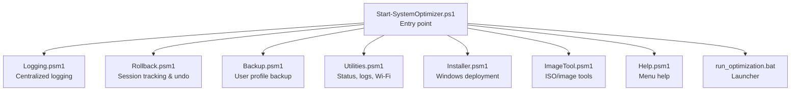
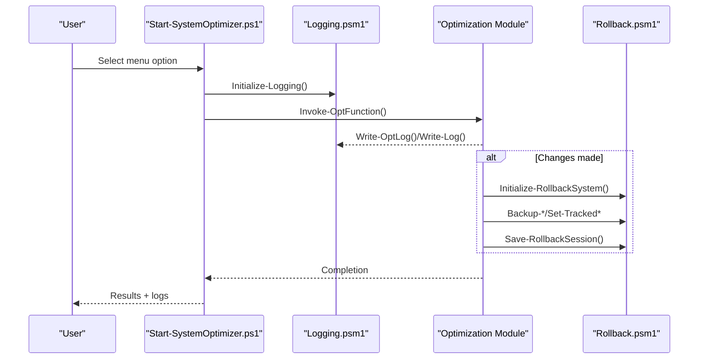
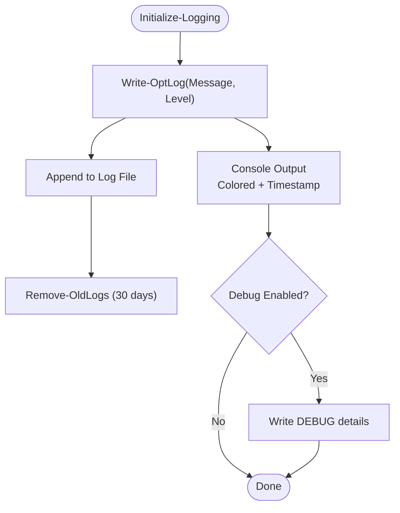
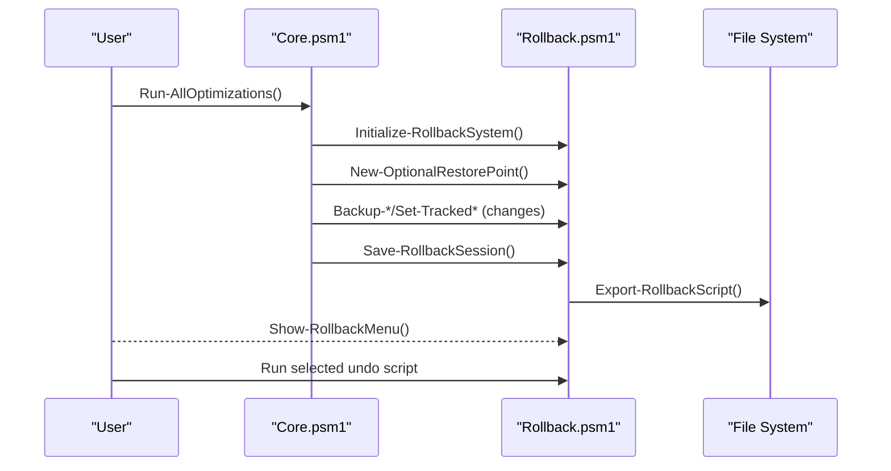
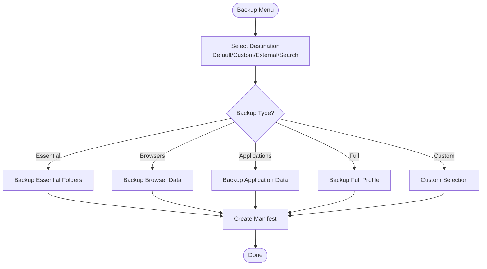
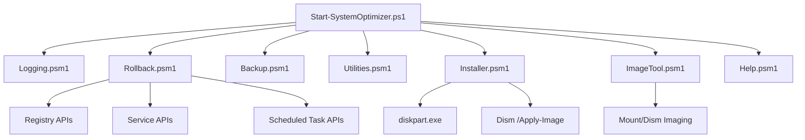

# Troubleshooting and FAQ

<cite>
**Referenced Files in This Document**
- [README.md](file://README.md)
- [CHANGELOG.md](file://CHANGELOG.md)
- [Start-SystemOptimizer.ps1](file://Start-SystemOptimizer.ps1)
- [run_optimization.bat](file://run_optimization.bat)
- [Logging.psm1](file://modules/Logging.psm1)
- [Rollback.psm1](file://modules/Rollback.psm1)
- [Backup.psm1](file://modules/Backup.psm1)
- [Utilities.psm1](file://modules/Utilities.psm1)
- [Installer.psm1](file://modules/Installer.psm1)
- [ImageTool.psm1](file://modules/ImageTool.psm1)
- [Help.psm1](file://modules/Help.psm1)
- [STRUCTURE.md](file://docs/STRUCTURE.md)
- [FEATURES.md](file://docs/FEATURES.md)
</cite>

## Table of Contents
1. [Introduction](#introduction)
2. [Project Structure](#project-structure)
3. [Core Components](#core-components)
4. [Architecture Overview](#architecture-overview)
5. [Detailed Component Analysis](#detailed-component-analysis)
6. [Dependency Analysis](#dependency-analysis)
7. [Performance Considerations](#performance-considerations)
8. [Troubleshooting Guide](#troubleshooting-guide)
9. [Conclusion](#conclusion)
10. [Appendices](#appendices)

## Introduction
This document provides comprehensive troubleshooting and Frequently Asked Questions (FAQ) for the System Optimizer. It focuses on common installation, execution, and optimization issues, error handling patterns, logging mechanisms, diagnostic procedures, rollback and recovery options, safety measures, compatibility and permissions, Windows security restrictions, tool integration failures, configuration errors, performance optimization tips, resource usage considerations, and system impact assessments. It also addresses safety, backup requirements, customization options, security considerations, legal usage guidelines, and responsibility acknowledgments.

## Project Structure
System Optimizer is a modular PowerShell-based toolkit with a standalone executable and a batch launcher. It organizes functionality across 27 modules covering core optimizations, system management, software tools, deployment, and advanced features. The runtime creates persistent directories for modules, logs, backups, and deployment workspaces.

**Diagram sources**
- [Start-SystemOptimizer.ps1](file://Start-SystemOptimizer.ps1#L1-L994)
- [Logging.psm1](file://modules/Logging.psm1#L1-L285)
- [Rollback.psm1](file://modules/Rollback.psm1#L1-L1339)
- [Backup.psm1](file://modules/Backup.psm1#L1-L1471)
- [Utilities.psm1](file://modules/Utilities.psm1#L1-L395)
- [Installer.psm1](file://modules/Installer.psm1#L1-L833)
- [ImageTool.psm1](file://modules/ImageTool.psm1#L1-L1750)
- [Help.psm1](file://modules/Help.psm1#L1-L265)
- [run_optimization.bat](file://run_optimization.bat#L1-L176)

**Section sources**
- [STRUCTURE.md](file://docs/STRUCTURE.md#L1-L159)
- [README.md](file://README.md#L1-L88)

## Core Components
- Logging subsystem: centralized logging with timestamps, colored console output, and optional debug mode.
- Rollback system: tracks changes across registry, services, scheduled tasks, and files; generates undo scripts.
- Backup system: user profile backup/restore with external drive detection and cross-computer restore.
- Utilities: status verification, Wi-Fi password extraction, and log viewer.
- Installer and ImageTool: Windows deployment, ISO creation, WIM manipulation, and VHD deployment.
- Help: dynamic menu help sourced from documentation.

**Section sources**
- [Logging.psm1](file://modules/Logging.psm1#L1-L285)
- [Rollback.psm1](file://modules/Rollback.psm1#L1-L1339)
- [Backup.psm1](file://modules/Backup.psm1#L1-L1471)
- [Utilities.psm1](file://modules/Utilities.psm1#L1-L395)
- [Installer.psm1](file://modules/Installer.psm1#L1-L833)
- [ImageTool.psm1](file://modules/ImageTool.psm1#L1-L1750)
- [Help.psm1](file://modules/Help.psm1#L1-L265)

## Architecture Overview
The system initializes logging, resolves module availability, and routes user actions to module functions. Errors are logged centrally, and the rollback system maintains session state and undo scripts. Utilities provide diagnostics and log inspection.

**Diagram sources**
- [Start-SystemOptimizer.ps1](file://Start-SystemOptimizer.ps1#L306-L351)
- [Logging.psm1](file://modules/Logging.psm1#L69-L123)
- [Rollback.psm1](file://modules/Rollback.psm1#L29-L78)

## Detailed Component Analysis

### Logging and Diagnostics
- Centralized logging supports INFO, SUCCESS, ERROR, WARNING, SECTION, DEBUG levels with timestamps and colored console output.
- Debug mode can be enabled via an environment variable to reveal additional DEBUG messages.
- Log viewer utility allows browsing recent logs, exporting summaries, and clearing old logs.

**Diagram sources**
- [Logging.psm1](file://modules/Logging.psm1#L69-L123)
- [Utilities.psm1](file://modules/Utilities.psm1#L121-L243)

**Section sources**
- [Logging.psm1](file://modules/Logging.psm1#L1-L285)
- [Utilities.psm1](file://modules/Utilities.psm1#L121-L243)

### Rollback and Recovery
- Rollback tracks registry, service, and scheduled task changes per session.
- Generates an undo script per session with PowerShell commands to revert changes.
- Optional system restore point creation is supported.

**Diagram sources**
- [Rollback.psm1](file://modules/Rollback.psm1#L29-L78)
- [Rollback.psm1](file://modules/Rollback.psm1#L461-L508)
- [Rollback.psm1](file://modules/Rollback.psm1#L514-L717)
- [Core.psm1](file://modules/Core.psm1#L698-L742)

**Section sources**
- [Rollback.psm1](file://modules/Rollback.psm1#L1-L1339)
- [Core.psm1](file://modules/Core.psm1#L698-L742)

### Backup System
- User profile backup supports essential folders, browsers, applications, full profile, and custom selections.
- External drive detection and cross-computer restore are supported.
- Backup manifests and integrity checks are available.

**Diagram sources**
- [Backup.psm1](file://modules/Backup.psm1#L33-L66)
- [Backup.psm1](file://modules/Backup.psm1#L68-L110)
- [Backup.psm1](file://modules/Backup.psm1#L702-L869)

**Section sources**
- [Backup.psm1](file://modules/Backup.psm1#L1-L1471)

### Utilities and Verification
- Wi-Fi password extraction lists saved networks and exports credentials to a file.
- Status verification inspects telemetry, services, VBS, Defender, IPv6, and background apps.
- Log viewer provides navigation of recent logs, export summary, and cleanup of old logs.

**Section sources**
- [Utilities.psm1](file://modules/Utilities.psm1#L5-L42)
- [Utilities.psm1](file://modules/Utilities.psm1#L44-L119)
- [Utilities.psm1](file://modules/Utilities.psm1#L121-L243)

### Installer and ImageTool
- Installer prepares disks (single/dual/custom), deploys Windows from ISO/WIM, and creates boot entries.
- ImageTool manages ISO creation, WIM mounting/editing, driver injection, bloatware removal, and VHD deployment.
- Both modules maintain separate logs and provide settings menus for work directories and cleanup.

**Section sources**
- [Installer.psm1](file://modules/Installer.psm1#L1-L833)
- [ImageTool.psm1](file://modules/ImageTool.psm1#L1-L1750)

### Help System
- Dynamic help parses documentation to display menu item descriptions and wraps long lines for readability.
- Falls back to online documentation if local docs are unavailable.

**Section sources**
- [Help.psm1](file://modules/Help.psm1#L1-L265)
- [FEATURES.md](file://docs/FEATURES.md#L1-L455)

## Dependency Analysis
- Entry point depends on logging, rollback, backup, utilities, installer, imagetool, and help modules.
- Rollback integrates with registry, services, and scheduled tasks APIs.
- Installer and ImageTool depend on Windows imaging and diskpart tools.

**Diagram sources**
- [Start-SystemOptimizer.ps1](file://Start-SystemOptimizer.ps1#L380-L474)
- [Rollback.psm1](file://modules/Rollback.psm1#L149-L251)
- [Installer.psm1](file://modules/Installer.psm1#L327-L433)
- [ImageTool.psm1](file://modules/ImageTool.psm1#L449-L487)

**Section sources**
- [Start-SystemOptimizer.ps1](file://Start-SystemOptimizer.ps1#L380-L474)
- [Rollback.psm1](file://modules/Rollback.psm1#L149-L251)
- [Installer.psm1](file://modules/Installer.psm1#L327-L433)
- [ImageTool.psm1](file://modules/ImageTool.psm1#L449-L487)

## Performance Considerations
- Progress tracking and ETA calculations improve user experience during long operations.
- Console sizing and progress bars adapt to different hosts (console, ISE, EXE).
- ImageTool warns about disk activity and suggests using secondary drives to minimize wear on the primary drive.

**Section sources**
- [Core.psm1](file://modules/Core.psm1#L60-L203)
- [ImageTool.psm1](file://modules/ImageTool.psm1#L143-L170)

## Troubleshooting Guide

### Installation and Execution
- Run as Administrator: The batch launcher checks for administrative privileges and elevates if needed. The entry script requires elevation.
- Standalone EXE vs. script: The standalone executable embeds modules and cleans temporary files on launch.
- Module loading: If a function is unavailable, the system attempts to reload the module or download it from GitHub.

Common symptoms and resolutions:
- “Administrator privileges required” prompt: Ensure you run the launcher or entry script with elevated privileges.
- “Function not available” errors: The system tries to reload or download missing modules; check network connectivity and retry.
- Module load failures: Review logs in the logging directory and verify module presence in the modules directory.

**Section sources**
- [run_optimization.bat](file://run_optimization.bat#L28-L36)
- [Start-SystemOptimizer.ps1](file://Start-SystemOptimizer.ps1#L6-L12)
- [Start-SystemOptimizer.ps1](file://Start-SystemOptimizer.ps1#L575-L623)

### Optimization Failures
- Telemetry and privacy tweaks: Verify settings via the status checker; some policies may require group policy refresh.
- Services and scheduled tasks: Protected services may require fallback methods; review logs for sc.exe or schtasks.exe outcomes.
- Registry changes: Ensure keys exist before modification; the rollback system records original values for restoration.

Diagnostic steps:
- Use the status verification utility to check current settings.
- Inspect logs for ERROR and WARNING entries.
- Use the log viewer to export summaries and review recent entries.

**Section sources**
- [Utilities.psm1](file://modules/Utilities.psm1#L44-L119)
- [Utilities.psm1](file://modules/Utilities.psm1#L121-L243)
- [Rollback.psm1](file://modules/Rollback.psm1#L149-L251)

### Tool Integration Failures
- Windows deployment (Installer): Requires diskpart and DISM; ensure no mounted images remain when changing work directories.
- ImageTool: Mounting WIMs can cause significant disk activity; use a secondary drive to reduce wear.
- ISO creation: Ensure oscdimg.exe is available or download it via the tool’s settings menu.

Resolution:
- Close mounted images before changing work directories.
- Verify prerequisites (diskpart, DISM, oscdimg) are present.
- Review ImageTool logs for detailed error information.

**Section sources**
- [Installer.psm1](file://modules/Installer.psm1#L327-L433)
- [ImageTool.psm1](file://modules/ImageTool.psm1#L136-L141)
- [ImageTool.psm1](file://modules/ImageTool.psm1#L143-L170)

### Configuration Errors
- Logging retention: Old logs are automatically cleaned after 30 days; adjust retention via log viewer or manually.
- Work directory changes: ImageTool allows changing the work directory; ensure no mounted images are present.
- Environment variables: Enable debug logging via the documented environment variable.

Actions:
- Use the log viewer to clear old logs or export summaries.
- Change ImageTool work directory from the settings menu.
- Set the debug flag to capture additional details.

**Section sources**
- [Logging.psm1](file://modules/Logging.psm1#L61-L66)
- [Utilities.psm1](file://modules/Utilities.psm1#L225-L243)
- [ImageTool.psm1](file://modules/ImageTool.psm1#L143-L170)

### Rollback Procedures
- Session management: Use the rollback center to view recent sessions and run generated undo scripts.
- System restore point: Optional restore point creation is supported; review prompts and confirm before proceeding.
- Undo script generation: The system creates a PowerShell script per session; run it with elevated privileges.

Steps:
- Access the rollback center from the main menu.
- Select a session and run the undo script.
- Confirm changes were reverted; restart if required.

**Section sources**
- [Rollback.psm1](file://modules/Rollback.psm1#L722-L759)
- [Rollback.psm1](file://modules/Rollback.psm1#L514-L717)
- [Rollback.psm1](file://modules/Rollback.psm1#L83-L144)

### System Recovery Options
- System restore point: Optional creation is supported; useful for quick rollback scenarios.
- User profile backup: Restore from external drives or previously backed-up locations.
- Status verification: Quickly assess current system state post-recovery.

**Section sources**
- [Rollback.psm1](file://modules/Rollback.psm1#L83-L144)
- [Backup.psm1](file://modules/Backup.psm1#L196-L291)
- [Utilities.psm1](file://modules/Utilities.psm1#L44-L119)

### Safety Measures
- Automatic system restore point creation (optional).
- Rollback system to undo changes.
- Service and registry backups before modifications.
- Comprehensive logging for troubleshooting.

**Section sources**
- [README.md](file://README.md#L77-L84)
- [CHANGELOG.md](file://CHANGELOG.md#L45-L46)
- [Start-SystemOptimizer.ps1](file://Start-SystemOptimizer.ps1#L287-L293)

### Compatibility and Permissions
- Windows 10/11 required; some features may work on Windows 7/8.1.
- Administrator privileges mandatory for most operations.
- Windows security restrictions: UAC, Defender, and service protections may require elevated or alternate methods.

**Section sources**
- [README.md](file://README.md#L28-L33)
- [Installer.psm1](file://modules/Installer.psm1#L12-L14)

### Performance Optimization Tips
- Use progress tracking to estimate completion times.
- Prefer secondary drives for heavy imaging operations.
- Limit concurrent heavy operations to reduce resource contention.

**Section sources**
- [Core.psm1](file://modules/Core.psm1#L60-L203)
- [ImageTool.psm1](file://modules/ImageTool.psm1#L143-L170)

### Frequently Asked Questions

Q: How do I check what optimizations were applied?
A: Use the status verification utility to inspect telemetry, services, VBS, Defender, IPv6, and background apps.

Q: Can I undo changes after running optimizations?
A: Yes, use the rollback center to view sessions and run generated undo scripts. Optional system restore points can also be used.

Q: Where are logs stored and how do I manage them?
A: Logs are stored under the logging directory. Use the log viewer to browse, export summaries, and clear old logs.

Q: What should I do if a module fails to load?
A: The system attempts to reload or download missing modules. Check logs and ensure network connectivity.

Q: How do I back up my user profile before optimizing?
A: Use the backup menu to select destinations (default, custom, external, or search existing backups) and choose backup types.

Q: Are there safety features to prevent risky changes?
A: Yes, the system creates optional restore points, backs up services and registry, and provides rollback sessions.

Q: How do I handle Windows security restrictions?
A: Run with Administrator privileges, and be aware that some services or features may require alternate methods or elevated contexts.

Q: What if I want to customize the optimization profile?
A: Use the optimization profiles feature to select predefined profiles or configure custom settings.

Q: How do I report issues or request features?
A: Use the repository’s issue tracker and refer to the documentation for guidance.

**Section sources**
- [Utilities.psm1](file://modules/Utilities.psm1#L44-L119)
- [Utilities.psm1](file://modules/Utilities.psm1#L121-L243)
- [Rollback.psm1](file://modules/Rollback.psm1#L722-L759)
- [Backup.psm1](file://modules/Backup.psm1#L33-L66)
- [README.md](file://README.md#L294-L298)

## Conclusion
System Optimizer provides robust logging, rollback, backup, and diagnostic capabilities to troubleshoot and recover from optimization issues. By leveraging the built-in logging system, rollback sessions, and status verification utilities, users can safely manage system changes while diagnosing and resolving common problems. Follow the troubleshooting steps and safety measures outlined above to ensure reliable operation and system recovery.

## Appendices

### Security Considerations
- Some optimizations may reduce system security (e.g., disabling VBS). Evaluate trade-offs carefully.
- Use backups and rollback to mitigate risks.
- Run with Administrator privileges only when necessary.

**Section sources**
- [README.md](file://README.md#L77-L84)
- [Rollback.psm1](file://modules/Rollback.psm1#L83-L144)

### Legal Usage Guidelines and Responsibility
- Use at your own risk; some optimizations may reduce system security.
- Create a backup first and understand the implications of each change.
- The project is provided as-is for educational and personal use.

**Section sources**
- [README.md](file://README.md#L77-L84)