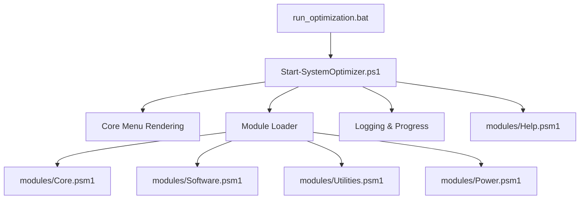
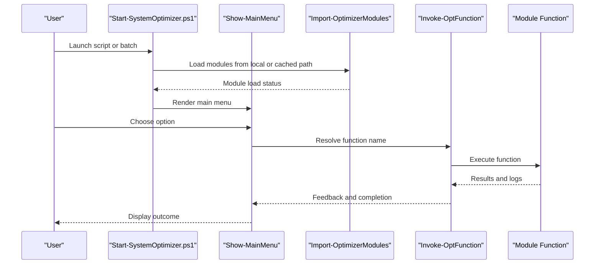
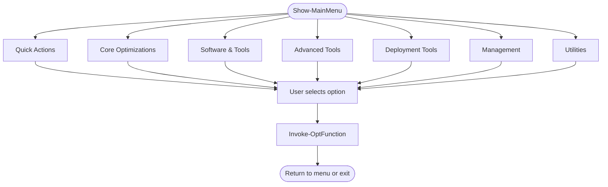
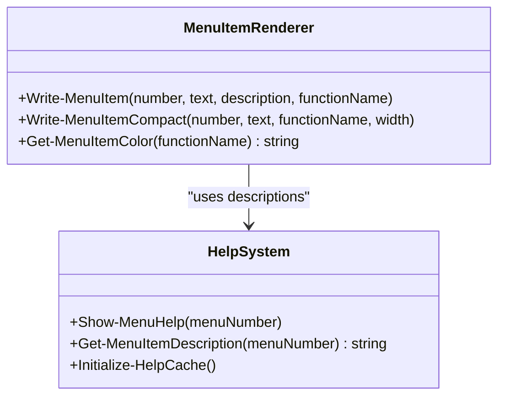
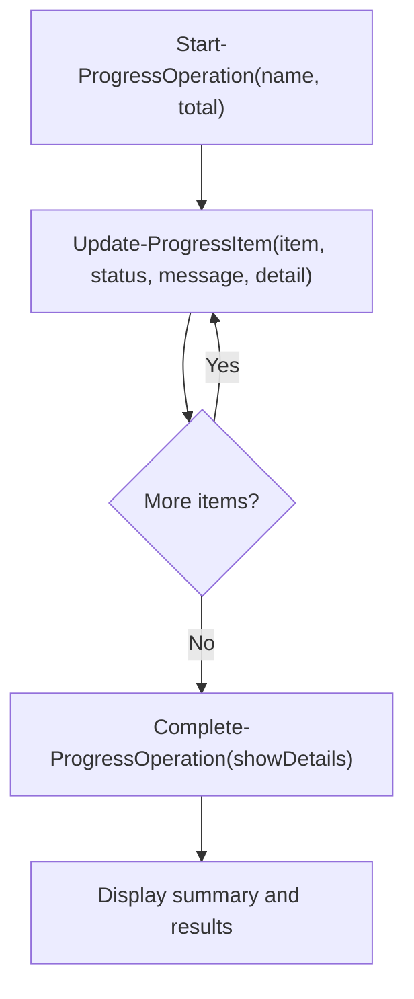
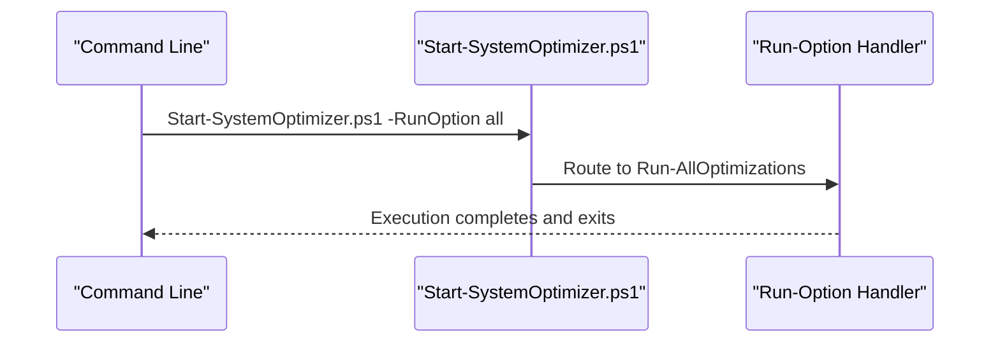
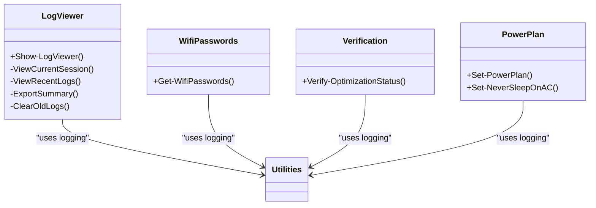
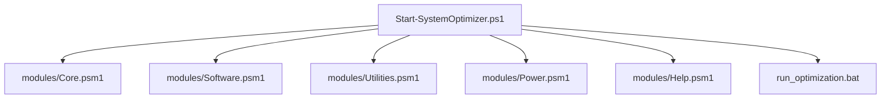

# User Interface Guide

<cite>
**Referenced Files in This Document**
- [README.md](file://README.md)
- [Start-SystemOptimizer.ps1](file://Start-SystemOptimizer.ps1)
- [run_optimization.bat](file://run_optimization.bat)
- [modules/Core.psm1](file://modules/Core.psm1)
- [modules/Help.psm1](file://modules/Help.psm1)
- [modules/Software.psm1](file://modules/Software.psm1)
- [modules/Utilities.psm1](file://modules/Utilities.psm1)
- [modules/Power.psm1](file://modules/Power.psm1)
- [modules/Network.psm1](file://modules/Network.psm1)
- [modules/Maintenance.psm1](file://modules/Maintenance.psm1)
</cite>

## Update Summary
**Changes Made**
- Updated menu categories to reflect new "Network Tools" and "Maintenance Tools" naming conventions
- Revised menu structure documentation to match current implementation
- Updated category descriptions and option listings
- Enhanced menu navigation patterns documentation
- Added comprehensive coverage of all 38 optimization options across reorganized categories

## Table of Contents
1. [Introduction](#introduction)
2. [Project Structure](#project-structure)
3. [Core Components](#core-components)
4. [Architecture Overview](#architecture-overview)
5. [Detailed Component Analysis](#detailed-component-analysis)
6. [Dependency Analysis](#dependency-analysis)
7. [Performance Considerations](#performance-considerations)
8. [Troubleshooting Guide](#troubleshooting-guide)
9. [Conclusion](#conclusion)
10. [Appendices](#appendices)

## Introduction
This guide documents the System Optimizer's menu-driven user interface and example implementations. It explains the main menu system with 38 optimization options organized into categories, navigation patterns, option selection workflows, and batch operation modes. It also covers the different UI implementations (console-enhanced, hybrid-GUI, web-ui, winforms-enhanced, and wpf-modern), command-line usage patterns, parameter options, automation scenarios, user interaction patterns, progress indicators, feedback mechanisms, customization guidance, and extension strategies for different deployment scenarios.

## Project Structure
The System Optimizer is a modular PowerShell-based toolkit with:
- A central entry script that orchestrates UI, logging, module loading, and execution
- A modules directory containing specialized modules for each functional area
- Example UI implementations referenced in the repository structure
- Batch launcher for quick-start scenarios

**Diagram sources**
- [Start-SystemOptimizer.ps1](file://Start-SystemOptimizer.ps1#L671-L800)
- [modules/Core.psm1](file://modules/Core.psm1#L698-L791)
- [modules/Software.psm1](file://modules/Software.psm1#L1-L131)
- [modules/Utilities.psm1](file://modules/Utilities.psm1#L330-L383)
- [modules/Power.psm1](file://modules/Power.psm1#L1-L93)
- [modules/Help.psm1](file://modules/Help.psm1#L104-L232)
- [run_optimization.bat](file://run_optimization.bat#L41-L176)

**Section sources**
- [README.md](file://README.md#L1-L88)
- [Start-SystemOptimizer.ps1](file://Start-SystemOptimizer.ps1#L671-L800)
- [run_optimization.bat](file://run_optimization.bat#L1-L176)

## Core Components
- Main menu renderer: Presents categorized options and handles user selection
- Module loader: Dynamically imports modules and validates function availability
- Logging and progress: Centralized logging with color-coded messages and progress bars
- Help system: Parses FEATURES.md to provide contextual descriptions
- Utility modules: Provide specialized UIs such as log viewer, Wi-Fi password extraction, verification, and power plan selection

Key UI capabilities:
- Two-column layout for compact presentation of options
- Availability-aware menu items (grayed out when unavailable)
- Progress tracking with percentage, ETA, and detailed results
- Enhanced progress rendering supporting console, ISE, and GUI modes
- Batch operation support via command-line parameters

**Section sources**
- [Start-SystemOptimizer.ps1](file://Start-SystemOptimizer.ps1#L671-L800)
- [modules/Core.psm1](file://modules/Core.psm1#L60-L251)
- [modules/Help.psm1](file://modules/Help.psm1#L104-L232)
- [modules/Utilities.psm1](file://modules/Utilities.psm1#L121-L243)

## Architecture Overview
The UI architecture centers on a single orchestrator script that:
- Initializes configuration and logging
- Loads modules dynamically
- Renders menus and routes selections to module functions
- Manages progress and feedback across operations

**Diagram sources**
- [Start-SystemOptimizer.ps1](file://Start-SystemOptimizer.ps1#L380-L434)
- [Start-SystemOptimizer.ps1](file://Start-SystemOptimizer.ps1#L575-L623)
- [Start-SystemOptimizer.ps1](file://Start-SystemOptimizer.ps1#L671-L800)

## Detailed Component Analysis

### Main Menu System
The main menu organizes 38 options across reorganized categories:
- Quick Actions: Run all optimizations, full setup workflow
- Core Optimizations: Telemetry, services, bloatware, tasks, registry, VBS, Network Tools, OneDrive, Maintenance Tools
- Software & Tools: PatchMyPC, Office Tool Plus, MAS activation, drivers
- Utilities: Wi-Fi passwords, verify status, logs, backup/restore, shutdown, rollback, hardware, profiles
- Advanced Tools: Power Plan, O&O ShutUp10, Windows Update control, Driver Management, Repair Updates, Defender Control, Full Debloat, WinUtil Sync, Privacy Tweaks, Image Tool
- Deployment Tools: VHD Native Boot, Windows Installer
- Management: Rollback, Hardware Detection, Optimization Profiles

**Updated** The menu categories have been reorganized with "Network Tools" replacing "Network" and "Maintenance Tools" replacing "Maintenance" to provide clearer categorization of system optimization functions.

Navigation patterns:
- Numeric selection for immediate execution
- Availability indicators (grayed vs. active)
- Compact two-column layout for dense presentation
- Help integration for contextual descriptions

**Diagram sources**
- [Start-SystemOptimizer.ps1](file://Start-SystemOptimizer.ps1#L671-L800)

**Section sources**
- [README.md](file://README.md#L48-L59)
- [Start-SystemOptimizer.ps1](file://Start-SystemOptimizer.ps1#L671-L800)

### Menu Rendering and Interaction
- Menu item rendering supports availability checks and compact layouts
- Color-coded output indicates availability and status
- Help integration allows viewing descriptions for any menu item

**Diagram sources**
- [Start-SystemOptimizer.ps1](file://Start-SystemOptimizer.ps1#L537-L573)
- [modules/Help.psm1](file://modules/Help.psm1#L104-L232)

**Section sources**
- [Start-SystemOptimizer.ps1](file://Start-SystemOptimizer.ps1#L537-L573)
- [modules/Help.psm1](file://modules/Help.psm1#L104-L232)

### Progress Tracking and Feedback
The core module provides a robust progress system:
- Start-ProgressOperation initializes tracking
- Update-ProgressItem records per-item status with optional verbose details
- Complete-ProgressOperation summarizes results and duration
- Show-EnhancedProgress renders progress across console, ISE, and GUI contexts
- Set-ProgressMode toggles between auto, console, and GUI modes
- Write-ProgressLog provides timestamped, color-coded messages

**Diagram sources**
- [modules/Core.psm1](file://modules/Core.psm1#L60-L251)

**Section sources**
- [modules/Core.psm1](file://modules/Core.psm1#L60-L251)

### Example UI Implementations
The repository references several UI implementations:
- console-enhanced
- hybrid-gui
- web-ui
- winforms-enhanced
- wpf-modern

These examples demonstrate different deployment scenarios and user interaction styles. While the specific files are not present in the current workspace snapshot, they align with the modular architecture and can integrate with the main entry script and module system.

[No sources needed since this section describes referenced directories conceptually]

### Command-Line Usage and Automation
The script supports extensive automation via command-line parameters:
- -Help: Displays comprehensive help and menu reference
- -SkipModuleLoad: Starts without loading modules (limited functionality)
- -RunOption: Executes a specific optimization and exits

Common automation scenarios:
- Non-interactive runs for telemetry, services, maintenance, cleanup, and debloating
- Tool launches for PatchMyPC, Office Tool Plus, MAS, and remote desktop tools
- Batch launcher for quick-start scenarios and legacy support

**Diagram sources**
- [Start-SystemOptimizer.ps1](file://Start-SystemOptimizer.ps1#L144-L301)
- [modules/Core.psm1](file://modules/Core.psm1#L698-L742)

**Section sources**
- [Start-SystemOptimizer.ps1](file://Start-SystemOptimizer.ps1#L144-L301)
- [run_optimization.bat](file://run_optimization.bat#L71-L146)

### Utility UI Examples
Utility modules provide focused UI experiences:
- Log Viewer: Browse, filter, export, and manage logs
- Wi-Fi Password Extraction: Enumerate and export saved Wi-Fi credentials
- Verification: Display system status and key settings
- Power Plan: Configure high-performance, ultimate, or balanced plans

**Diagram sources**
- [modules/Utilities.psm1](file://modules/Utilities.psm1#L121-L243)
- [modules/Utilities.psm1](file://modules/Utilities.psm1#L5-L42)
- [modules/Utilities.psm1](file://modules/Utilities.psm1#L44-L119)
- [modules/Power.psm1](file://modules/Power.psm1#L5-L93)

**Section sources**
- [modules/Utilities.psm1](file://modules/Utilities.psm1#L121-L243)
- [modules/Utilities.psm1](file://modules/Utilities.psm1#L5-L42)
- [modules/Utilities.psm1](file://modules/Utilities.psm1#L44-L119)
- [modules/Power.psm1](file://modules/Power.psm1#L5-L93)

## Dependency Analysis
The UI depends on:
- Central orchestrator for configuration, logging, and module loading
- Module functions for specific operations
- Help system for contextual descriptions
- Utility modules for specialized UIs

**Diagram sources**
- [Start-SystemOptimizer.ps1](file://Start-SystemOptimizer.ps1#L380-L434)
- [modules/Core.psm1](file://modules/Core.psm1#L698-L791)
- [modules/Software.psm1](file://modules/Software.psm1#L1-L131)
- [modules/Utilities.psm1](file://modules/Utilities.psm1#L330-L383)
- [modules/Power.psm1](file://modules/Power.psm1#L1-L93)
- [modules/Help.psm1](file://modules/Help.psm1#L104-L232)
- [run_optimization.bat](file://run_optimization.bat#L41-L176)

**Section sources**
- [Start-SystemOptimizer.ps1](file://Start-SystemOptimizer.ps1#L380-L434)
- [modules/Core.psm1](file://modules/Core.psm1#L698-L791)
- [modules/Software.psm1](file://modules/Software.psm1#L1-L131)
- [modules/Utilities.psm1](file://modules/Utilities.psm1#L330-L383)
- [modules/Power.psm1](file://modules/Power.psm1#L1-L93)
- [modules/Help.psm1](file://modules/Help.psm1#L104-L232)
- [run_optimization.bat](file://run_optimization.bat#L41-L176)

## Performance Considerations
- Progress rendering adapts to console capabilities and falls back to Unicode/ASCII when needed
- Enhanced progress supports both Write-Progress and GUI forms for different hosts
- Logging minimizes overhead while providing actionable insights
- Batch operations streamline repetitive tasks

[No sources needed since this section provides general guidance]

## Troubleshooting Guide
Common issues and resolutions:
- Module loading failures: The orchestrator attempts to reload modules or download missing ones
- Function availability: Items may appear grayed out if required modules are not present
- Logging: Use the log viewer to inspect recent sessions and export summaries
- Progress display: Switch progress modes (auto, console, GUI) if rendering issues occur

**Section sources**
- [Start-SystemOptimizer.ps1](file://Start-SystemOptimizer.ps1#L575-L623)
- [modules/Utilities.psm1](file://modules/Utilities.psm1#L121-L243)
- [modules/Core.psm1](file://modules/Core.psm1#L481-L509)

## Conclusion
The System Optimizer's UI combines a flexible, modular architecture with rich feedback mechanisms. Its menu-driven interface supports both interactive and automated workflows, with robust progress tracking and logging. The modular design enables easy customization and extension across diverse deployment scenarios.

[No sources needed since this section summarizes without analyzing specific files]

## Appendices

### Menu Categories and Options
**Updated** The menu categories have been reorganized with new naming conventions:

- Quick Actions: Run all, full setup
- Core Optimizations: Telemetry, services, bloatware, tasks, registry, VBS, Network Tools, OneDrive, Maintenance Tools
- Software & Tools: PatchMyPC, Office Tool Plus, MAS, drivers
- Utilities: Wi-Fi passwords, verify status, logs, backup/restore, shutdown, rollback, hardware, profiles
- Advanced Tools: Power Plan, O&O ShutUp10, Windows Update control, Driver Management, Repair Updates, Defender Control, Full Debloat, WinUtil Sync, Privacy Tweaks, Image Tool
- Deployment Tools: VHD Native Boot, Windows Installer
- Management: Rollback, Hardware Detection, Optimization Profiles

**Section sources**
- [README.md](file://README.md#L48-L59)
- [Start-SystemOptimizer.ps1](file://Start-SystemOptimizer.ps1#L671-L800)

### Customization and Extension Guidance
- Adding new menu options: Implement a module function and register it in the function-to-module map
- Extending UI: Use the progress system and logging helpers for consistent feedback
- Deployment variants: Integrate with example UI implementations to target different environments

**Section sources**
- [Start-SystemOptimizer.ps1](file://Start-SystemOptimizer.ps1#L480-L521)
- [modules/Core.psm1](file://modules/Core.psm1#L60-L251)

### Network Tools and Maintenance Tools Details

**Network Tools** (Category 8 in main menu):
- Network Optimizations: TCP/IP tuning, IPv6 management, Nagle's algorithm control
- Reset Network Configuration: Complete network stack restoration
- Wi-Fi Network Management: Saved networks, connections, password extraction
- Network Adapter Management: Adapter configuration and statistics
- Proxy Configuration: System-wide proxy settings
- Hosts File Editor: Domain blocking and redirection
- Network Diagnostics: Connectivity testing and monitoring
- Firewall Status: Security rule inspection
- Network Speed Test: Bandwidth measurement
- Network Profile Settings: Connection categorization
- Advanced TCP Settings: Performance tuning

**Maintenance Tools** (Category 10 in main menu):
- System Maintenance: DISM, SFC, cleanup operations
- Disk Cleanup: Multiple cleanup modes and preview
- Disk Space Report: Storage analysis
- Drive Optimization: Defragmentation and TRIM
- Check Disk: File system integrity checking
- System Restore: Restore point management
- BCD/Boot Repair: Boot configuration recovery
- Memory Diagnostic: RAM testing
- Drive Health: SMART monitoring
- Windows Update Repair: Component restoration
- DISM Repair Tools: Image health checking
- Time Sync Repair: Clock synchronization
- Search Index Rebuild: Index recreation
- Startup Program Manager: Autostart control
- Reset Group Policy: Policy restoration
- Reset WMI: Management infrastructure repair

**Section sources**
- [modules/Network.psm1](file://modules/Network.psm1#L20-L32)
- [modules/Maintenance.psm1](file://modules/Maintenance.psm1#L26-L43)